# CNN 与 Transformer 原理详解：从卷积到注意力，及其与特征描述子的关系

> 本文是一份纯理论整理，不涉及任何代码改动。
> 目标是尽可能覆盖 CNN 与 Transformer 的数学原理、架构演进、训练机制、
> 应用方向，并专门建立它们与"特征描述子"这一经典概念的对应关系，
> 同时补齐常见知识盲区。

---

## 目录

1. 总览：从手工特征到表示学习
2. CNN 的数学原理
3. CNN 的关键组件
4. CNN 的反向传播推导
5. CNN 架构演进史
6. CNN 的现代变体与算子
7. Transformer 的数学原理
8. Transformer 的关键组件
9. Transformer 的复杂度与训练
10. Transformer 架构演进史
11. 高效注意力与长序列
12. CNN vs Transformer：本质对比
13. 混合架构
14. 与特征描述子的关系（重点）
15. 应用方向
16. 知识盲区扩展
17. 速查表
18. 结论

---

## 1. 总览：从手工特征到表示学习

### 1.1 三代特征表示

| 阶段 | 代表 | 特征来源 | 人的参与 |
|---|---|---|---|
| 手工设计 | SIFT、HOG、LBP | 人根据先验设计算子 | 高 |
| 浅层学习 | PCA、Fisher Vector、BoW | 统计学习 + 手工描述子 | 中 |
| 深度表示学习 | CNN、Transformer | 端到端从数据学习 | 低 |

### 1.2 核心思想转变

**手工特征**的哲学是：

$$
\text{特征} = \mathcal{N}\big(\mathcal{Q}(\mathcal{F}(I))\big)
$$

其中：

- $I$：输入图像（原始像素矩阵）。
- $\mathcal{F}$：**特征提取算子**，由人根据先验设计（如梯度、滤波、比较），把图像变成响应图。
- $\mathcal{Q}$：**量化算子**，把连续响应离散化（如直方图统计、二值化）。
- $\mathcal{N}$：**归一化算子**，把量化结果缩放到统一尺度（如 L2 归一化、亮度归一化）。
- 整体含义：手工特征 = 归一化(量化(特征提取(图像)))，三步都由人设计。

**深度网络**的哲学是：把 $\mathcal{F}$、$\mathcal{Q}$、$\mathcal{N}$ 全部参数化，
用数据学习：

$$
\text{特征} = f_\theta(I)
$$

其中：

- $I$：输入图像。
- $f_\theta$：**参数化网络**（卷积/注意力堆叠），把 $\mathcal{F}$、$\mathcal{Q}$、$\mathcal{N}$ 三步合并成一个可微函数。
- $\theta$：网络的全部可学习参数（卷积核、权重矩阵等），由反向传播优化。
- 整体含义：不再手工设计算子，而是让网络直接从数据中学出"图像 → 特征"的映射。

**两种范式的流程对比**：

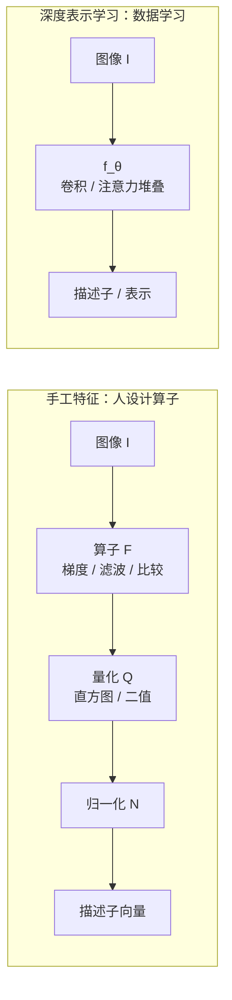

### 1.3 归纳偏置（Inductive Bias）

这是理解 CNN 与 Transformer 差异的关键概念。

| 模型 | 归纳偏置 | 后果 |
|---|---|---|
| CNN | 局部性、平移等变、层次性 | 小数据也能学好，参数高效 |
| Transformer | 弱（几乎无空间先验） | 需要大数据，但上限更高 |
| MLP | 无 | 参数爆炸，泛化差 |

**归纳偏置越强，数据需求越小，但表达上限可能受限。**
这是 CNN 与 Transformer 之争的核心。

---

## 2. CNN 的数学原理

### 2.1 卷积的定义

**连续卷积**：

$$
(f * g)(t) = \int_{-\infty}^{\infty} f(\tau)\, g(t-\tau)\, d\tau
$$

其中：

- $f$：输入信号（被卷积的函数）。
- $g$：卷积核（滤波器/系统冲激响应）。
- $t$：当前输出位置。
- $\tau$：积分变量，遍历输入信号的所有位置。
- $g(t-\tau)$：核被**翻转并平移**后的形式，这是"卷积"区别于"互相关"的关键。
- 直观含义：输出是输入与核的加权叠加，权重由核决定。

**二维连续卷积**：

$$
(f * g)(x,y) = \iint f(u,v)\, g(x-u, y-v)\, du\, dv
$$

其中：

- $(x,y)$：输出图像上的坐标。
- $(u,v)$：积分变量，遍历输入图像的所有位置。
- $f(u,v)$：输入图像在 $(u,v)$ 处的像素值。
- $g(x-u, y-v)$：核在相对位移 $(x-u, y-v)$ 处的权重。
- 含义：二维卷积是图像与核的二维加权叠加。

**离散二维卷积**：

$$
(f * g)(i,j) = \sum_m \sum_n f(m,n)\, g(i-m, j-n)
$$

其中：

- $(i,j)$：输出像素的整数坐标。
- $(m,n)$：求和变量，遍历输入像素坐标。
- $f(m,n)$：输入图像在 $(m,n)$ 处的像素值。
- $g(i-m, j-n)$：核在相对位移 $(i-m, j-n)$ 处的权重（已翻转）。
- 含义：把连续积分换成离散求和，是数字图像处理的实际计算形式。

### 2.2 深度学习中的"卷积"其实是互相关

这是第一个常见知识盲区。

真正的卷积需要**翻转核**：

$$
(f * g)(i,j) = \sum_m \sum_n f(i+m, j+n)\, g(m,n) \quad \text{（互相关）}
$$

$$
(f * g)(i,j) = \sum_m \sum_n f(i-m, j-n)\, g(m,n) \quad \text{（卷积）}
$$

其中：

- $(i,j)$：输出像素坐标。
- $(m,n)$：核内相对坐标（遍历核的每个元素）。
- $f(\cdot)$：输入像素值。
- $g(m,n)$：核在 $(m,n)$ 处的权重。
- **互相关**：输入索引为 $i+m,\ j+n$，核不翻转，直接与输入对齐相乘。
- **卷积**：输入索引为 $i-m,\ j-n$，等价于把核先翻转 180° 再对齐相乘。
- 两者只差一次核翻转；因为核可学习，翻转与否不影响表达能力，只影响参数索引。

深度学习框架（PyTorch、TensorFlow）实现的 `conv2d` 实际上是**互相关**，
因为核是可学习的，翻转与否不影响表达能力，只影响参数索引。

**结论**：说"CNN 用卷积"是习惯说法，严格说是"互相关"。

### 2.3 单通道卷积的完整形式

给定输入 $X \in \mathbb{R}^{H \times W}$，卷积核 $K \in \mathbb{R}^{k \times k}$，
偏置 $b$，步长 $s$，填充 $p$：

$$
Y(i,j) = b + \sum_{m=0}^{k-1}\sum_{n=0}^{k-1} X(i\cdot s + m - p,\ j\cdot s + n - p)\cdot K(m,n)
$$

其中：

- $Y(i,j)$：输出特征图在 $(i,j)$ 处的值。
- $X$：输入图像（单通道）。
- $K(m,n)$：卷积核在 $(m,n)$ 处的权重，$m,n\in[0,k-1]$。
- $b$：偏置项（每个输出通道一个标量）。
- $s$：步长（stride），核每次滑动的像素数。
- $p$：填充（padding），在输入边缘补零的圈数。
- $i\cdot s + m - p$：把输出坐标映射回输入坐标，$i\cdot s$ 是滑动起点，$+m$ 是核内偏移，$-p$ 抵消填充。
- 含义：输出 = 偏置 + 输入邻域与核的逐元素乘加。

输出尺寸：

$$
H_{out} = \left\lfloor \frac{H + 2p - k}{s} \right\rfloor + 1
$$

$$
W_{out} = \left\lfloor \frac{W + 2p - k}{s} \right\rfloor + 1
$$

其中：

- $H, W$：输入的高和宽。
- $k$：卷积核尺寸（假设高宽相同）。
- $p$：填充圈数，$2p$ 表示上下（或左右）各补 $p$。
- $s$：步长。
- $\lfloor\cdot\rfloor$：向下取整，保证核完整落在输入内。
- $+1$：计入第一个输出位置。
- 含义：可用的有效输入长度为 $H+2p-k$，按步长 $s$ 滑动，能放下的位置数即为输出尺寸。

**卷积的滑动计算流程**：

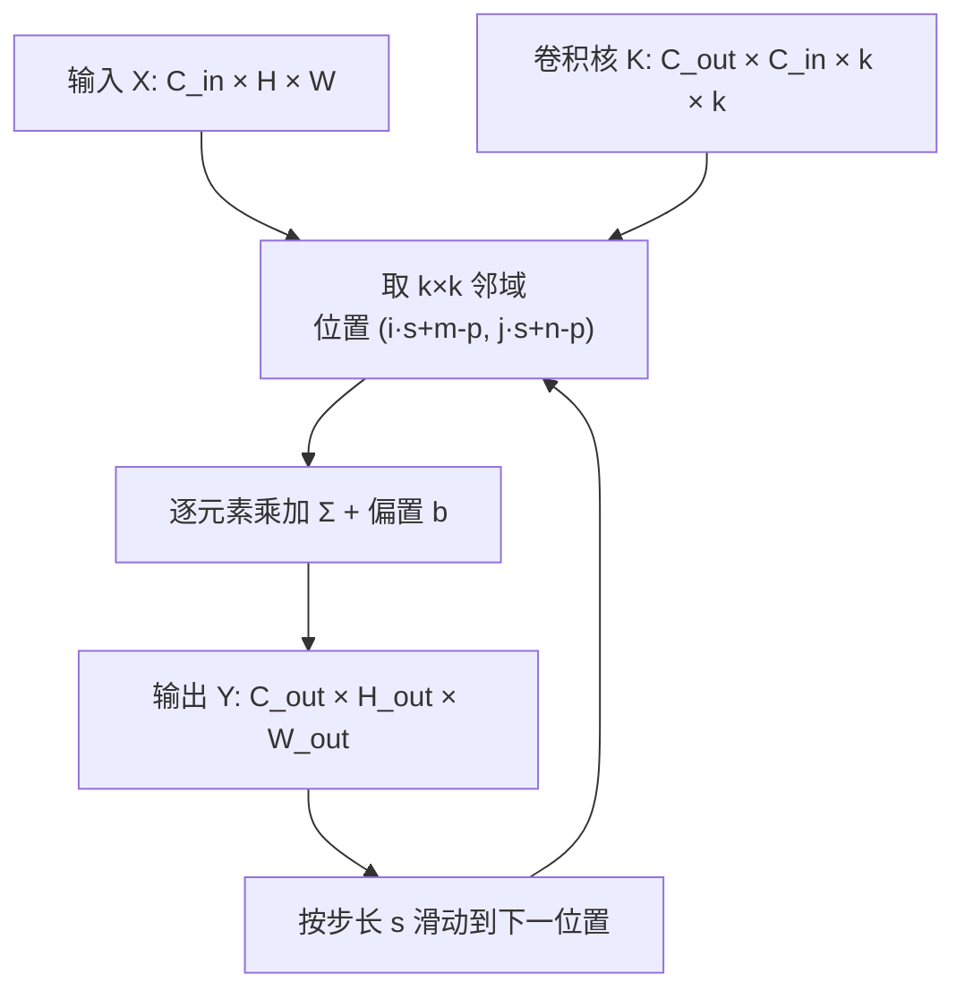

### 2.4 多通道卷积

输入 $X \in \mathbb{R}^{C_{in} \times H \times W}$，核 $K \in \mathbb{R}^{C_{out} \times C_{in} \times k \times k}$：

$$
Y(c_{out}, i, j) = b(c_{out}) + \sum_{c_{in}=0}^{C_{in}-1}\sum_{m}\sum_{n}
X(c_{in}, i s + m - p, j s + n - p)\cdot K(c_{out}, c_{in}, m, n)
$$

其中：

- $Y(c_{out}, i, j)$：第 $c_{out}$ 个输出通道在 $(i,j)$ 处的值。
- $c_{out}$：输出通道索引，$c_{out}\in[0,C_{out}-1]$。
- $c_{in}$：输入通道索引，$c_{in}\in[0,C_{in}-1]$。
- $X(c_{in},\cdot,\cdot)$：第 $c_{in}$ 个输入通道。
- $K(c_{out}, c_{in}, m, n)$：连接输入通道 $c_{in}$ 与输出通道 $c_{out}$ 的核权重。
- $b(c_{out})$：第 $c_{out}$ 个输出通道的偏置。
- 含义：每个输出通道 = 对所有输入通道的卷积结果求和，再叠加偏置（通道间全连接）。

**参数量**：

$$
\#\text{params} = C_{out} \times C_{in} \times k \times k + C_{out}
$$

其中：

- $C_{out} \times C_{in} \times k \times k$：核权重总数（每个输出通道对每个输入通道各有一个 $k\times k$ 核）。
- $+ C_{out}$：每个输出通道一个偏置。
- 含义：参数量与输入图像尺寸 $H,W$ 无关，这是权值共享带来的好处。

**计算量（FLOPs）**：

$$
\text{FLOPs} \approx 2 \times C_{out} \times C_{in} \times k^2 \times H_{out} \times W_{out}
$$

其中：

- $C_{out} \times C_{in} \times k^2$：每个输出像素需要的乘加次数。
- $H_{out} \times W_{out}$：输出像素总数。
- $\times 2$：一次乘法和一次加法各算一次浮点运算。
- 含义：计算量随通道数、核面积、输出尺寸线性增长。

### 2.5 卷积的三大性质

#### 局部连接（Local Connectivity）

每个输出只依赖输入的 $k \times k$ 邻域。参数量从全连接的 $O(H^2W^2)$ 降到 $O(k^2)$。

#### 权值共享（Weight Sharing）

同一个核在整张图上滑动，参数量与图像尺寸无关。

#### 平移等变性（Translation Equivariance）

$$
\text{Conv}(\text{Shift}(X)) = \text{Shift}(\text{Conv}(X))
$$

其中：

- $X$：输入图像。
- $\text{Shift}(\cdot)$：平移操作（把图像整体移动若干像素）。
- $\text{Conv}(\cdot)$：卷积操作。
- 含义：先平移再卷积 = 先卷积再平移，两者结果一致（只是位置相应移动），这就是**等变**。

严格地说，卷积对平移是**等变**的，不是**不变**的。
不变性由后续的池化或全局池化提供。

**等变 vs 不变**（重要区分）：

- **等变**：输入平移，输出也相应平移
- **不变**：输入平移，输出不变

$$
\text{等变}: f(T x) = T' f(x)
$$

$$
\text{不变}: f(T x) = f(x)
$$

其中：

- $f$：网络/算子。
- $x$：输入。
- $T$：作用在输入上的变换（如平移）。
- $T'$：作用在输出上的对应变换（可能与 $T$ 形式不同）。
- 等变式：变换后过网络 = 过网络后再做对应变换（输出跟着动）。
- 不变式：变换后过网络 = 直接过网络（输出不动）。

**等变与不变的区别**：

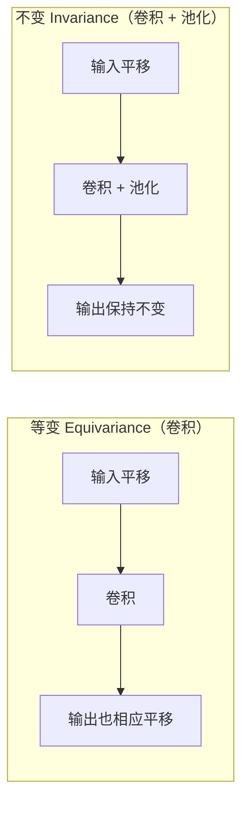

### 2.6 感受野（Receptive Field）

感受野是输出上一个像素对应输入上的区域大小。

**单层**：

$$
r = k
$$

其中：

- $r$：感受野边长。
- $k$：卷积核尺寸。
- 含义：单层卷积的感受野就等于核大小。

**多层递推**（第 $l$ 层）：

$$
r_l = r_{l-1} + (k_l - 1)\prod_{i=1}^{l-1} s_i
$$

其中：

- $r_l$：第 $l$ 层的感受野边长。
- $r_{l-1}$：上一层的感受野。
- $k_l$：第 $l$ 层的核尺寸。
- $s_i$：第 $i$ 层的步长。
- $\prod_{i=1}^{l-1} s_i$：前面所有层步长的累积乘积（即前面层对空间的降采样倍数）。
- 含义：每加一层，感受野增加 $(k_l-1)$ 乘以前面所有层的累积步长。

**有效感受野（ERF）**：实际影响输出的区域，通常远小于理论感受野，
且呈高斯分布（Luo et al. 2016）。

**为什么重要**：感受野决定了网络能"看到"多大范围。
分类需要大感受野（全局语义），分割需要小感受野（细节定位）。

**感受野逐层扩大**（3×3 卷积堆叠，步长 1）：

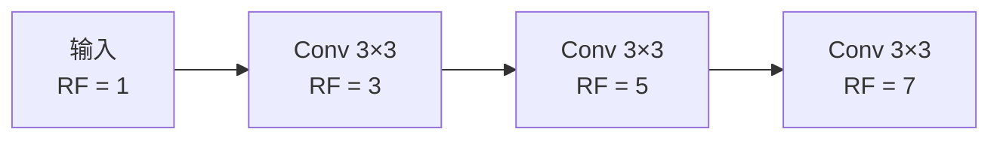

### 2.7 池化（Pooling）

**最大池化**：

$$
Y(i,j) = \max_{m,n \in \mathcal{R}} X(i s + m, j s + n)
$$

**平均池化**：

$$
Y(i,j) = \frac{1}{|\mathcal{R}|}\sum_{m,n \in \mathcal{R}} X(i s + m, j s + n)
$$

其中：

- $Y(i,j)$：输出在 $(i,j)$ 处的值。
- $\mathcal{R}$：池化窗口（如 $2\times2$ 或 $3\times3$ 的邻域）。
- $|\mathcal{R}|$：窗口内元素个数。
- $s$：池化步长。
- $X(i s + m, j s + n)$：窗口内对应的输入像素。
- 最大池化：取窗口内最大值；平均池化：取窗口内均值。

**作用**：

- 降维，减少计算
- 提供局部平移不变性
- 扩大感受野

**盲区**：池化会丢失空间信息。现代架构（如 ResNet 后期、ViT）倾向
用**步长卷积**替代池化，或用**全局平均池化（GAP）**替代全连接。

**GAP**：

$$
y_c = \frac{1}{H W}\sum_{i,j} X(c, i, j)
$$

其中：

- $y_c$：第 $c$ 个通道的全局池化输出（一个标量）。
- $X(c,i,j)$：第 $c$ 个通道在 $(i,j)$ 处的值。
- $H, W$：特征图的高和宽。
- 含义：把每个通道的整张特征图取平均，压成一个数，用于替代全连接层。

### 2.8 激活函数

| 函数 | 公式 | 特点 |
|---|---|---|
| Sigmoid | $\sigma(x)=\frac{1}{1+e^{-x}}$ | 梯度消失，输出非零中心 |
| Tanh | $\tanh(x)$ | 零中心，仍梯度消失 |
| ReLU | $\max(0,x)$ | 简单高效，神经元死亡 |
| LeakyReLU | $\max(\alpha x, x)$ | 缓解死亡 |
| PReLU | $\max(\alpha x, x)$，$\alpha$ 可学 | 自适应 |
| ELU | $x>0:x;\ x\le0:\alpha(e^x-1)$ | 负值饱和 |
| SELU | 自归一化 | 无需 BN 也可稳定 |
| GELU | $x\Phi(x)$ | Transformer 常用 |
| SiLU/Swish | $x\sigma(x)$ | 平滑非单调 |
| Mish | $x\tanh(\text{softplus}(x))$ | 平滑 |
| GLU | $\sigma(W_1x)\odot(W_2x)$ | 门控 |
| SwiGLU | $\text{Swish}(W_1x)\odot(W_2x)$ | LLM 常用 |

**符号说明**：

- $x$：输入激活值；$\sigma(\cdot)$：Sigmoid 函数。
- $\alpha$：负半轴斜率（LeakyReLU 固定，PReLU 可学）。
- $\Phi(x)$：标准正态 CDF；$\text{softplus}(x)=\ln(1+e^x)$。
- $W_1, W_2$：门控分支的权重矩阵；$\odot$：逐元素相乘。
- 含义：所有激活函数都是对输入做非线性变换，区别在于是否平滑、是否零中心、负半轴如何处理。

**GELU 的精确形式**：

$$
\text{GELU}(x) = x \cdot \Phi(x) = x \cdot \frac{1}{2}\left[1 + \text{erf}\left(\frac{x}{\sqrt{2}}\right)\right]
$$

近似形式：

$$
\text{GELU}(x) \approx 0.5x\left(1 + \tanh\left[\sqrt{\frac{2}{\pi}}(x + 0.044715x^3)\right]\right)
$$

其中：

- $x$：输入激活值。
- $\Phi(x)$：标准正态分布的累积分布函数（CDF）。
- $\text{erf}(\cdot)$：误差函数，$\Phi(x)=\frac{1}{2}[1+\text{erf}(x/\sqrt{2})]$。
- $0.044715$：拟合常数，使 tanh 近似更贴近精确 GELU。
- 含义：GELU 用输入自身的概率权重 $\Phi(x)$ 来门控 $x$，比 ReLU 更平滑。

**为什么需要非线性**：没有激活函数，多层线性变换等价于单层线性变换：

$$
W_2(W_1 x) = (W_2 W_1)x
$$

其中：

- $W_1, W_2$：两层线性变换的权重矩阵。
- $x$：输入向量。
- 含义：两个矩阵相乘仍是一个矩阵，堆叠再多线性层也只等价于一层，因此必须引入非线性。

### 2.9 归一化层

#### Batch Normalization（BN）

对每个通道在 batch 维度上归一化：

$$
\mu_c = \frac{1}{N H W}\sum_{n,i,j} x_{n,c,i,j}
$$

$$
\sigma_c^2 = \frac{1}{N H W}\sum_{n,i,j}(x_{n,c,i,j}-\mu_c)^2
$$

$$
\hat{x} = \frac{x-\mu_c}{\sqrt{\sigma_c^2+\epsilon}}
$$

$$
y = \gamma \hat{x} + \beta
$$

其中：

- $x_{n,c,i,j}$：第 $n$ 个样本、第 $c$ 个通道、位置 $(i,j)$ 的激活值。
- $N$：batch 大小；$H,W$：特征图高宽。
- $\mu_c$：第 $c$ 个通道在 batch 上的均值。
- $\sigma_c^2$：第 $c$ 个通道在 batch 上的方差。
- $\hat{x}$：归一化后的值（零均值、单位方差）。
- $\epsilon$：防止除零的小常数。
- $\gamma, \beta$：可学习的缩放和平移参数，让网络恢复表达能力。
- 含义：对每个通道，用整个 batch 的统计量做标准化，再仿射变换。

**训练时**用 batch 统计量，**推理时**用滑动平均。

**问题**：batch 小时统计不稳；RNN/序列任务不适用。

#### Layer Normalization（LN）

对每个样本在特征维度上归一化：

$$
\mu_n = \frac{1}{C H W}\sum_{c,i,j} x_{n,c,i,j}
$$

$$
\hat{x}_{n,c,i,j} = \frac{x_{n,c,i,j}-\mu_n}{\sqrt{\sigma_n^2+\epsilon}}
$$

其中：

- $\mu_n$：第 $n$ 个样本在**所有通道和空间位置**上的均值。
- $\sigma_n^2$：第 $n$ 个样本的方差。
- $C$：通道数。
- $\hat{x}_{n,c,i,j}$：归一化后的值。
- 含义：与 BN 不同，LN 的统计量只依赖单个样本，与 batch 无关，因此适合 Transformer、RNN。

**优点**：与 batch 无关，适合 Transformer、RNN。

#### Instance Normalization（IN）

对每个样本每个通道单独归一化，用于风格迁移。

#### Group Normalization（GN）

把通道分组，组内归一化，介于 LN 和 IN 之间，小 batch 友好。

#### 对比表

| 归一化 | 统计维度 | 适用 |
|---|---|---|
| BN | (N, H, W) | CNN 大 batch |
| LN | (C, H, W) | Transformer、RNN |
| IN | (H, W) | 风格迁移 |
| GN | (C/G, H, W) | 小 batch CNN |

**四种归一化的统计维度对比**（张量形状 $N \times C \times H \times W$）：

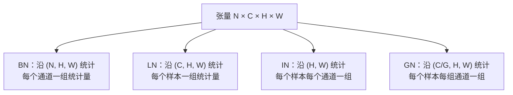

#### 盲区：Pre-Norm vs Post-Norm

**Post-Norm**（原始 Transformer）：

$$
x_{l+1} = \text{LN}(x_l + \text{Sublayer}(x_l))
$$

**Pre-Norm**（现代主流）：

$$
x_{l+1} = x_l + \text{Sublayer}(\text{LN}(x_l))
$$

其中：

- $x_l$：第 $l$ 层的输入。
- $\text{Sublayer}(\cdot)$：子层（如注意力或 FFN）。
- $\text{LN}(\cdot)$：层归一化。
- Post-Norm：先残差相加再归一化（原始 Transformer）。
- Pre-Norm：先归一化再进子层，最后残差相加（现代主流，训练更稳）。

Pre-Norm 训练更稳定，无需 warmup，但表达力略弱，常需更多层。

### 2.10 残差连接（Residual Connection）

$$
y = x + \mathcal{F}(x)
$$

其中：

- $x$：残差块的输入（恒等捷径）。
- $\mathcal{F}(x)$：残差函数（如两层卷积 + BN + ReLU）。
- $y$：残差块的输出。
- 含义：输出 = 输入 + 残差，网络只需学习"变化量" $\mathcal{F}$。

**为什么有效**：

1. **梯度直通**：反向传播时

$$
\frac{\partial y}{\partial x} = 1 + \frac{\partial \mathcal{F}}{\partial x}
$$

其中：

- $\frac{\partial y}{\partial x}$：输出对输入的梯度。
- $1$：恒等路径贡献的梯度（保证梯度不消失）。
- $\frac{\partial \mathcal{F}}{\partial x}$：残差分支贡献的梯度。
- 含义：无论残差分支梯度多小，恒等项 $1$ 都保证梯度能回传。

2. **恒等映射易学**：网络只需学残差 $\mathcal{F} = y - x$，接近 0 时容易。

3. **集成视角**：$2^L$ 条路径的隐式集成。

**盲区**：残差不是万能。极深网络仍需归一化配合。

**残差块的数据流**：

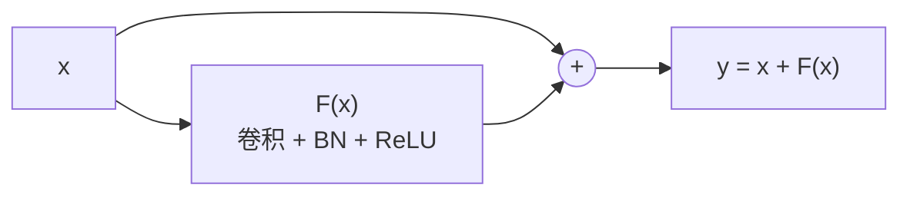

---

## 3. CNN 的关键组件

### 3.1 卷积层类型

| 类型 | 公式/说明 | 用途 |
|---|---|---|
| 标准卷积 | 见 2.4 | 通用 |
| 1×1 卷积 | $k=1$，通道混合 | 降维、升维、瓶颈 |
| 深度卷积 | 每通道独立卷积 | 轻量化 |
| 逐点卷积 | 1×1 | 配合深度卷积 |
| 深度可分离卷积 | 深度 + 逐点 | MobileNet |
| 空洞卷积 | 核元素间插零 | 扩大感受野不降分辨率 |
| 转置卷积 | 上采样 | 分割、生成 |
| 可变形卷积 | 采样位置可学 | 形变目标 |
| 分组卷积 | 通道分组 | ResNeXt、ShuffleNet |
| 可分离卷积 | 空间可分离 $k\times k \to k\times1 + 1\times k$ | 加速 |

**卷积类型的关系**：

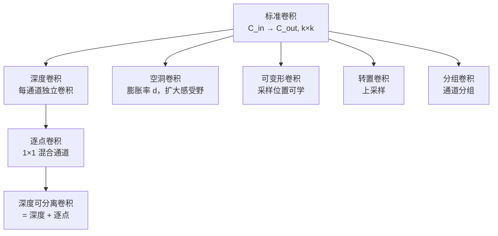

#### 空洞卷积（Dilated / Atrous Convolution）

$$
Y(i,j) = \sum_m\sum_n X(i + m\cdot d,\ j + n\cdot d)\cdot K(m,n)
$$

其中：

- $Y(i,j)$：输出在 $(i,j)$ 处的值。
- $X$：输入特征图。
- $K(m,n)$：卷积核权重。
- $d$：膨胀率（dilation rate），核元素之间插入的间隔。
- $m\cdot d,\ n\cdot d$：采样位置按膨胀率跳着取，$d=1$ 退化为标准卷积。
- 含义：不增加参数就能扩大感受野。

感受野：

$$
r = k + (k-1)(d-1)
$$

其中：

- $r$：等效感受野边长。
- $k$：核尺寸。
- $d$：膨胀率。
- 含义：$d=1$ 时 $r=k$；$d$ 越大，感受野越大。

**用途**：DeepLab 系列语义分割，不损失分辨率地扩大感受野。

#### 深度可分离卷积（Depthwise Separable）

标准卷积计算量：

$$
C_{out}\cdot C_{in}\cdot k^2\cdot H\cdot W
$$

深度可分离：

$$
\underbrace{C_{in}\cdot k^2\cdot H\cdot W}_{\text{深度}} + \underbrace{C_{out}\cdot C_{in}\cdot H\cdot W}_{\text{逐点}}
$$

其中：

- $C_{in}, C_{out}$：输入/输出通道数。
- $k$：核尺寸；$H, W$：特征图高宽。
- 深度部分：每个输入通道独立做 $k\times k$ 卷积，不混合通道。
- 逐点部分：用 $1\times1$ 卷积混合通道，把 $C_{in}$ 映射到 $C_{out}$。
- 含义：把标准卷积拆成"空间卷积 + 通道混合"两步，大幅减少计算。

**压缩比**：

$$
\frac{1}{C_{out}} + \frac{1}{k^2}
$$

其中：

- $C_{out}$：输出通道数。
- $k$：核尺寸。
- 含义：深度可分离计算量与标准卷积之比，$k=3$ 且 $C_{out}$ 大时约为 $1/8\sim1/9$。

#### 可变形卷积（Deformable Conv）

$$
Y(p_0) = \sum_{p_n \in \mathcal{R}} w(p_n)\cdot X(p_0 + p_n + \Delta p_n)
$$

其中：

- $p_0$：输出位置坐标。
- $\mathcal{R}$：规则采样网格（如 $3\times3$ 的 9 个偏移）。
- $p_n$：网格内第 $n$ 个采样点的固定偏移。
- $\Delta p_n$：**可学习的偏移量**，由额外卷积层预测，使采样点可落在非规则位置。
- $w(p_n)$：采样点权重。
- $X(\cdot)$：在（可能非整数）位置采样，需双线性插值。
- 含义：采样位置可自适应形变目标，比固定网格更灵活。

### 3.2 经典模块

| 模块 | 核心思想 |
|---|---|
| Inception | 多尺度并行卷积 + 拼接 |
| Bottleneck | 1×1 降维 → 3×3 → 1×1 升维 |
| Residual Block | 恒等捷径 |
| Dense Block | 每层连接前面所有层 |
| SE Block | 通道注意力（squeeze-excitation） |
| CBAM | 通道 + 空间注意力 |
| FPN | 自顶向下 + 横向连接 |
| ASPP | 多膨胀率空洞卷积并行 |
| Ghost | 用廉价操作生成冗余特征图 |

#### SE Block（Squeeze-and-Excitation）

**Squeeze**（全局池化）：

$$
z_c = \frac{1}{H W}\sum_{i,j} X(c,i,j)
$$

其中：

- $z_c$：第 $c$ 个通道的全局描述（一个标量）。
- $X(c,i,j)$：第 $c$ 个通道在 $(i,j)$ 处的值。
- $H, W$：特征图高宽。
- 含义：把每个通道压缩成一个数，得到通道级全局信息。

**Excitation**（门控）：

$$
s = \sigma(W_2\,\delta(W_1 z))
$$

其中：

- $z$：Squeeze 得到的通道描述向量。
- $W_1$：降维权重（把通道数压缩，如 $C\to C/r$）。
- $\delta$：ReLU 激活。
- $W_2$：升维权重（恢复回 $C$ 维）。
- $\sigma$：Sigmoid，把输出压到 $(0,1)$ 作为门控系数。
- $s$：每个通道的重要性权重向量。
- 含义：用一个小型瓶颈网络学习通道间的依赖关系。

**Scale**：

$$
\tilde{X}(c,i,j) = s_c \cdot X(c,i,j)
$$

其中：

- $\tilde{X}(c,i,j)$：重标定后的特征。
- $s_c$：第 $c$ 个通道的注意力权重。
- $X(c,i,j)$：原始特征。
- 含义：按通道重要性对特征图逐通道加权。

这是**通道注意力**的鼻祖，也是 Transformer 注意力思想的近亲。

**SE Block 的三步流程**：

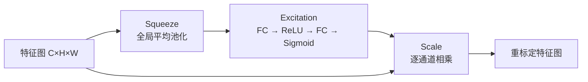

### 3.3 输出层与损失

| 任务 | 输出 | 损失 |
|---|---|---|
| 分类 | softmax | 交叉熵 |
| 回归 | 线性 | MSE / L1 / Huber |
| 检测 | 分类 + 框回归 | CE + Smooth L1 / IoU |
| 分割 | 逐像素 softmax | CE / Dice |
| 度量学习 | 嵌入向量 | 对比 / 三元组 |

**交叉熵**：

$$
\mathcal{L} = -\sum_i y_i \log \hat{y}_i
$$

其中：

- $\mathcal{L}$：损失值。
- $i$：类别索引。
- $y_i$：真实标签（one-hot，正确类为 1，其余为 0）。
- $\hat{y}_i$：预测概率（softmax 输出）。
- 含义：只惩罚正确类别的预测概率，预测越接近 1 损失越小。

**Softmax**：

$$
\hat{y}_i = \frac{e^{z_i}}{\sum_j e^{z_j}}
$$

其中：

- $z_i$：第 $i$ 类的原始得分（logit）。
- $e^{z_i}$：指数化，保证非负。
- $\sum_j e^{z_j}$：所有类别指数得分之和，用于归一化。
- $\hat{y}_i$：第 $i$ 类的概率，所有类之和为 1。

**Focal Loss**（解决类别不平衡）：

$$
\mathcal{L} = -\alpha_t (1-p_t)^\gamma \log p_t
$$

其中：

- $p_t$：模型对真实类别的预测概率。
- $(1-p_t)^\gamma$：调制因子，易分样本（$p_t$ 大）权重被压低。
- $\gamma$：聚焦参数（常取 2），越大越关注难样本。
- $\alpha_t$：类别平衡权重，缓解正负样本不平衡。
- 含义：在交叉熵基础上降低易分样本权重，让模型专注难样本。

**Dice Loss**（分割）：

$$
\mathcal{L} = 1 - \frac{2|A\cap B|}{|A|+|B|}
$$

其中：

- $A$：预测的分割区域。
- $B$：真实的分割区域。
- $|A\cap B|$：两者交集（预测正确的像素数）。
- $|A|, |B|$：各自面积。
- 含义：衡量预测与真值的重叠度（Dice 系数），重叠越高损失越小，适合类别极不平衡的分割。

---

## 4. CNN 的反向传播推导

### 4.1 卷积层的梯度

设 $Y = X * K$，损失 $\mathcal{L}$。

**对核的梯度**：

$$
\frac{\partial \mathcal{L}}{\partial K(m,n)} = \sum_{i,j} \frac{\partial \mathcal{L}}{\partial Y(i,j)}\cdot X(i+m, j+n)
$$

其中：

- $\mathcal{L}$：损失。
- $K(m,n)$：核在 $(m,n)$ 处的权重。
- $\frac{\partial \mathcal{L}}{\partial Y(i,j)}$：损失对输出 $(i,j)$ 的梯度（上游传回）。
- $X(i+m, j+n)$：与输出 $(i,j)$ 对应的输入像素。
- 含义：核的梯度 = 输入与输出梯度的互相关（把上游梯度当作核去扫输入）。

即：**输入与输出梯度的互相关**。

**对输入的梯度**：

$$
\frac{\partial \mathcal{L}}{\partial X(i,j)} = \sum_{m,n} \frac{\partial \mathcal{L}}{\partial Y(i-m, j-n)}\cdot K(m,n)
$$

其中：

- $\frac{\partial \mathcal{L}}{\partial X(i,j)}$：损失对输入 $(i,j)$ 的梯度。
- $\frac{\partial \mathcal{L}}{\partial Y(i-m, j-n)}$：上游梯度在相对位置 $(i-m,j-n)$ 处的值。
- $K(m,n)$：核权重。
- 含义：输入的梯度 = 输出梯度与翻转核的卷积（全卷积），把梯度"反推"回输入。

即：**输出梯度与翻转核的卷积**（全卷积）。

**关键洞察**：卷积的前向和反向都是卷积运算，这是 CNN 高效的原因。

**前向与反向的数据流**：

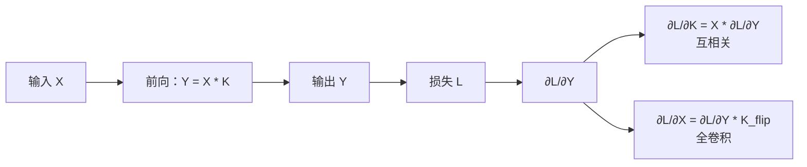

### 4.2 池化层的梯度

**最大池化**：梯度只回传到最大值位置。

$$
\frac{\partial \mathcal{L}}{\partial X(i,j)} =
\begin{cases}
\frac{\partial \mathcal{L}}{\partial Y(i',j')}, & (i,j) = \arg\max \\
0, & \text{否则}
\end{cases}
$$

其中：

- $\frac{\partial \mathcal{L}}{\partial X(i,j)}$：损失对输入 $(i,j)$ 的梯度。
- $\frac{\partial \mathcal{L}}{\partial Y(i',j')}$：对应池化窗口输出的梯度。
- $\arg\max$：窗口内最大值的位置。
- 含义：只有最大值位置接收梯度，其余位置梯度为 0（因为前向只选了最大值）。

**平均池化**：梯度均分。

$$
\frac{\partial \mathcal{L}}{\partial X(i,j)} = \frac{1}{|\mathcal{R}|}\frac{\partial \mathcal{L}}{\partial Y(i',j')}
$$

其中：

- $|\mathcal{R}|$：池化窗口内元素个数。
- $\frac{\partial \mathcal{L}}{\partial Y(i',j')}$：窗口输出的梯度。
- 含义：平均池化前向是取均值，所以反向把梯度平均分给窗口内每个位置。

### 4.3 BN 的梯度

BN 反向传播涉及 batch 内所有样本，因为 $\mu$ 和 $\sigma$ 依赖整个 batch：

$$
\frac{\partial \mathcal{L}}{\partial x_i} = \frac{\gamma}{\sqrt{\sigma^2+\epsilon}}\left(\frac{\partial \mathcal{L}}{\partial \hat{x}_i} - \frac{1}{N}\sum_j \frac{\partial \mathcal{L}}{\partial \hat{x}_j} - \frac{\hat{x}_i}{N}\sum_j \frac{\partial \mathcal{L}}{\partial \hat{x}_j}\hat{x}_j\right)
$$

其中：

- $x_i$：batch 内第 $i$ 个样本的输入激活。
- $\hat{x}_i$：归一化后的值。
- $\gamma$：可学习缩放参数。
- $\sigma^2, \epsilon$：方差与防除零常数。
- $N$：batch 大小。
- $\frac{\partial \mathcal{L}}{\partial \hat{x}_i}$：损失对归一化值的梯度。
- 后两项 $\frac{1}{N}\sum_j\cdots$ 与 $\frac{\hat{x}_i}{N}\sum_j\cdots$：来自均值 $\mu$ 和方差 $\sigma^2$ 对 batch 内所有样本的依赖。
- 含义：因为 $\mu,\sigma$ 依赖整个 batch，每个样本的梯度都耦合了 batch 内其他样本，这是 BN 不适合小 batch 和序列任务的根本原因。

**盲区**：这是 BN 在推理时不能用 batch 统计的根本原因，也是它不适合
小 batch 和序列任务的原因。

---

## 5. CNN 架构演进史

### 5.1 时间线

| 年份 | 模型 | 关键贡献 |
|---|---|---|
| 1989 | LeCun CNN | 反向传播训练卷积网络 |
| 1998 | LeNet-5 | 首个实用 CNN，手写数字 |
| 2012 | AlexNet | ReLU + Dropout + GPU，ImageNet 突破 |
| 2014 | VGG | 3×3 堆叠，深度证明 |
| 2014 | GoogLeNet | Inception，1×1 降维 |
| 2015 | ResNet | 残差连接，152 层 |
| 2016 | DenseNet | 密集连接 |
| 2017 | MobileNet | 深度可分离卷积 |
| 2017 | ShuffleNet | 通道混洗 |
| 2017 | FPN | 特征金字塔 |
| 2018 | SENet | 通道注意力 |
| 2019 | EfficientNet | 复合缩放 |
| 2019 | ResNeSt | 分组注意力 |
| 2020 | RegNet | 设计空间搜索 |
| 2022 | ConvNeXt | 借鉴 Transformer 设计 |

**CNN 架构演进时间线**：

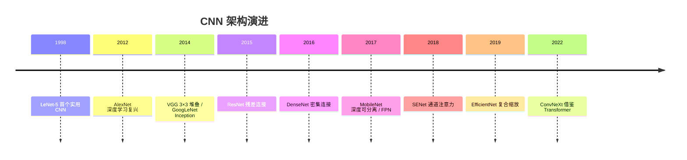

### 5.2 关键模型详解

#### LeNet-5（1998）

```
输入 32×32
→ Conv 5×5, 6
→ AvgPool 2×2
→ Conv 5×5, 16
→ AvgPool 2×2
→ FC 120 → FC 84 → FC 10
```

**意义**：确立了"卷积-池化-全连接"范式。

#### AlexNet（2012）

- 5 卷积 + 3 全连接
- ReLU 替代 Sigmoid
- Dropout 防过拟合
- 数据增强
- 双 GPU 训练
- 局部响应归一化（LRN）

**意义**：深度学习复兴的起点。

#### VGG（2014）

**核心思想**：用 3×3 卷积堆叠替代大核。

两个 3×3 卷积的感受野等于一个 5×5：

$$
r = 3 + (3-1) = 5
$$

其中：

- 第一个 $3$：第一层 $3\times3$ 卷积的感受野。
- $(3-1)$：第二层 $3\times3$ 卷积在上一层基础上额外扩展的范围。
- $r=5$：两层 $3\times3$ 堆叠的等效感受野等于一个 $5\times5$。
- 含义：小核堆叠可以替代大核，且参数更少、非线性更多。

三个 3×3 等于 7×7。

**优势**：

- 参数更少：$3\times(3^2 C^2) = 27C^2$ vs $5^2C^2 = 25C^2$（近似）
- 非线性更多：3 层 ReLU vs 1 层

**盲区**：VGG 参数量巨大（1.38 亿），主要在全连接层。

#### GoogLeNet / Inception（2014）

**Inception 模块**：并行多尺度卷积 + 1×1 降维。

$$
\text{Inception}(X) = [\text{Conv}_{1\times1}(X),\ \text{Conv}_{3\times3}(X),\ \text{Conv}_{5\times5}(X),\ \text{MaxPool}(X)]
$$

其中：

- $X$：输入特征图。
- $\text{Conv}_{1\times1}, \text{Conv}_{3\times3}, \text{Conv}_{5\times5}$：不同尺度的并行卷积分支。
- $\text{MaxPool}(X)$：池化分支，提供另一尺度。
- $[\cdot,\cdot,\cdot,\cdot]$：沿通道维拼接（concatenation）。
- 含义：同一层内并行提取多尺度特征，再拼接融合。

**1×1 卷积的作用**：通道降维，减少计算。

**辅助分类器**：中间层加分类头，缓解梯度消失。

#### ResNet（2015）

**残差块**：

$$
y = \mathcal{F}(x, \{W_i\}) + x
$$

其中：

- $x$：残差块输入。
- $\{W_i\}$：残差分支中所有层的权重。
- $\mathcal{F}(x,\{W_i\})$：残差分支（如两层卷积）的输出。
- $y$：残差块输出。
- 含义：网络学习残差 $\mathcal{F}$，恒等路径 $x$ 直接相加，保证梯度直通。

**瓶颈结构**（ResNet-50+）：

```
1×1 (降维) → 3×3 → 1×1 (升维)
```

**为什么能训 152 层**：残差提供梯度直通路径。

**盲区**：ResNet 的"退化问题"（degradation）不是过拟合，而是
深层网络训练误差反而更高，残差正是为解决它而生。

**ResNet 瓶颈结构**（以 ResNet-50 为例）：

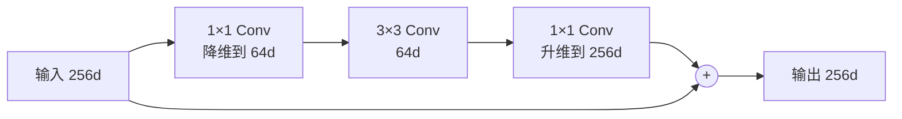

#### DenseNet（2016）

$$
x_l = H_l([x_0, x_1, \ldots, x_{l-1}])
$$

其中：

- $x_l$：第 $l$ 层的输出。
- $[x_0, x_1, \ldots, x_{l-1}]$：前面所有层输出的拼接。
- $H_l(\cdot)$：第 $l$ 层的复合操作（BN-ReLU-Conv）。
- 含义：每层都接收前面所有层的特征，实现特征复用与密集梯度流动。

每层连接前面所有层。**优势**：特征复用、梯度流动好、参数少。
**劣势**：显存占用高。

#### MobileNet（2017）

深度可分离卷积 + 宽度乘子 + 分辨率乘子。

**宽度乘子** $\alpha$：通道数缩放。
**分辨率乘子** $\rho$：输入分辨率缩放。

计算量：

$$
\text{FLOPs} \propto \alpha^2 \rho^2
$$

其中：

- $\alpha$：宽度乘子，缩放通道数。
- $\rho$：分辨率乘子，缩放输入分辨率。
- $\propto$：正比于。
- 含义：计算量随宽度和分辨率的平方增长，因此轻量化需同时控制两者。

#### EfficientNet（2019）

**复合缩放**：同时缩放深度 $d$、宽度 $w$、分辨率 $r$：

$$
d = \alpha^\phi,\quad w = \beta^\phi,\quad r = \gamma^\phi
$$

其中：

- $d, w, r$：深度、宽度、分辨率。
- $\alpha, \beta, \gamma$：三个方向的缩放基数（由网格搜索确定）。
- $\phi$：复合系数，控制整体缩放倍数。
- 含义：三个维度按幂律同步放大。

约束：

$$
\alpha \cdot \beta^2 \cdot \gamma^2 \approx 2
$$

其中：

- $\alpha, \beta, \gamma$：同上。
- $\beta^2, \gamma^2$：宽度和分辨率对计算量的贡献是平方关系。
- $\approx 2$：约束每次放大 $\phi$ 时计算量约翻倍。
- 含义：保证缩放时计算量可控，三者需平衡。

**核心发现**：三者需平衡缩放，单独缩放收益递减。

#### ConvNeXt（2022）

**把 Transformer 的设计搬回 CNN**：

- 大核深度卷积（7×7）
- 倒瓶颈结构
- LayerNorm 替代 BN
- GELU 替代 ReLU
- 更少的激活和归一化

**意义**：证明 CNN 在同等训练条件下可与 Swin Transformer 持平。

### 5.3 检测与分割架构

#### 两阶段检测

| 模型 | 贡献 |
|---|---|
| R-CNN | 选择性搜索 + CNN 分类 |
| Fast R-CNN | RoI Pooling，共享卷积 |
| Faster R-CNN | RPN 端到端 |
| Mask R-CNN | 加分割分支 + RoI Align |
| Cascade R-CNN | 级联 IoU 阈值 |

**RPN（区域提议网络）**：

$$
\text{anchor} \to \text{objectness} + \text{box regression}
$$

其中：

- $\text{anchor}$：预设的候选框（不同尺度、长宽比）。
- $\text{objectness}$：该框是否包含目标的置信度（二分类）。
- $\text{box regression}$：框位置的回归修正量（中心偏移、宽高缩放）。
- 含义：RPN 对每个锚框同时预测"有没有目标"和"框该怎么调"。

**RoI Align**：双线性插值，解决 RoI Pooling 的量化误差。

#### 单阶段检测

| 模型 | 贡献 |
|---|---|
| YOLO | 回归式检测，实时 |
| SSD | 多尺度特征图 |
| RetinaNet | Focal Loss |
| FCOS | 无锚框 |
| CenterNet | 关键点检测 |
| YOLOv5/v8 | 工程优化 |

**YOLO 的核心**：把检测变成回归问题，一次前向输出所有框。

#### 分割

| 模型 | 贡献 |
|---|---|
| FCN | 全卷积，端到端分割 |
| U-Net | 编码-解码 + 跳跃连接 |
| SegNet | 池化索引上采样 |
| DeepLab | 空洞卷积 + CRF |
| PSPNet | 金字塔池化 |
| Mask R-CNN | 实例分割 |
| Panoptic | 全景分割 |

**U-Net 的跳跃连接**：

$$
\text{Decoder}_l = \text{Up}(\text{Decoder}_{l+1}) \oplus \text{Encoder}_l
$$

其中：

- $\text{Decoder}_l$：第 $l$ 层解码器输出。
- $\text{Up}(\cdot)$：上采样（恢复分辨率）。
- $\text{Decoder}_{l+1}$：下一层（更深）解码器输出。
- $\text{Encoder}_l$：同层编码器特征（跳跃连接）。
- $\oplus$：拼接或相加。
- 含义：解码器上采样后与编码器同层特征融合，兼顾语义与定位细节。

**为什么有效**：编码器保留细节，解码器恢复分辨率，跳跃连接传递定位信息。

**U-Net 的编码-解码与跳跃连接**：

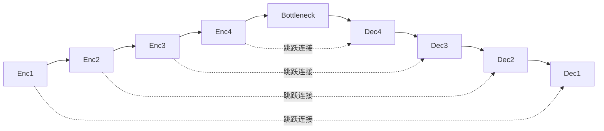

---

## 6. CNN 的现代变体与算子

### 6.1 注意力增强的 CNN

| 方法 | 注意力维度 |
|---|---|
| SE | 通道 |
| CBAM | 通道 + 空间 |
| ECA | 高效通道 |
| Non-Local | 时空自注意力 |
| GCNet | 全局上下文 |
| Coordinate Attention | 坐标感知 |

**Non-Local Block**（把自注意力引入 CNN）：

$$
y_i = \frac{1}{\mathcal{C}(x)}\sum_j f(x_i, x_j)\, g(x_j)
$$

其中：

- $y_i$：位置 $i$ 的输出。
- $x_i, x_j$：位置 $i$ 和 $j$ 的特征。
- $f(x_i,x_j)$：相似度函数（高斯、嵌入高斯、点积等）。
- $g(x_j)$：对 $x_j$ 的变换（如线性投影）。
- $\mathcal{C}(x)$：归一化因子（如 $\sum_j f(x_i,x_j)$）。
- 含义：每个位置聚合全局所有位置的信息，权重由相似度决定，是自注意力在 CNN 中的形式。

**这是 CNN 与 Transformer 的桥梁**。

### 6.2 动态与条件计算

| 方法 | 思想 |
|---|---|
| 动态卷积 | 核由输入生成 |
| 条件卷积 | 多个专家核加权 |
| 可变形卷积 | 采样位置可学 |
| 稀疏卷积 | 只算非零位置 |
| 早退网络 | 简单样本提前输出 |

### 6.3 3D 与视频 CNN

| 方法 | 思想 |
|---|---|
| C3D | 3D 卷积 |
| I3D | 膨胀 2D 到 3D |
| P3D | 分解 3D 为 2D+1D |
| R(2+1)D | 空间 + 时间分离 |
| SlowFast | 双路径不同帧率 |
| TSM | 时间移位模块 |

---

## 7. Transformer 的数学原理

### 7.1 从序列建模说起

**RNN 的问题**：

$$
h_t = f(h_{t-1}, x_t)
$$

其中：

- $h_t$：第 $t$ 步的隐状态（携带历史信息）。
- $h_{t-1}$：上一步的隐状态。
- $x_t$：第 $t$ 步的输入。
- $f$：递推函数（如 LSTM/GRU 单元）。
- 含义：隐状态逐步传递，必须串行计算，且信息要经过多步才能传到远处。

RNN 的三大问题：

- 串行计算，无法并行
- 长程依赖梯度消失
- 信息瓶颈在 $h_t$

**注意力的动机**：让每个位置直接"看"所有位置，无需逐步传递。

### 7.2 缩放点积注意力（Scaled Dot-Product Attention）

**核心公式**：

$$
\text{Attention}(Q, K, V) = \text{softmax}\left(\frac{QK^T}{\sqrt{d_k}}\right)V
$$

其中：

- $Q \in \mathbb{R}^{n \times d_k}$：查询（query），"我在找什么"。
- $K \in \mathbb{R}^{m \times d_k}$：键（key），"我有什么标签"。
- $V \in \mathbb{R}^{m \times d_v}$：值（value），"我的实际内容"。
- $n$：查询数量，$m$：键值数量。
- $d_k$：键/查询的维度，用于缩放。
- $QK^T$：查询与键的点积，得到相似度矩阵。
- $\sqrt{d_k}$：缩放因子，防止点积过大导致 softmax 饱和。
- $\text{softmax}(\cdot)$：按行归一化成概率（注意力权重）。
- 整体含义：用查询与键的相似度作为权重，对值做加权求和。

**逐步推导**：

1. **相似度计算**：

$$
S = QK^T \in \mathbb{R}^{n \times m}
$$

其中：

- $S$：相似度矩阵（未归一化）。
- $Q$：查询矩阵；$K^T$：键矩阵的转置。
- $S_{ij}$：第 $i$ 个查询与第 $j$ 个键的点积相似度。
- 含义：点积越大，说明查询与键越匹配。

2. **缩放**：

$$
S' = \frac{S}{\sqrt{d_k}}
$$

其中：

- $S'$：缩放后的相似度矩阵。
- $S$：原始点积相似度。
- $d_k$：键/查询维度。
- 含义：把相似度除以 $\sqrt{d_k}$，使数值回到合理范围，避免 softmax 饱和。

**为什么除以 $\sqrt{d_k}$**（重要盲区）：

假设 $q, k$ 各分量独立、均值 0、方差 1，则：

$$
\text{Var}(q\cdot k) = \sum_{i=1}^{d_k}\text{Var}(q_i k_i) = d_k
$$

其中：

- $q, k$：单个查询向量和键向量。
- $q\cdot k$：两者的点积。
- $q_i, k_i$：第 $i$ 个分量。
- $\text{Var}(\cdot)$：方差。
- $d_k$：向量维度。
- 含义：在分量独立、均值 0、方差 1 的假设下，点积的方差等于维度 $d_k$，标准差为 $\sqrt{d_k}$，所以除以 $\sqrt{d_k}$ 可把方差拉回 1。
不缩放时，$d_k$ 大则点积值大，softmax 进入饱和区，梯度趋近 0。

$$
\text{softmax}(z)_i = \frac{e^{z_i}}{\sum_j e^{z_j}}
$$

其中：

- $z$：输入得分向量。
- $z_i$：第 $i$ 个得分。
- $e^{z_i}$：指数化，保证非负且放大差异。
- $\sum_j e^{z_j}$：所有得分的指数和，用于归一化。
- 含义：把任意实数得分变成概率分布；若某个 $z_i$ 远大于其他，输出接近 one-hot，梯度消失。

3. **Softmax 归一化**：

$$
A = \text{softmax}(S') \in \mathbb{R}^{n\times m}
$$

其中：

- $A$：注意力权重矩阵。
- $S'$：缩放后的相似度矩阵。
- $n, m$：查询数、键值数。
- 含义：对每一行做 softmax，每行和为 1，$A_{ij}$ 表示第 $i$ 个查询对第 $j$ 个键的关注程度。

4. **加权求和**：

$$
O = AV \in \mathbb{R}^{n \times d_v}
$$

其中：

- $O$：注意力输出。
- $A$：注意力权重矩阵（$n\times m$）。
- $V$：值矩阵（$m\times d_v$）。
- $d_v$：值的维度。
- 含义：用注意力权重对值加权求和，得到每个查询的聚合结果。

**直观理解**：$Q$ 是"我在找什么"，$K$ 是"我有什么标签"，$V$ 是"我的实际内容"。注意力就是按匹配度加权取内容。

**缩放点积注意力的计算流程**：

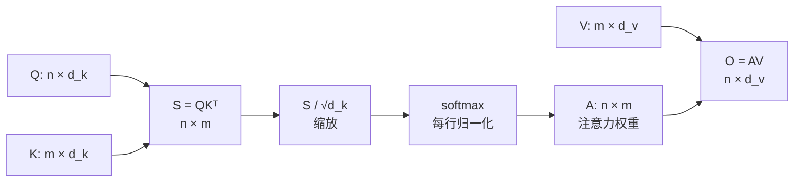

### 7.3 自注意力（Self-Attention）

当 $Q, K, V$ 都来自同一个输入 $X$ 时：

$$
Q = XW_Q,\quad K = XW_K,\quad V = XW_V
$$

$$
\text{SelfAttn}(X) = \text{softmax}\left(\frac{XW_Q W_K^T X^T}{\sqrt{d_k}}\right)XW_V
$$

其中：

- $X$：输入序列（$n\times d$）。
- $W_Q, W_K, W_V$：把输入投影成查询/键/值的可学习权重矩阵。
- $Q, K, V$：投影后的查询、键、值，均来自同一个 $X$。
- $d_k$：缩放维度。
- 含义：自注意力中 $Q,K,V$ 同源，每个位置根据与其他位置的相关性聚合全局信息。

**自注意力的本质**：每个位置根据与其他位置的相关性，聚合全局信息。

**与卷积的关系**（重要）：

- 卷积：固定局部权重，与内容无关
- 自注意力：动态权重，由内容决定

$$
\text{Conv}: y_i = \sum_{j \in \mathcal{N}(i)} w_{i-j} x_j
$$

$$
\text{SelfAttn}: y_i = \sum_{j} \alpha(x_i, x_j) x_j
$$

其中：

- $y_i$：位置 $i$ 的输出。
- $\mathcal{N}(i)$：位置 $i$ 的局部邻域（卷积只看局部）。
- $w_{i-j}$：只依赖相对位置的固定权重（与内容无关）。
- $\alpha(x_i,x_j)$：由内容动态计算的注意力权重。
- $x_j$：位置 $j$ 的输入。
- 含义：卷积是静态局部权重，自注意力是动态全局权重。

**自注意力是"内容自适应的动态卷积"**。

**自注意力的数据流**：

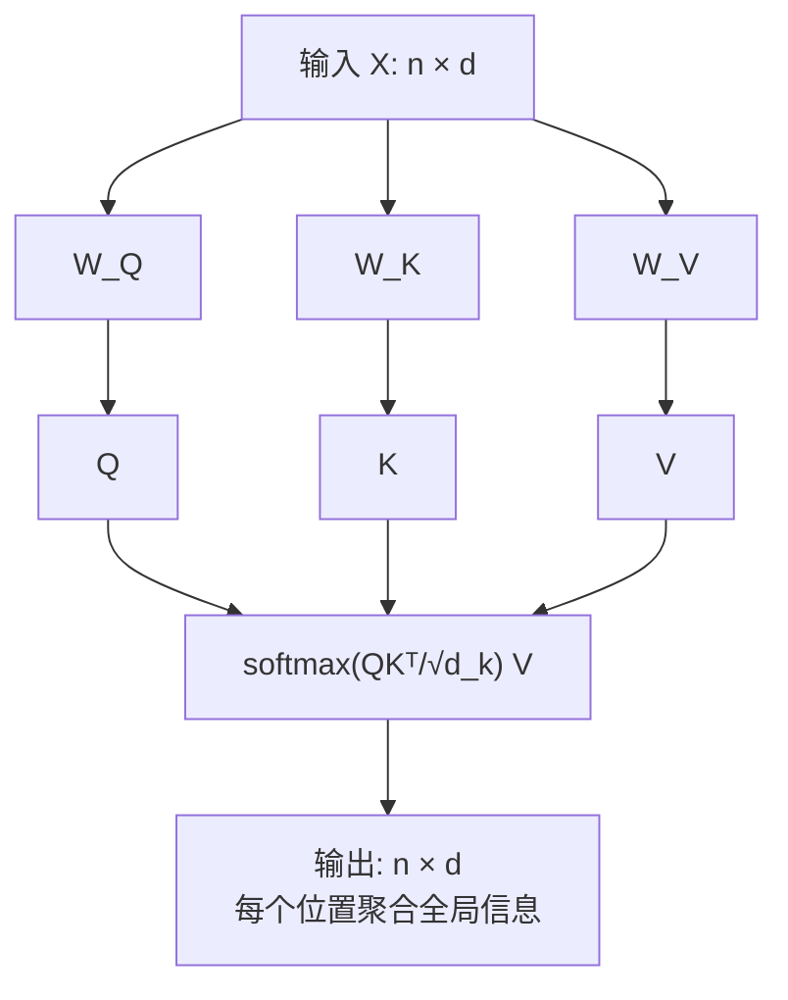

### 7.4 多头注意力（Multi-Head Attention）

$$
\text{MultiHead}(Q,K,V) = \text{Concat}(\text{head}_1, \ldots, \text{head}_h)W_O
$$

$$
\text{head}_i = \text{Attention}(QW_Q^i, KW_K^i, VW_V^i)
$$

其中：

- $h$：头数。
- $\text{head}_i$：第 $i$ 个注意力头的输出。
- $W_Q^i, W_K^i, W_V^i$：第 $i$ 个头各自的投影矩阵。
- $\text{Concat}(\cdot)$：把所有头沿特征维拼接。
- $W_O$：输出投影矩阵，把拼接结果映射回 $d_{model}$。
- 含义：多个头在不同子空间并行做注意力，再融合，增强表达力。

**维度设置**：通常 $d_k = d_v = d_{model}/h$，保证总计算量与单头相当。

**为什么多头**：

- 不同头关注不同子空间/不同关系
- 类似 CNN 的多通道
- 增强表达力

**盲区**：多头不是简单复制，各头学到不同模式（有的关注语法，有的关注位置）。

**多头注意力的并行结构**：

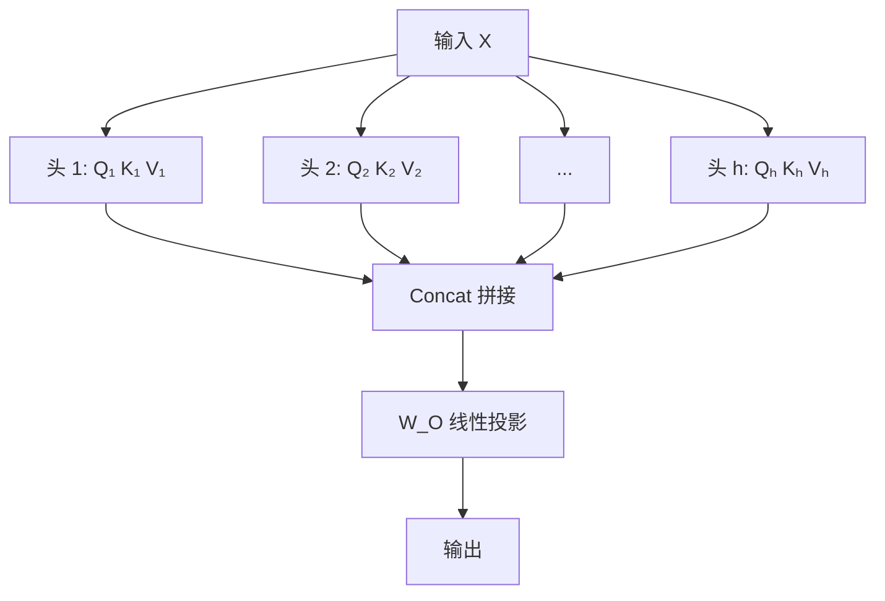

### 7.5 位置编码（Positional Encoding）

**问题**：自注意力是**置换等变**的，打乱输入顺序输出也打乱，无法感知位置。

$$
\text{SelfAttn}(\text{Permute}(X)) = \text{Permute}(\text{SelfAttn}(X))
$$

其中：

- $X$：输入序列。
- $\text{Permute}(\cdot)$：置换（打乱顺序）。
- $\text{SelfAttn}(\cdot)$：自注意力。
- 含义：先打乱再自注意力 = 先自注意力再打乱，说明自注意力本身感知不到位置，必须显式注入位置信息。

**正弦位置编码**（原始 Transformer）：

$$
PE(pos, 2i) = \sin\left(\frac{pos}{10000^{2i/d}}\right)
$$

$$
PE(pos, 2i+1) = \cos\left(\frac{pos}{10000^{2i/d}}\right)
$$

其中：

- $PE(pos, \cdot)$：位置 $pos$ 的编码向量。
- $pos$：位置索引（第几个 token）。
- $i$：维度索引，$2i$ 为偶数维，$2i+1$ 为奇数维。
- $d$：编码维度（等于模型维度）。
- $10000^{2i/d}$：不同维度对应不同频率，低维高频、高维低频。
- 含义：偶数维用 sin、奇数维用 cos，不同频率组合成唯一的位置指纹。

**为什么用正弦**：

- 相对位置可线性表示：

$$
PE(pos+k) = f(PE(pos))
$$

其中：

- $pos$：位置索引。
- $k$：位置偏移量。
- $f$：一个线性变换（旋转矩阵）。
- 含义：位置 $pos+k$ 的编码可由位置 $pos$ 的编码经线性变换得到，因此相对位置可被线性表示。

正弦编码的其他优点：

- 可外推到训练时未见过的长度
- 不同频率编码不同尺度

**可学习位置编码**：BERT、ViT 使用，简单但无法外推。

**相对位置编码**：关注相对距离而非绝对位置。

**RoPE（旋转位置编码）**：

把位置信息编码为旋转矩阵：

$$
R_{\Theta, m}^d = \text{diag}\left(R_{\theta_1,m}, \ldots, R_{\theta_{d/2},m}\right)
$$

$$
R_{\theta,m} = \begin{bmatrix}\cos m\theta & -\sin m\theta \\ \sin m\theta & \cos m\theta\end{bmatrix}
$$

应用：

$$
q_m^T k_n = (R_{\Theta,m}q)^T(R_{\Theta,n}k) = q^T R_{\Theta,n-m} k
$$

其中：

- $R_{\Theta,m}^d$：位置 $m$ 对应的 $d\times d$ 旋转矩阵（分块对角）。
- $R_{\theta,m}$：二维旋转矩阵，把向量旋转角度 $m\theta$。
- $\theta_i$：第 $i$ 个分块的旋转基频。
- $q_m, k_n$：位置 $m$ 的查询、位置 $n$ 的键。
- $R_{\Theta,n-m}$：只依赖相对位置 $n-m$ 的旋转矩阵。
- 含义：把位置编码成旋转，使点积只依赖相对位置，天然编码相对距离。

**关键性质**：点积只依赖相对位置 $n-m$，天然编码相对位置。
LLaMA、GPT-NeoX 等使用。

**ALiBi**：不用位置编码，直接在注意力分数上加线性偏置：

$$
\text{score}_{ij} = q_i^T k_j - m\cdot|i-j|
$$

其中：

- $\text{score}_{ij}$：位置 $i$ 对位置 $j$ 的注意力得分。
- $q_i^T k_j$：原始点积相似度。
- $m$：每个头固定的斜率（与头数相关）。
- $|i-j|$：两个位置的相对距离。
- 含义：距离越远惩罚越大，无需位置编码即可注入位置信息，外推能力强。

**优势**：外推能力极强。

**位置编码的主要方案**：

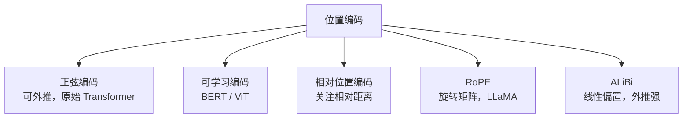

### 7.6 前馈网络（FFN）

$$
\text{FFN}(x) = W_2\,\sigma(W_1 x + b_1) + b_2
$$

其中：

- $x$：单个位置的输入向量。
- $W_1, b_1$：第一层线性变换的权重和偏置（升维到 $d_{ff}$）。
- $\sigma$：非线性激活（如 ReLU/GELU）。
- $W_2, b_2$：第二层线性变换（降回 $d_{model}$）。
- 含义：对每个位置独立做"升维-非线性-降维"，提供大部分参数量。

通常 $d_{ff} = 4 d_{model}$。

**作用**：

- 逐位置非线性变换
- 提供大部分参数量（约 2/3）
- 可视为 key-value 记忆

**盲区**：FFN 常被忽视，但它是 Transformer 表达力的重要来源。
有研究认为 FFN 存储了事实知识。

**SwiGLU 变体**（LLaMA）：

$$
\text{FFN}(x) = (\text{Swish}(W_1 x) \odot W_3 x)W_2
$$

其中：

- $x$：输入向量。
- $W_1, W_3$：两个并行的升维投影。
- $\text{Swish}(\cdot)$：平滑激活函数。
- $\odot$：逐元素相乘（门控）。
- $W_2$：降维投影。
- 含义：用一路做门控、一路做内容，相乘后再降维，是 LLaMA 等采用的 FFN 变体。

### 7.7 完整 Transformer 块

**编码器块**：

$$
z = \text{LN}(x + \text{MultiHead}(x, x, x))
$$

$$
y = \text{LN}(z + \text{FFN}(z))
$$

其中：

- $x$：编码器块输入。
- $\text{MultiHead}(x,x,x)$：自注意力（$Q,K,V$ 均为 $x$）。
- $\text{LN}(\cdot)$：层归一化。
- $z$：自注意力子层输出。
- $\text{FFN}(\cdot)$：前馈网络。
- $y$：编码器块输出。
- 含义：每个子层都是"残差 + 归一化"，先自注意力再 FFN。

**编码器块结构**（Pre-Norm 形式）：

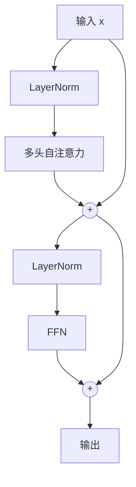

**解码器块**（多一个交叉注意力）：

$$
z = \text{LN}(x + \text{MaskedMultiHead}(x,x,x))
$$

$$
z' = \text{LN}(z + \text{MultiHead}(z, \text{enc}, \text{enc}))
$$

$$
y = \text{LN}(z' + \text{FFN}(z'))
$$

其中：

- $x$：解码器块输入。
- $\text{MaskedMultiHead}(x,x,x)$：带因果掩码的自注意力（不能看未来）。
- $\text{enc}$：编码器输出。
- $\text{MultiHead}(z, \text{enc}, \text{enc})$：交叉注意力，$Q$ 来自解码器、$K,V$ 来自编码器。
- $z, z', y$：三个子层的输出。
- 含义：解码器比编码器多一个交叉注意力子层，用于对齐源序列。

**掩码注意力**（因果掩码）：

$$
\text{Mask}_{ij} = \begin{cases}0, & j \le i \\ -\infty, & j > i\end{cases}
$$

$$
\text{Attention} = \text{softmax}\left(\frac{QK^T}{\sqrt{d_k}} + \text{Mask}\right)V
$$

其中：

- $\text{Mask}_{ij}$：位置 $i$ 对位置 $j$ 的掩码值。
- $j\le i$：允许看到当前及之前的位置，掩码为 0（不影响）。
- $j>i$：未来位置，掩码为 $-\infty$（softmax 后权重为 0）。
- 含义：把未来位置的注意力分数压到负无穷，保证自回归生成时看不到未来信息。

**作用**：防止看到未来信息，保证自回归生成。

### 7.8 交叉注意力（Cross-Attention）

$$
Q = \text{Decoder},\quad K = V = \text{Encoder}
$$

其中：

- $Q$：查询，来自解码器当前状态。
- $K, V$：键和值，来自编码器输出。
- 含义：解码器用当前位置去"查询"编码器的全部信息，实现源-目标对齐。

**用途**：机器翻译、多模态、DETR 的 object query。

**编码器-解码器整体结构**：

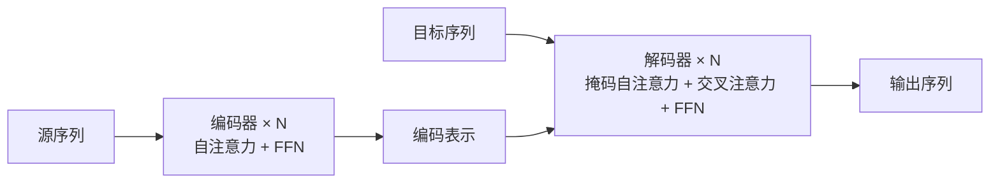

---

## 8. Transformer 的关键组件

### 8.1 组件总表

| 组件 | 作用 | 变体 |
|---|---|---|
| 自注意力 | 全局依赖建模 | 稀疏、线性、局部 |
| 多头 | 多子空间 | MQA、GQA |
| 位置编码 | 注入位置 | 正弦、可学、RoPE、ALiBi |
| FFN | 非线性变换 | MLP、SwiGLU、MoE |
| 残差 | 梯度直通 | Pre/Post-Norm |
| 归一化 | 稳定训练 | LN、RMSNorm |
| Dropout | 正则 | 注意力 Dropout |

### 8.2 RMSNorm

$$
\text{RMSNorm}(x) = \frac{x}{\sqrt{\frac{1}{d}\sum_i x_i^2 + \epsilon}}\cdot \gamma
$$

其中：

- $x$：输入向量。
- $d$：向量维度。
- $\frac{1}{d}\sum_i x_i^2$：均方值（RMS 的平方）。
- $\epsilon$：防除零常数。
- $\gamma$：可学习的缩放参数。
- 含义：只用均方根归一化，不做均值中心化，比 LN 更快。

**相比 LN**：去掉均值中心化，更快，效果相当。LLaMA 使用。

### 8.3 注意力变体

| 变体 | 说明 |
|---|---|
| MHA | 标准多头 |
| MQA | 多查询，K/V 共享，省显存 |
| GQA | 分组查询，折中 |
| MLA | 低秩压缩 KV（DeepSeek） |

**MQA**：所有头共享一组 K/V，推理时 KV Cache 大幅减小。

**GQA**：$h$ 个查询头分成 $g$ 组，每组共享 K/V。

### 8.4 MoE（混合专家）

$$
y = \sum_{i \in \text{TopK}} g_i(x)\cdot E_i(x)
$$

$$
g_i(x) = \text{softmax}(\text{TopK}(W_g x))
$$

其中：

- $x$：输入 token 表示。
- $E_i(\cdot)$：第 $i$ 个专家网络（通常是一个 FFN）。
- $g_i(x)$：第 $i$ 个专家的门控权重。
- $W_g$：门控网络的权重。
- $\text{TopK}(\cdot)$：只保留得分最高的 $K$ 个专家。
- $\text{softmax}(\cdot)$：把选中专家的得分归一化成权重。
- 含义：每个 token 只激活少数专家，参数量大但计算量小（稀疏激活）。

**优势**：参数量大但计算量小（稀疏激活）。
**挑战**：负载均衡、通信开销。

---

## 9. Transformer 的复杂度与训练

### 9.1 复杂度分析

| 操作 | 时间复杂度 | 空间复杂度 |
|---|---|---|
| 自注意力 | $O(n^2 d)$ | $O(n^2 + nd)$ |
| FFN | $O(n d^2)$ | $O(nd)$ |
| 卷积 | $O(n k^2 d^2)$ | $O(nd)$ |

其中 $n$ 是序列长度，$d$ 是维度，$k$ 是核大小。

**关键**：自注意力对 $n$ 是**二次**的，这是长序列的瓶颈。

**对比**：

- $n < d$ 时，注意力主导
- $n > d$ 时，FFN 主导

### 9.2 训练技巧

| 技巧 | 作用 |
|---|---|
| Warmup | 稳定早期训练 |
| 梯度裁剪 | 防梯度爆炸 |
| 学习率衰减 | 余弦/线性 |
| Dropout | 正则 |
| 标签平滑 | 防过自信 |
| 混合精度 | 加速省显存 |
| 梯度累积 | 模拟大 batch |
| 权重衰减 | 正则（AdamW） |

**Warmup 公式**：

$$
lr = d_{model}^{-0.5}\cdot \min(step^{-0.5},\ step\cdot warmup^{-1.5})
$$

其中：

- $lr$：当前学习率。
- $d_{model}$：模型维度，用于整体缩放学习率。
- $step$：当前训练步数。
- $warmup$：预热步数。
- $\min(\cdot,\cdot)$：取两者较小值。
- 含义：前 $warmup$ 步学习率线性上升（$step\cdot warmup^{-1.5}$），之后按 $step^{-0.5}$ 衰减。

**为什么需要 Warmup**（盲区）：Post-Norm 结构早期梯度不稳定，
Warmup 让模型先小步走。Pre-Norm 可缓解此需求。

### 9.3 预训练范式

| 范式 | 代表 | 目标 |
|---|---|---|
| 自回归（AR） | GPT | 预测下一个 token |
| 自编码（AE） | BERT | 掩码语言建模 |
| 前缀（Prefix） | T5、UniLM | 统一框架 |
| 对比 | CLIP | 图文对齐 |
| 掩码图像 | MAE、BEiT | 重建图像块 |

**BERT 的 MLM**：

$$
\mathcal{L} = -\sum_{i \in \mathcal{M}} \log P(x_i \mid x_{\setminus \mathcal{M}})
$$

其中：

- $\mathcal{L}$：损失。
- $\mathcal{M}$：被掩码的位置集合。
- $x_i$：第 $i$ 个被掩码的 token。
- $x_{\setminus \mathcal{M}}$：未被掩码的可见 token。
- $P(x_i \mid x_{\setminus \mathcal{M}})$：根据可见 token 预测被掩码 token 的概率。
- 含义：随机遮住部分 token，让模型根据上下文（双向）还原它们。

**GPT 的 AR**：

$$
\mathcal{L} = -\sum_{i} \log P(x_i \mid x_{<i})
$$

其中：

- $\mathcal{L}$：损失。
- $i$：序列位置。
- $x_i$：第 $i$ 个 token。
- $x_{<i}$：位置 $i$ 之前的所有 token。
- $P(x_i \mid x_{<i})$：根据前文预测下一个 token 的概率。
- 含义：从左到右逐词预测，只能看前文（单向），适合生成。

**MAE 的掩码比例**：高达 75%，远高于 BERT 的 15%，
因为图像冗余度高。

---

## 10. Transformer 架构演进史

### 10.1 时间线

| 年份 | 模型 | 关键贡献 |
|---|---|---|
| 2017 | Transformer | 注意力即全部 |
| 2018 | GPT-1 | 生成式预训练 |
| 2018 | BERT | 双向编码器 |
| 2019 | GPT-2 | 大规模生成 |
| 2019 | Transformer-XL | 长程依赖 |
| 2020 | T5 | 统一文本到文本 |
| 2020 | ViT | 图像分块 + Transformer |
| 2020 | DeiT | 数据高效训练 |
| 2020 | DETR | 端到端检测 |
| 2020 | GPT-3 | 少样本学习 |
| 2021 | Swin | 层次化窗口注意力 |
| 2021 | CLIP | 图文对比学习 |
| 2021 | BEiT | 掩码图像建模 |
| 2022 | MAE | 高效掩码自编码 |
| 2022 | ViT-Adapter | 适配密集任务 |
| 2022 | Flamingo | 多模态少样本 |
| 2023 | LLaMA | 开源高效 LLM |
| 2023 | SAM | 分割一切 |
| 2023 | GPT-4 | 多模态大模型 |
| 2024 | ViT-22B | 超大规模 ViT |
| 2024 | Mamba | 状态空间替代注意力 |

### 10.2 ViT（Vision Transformer）

**核心思想**：把图像切成 patch，当作 token 序列。

**流程**：

1. 图像 $x \in \mathbb{R}^{H\times W\times C}$
2. 切成 $N = HW/P^2$ 个 patch，$P$ 是 patch 大小
3. 每个 patch 展平并线性投影：

$$
z_i = \text{Linear}(\text{Flatten}(x_i)) \in \mathbb{R}^d
$$

其中：

- $x_i$：第 $i$ 个图像 patch。
- $\text{Flatten}(\cdot)$：把 patch 展平成一维向量。
- $\text{Linear}(\cdot)$：线性投影（可学习矩阵）。
- $z_i$：投影后的 token 向量，维度为 $d$。
- 含义：把每个 patch 变成一个与词向量同维度的 token。

4. 加 [CLS] token 和位置编码：

$$
z_0 = [x_{cls};\ z_1;\ \ldots;\ z_N] + E_{pos}
$$

其中：

- $x_{cls}$：可学习的分类 token（[CLS]）。
- $z_1,\ldots,z_N$：$N$ 个 patch 的 token。
- $[\cdot;\cdot]$：沿序列维拼接。
- $E_{pos}$：位置编码。
- $z_0$：送入编码器的初始序列。
- 含义：把 [CLS] 与所有 patch token 拼成序列，再加上位置信息。

5. 送入 Transformer 编码器
6. 用 [CLS] 输出分类

**公式**：

$$
z_0 = [x_{class};\ x_p^1 E;\ \ldots;\ x_p^N E] + E_{pos}
$$

$$
z'_l = \text{MSA}(\text{LN}(z_{l-1})) + z_{l-1}
$$

$$
z_l = \text{MLP}(\text{LN}(z'_l)) + z'_l
$$

$$
y = \text{LN}(z_L^0)
$$

其中：

- $x_{class}$：可学习的分类 token。
- $x_p^i$：第 $i$ 个 patch；$E$：patch 嵌入矩阵。
- $E_{pos}$：位置编码。
- $z_{l-1}$：第 $l$ 层输入；$z'_l$：自注意力子层输出；$z_l$：第 $l$ 层输出。
- $\text{MSA}(\cdot)$：多头自注意力；$\text{MLP}(\cdot)$：前馈网络；$\text{LN}(\cdot)$：层归一化。
- $z_L^0$：最后一层第 0 个位置（[CLS]）的输出。
- $y$：分类头输入。
- 含义：标准 Pre-Norm Transformer 编码器，最后取 [CLS] 做分类。

**关键发现**：ViT 在中小数据集上不如 CNN，需要大规模预训练
（JFT-300M）才能超越。这印证了归纳偏置的权衡。

**盲区**：ViT 的 patch 是固定网格，丢失了 CNN 的局部性和平移等变。
位置编码是唯一的位置信息来源。

**ViT 的处理流程**：

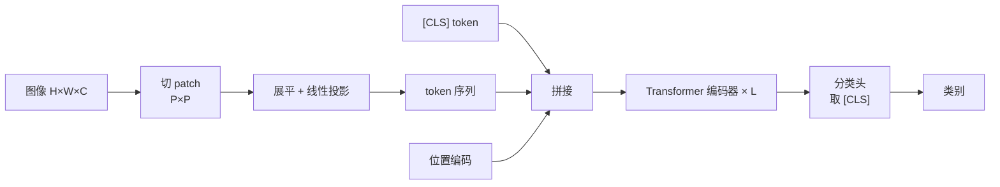

### 10.3 Swin Transformer

**核心创新**：

1. **层次化结构**：像 CNN 一样逐层下采样
2. **窗口注意力**：只在局部窗口内计算注意力
3. **移位窗口**：相邻层窗口错位，实现跨窗口信息交换

**窗口注意力复杂度**：

$$
O\left(\frac{HW}{M^2}\cdot M^4\right) = O(HW M^2)
$$

其中：

- $H, W$：特征图高宽。
- $M$：窗口大小。
- $\frac{HW}{M^2}$：窗口个数。
- $M^4$：每个窗口内做注意力的复杂度（$M^2$ 个 token 两两计算）。
- 含义：窗口注意力复杂度与图像尺寸线性相关，远低于全局注意力的 $O((HW)^2)$。

**移位窗口**：

$$
\text{Shift} = \lfloor M/2 \rfloor
$$

其中：

- $\text{Shift}$：窗口划分的偏移量。
- $M$：窗口大小。
- $\lfloor\cdot\rfloor$：向下取整。
- 含义：下一层窗口整体偏移半个窗口，使相邻层窗口错位，实现跨窗口信息交换。

**意义**：兼顾局部效率和全局建模，成为密集预测任务的骨干。

**移位窗口机制**：

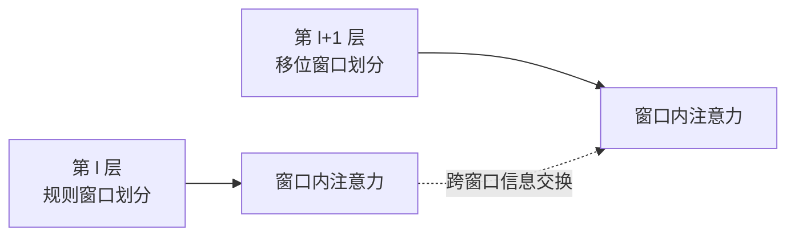

### 10.4 DETR

**核心思想**：把检测变成集合预测。

- 用 Transformer 编码器处理图像特征
- 用固定数量的 object query 解码
- 用匈牙利算法做二分匹配

**匹配损失**：

$$
\hat{\sigma} = \arg\min_\sigma \sum_i \mathcal{L}_{match}(y_i, \hat{y}_{\sigma(i)})
$$

其中：

- $\hat{\sigma}$：最优的预测-真值匹配方案（一个排列）。
- $\sigma$：一种匹配排列。
- $y_i$：第 $i$ 个真实目标。
- $\hat{y}_{\sigma(i)}$：与第 $i$ 个真值匹配的预测。
- $\mathcal{L}_{match}$：匹配代价（分类 + 框回归）。
- 含义：用匈牙利算法找使总匹配代价最小的排列，实现集合预测。

**优势**：无需 NMS、无需锚框。
**劣势**：收敛慢，小目标差（后续 Deformable DETR 改进）。

### 10.5 CLIP

**对比学习**：

$$
\mathcal{L} = -\frac{1}{N}\sum_i \log \frac{\exp(\text{sim}(I_i, T_i)/\tau)}{\sum_j \exp(\text{sim}(I_i, T_j)/\tau)}
$$

其中：

- $\mathcal{L}$：对比损失。
- $N$：batch 内图文对数量。
- $I_i$：第 $i$ 张图像的特征。
- $T_i$：与 $I_i$ 配对的文本特征；$T_j$：batch 内其他文本特征。
- $\text{sim}(\cdot,\cdot)$：相似度（余弦相似度）。
- $\tau$：温度系数，控制分布尖锐程度。
- 含义：让配对的图文相似度高于不配对的，实现图文对齐。

**意义**：图文对齐，零样本分类，多模态基础。

### 10.6 MAE

**流程**：

1. 随机掩码 75% 的 patch
2. 编码器只处理可见 patch
3. 解码器重建被掩码的 patch

**损失**：只在掩码 patch 上计算 MSE。

**优势**：训练快（编码器只处理 25%），学到强表示。

---

## 11. 高效注意力与长序列

### 11.1 稀疏与局部注意力

| 方法 | 思想 | 复杂度 |
|---|---|---|
| Local Attention | 只看局部窗口 | $O(nw)$ |
| Strided Attention | 局部 + 跨步 | $O(n\sqrt{n})$ |
| Longformer | 局部 + 全局 token | $O(n)$ |
| BigBird | 局部 + 全局 + 随机 | $O(n)$ |
| Sparse Transformer | 固定稀疏模式 | $O(n\sqrt{n})$ |

### 11.2 低秩与核方法

| 方法 | 思想 |
|---|---|
| Linformer | K/V 低秩投影 |
| Performer | 核函数近似 softmax |
| Nyströmformer | Nyström 近似 |
| Linear Attention | 去掉 softmax，结合律重排 |

**Linear Attention 推导**：

标准：

$$
O = \text{softmax}(QK^T)V
$$

线性：

$$
O = \phi(Q)\big(\phi(K)^T V\big)
$$

其中：

- $Q, K, V$：查询、键、值矩阵。
- $\phi(\cdot)$：特征映射函数（如 ELU），把向量映射到非负空间。
- 标准式：先算 $n\times n$ 的注意力矩阵，复杂度 $O(n^2 d)$。
- 线性式：利用结合律先算 $\phi(K)^T V$（$d\times d$），再乘 $\phi(Q)$。
- 含义：改变计算顺序，把对序列长度的二次复杂度降为线性。

**关键**：先算 $\phi(K)^T V \in \mathbb{R}^{d\times d}$，复杂度 $O(nd^2)$。

### 11.3 硬件优化

| 方法 | 思想 |
|---|---|
| FlashAttention | 分块 + 重计算，减少 HBM 访问 |
| PagedAttention | 分页 KV Cache |
| 量化 | INT8/INT4 |
| 蒸馏 | 小模型学大模型 |

**FlashAttention 的核心**：不显式存储 $n\times n$ 注意力矩阵，
用 tiling 在 SRAM 中分块计算，IO 复杂度从 $O(n^2)$ 降到 $O(n^2/M)$。

### 11.4 状态空间模型

**Mamba / S4**：

$$
h'(t) = Ah(t) + Bx(t)
$$

$$
y(t) = Ch(t) + Dx(t)
$$

其中：

- $h(t)$：隐状态；$h'(t)$：隐状态对时间的导数。
- $x(t)$：输入信号；$y(t)$：输出信号。
- $A$：状态转移矩阵（隐状态如何演化）。
- $B$：输入矩阵（输入如何影响隐状态）。
- $C$：输出矩阵（隐状态如何映射到输出）。
- $D$：直通矩阵（输入直接到输出的通路）。
- 含义：用线性微分方程描述序列演化，可离散化后线性时间递推，长序列友好。

**优势**：线性复杂度，长序列友好。
**挑战**：表达力与注意力的对比仍在研究中。

**高效注意力的五条技术路线**：

```mermaid
flowchart TD
    ATTN["标准注意力 O(n²d)"] --> SPARSE["稀疏 / 局部<br/>Longformer / BigBird"]
    ATTN --> LOWRANK["低秩 / 核方法<br/>Linformer / Performer"]
    ATTN --> LINEAR["线性注意力<br/>RetNet / RWKV"]
    ATTN --> HW["硬件优化<br/>FlashAttention"]
    ATTN --> SSM["状态空间模型<br/>Mamba / S4"]
```

---

## 12. CNN vs Transformer：本质对比

### 12.1 核心差异表

| 维度 | CNN | Transformer |
|---|---|---|
| 基本操作 | 卷积（局部、固定权重） | 注意力（全局、动态权重） |
| 感受野 | 局部，逐层扩大 | 全局，单层即可 |
| 权重 | 与位置无关（共享） | 与内容相关（动态） |
| 归纳偏置 | 强（局部性、平移等变） | 弱 |
| 数据需求 | 较小 | 较大 |
| 参数量 | 高效 | 较大 |
| 并行性 | 高 | 高 |
| 长程依赖 | 需多层 | 单层直接 |
| 位置信息 | 隐式（结构自带） | 显式（位置编码） |
| 计算复杂度 | $O(n k^2 d^2)$ | $O(n^2 d)$ |
| 可解释性 | 中等 | 注意力可视化 |

### 12.2 数学视角的统一

**两者都是加权求和**：

$$
y_i = \sum_j w_{ij} x_j
$$

其中：

- $y_i$：位置 $i$ 的输出。
- $x_j$：位置 $j$ 的输入。
- $w_{ij}$：位置 $j$ 对位置 $i$ 的权重。
- 含义：卷积和注意力都是这种加权求和，区别只在权重 $w_{ij}$ 如何得到。

- **卷积**：$w_{ij} = K_{i-j}$，权重由相对位置决定，与内容无关
- **注意力**：$w_{ij} = \text{softmax}(q_i^T k_j)$，权重由内容决定

**统一视角**：注意力是"动态卷积"，卷积是"静态注意力"。

**更一般的框架**：

$$
y_i = \sum_j \frac{\exp(\langle \phi(x_i), \psi(x_j)\rangle)}{\sum_{j'} \exp(\langle \phi(x_i), \psi(x_{j'})\rangle)} \cdot g(x_j)
$$

其中：

- $y_i$：位置 $i$ 的输出。
- $\phi, \psi$：把输入映射到比较空间的函数。
- $\langle\cdot,\cdot\rangle$：内积（相似度）。
- $g(x_j)$：对 $x_j$ 的变换（对应值 $V$）。
- 分母：对所有 $j'$ 归一化（softmax）。
- 含义：这是卷积与注意力的统一形式；当 $\phi,\psi$ 退化为位置编码时，就变成卷积。

**统一视角的图示**：

```mermaid
flowchart TD
    U["统一形式<br/>y_i = Σ_j w_ij x_j"] --> C["卷积<br/>w_ij = K_(i-j)<br/>静态，由位置决定"]
    U --> A["注意力<br/>w_ij = softmax(q_iᵀk_j)<br/>动态，由内容决定"]
    C -.特例.-> A
```

### 12.3 表达力对比

**理论结果**：

- 单层注意力可以表示任意稀疏函数（有足够头）
- 卷积需要多层才能获得全局感受野
- Transformer 在理论上更通用，但需要更多数据

**实际结果**：

- 大数据：Transformer 胜
- 小数据：CNN 胜
- 同等数据 + 同等训练：差距缩小（ConvNeXt vs Swin）

### 12.4 计算效率对比

| 场景 | 优势方 |
|---|---|
| 小分辨率、小数据 | CNN |
| 大分辨率、密集预测 | 混合/Swin |
| 长序列、大模型 | Transformer |
| 移动端 | CNN（MobileNet） |
| 高分辨率图像 | 层次化 Transformer |

---

## 13. 混合架构

### 13.1 设计模式

| 模式 | 代表 | 思想 |
|---|---|---|
| CNN 骨干 + Transformer 头 | DETR | 局部特征 + 全局关系 |
| Transformer 骨干 + CNN 头 | ViT + FPN | 全局表示 + 密集预测 |
| 交替堆叠 | Conformer、CoAtNet | 两者互补 |
| 并行双分支 | Conformer（语音） | 卷积 + 注意力 |
| 注意力增强 CNN | BoTNet、CoT | 在 CNN 中插入注意力 |

### 13.2 代表模型

| 模型 | 结构 |
|---|---|
| CoAtNet | 深度卷积 + 注意力交替 |
| Conformer | 卷积 + 自注意力（语音） |
| BoTNet | ResNet + 自注意力 |
| CvT | 卷积式 token 嵌入 |
| LeViT | 卷积 + 注意力混合 |
| MobileViT | 轻量混合 |
| Next-ViT | 工业级混合 |

### 13.3 为什么混合有效

- CNN 提供局部归纳偏置，减少数据需求
- Transformer 提供全局建模，增强表达
- 两者互补，兼顾效率与性能

**两种典型混合模式**：

```mermaid
flowchart LR
    subgraph M1["CNN 骨干 + Transformer 头"]
        A1["CNN 局部特征"] --> A2["Transformer 全局关系"]
    end
    subgraph M2["交替堆叠"]
        B1["卷积"] --> B2["注意力"] --> B3["卷积"] --> B4["注意力"]
    end
```

---

## 14. 与特征描述子的关系（重点）

### 14.1 概念映射

**核心洞察**：CNN 和 Transformer 本质上都是**可学习的特征描述子生成器**。

| 经典描述子概念 | 深度网络对应 |
|---|---|
| 检测子（Harris、FAST） | 关键点检测头（SuperPoint） |
| 描述子（SIFT、ORB） | 描述子头（L2-Net、HardNet） |
| 尺度空间 | 多尺度特征金字塔（FPN） |
| 主方向归一化 | 可学习的方向估计 |
| 梯度方向直方图 | 卷积特征图 |
| 二值描述子 | 量化/哈希层 |
| 词袋聚合 | 全局池化、VLAD 层 |
| 匹配距离 | 度量学习损失 |

**经典描述子与深度网络的对应关系**：

```mermaid
flowchart LR
    subgraph Classic["经典描述子"]
        C1["检测子<br/>Harris / FAST"]
        C2["描述子<br/>SIFT / ORB"]
        C3["尺度空间"]
        C4["词袋聚合"]
    end
    subgraph Deep["深度网络"]
        D1["关键点检测头<br/>SuperPoint"]
        D2["描述子头<br/>HardNet"]
        D3["特征金字塔<br/>FPN"]
        D4["全局池化<br/>VLAD / GeM"]
    end
    C1 --> D1
    C2 --> D2
    C3 --> D3
    C4 --> D4
```

### 14.2 CNN 特征作为描述子

**早期做法**：把 CNN 中间层特征当描述子。

- **全连接层特征**（FC7）：全局描述子，用于检索
- **卷积特征图**：局部描述子，用于匹配
- **多尺度特征**：类似尺度空间

**关键发现**：

- 浅层特征：边缘、纹理，类似 SIFT
- 深层特征：语义，类似高层描述子
- 中间层：兼顾定位与语义

**与 SIFT 的对比**：

| 维度 | SIFT | CNN 特征 |
|---|---|---|
| 不变性 | 显式设计 | 隐式学习 |
| 语义 | 无 | 有 |
| 数据需求 | 无 | 大 |
| 可解释性 | 高 | 低 |
| 匹配精度 | 中 | 高 |

### 14.3 深度局部描述子

**演进脉络**：

| 阶段 | 方法 | 关键思想 |
|---|---|---|
| 手工 | SIFT、SURF | 梯度直方图 |
| 浅层学习 | PCA-SIFT、LDA | 降维 |
| 深度孪生 | DeepDesc、MatchNet | 相似度学习 |
| 度量学习 | L2-Net、HardNet | 困难负样本 |
| 联合检测 | SuperPoint、D2-Net | 检测+描述 |
| 注意力匹配 | SuperGlue、LoFTR | 全局匹配 |

**深度局部描述子的演进脉络**：

```mermaid
flowchart LR
    A["手工<br/>SIFT / SURF"] --> B["浅层学习<br/>PCA-SIFT"] --> C["深度孪生<br/>DeepDesc"] --> D["度量学习<br/>HardNet"] --> E["联合检测<br/>SuperPoint"] --> F["注意力匹配<br/>SuperGlue / LoFTR"]
```

**L2-Net**：

- 逐块归一化（block normalization）
- 改善描述子分布

**HardNet**：

$$
\mathcal{L} = \frac{1}{N}\sum_i \max\left(0,\ 1 + d(a_i, p_i) - d(a_i, n_i^*)\right)
$$

其中：

- $\mathcal{L}$：三元组损失。
- $N$：batch 内样本数。
- $a_i$：第 $i$ 个锚点描述子。
- $p_i$：与 $a_i$ 匹配的正样本描述子。
- $n_i^*$：batch 内与 $a_i$ 最近的非匹配描述子（困难负样本）。
- $d(\cdot,\cdot)$：描述子距离。
- $1$：间隔（margin）。
- 含义：要求正样本距离比困难负样本距离至少小 1，否则产生损失。

**SuperPoint**：

- 自监督：MagicPoint + 单应变换
- 输出：关键点热力图 + 256 维描述子
- 检测与描述共享编码器

**D2-Net**：

- 单次前向同时得到检测和描述
- 用特征图上的局部极大值作为关键点

**R2D2**：

- 联合学习可重复性和可靠性
- 输出可靠性图

### 14.4 Transformer 描述子

**SuperGlue**：

- 输入：两组关键点 + 描述子
- 用注意力图神经网络建模关键点关系
- 用最优传输（Sinkhorn）求解匹配

**注意力匹配**：

$$
\text{score}_{ij} = \text{Attn}(q_i, k_j)
$$

其中：

- $\text{score}_{ij}$：关键点 $i$ 与 $j$ 的匹配得分。
- $q_i$：第 $i$ 个关键点的查询表示。
- $k_j$：第 $j$ 个关键点的键表示。
- $\text{Attn}(\cdot,\cdot)$：注意力相似度。
- 含义：用注意力计算关键点间的匹配得分，再配合 Sinkhorn 求解最优匹配。

**LoFTR**：

- 无需检测子，直接稠密匹配
- 用 Transformer 做粗到细匹配
- 在低纹理区域表现好

**关键优势**：Transformer 的全局注意力天然适合匹配，
因为匹配本质是"找全局最优对应"。

### 14.5 注意力与描述子的数学联系

**描述子匹配**：

$$
\text{match}(i,j) = \text{sim}(d_i, d_j)
$$

**注意力**：

$$
\alpha_{ij} = \text{softmax}_j(\text{sim}(q_i, k_j))
$$

其中：

- $\text{match}(i,j)$：描述子 $i$ 与 $j$ 的匹配度。
- $d_i, d_j$：两个描述子向量。
- $\text{sim}(\cdot,\cdot)$：相似度函数。
- $\alpha_{ij}$：注意力权重。
- $q_i, k_j$：查询与键。
- $\text{softmax}_j$：对 $j$ 归一化。
- 含义：描述子匹配与注意力形式一致，区别只在硬匹配（argmax）还是软匹配（softmax）。

**两者形式一致**！注意力就是"软匹配"。

**结论**：

- 描述子匹配是硬匹配（argmax）
- 注意力是软匹配（softmax）
- 注意力可以看作可微的匹配层

**这解释了为什么 Transformer 在匹配任务上表现优异**。

**硬匹配与软匹配的对比**：

```mermaid
flowchart LR
    subgraph Hard["硬匹配（经典描述子）"]
        H1["描述子 d_i, d_j"] --> H2["sim(d_i, d_j)"] --> H3["argmax<br/>不可微"]
    end
    subgraph Soft["软匹配（注意力）"]
        S1["q_i, k_j"] --> S2["sim(q_i, k_j)"] --> S3["softmax<br/>可微"]
    end
```

### 14.6 不变性的学习

**经典描述子**：显式设计不变性（主方向、尺度归一化）。

**深度描述子**：通过数据增强隐式学习。

| 不变性 | 经典方法 | 深度方法 |
|---|---|---|
| 旋转 | 主方向分配 | 旋转增强 |
| 尺度 | 尺度空间 | 多尺度训练 |
| 光照 | 归一化 | 亮度/对比度增强 |
| 视角 | 仿射归一化 | 单应变换增强 |
| 形变 | 无 | 弹性形变增强 |

**盲区**：深度描述子的不变性不是"保证"的，而是"统计"的。
在训练分布外可能失效。

### 14.7 从描述子到表示学习的统一视角

**统一框架**：

$$
\text{特征} = f_\theta(\text{局部区域})
$$

其中：

- $\text{局部区域}$：输入图像块。
- $f_\theta$：特征提取函数。
- $\theta$：可学习参数（手工方法中无参数）。
- 含义：无论手工、CNN 还是 Transformer，目标都是把区域编码成可比较的向量。

- 手工：$f$ 由人设计
- CNN：$f$ 是卷积堆叠
- Transformer：$f$ 是注意力堆叠

**三个层次**：

1. **局部描述子**：SIFT → HardNet → SuperPoint
2. **全局描述子**：颜色直方图 → BoW/VLAD → CNN 全局池化 → CLIP
3. **匹配**：NNDR → 度量学习 → SuperGlue

**核心不变**：无论手工还是学习，目标都是"把区域编码成可比较的向量"。

### 14.8 对项目实践的启示

对于文档/表格/OCR 类任务：

| 任务 | 经典方法 | 深度方法 |
|---|---|---|
| 表格线检测 | Hough、形态学 | 分割网络 |
| 版面分析 | 投影、连通域 | LayoutLM、DETR |
| 文字检测 | MSER、SWT | DBNet、CRAFT |
| 文字识别 | HOG + SVM | CRNN、TrOCR |
| 表格结构 | 规则 | Table Transformer |
| 文档理解 | 特征工程 | LayoutLMv3、Donut |

**趋势**：从手工特征 → CNN → Transformer → 多模态大模型。

---

## 15. 应用方向

### 15.1 计算机视觉

| 任务 | 主流架构 |
|---|---|
| 图像分类 | ResNet、EfficientNet、ViT、ConvNeXt |
| 目标检测 | Faster R-CNN、YOLO、DETR、DINO |
| 语义分割 | U-Net、DeepLab、SegFormer、Mask2Former |
| 实例分割 | Mask R-CNN、Mask2Former |
| 全景分割 | Panoptic FPN、Mask2Former |
| 关键点 | HRNet、ViTPose |
| 深度估计 | MonoDepth、DPT |
| 光流 | FlowNet、RAFT、GMFlow |
| 超分辨率 | SRCNN、ESRGAN、SwinIR |
| 图像生成 | GAN、Diffusion、DiT |
| 图像修复 | DeepFill、LaMa |
| 风格迁移 | AdaIN、StyleGAN |

### 15.2 多模态

| 任务 | 模型 |
|---|---|
| 图文检索 | CLIP、ALIGN |
| 图像描述 | BLIP、OFA |
| 视觉问答 | ViLBERT、BLIP-2 |
| 图文生成 | DALL-E、Stable Diffusion |
| 视频理解 | VideoMAE、TimeSformer |
| 文档理解 | LayoutLM、Donut、Pix2Struct |

### 15.3 自然语言处理

| 任务 | 模型 |
|---|---|
| 分类 | BERT、RoBERTa |
| 生成 | GPT、LLaMA |
| 翻译 | T5、mBART |
| 问答 | BERT、GPT |
| 摘要 | BART、Pegasus |
| 检索 | DPR、ColBERT |

### 15.4 语音与音频

| 任务 | 模型 |
|---|---|
| 语音识别 | Conformer、Whisper |
| 语音合成 | Tacotron、VITS |
| 音频分类 | AST、PANNs |
| 音乐生成 | MusicGen |

### 15.5 科学与工业

| 领域 | 应用 |
|---|---|
| 生物医学 | 蛋白质结构（AlphaFold）、医学影像 |
| 遥感 | 地物分类、变化检测 |
| 自动驾驶 | 感知、预测、规划 |
| 机器人 | 抓取、导航、操作 |
| 工业质检 | 缺陷检测 |
| 材料科学 | 分子性质预测 |

---

## 16. 知识盲区扩展

### 16.1 常见误解澄清

| 误解 | 真相 |
|---|---|
| CNN 用卷积 | 实际是互相关 |
| 卷积是平移不变 | 是平移等变，池化才提供不变 |
| 注意力就是加权平均 | 权重由内容动态生成，是软匹配 |
| 多头是简单复制 | 各头学不同子空间 |
| 位置编码可有可无 | 自注意力置换等变，必须显式注入位置 |
| 缩放因子 $\sqrt{d_k}$ 可省 | 不缩放会导致 softmax 饱和、梯度消失 |
| ViT 一定比 CNN 好 | 小数据下 CNN 更好 |
| 残差解决梯度消失 | 主要解决退化问题，梯度直通是副产品 |
| BN 在推理用 batch 统计 | 推理用滑动平均 |
| Transformer 无归纳偏置 | 有弱偏置（位置编码、FFN） |
| 注意力可解释 | 注意力权重不等于因果重要性 |
| 深度描述子天然不变 | 不变性是统计的，非保证的 |

### 16.2 理论盲区

**1. 为什么深度有效？**

- 层次化特征复用
- 分布式表示
- 隐式正则
- 损失景观的良性结构

**2. 为什么注意力有效？**

- 动态权重适应内容
- 全局信息聚合
- 可微匹配
- 隐式集成

**3. 泛化理论**

- 经典 VC 维不适用（参数量 >> 样本数）
- 隐式正则、平坦极小值、双下降现象

**双下降（Double Descent）**：

$$
\text{test error}: \text{下降} \to \text{上升} \to \text{再下降}
$$

其中：

- $\text{test error}$：测试误差。
- 下降：模型容量增大，误差先下降（欠拟合区）。
- 上升：接近插值阈值时误差回升（过拟合区）。
- 再下降：容量继续增大，误差再次下降（过参数化区）。
- 含义：误差随模型容量呈双下降曲线，在插值阈值附近出现峰值，挑战经典偏差-方差权衡。

**4. 彩票假设（Lottery Ticket）**

稀疏子网络可以达到与原网络相当的性能，暗示训练中存在"中奖彩票"。

**5. 神经正切核（NTK）**

无限宽网络等价于核方法，但有限宽网络表达力更强。

### 16.3 工程盲区

| 盲区 | 说明 |
|---|---|
| 感受野计算 | 多层递推，非线性层不影响 |
| 有效感受野 | 远小于理论感受野 |
| 显存瓶颈 | 激活值 > 参数量 |
| 混合精度 | 需 loss scaling |
| 梯度检查点 | 用计算换显存 |
| 数据增强 | 常比架构更重要 |
| 学习率调度 | 影响巨大 |
| 权重初始化 | 影响训练稳定性 |
| 批大小 | 影响 BN 和泛化 |
| 推理优化 | 量化、剪枝、蒸馏、融合 |

### 16.4 前沿方向

| 方向 | 代表 |
|---|---|
| 状态空间模型 | Mamba、S4 |
| 线性注意力 | RetNet、RWKV |
| 混合专家 | Mixtral、DeepSeek-MoE |
| 多模态统一 | GPT-4V、Gemini |
| 扩散模型 | DDPM、DiT |
| 神经辐射场 | NeRF、3DGS |
| 世界模型 | JEPA、Dreamer |
| 具身智能 | RT-2、VLA |
| 高效推理 | 投机解码、量化 |
| 长上下文 | 位置插值、RoPE 扩展 |

### 16.5 数学工具盲区

| 工具 | 用途 |
|---|---|
| 矩阵分解 | 低秩近似、压缩 |
| 概率图模型 | 结构化预测 |
| 变分推断 | 生成模型 |
| 最优传输 | 匹配、分布对齐 |
| 谱方法 | 图神经网络 |
| 微分几何 | 流形学习 |
| 信息论 | 表示学习、互信息 |
| 随机矩阵 | 初始化、稳定性 |

---

## 17. 速查表

### 17.1 CNN 核心公式

| 概念 | 公式 |
|---|---|
| 卷积输出尺寸 | $\lfloor (H+2p-k)/s \rfloor + 1$ |
| 感受野 | $r_l = r_{l-1} + (k_l-1)\prod_{i<l}s_i$ |
| 参数量 | $C_{out}C_{in}k^2 + C_{out}$ |
| 空洞卷积感受野 | $k + (k-1)(d-1)$ |
| 深度可分离压缩比 | $1/C_{out} + 1/k^2$ |
| BN | $\gamma\frac{x-\mu}{\sqrt{\sigma^2+\epsilon}}+\beta$ |
| 残差 | $y = x + \mathcal{F}(x)$ |

**符号说明**：

- 卷积输出尺寸：$H,W$ 输入高宽，$p$ 填充，$k$ 核尺寸，$s$ 步长。
- 感受野：$r_l$ 第 $l$ 层感受野，$k_l$ 第 $l$ 层核尺寸，$s_i$ 第 $i$ 层步长。
- 参数量：$C_{out},C_{in}$ 输出/输入通道数，$k$ 核尺寸。
- 空洞卷积感受野：$k$ 核尺寸，$d$ 膨胀率。
- 深度可分离压缩比：$C_{out}$ 输出通道数，$k$ 核尺寸。
- BN：$\gamma,\beta$ 可学习缩放/平移，$\mu,\sigma^2$ 均值/方差，$\epsilon$ 防除零常数。
- 残差：$x$ 输入，$\mathcal{F}(x)$ 残差分支，$y$ 输出。

### 17.2 Transformer 核心公式

| 概念 | 公式 |
|---|---|
| 注意力 | $\text{softmax}(QK^T/\sqrt{d_k})V$ |
| 多头 | $\text{Concat}(\text{head}_i)W_O$ |
| 正弦位置编码 | $\sin/\cos(pos/10000^{2i/d})$ |
| FFN | $W_2\sigma(W_1x+b_1)+b_2$ |
| Pre-Norm | $x + \text{Sub}(\text{LN}(x))$ |
| Post-Norm | $\text{LN}(x + \text{Sub}(x))$ |
| RMSNorm | $x\gamma/\sqrt{\text{mean}(x^2)+\epsilon}$ |
| 注意力复杂度 | $O(n^2 d)$ |

**符号说明**：

- 注意力：$Q,K,V$ 查询/键/值，$d_k$ 键维度。
- 多头：$\text{head}_i$ 第 $i$ 个头，$W_O$ 输出投影。
- 正弦位置编码：$pos$ 位置，$i$ 维度索引，$d$ 编码维度。
- FFN：$W_1,W_2$ 权重，$b_1,b_2$ 偏置，$\sigma$ 激活函数。
- Pre-Norm：$x$ 输入，$\text{Sub}$ 子层，$\text{LN}$ 层归一化。
- Post-Norm：同上，归一化位置不同。
- RMSNorm：$x$ 输入，$\gamma$ 缩放参数，$\epsilon$ 防除零常数。
- 注意力复杂度：$n$ 序列长度，$d$ 维度。

### 17.3 架构选择指南

| 需求 | 推荐 |
|---|---|
| 小数据、小算力 | CNN（ResNet、EfficientNet） |
| 大数据、高上限 | Transformer（ViT、Swin） |
| 移动端 | MobileNet、MobileViT |
| 密集预测 | U-Net、SegFormer、Swin |
| 检测 | YOLO、DETR、DINO |
| 长序列 | Mamba、Longformer |
| 多模态 | CLIP、BLIP-2 |
| 匹配 | SuperPoint + SuperGlue、LoFTR |

### 17.4 描述子与深度特征对照

| 经典 | 深度 |
|---|---|
| SIFT | HardNet、SuperPoint |
| ORB | SuperPoint、R2D2 |
| HOG | CNN 卷积特征 |
| LBP | 浅层纹理特征 |
| BoW | NetVLAD、Fisher Vector |
| 颜色直方图 | CNN 全局池化 |
| NNDR 匹配 | SuperGlue、LoFTR |
| 尺度空间 | FPN、多尺度特征 |

---

## 18. 结论

### 18.1 核心脉络

**CNN**：

- 核心是局部连接 + 权值共享 + 层次堆叠
- 强归纳偏置，数据高效
- 从 LeNet 到 ConvNeXt，不断吸收新思想

**Transformer**：

- 核心是自注意力 + 位置编码 + FFN
- 弱归纳偏置，数据饥渴但上限高
- 从 NLP 到 CV 到多模态，统一架构

**两者关系**：

- 数学上统一为"加权求和"
- 卷积是静态权重，注意力是动态权重
- 注意力是"内容自适应的动态卷积"

### 18.2 与描述子的关系

**一句话总结**：

> CNN 和 Transformer 都是可学习的特征描述子生成器，
> 它们把手工描述子的"设计"变成了"学习"。

**三个层次的对应**：

1. **局部**：SIFT → HardNet → SuperPoint
2. **全局**：颜色直方图 → BoW/VLAD → CLIP
3. **匹配**：NNDR → 度量学习 → SuperGlue

**关键洞察**：

- 注意力 = 软匹配 = 可微描述子匹配
- 这解释了 Transformer 在匹配任务上的优势
- 经典描述子的设计思想（不变性、归一化、聚合）依然指导深度模型设计

### 18.3 未来趋势

- **架构融合**：CNN 与 Transformer 边界模糊
- **效率优先**：线性注意力、状态空间模型
- **多模态统一**：单一模型处理所有模态
- **规模与数据**：Scaling Law 持续有效
- **可解释性**：从黑盒到可理解
- **具身智能**：从感知到行动

### 18.4 学习建议

1. **先理解数学**：卷积、注意力、反向传播
2. **再理解设计**：为什么这样设计，解决什么问题
3. **然后理解演进**：每个模型解决了前人的什么缺陷
4. **最后理解联系**：CNN、Transformer、描述子的统一视角
5. **动手验证**：用代码验证感受野、注意力权重、梯度流

---

## 附录：关键论文索引

| 主题 | 论文 |
|---|---|
| CNN 起源 | LeCun et al., Gradient-Based Learning Applied to Document Recognition (1998) |
| AlexNet | Krizhevsky et al. (2012) |
| VGG | Simonyan & Zisserman (2014) |
| GoogLeNet | Szegedy et al. (2014) |
| ResNet | He et al. (2015) |
| DenseNet | Huang et al. (2016) |
| MobileNet | Howard et al. (2017) |
| SENet | Hu et al. (2017) |
| EfficientNet | Tan & Le (2019) |
| ConvNeXt | Liu et al. (2022) |
| Transformer | Vaswani et al. (2017) |
| BERT | Devlin et al. (2018) |
| GPT-3 | Brown et al. (2020) |
| ViT | Dosovitskiy et al. (2020) |
| Swin | Liu et al. (2021) |
| DETR | Carion et al. (2020) |
| CLIP | Radford et al. (2021) |
| MAE | He et al. (2021) |
| SuperPoint | DeTone et al. (2018) |
| SuperGlue | Sarlin et al. (2020) |
| LoFTR | Sun et al. (2021) |
| HardNet | Mishchuk et al. (2017) |
| L2-Net | Tian et al. (2017) |
| D2-Net | Dusmanu et al. (2019) |
| R2D2 | Revaud et al. (2019) |
| FlashAttention | Dao et al. (2022) |
| RoPE | Su et al. (2021) |
| Mamba | Gu & Dao (2023) |
| SIFT | Lowe (2004) |
| SURF | Bay et al. (2006) |
| ORB | Rublee et al. (2011) |
| HOG | Dalal & Triggs (2005) |
| LBP | Ojala et al. (2002) |