# 深度学习经典论文原理总览

> 本文档基于《论文总览.xlsx》整理，覆盖 15 个大类、190+ 篇深度学习经典论文（含 2023-2025 最新进展）。
> 每篇论文按「核心思想 → 关键设计 → 影响与意义」的结构讲解其原理。

---

## 目录

- [一、计算机视觉 - CNN](#一计算机视觉---cnn)
- [二、计算机视觉 - Transformer](#二计算机视觉---transformer)
- [三、生成模型](#三生成模型)
- [四、计算机视觉 - 目标检测](#四计算机视觉---目标检测)
- [五、计算机视觉 - 对比学习](#五计算机视觉---对比学习)
- [六、计算机视觉 - 视频理解](#六计算机视觉---视频理解)
- [七、多模态学习](#七多模态学习)
- [八、自然语言处理 - Transformer](#八自然语言处理---transformer)
- [九、分布式训练系统](#九分布式训练系统)
- [十、图神经网络](#十图神经网络)
- [十一、优化算法与理论](#十一优化算法与理论)
- [十二、新领域应用](#十二新领域应用)
- [十三、CLIP 应用生态](#十三clip-应用生态)
- [十四、综述类](#十四综述类)
- [十五、大模型时代最新进展 (2023-2025)](#十五大模型时代最新进展-2023-2025)
  - [15.1 大语言模型架构与效率](#151-大语言模型架构与效率)
  - [15.2 推理与测试时计算](#152-推理与测试时计算)
  - [15.3 对齐与高效微调](#153-对齐与高效微调)
  - [15.4 多模态大模型](#154-多模态大模型)
  - [15.5 扩散与图像生成新进展](#155-扩散与图像生成新进展)
  - [15.6 视频生成](#156-视频生成)
  - [15.7 3D 生成与重建](#157-3d-生成与重建)
  - [15.8 具身智能与世界模型](#158-具身智能与世界模型)
  - [15.9 Agent 与工具使用](#159-agent-与工具使用)

---

## 一、计算机视觉 - CNN

### 1. AlexNet (2012) — 深度学习热潮的奠基作

**核心思想**
用 GPU 训练一个 8 层卷积神经网络，在 ImageNet 大规模图像分类任务上以巨大优势击败传统手工特征方法（SIFT + SVM），证明「深度 + 大数据 + 强算力」的可行性。

```mermaid
flowchart LR
    A["输入<br/>227×227×3"] --> B["Conv 11×11×96<br/>stride 4 + ReLU"]
    B --> C["MaxPool 3×3<br/>stride 2"]
    C --> D["Conv 5×5×256<br/>+ ReLU"]
    D --> E["MaxPool 3×3<br/>stride 2"]
    E --> F["Conv 3×3×384<br/>+ ReLU"]
    F --> G["Conv 3×3×384<br/>+ ReLU"]
    G --> H["Conv 3×3×256<br/>+ ReLU"]
    H --> I["MaxPool 3×3<br/>stride 2"]
    I --> J["FC 4096<br/>+ Dropout"]
    J --> K["FC 4096<br/>+ Dropout"]
    K --> L["FC 1000<br/>Softmax"]
```

**关键设计**
- **ReLU 激活**：相比 Sigmoid/Tanh，ReLU 缓解梯度消失，训练速度提升数倍。
- **Dropout**：全连接层随机失活，抑制过拟合。
- **数据增强**：随机裁剪、水平翻转、PCA 颜色扰动。
- **重叠池化**：池化窗口步长小于窗口尺寸，略微提升精度。
- **双 GPU 并行**：将网络拆分到两块 GTX 580 上训练（受限于当时显存）。

**影响与意义**
- ImageNet Top-5 错误率从 26.2% 降至 15.3%，引爆深度学习浪潮。
- 确立了「卷积 + 池化 + 全连接」的 CNN 基本范式。

---

### 2. VGG (2014) — 使用 3×3 卷积构造更深的网络

**核心思想**
用**堆叠的小卷积核（3×3）**替代大卷积核，在保持感受野的同时减少参数量、增加非线性，从而构建更深的网络（16/19 层）。

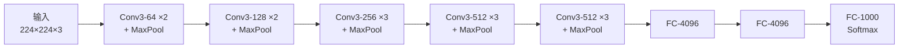

**关键设计**
- **感受野等价性**：两个 3×3 卷积堆叠的感受野等于一个 5×5；三个 3×3 等于一个 7×7。
- **参数量对比**：假设通道数均为 $C$，
  - 3 个 3×3 卷积：$3 \times (3^2 C^2) = 27C^2$
  - 1 个 7×7 卷积：$7^2 C^2 = 49C^2$
  - 参数量减少约 45%，且引入 3 次非线性激活。
- **统一架构**：整个网络只用 3×3 卷积、2×2 最大池化，结构极其规整。
- **训练技巧**：先训练浅层（11 层）再迁移初始化深层网络。

**影响与意义**
- 证明**深度**是提升性能的关键因素。
- 其规整结构成为后续网络设计的参考基准，VGG 特征至今仍用于风格迁移、感知损失等任务。

---

### 3. GoogLeNet / Inception (2014) — 使用并行架构构造更深的网络

**核心思想**
不纠结于「用多大卷积核」，而是**在同一层并行使用多种尺寸的卷积核**（1×1、3×3、5×5、池化），让网络自己选择最合适的尺度。

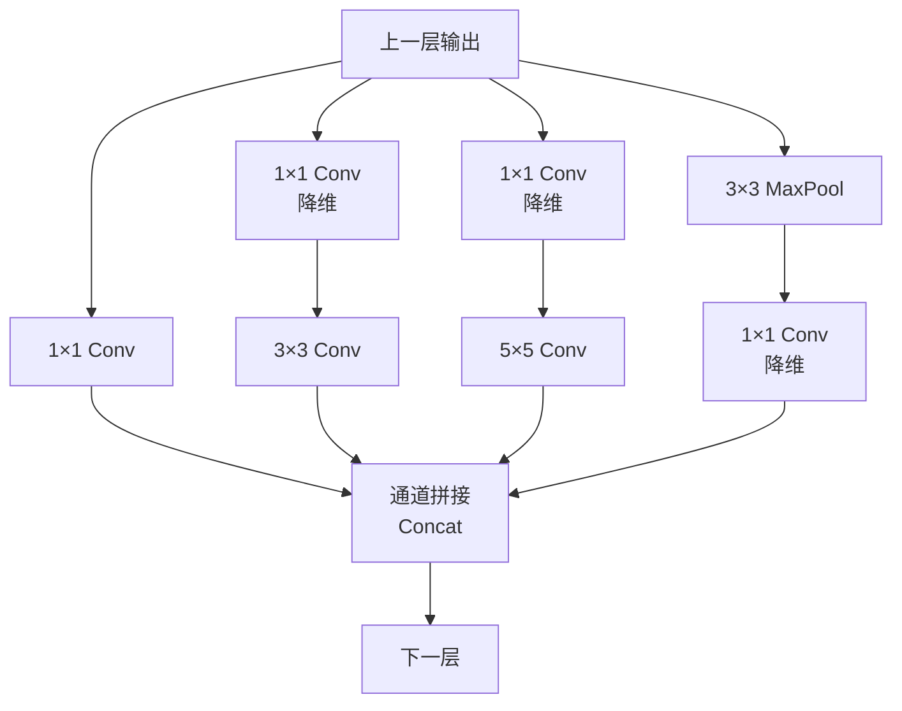

**关键设计**
- **Inception 模块**：并行分支 + 通道拼接（concat）。
- **1×1 卷积降维**：在 3×3、5×5 卷积前先用 1×1 卷积压缩通道，控制计算量。这是「瓶颈结构」的雏形。
- **全局平均池化（GAP）**：替代最后的全连接层，大幅减少参数量（AlexNet 全连接层占 90% 参数）。
- **辅助分类器**：在中间层加两个辅助 softmax 分支，缓解深层梯度消失。
- **22 层深度**，参数量仅 5M（AlexNet 的 1/12）。

**影响与意义**
- 提出「多尺度并行」与「瓶颈降维」两大设计思想。
- 1×1 卷积成为后续所有高效网络的标准组件。

---

### 4. ResNet (2015) — 构建深层网络都要有的残差连接

**核心思想**
解决深层网络的**退化问题**（degradation）：56 层网络比 20 层网络训练误差更高，这不是过拟合而是优化困难。ResNet 引入**残差连接**，让网络学习「残差映射」而非「完整映射」。

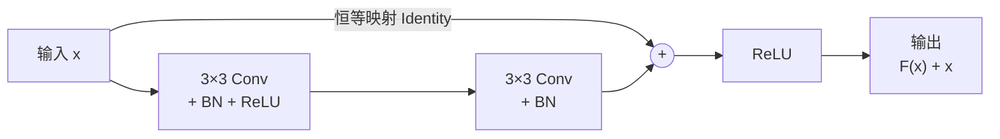

**关键设计**
- **残差块**：$y = F(x) + x$，其中 $F(x)$ 是残差函数。
- **恒等映射的易学性**：如果某层不需要变换，网络只需将 $F(x)$ 学成 0，比直接学 $F(x)=x$ 容易得多。
- **梯度高速公路**：反向传播时梯度可通过恒等路径直接回传，缓解梯度消失。
  $$\frac{\partial \mathcal{L}}{\partial x} = \frac{\partial \mathcal{L}}{\partial y}\left(1 + \frac{\partial F}{\partial x}\right)$$
  其中「1」保证了梯度不会消失。
- **瓶颈块（Bottleneck）**：1×1 → 3×3 → 1×1，用于 ResNet-50/101/152。
- **Batch Normalization**：配合残差连接稳定训练。

**影响与意义**
- 成功训练 152 层甚至 1000+ 层网络，ImageNet Top-5 错误率降至 3.57%。
- 残差连接成为**所有现代深度网络（含 Transformer）的标配**。

---

### 5. MobileNet (2017) — 适合终端设备的小 CNN

**核心思想**
用**深度可分离卷积（Depthwise Separable Convolution）**替代标准卷积，大幅降低计算量和参数量，使 CNN 能部署在手机等移动设备上。

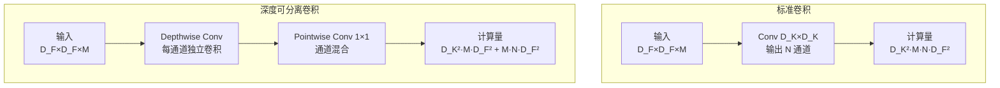

**关键设计**
- **深度可分离卷积 = 深度卷积 + 逐点卷积**
  - 深度卷积：每个通道独立做空间卷积（不混合通道）
  - 逐点卷积：1×1 卷积负责通道混合
- **计算量对比**（输入 $D_F \times D_F \times M$，输出 $D_F \times D_F \times N$，卷积核 $D_K$）：
  - 标准卷积：$D_K^2 \cdot M \cdot N \cdot D_F^2$
  - 深度可分离卷积：$D_K^2 \cdot M \cdot D_F^2 + M \cdot N \cdot D_F^2$
  - 压缩比：$\dfrac{1}{N} + \dfrac{1}{D_K^2}$，当 $D_K=3$、$N \gg 9$ 时约为 **1/8 ~ 1/9**
- **宽度乘子 $\alpha$** 与 **分辨率乘子 $\rho$**：可调超参，在精度与速度间权衡。
- **ReLU6**：限制激活值上限为 6，适合低精度定点运算。

**影响与意义**
- 移动端视觉的基石，后续 MobileNetV2（倒残差 + 线性瓶颈）、V3（NAS 搜索）持续演进。

---

### 6. EfficientNet (2019) — 通过架构搜索得到的 CNN

**核心思想**
提出**复合缩放（Compound Scaling）**：网络的深度、宽度、分辨率三个维度应**按固定比例协同放大**，而非单独放大某一维。

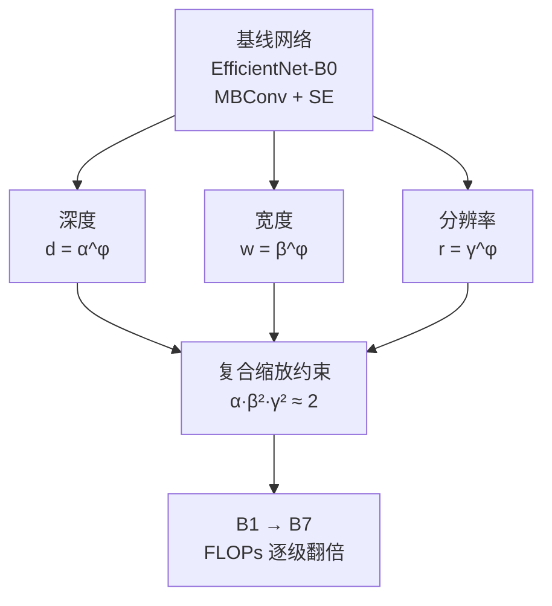

**关键设计**
- **复合缩放公式**：
  $$\text{depth}: d = \alpha^\phi,\quad \text{width}: w = \beta^\phi,\quad \text{resolution}: r = \gamma^\phi$$
  $$\text{s.t.}\quad \alpha \cdot \beta^2 \cdot \gamma^2 \approx 2,\quad \alpha,\beta,\gamma \ge 1$$
  其中 $\phi$ 是用户指定的缩放系数，$\alpha,\beta,\gamma$ 由小规模网格搜索确定。
- **约束来源**：卷积计算量正比于 $d \cdot w^2 \cdot r^2$，故约束乘积为 2 使 FLOPs 约翻倍。
- **MBConv 基础块**：来自 MobileNetV2 的倒残差结构 + SE 注意力。
- **NAS 搜索**：用 MnasNet 式多目标搜索得到 EfficientNet-B0 基线。

**影响与意义**
- ImageNet 上以 1/5 的参数量达到当时 SOTA。
- 复合缩放思想被广泛借鉴（如 EfficientNetV2、ConvNeXt 的缩放策略）。

---

### 7. Non-deep Networks (2021) — 让不深的网络也能在 ImageNet 刷到 SOTA

**核心思想**
挑战「深度是性能关键」的共识：**并行子网络（Parallel subnetworks）**可以在不增加深度的情况下提升表示能力。提出 **ParNet**，仅 12 层深度即可达到 ResNet-152 级别的精度。

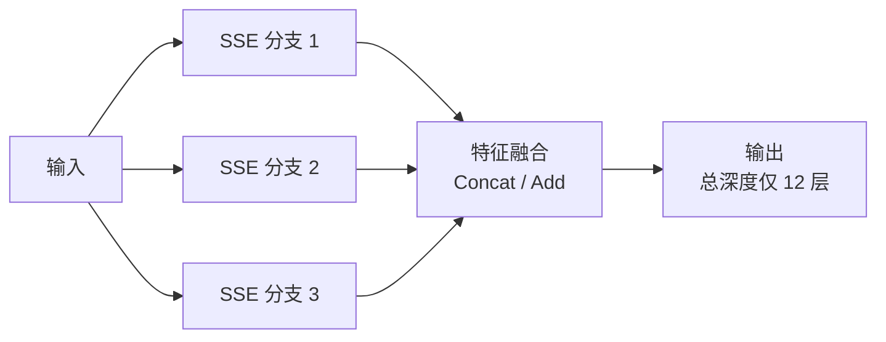

**关键设计**
- **并行分支结构**：多个浅层分支并行处理，最后融合，等效于增加「宽度 + 多尺度」。
- **RepVGG 式重参数化**：训练时多分支，推理时融合为单路，不增加推理成本。
- **深度-宽度权衡**：论文指出低深度网络在**延迟敏感场景**（如边缘设备、需要低延迟的实时系统）有独特优势。
- **SSE（Skip-Squeeze-Excitation）**：分支间的特征交互模块。

**影响与意义**
- 证明深度不是唯一路径，为低延迟部署提供新思路。
- 对「深度 vs 宽度」的理论理解有补充价值。

---

## 二、计算机视觉 - Transformer

### 1. ViT (2020) — Transformer 杀入 CV 界

**核心思想**
将图像切成固定大小的**图像块（patch）**，线性嵌入后当作「词序列」送入标准 Transformer 编码器。证明**纯 Transformer 无需卷积**也能在图像分类上达到 SOTA，但需要大规模数据预训练。

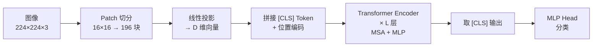

**关键设计**
- **Patch Embedding**：图像 $H \times W \times C$ 切成 $N = HW/P^2$ 个 $P \times P$ 块，展平后线性投影到 $D$ 维。
- **位置编码**：可学习的一维位置嵌入（实验表明 2D-aware 编码无显著提升）。
- **Class Token**：借鉴 BERT，在序列前加一个可学习的 `[CLS]` token，其输出用于分类。
- **归纳偏置的缺失**：ViT 缺少 CNN 的平移不变性和局部性先验，因此**必须在大数据集（JFT-300M）上预训练**才能超越 CNN；在中小数据集（ImageNet）上不如 ResNet。
- **混合架构**：也可用 CNN 特征图替代原始 patch 作为输入。

**影响与意义**
- 开启 Vision Transformer 时代，后续 Swin、MAE、DINO 等均基于此。
- 揭示「大数据 + 大模型 + 少归纳偏置」的 Scaling Law 在视觉同样成立。

---

### 2. Swin Transformer (2021) — 多层次的 Vision Transformer

**核心思想**
ViT 的 patch 尺寸固定，导致**单尺度、高计算量**（自注意力是序列长度的平方）。Swin 引入**层次化结构**和**移动窗口注意力**，使 Transformer 适配密集预测任务（检测、分割）。

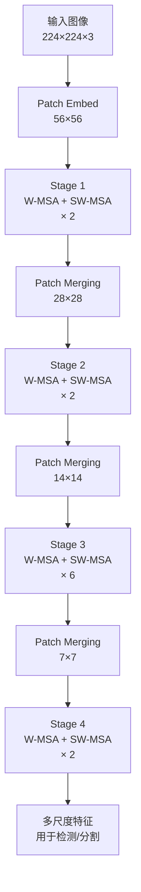

**关键设计**
- **层次化特征图**：像 CNN 一样分 4 个 stage，逐级下采样 2 倍，产生多尺度特征。
- **窗口注意力（W-MSA）**：将注意力限制在 $M \times M$ 局部窗口内，复杂度从 $O(N^2)$ 降到 $O(N)$。
- **移动窗口（SW-MSA）**：相邻层窗口偏移 $M/2$，实现跨窗口信息交互。
- **Shift 的高效实现**：用 `torch.roll` + 掩码，避免实际像素搬移。
- **相对位置偏置**：在注意力中加入相对位置编码，提升性能。

**影响与意义**
- 成为检测/分割的通用骨干网络（Swin-T/S/B/L）。
- 2021 年 ICCV 最佳论文（Marr Prize）。

---

### 3. MLP-Mixer (2021) — 使用 MLP 替换 self-attention

**核心思想**
既然 Transformer 的核心是「token 混合 + 通道混合」，那么**用纯 MLP 也能做到**。提出完全不含卷积和注意力的架构，仅用 MLP 在 patch 间和通道间交替混合。

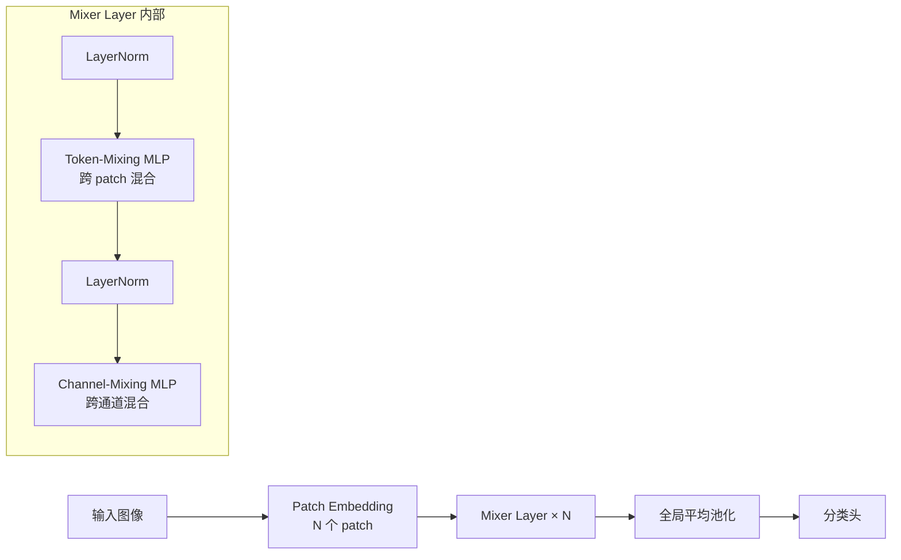

**关键设计**
- **两种 MLP 交替**：
  - **Token-mixing MLP**：在 patch 维度（跨空间位置）做 MLP，权重共享。
  - **Channel-mixing MLP**：在通道维度做 MLP。
- **结构**：`Patch Embedding → [Token-MLP → Channel-MLP] × N → GAP → 分类头`
- **计算复杂度**：token-mixing 是 $O(N^2)$（$N$ 为 patch 数），与注意力相同，但无 softmax。
- **性能**：在大数据预训练下接近 ViT，但小数据下明显更差。

**影响与意义**
- 引发「注意力是否必要」的讨论，催生 gMLP、ConvMixer 等一批工作。
- 说明**架构的归纳偏置与数据规模强相关**。

---

### 4. MAE (2021) — BERT 的 CV 版

**核心思想**
将 BERT 的**掩码语言建模**迁移到视觉：随机遮挡 75% 的图像块，让模型**重建被遮挡的像素**。由于图像信息冗余度高，需要极高掩码率才能形成有意义的自监督任务。

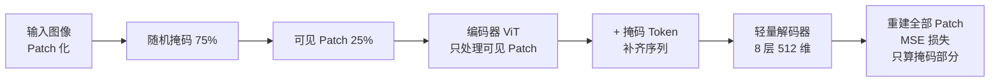

**关键设计**
- **非对称编码器-解码器**：
  - **编码器**：只处理**可见的 25% patch**（计算量降至 1/4），是标准 ViT。
  - **解码器**：轻量级（8 层、512 维），接收编码器输出 + 掩码 token，重建全部 patch。
- **高掩码率（75%）**：相比 BERT 的 15%，因为图像空间冗余远高于语言。
- **重建目标**：归一化后的像素值（每 patch 内做 mean/std 归一化），MSE 损失。
- **损失只算在掩码 patch 上**。

**影响与意义**
- 训练效率比对比学习（如 BEiT、SimMIM）高 3 倍以上。
- 学到的特征在检测、分割、迁移任务上表现优异，成为视觉自监督的重要范式。

---

## 三、生成模型

### 1. GAN (2014) — 生成对抗网络

**核心思想**
用**对抗博弈**训练生成器：生成器 $G$ 试图骗过判别器 $D$，判别器 $D$ 试图区分真假样本。二者交替优化，最终 $G$ 学得真实数据分布。

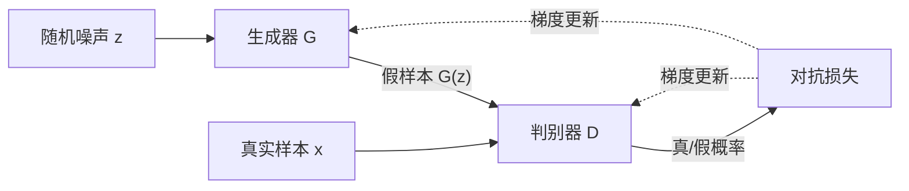

**关键设计**
- **极小极大博弈目标**：
  $$\min_G \max_D \mathbb{E}_{x \sim p_{data}}[\log D(x)] + \mathbb{E}_{z \sim p_z}[\log(1 - D(G(z)))]$$
- **理论保证**：当 $D$ 达到最优时，$G$ 的优化等价于最小化 $p_{data}$ 与 $p_g$ 的 **Jensen-Shannon 散度**。
- **全局最优**：$p_g = p_{data}$ 时 $D \equiv 1/2$，达到纳什均衡。
- **无需显式密度建模**：只需从 $G$ 采样，避免了对复杂似然的计算。

**影响与意义**
- 开创生成模型新范式，催生 DCGAN、WGAN、StyleGAN、CycleGAN 等大量工作。
- 训练不稳定、模式崩溃（mode collapse）是其固有难题。

---

### 2. DCGAN (2015) — 把 CNN 引入 GAN

**核心思想**
为 GAN 的生成器和判别器设计**稳定的卷积架构**，使训练可控、可复现。

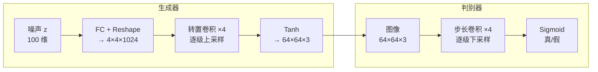

**关键设计**
- **架构约束**：
  - 用**步长卷积**替代所有池化层（判别器用 strided conv，生成器用转置卷积）。
  - 生成器和判别器都使用 **Batch Normalization**。
  - 移除所有全连接层（除输入/输出）。
  - 生成器输出层用 **Tanh**，其余层用 **ReLU**。
  - 判别器所有层用 **LeakyReLU**（斜率 0.2）。
- **潜在空间算术**：$z$ 向量具有线性语义（如「戴眼镜的男性」−「男性」+「女性」=「戴眼镜的女性」）。
- **潜在空间插值**：平滑过渡证明 $G$ 学到了有意义的表示。

**影响与意义**
- 首个稳定可训练的卷积 GAN，成为后续 GAN 的标准骨架。

---

### 3. pix2pix (2016) — 条件 GAN 做图像到图像翻译

**核心思想**
用**条件 GAN** 解决通用的 image-to-image 翻译：给定输入图像，生成对应的输出图像（如边缘→照片、黑白→彩色、语义图→街景）。

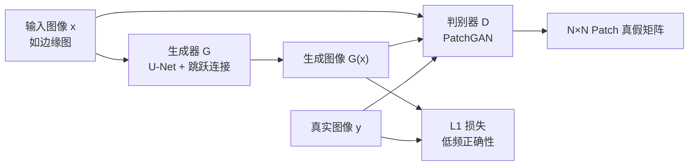

**关键设计**
- **条件 GAN 目标**：
  $$\mathcal{L}_{cGAN} = \mathbb{E}_{x,y}[\log D(x,y)] + \mathbb{E}_{x,z}[\log(1 - D(x, G(x,z)))]$$
  判别器同时看输入 $x$ 和输出 $y$，判断「是否匹配」。
- **U-Net 生成器**：编码器-解码器 + 跳跃连接，保留低级细节。
- **PatchGAN 判别器**：不判断整图真假，而是对 $N \times N$ patch 逐块判断，输出一个矩阵。参数量小、聚焦高频细节。
- **L1 损失**：$\mathcal{L}_{L1} = \|y - G(x,z)\|_1$，保证低频正确性，与 GAN 损失互补。
- **总损失**：$\mathcal{L} = \mathcal{L}_{cGAN} + \lambda \mathcal{L}_{L1}$（$\lambda = 100$）。

**影响与意义**
- 提出通用图像翻译框架，无需针对任务设计损失函数。
- PatchGAN 与 U-Net 组合被后续大量工作沿用。

---

### 4. SRGAN (2016) — 图片超分辨率

**核心思想**
传统超分用 MSE 损失，导致结果**过度平滑、缺乏纹理**。SRGAN 引入**感知损失 + 对抗损失**，生成视觉上更真实的高分辨率图像。

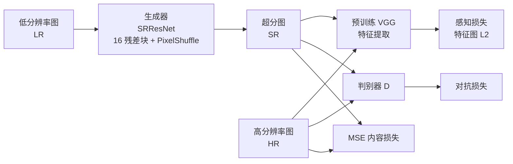

**关键设计**
- **感知损失（Perceptual Loss）**：用预训练 VGG 网络的特征图计算损失，而非像素级 MSE。
  $$\mathcal{L}_{VGG} = \frac{1}{W_{i,j}H_{i,j}}\sum \|\phi_{i,j}(I^{HR}) - \phi_{i,j}(G(I^{LR}))\|_2^2$$
- **对抗损失**：判别器区分真实 HR 图与生成图，迫使生成器产生真实纹理。
- **内容损失**：$\mathcal{L}_{content} = \mathcal{L}_{VGG} + 10^{-3} \mathcal{L}_{MSE}$。
- **SRResNet 生成器**：16 个残差块 + 亚像素卷积（PixelShuffle）上采样。
- **评价指标**：PSNR/SSIM 略降，但 **MOS（主观评分）显著提升**。

**影响与意义**
- 揭示「像素级指标」与「感知质量」的矛盾，推动感知损失成为超分/增强的标准工具。

---

### 5. WGAN (2017) — 训练更加容易

**核心思想**
原始 GAN 用 JS 散度衡量分布差异，当两个分布**不重叠**时梯度消失。WGAN 改用 **Wasserstein 距离（推土机距离）**，即使分布不重叠也能提供有意义的梯度。

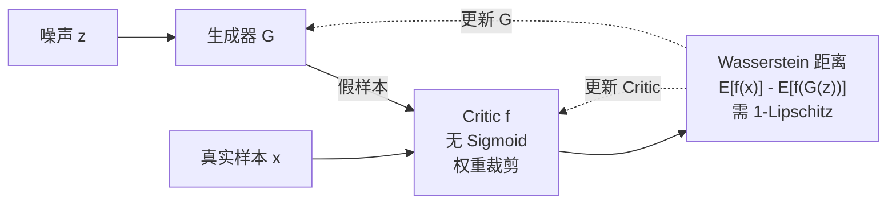

**关键设计**
- **Wasserstein 距离**：
  $$W(p_r, p_g) = \inf_{\gamma \sim \Pi(p_r,p_g)} \mathbb{E}_{(x,y)\sim\gamma}[\|x - y\|]$$
- **Kantorovich-Rubinstein 对偶**：
  $$W(p_r,p_g) = \sup_{\|f\|_L \le 1} \mathbb{E}_{x\sim p_r}[f(x)] - \mathbb{E}_{x\sim p_g}[f(x)]$$
  要求 $f$ 满足 **1-Lipschitz 连续**。
- **权重裁剪（Weight Clipping）**：将判别器（改称 Critic）权重限制在 $[-c, c]$，强制 Lipschitz 约束。
- **去掉判别器最后的 Sigmoid**：输出实数而非概率。
- **损失函数**：$\mathcal{L}_D = \mathbb{E}[f(G(z))] - \mathbb{E}[f(x)]$，$\mathcal{L}_G = -\mathbb{E}[f(G(z))]$。
- **理论优势**：$W$ 距离连续且几乎处处可导，训练更稳定，且损失值可反映生成质量。

**影响与意义**
- 解决 GAN 训练不稳定与模式崩溃问题。
- 后续 WGAN-GP 用梯度惩罚替代权重裁剪，效果更好。

---

### 6. CycleGAN (2017) — 无配对图像翻译

**核心思想**
pix2pix 需要**成对**训练数据（同一场景的输入输出）。CycleGAN 用**循环一致性损失**实现**无配对**翻译（如马↔斑马、夏天↔冬天）。

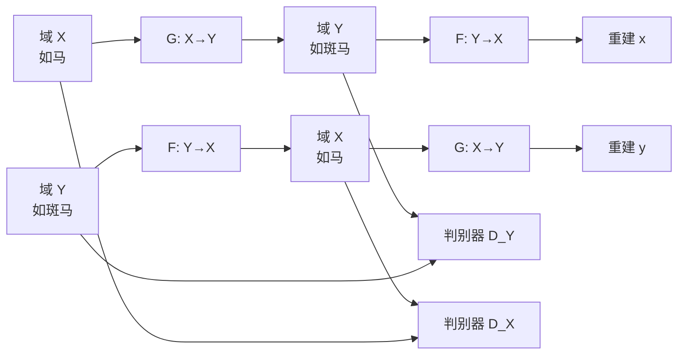

**关键设计**
- **两个生成器 + 两个判别器**：$G: X \to Y$，$F: Y \to X$。
- **循环一致性损失**：
  $$\mathcal{L}_{cyc} = \mathbb{E}_{x}[\|F(G(x)) - x\|_1] + \mathbb{E}_{y}[\|G(F(y)) - y\|_1]$$
  即「翻译过去再翻译回来应还原」。
- **对抗损失**：$G$ 生成的 $Y$ 域图像要骗过 $D_Y$，反之亦然。
- **总损失**：$\mathcal{L} = \mathcal{L}_{GAN} + \lambda \mathcal{L}_{cyc}$（$\lambda = 10$）。
- **循环一致性为何有效**：它约束了映射的**双射性**，防止模式崩溃（否则 $G$ 可以把所有 $x$ 映射到同一个 $y$）。

**影响与意义**
- 大幅降低图像翻译的数据门槛，成为无监督域适应的经典方法。

---

### 7. StyleGAN (2018) — 风格驱动的生成

**核心思想**
借鉴风格迁移的思想，重新设计生成器：**将随机噪声注入到每一层**，实现「粗粒度风格（姿态、脸型）」与「细粒度风格（发丝、雀斑）」的解耦控制。

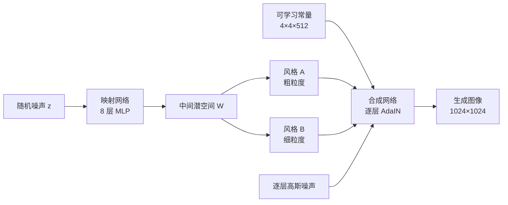

**关键设计**
- **映射网络（Mapping Network）**：8 层 MLP 将 $z$ 映射到中间潜空间 $\mathcal{W}$，解耦潜空间。
- **AdaIN（自适应实例归一化）**：
  $$\text{AdaIN}(x_i, y) = y_{s,i}\frac{x_i - \mu(x_i)}{\sigma(x_i)} + y_{b,i}$$
  用风格向量 $y$ 的缩放/偏置调制特征。
- **噪声注入**：每层加入高斯噪声，只影响随机细节（如发丝位置），不影响整体结构。
- **渐进式增长（Progressive Growing）**：从 4×4 逐步增长到 1024×1024。
- **风格混合（Style Mixing）**：训练时用两个 $z$ 的不同层风格，防止层间相关性。
- **解耦度量**：提出 PPL（Perceptual Path Length）衡量潜空间平滑度。

**影响与意义**
- 首次实现高质量、可控的人脸生成，FFHQ 数据集成为标准。
- 引发 deepfake 等伦理讨论。

---

### 8. StyleGAN2 (2019) — 修复伪影

**核心思想**
分析并修复 StyleGAN 生成图像中的**水滴状伪影（artifacts）**，并改进训练与评价指标。

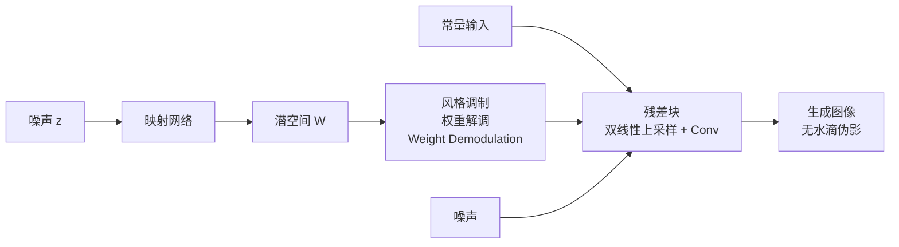

**关键设计**
- **伪影根因**：AdaIN 的实例归一化会「抹掉」特征中的均值信息，导致生成器用「尖峰」方式编码信息。
- **权重解调（Weight Demodulation）**：将 AdaIN 从激活层移到**权重层**，对卷积核做归一化：
  $$w'_{ijk} = s_i \cdot w_{ijk} / \sqrt{\sum_{i,k} (s_i w_{ijk})^2 + \epsilon}$$
- **移除渐进式增长**：改用**残差架构 + 跳跃连接**，训练更稳定。
- **路径长度正则化**：$\mathcal{L}_{PPL}$ 惩罚潜空间方向上的过大变化。
- **无伪影生成器**：用双线性上采样 + 卷积替代转置卷积，消除棋盘格伪影。
- **新指标 PPL / P&R**：更全面地评价生成质量与多样性。

**影响与意义**
- 生成质量进一步提升，成为 GAN 图像生成的巅峰之作。

---

### 9. DDPM (2020) — 扩散模型

**核心思想**
用**两个马尔可夫链**建模生成过程：
- **前向过程**：逐步向图像加高斯噪声，直到变成纯噪声（固定，无需学习）。
- **反向过程**：学习逐步去噪，从纯噪声恢复图像。

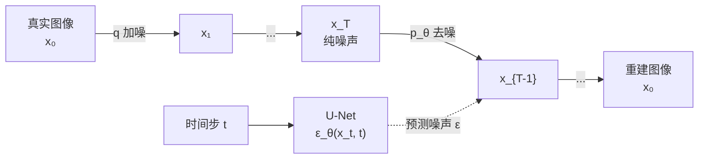

**关键设计**
- **前向加噪**：
  $$q(x_t | x_{t-1}) = \mathcal{N}(x_t; \sqrt{1-\beta_t}x_{t-1}, \beta_t I)$$
  可重参数化为一步到位：
  $$q(x_t|x_0) = \mathcal{N}(x_t; \sqrt{\bar\alpha_t}x_0, (1-\bar\alpha_t)I)$$
  其中 $\bar\alpha_t = \prod_{s=1}^t (1-\beta_s)$。
- **反向去噪**：
  $$p_\theta(x_{t-1}|x_t) = \mathcal{N}(x_{t-1}; \mu_\theta(x_t,t), \Sigma_\theta(x_t,t))$$
- **简化训练目标**：预测噪声 $\epsilon$ 而非均值
  $$\mathcal{L}_{simple} = \mathbb{E}_{t,x_0,\epsilon}\left[\|\epsilon - \epsilon_\theta(\sqrt{\bar\alpha_t}x_0 + \sqrt{1-\bar\alpha_t}\epsilon, t)\|^2\right]$$
- **U-Net 骨干**：带时间步嵌入的 U-Net 预测噪声。
- **与去噪分数匹配的等价性**：预测噪声等价于学习数据分布的**分数函数** $\nabla_x \log p(x)$。

**影响与意义**
- 生成质量超越 GAN，训练更稳定，无模式崩溃。
- 开启扩散模型时代（Stable Diffusion、DALL·E 2、Sora 等）。

---

### 10. Improved DDPM (2021) — 改进的 DDPM

**核心思想**
系统性地改进 DDPM 的训练与采样，用更少的采样步数达到更好的效果。

```mermaid
flowchart TD
    A["DDPM 基线"] --> B["改进 1<br/>余弦噪声调度<br/>cos² 曲线"]
    A --> C["改进 2<br/>学习方差 Σ_θ<br/>预测插值系数 v"]
    A --> D["改进 3<br/>混合损失<br/>L_simple + λ·L_vlb"]
    A --> E["改进 4<br/>重要性采样<br/>按损失采样时间步"]
    B --> F["100 步采样<br/>≈ DDPM 1000 步质量"]
    C --> F
    D --> F
    E --> F
```

**关键设计**
- **余弦噪声调度**：$\bar\alpha_t = \cos^2\left(\frac{t/T + s}{1+s} \cdot \frac{\pi}{2}\right)$，避免线性调度在低噪声端信息破坏过快。
- **学习方差 $\Sigma_\theta$**：DDPM 固定方差为 $\beta_t$，此处让网络预测方差插值系数 $v$：
  $$\Sigma_\theta(x_t,t) = \exp(v \log\beta_t + (1-v)\log\tilde\beta_t)$$
- **混合损失**：$\mathcal{L} = \mathcal{L}_{simple} + \lambda \mathcal{L}_{vlb}$，其中 $\mathcal{L}_{vlb}$ 是变分下界。
- **重要性采样**：对 $\mathcal{L}_{vlb}$ 按损失大小采样时间步，降低梯度噪声。
- **采样加速**：用更少的步数（如 100 步）即可达到 DDPM 1000 步的质量。

**影响与意义**
- 成为后续扩散模型的标准配置（余弦调度、学习方差）。

---

### 11. Guided Diffusion / Diffusion Models Beat GANs (2021) — 号称超越 GAN

**核心思想**
通过**架构改进 + 分类器引导（Classifier Guidance）**，首次让扩散模型在 ImageNet 上全面超越 GAN 的 FID 指标。

```mermaid
flowchart LR
    N["噪声 x_T"] --> U["U-Net<br/>多分辨率注意力<br/>AdaGN 残差块"]
    Y["类别标签 y"] --> C["预训练分类器<br/>p_φ(y|x_t)"]
    U --> S["采样步<br/>μ_θ + s·Σ_θ·∇log p_φ"]
    C -->|"梯度引导"| S
    S --> O["条件生成图像"]
```

**关键设计**
- **架构改进**：
  - 增加深度与宽度、增加注意力头数
  - 多分辨率注意力（32×32、16×16、8×8）
  - BigGAN 残差块 + 自适应组归一化（AdaGN）
- **分类器引导**：用预训练分类器 $p_\phi(y|x_t)$ 的梯度修正采样：
  $$\hat\mu_\theta(x_t|y) = \mu_\theta(x_t|y) + s \cdot \Sigma_\theta(x_t|y) \nabla_{x_t} \log p_\phi(y|x_t)$$
  其中 $s$ 是引导强度。$s$ 越大，样本越符合类别但多样性下降（FID vs IS 权衡）。
- **无分类器引导（Classifier-Free Guidance）**：训练时随机丢弃类别标签，采样时混合条件与无条件预测：
  $$\hat\epsilon = \epsilon_\theta(x_t, \varnothing) + s \cdot (\epsilon_\theta(x_t, y) - \epsilon_\theta(x_t, \varnothing))$$

**影响与意义**
- 证明扩散模型可以超越 GAN，成为生成模型主流。
- 引导采样成为条件生成的标准技术。

---

### 12. StyleGAN3 (2021) — 无混叠的生成器

**核心思想**
StyleGAN2 的生成图像存在**纹理粘连（texture sticking）**问题：细节随图像平移而「粘」在像素网格上，而非随物体移动。根因是**混叠（aliasing）**。StyleGAN3 从信号处理角度设计**平移等变**的生成器。

```mermaid
flowchart LR
    Z["噪声 z"] --> M["映射网络"]
    M --> W["潜空间 W"]
    W --> F["傅里叶特征<br/>替代位置编码"]
    F --> C["卷积层<br/>前置低通滤波"]
    C --> U["上采样<br/>理想低通滤波器<br/>窗化 Sinc"]
    U --> NL["非线性激活<br/>后置低通滤波"]
    NL --> O["平移等变输出<br/>EQ-T ≈ 0.4"]
```

**关键设计**
- **混叠的根源**：上采样、下采样、非线性激活都会引入高频混叠。
- **解决方案**：
  - 所有上/下采样使用**理想低通滤波器**（窗化 Sinc 滤波器）
  - 卷积前做低通滤波，避免非线性产生的高频混叠
  - 移除噪声注入（噪声是逐像素的，破坏等变性）
  - 用**傅里叶特征**替代可学习位置编码
- **等变性度量**：EQ-T（平移等变）、EQ-R（旋转等变）。
- **结果**：EQ-T 从 StyleGAN2 的 47.4 降至 0.4，视频插值中细节随物体自然移动。

**影响与意义**
- 将信号处理理论引入生成模型设计，提升生成器的物理合理性。
- 对视频生成、动画等时序一致性任务意义重大。

---

### 13. DALL·E 2 (2022) — CLIP + Diffusion，文本生成图像新高度

**核心思想**
用 **CLIP 的联合嵌入空间**作为桥梁，将文本条件注入扩散模型，实现高质量、可控的文本到图像生成。

```mermaid
flowchart LR
    T["文本提示"] --> CT["CLIP 文本编码器"]
    CT --> ZT["CLIP 文本嵌入"]
    ZT --> P["Prior 先验<br/>自回归 / 扩散"]
    P --> ZI["CLIP 图像嵌入"]
    ZI --> DEC["Decoder 解码器<br/>扩散模型 unCLIP"]
    DEC --> IMG["生成图像"]
    IMG -.->|"CLIP 图像编码器"| ZI
```

**关键设计**
- **两阶段架构**：
  1. **Prior（先验）**：将 CLIP 文本嵌入映射为 CLIP 图像嵌入。两种实现：
     - **自回归先验**：Transformer 逐 token 生成
     - **扩散先验**：扩散模型生成（效果更好）
  2. **Decoder（解码器）**：以 CLIP 图像嵌入为条件，用扩散模型生成图像（unCLIP 模型）。
- **为什么用 CLIP 嵌入而非直接文本**：CLIP 空间已对齐图文语义，且能利用大规模图文对预训练。
- **无分类器引导**：提升样本质量与文本一致性。
- **图像编辑能力**：在 CLIP 潜空间做插值/编辑，可实现变体生成、属性修改。

**影响与意义**
- 展示「对比学习 + 扩散模型」组合的强大威力。
- 生成质量与语义一致性大幅提升，推动 AIGC 爆发。

---

### 14. Whisper (2022) — 大规模弱监督语音识别

**核心思想**
用 **68 万小时**多语言、多任务的弱监督网络音频训练一个**编码器-解码器 Transformer**，实现鲁棒的语音识别与翻译，无需微调即可跨数据集泛化。

```mermaid
flowchart LR
    A["音频<br/>30 秒片段"] --> B["Log-Mel 频谱图<br/>80 通道"]
    B --> C["编码器<br/>Transformer"]
    C --> D["解码器<br/>Transformer"]
    D --> E["特殊 Token 序列<br/>startoftranscript + 语言 + 任务 + 时间戳"]
    E --> F["文本输出<br/>转录 / 翻译"]
```

**关键设计**
- **数据规模**：680,000 小时（其中 117,000 小时多语言 + 125,000 小时翻译数据）。
- **弱监督**：数据来自互联网，标注质量参差不齐，但规模弥补了噪声。
- **多任务格式**：用特殊 token 统一表示任务
  ```
  <|startoftranscript|><|zh|><|transcribe|><|0.00|> 文本内容 <|endoftext|>
  ```
  支持：转录、翻译、语言识别、时间戳预测。
- **架构**：标准 Transformer 编码器-解码器（无特殊创新）。
- **鲁棒性**：在分布外数据上零样本性能接近有监督模型。

**影响与意义**
- 证明「大规模弱监督 + 通用架构」在语音领域同样有效。
- 开源模型成为语音识别的事实标准。

---

### 15. Action-GPT (2022) — 用语言模型生成动作

**核心思想**
利用**大语言模型（LLM）**的常识推理能力，将自然语言描述转化为**细粒度的人体动作序列**，用于文本驱动的动作生成。

```mermaid
flowchart LR
    A["粗粒度文本<br/>一个人慢慢站起来"] --> B["LLM 动作规划器<br/>分解为细粒度描述"]
    B --> C["细粒度动作描述<br/>如 抬腿 → 前倾 → 起身"]
    C --> D["动作生成器<br/>映射为动作序列"]
    D --> E["人体动作序列<br/>HumanML3D 格式"]
    E --> F["CLIP 语义对齐<br/>保证文本一致"]
```

**关键设计**
- **LLM 作为动作规划器**：将粗粒度文本（如「一个人慢慢地站起来」）分解为细粒度动作描述。
- **动作生成器**：将细粒度描述映射为人体动作序列（如 HumanML3D 格式）。
- **语言-动作对齐**：利用 CLIP 等模型保证生成动作与文本语义一致。
- **零样本泛化**：借助 LLM 的常识，可处理训练集中未出现的动作组合。

**影响与意义**
- 展示 LLM 作为「跨模态规划器」的潜力。
- 推动文本驱动动画、虚拟人、机器人动作生成等应用。

---

### 16. LLaMA (2023) — 开放高效的基础语言模型

**核心思想**
用**公开数据集**训练一系列高效的基础语言模型（7B~65B），证明**在更多数据上训练更小的模型**可以超越更大的模型。

```mermaid
flowchart LR
    A["输入 Token"] --> B["嵌入层"]
    B --> C["Transformer Block × N"]
    C --> D["RMSNorm"]
    D --> E["输出投影<br/>词表 32000"]
    E --> F["下一 Token 预测"]
    subgraph C1["每个 Block 内部"]
        G["RMSNorm<br/>Pre-Norm"] --> H["自注意力<br/>RoPE 旋转位置编码"] --> I["残差"] --> J["RMSNorm"] --> K["SwiGLU FFN"] --> L["残差"]
    end
```

**关键设计**
- **Chinchilla 缩放律**：给定计算预算，模型大小与训练 token 数应同比缩放。LLaMA-7B 用 1T token 训练（远超 GPT-3 的 300B）。
- **架构改进**（基于 Transformer 的现代化改造）：
  - **Pre-normalization**：用 RMSNorm，归一化放在子层前
  - **SwiGLU 激活函数**：替代 ReLU，提升性能
  - **旋转位置编码（RoPE）**：替代绝对位置编码，支持更长上下文
- **训练效率**：65B 模型用 2048 张 A100 训练 21 天。
- **性能**：LLaMA-13B 超越 GPT-3 (175B)，65B 接近 Chinchilla-70B。

**影响与意义**
- 开源模型生态的引爆点（Alpaca、Vicuna、Llama 2/3 等均基于此）。
- 证明数据质量与规模比单纯堆参数更重要。

---

### 17. PaLM-E (2023) — 具身多模态语言模型

**核心思想**
将**视觉、语言、机器人状态**统一到一个 LLM 中，实现「具身智能」：模型能看图、理解语言、并输出机器人动作。

```mermaid
flowchart LR
    IMG["图像"] --> VIT["ViT 编码器"]
    VIT --> PJ1["投影层"]
    TXT["文本"] --> TE["文本 Token 化"]
    ST["机器人状态<br/>关节角度"] --> PJ2["线性投影"]
    PJ1 --> SEQ["统一 Token 序列"]
    TE --> SEQ
    PJ2 --> SEQ
    SEQ --> LLM["PaLM-E<br/>562B 参数"]
    LLM --> OUT["文本回答 / 机器人动作"]
```

**关键设计**
- **多模态 token 化**：
  - 文本 → 标准 token
  - 图像 → ViT 编码 + 投影到 LLM 嵌入空间
  - 机器人状态（关节角度等）→ 线性投影
  - 动作 → 文本形式输出
- **统一序列建模**：所有模态拼成一个序列，用自回归方式训练。
- **规模**：562B 参数（基于 PaLM）。
- **正迁移**：多任务联合训练时，视觉-语言任务与机器人任务互相促进。
- **涌现能力**：可执行多步推理、零样本泛化到新任务。

**影响与意义**
- 展示 LLM 作为通用「具身智能体大脑」的可行性。
- 推动 VLA（Vision-Language-Action）模型研究（如 RT-2）。

---

### 18. HuggingGPT (2023) — 用 LLM 调度 AI 模型

**核心思想**
将 LLM 作为**控制器**，调用 HuggingFace 上的各种专家模型完成复杂任务。LLM 负责「任务规划 → 模型选择 → 执行 → 结果整合」。

```mermaid
flowchart TD
    U["用户请求<br/>请生成一张猫的图并描述它"] --> P["1. 任务规划<br/>LLM 分解子任务"]
    P --> S["2. 模型选择<br/>从 HuggingFace 选模型"]
    S --> E1["子任务 1<br/>Stable Diffusion 生成"]
    S --> E2["子任务 2<br/>ViT 图像分类"]
    E1 --> R["4. 响应生成<br/>LLM 整合结果"]
    E2 --> R
    R --> O["最终回答"]
    D["依赖解析<br/>有向图"] -.-> P
```

**关键设计**
- **四阶段流程**：
  1. **任务规划**：LLM 将用户请求分解为子任务
  2. **模型选择**：根据任务描述从模型库中选模型（基于下载量等指标）
  3. **任务执行**：调用选定模型（如用 ViT 分类、Stable Diffusion 生成）
  4. **响应生成**：LLM 整合所有结果，生成最终回答
- **依赖解析**：子任务间可能有依赖（如先检测再分割），用有向图表示。
- **资源处理**：处理模型调用失败、超时等异常。

**影响与意义**
- 提出「LLM 作为操作系统」的 Agent 范式。
- 催生大量 Agent 框架（AutoGPT、LangChain 等）。

---

## 四、计算机视觉 - 目标检测

### 1. R-CNN (2014) — Two-stage 检测的开山之作

**核心思想**
将目标检测转化为「**区域提议 + CNN 分类**」两步：先用选择性搜索生成候选框，再用 CNN 对每个候选框分类。

```mermaid
flowchart LR
    A["输入图像"] --> B["选择性搜索<br/>生成 ~2000 候选框"]
    B --> C["逐个候选框<br/>缩放到 227×227"]
    C --> D["AlexNet<br/>提取 4096 维特征"]
    D --> E["SVM 分类器<br/>每类一个"]
    D --> F["边界框回归<br/>线性回归微调"]
    E --> G["检测结果"]
    F --> G
```

**关键设计**
- **四步流程**：
  1. **区域提议**：选择性搜索（Selective Search）生成约 2000 个候选框
  2. **特征提取**：每个候选框缩放到 227×227，送入 AlexNet 提取 4096 维特征
  3. **分类**：每个类别训练一个 SVM 分类器
  4. **回归**：用线性回归微调候选框位置
- **监督预训练 + 微调**：先在 ImageNet 上预训练，再在检测数据上微调。
- **mAP 提升**：VOC 2007 上从 33.7%（DPM）提升到 58.5%。

**影响与意义**
- 首次证明 CNN 在检测任务上的巨大潜力。
- 缺点：训练慢（多阶段）、推理慢（2000 次 CNN 前向）、存储大。

---

### 2. Fast R-CNN (2015) — 端到端单阶段训练

**核心思想**
解决 R-CNN 的重复计算问题：**整张图只过一次 CNN**，然后用 **RoI Pooling** 从特征图上提取每个候选框的特征。

```mermaid
flowchart LR
    A["输入图像"] --> B["CNN 骨干<br/>整图只过一次"]
    B --> C["共享特征图"]
    D["选择性搜索<br/>候选框"] --> E["RoI Pooling<br/>池化为 7×7"]
    C --> E
    E --> F["全连接层"]
    F --> G["分类头<br/>Softmax"]
    F --> H["回归头<br/>Smooth L1"]
```

**关键设计**
- **RoI Pooling**：将任意大小的 RoI 特征图池化为固定尺寸（如 7×7），使全连接层可处理。
- **多任务损失**：分类 + 边界框回归联合训练
  $$\mathcal{L} = \mathcal{L}_{cls} + \lambda [u \ge 1] \mathcal{L}_{loc}$$
  其中 $\mathcal{L}_{loc}$ 用 **Smooth L1** 损失。
- **单阶段训练**：除区域提议外，其余全部端到端。
- **速度提升**：训练快 9 倍，推理快 213 倍（相比 R-CNN）。
- **SVD 加速全连接层**：进一步提速。

**影响与意义**
- 奠定 two-stage 检测的标准框架。
- 瓶颈转移到区域提议（选择性搜索仍需 2 秒/图）。

---

### 3. Faster R-CNN (2015) — 引入 RPN

**核心思想**
用**区域提议网络（RPN）**替代选择性搜索，实现**完全端到端**的检测，且 RPN 与检测网络**共享卷积特征**。

```mermaid
flowchart LR
    A["输入图像"] --> B["共享卷积层<br/>VGG / ResNet"]
    B --> C["特征图"]
    C --> D["RPN 区域提议网络<br/>9 个锚框/位置"]
    D --> E["候选框 ~300 个<br/>+ 前景/背景分数"]
    C --> F["RoI Pooling"]
    E --> F
    F --> G["分类头"]
    F --> H["回归头"]
    G --> I["检测结果"]
    H --> I
```

**关键设计**
- **RPN 机制**：
  - 在特征图上每个位置放置 $k$ 个**锚框（anchor）**（3 种尺度 × 3 种长宽比 = 9 个）
  - 每个锚框预测 2 个分数（前景/背景）+ 4 个偏移量
  - 输出约 300 个高质量候选框
- **锚框（Anchor）**：这是检测领域的核心概念，用预设的参考框将「无限制回归」转化为「相对偏移回归」。
- **交替训练**：RPN 与 Fast R-CNN 共享卷积层，4 步交替训练。
- **损失函数**：
  $$L(\{p_i\},\{t_i\}) = \frac{1}{N_{cls}}\sum L_{cls}(p_i, p_i^*) + \lambda\frac{1}{N_{reg}}\sum p_i^* L_{reg}(t_i, t_i^*)$$
- **速度**：5 FPS（GPU），实现实时检测。

**影响与意义**
- 首个真正端到端的检测框架，成为 two-stage 检测的标杆。
- 锚框机制被 SSD、YOLOv2 等广泛采用。

---

### 4. SSD (2016) — Single stage 检测

**核心思想**
**单阶段检测**：直接在多个尺度的特征图上预测类别和框偏移，无需区域提议，速度与精度兼顾。

```mermaid
flowchart LR
    A["输入图像<br/>300×300"] --> B["VGG 骨干"]
    B --> C["Conv4_3<br/>38×38"]
    B --> D["Conv7<br/>19×19"]
    B --> E["Conv8_2<br/>10×10"]
    B --> F["Conv9_2<br/>5×5"]
    B --> G["Conv10_2<br/>3×3"]
    B --> H["Conv11_2<br/>1×1"]
    C --> I["多尺度预测<br/>默认框 + 类别 + 偏移"]
    D --> I
    E --> I
    F --> I
    G --> I
    H --> I
    I --> J["NMS 后处理<br/>检测结果"]
```

**关键设计**
- **多尺度特征图**：在 VGG 基础上添加 6 个不同尺度的特征图（38×38 到 1×1），大特征图检测小目标，小特征图检测大目标。
- **默认框（Default Boxes）**：类似锚框，每个特征图位置放置多个不同尺度的默认框。
- **直接预测**：每个默认框预测 $(c+4)$ 个值（$c$ 类分数 + 4 个偏移）。
- **数据增强**：随机裁剪、颜色扰动等。
- **难例挖掘（Hard Negative Mining）**：按损失排序，保持正负样本 1:3 比例。
- **速度**：59 FPS（VOC2007，mAP 74.3%）。

**影响与意义**
- 首个能与 two-stage 精度媲美的单阶段检测器。
- 多尺度预测成为单阶段检测的标准设计。

---

### 5. YOLO (2016) — You Only Look Once

**核心思想**
将检测**重构为回归问题**：把图像划分为 $S \times S$ 网格，每个网格直接预测边界框和类别概率，一次前向即可完成检测。

```mermaid
flowchart LR
    A["输入图像<br/>448×448"] --> B["24 层卷积<br/>+ 2 层全连接"]
    B --> C["输出张量<br/>7×7×30"]
    C --> D["7×7 网格<br/>每格 2 个框"]
    D --> E["每框 5 值<br/>x, y, w, h, 置信度"]
    D --> F["20 类条件概率"]
    E --> G["NMS 后处理"]
    F --> G
    G --> H["检测结果"]
```

**关键设计**
- **网格划分**：$7 \times 7$ 网格，每个网格预测 2 个框（每个框 5 个值：$x,y,w,h,\text{confidence}$）+ 20 类概率。
- **输出张量**：$7 \times 7 \times (2 \times 5 + 20) = 7 \times 7 \times 30$。
- **损失函数**：坐标误差 + 置信度误差 + 分类误差的加权和，坐标用宽高开方（缓解大小框权重不均）。
- **优势**：
  - 极快（45 FPS，Fast YOLO 达 155 FPS）
  - 全局视野，背景误检少
  - 泛化能力强（可迁移到艺术图像）
- **劣势**：定位精度不如 two-stage，小目标与密集目标效果差。

**影响与意义**
- 开创单阶段检测范式，YOLO 系列成为工业界最流行的检测器。

---

### 6. Mask R-CNN (2017) — 实例分割

**核心思想**
在 Faster R-CNN 基础上**并行添加一个分割分支**，实现像素级实例分割，且不损失检测性能。

```mermaid
flowchart LR
    A["输入图像"] --> B["CNN 骨干 + FPN"]
    B --> C["RPN<br/>候选框"]
    C --> D["RoI Align<br/>双线性插值"]
    D --> E["分类头<br/>类别"]
    D --> F["回归头<br/>边界框"]
    D --> G["掩码头<br/>K 个 28×28 二值掩码"]
    E --> H["实例分割结果"]
    F --> H
    G --> H
```

**关键设计**
- **RoI Align**：替代 RoI Pooling，用**双线性插值**解决量化误差（RoI Pooling 两次取整导致掩码与目标错位）。
- **三分支输出**：分类 + 框回归 + 掩码（$K$ 个 $28 \times 28$ 二值掩码，每类一个）。
- **解耦掩码与分类**：掩码分支不预测类别，只输出二值掩码，避免类间竞争。
- **损失**：$\mathcal{L} = \mathcal{L}_{cls} + \mathcal{L}_{box} + \mathcal{L}_{mask}$。
- **性能**：COCO 上实例分割 mAP 37.1%，检测 mAP 39.8%，5 FPS。

**影响与意义**
- 统一了检测、分割、关键点检测（加一个分支即可）。
- RoI Align 成为后续分割网络的标准组件。

---

### 7. YOLOv2 (2017) — 更好、更快、更强

**核心思想**
在 YOLO 基础上引入一系列改进（Batch Norm、锚框、多尺度训练），大幅提升精度与召回率。

```mermaid
flowchart LR
    A["输入<br/>416×416"] --> B["Darknet-19<br/>19 层卷积"]
    B --> C["Conv 特征图<br/>13×13"]
    C --> D["Passthrough<br/>浅层特征拼接"]
    C --> E["锚框预测<br/>k-means 聚类先验"]
    D --> E
    E --> F["直接位置预测<br/>Sigmoid 约束"]
    F --> G["多尺度训练<br/>320 ~ 608"]
    G --> H["检测结果"]
```

**关键设计**
- **Batch Normalization**：每层卷积后加 BN，mAP 提升 2%。
- **高分辨率分类器**：先在 448×448 上微调分类网络，再用于检测。
- **锚框（Anchor Boxes）**：用 k-means 聚类数据集得到先验框尺寸（而非手工设计），召回率从 81% 提升到 88%。
- **维度聚类**：距离度量用 $d(\text{box}, \text{centroid}) = 1 - \text{IOU}$。
- **直接位置预测**：用 sigmoid 约束偏移量在网格内，训练更稳定。
- **细粒度特征（Passthrough）**：将浅层特征与深层特征拼接，提升小目标检测。
- **多尺度训练**：每 10 个 batch 换一次输入尺寸（320~608），使模型适应不同分辨率。
- **Darknet-19 骨干**：19 层卷积 + 5 层池化。

**影响与意义**
- YOLOv2 (YOLO9000) 可检测 9000+ 类，展示检测与分类联合训练的潜力。

---

### 8. YOLOv3 (2018) — 多尺度预测

**核心思想**
引入**特征金字塔（FPN）式的多尺度预测**和更好的骨干网络（Darknet-53），显著提升小目标检测能力。

```mermaid
flowchart LR
    A["输入<br/>416×416"] --> B["Darknet-53<br/>残差连接"]
    B --> C["13×13 特征<br/>大目标"]
    B --> D["26×26 特征<br/>中目标"]
    B --> E["52×52 特征<br/>小目标"]
    C -->|"上采样 + 拼接"| D
    D -->|"上采样 + 拼接"| E
    C --> F["3 锚框预测"]
    D --> G["3 锚框预测"]
    E --> H["3 锚框预测"]
    F --> I["多尺度检测结果"]
    G --> I
    H --> I
```

**关键设计**
- **Darknet-53**：借鉴 ResNet 的残差连接，53 层卷积，比 ResNet-152 快 2 倍且精度相当。
- **多尺度预测**：在 3 个尺度（13×13、26×26、52×52）上预测，每个尺度 3 个锚框，共 9 个锚框（k-means 聚类）。
- **上采样 + 拼接**：深层特征上采样后与浅层特征拼接，融合语义与细节。
- **分类用 Logistic**：替代 softmax，支持多标签分类（一个目标可属于多类）。
- **性能**：COCO mAP 33.0%（AP50 57.9%），速度 51ms/图（Titan X）。

**影响与意义**
- 成为工业界最广泛使用的检测器之一，YOLOv3 是「实用主义」的典范。

---

### 9. CenterNet (2019) — Anchor Free

**核心思想**
**无锚框检测**：将目标表示为其**中心点**，用关键点估计的方式检测目标，无需锚框和非极大值抑制（NMS）。

```mermaid
flowchart LR
    A["输入图像"] --> B["编码器-解码器<br/>如 ResNet + 上采样"]
    B --> C["中心点热力图<br/>C 个类别"]
    B --> D["中心点偏移<br/>亚像素修正"]
    B --> E["尺寸回归<br/>w, h"]
    C --> F["提取局部峰值<br/>即目标中心"]
    D --> F
    E --> F
    F --> G["检测结果<br/>无需 NMS"]
```

**关键设计**
- **中心点热力图**：预测 $C$ 个类别的热力图，峰值位置即目标中心。
- **中心点偏移**：预测亚像素级偏移，弥补下采样量化误差。
- **尺寸回归**：直接回归目标的宽高 $(w, h)$。
- **损失函数**：
  - 热力图用 **Focal Loss** 变体（惩罚中心点附近的负样本）
  - 偏移和尺寸用 L1 损失
- **无需 NMS**：因为每个目标只有一个中心点，后处理只需提取局部峰值。
- **速度**：142 FPS（COCO mAP 28.1%），精度与速度俱佳。

**影响与意义**
- 开创 anchor-free 检测范式，后续 FCOS、CornerNet 等跟进。
- 同一框架可扩展到 3D 检测、姿态估计、人体关键点。

---

### 10. DETR (2020) — Transformer 做检测

**核心思想**
用 **Transformer 编码器-解码器**将检测建模为**集合预测**问题，彻底移除锚框和 NMS，实现真正的端到端检测。

```mermaid
flowchart LR
    A["输入图像"] --> B["CNN 骨干<br/>ResNet"]
    B --> C["特征图<br/>+ 位置编码"]
    C --> D["Transformer 编码器"]
    D --> E["Transformer 解码器"]
    Q["N 个可学习<br/>Object Queries"] --> E
    E --> F["N 个预测<br/>类别 + 边界框"]
    F --> G["匈牙利算法<br/>二分图匹配"]
    G --> H["集合预测损失<br/>无需 NMS"]
```

**关键设计**
- **CNN 骨干 + Transformer**：CNN 提取特征图，展平后加位置编码送入 Transformer。
- **可学习的目标查询（Object Queries）**：$N$ 个（如 100 个）可学习的嵌入，每个查询输出一个目标（类别 + 框）。
- **二分图匹配损失**：用 **匈牙利算法**在预测与真值间做最优匹配，再计算损失：
  $$\hat\sigma = \arg\min_{\sigma \in \mathfrak{S}_N} \sum_i \mathcal{L}_{match}(y_i, \hat{y}_{\sigma(i)})$$
- **集合预测损失**：分类用交叉熵，框用 L1 + GIoU 损失。
- **无需 NMS**：匈牙利匹配保证一对一，天然避免重复预测。
- **性能**：COCO mAP 42.0%（与 Faster R-CNN 相当），但训练收敛慢（500 epoch）。

**影响与意义**
- 首个端到端 Transformer 检测器，开启检测新范式。
- 后续 Deformable DETR、DINO-DETR 等解决收敛慢问题。

---

## 五、计算机视觉 - 对比学习

> **对比学习核心思想**：通过「拉近正样本对、推远负样本对」学习表征。正样本通常是同一图像的不同增强视图。

### 1. InstDisc (2018) — 提出实例判别和 Memory Bank

**核心思想**
将**每个实例视为一个独立类别**（instance discrimination），用对比学习训练无监督特征。提出 **Memory Bank** 存储所有样本的特征。

```mermaid
flowchart LR
    A["图像 x"] --> B["CNN 编码器"]
    B --> C["特征 f"]
    C --> D["NCE 损失"]
    MB["Memory Bank<br/>N × 128 维<br/>存储所有样本特征"] --> D
    D --> E["实例判别<br/>x 应识别为自己"]
    C -.->|"更新"| MB
```

**关键设计**
- **实例判别**：$N$ 张图 = $N$ 个类别，目标是让每张图被正确识别为自己。
- **Memory Bank**：存储所有样本的特征向量（如 12800 × 128），每次更新当前 batch 的特征。
- **NCE 损失（Noise Contrastive Estimation）**：将多分类问题转化为二分类（真样本 vs 噪声样本）。
- **Proximal Regularization**：约束特征平滑变化，稳定训练。
- **问题**：Memory Bank 中的特征滞后（stale），一致性差。

**影响与意义**
- 开创基于实例判别的无监督学习范式，MoCo 的直接前身。

---

### 2. CPC (2018) — 对比预测编码

**核心思想**
通过**预测未来**学习表征：给定过去的信息，预测未来的潜在表示。可用于图像、语音、文本、强化学习。

```mermaid
flowchart LR
    A["过去序列<br/>x_1 ... x_t"] --> B["编码器<br/>CNN / GRU"]
    B --> C["上下文表示 c_t"]
    C --> D["自回归模型<br/>GRU"]
    D --> E["预测未来表示"]
    F["未来真实表示<br/>z_{t+k}"] --> G["InfoNCE 损失"]
    E --> G
    H["负样本<br/>其他位置表示"] --> G
```

**关键设计**
- **InfoNCE 损失**：
  $$\mathcal{L} = -\mathbb{E}\left[\log \frac{\exp(z_{t+k}^T W_k c_t)}{\sum_{x_j \in X} \exp(z_j^T W_k c_t)}\right]$$
  其中 $c_t$ 是上下文表示，$z_{t+k}$ 是未来表示，$X$ 包含 1 个正样本 + $N-1$ 个负样本。
- **自回归编码**：用 GRU 编码上下文，预测未来 $k$ 步的表示。
- **与互信息的关系**：InfoNCE 是互信息的下界，最小化该损失即最大化 $I(c_t; z_{t+k})$。
- **多领域通用**：图像（预测下/右 patch）、语音、NLP、RL 均可。

**影响与意义**
- 提出 InfoNCE 损失，成为对比学习的标准工具。
- 是 wav2vec、VQ-VAE 等工作的思想源头。

---

### 3. InvaSpread (2019) — 一个编码器的端到端对比学习

**核心思想**
**端到端**训练单个编码器（无需 Memory Bank），用同一 batch 内的其他样本作为负样本。

```mermaid
flowchart LR
    A["图像 x_i"] --> B["数据增强"]
    B --> C["视图 1"]
    B --> D["视图 2"]
    C --> E["共享编码器 f"]
    D --> E
    E --> F["特征 z_i"]
    E --> G["特征 z_{i+}"]
    F --> H["InfoNCE 损失<br/>正样本拉近<br/>batch 内负样本推远"]
    G --> H
```

**关键设计**
- **不变性 + 扩散性**：同一图像的两个增强视图应相似（invariance），不同图像应远离（spread）。
- **单编码器**：与 InstDisc 的 Memory Bank 不同，直接端到端反向传播。
- **损失函数**：
  $$\mathcal{L} = -\sum_i \log \frac{\exp(z_i \cdot z_{i^+}/\tau)}{\sum_{j \neq i} \exp(z_i \cdot z_j/\tau)}$$
- **局限**：负样本数量受 batch size 限制（如 256），效果不如 MoCo。

**影响与意义**
- 证明端到端对比学习可行，为 SimCLR 铺路。

---

### 4. CMC (2019) — 多视角下的对比学习

**核心思想**
利用**同一场景的多个视角**（如 L*a*b* 颜色通道、深度、表面法向量）作为正样本对，学习视角不变的表示。

```mermaid
flowchart LR
    A["同一场景"] --> B["视角 1<br/>L 通道"]
    A --> C["视角 2<br/>a 通道"]
    A --> D["视角 3<br/>b 通道"]
    B --> E["编码器"]
    C --> E
    D --> E
    E --> F["多视角 InfoNCE<br/>任意两视角互为正样本"]
    MB["Memory Bank<br/>负样本"] --> F
```

**关键设计**
- **多视角正样本**：同一图像的 L、a、b 通道分别编码，互为正样本。
- **InfoNCE 损失**：扩展到多视角，任意两个视角的组合都是正样本对。
- **视角选择**：实验表明 L*a*b* 通道效果最好（比灰度、RGB 拆分好）。
- **与 InstDisc 结合**：用 Memory Bank 存储负样本。

**影响与意义**
- 提出「多视角」这一对比学习的重要维度，后续被 CLIP（图文视角）等发扬光大。

---

### 5. MoCo v1 (2019) — 无监督训练效果也很好

**核心思想**
用**动量编码器 + 队列**解决对比学习中「负样本数量」与「特征一致性」的矛盾。

```mermaid
flowchart LR
    A["图像 x"] --> B["增强 1"]
    A --> C["增强 2"]
    B --> D["查询编码器 q<br/>梯度更新"]
    C --> E["动量编码器 k<br/>EMA 更新 m=0.999"]
    D --> F["查询特征 q"]
    E --> G["正样本 k+"]
    Q["队列 Queue<br/>65536 个负样本<br/>先进先出"] --> H["InfoNCE 损失"]
    F --> H
    G --> H
    G -.->|"入队"| Q
```

**关键设计**
- **动量编码器（Momentum Encoder）**：$k$ 编码器参数用动量更新，保持特征一致性：
  $$\theta_k \leftarrow m\theta_k + (1-m)\theta_q,\quad m = 0.999$$
- **队列（Queue）**：存储最近 $K$ 个（如 65536）batch 的特征作为负样本，解耦 batch size 与负样本数。
- **InfoNCE 损失**：$q$ 与 $k_+$ 相似，与队列中 $K$ 个 $k_-$ 不相似。
- **优势**：负样本多（65536）、特征一致（动量更新）、显存友好。

**影响与意义**
- 无监督预训练性能接近有监督，成为自监督学习的里程碑。
- MoCo 系列（v2、v3）持续演进。

---

### 6. SimCLR v1 (2020) — 简单的对比学习

**核心思想**
**极简框架**：数据增强 + 编码器 + MLP 投影头 + NT-Xent 损失，用**超大 batch**（4096~8192）提供负样本。

```mermaid
flowchart LR
    A["图像 x"] --> B["数据增强<br/>裁剪 + 颜色抖动"]
    B --> C["视图 1"]
    B --> D["视图 2"]
    C --> E["编码器 f<br/>ResNet-50"]
    D --> E
    E --> F["投影头 g<br/>2 层 MLP"]
    F --> G["z_1"]
    F --> H["z_2"]
    G --> I["NT-Xent 损失<br/>batch 内 2N 个样本"]
    H --> I
    E -.->|"下游任务用"| J["表示 h"]
```

**关键设计**
- **数据增强组合**：随机裁剪 + 颜色抖动是**最关键**的组合（缺一不可）。
- **投影头（Projection Head）**：编码器后接 2 层 MLP，对比损失算在投影空间，下游任务用编码器输出。防止表示空间被对比损失「破坏」。
- **NT-Xent 损失**（归一化温度缩放交叉熵）：
  $$\ell_{i,j} = -\log \frac{\exp(\text{sim}(z_i,z_j)/\tau)}{\sum_{k \neq i} \exp(\text{sim}(z_i,z_k)/\tau)}$$
- **大 batch + 长训练**：batch 4096，训练 1000 epoch。
- **性能**：ImageNet 线性评估 76.5%（超越有监督 AlexNet）。

**影响与意义**
- 证明「简单方法 + 大算力」的威力，推动自监督学习成为主流。

---

### 7. MoCo v2 (2020) — MoCo v1 + SimCLR 的改进

**核心思想**
将 SimCLR 的两个关键改进（**MLP 投影头** + **更强的数据增强**）移植到 MoCo，用更小的 batch 达到超越 SimCLR 的效果。

```mermaid
flowchart LR
    subgraph V1["MoCo v1"]
        A1["单层线性投影头"] --> A2["基础增强<br/>裁剪 + 颜色抖动"]
    end
    subgraph V2["MoCo v2 改进"]
        B1["2 层 MLP 投影头<br/>2048 维"] --> B2["更强增强<br/>+ 高斯模糊<br/>+ 更强颜色抖动"]
        B2 --> B3["余弦学习率调度"]
    end
    V1 -.->|"升级"| V2
    V2 --> R["batch 256<br/>71.1% Top-1<br/>超越 SimCLR 69.3%"]
```

**关键设计**
- **MLP 投影头**：2 层 MLP（2048 维），替代 MoCo v1 的单层线性层。
- **更强增强**：加入模糊增强（Gaussian blur）、更强的颜色抖动。
- **余弦学习率调度**。
- **性能**：batch 256 达到 71.1%（SimCLR batch 4096 为 69.3%）。

**影响与意义**
- 证明 MoCo 框架的高效性，小 batch 也能取得好效果。

---

### 8. SimCLR v2 (2020) — 大的自监督预训练模型很适合做半监督学习

**核心思想**
将 SimCLR 扩展到**更大模型**（ResNet-152 + 3× 宽度），并用于**半监督学习**，用少量标签微调即可超越有监督训练。

```mermaid
flowchart LR
    A["无标签数据"] --> B["SimCLR 自监督预训练<br/>ResNet-152 3×"]
    B --> C["大模型"]
    C --> D["1% / 10% 标签微调"]
    D --> E["教师模型"]
    E --> F["伪标签<br/>未标注数据"]
    F --> G["蒸馏到小模型<br/>ResNet-50"]
    G --> H["半监督 SOTA"]
```

**关键设计**
- **更大模型**：ResNet-50 → ResNet-152 (3×)，深度 + 宽度同时增加。
- **更深投影头**：2 层 → 3 层 MLP。
- **记忆机制**：用教师网络的预测作为伪标签（类似 Mean Teacher）。
- **半监督流程**：
  1. 无监督预训练（大模型）
  2. 用 1% 或 10% 标签微调
  3. 蒸馏到小模型
- **性能**：1% 标签下 Top-5 达 85.8%（有监督仅 48.4%）。

**影响与意义**
- 证明自监督预训练 + 少量标签是高效的学习范式。

---

### 9. BYOL (2020) — 不需要负样本的对比学习

**核心思想**
**完全不用负样本**！只用正样本对（同一图像的两个视图），通过**在线网络预测目标网络的输出**来学习。

```mermaid
flowchart LR
    A["图像 x"] --> B["增强 1"]
    A --> C["增强 2"]
    B --> D["在线网络<br/>编码器 + 投影头 + 预测器"]
    C --> E["目标网络<br/>编码器 + 投影头<br/>EMA 更新"]
    D --> F["预测 q_θ(z_θ)"]
    E --> G["目标 sg(z_ξ)<br/>stop-gradient"]
    F --> H["MSE 损失<br/>无负样本"]
    G --> H
```

**关键设计**
- **双网络结构**：
  - **在线网络（Online）**：编码器 + 投影头 + **预测器（Predictor）**
  - **目标网络（Target）**：编码器 + 投影头（参数用在线网络的 EMA 更新）
- **损失函数**：在线网络的预测与目标网络输出之间的 MSE（归一化后）：
  $$\mathcal{L} = \|q_\theta(z_\theta) - \text{sg}(z_\xi)\|_2^2$$
  其中 $\text{sg}$ 是 stop-gradient。
- **为何不崩溃**：预测器 + EMA 目标网络的**不对称性**是关键。若去掉预测器，会表示崩溃。
- **性能**：ImageNet 线性评估 74.3%（ResNet-50）。

**影响与意义**
- 挑战「负样本必要」的共识，催生 SimSiam、DINO 等一批无负样本方法。

---

### 10. SWaV (2020) — 聚类对比学习

**核心思想**
用**聚类**替代实例判别：将样本分配到 $K$ 个聚类原型，用**最优传输（Sinkhorn-Knopp）**保证聚类均衡，实现「聚类级」对比学习。

```mermaid
flowchart LR
    A["图像 x"] --> B["多裁剪增强<br/>2 大 + 6 小"]
    B --> C["编码器 + 投影头"]
    C --> D["特征 z"]
    P["K 个可学习<br/>聚类原型"] --> E["聚类分配<br/>Sinkhorn-Knopp 均衡"]
    D --> E
    E --> F["交换预测损失<br/>视图 1 的分配<br/>预测视图 2 的分配"]
```

**关键设计**
- **聚类原型**：$K$ 个可学习的原型向量（如 3000 个）。
- **双损失**：
  - **SwAV 损失**：同一图像的两个视图，一个视图的聚类分配预测另一个视图的分配（交换预测）。
  - **多裁剪（Multi-crop）**：2 个大裁剪 + 6 个小裁剪，增加正样本对。
- **Sinkhorn-Knopp 算法**：强制每个 batch 内聚类分配均衡（避免所有样本聚到一类）。
- **无需负样本对**：聚类原型天然提供对比信号。
- **性能**：ImageNet 线性评估 75.3%，且训练更快（无需大 batch）。

**影响与意义**
- 提出「聚类 + 对比」的混合范式，多裁剪策略被广泛采用。

---

### 11. SimSiam (2020) — 化繁为简的孪生表征学习

**核心思想**
**极简**：不需要负样本、不需要大 batch、不需要动量编码器，只需**孪生网络 + 预测器 + stop-gradient**。

```mermaid
flowchart LR
    A["图像 x"] --> B["增强 1"]
    A --> C["增强 2"]
    B --> D["编码器 f + 预测器 h"]
    C --> E["编码器 f<br/>共享权重"]
    D --> F["p_1"]
    E --> G["sg(z_2)<br/>stop-gradient"]
    C --> H["编码器 f + 预测器 h"]
    B --> I["编码器 f<br/>共享权重"]
    H --> J["p_2"]
    I --> K["sg(z_1)<br/>stop-gradient"]
    F --> L["负余弦相似度<br/>对称损失"]
    G --> L
    J --> L
    K --> L
```

**关键设计**
- **结构**：同一编码器处理两个视图，一侧接预测器，另一侧 stop-gradient。
- **损失**：$\mathcal{L} = -\frac{1}{2}\left(\mathcal{D}(p_1, \text{sg}(z_2)) + \mathcal{D}(p_2, \text{sg}(z_1))\right)$，$\mathcal{D}$ 是余弦相似度。
- **崩溃的避免**：stop-gradient 是关键。论文用**期望最大化（EM）**视角解释：stop-gradient 相当于固定一侧优化另一侧。
- **消融实验**：去掉 stop-gradient 立即崩溃；去掉预测器也崩溃。
- **性能**：ImageNet 线性评估 68.1%（batch 256，100 epoch）。

**影响与意义**
- 用最简结构揭示对比学习的本质，理论价值高。

---

### 12. MoCo v3 (2021) — 如何更稳定地自监督训练 ViT

**核心思想**
将 MoCo 框架用于 **ViT**，并解决 ViT 自监督训练**不稳定**的问题。

```mermaid
flowchart LR
    A["图像 x"] --> B["增强 1"]
    A --> C["增强 2"]
    B --> D["在线网络<br/>ViT + 投影头"]
    C --> E["动量网络<br/>ViT + 投影头<br/>EMA"]
    D --> F["q"]
    E --> G["k"]
    F --> H["对称 InfoNCE<br/>两视图都过在线网络"]
    G --> H
    P["Patch Projection 层<br/>冻结不更新"] -.->|"稳定训练"| D
```

**关键设计**
- **不稳定现象**：训练中期损失突然上升，精度骤降。
- **根因分析**：ViT 的 **patch projection 层**（第一个卷积/线性层）梯度波动大。
- **解决方案**：**冻结 patch projection 层**（随机初始化后不更新），训练立即稳定。
- **对称损失**：两个视图都过在线网络（而非一正一副），提升效果。
- **性能**：ViT-B 线性评估 76.7%，ViT-L 77.6%。

**影响与意义**
- 为 ViT 自监督训练提供实用技巧，推动 ViT 在自监督领域应用。

---

### 13. DINO (2021) — Transformer 加自监督在视觉也很香

**核心思想**
**自蒸馏 + 无标签**：学生网络预测教师网络（EMA）的输出，用**中心化 + 锐化**避免崩溃。在 ViT 上效果极佳，且注意力图能自动分割物体。

```mermaid
flowchart LR
    A["图像 x"] --> B["多裁剪<br/>2 全局 + 10 局部"]
    B --> C["学生网络<br/>ViT + MLP"]
    B --> D["教师网络<br/>ViT + MLP<br/>EMA 更新"]
    C --> E["学生 softmax<br/>τ_s = 0.1"]
    D --> F["教师 softmax<br/>τ_t = 0.04 锐化"]
    F --> G["中心化<br/>减均值"]
    G --> H["交叉熵损失<br/>学生预测教师分布"]
    E --> H
```

**关键设计**
- **自蒸馏框架**：学生和教师结构相同，教师用 EMA 更新。
- **损失函数**：交叉熵（学生 softmax 预测教师 softmax 分布），温度不同：
  $$\mathcal{L} = -\sum P_t(x) \log P_s(x)$$
  教师温度 $\tau_t = 0.04$（锐化），学生 $\tau_s = 0.1$。
- **中心化（Centering）**：减去教师输出的均值，防止某一维主导。
- **锐化（Sharpening）**：低温度使分布尖锐，防止均匀分布。
- **多裁剪策略**：2 全局 + 10 局部裁剪。
- **涌现能力**：ViT 的**自注意力图自动聚焦于语义物体**，无需分割监督即可做无监督分割。

**影响与意义**
- 无监督 ViT 特征质量达到新高度，催生 DINOv2。
- 揭示自监督 ViT 的注意力具有语义可解释性。

---

### 14. DINOv2 (2023) — 通用视觉特征

**核心思想**
用**精心策划的数据 + 改进的自监督方法**训练「通用视觉基础模型」，特征无需微调即可用于分类、分割、深度估计等任务。

```mermaid
flowchart LR
    A["LVD-142M<br/>1.42 亿精选图像"] --> B["学生网络<br/>ViT-S/B/L/g"]
    A --> C["教师网络<br/>EMA"]
    B --> D["DINO 损失<br/>全局特征对齐"]
    B --> E["iBOT 损失<br/>掩码图像建模"]
    C --> D
    C --> E
    D --> F["通用视觉特征<br/>无需微调"]
    E --> F
    F --> G["分类 / 分割 / 深度<br/>检测 / 检索"]
```

**关键设计**
- **数据策划**：用自建 pipeline 从网络爬取 1.42 亿张高质量图像（LVD-142M），用聚类保证多样性。
- **方法改进**：
  - **DINO 损失 + iBOT 掩码图像建模损失**联合训练
  - **Sinkhorn-Knopp 中心化**替代移动平均中心化
  - **可学习的位置编码插值**适应不同分辨率
  - **短时高频训练 + 长时低频训练**两阶段
- **模型规模**：ViT-S/B/L/g（最大 11 亿参数）。
- **蒸馏**：将大模型蒸馏到小模型，保持性能。
- **性能**：多数任务上超越 OpenCLIP，且无需微调。

**影响与意义**
- 提供「开箱即用」的视觉特征，成为视觉基础模型的重要代表。

---

## 六、计算机视觉 - 视频理解

### 1. DeepVideo (2014) — 提出 Sports-1M 数据集

**核心思想**
首次将**深度学习**系统应用于视频理解，并发布 **Sports-1M** 大规模视频数据集（100 万视频、487 类体育动作）。

```mermaid
flowchart TD
    V["视频"] --> A["单帧<br/>Single Frame"]
    V --> B["晚期融合<br/>Late Fusion<br/>相隔 15 帧"]
    V --> C["早期融合<br/>Early Fusion<br/>首层拼接"]
    A --> D["CNN 分类"]
    B --> E["两个 CNN<br/>最后融合"]
    C --> F["首层拼接多帧<br/>再 CNN"]
    D --> G["平均预测"]
    E --> G
    F --> G
```

**关键设计**
- **数据集**：100 万 YouTube 视频，487 个体育类别，自动标注。
- **三种融合方式**：
  - **单帧（Single Frame）**：每帧独立分类，再平均
  - **晚期融合（Late Fusion）**：两个网络分别处理相隔 15 帧的图像，最后融合
  - **早期融合（Early Fusion）**：首层就拼接多帧
- **结论**：单帧 + 晚期融合效果最好，说明**运动信息未被有效利用**。
- **局限**：简单堆叠帧无法建模长时序依赖。

**影响与意义**
- 提供大规模视频数据集，推动视频理解研究。
- 揭示「如何建模时序」是核心难题。

---

### 2. Two-Stream (2014) — 引入光流做时序建模

**核心思想**
**双流架构**：一路处理 **RGB 单帧**（外观），一路处理**光流图**（运动），两路融合。这是神经网络首次在视频任务上超越手工特征。

```mermaid
flowchart LR
    V["视频"] --> A["空间流<br/>RGB 单帧"]
    V --> B["时间流<br/>L 帧光流图"]
    A --> C["CNN<br/>外观特征"]
    B --> D["CNN<br/>运动特征"]
    C --> E["融合<br/>平均 / SVM"]
    D --> E
    E --> F["动作分类"]
```

**关键设计**
- **空间流（Spatial Stream）**：单帧 RGB，捕捉场景与物体外观。
- **时间流（Temporal Stream）**：堆叠的光流位移场（$L$ 帧光流），捕捉运动信息。
- **光流计算**：用 TV-L1 算法预计算。
- **融合策略**：平均、SVM、堆叠等，**平均**最简单有效。
- **训练技巧**：多任务（分类 + 光流）、多尺度裁剪、dropout。
- **性能**：UCF-101 准确率 88.0%（超越手工特征 iDT 的 85.9%）。

**影响与意义**
- 双流架构成为视频理解的经典范式，后续 TSN、I3D 等均受启发。
- 光流成为视频理解的重要输入。

---

### 3. C3D (2014) — 比较深的 3D-CNN

**核心思想**
用 **3D 卷积**同时建模空间和时间：卷积核是 $3 \times 3 \times 3$（时间 × 高 × 宽），直接从视频片段学习时空特征。

```mermaid
flowchart LR
    A["视频片段<br/>16×112×112"] --> B["Conv3D 3×3×3<br/>64 通道"]
    B --> C["MaxPool3D"]
    C --> D["Conv3D ×2<br/>128 通道"]
    D --> E["MaxPool3D"]
    E --> F["Conv3D ×2<br/>256 通道"]
    F --> G["MaxPool3D"]
    G --> H["Conv3D ×2<br/>512 通道"]
    H --> I["FC 4096"]
    I --> J["FC 4096"]
    J --> K["动作分类"]
```

**关键设计**
- **3D 卷积 vs 2D 卷积**：
  - 2D 卷积：$k \times k$，只处理空间
  - 3D 卷积：$d \times k \times k$，同时处理时间与空间
- **网络结构**：8 层卷积 + 5 层池化 + 2 层全连接，所有卷积核为 $3 \times 3 \times 3$，步长 1。
- **输入**：16 帧连续视频片段（$16 \times 112 \times 112$）。
- **优势**：
  - 3D 卷积保留时序信息
  - 可同时学习外观与运动
  - 特征通用性强（C3D 特征可用于动作识别、检索、场景识别）
- **性能**：UCF-101 准确率 85.2%。

**影响与意义**
- 证明 3D 卷积的有效性，开启 3D-CNN 时代。
- C3D 特征成为视频领域的「通用特征」。

---

### 4. Beyond Short Snippets (2015) — 尝试使用 LSTM

**核心思想**
C3D 只能处理短片段（16 帧），无法建模**长时序依赖**。该工作用 **LSTM** 聚合 CNN 特征，建模长视频。

```mermaid
flowchart LR
    V["长视频"] --> A["逐帧 / 片段"]
    A --> B["CNN 特征提取<br/>每帧一个特征"]
    B --> C["LSTM / ConvLSTM<br/>时序建模"]
    C --> D["最后隐状态<br/>或平均池化"]
    D --> E["动作分类"]
```

**关键设计**
- **CNN + LSTM 架构**：CNN 提取每帧/片段特征，LSTM 建模时序演化。
- **多种 LSTM 变体**：
  - **LSTM**：标准长短期记忆
  - **ConvLSTM**：卷积 LSTM，保留空间结构
  - **ConvGRU**：卷积门控循环单元
- **池化策略**：LSTM 最后隐状态 vs 平均池化。
- **性能**：Sports-1M 上 73.1%（超越 DeepVideo 的 63.9%）。

**影响与意义**
- 首次系统探索 RNN 在视频理解中的应用。
- 后续被 3D 卷积和 Transformer 取代，但思想影响深远。

---

### 5. Convolutional Fusion (2016) — 做 Early Fusion 来加强时空间建模

**核心思想**
系统研究**何时融合**时空信息：早期融合（首层）、中期融合、晚期融合，发现**早期融合**在 3D 卷积中效果最好。

```mermaid
flowchart TD
    A["多帧输入"] --> B["早期融合<br/>首层 3D 卷积"]
    A --> C["晚期融合<br/>各帧独立 CNN<br/>最后融合"]
    A --> D["慢融合<br/>中间层逐步融合"]
    B --> E["对比结论<br/>早期融合最优"]
    C --> E
    D --> E
    E --> F["UCF-101 82.6%"]
```

**关键设计**
- **融合位置对比**：
  - **早期融合**：首层就用 3D 卷积处理多帧
  - **晚期融合**：各帧独立处理，最后融合
  - **慢融合**：中间层逐步融合
- **结论**：早期融合（3D 卷积）效果最好，因为能在底层就捕捉运动。
- **网络设计**：VGG 式 3D 网络，输入 10 帧。
- **性能**：UCF-101 准确率 82.6%。

**影响与意义**
- 为 3D 卷积设计提供实证依据，推动 I3D 等工作。

---

### 6. TSN (2016) — 超级有效的视频分段建模

**核心思想**
**稀疏采样 + 分段聚合**：将视频分成 $K$ 段，每段随机采样一帧，分别预测后聚合。用极低成本实现长时序建模。

```mermaid
flowchart LR
    V["长视频"] --> S1["段 1"]
    V --> S2["段 2"]
    V --> S3["段 K"]
    S1 -->|"随机采样 1 帧"| F1["帧 1"]
    S2 -->|"随机采样 1 帧"| F2["帧 2"]
    S3 -->|"随机采样 1 帧"| F3["帧 K"]
    F1 --> C1["CNN 预测"]
    F2 --> C2["CNN 预测"]
    F3 --> C3["CNN 预测"]
    C1 --> A["分段共识<br/>分数平均"]
    C2 --> A
    C3 --> A
    A --> O["视频分类"]
```

**关键设计**
- **稀疏时间采样**：从整段视频均匀分 $K$ 段（如 3、5、7 段），每段随机取一帧。
- **分段共识（Segment Consensus）**：$K$ 个片段的分类分数平均，作为视频预测。
- **双流扩展**：RGB + 光流双流，各自分段聚合。
- **数据增强（Bag of Tricks）**：
  - 角裁剪、尺度抖动、比例抖动
  - 部分 BN、高学习率、多 GPU BN
- **性能**：UCF-101 94.2%，HMDB-51 69.4%（当时 SOTA）。

**影响与意义**
- 提出高效的长时序建模方案，成为视频理解的标配。
- 「Bag of Tricks」总结了视频训练的实用技巧。

---

### 7. I3D (2017) — 提出 Kinetics 数据集，膨胀 2D 网络到 3D

**核心思想**
**膨胀（Inflation）**：将预训练的 2D 卷积核「膨胀」为 3D（时间维复制），从而**利用 ImageNet 预训练权重**初始化 3D 网络。同时发布 **Kinetics** 数据集。

```mermaid
flowchart LR
    A["2D 卷积核<br/>N×N<br/>ImageNet 预训练"] -->|"时间维复制<br/>÷ N"| B["3D 卷积核<br/>N×N×N"]
    B --> C["I3D 网络<br/>Inflated Inception"]
    V["视频片段"] --> C
    C --> D["双流<br/>RGB + 光流"]
    D --> E["动作分类"]
```

**关键设计**
- **膨胀 2D 卷积**：
  - 2D 卷积核 $N \times N$ → 3D 卷积核 $N \times N \times N$（时间维复制初始权重）
  - 除以 $N$ 保持激活值尺度不变
- **双流膨胀**：RGB 流 + 光流流都用 I3D。
- **Kinetics 数据集**：400 类、30 万视频，规模远超 UCF-101。
- **性能**：Kinetics 上 71.1%（RGB）、UCF-101 98.0%（双流）。

**影响与意义**
- 解决 3D 网络难以预训练的问题，开启 3D-CNN 时代。
- Kinetics 成为视频理解的标准基准数据集。

---

### 8. R(2+1)D (2017) — 拆分 3D 卷积核

**核心思想**
将 3D 卷积**分解为 2D 空间卷积 + 1D 时间卷积**，在保持表达能力的同时减少参数、增加非线性、便于优化。

```mermaid
flowchart LR
    A["3D 卷积<br/>d×k×k"] --> B["分解"]
    B --> C["2D 空间卷积<br/>1×k×k"]
    C --> D["ReLU<br/>额外非线性"]
    D --> E["1D 时间卷积<br/>d×1×1"]
    E --> F["输出"]
    G["参数量<br/>M·N·d·k²"] -.->|"对比"| H["3D 参数量<br/>M·N·d·k³"]
```

**关键设计**
- **分解**：$N \times N \times N$ 3D 卷积 → $1 \times N \times N$（空间）+ $N \times 1 \times 1$（时间）
- **参数量对比**（输入输出通道 $M$、$N_i$）：
  - 3D：$M N_i N^3$
  - 分解：$M N_i N^2 + M N_i N$
- **优势**：
  - 中间多了一次 ReLU，非线性更强
  - 优化更容易（论文用实验证明）
  - 精度更高（Sports-1M 上 3D 为 55.9%，R(2+1)D 为 56.8%）
- **性能**：Kinetics 上 73.9%（RGB）。

**影响与意义**
- 提出高效的 3D 卷积分解方案，被后续工作广泛采用。

---

### 9. Non-local (2017) — 引入自注意力做视觉问题

**核心思想**
卷积是**局部操作**，感受野有限。Non-local 引入**自注意力**，让每个位置直接与所有位置交互，建模**长距离依赖**。

```mermaid
flowchart LR
    X["输入特征 x"] --> T["θ 变换"]
    X --> P["φ 变换"]
    X --> G["g 变换"]
    T --> S["相似度矩阵<br/>θ(x_i)ᵀ φ(x_j)"]
    P --> S
    S --> SM["Softmax 归一化"]
    SM --> M["加权聚合"]
    G --> M
    M --> R["+ 残差连接"]
    X --> R
    R --> O["输出 y"]
```

**关键设计**
- **Non-local 块**：
  $$y_i = \frac{1}{\mathcal{C}(x)}\sum_{\forall j} f(x_i, x_j) g(x_j)$$
  其中 $f$ 是相似度函数，$g$ 是变换函数，$\mathcal{C}$ 是归一化。
- **四种 $f$ 的实现**：高斯、嵌入高斯、点积、拼接。**嵌入高斯**最常用：
  $$f(x_i,x_j) = e^{\theta(x_i)^T \phi(x_j)}$$
- **即插即用**：可插入任何 CNN 架构（ResNet、C3D 等）。
- **与自注意力的关系**：Non-local 块本质就是**自注意力**，比 Transformer 早几个月。
- **性能**：视频分类、检测、分割任务均有提升。

**影响与意义**
- 将自注意力引入视觉，为 Vision Transformer 铺路。
- 是「卷积 + 注意力」混合架构的先驱。

---

### 10. SlowFast (2018) — 快慢两支提升效率

**核心思想**
借鉴生物视觉的**双路径**机制：**Slow 路径**低帧率、高通道数（捕捉语义/外观），**Fast 路径**高帧率、低通道数（捕捉快速运动）。

```mermaid
flowchart LR
    V["视频"] --> S["Slow 路径<br/>帧率 τ = 4<br/>通道 C = 64"]
    V --> F["Fast 路径<br/>帧率 8τ<br/>通道 C/8"]
    S --> S1["3D 卷积<br/>空间语义"]
    F --> F1["3D 卷积<br/>快速运动"]
    F1 -->|"侧向连接<br/>时间步长卷积"| S1
    S1 --> O["动作分类 / 检测"]
```

**关键设计**
- **Slow 路径**：帧率 $\tau$（如 4 帧/秒），通道数 $C$（如 64），处理空间语义。
- **Fast 路径**：帧率 $\alpha\tau$（$\alpha = 8$），通道数 $C/\beta$（$\beta = 8$），轻量但时间分辨率高。
- **侧向连接（Lateral Connection）**：将 Fast 路径特征融合到 Slow 路径，用**时间步长卷积**对齐时间维度。
- **设计原则**：
  - Fast 路径通道少（1/8），因为运动信息维度低
  - Fast 路径计算量占比小（约 20%）
- **性能**：Kinetics-400 79.0%（当时 SOTA），AVA 动作检测 28.3 mAP。

**影响与意义**
- 提出高效的双路径视频建模方案，成为视频理解主流架构之一。

---

### 11. TimeSformer (2021) — 视频中第一个引入 Transformer

**核心思想**
将 **ViT 扩展到视频**：把视频切成时空 patch，用**时空注意力**建模。系统比较了多种注意力设计，发现**时空分离注意力**效果最好且效率最高。

```mermaid
flowchart LR
    V["视频<br/>T×H×W"] --> P["时空 Patch 化<br/>T × H/P × W/P"]
    P --> E["线性嵌入<br/>+ 时空位置编码"]
    E --> B["Transformer Block × L"]
    B --> O["分类头"]
    subgraph B1["Divided Space-Time Attention"]
        A1["时间注意力<br/>同一空间位置跨帧"] --> A2["空间注意力<br/>同一帧内跨位置"]
    end
```

**关键设计**
- **时空 patch 化**：视频 $T \times H \times W$ 切成 $T \times (H/P) \times (W/P)$ 个 patch。
- **五种注意力设计对比**：
  1. **Space-Time**：所有 patch 全连接（$O(T^2 H^2 W^2)$，太贵）
  2. **Time-Space**：先时间后空间
  3. **Divided Space-Time**：**时空分离**（每层只做空间或时间注意力）
  4. **Sparse Local Global**：局部 + 全局
  5. **Axial**：轴向注意力
- **最佳方案**：**Divided Space-Time Attention**，复杂度从 $O(T^2 H^2 W^2)$ 降到 $O(T H^2 W^2 + T^2 H W)$。
- **性能**：Kinetics-400 78.0%（仅用 RGB，无光流），训练更快。

**影响与意义**
- 开启 Video Transformer 时代，后续 VideoMAE、ViViT 等跟进。
- 证明 Transformer 在视频领域同样有效。

---

## 七、多模态学习

### 1. CLIP (2021) — 图片和文本之间的对比学习

**核心思想**
用 **4 亿图文对**做**对比学习**：匹配的图文对在嵌入空间中靠近，不匹配的远离。训练后的模型可**零样本**迁移到任意分类任务。

```mermaid
flowchart LR
    I["图像"] --> IE["图像编码器<br/>ViT / ResNet"]
    T["文本<br/>a photo of a cat"] --> TE["文本编码器<br/>Transformer"]
    IE --> IV["图像嵌入 I₁...I_N"]
    TE --> TV["文本嵌入 T₁...T_N"]
    IV --> S["余弦相似度矩阵<br/>N×N"]
    TV --> S
    S --> L["对称 InfoNCE 损失<br/>对角线为正样本"]
    S --> Z["零样本分类<br/>与类别文本比对"]
```

**关键设计**
- **双塔架构**：图像编码器（ViT 或 ResNet）+ 文本编码器（Transformer）。
- **对比损失（InfoNCE）**：batch 内 $N$ 个图文对，$N^2$ 个组合中只有 $N$ 个正样本：
  $$\mathcal{L} = \frac{1}{2}\left(\mathcal{L}_{i \to t} + \mathcal{L}_{t \to i}\right)$$
- **零样本分类**：将类别名转为文本提示（如 "a photo of a {class}"），计算图像嵌入与所有文本嵌入的相似度，取最高。
- **提示工程（Prompt Engineering）**：`"a photo of a {class}"` 比直接用类名提升 1.3%；集成多个提示再提升。
- **数据规模**：400M 图文对（WIT 数据集）。
- **鲁棒性**：在 ImageNet 变体（ImageNet-R/A/Sketch）上零样本性能超越有监督 ResNet-50。

**影响与意义**
- 开创视觉-语言预训练范式，成为多模态领域的基石。
- 零样本能力颠覆了传统「预训练 + 微调」范式。

---

### 2. ViLT (2021) — 第一个摆脱目标检测的视觉文本模型

**核心思想**
此前的 VLP 模型（如 ViLBERT、LXMERT）都用 **Faster R-CNN 提取区域特征**，速度慢且依赖检测器。ViLT 直接用 **patch embedding**（像 ViT 一样），实现极简、极快的多模态模型。

```mermaid
flowchart LR
    I["图像"] --> P["Patch Embedding<br/>线性投影"]
    T["文本"] --> W["Word Embedding"]
    P --> C["拼接序列<br/>+ 位置编码"]
    W --> C
    C --> TR["单个 Transformer<br/>模态内部自注意力交互"]
    TR --> H1["ITM 头<br/>图文匹配"]
    TR --> H2["MLM 头<br/>掩码词预测"]
```

**关键设计**
- **极简架构**：图像 patch 线性嵌入 + 文本 token 嵌入 → 拼接 → 单个 Transformer。
- **无卷积、无区域特征**：图像处理仅需线性投影，比区域特征快 60 倍。
- **模态交互**：在 Transformer 内部通过自注意力实现（而非双流交叉注意力）。
- **预训练任务**：
  - **ITM（图像文本匹配）**：判断图文是否匹配
  - **MLM（掩码语言建模）**：预测被掩码的词
  - **WPA（全词掩码）**：掩码整个词
- **性能**：VQA 上略低于区域特征模型，但速度快 10 倍以上。

**影响与意义**
- 证明「无检测器的 VLP」可行，推动多模态模型简化。
- 后续 ALBEF、BLIP 等均采用类似思路。

---

### 3. ViLD (2021) — CLIP 蒸馏帮助开集目标检测

**核心思想**
用 **CLIP 蒸馏**训练开集（open-vocabulary）目标检测器：让检测器的区域嵌入对齐 CLIP 的文本嵌入，从而识别训练集中未出现的类别。

```mermaid
flowchart LR
    I["图像"] --> D["检测器<br/>如 Mask R-CNN"]
    D --> R["RoI 区域嵌入"]
    R --> L1["图像级蒸馏<br/>对齐 CLIP 图像嵌入"]
    R --> L2["文本级蒸馏<br/>对齐 CLIP 文本嵌入"]
    C["CLIP 图像编码器"] --> L1
    CT["CLIP 文本编码器<br/>类别名"] --> L2
    L2 --> O["开集检测<br/>任意类别名"]
```

**关键设计**
- **两阶段蒸馏**：
  1. **区域嵌入对齐**：检测器提取的 RoI 特征，通过蒸馏对齐到 CLIP 图像嵌入空间
  2. **文本嵌入对齐**：用 CLIP 文本编码器编码类别名，作为分类权重
- **损失函数**：
  - 图像级蒸馏：$\mathcal{L}_{img}$ 对齐区域嵌入与 CLIP 图像嵌入
  - 文本级蒸馏：$\mathcal{L}_{txt}$ 对齐区域嵌入与 CLIP 文本嵌入
- **推理**：用 CLIP 文本嵌入作为分类器，支持任意类别名。
- **性能**：LVIS 数据集上 mask AP 提升 3.5%（稀有类别提升 5.5%）。

**影响与意义**
- 开创「CLIP 蒸馏做开集检测」范式，后续 GLIP、Grounding DINO 等跟进。

---

### 4. GLIP (2021) — 联合目标检测和文本定位

**核心思想**
将**目标检测统一为视觉-语言对齐任务**：把检测框和短语都表示为 token，用对比学习对齐，实现「检测即定位（grounding）」。

```mermaid
flowchart LR
    I["图像"] --> IE["图像编码器"]
    T["文本<br/>类别名 / 短语"] --> TE["文本编码器"]
    IE --> DF["深度融合<br/>多阶段交互"]
    TE --> DF
    DF --> A["对齐损失<br/>区域-短语对比"]
    DF --> B["定位损失<br/>框回归"]
    A --> O["检测 + 定位<br/>零样本迁移"]
    B --> O
```

**关键设计**
- **统一形式化**：
  - 检测：输入图像，输出框 + 类别
  - 定位：输入图像 + 文本，输出框
  - **统一**：输入图像 + 文本（类别名拼接），输出框 + 短语对齐
- **深度融合**：图像编码器与文本编码器在**多个阶段**交互（而非仅最后对齐）。
- **损失函数**：
  - **对齐损失**：图像区域与文本短语的对比损失
  - **定位损失**：框回归
- **预训练数据**：用检测数据 + 定位数据联合训练，数据量扩大 10 倍。
- **零样本迁移**：COCO 零样本 49.8 AP（超越有监督的 44.0）。

**影响与意义**
- 统一检测与定位，实现强大的零样本检测能力。
- 后续 GLIPv2 进一步统一检测、定位、分割。

---

### 5. CLIP4Clip (2021) — 拿 CLIP 直接做视频文本检索

**核心思想**
将 **CLIP 直接迁移到视频-文本检索**：用 CLIP 编码视频帧和文本，通过时序聚合建模视频表示。

```mermaid
flowchart LR
    V["视频"] --> F["逐帧采样"]
    F --> CE["CLIP 图像编码器<br/>冻结"]
    CE --> FT["帧特征<br/>T × D"]
    FT --> AGG["时序聚合<br/>平均 / LSTM / Transformer"]
    AGG --> VR["视频表示"]
    T["文本"] --> TE["CLIP 文本编码器"]
    TE --> TR["文本表示"]
    VR --> S["相似度计算"]
    TR --> S
    S --> R["检索排序"]
```

**关键设计**
- **视频编码**：每帧用 CLIP 图像编码器提取特征，得到 $T$ 个帧特征。
- **三种时序聚合方式**：
  1. **无参数（Mean Pooling）**：帧特征平均
  2. **序列模型（LSTM/Transformer）**：建模时序
  3. **紧密相似度（Tight Trans.)**：帧级与词级细粒度对齐
- **相似度计算**：视频表示与文本表示的余弦相似度。
- **训练策略**：
  - **两阶段**：先冻结 CLIP 训练聚合层，再端到端微调
  - **参数空间残差**：微调时加残差连接，防止灾难性遗忘
- **性能**：MSR-VTT 上 R@1 达 44.5%（超越当时 SOTA）。

**影响与意义**
- 证明 CLIP 可有效迁移到视频领域，推动视频-文本检索研究。

---

### 6. ActionCLIP (2021) — 用多模态对比学习有监督地做视频动作分类

**核心思想**
将动作识别重构为**多模态对比学习**：用 CLIP 的图文对齐能力，把动作类别名作为文本，与视频特征对齐。

```mermaid
flowchart LR
    V["视频"] --> F["逐帧采样"]
    F --> CE["CLIP 图像编码器"]
    CE --> TF["帧特征"]
    TF --> TFU["时序融合<br/>Transformer"]
    TFU --> VR["视频表示"]
    C["动作类别名"] --> TE["CLIP 文本编码器"]
    TE --> TR["文本表示"]
    VR --> S["多模态对比损失<br/>视频-文本对齐"]
    TR --> S
    S --> O["动作分类 / 零样本"]
```

**关键设计**
- **三模态输入**：视频 + 文本（动作类别名）+ 标签。
- **语义预训练**：用 CLIP 的图文对齐能力初始化。
- **视频编码**：用 CLIP 图像编码器 + 时序融合（如 Transformer）。
- **损失函数**：
  - **多模态对比损失**：视频特征与文本特征对齐
  - **相似度损失**：视频与类别的相似度
- **零样本/少样本**：支持零样本动作识别（用类别名文本）。
- **性能**：Kinetics-400 上 83.8%（超越有监督方法）。

**影响与意义**
- 将动作识别纳入多模态框架，实现零样本能力。

---

### 7. PointCLIP (2021) — 3D 变 2D，巧妙利用 CLIP 做点云

**核心思想**
CLIP 只在 2D 图像上训练，无法直接处理 3D 点云。PointCLIP 将点云**投影为多视角深度图**，用 CLIP 编码，实现**零样本 3D 分类**。

```mermaid
flowchart LR
    P["3D 点云"] --> PR["多视角投影<br/>深度图 × M"]
    PR --> CE["CLIP 图像编码器<br/>冻结"]
    CE --> F["视角特征"]
    F --> GCN["GCN 视角间建模<br/>全局-局部对齐"]
    GCN --> AGG["多视角聚合"]
    T["类别文本"] --> TE["CLIP 文本编码器"]
    TE --> TR["文本嵌入"]
    AGG --> S["相似度比对"]
    TR --> S
    S --> O["零样本 3D 分类"]
```

**关键设计**
- **点云 → 深度图**：将 3D 点云从多个视角投影为深度图（2D）。
- **CLIP 编码**：深度图送入 CLIP 图像编码器（虽然 CLIP 没见过深度图，但仍有迁移能力）。
- **多视角聚合**：多个视角的预测结果加权聚合。
- **全局-局部对齐**：用图卷积网络（GCN）建模视角间关系，提升聚合效果。
- **零样本性能**：ModelNet40 上 20.2%（无需任何 3D 训练数据）。

**影响与意义**
- 首次将 CLIP 用于 3D 点云，开创 3D 多模态学习。
- 后续 ULIP、PointCLIP V2 等跟进。

---

### 8. LSeg (2022) — 有监督的开集分割

**核心思想**
用 CLIP 的文本嵌入作为**像素级分类器**，实现**语言驱动的语义分割**：给定任意文本描述，分割出对应区域。

```mermaid
flowchart LR
    I["图像"] --> IE["图像编码器"]
    IE --> PE["像素级嵌入<br/>H×W×D"]
    T["文本描述<br/>如 the wheel"] --> TE["CLIP 文本编码器<br/>冻结"]
    TE --> TX["文本嵌入"]
    PE --> S["像素-文本相似度"]
    TX --> S
    S --> O["分割掩码<br/>支持零样本类别"]
```

**关键设计**
- **像素-文本对齐**：图像编码器输出像素级嵌入，与 CLIP 文本嵌入计算相似度。
- **训练**：用有标注的分割数据，让像素嵌入对齐对应类别的文本嵌入。
- **损失函数**：像素级交叉熵 + 类别内/间对比损失。
- **零样本能力**：可分割训练集中未出现的类别（如 "the wheel"）。
- **性能**：PASCAL-5i 上零样本 mIoU 提升显著。

**影响与意义**
- 开创语言驱动分割范式，后续 GroupViT、CLIPSeg 等跟进。

---

### 9. GroupViT (2022) — 只用图像文本对也能无监督做分割

**核心思想**
**无需像素级标注**，只用**图像-文本对**训练分割模型：通过**分组 token** 逐步聚合像素，形成语义区域，再与文本对齐。

```mermaid
flowchart LR
    I["图像"] --> P["Patch 化"]
    P --> G1["阶段 1<br/>64 个 Group Token<br/>Gumbel-Softmax 硬分配"]
    G1 --> G2["阶段 2<br/>8 个 Group Token<br/>进一步聚合"]
    G2 --> R["语义区域表示"]
    T["文本"] --> TE["文本编码器"]
    TE --> TR["文本嵌入"]
    R --> C["图文对比学习"]
    TR --> C
    C --> O["零样本分割"]
```

**关键设计**
- **层次化分组**：
  - 阶段 1：64 个可学习 group token 与 patch 做注意力，聚合为 64 个区域
  - 阶段 2：8 个 group token 进一步聚合为 8 个区域
- **分组机制**：用 **Gumbel-Softmax** 做硬分配，每个 patch 只属于一个 group。
- **图文对齐**：最终 group token 与文本嵌入做对比学习。
- **零样本分割**：训练后可直接用文本查询分割区域。
- **性能**：PASCAL VOC 零样本 mIoU 52.2%。

**影响与意义**
- 证明无像素标注也能学分割，推动弱监督分割研究。

---

### 10. CLIPasso (2022) — 跨界生成简笔画

**核心思想**
用 CLIP 的语义理解能力**生成简笔画**：优化一组贝塞尔曲线的参数，使渲染结果在 CLIP 空间中与目标文本/图像相似。

```mermaid
flowchart LR
    N["n 条贝塞尔曲线<br/>可学习控制点"] --> R["可微光栅化<br/>渲染为图像"]
    R --> CL["CLIP 编码器"]
    T["目标文本 / 图像"] --> CL2["CLIP 编码器"]
    CL --> SL["语义损失<br/>CLIP 嵌入相似度"]
    CL2 --> SL
    R --> GL["几何损失<br/>VGG 感知损失"]
    T --> GL
    SL --> OPT["梯度优化<br/>更新控制点"]
    GL --> OPT
    OPT -.-> N
```

**关键设计**
- **表示**：$n$ 条贝塞尔曲线（如 4 条、16 条），每条由控制点定义。
- **优化目标**：
  - **语义损失**：CLIP 嵌入相似度（生成图 vs 目标）
  - **几何损失**：与目标图像的感知损失（VGG 特征）
- **可微渲染**：用可微光栅化器渲染曲线，支持梯度回传。
- **抽象程度控制**：曲线数量决定抽象程度（4 条 = 极简，16 条 = 较详细）。
- **性能**：生成的简笔画在语义上可识别，风格抽象。

**影响与意义**
- 展示 CLIP 作为「通用感知损失」的潜力，开创矢量图形生成。

---

### 11. DepthCLIP (2022) — 用文本跨界估计深度

**核心思想**
**零样本单目深度估计**：利用 CLIP 的图文对齐能力，将深度估计转化为「图像 patch 与深度文本描述的对齐」问题。

```mermaid
flowchart LR
    I["图像"] --> P["Patch 切分"]
    P --> IE["CLIP 图像编码器"]
    IE --> PE["Patch 嵌入"]
    D["深度文本<br/>very close / far"] --> TE["CLIP 文本编码器"]
    TE --> DE["深度文本嵌入"]
    PE --> S["相似度计算"]
    DE --> S
    S --> O["相对深度排序<br/>无需深度标注"]
```

**关键设计**
- **深度文本化**：将深度值离散化为文本描述（如 "very close"、"far"）。
- **Patch-文本对齐**：图像 patch 嵌入与深度文本嵌入计算相似度，得到相对深度。
- **无需深度标注**：完全零样本，不需要任何深度训练数据。
- **局限**：只能估计**相对深度**（排序），无法得到绝对深度值。
- **性能**：在多个数据集上零样本深度排序准确率超越随机。

**影响与意义**
- 探索 CLIP 在几何任务上的能力边界，启发后续工作。

---

### 12. METER (2021) — 多模态 Transformer 的系统性研究

**核心思想**
对视觉-语言 Transformer 的各个组件做**系统性消融研究**，找出最优设计组合。

```mermaid
flowchart LR
    I["图像"] --> VE["视觉编码器<br/>CLIP-ViT ✓"]
    T["文本"] --> TE["文本编码器<br/>RoBERTa"]
    VE --> F["多模态融合<br/>共同注意力 ✓"]
    TE --> F
    F --> H["下游任务头<br/>VQA / 检索"]
    N1["消融结论 1<br/>CLIP-ViT > 区域特征"] -.-> VE
    N2["消融结论 2<br/>共同注意力最优"] -.-> F
    N3["消融结论 3<br/>融合越早越好"] -.-> F
```

**关键设计**
- **四个组件**：
  1. **视觉编码器**：CLIP-ViT（比区域特征好）
  2. **文本编码器**：RoBERTa
  3. **多模态融合**：**共同注意力（Co-Attention）** 优于其他
  4. **融合位置**：早期融合 vs 晚期融合
- **关键发现**：
  - CLIP-ViT 视觉编码器显著优于 Faster R-CNN 区域特征
  - 共同注意力（图像和文本互相注意）效果最好
  - 融合越早越好
- **性能**：VQA 上 77.68%（当时 SOTA）。

**影响与意义**
- 为多模态模型设计提供实证指南，被后续工作广泛参考。

---

### 13. BridgeTower (2022) — 桥接视觉与语言

**核心思想**
在**单模态编码器与跨模态编码器之间架桥**：让跨模态层的每一层都能直接访问单模态特征，缓解「单模态信息在深层丢失」的问题。

```mermaid
flowchart LR
    I["图像"] --> VE["视觉编码器<br/>CLIP-ViT"]
    T["文本"] --> TE["文本编码器<br/>RoBERTa"]
    VE --> V1["视觉层 1"]
    VE --> V2["视觉层 2"]
    TE --> T1["文本层 1"]
    TE --> T2["文本层 2"]
    V1 --> B1["跨模态层 1<br/>桥接拼接"]
    T1 --> B1
    B1 --> B2["跨模态层 2<br/>桥接拼接"]
    V2 --> B2
    T2 --> B2
    B2 --> O["VQA / 检索"]
```

**关键设计**
- **桥接层（Bridge Layer）**：在跨模态编码器的每一层，将单模态编码器的对应层输出与跨模态表示拼接。
- **架构**：
  - 视觉编码器（CLIP-ViT）+ 文本编码器（RoBERTa）
  - 跨模态编码器（多层 Transformer）
  - 每层跨模态层接收：上一层跨模态输出 + 视觉层输出 + 文本层输出
- **优势**：保留单模态细节，提升细粒度理解。
- **性能**：VQA 上 78.73%，且参数量更少。

**影响与意义**
- 提出有效的多模态融合架构，被后续工作借鉴。

---

### 14. ALBEF (2021) — 动量蒸馏

**核心思想**
解决 VLP 中「**噪声图文对**」问题：网络爬取的图文对常不匹配。用**动量蒸馏**让模型从「软标签」学习，而非硬标签。

```mermaid
flowchart LR
    I["图像"] --> M["主模型<br/>编码器 + 融合"]
    T["文本"] --> M
    M --> L1["ITC 对比损失"]
    M --> L2["ITM 匹配损失"]
    M --> L3["MLM 掩码损失"]
    MM["动量模型<br/>EMA 更新"] --> S["软标签<br/>动量预测"]
    S --> D["动量蒸馏<br/>缓解假负样本"]
    L1 --> D
    L2 --> D
    L3 --> D
```

**关键设计**
- **三个损失**：
  1. **ITC（图像文本对比）**：对齐图文嵌入
  2. **ITM（图像文本匹配）**：二分类判断匹配
  3. **MLM（掩码语言建模）**：预测掩码词
- **动量蒸馏（Momentum Distillation）**：
  - 维护一个动量模型（EMA 更新）
  - 用动量模型的预测作为**软标签**，蒸馏到主模型
  - 解决 ITC 中负样本可能是「假负样本」（实际匹配但被当负样本）
- **困难负样本挖掘**：用 ITC 相似度选困难负样本给 ITM。
- **性能**：VQA 上 74.54%，且训练数据更少。

**影响与意义**
- 提出动量蒸馏解决噪声标签问题，被 BLIP 等沿用。

---

### 15. BLIP (2022) — 引导语言-图像预训练

**核心思想**
统一**理解与生成**任务：既能做检索、VQA（理解），也能做图像描述生成（生成）。用**Captioner + Filter** 清洗网络数据。

```mermaid
flowchart LR
    W["网络图文对<br/>含噪声"] --> CAP["Captioner<br/>生成图像描述"]
    CAP --> FIL["Filter<br/>过滤低质量对"]
    FIL --> D["清洗后数据集"]
    D --> M["BLIP 模型"]
    M --> L1["ITC 对比学习"]
    M --> L2["ITM 匹配判断"]
    M --> L3["LM 语言建模<br/>生成描述"]
    L1 --> O["理解 + 生成统一"]
    L2 --> O
    L3 --> O
```

**关键设计**
- **三个模型**：
  - **ITC**：对比学习（对齐）
  - **ITM**：匹配判断（用 CapFilt 挖掘困难负样本）
  - **LM**：语言建模（生成描述）
- **CapFilt（Captioning and Filtering）**：
  - **Captioner**：为网络图像生成描述
  - **Filter**：过滤掉低质量图文对
  - 用清洗后的数据重新训练，提升质量
- **统一框架**：一个模型同时支持理解与生成。
- **性能**：图像描述 CIDEr 提升 2.7%，VQA 提升 1.6%。

**影响与意义**
- 提出数据清洗的自举（bootstrapping）范式，被 BLIP-2 等沿用。

---

### 16. ERNIE-ViL 2 (2022) — 多视角视觉-语言预训练

**核心思想**
用**多视角**（不同图像 + 不同文本描述）构建**跨视角对齐**，学习更鲁棒的图文表示。

```mermaid
flowchart LR
    I["图像"] --> V1["视角 1<br/>描述 A"]
    I --> V2["视角 2<br/>描述 B"]
    I2["相似图像"] --> V3["视角 3"]
    V1 --> E["编码器"]
    V2 --> E
    V3 --> E
    E --> C["跨视角对比学习<br/>同语义视角应相似"]
    SG["场景图预测<br/>物体 + 关系"] --> C
    C --> O["鲁棒图文表示"]
```

**关键设计**
- **多视角数据构造**：
  - 同一图像的不同描述（多文本视角）
  - 同一描述对应的不同图像（多图像视角）
- **跨视角对比学习**：同一语义的不同视角应相似。
- **场景图预测**：用场景图（物体 + 关系）作为结构化监督。
- **性能**：中文图文检索、VQA 等任务上 SOTA。

**影响与意义**
- 提出多视角预训练范式，提升图文表示鲁棒性。

---

### 17. BLIP-2 (2023) — 冻结大模型，只训练 Q-Former

**核心思想**
**冻结**预训练的图像编码器和 LLM，只训练一个轻量的 **Q-Former** 连接两者，大幅降低训练成本。

```mermaid
flowchart LR
    I["图像"] --> VE["冻结的图像编码器<br/>ViT"]
    VE --> VF["视觉特征"]
    Q["32 个可学习<br/>Query Token"] --> QF["Q-Former<br/>轻量 Transformer"]
    VF --> QF
    QF --> VQ["固定数量<br/>视觉表示"]
    VQ --> P["线性投影"]
    P --> LLM["冻结的 LLM<br/>OPT / FlanT5"]
    LLM --> O["文本输出<br/>描述 / 问答"]
```

**关键设计**
- **Q-Former（Querying Transformer）**：
  - 32 个可学习 query token
  - 通过交叉注意力从冻结的图像编码器提取视觉信息
  - 输出固定数量的视觉表示
- **两阶段训练**：
  1. **视觉-语言表示学习**：ITC + ITM + ITG（图像引导文本生成）
  2. **视觉到语言生成学习**：将 Q-Former 输出接入冻结的 LLM（如 OPT、FlanT5）
- **优势**：
  - 训练参数量极少（Q-Former 仅 188M）
  - 可灵活替换 LLM
  - 零样本 VQA 性能超越 Flamingo-80B（参数量 1/54）
- **涌现能力**：零样本图像描述、VQA、对话。

**影响与意义**
- 提出高效的「冻结 + 桥接」范式，推动多模态大模型发展。

---

### 18. SAM (2023) — 分割一切

**核心思想**
**提示驱动的通用分割**：给定任意提示（点、框、掩码、文本），分割出对应物体。用 **11 亿掩码**训练，实现零样本分割。

```mermaid
flowchart LR
    I["图像"] --> IE["图像编码器<br/>MAE 预训练 ViT<br/>每图只跑一次"]
    IE --> F["图像嵌入"]
    P["提示<br/>点 / 框 / 掩码 / 文本"] --> PE["提示编码器"]
    PE --> PT["提示 Token"]
    F --> MD["掩码解码器<br/>轻量 Transformer<br/>50ms"]
    PT --> MD
    MD --> O["分割掩码<br/>多候选处理歧义"]
    DE["数据引擎<br/>11 亿掩码 SA-1B"] -.->|"训练"| MD
```

**关键设计**
- **三组件架构**：
  1. **图像编码器**：MAE 预训练的 ViT（每图只跑一次）
  2. **提示编码器**：编码点、框、掩码、文本
  3. **掩码解码器**：轻量 Transformer，快速生成掩码（50ms）
- **数据引擎（Data Engine）**：
  - 三阶段：辅助标注 → 半自动 → 全自动
  - 最终生成 **11 亿掩码**（SA-1B 数据集）
- **可提示分割**：同一模型处理多种提示类型。
- **歧义处理**：对同一提示输出多个掩码（整体、部分、子部分）。
- **零样本性能**：在 23 个分割数据集上零样本超越或接近有监督方法。

**影响与意义**
- 视觉领域的「GPT-3 时刻」，成为分割基础模型。
- 后续 SAM 2 扩展到视频。

---

### 19. Chinese-CLIP (2022) — 中文 CLIP

**核心思想**
将 CLIP 迁移到**中文**：用中文图文对训练，并针对中文特点优化。

```mermaid
flowchart LR
    I["图像"] --> IE["图像编码器<br/>ViT-B/16 · L/14 · H/14"]
    T["中文文本"] --> TE["中文文本编码器<br/>中文 RoBERTa"]
    IE --> IV["图像嵌入"]
    TE --> TV["文本嵌入"]
    IV --> C["对比学习<br/>2 亿中文图文对"]
    TV --> C
    C --> O["中文零样本分类<br/>MUGE / Flickr30K-CN"]
```

**关键设计**
- **数据**：2 亿中文图文对（LAION-5B 中文子集 + 自建数据）。
- **模型规模**：ViT-B/16、ViT-L/14、ViT-H/14 等多个规模。
- **中文优化**：
  - 文本编码器用中文 RoBERTa
  - 针对中文分词优化
- **零样本性能**：MUGE、Flickr30K-CN 等中文基准上超越多语言 CLIP。
- **开源**：模型与代码开源，推动中文多模态研究。

**影响与意义**
- 填补中文多模态预训练空白，成为中文 CLIP 的标准实现。

---

## 八、自然语言处理 - Transformer

### 1. Transformer (2017) — 继 MLP、CNN、RNN 后的第四大类架构

**核心思想**
**完全基于注意力**，抛弃循环和卷积。用**自注意力**并行建模序列中任意位置的依赖关系。

```mermaid
flowchart LR
    A["输入嵌入<br/>+ 位置编码"] --> E["编码器 × N"]
    E --> ER["编码器输出"]
    B["输出嵌入<br/>+ 位置编码<br/>右移"] --> D["解码器 × N"]
    ER --> D
    D --> DR["解码器输出"]
    DR --> L["线性 + Softmax<br/>输出概率"]
    subgraph E1["编码器层"]
        E1A["多头自注意力"] --> E1B["Add + Norm"] --> E1C["FFN"] --> E1D["Add + Norm"]
    end
    subgraph D1["解码器层"]
        D1A["掩码多头自注意力"] --> D1B["Add + Norm"] --> D1C["交叉注意力<br/>K,V 来自编码器"] --> D1D["Add + Norm"] --> D1E["FFN"] --> D1F["Add + Norm"]
    end
```

**关键设计**
- **缩放点积注意力**：
  $$\text{Attention}(Q,K,V) = \text{softmax}\left(\frac{QK^T}{\sqrt{d_k}}\right)V$$
  除以 $\sqrt{d_k}$ 防止点积过大导致 softmax 梯度消失。
- **多头注意力（Multi-Head）**：并行多个注意力头，捕捉不同子空间的关系：
  $$\text{MultiHead}(Q,K,V) = \text{Concat}(\text{head}_1,\dots,\text{head}_h)W^O$$
- **位置编码**：正弦/余弦函数注入位置信息：
  $$PE_{(pos,2i)} = \sin(pos/10000^{2i/d_{model}})$$
- **编码器-解码器结构**：
  - 编码器：自注意力 + FFN（各带残差 + LayerNorm）
  - 解码器：掩码自注意力 + 交叉注意力 + FFN
- **复杂度**：$O(n^2 d)$，序列长度的平方（长序列的瓶颈）。

**影响与意义**
- 奠定现代 NLP 与多模态的基础架构。
- 后续 GPT、BERT、ViT 等均基于此。

---

### 2. GPT (2018) — 使用 Transformer 解码器做预训练

**核心思想**
用 **Transformer 解码器**做**生成式预训练**：在大规模无标注文本上训练语言模型，再微调下游任务。

```mermaid
flowchart LR
    A["输入 Token<br/>+ 位置编码"] --> B["Transformer 解码器 × 12<br/>掩码自注意力"]
    B --> C["输出投影"]
    C --> D["下一 Token 概率"]
    D --> E["预训练<br/>语言建模"]
    E --> F["微调<br/>加任务头"]
    F --> G["分类 / 蕴含 / 相似度 / 问答"]
```

**关键设计**
- **两阶段**：
  1. **无监督预训练**：标准语言建模目标 $\mathcal{L} = \sum \log P(w_i | w_{<i})$
  2. **有监督微调**：加任务特定头，微调全部参数
- **单向（自回归）**：只用左侧上下文（因果掩码）。
- **架构**：12 层解码器，768 维，12 头（GPT-1 为 117M 参数）。
- **输入格式**：用特殊 token 统一不同任务（如 `[Start]`、`[Delim]`、`[Extract]`）。
- **性能**：9 个任务中 7 个超越当时 SOTA。

**影响与意义**
- 开创「预训练 + 微调」范式，GPT 系列的开端。

---

### 3. BERT (2018) — Transformer 一统 NLP 的开始

**核心思想**
用 **Transformer 编码器**做**双向预训练**：同时看左右上下文，学习深层双向表示。

```mermaid
flowchart LR
    A["[CLS] 句子 A [SEP] 句子 B [SEP]"] --> B["Token + Segment<br/>+ Position 嵌入"]
    B --> C["Transformer 编码器 × 12/24<br/>双向自注意力"]
    C --> D["[CLS] 输出"]
    C --> E["各 Token 输出"]
    D --> F["NSP 头<br/>下一句预测"]
    E --> G["MLM 头<br/>掩码词预测"]
```

**关键设计**
- **两个预训练任务**：
  1. **MLM（掩码语言建模）**：随机掩码 15% 的 token，预测被掩码的词
     - 80% 替换为 `[MASK]`，10% 随机词，10% 保持不变
  2. **NSP（下一句预测）**：判断两句是否连续
- **双向性**：与 GPT 的单向不同，BERT 可同时利用左右上下文。
- **输入表示**：Token + Segment + Position 三种嵌入相加。
- **特殊 token**：`[CLS]`（分类）、`[SEP]`（分隔）。
- **规模**：BERT-Base（110M）、BERT-Large（340M）。
- **性能**：GLUE 上提升 7.7%，11 个任务 SOTA。

**影响与意义**
- 开启 NLP 预训练时代，催生 RoBERTa、ALBERT、ELECTRA 等。
- `[CLS]` token 与双向编码思想被 ViT 等借鉴。

---

### 4. GPT-2 (2019) — 更大的 GPT，朝 zero-shot 迈了一大步

**核心思想**
**更大 + 更多数据**：15 亿参数、40GB 文本（WebText），展示**零样本**多任务能力。

```mermaid
flowchart LR
    A["WebText<br/>40GB 800 万网页"] --> B["Transformer 解码器 × 48<br/>1600 维 25 头"]
    B --> C["Pre-Norm<br/>LayerNorm 前置"]
    C --> D["初始化缩放<br/>1/√N"]
    D --> E["零样本任务<br/>翻译 / 问答 / 摘要"]
    E --> F["提示驱动<br/>无需微调"]
```

**关键设计**
- **规模**：1.5B 参数（GPT-1 的 10 倍），48 层，1600 维。
- **数据**：WebText（800 万网页，40GB），从 Reddit 高赞链接爬取。
- **零样本能力**：无需微调即可做翻译、问答、摘要（通过提示）。
- **架构微调**：
  - LayerNorm 移到子层前（Pre-Norm）
  - 最后一层自注意力后加 LayerNorm
  - 初始化缩放 $1/\sqrt{N}$（$N$ 为残差层数）
  - 增大词表（50257）与上下文（1024）
- **结论**：语言模型是**无监督多任务学习器**。

**影响与意义**
- 首次展示大模型的零样本能力，开启「规模即能力」的认知。

---

### 5. GPT-3 (2020) — 100 倍更大的 GPT-2，few-shot 效果显著

**核心思想**
**规模爆炸**：1750 亿参数，展示**上下文学习（In-Context Learning）**能力——无需梯度更新，仅通过提示中的几个示例即可完成新任务。

```mermaid
flowchart LR
    A["3000 亿 Token<br/>Common Crawl + WebText2<br/>+ Books + Wikipedia"] --> B["Transformer 解码器 × 96<br/>12288 维 96 头<br/>175B 参数"]
    B --> C["稀疏注意力<br/>交替稠密/稀疏"]
    C --> D["上下文学习"]
    D --> E["Zero-shot<br/>仅任务描述"]
    D --> F["One-shot<br/>1 个示例"]
    D --> G["Few-shot<br/>10~100 个示例"]
    E --> H["无需梯度更新<br/>仅前向推理"]
    F --> H
    G --> H
```

**关键设计**
- **规模**：175B 参数（GPT-2 的 100 倍），96 层，12288 维，96 头。
- **数据**：3000 亿 token（Common Crawl + WebText2 + Books + Wikipedia）。
- **上下文学习**：
  - **Zero-shot**：只给任务描述
  - **One-shot**：给一个示例
  - **Few-shot**：给几个示例（10~100）
  - 无需参数更新，仅靠前向推理。
- **稀疏注意力**：交替使用稠密与稀疏注意力层，降低计算量。
- **性能**：Few-shot 在多个任务上接近或超越微调模型。

**影响与意义**
- 提出「提示 + 上下文学习」新范式，开启大模型时代。
- 催生 ChatGPT、GPT-4 等。

---

### 6. InstructGPT (2022) — 用人类反馈对齐语言模型

**核心思想**
用 **RLHF（人类反馈强化学习）**让 GPT-3 的输出**符合人类意图**：更有用、更诚实、更无害。

```mermaid
flowchart LR
    A["GPT-3<br/>预训练模型"] --> B["1. SFT 监督微调<br/>人类标注指令-回答"]
    B --> C["SFT 模型"]
    C --> D["2. RM 奖励模型<br/>人类排序多个输出"]
    D --> E["奖励模型"]
    C --> F["3. PPO 强化学习<br/>用 RM 优化策略"]
    E --> F
    F --> G["InstructGPT<br/>1.3B 超越 175B GPT-3"]
```

**关键设计**
- **三阶段训练**：
  1. **SFT（监督微调）**：用人类标注的「指令-回答」对微调
  2. **RM（奖励模型）**：人类对多个输出排序，训练奖励模型
     $$\text{loss} = -\mathbb{E}\left[\log \sigma(r_\theta(x, y_w) - r_\theta(x, y_l))\right]$$
  3. **PPO（近端策略优化）**：用奖励模型优化策略
     $$\text{objective} = \mathbb{E}[r_\theta(x,y)] - \beta \text{KL}(\pi_{RL} \| \pi_{SFT})$$
     KL 惩罚防止偏离 SFT 模型太远。
- **关键发现**：
  - 1.3B 的 InstructGPT 比 175B 的 GPT-3 更受人类偏好
  - 对齐税（alignment tax）：RLHF 后某些任务性能略降，可混合预训练梯度缓解
- **数据**：4 万条人类标注。

**影响与意义**
- 奠定 ChatGPT 的技术基础，RLHF 成为对齐的标准方法。

---

### 7. GPT-4 (2023) — 多模态大模型

**核心思想**
**多模态 + 更强推理**：接受图像和文本输入，在专业考试（如律师资格考）上达到人类水平。

```mermaid
flowchart LR
    I["图像输入"] --> VE["视觉编码器"]
    T["文本输入"] --> TE["文本 Token 化"]
    VE --> F["多模态融合<br/>统一 Transformer"]
    TE --> F
    F --> M["GPT-4<br/>MoE 架构<br/>32K 上下文"]
    M --> O["文本输出<br/>推理 / 代码 / 分析"]
    M --> S["安全对齐<br/>RLHF + 规则奖励"]
```

**关键设计**
- **多模态**：支持图像 + 文本输入（视觉理解）。
- **规模**：未公开（传闻 1.8T 参数，MoE 架构）。
- **能力提升**：
  - 专业考试：模拟律师考试前 10%（GPT-3.5 后 10%）
  - 多语言：26 种语言中 24 种超越 GPT-3.5
  - 长上下文：32K token
- **可预测的缩放**：用训练损失可预测下游性能。
- **安全对齐**：RLHF + 规则奖励模型（RBRM）。
- **局限**：仍有幻觉、上下文窗口限制。

**影响与意义**
- 展示大模型在专业领域的潜力，推动 AGI 讨论。

---

## 九、分布式训练系统

### 1. 参数服务器 (2014) — 支持千亿参数的传统机器学习模型

**核心思想**
**参数服务器（Parameter Server）**架构：将模型参数分布到多台服务器，工作节点并行计算梯度，服务器聚合更新。

```mermaid
flowchart TD
    W1["Worker 1"] -->|"Push 梯度"| S1["Server 1<br/>参数分片 1"]
    W2["Worker 2"] -->|"Push 梯度"| S1
    W3["Worker 3"] -->|"Push 梯度"| S2["Server 2<br/>参数分片 2"]
    W4["Worker 4"] -->|"Push 梯度"| S2
    S1 -->|"Pull 参数"| W1
    S1 -->|"Pull 参数"| W2
    S2 -->|"Pull 参数"| W3
    S2 -->|"Pull 参数"| W4
    C["一致性模型<br/>同步 / 异步 / 有界延迟"] -.-> S1
    C -.-> S2
```

**关键设计**
- **两种角色**：
  - **Server**：存储参数分片，聚合梯度，更新参数
  - **Worker**：拉取参数，计算梯度，推送更新
- **通信模式**：异步、同步、半同步。
- **一致性模型**：
  - **Sequential**：完全同步
  - **Eventual**：最终一致（异步）
  - **Bounded Delay**：有界延迟
- **关键优化**：
  - **Range Push/Pull**：按范围推送/拉取参数
  - **用户自定义过滤**：只通信重要参数
  - **压缩**：减少通信量
- **规模**：支持千亿参数、数百节点。

**影响与意义**
- 奠定分布式机器学习系统的基础架构，被 TensorFlow、PyTorch 等借鉴。

---

### 2. GPipe (2018) — 流水线并行

**核心思想**
**流水线并行（Pipeline Parallelism）**：将模型按层切分到多个设备，用**微批次（Micro-batch）**填充流水线，减少气泡（bubble）。

```mermaid
flowchart LR
    subgraph T1["时间 →"]
        direction LR
        A1["设备 1<br/>层 1-4"] --> A2["设备 2<br/>层 5-8"] --> A3["设备 3<br/>层 9-12"] --> A4["设备 4<br/>层 13-16"]
    end
    M["Mini-batch<br/>切分为 M 个 Micro-batch"] --> T1
    T1 --> B["气泡率<br/>(K-1)/(M+K-1)"]
    B --> C["重计算<br/>Re-materialization<br/>省显存"]
```

**关键设计**
- **模型切分**：$L$ 层模型切到 $K$ 个设备，每个设备 $L/K$ 层。
- **微批次流水线**：将 mini-batch 分成 $M$ 个 micro-batch，流水执行：
  - 设备 $k$ 处理完 micro-batch $m$ 后立即传给设备 $k+1$
  - 同时开始处理 micro-batch $m+1$
- **气泡率**：$\frac{K-1}{M+K-1}$，$M \gg K$ 时气泡可忽略。
- **重计算（Re-materialization）**：只存每层的输入，反向时重算中间激活，节省显存。
- **性能**：8 倍加速（4 设备），支持 8B 参数模型。

**影响与意义**
- 提出流水线并行范式，被 PipeDream、Megatron 等改进。

---

### 3. Megatron-LM (2019) — 张量并行

**核心思想**
**张量并行（Tensor Parallelism）**：将**单个矩阵乘法**切分到多个设备，实现层内并行。

```mermaid
flowchart LR
    X["输入 X"] --> C1["列并行<br/>A 按列切分<br/>各设备算部分输出"]
    C1 --> C2["无需通信<br/>前向"]
    C2 --> R1["行并行<br/>A 按行切分<br/>各设备算部分和"]
    R1 --> R2["All-Reduce<br/>聚合部分和"]
    R2 --> O["输出 Y"]
    N["Transformer 应用<br/>MLP: 列并行 → 行并行<br/>注意力: 多头天然并行"] -.-> C1
```

**关键设计**
- **两种切分方式**：
  1. **列并行（Column Parallel）**：$Y = XA$，$A$ 按列切分，各设备算部分输出，**无需通信**（前向）
  2. **行并行（Row Parallel）**：$Y = XA$，$A$ 按行切分，各设备算部分和，需 **All-Reduce**
- **Transformer 中的组合**：
  - **MLP**：第一个 FC 用列并行，第二个 FC 用行并行 → 前向只需 1 次 All-Reduce
  - **自注意力**：多头注意力天然可并行（每个头一个设备）
- **通信优化**：只在必要处通信，前向 2 次、反向 2 次 All-Reduce。
- **性能**：8.3B 参数模型，8 路张量并行，76% 扩展效率。

**影响与意义**
- 提出高效的张量并行方案，成为大模型训练的标配（与流水线并行、数据并行组合成 3D 并行）。

---

### 4. ZeRO (2019) — 参数分片

**核心思想**
数据并行中每个设备都存**完整模型状态**（参数 + 梯度 + 优化器状态），显存浪费严重。ZeRO 将模型状态**分片**到各设备，按需通信。

```mermaid
flowchart TD
    A["数据并行<br/>每卡存完整状态<br/>16N 显存"] --> B["ZeRO-1<br/>分片优化器状态<br/>省 4 倍"]
    B --> C["ZeRO-2<br/>+ 分片梯度<br/>省 8 倍"]
    C --> D["ZeRO-3<br/>+ 分片参数<br/>省 N_d 倍"]
    D --> E["All-Gather<br/>收集参数"]
    D --> F["Reduce-Scatter<br/>聚合梯度"]
    E --> G["可训练 1 万亿参数<br/>1024 张 V100"]
    F --> G
```

**关键设计**
- **显存占用分析**（混合精度，$N$ 参数）：
  - 参数（FP16）：$2N$
  - 梯度（FP16）：$2N$
  - 优化器状态（FP32 参数 + 动量 + 方差）：$12N$
  - **总计：$16N$**（如 7.5B 模型需 120GB）
- **三级分片**：
  - **ZeRO-1**：分片优化器状态（省 4 倍）
  - **ZeRO-2**：分片梯度（省 8 倍）
  - **ZeRO-3**：分片参数（省 $N_d$ 倍，$N_d$ 为设备数）
- **通信策略**：用 All-Gather 收集参数，Reduce-Scatter 聚合梯度。
- **性能**：ZeRO-3 可训练 1 万亿参数模型（1024 张 V100）。

**影响与意义**
- 大幅降低大模型训练显存门槛，成为 DeepSpeed 的核心技术。

---

### 5. Pathways (2022) — 将 JAX 拓展到上千 TPU 核上

**核心思想**
**异步分布式数据流**：支持在数千 TPU 上运行**多个异构任务**，实现「单模型多模态、多任务、稀疏激活」。

```mermaid
flowchart TD
    A["多个异构任务"] --> B["异步分布式数据流<br/>Pathways"]
    B --> C["资源隔离<br/>不同任务共享 TPU<br/>互不干扰"]
    B --> D["SPMD + MPMD<br/>单程序多数据<br/>+ 多程序多数据"]
    B --> E["稀疏激活<br/>MoE 只激活部分参数"]
    C --> F["2048+ TPU v4"]
    D --> F
    E --> F
    F --> G["PaLM / Gemini<br/>训练基础设施"]
```

**关键设计**
- **异步分布式数据流（Asynchronous Distributed Dataflow）**：
  - 支持并行、分布式、异步执行
  - 支持**gang scheduling**（部分任务可独立调度）
- **SPMD + MPMD**：同时支持单程序多数据与多程序多数据。
- **关键特性**：
  - **资源隔离**：不同任务可共享 TPU 但互不干扰
  - **路径（Pathways）**：任务间的数据流图
  - **稀疏激活**：MoE 模型只激活部分参数
- **规模**：支持 2048+ TPU v4 芯片。
- **应用**：PaLM、Gemini 等模型的训练基础设施。

**影响与意义**
- 为超大规模、多任务、稀疏模型提供基础设施。
- 推动 MoE 与多模态大模型发展。

---

## 十、图神经网络

### 1. GNN 介绍 (2021) — GNN 的可视化介绍

**核心思想**
Distill 的交互式文章，系统介绍图神经网络：**图表示什么、GNN 如何工作、如何设计**。

```mermaid
flowchart LR
    G["图<br/>节点 V + 边 E + 全局 U"] --> M["消息传递"]
    M --> M1["1. 消息生成<br/>m_e = f_e(h_v, h_u, e_uv)"]
    M1 --> M2["2. 消息聚合<br/>ρ 聚合入边消息"]
    M2 --> M3["3. 节点更新<br/>h_v' = f_v(h_v, agg)"]
    M3 --> M4["4. 全局更新<br/>u' = f_u(u, agg)"]
    M4 --> T["三大任务<br/>图级 / 节点级 / 边级"]
```

**关键设计**
- **图的四要素**：
  - **节点（V）**：实体（原子、用户、图像区域）
  - **边（E）**：关系（化学键、关注、相似度）
  - **全局属性（U）**：整图信息（分子性质）
- **三大任务**：
  - **图级**：预测整图属性（分子是否有毒）
  - **节点级**：预测节点属性（用户是否机器人）
  - **边级**：预测边属性（两实体是否相关）
- **消息传递（Message Passing）**：
  1. **消息生成**：每条边生成消息 $m_e = f_e(h_v, h_u, e_{uv})$
  2. **消息聚合**：节点聚合所有入边消息 $\rho^{(e \to v)}$
  3. **节点更新**：$h_v' = f_v(h_v, \text{agg})$
  4. **全局更新**：$u' = f_u(u, \text{agg})$
- **采样与批处理**：大图用邻居采样（GraphSAGE）或子图采样。
- **设计空间**：GCN、GAT、GraphSAGE、MPNN 等。

**影响与意义**
- 最优秀的 GNN 入门材料，被广泛引用。

---

## 十一、优化算法与理论

### 1. Adam (2014) — 深度学习里最常用的优化算法之一

**核心思想**
结合 **Momentum**（一阶矩）与 **RMSProp**（二阶矩），自适应调整每个参数的学习率。

```mermaid
flowchart LR
    G["梯度 g_t"] --> M["一阶矩<br/>m_t = β₁·m + (1-β₁)·g"]
    G --> V["二阶矩<br/>v_t = β₂·v + (1-β₂)·g²"]
    M --> MH["偏差修正<br/>m̂ = m / (1-β₁ᵗ)"]
    V --> VH["偏差修正<br/>v̂ = v / (1-β₂ᵗ)"]
    MH --> U["参数更新<br/>θ -= α · m̂ / (√v̂ + ε)"]
    VH --> U
```

**关键设计**
- **算法流程**：
  $$m_t = \beta_1 m_{t-1} + (1-\beta_1)g_t \quad \text{（一阶矩）}$$
  $$v_t = \beta_2 v_{t-1} + (1-\beta_2)g_t^2 \quad \text{（二阶矩）}$$
  $$\hat{m}_t = \frac{m_t}{1-\beta_1^t},\quad \hat{v}_t = \frac{v_t}{1-\beta_2^t} \quad \text{（偏差修正）}$$
  $$\theta_t = \theta_{t-1} - \alpha \frac{\hat{m}_t}{\sqrt{\hat{v}_t} + \epsilon}$$
- **偏差修正**：初期 $m_t$、$v_t$ 偏向 0，除以 $1-\beta^t$ 修正。
- **默认超参**：$\alpha=0.001$，$\beta_1=0.9$，$\beta_2=0.999$，$\epsilon=10^{-8}$。
- **优势**：计算高效、内存少、适合非平稳目标、超参不敏感。
- **变体**：AdamW（解耦权重衰减）、AdaBound、RAdam 等。

**影响与意义**
- 成为深度学习最常用的优化器，几乎所有大模型训练都用 Adam/AdamW。

---

### 2. 为什么超大的模型泛化性不错 (2016) — 重新思考泛化

**核心思想**
经典学习理论认为「参数量 ≫ 样本数 = 过拟合」，但深度网络**能拟合随机标签却仍有良好泛化**。论文提出用**容量度量**而非参数量解释泛化。

```mermaid
flowchart TD
    A["实验 1<br/>真实标签训练"] --> B["训练误差低<br/>测试误差低"]
    C["实验 2<br/>随机标签训练"] --> D["训练误差 0<br/>完美记忆"]
    D --> E["但真实标签下<br/>泛化仍好"]
    E --> F["结论<br/>参数量 ≠ 泛化度量"]
    F --> G["解释假说<br/>有效容量 / 早停 / 平滑性"]
```

**关键设计**
- **实验发现**：
  - 网络可以**完美记住随机标签**（训练误差 0）
  - 但用真实标签训练时，测试误差仍然很低
  - 说明**参数量不是泛化的有效度量**
- **解释假说**：
  - **有效容量**：SGD 的隐式正则化限制了有效假设空间
  - **早停**：训练早期学到简单模式
  - **线性区域的平滑性**：ReLU 网络的函数在参数空间分段线性
- **实验**：用随机标签训练，测试误差与训练误差的差距随深度增加而增大。
- **结论**：需要新的理论工具理解深度学习的泛化。

**影响与意义**
- 引发对深度学习泛化理论的广泛研究（隐式正则、平坦极小值等）。

---

### 3. 为什么 Momentum 有效 (2017) — Distill 的可视化介绍

**核心思想**
Distill 的交互式文章，用**条件数（condition number）**解释 Momentum 为何加速收敛。

```mermaid
flowchart LR
    A["病态问题<br/>条件数 κ = λmax/λmin 大"] --> B["梯度下降<br/>峡谷中震荡"]
    B --> C["Momentum<br/>累积历史梯度"]
    C --> D["抑制震荡方向<br/>加速平坦方向"]
    D --> E["有效学习率<br/>平坦方向放大 (1+β)/(1-β)"]
    E --> F["收敛速度<br/>O(κ) → O(√κ)"]
    G["最优动量<br/>β = ((κ-1)/(κ+1))²"] -.-> C
```

**关键设计**
- **病态问题**：Hessian 矩阵条件数 $\kappa = \lambda_{max}/\lambda_{min}$ 大时，梯度下降在「峡谷」中震荡。
- **Momentum 的作用**：
  - 累积历史梯度，抑制震荡方向
  - 加速平坦方向
  - 有效学习率在平坦方向放大 $\frac{1+\beta}{1-\beta}$ 倍
- **最优动量**：
  $$\beta_{opt} = \left(\frac{\kappa-1}{\kappa+1}\right)^2$$
  收敛速度从 $O(\kappa)$ 提升到 $O(\sqrt{\kappa})$。
- **Nesterov 加速**：前瞻式梯度，理论收敛率更优。
- **可视化**：交互式展示不同 $\beta$ 下的优化轨迹。

**影响与意义**
- 用直观可视化解释优化理论，是 Distill 的经典之作。

---

## 十二、新领域应用

### 1. AlphaGo (2016) — 强化学习出圈

**核心思想**
结合**深度神经网络 + 蒙特卡洛树搜索（MCTS）+ 强化学习**，首次击败人类围棋世界冠军。

```mermaid
flowchart TD
    S["当前棋局 s"] --> PN["策略网络<br/>预测落子概率 p"]
    S --> VN["价值网络<br/>评估胜率 v"]
    PN --> MCTS["蒙特卡洛树搜索"]
    VN --> MCTS
    MCTS --> M1["选择<br/>UCB 平衡探索利用"]
    M1 --> M2["扩展<br/>策略网络指导"]
    M2 --> M3["评估<br/>价值网络 + 快速走子"]
    M3 --> M4["回溯<br/>更新节点统计"]
    M4 --> A["落子决策"]
    A --> T["训练<br/>自我对弈强化学习"]
    T -.-> PN
    T -.-> VN
```

**关键设计**
- **两个网络**：
  - **策略网络（Policy Network）**：预测下一步落子概率，用人类棋谱监督学习 + 自我对弈强化学习
  - **价值网络（Value Network）**：评估局面胜率，用自我对弈数据训练
- **蒙特卡洛树搜索（MCTS）**：
  - **选择**：用 UCB 公式平衡探索与利用
  - **扩展**：用策略网络指导扩展
  - **评估**：用价值网络 + 快速走子
  - **回溯**：更新节点统计
- **训练流程**：
  1. 监督学习初始化策略网络
  2. 自我对弈强化学习改进策略
  3. 训练价值网络
  4. MCTS 结合两网络对弈
- **性能**：5:0 击败欧洲冠军樊麾，4:1 击败李世石。

**影响与意义**
- 强化学习与深度学习的里程碑，引发全球 AI 热潮。

---

### 2. AlphaFold (2020) — 赢得比赛的蛋白质 3D 结构预测

**核心思想**
用**深度学习**预测蛋白质 3D 结构，在 CASP14 上达到实验精度水平（GDT_TS 92.4）。

```mermaid
flowchart LR
    S["蛋白质序列"] --> MSA["MSA 多序列比对<br/>进化信息"]
    S --> P["残基对表示<br/>L×L 距离/角度"]
    MSA --> EV["Evoformer × 48<br/>双轨交替更新"]
    P --> EV
    EV --> SM["结构模块<br/>等变注意力"]
    SM --> O["3D 结构<br/>主链 + 侧链扭转角"]
    O --> L["FAPE 损失<br/>端到端训练"]
```

**关键设计**
- **输入表示**：
  - **MSA（多序列比对）**：进化信息
  - **残基对表示**：$L \times L$ 的距离/角度矩阵
- **Evoformer 模块**：48 个块，交替更新 MSA 表示与残基对表示。
- **结构模块**：
  - 等变注意力（Equivariant Attention）
  - 输出主链与侧链的扭转角
- **端到端训练**：用 FAPE（Frame Aligned Point Error）损失。
- **性能**：CASP14 GDT_TS 92.4（第二名 75.0），达到实验精度。

**影响与意义**
- 解决生物学 50 年难题，被 Science 评为 2021 年度突破。

---

### 3. AlphaFold 2 (2021) — 原子级别精度的蛋白质 3D 结构预测

**核心思想**
AlphaFold 的完整版，实现**原子级精度**，并开源代码与数据库。

```mermaid
flowchart LR
    S["蛋白质序列"] --> MSA["MSA<br/>进化信息"]
    S --> P["残基对表示"]
    MSA --> EV["Evoformer × 48<br/>MSA + 残基对双轨"]
    P --> EV
    EV --> SM["结构模块 × 8<br/>IPA 等变注意力<br/>三角乘法更新"]
    SM --> O["3D 结构<br/>原子级精度<br/>中位 0.96 Å"]
    O --> L["FAPE + 辅助损失"]
    SD["自蒸馏<br/>用预测增强数据"] -.-> EV
```

**关键设计**
- **架构细节**：
  - **Evoformer**：48 块，MSA + 残基对双轨更新
  - **结构模块**：8 块，等变注意力 + 三角乘法更新
  - **IPA（Invariant Point Attention）**：在 3D 空间中做注意力，保持旋转平移不变性
- **训练**：
  - 用 PDB 数据（约 17 万结构）
  - 自蒸馏（用预测结构增强数据）
  - 损失：FAPE + 辅助损失
- **性能**：
  - 中位精度 0.96 Å（实验精度约 1 Å）
  - 大部分残基误差 < 1 Å
- **开源**：代码 + 数据库（20 万+ 结构预测）。

**影响与意义**
- 推动结构生物学革命，被 Nature 评为 2021 年度方法。

---

### 4. Codex (2021) — 使用注释生成代码

**核心思想**
用 **GPT-3 微调**得到代码生成模型，从自然语言注释生成可执行代码（HumanEval 通过率 28.8%）。

```mermaid
flowchart LR
    C["注释 / 描述"] --> M["Codex<br/>GPT-3 12B 微调"]
    M --> O["生成代码"]
    O --> T["单元测试验证"]
    T --> P["pass@k<br/>n 次采样取通过率"]
    D["训练数据<br/>GitHub 159GB Python"] -.-> M
```

**关键设计**
- **数据**：GitHub 上 159GB Python 代码（去重、过滤）。
- **模型**：GPT-3 12B 参数版本微调。
- **评估基准 HumanEval**：164 个手写编程题，用单元测试验证。
- **采样策略**：$n$ 次采样取通过率（pass@k），$n=100$ 时通过率 70.2%。
- **能力**：函数补全、注释生成代码、代码翻译。
- **局限**：复杂逻辑、长程序仍困难。

**影响与意义**
- 开启 AI 编程助手时代（GitHub Copilot 的技术基础）。

---

### 5. 指导数学直觉 (2021) — 分析数学物体之间的联系来帮助发现新定理

**核心思想**
用**机器学习**辅助数学家发现新定理：通过分析数学对象间的**模式与联系**，提出猜想。

```mermaid
flowchart LR
    D["数学对象数据<br/>纽结 / 表示"] --> M["监督学习模型"]
    M --> P["发现模式<br/>不变量间关系"]
    P --> C["提出猜想"]
    C --> V["数学家验证证明"]
    V --> N["新定理"]
    N -.->|"反馈"| M
```

**关键设计**
- **方法**：用监督学习在数学对象（如纽结、表示）的数据上训练，发现不变量间的关系。
- **案例**：
  - 纽结理论：发现代数不变量与几何不变量间的联系
  - 表示论：发现 Kazhdan-Lusztig 多项式的性质
- **人机协作**：AI 提出猜想，数学家验证证明。
- **意义**：展示 AI 作为「数学直觉放大器」的潜力。

**影响与意义**
- 开创 AI for Mathematics 领域，后续 AlphaTensor、AlphaGeometry 等跟进。

---

### 6. AlphaCode (2022) — 媲美一般程序员的编程解题水平

**核心思想**
在**竞赛编程**（Codeforces）上达到人类参赛者中位数水平（前 54.3%）。

```mermaid
flowchart LR
    P["竞赛题目"] --> M["编码器-解码器<br/>Transformer 41B"]
    M --> S["大规模采样<br/>百万级候选程序"]
    S --> F1["示例测试过滤<br/>编译 + 示例通过"]
    F1 --> F2["聚类去重<br/>按程序行为聚类"]
    F2 --> F3["每簇选 1 个<br/>最多提交 10 个"]
    F3 --> R["Codeforces<br/>前 54.3%"]
    D["预训练<br/>GitHub 715GB"] -.-> M
```

**关键设计**
- **大规模采样 + 过滤**：
  1. 为每题生成**百万级**候选程序
  2. 用示例测试过滤（去掉编译失败、示例不通过的）
  3. 聚类去重（按程序行为聚类）
  4. 从每个簇选一个提交（最多 10 个）
- **模型**：编码器-解码器 Transformer（基于 Codex 架构），参数量 41B。
- **预训练**：GitHub 代码（715GB）+ 微调（竞赛数据）。
- **性能**：Codeforces 前 54.3%（约 1238 分），超越 46% 的人类参赛者。

**影响与意义**
- 展示大模型在复杂推理任务上的潜力，推动 AI 编程研究。

---

## 十三、CLIP 应用生态

### 13.1 CLIP 检测

| 论文 | 核心思想 |
|------|---------|
| **GLIP** (2112.03857) | 统一检测与定位为视觉-语言对齐任务，深度融合图像与文本编码器，零样本 COCO 49.8 AP |
| **GLIPv2** (2206.05836) | 进一步统一检测、定位、分割，用「定位即分割」的视角，支持短语定位与区域分类 |
| **ViLD** (2104.13921) | 用 CLIP 蒸馏训练开集检测器，区域嵌入对齐 CLIP 文本嵌入，LVIS 稀有类提升 5.5% |

**共同原理**
- 用 CLIP 的**图文对齐空间**作为「通用分类器」
- 检测器的区域特征通过**蒸馏**对齐到 CLIP 空间
- 推理时用**文本嵌入**作为分类权重，支持任意类别

---

### 13.2 深度、3D（点云）、音频

| 论文 | 核心思想 |
|------|---------|
| **NeRF** (2003.08934) | 用 MLP 表示 3D 场景的**辐射场**：输入 5D 坐标（位置 + 方向），输出颜色 + 密度，体渲染合成新视角 |
| **AudioCLIP** (2106.13043) | 将 CLIP 扩展到**音频**：三模态（图像-文本-音频）对比学习，支持音频分类与检索 |
| **PointCLIP** (2112.02413) | 点云投影为多视角深度图，用 CLIP 零样本分类 3D 物体 |
| **DepthCLIP** (2207.01077) | 用文本描述深度（"very close"、"far"），零样本单目深度估计 |
| **ULIP** (2212.05171) | 统一**语言-图像-点云**三模态预训练，用 CLIP 对齐点云与文本 |
| **Point-E** (2212.08751) | 用扩散模型从文本生成 **3D 点云** |
| **Shap-E** (2305.02463) | 从文本生成 **3D 隐式函数**（可渲染为网格/NeRF） |
| **ULIP-2** (2305.08275) | ULIP 的改进版，用多视角渲染图像自动生成点云描述，扩展训练数据 |
| **AvatarBooth** (2306.09864) | 从文本/图像生成**个性化 3D 头像**，支持细粒度控制 |

**NeRF 架构**

```mermaid
flowchart LR
    R["相机光线<br/>原点 o + 方向 d"] --> S["沿光线采样<br/>t₁ ... t_N"]
    S --> P["5D 坐标<br/>(x, y, z, θ, φ)"]
    P --> MLP["MLP 辐射场<br/>F_Θ"]
    MLP --> C["颜色 c<br/>+ 密度 σ"]
    C --> VR["体渲染<br/>C = ∫ T(t)σ(t)c(t)dt"]
    VR --> I["合成像素<br/>新视角图像"]
```

**Stable Diffusion 架构**

```mermaid
flowchart LR
    I["图像 x"] --> VAE["VAE 编码器"]
    VAE --> Z["潜表示 z<br/>64×64×4"]
    Z -->|"加噪"| ZT["z_T 纯噪声"]
    ZT --> UN["U-Net 去噪<br/>交叉注意力注入文本"]
    T["文本提示"] --> TE["CLIP 文本编码器"]
    TE --> UN
    UN --> Z0["去噪潜表示 z₀"]
    Z0 --> VD["VAE 解码器"]
    VD --> O["生成图像<br/>512×512"]
```

**共同原理**
- **跨模态对齐**：将 3D/音频表示投影到 CLIP 空间
- **多视角投影**：3D → 2D 投影后复用 2D 模型
- **扩散生成**：用扩散模型生成 3D 表示

---

### 13.3 使用 CLIP 实现语义分割

| 论文 | 核心思想 |
|------|---------|
| **GroupViT** (2202.11094) | 层次化分组 token 聚合像素为语义区域，用图文对比学习训练，**无需像素标注** |
| **LSeg** (2201.03546) | 像素嵌入与 CLIP 文本嵌入对齐，实现**语言驱动分割**，支持零样本类别 |

**共同原理**
- 将**像素/区域嵌入**对齐到 CLIP 文本空间
- 用文本查询实现**开放词汇**分割

---

### 13.4 视频、动作捕捉

| 论文 | 核心思想 |
|------|---------|
| **ActionCLIP** (2109.08472) | 动作识别重构为多模态对比学习，视频特征与动作类别文本对齐，支持零样本 |
| **CLIP4Clip** (2104.08860) | CLIP 迁移到视频-文本检索，帧特征时序聚合 |
| **VideoCLIP** (2109.14084) | 视频-文本对比预训练，用**未来预测**作为额外监督，支持零样本视频理解 |

**共同原理**
- 用 CLIP 编码**视频帧**，时序聚合得到视频表示
- 与文本嵌入对比学习，实现零样本视频任务

---

### 13.5 图像生成

| 论文 | 核心思想 |
|------|---------|
| **VQGAN** (2012.09841) | 用**矢量量化** + GAN 学习离散码本，Transformer 在码本上建模，实现高质量图像生成 |
| **CLIPDraw** (2106.14843) | 用 CLIP 作为损失函数，优化**矢量笔画**参数生成简笔画 |
| **VQGAN-CLIP** (2204.08583) | VQGAN 生成 + CLIP 引导，用 CLIP 相似度作为优化目标实现文本生成图像 |
| **Stable Diffusion** (CVPR 2022) | **潜空间扩散**：在 VAE 压缩的潜空间做扩散，大幅降低计算量，实现高效文生图 |
| **CLIPasso** (2202.05822) | 优化贝塞尔曲线参数，用 CLIP 语义损失 + 几何损失生成简笔画 |
| **Midjourney** (2302.08961) | 商业文生图系统（论文为技术报告），强调美学质量与用户体验 |

**VQGAN 架构**

```mermaid
flowchart LR
    I["图像"] --> E["编码器"]
    E --> Z["连续特征 z"]
    Z --> VQ["矢量量化<br/>最近邻查码本"]
    CB["码本<br/>K 个离散向量"] --> VQ
    VQ --> IDX["离散 Token 序列"]
    IDX --> TR["Transformer<br/>自回归建模"]
    TR --> D["解码器"]
    VQ --> D
    D --> O["重建 / 生成图像"]
    D --> GAN["PatchGAN 判别器<br/>对抗损失"]
```

**共同原理**
- **CLIP 作为损失/引导**：用 CLIP 相似度指导生成
- **潜空间建模**：在压缩空间做生成，降低计算量
- **扩散 + 引导**：扩散模型 + 分类器/无分类器引导

---

### 13.6 语言视觉下游任务

| 论文 | 核心思想 |
|------|---------|
| **Vision-Language Downstream** (2107.06383) | 综述视觉-语言预训练在下游任务（VQA、检索、定位等）的应用与迁移方法 |

**核心内容**
- 预训练模型在下游任务的**迁移策略**（微调、提示、零样本）
- 任务分类：分类、检索、生成、定位
- 挑战与未来方向

---

## 十四、综述类

### 1. A Comprehensive Survey on Pretrained Foundation Models (2023)

**核心内容**
从 BERT 到 ChatGPT 的预训练基础模型综述。

**关键要点**
- **模型分类**：语言、视觉、多模态、具身
- **技术演进**：Transformer → 预训练 → 提示学习 → 指令微调 → RLHF
- **关键能力**：涌现能力、上下文学习、思维链
- **挑战**：幻觉、对齐、效率、伦理

---

### 2. On the Opportunities and Risks of Foundation Models (2021)

**核心思想**
斯坦福 CRFM 的报告，系统分析基础模型的**机遇与风险**。

```mermaid
flowchart TD
    D["基础模型定义<br/>大规模预训练 + 多任务适配"] --> O["机遇"]
    D --> R["风险"]
    O --> O1["同质化<br/>一个模型多任务"]
    O --> O2["涌现能力"]
    R --> R1["性能风险<br/>偏见 / 鲁棒性 / 不确定性"]
    R --> R2["误用风险<br/>虚假信息 / 恶意使用"]
    R --> R3["系统性风险<br/>垄断 / 劳动市场 / 环境"]
    O1 --> S["建议<br/>跨学科研究 / 透明性 / 参与式设计"]
    R1 --> S
    R2 --> S
    R3 --> S
```

**关键要点**
- **定义**：基础模型 = 在大规模数据上预训练、可适配多任务的模型
- **机遇**：同质化（一个模型多任务）、涌现能力
- **风险**：
  - **性能风险**：偏见、鲁棒性、不确定性
  - **误用风险**：虚假信息、恶意使用
  - **系统性风险**：垄断、劳动市场、环境影响
- **建议**：跨学科研究、透明性、参与式设计

---

### 3. Holistic Evaluation of Language Models (2022)

**核心思想**
HELM 基准：**全面**评估语言模型（准确性、校准、鲁棒性、公平性、偏见、毒性、效率）。

```mermaid
flowchart LR
    M["语言模型"] --> H["HELM 评估框架"]
    S["16 个场景"] --> H
    D["30 个数据集"] --> H
    H --> M1["准确性"]
    H --> M2["校准"]
    H --> M3["鲁棒性"]
    H --> M4["公平性"]
    H --> M5["偏见"]
    H --> M6["毒性"]
    H --> M7["效率"]
    M1 --> C["结论<br/>无模型全维度最优<br/>存在权衡"]
    M3 --> C
    M4 --> C
```

**关键设计**
- **多维度评估**：7 大指标 × 16 个场景 × 30 个数据集
- **标准化**：统一提示格式、统一评估协议
- **发现**：
  - 没有模型在所有维度都最优
  - 准确性与鲁棒性/公平性存在权衡
  - 指令微调提升准确性但可能增加偏见
- **开源**：评估框架与结果公开。

---

### 4. Prompt (2107.13586) — 提示工程综述

**核心思想**
系统综述**提示（Prompt）**在 NLP 中的应用：从手工设计到自动搜索。

```mermaid
flowchart TD
    P["提示 Prompt"] --> F1["完形填空 Cloze<br/>[MASK] 预测"]
    P --> F2["前缀 Prefix<br/>生成式提示"]
    P --> DM["设计方法"]
    DM --> D1["手工模板"]
    DM --> D2["自动搜索"]
    D2 --> D21["离散搜索<br/>梯度无关"]
    D2 --> D22["连续优化<br/>软提示"]
    F1 --> E["多提示集成<br/>投票"]
    F2 --> E
    D1 --> E
    D2 --> E
    E --> A["应用<br/>分类 / 生成 / 问答 / 推理"]
```

**关键内容**
- **提示形式**：
  - **完形填空（Cloze）**：`[MASK]` 预测
  - **前缀（Prefix）**：生成式提示
- **设计方法**：
  - **手工模板**：人工设计
  - **自动搜索**：离散搜索（梯度无关）、连续优化（软提示）
- **多提示集成**：多个提示投票
- **应用**：分类、生成、问答、推理
- **挑战**：提示敏感性、模板选择、评估困难

---

### 5. SELF-INSTRUCT (2022) — 用模型自己生成指令数据

**核心思想**
用**模型自己生成**指令-回答数据，微调自己，减少对人工标注的依赖。

```mermaid
flowchart LR
    S["175 个种子任务"] --> G["1. 指令生成<br/>模型生成新指令"]
    G --> C["2. 分类<br/>是否分类任务"]
    C --> I["3. 实例生成<br/>输入输出对"]
    I --> F["4. 过滤<br/>去无效 / 去相似"]
    F --> D["52K 指令-回答对"]
    D --> FT["5. 微调模型"]
    FT --> R["SuperNI +33.1%<br/>接近 InstructGPT"]
    FT -.->|多轮自举| G
```

**关键设计**
- **自举流程**：
  1. **指令生成**：用 175 个种子任务，让模型生成新指令
  2. **分类**：判断是否为分类任务
  3. **实例生成**：为指令生成输入输出实例
  4. **过滤**：去掉无效/相似指令
  5. **微调**：用生成的数据微调模型
- **数据量**：52K 指令-回答对。
- **性能**：在 SuperNI 上提升 33.1%，接近 InstructGPT 的 1/10 数据量效果。
- **迭代**：可多轮自举，持续提升。

**影响与意义**
- 提出「自指令」范式，被 Alpaca、Vicuna 等广泛采用。

---

## 十五、大模型时代最新进展 (2023-2025)

> 本章节补充 2023-2025 年深度学习领域的核心进展，涵盖大语言模型架构、推理模型、对齐技术、多模态大模型、扩散生成、视频生成、3D 重建、具身智能与 Agent 等方向。

### 15.1 大语言模型架构与效率

#### 1. LLaMA 2 (2023) — 开源可商用的大语言模型

**核心思想**
Meta 发布的开源 LLM 系列（7B/13B/70B），用**更多数据 + 更长训练 + RLHF 对齐**，在开源模型中达到接近闭源模型的水平。

```mermaid
flowchart LR
    D["2T tokens<br/>公开数据"] --> P["预训练<br/>7B / 13B / 70B"]
    P --> S["监督微调 SFT<br/>27K 高质量对话"]
    S --> R["拒绝采样<br/>多次采样选最优"]
    R --> PPO["PPO 强化学习<br/>两个奖励模型<br/>有用性 + 安全性"]
    PPO --> M["LLaMA 2 Chat"]
    G["GQA 分组查询注意力<br/>70B"] -.-> P
    GA["Ghost Attention<br/>多轮对话一致性"] -.-> S
```

**关键设计**
- **数据**：2 万亿 token，全部来自公开数据（比 LLaMA 1 多 40%）。
- **GQA**：70B 使用分组查询注意力，推理时 KV cache 减少 8 倍。
- **上下文**：4096 token（LLaMA 1 为 2048）。
- **RLHF 流程**：拒绝采样 + PPO，训练两个独立的奖励模型（有用性、安全性）。
- **Ghost Attention**：解决多轮对话中指令遗忘问题。
- **安全**：红队测试 + 安全微调，发布 Llama Guard 安全分类器。

**影响与意义**
- 开源可商用，成为开源 LLM 生态的基石（Alpaca、Vicuna、Zephyr 等均基于此）。
- 证明开源模型可以接近闭源模型水平。

---

#### 2. Mistral 7B (2023) — 小模型的高效设计

**核心思想**
7.3B 参数模型，通过 **GQA + 滑动窗口注意力（SWA）+ SwiGLU** 三项工程优化，性能超越 13B 的 LLaMA 2。

```mermaid
flowchart LR
    A["输入序列"] --> GQA["GQA 分组查询注意力<br/>8 KV 头 / 32 Q 头"]
    GQA --> SWA["滑动窗口注意力<br/>窗口 4096<br/>O(n·w) 复杂度"]
    SWA --> FFN["SwiGLU 前馈层"]
    FFN --> O["输出"]
    R["滚动缓冲区<br/>KV cache 固定大小"] -.-> SWA
```

**关键设计**
- **滑动窗口注意力（SWA）**：每层只关注前 4096 个 token，堆叠后感受野线性增长，KV cache 固定大小。
- **GQA**：8 个 KV 头、32 个查询头，加速推理。
- **SwiGLU**：门控激活函数，提升质量。
- **性能**：超越 LLaMA 2 13B，接近 LLaMA 1 34B。

**影响与意义**
- 证明架构优化比单纯堆参数更有效。
- SWA 被 Gemma 2 等后续模型采用。

---

#### 3. Mixtral 8x7B (2024) — 稀疏混合专家

**核心思想**
**稀疏混合专家（SMoE）**架构：每层 8 个专家网络，每个 token 只激活 2 个，总参数 46.7B 但每 token 只计算 12.9B。

```mermaid
flowchart LR
    T["Token"] --> R["路由器 Router<br/>计算 8 个专家得分"]
    R -->|"Top-2"| E1["专家 1"]
    R -->|"Top-2"| E3["专家 3"]
    R -.->|"不激活"| E2["专家 2"]
    R -.->|"不激活"| E8["专家 8"]
    E1 --> S["加权求和"]
    E3 --> S
    S --> O["输出"]
```

**关键设计**
- **稀疏激活**：46.7B 总参数，12.9B 激活参数（每 token 只用 2 个专家）。
- **性能**：匹配或超越 LLaMA 2 70B 和 GPT-3.5，推理成本仅 1/5。
- **上下文**：32K token。
- **多语言**：法语、德语、西班牙语、意大利语表现优异。

**影响与意义**
- 证明 MoE 是「大容量 + 低推理成本」的有效路径。
- 推动 DeepSeek、Qwen 等采用 MoE 架构。

---

#### 4. DeepSeek-V3 (2024) — 671B MoE 的高效训练

**核心思想**
671B 总参数 / 37B 激活参数的 MoE 模型，用 **MLA + 无辅助损失负载均衡 + FP8 训练 + 多 token 预测** 四大创新，以 1/10 成本达到 GPT-4 级别。

```mermaid
flowchart LR
    T["Token"] --> MLA["MLA 多头潜在注意力<br/>KV cache 压缩 93%"]
    MLA --> MOE["DeepSeekMoE<br/>1 共享 + 256 路由专家<br/>Top-8 激活"]
    MOE --> MTP["多 Token 预测 MTP<br/>一次预测多个 token"]
    MTP --> O["输出"]
    FP8["FP8 混合精度训练"] -.-> MLA
    BAL["无辅助损失负载均衡<br/>动态偏置调整"] -.-> MOE
```

**关键设计**
- **MLA（Multi-head Latent Attention）**：将 KV 压缩为低维潜在向量，KV cache 减少 93.3%，推理吞吐提升 5.76 倍。
- **DeepSeekMoE**：1 个共享专家 + 256 个路由专家，细粒度专家分割，每 token 激活 8 个。
- **无辅助损失负载均衡**：用动态偏置项替代辅助损失，避免性能损失。
- **FP8 混合精度训练**：首次在超大规模模型上验证 FP8，训练速度提升。
- **多 Token 预测（MTP）**：一次预测多个未来 token，提升数据效率。
- **成本**：14.8T token，2048 张 H800，278.8 万 GPU 小时，约 557 万美元。

**影响与意义**
- 开源模型首次在多项基准上匹敌 GPT-4o / Claude 3.5。
- 证明训练效率创新可以大幅降低成本。

---

#### 5. Mamba (2023) — 选择性状态空间模型

**核心思想**
用**选择性状态空间模型（S6）**替代注意力机制，实现**线性复杂度**的序列建模，推理速度比 Transformer 快 5 倍。

```mermaid
flowchart LR
    X["输入 x_t"] --> S["选择机制<br/>Δ, B, C 依赖输入"]
    S --> SSM["状态空间递推<br/>h_t = Ā·h + B̄·x_t"]
    SSM --> Y["输出 y_t = C·h_t"]
    P["硬件感知并行扫描<br/>GPU SRAM 优化"] -.-> SSM
    C1["复杂度 O(n)<br/>vs 注意力 O(n²)"] -.-> SSM
```

**关键设计**
- **选择机制**：SSM 参数（Δ、B、C）由输入动态决定，实现「内容感知」的过滤与记忆。
- **硬件感知算法**：并行扫描 + 核融合，充分利用 GPU SRAM。
- **复杂度**：训练 O(n)，推理 O(1) 每步（RNN 式递推）。
- **性能**：Mamba-3B 超越同规模 Transformer，匹配 2 倍规模 Transformer。
- **Mamba-2**：提出状态空间对偶（SSD），与注意力统一框架，速度再提升 8 倍。

**影响与意义**
- 挑战 Transformer 的统治地位，成为线性序列建模的代表。
- 被 Jamba、Codestral Mamba 等混合架构采用。

---

#### 6. FlashAttention (2022) — IO 感知的精确注意力

**核心思想**
注意力瓶颈不在计算而在**显存读写（HBM ↔ SRAM）**。用**分块（tiling）+ 重计算**避免存储 n×n 注意力矩阵，实现 2-4 倍加速。

```mermaid
flowchart LR
    Q["Q, K, V 分块"] --> T["Tiling<br/>块加载到 SRAM"]
    T --> S["在线 Softmax<br/>增量更新统计量"]
    S --> A["块内注意力计算"]
    A --> O["输出累加"]
    O --> W["写回 HBM<br/>不存 n×n 矩阵"]
    R["反向重计算<br/>不存中间结果"] -.-> T
```

**关键设计**
- **IO 感知**：HBM 读写是瓶颈，目标是最小化 HBM 访问。
- **分块计算**：Q/K/V 分块加载到 SRAM，块内计算注意力。
- **在线 Softmax**：增量式更新 softmax 统计量（最大值、指数和），无需完整行。
- **重计算**：反向传播时重新计算注意力矩阵，不存储中间结果。
- **效果**：BERT 训练提速 15%，GPT-2 提速 3 倍，内存线性而非平方。
- **FlashAttention-2**：优化并行度与工作划分，再提速 2 倍。
- **FlashAttention-3**：针对 Hopper 架构，利用 TMA 与 WGMMA，达 75% 峰值。

**影响与意义**
- 成为所有大模型训练/推理的标准组件。
- 开启「IO 感知算法」研究方向。

---

### 15.2 推理与测试时计算

#### 7. Chain-of-Thought (2022) — 思维链提示

**核心思想**
在提示中加入**中间推理步骤**示例，让模型「一步步思考」，大幅提升复杂推理能力。

```mermaid
flowchart LR
    Q["问题<br/>罗杰有 5 个网球..."] --> P["CoT 提示<br/>示例含推理步骤"]
    P --> M["LLM 生成"]
    M --> S1["步骤 1<br/>罗杰有 5 个球"]
    S1 --> S2["步骤 2<br/>买 2 罐 × 3 = 6 个"]
    S2 --> S3["步骤 3<br/>5 + 6 = 11"]
    S3 --> A["答案 11"]
    E["涌现能力<br/>~100B 参数才有效"] -.-> M
```

**关键设计**
- **少样本 CoT**：8 个含推理链的示例，模型模仿生成推理步骤。
- **涌现性**：模型规模需 ~100B 才显著有效（小模型反而变差）。
- **零样本 CoT**：加一句「Let's think step by step」即可（Kojima et al.）。
- **效果**：GSM8K 数学题从 17.9% → 56.9%（PaLM 540B）。

**影响与意义**
- 开启「推理增强提示」研究方向。
- 是 o1、DeepSeek-R1 等推理模型的思想源头。

---

#### 8. Tree of Thoughts (2023) — 思维树

**核心思想**
将推理从**线性链**扩展为**树搜索**：生成多个思维分支，评估状态，回溯或前瞻，实现深思熟虑的问题求解。

```mermaid
flowchart TD
    R["问题"] --> T1["思维 1"]
    R --> T2["思维 2"]
    R --> T3["思维 3"]
    T1 --> E1["评估<br/>确定 / 可能 / 不可能"]
    T2 --> E2["评估"]
    T3 --> E3["评估"]
    E1 -->|"好"| T11["思维 1.1"]
    E2 -->|"好"| T21["思维 2.1"]
    E3 -->|"差"| X["剪枝"]
    T11 --> F["最终答案"]
    T21 --> F
```

**关键设计**
- **思维分解**：将问题拆为中间思维步骤。
- **思维生成**：采样或提议多个候选思维。
- **状态评估**：用 LLM 自评估（确定/可能/不可能）或投票。
- **搜索算法**：BFS（广度优先）或 DFS（深度优先）+ 回溯。
- **效果**：24 点游戏从 4% → 74%（GPT-4）。

**影响与意义**
- 将经典搜索算法与 LLM 结合，推动「系统 2」式推理。
- 影响 o1 等推理模型的搜索式训练。

---

#### 9. o1 (2024) — 用强化学习训练推理

**核心思想**
OpenAI 的推理模型：用**大规模强化学习**训练模型生成长思维链，推理时通过**测试时计算扩展**提升性能。

```mermaid
flowchart LR
    P["问题"] --> M["o1 模型"]
    M --> C["长思维链<br/>数千 token 内部推理"]
    C --> A["答案"]
    RL["大规模 RL 训练<br/>学习推理策略"] -.-> M
    T["测试时计算<br/>思考越久效果越好"] -.-> C
    S["性能随训练计算<br/>与测试计算平滑提升"] -.-> A
```

**关键设计**
- **RL 训练**：用强化学习让模型学会「如何思考」，而非模仿人类推理。
- **长思维链**：内部生成数千 token 的推理过程，对用户隐藏。
- **测试时计算扩展**：性能随思考时间对数增长。
- **性能**：AIME 数学竞赛 83%（GPT-4o 仅 13%），Codeforces 第 89 百分位。
- **o1-mini**：更小更便宜，专注 STEM 推理。

**影响与意义**
- 开启「推理模型」新范式，Scaling Law 从训练扩展到推理。
- 引发 o3、DeepSeek-R1、QwQ 等推理模型浪潮。

---

#### 10. DeepSeek-R1 (2025) — 纯强化学习涌现推理

**核心思想**
证明**无需监督微调**，纯 RL 即可让模型涌现推理能力（R1-Zero），并给出可复现的完整训练流程（R1）。

```mermaid
flowchart LR
    B["基座模型<br/>DeepSeek-V3-Base"] --> Z["R1-Zero<br/>纯 GRPO 强化学习<br/>无 SFT"]
    Z --> E["涌现行为<br/>长思维链 / 自我验证<br/>『啊哈时刻』"]
    B --> R["R1 多阶段训练"]
    R --> C1["1. 冷启动 SFT<br/>数千条长 CoT 数据"]
    C1 --> C2["2. 推理导向 RL<br/>语言一致性奖励"]
    C2 --> C3["3. 拒绝采样 + SFT<br/>80 万条数据"]
    C3 --> C4["4. 全场景 RL<br/>推理 + 有用性 + 安全"]
    C4 --> M["DeepSeek-R1"]
    M --> D["蒸馏到小模型<br/>1.5B - 70B"]
```

**关键设计**
- **GRPO**：组相对策略优化，无需价值网络，用组内奖励均值作基线。
- **R1-Zero**：纯 RL，无 SFT 冷启动，自发涌现长思维链、自我验证、「啊哈时刻」。
- **规则奖励**：数学/代码用规则验证（准确率 + 格式），避免奖励模型被钻空子。
- **R1 四阶段**：冷启动 → 推理 RL → 拒绝采样 SFT → 全场景 RL。
- **蒸馏**：将 R1 推理能力蒸馏到 Qwen/Llama 小模型（1.5B-70B）。
- **性能**：AIME 2024 79.8%，MATH-500 97.3%，与 o1 相当。
- **开源**：模型权重 + 训练细节全部公开。

**影响与意义**
- 首个开源复现 o1 级别推理的模型，引发全球复现浪潮。
- 证明 RL 可以激发而非仅对齐能力。

---

#### 11. s1 (2025) — 简单的测试时扩展

**核心思想**
用**1000 条精选样本 + 预算强制（budget forcing）**，以极低成本实现测试时计算扩展。

```mermaid
flowchart LR
    D["1000 条精选样本<br/>含推理轨迹"] --> SFT["SFT 微调<br/>Qwen2.5-32B"]
    SFT --> M["s1 模型"]
    M --> BF["预算强制<br/>Budget Forcing"]
    BF --> B1["『Wait』注入<br/>延长思考"]
    BF --> B2["强制结束<br/>截断思考"]
    B1 --> A["答案"]
    B2 --> A
    T["测试时计算<br/>可控思考长度"] -.-> BF
```

**关键设计**
- **数据**：仅 1000 条高质量样本（含推理轨迹），从 59K 中筛选。
- **预算强制**：通过追加「Wait」或强制结束 token，控制思考长度。
- **测试时扩展**：思考越长性能越好，但超过某点后下降（需截断）。
- **性能**：AIME 2024 从 50% → 57%（仅 26 分钟训练，16 张 H100）。
- **对比**：用 1/50 的数据和成本达到 o1-preview 水平。

**影响与意义**
- 证明测试时扩展可以「极简」实现，降低复现门槛。
- 推动「小数据 + 强推理」研究。

---

### 15.3 对齐与高效微调

#### 12. DPO (2023) — 直接偏好优化

**核心思想**
跳过奖励模型与 RL，用**闭式解**将 RLHF 目标转化为简单的**分类损失**，直接在偏好数据上优化策略。

```mermaid
flowchart LR
    P["偏好数据<br/>(x, y_w, y_l)"] --> L["DPO 损失<br/>-log σ(β·Δ)"]
    L --> M["策略模型 π_θ"]
    R["参考模型 π_ref<br/>冻结"] --> L
    D["Δ = log π_θ(y_w)/π_ref(y_w)<br/>- log π_θ(y_l)/π_ref(y_l)"] -.-> L
    C["无需奖励模型<br/>无需采样<br/>无需 PPO"] -.-> L
```

**关键设计**
- **数学推导**：RLHF 最优策略有闭式解 $\pi^*(y|x) \propto \pi_{ref}(y|x)e^{r(x,y)/\beta}$，反解出奖励函数代入 Bradley-Terry 模型。
- **损失函数**：$\mathcal{L} = -\log\sigma(\beta\log\frac{\pi_\theta(y_w)}{\pi_{ref}(y_w)} - \beta\log\frac{\pi_\theta(y_l)}{\pi_{ref}(y_l)})$
- **优势**：无需训练奖励模型、无需在线采样、无需 PPO，训练稳定。
- **效果**：在情感控制、摘要、对话任务上匹配或超越 PPO。

**影响与意义**
- 成为 RLHF 的主流替代方案，被 Zephyr、Tülu 等广泛采用。
- 衍生出 IPO、KTO、ORPO、SimPO 等变体。

---

#### 13. Constitutional AI (2022) — 宪法式 AI

**核心思想**
用**AI 反馈替代人类反馈（RLAIF）**：模型根据「宪法」（原则清单）自我批评与修订，实现可扩展的对齐。

```mermaid
flowchart LR
    R["有害回复"] --> C["自我批评<br/>对照宪法原则"]
    C --> V["修订回复"]
    V --> S["监督学习<br/>SL-CAI 阶段"]
    S --> PM["偏好模型<br/>AI 生成偏好对"]
    PM --> RL["RL-CAI 阶段<br/>RLAIF"]
    RL --> M["无害且有用模型"]
    CO["宪法<br/>联合国人权宣言等"] -.-> C
```

**关键设计**
- **两阶段**：
  1. **SL-CAI**：模型自我批评 + 修订，生成无害回复，监督微调。
  2. **RL-CAI**：用 AI 生成偏好对训练偏好模型，再做 RL。
- **宪法**：约 16 条原则（如「选择最不有害的回复」），源自人权宣言等。
- **RLAIF**：AI 反馈与人类反馈效果相当，成本大幅降低。
- **效果**：无害性大幅提升，且不牺牲有用性（甚至更好）。

**影响与意义**
- 提出 RLAIF 范式，被 Claude 系列采用。
- 推动「可扩展监督」研究。

---

#### 14. LoRA (2021) — 低秩适配

**核心思想**
冻结预训练权重，只训练**低秩分解矩阵** $\Delta W = BA$，可训练参数减少 10000 倍。

```mermaid
flowchart LR
    X["输入 x"] --> W["预训练权重 W₀<br/>冻结 d×d"]
    X --> A["A 矩阵<br/>d×r 降维"]
    A --> B["B 矩阵<br/>r×d 升维"]
    W --> S["h = W₀x + BAx"]
    B --> S
    S --> O["输出"]
    R["秩 r ≪ d<br/>如 r=8"] -.-> A
```

**关键设计**
- **低秩假设**：微调时的权重更新具有低内在秩。
- **参数化**：$W = W_0 + BA$，$B \in \mathbb{R}^{d \times r}$，$A \in \mathbb{R}^{r \times k}$，$r \ll \min(d,k)$。
- **初始化**：A 用高斯初始化，B 用零初始化（训练开始时 ΔW = 0）。
- **推理无延迟**：可将 BA 合并回 W₀，不增加推理成本。
- **效果**：GPT-3 175B 可训练参数从 175B 降至 4.7M（10000 倍），性能与全量微调相当。
- **应用**：可插拔任务模块，一个基座 + 多个 LoRA。

**影响与意义**
- 成为 PEFT（参数高效微调）的事实标准。
- 催生社区 LoRA 生态（如 Stable Diffusion LoRA）。

---

#### 15. QLoRA (2023) — 4 比特量化微调

**核心思想**
用 **4 比特量化 + 分页优化器**，在单张 48GB GPU 上微调 65B 模型，性能不降。

```mermaid
flowchart LR
    W["预训练权重"] --> NF4["NF4 量化<br/>4 比特正态浮点"]
    NF4 --> DQ["双重量化<br/>量化常数再量化"]
    DQ --> M["4 比特基座模型<br/>冻结"]
    L["LoRA 适配器<br/>BF16"] --> M
    M --> P["分页优化器<br/>CPU 卸载防 OOM"]
    P --> O["微调完成"]
```

**关键设计**
- **NF4（4-bit NormalFloat）**：信息论最优的 4 比特数据类型，假设权重服从正态分布。
- **双重量化**：对量化常数再量化，每参数再省 0.37 bit。
- **分页优化器**：用 NVIDIA 统一内存，优化器状态在 CPU/GPU 间自动换页，避免 OOM。
- **效果**：65B 模型微调显存从 >780GB 降至 48GB，性能与 16 比特全量微调相当。
- **Guanaco**：在 Vicuna 基准上达到 ChatGPT 99.3% 水平。

**影响与意义**
- 让个人研究者也能微调大模型，推动开源微调生态。
- 成为消费级 GPU 微调的标准方案。

---

### 15.4 多模态大模型

#### 16. LLaVA (2023) — 视觉指令微调

**核心思想**
用 **GPT-4 生成多模态指令数据**，将 CLIP 视觉编码器与 Vicuna 语言模型连接，实现视觉指令跟随。

```mermaid
flowchart LR
    I["图像"] --> V["CLIP ViT-L/14<br/>视觉编码器"]
    V --> P["投影层 W<br/>线性 / MLP"]
    P --> T["视觉 Token"]
    Q["文本指令"] --> E["词嵌入"]
    T --> L["Vicuna<br/>LLM"]
    E --> L
    L --> A["文本回复"]
    G["GPT-4 生成<br/>158K 指令数据"] -.-> L
```

**关键设计**
- **架构**：CLIP ViT-L/14 + 线性投影 + Vicuna 13B。
- **两阶段训练**：
  1. **特征对齐**：冻结视觉与语言模型，只训投影层（595K 图文对）。
  2. **端到端微调**：冻结视觉编码器，微调投影层 + LLM（158K 指令数据）。
- **数据生成**：用 GPT-4（仅文本）基于 COCO 标注生成对话、详细描述、复杂推理三类数据。
- **LLaVA-1.5**：投影层改 2 层 MLP，加入学术 VQA 数据，性能大幅提升。
- **LLaVA-NeXT**：支持任意分辨率（AnyRes），更强。

**影响与意义**
- 开创「视觉指令微调」范式，成为开源多模态模型的标准架构。
- 证明高质量数据比复杂架构更重要。

---

#### 17. Qwen2-VL (2024) — 原生动态分辨率

**核心思想**
用**朴素动态分辨率 + M-RoPE**，让模型处理任意分辨率的图像与视频，无需固定尺寸。

```mermaid
flowchart LR
    I["任意分辨率图像"] --> D["动态分辨率<br/>按 28×28 切 patch<br/>生成可变数量 token"]
    V["视频"] --> D
    D --> R["M-RoPE<br/>时间 / 高度 / 宽度<br/>三维位置编码"]
    R --> T["Transformer"]
    T --> O["输出"]
    C["2D-RoPE<br/>图像空间结构"] -.-> R
```

**关键设计**
- **朴素动态分辨率**：图像按原生分辨率切分为 28×28 patch，token 数可变，避免形变。
- **M-RoPE（多模态旋转位置编码）**：将位置编码分解为时间、高度、宽度三个分量，统一处理文本/图像/视频。
- **视频理解**：支持长视频，用 M-RoPE 的时间分量建模时序。
- **模型规模**：2B / 7B / 72B。
- **性能**：多项基准超越 GPT-4o 和 Claude 3.5 Sonnet（文档理解、视频理解）。

**影响与意义**
- 推动多模态模型从「固定分辨率」走向「原生分辨率」。
- 被 Qwen2.5-VL、InternVL 等跟进。

---

#### 18. GPT-4o (2024) — 原生多模态

**核心思想**
**单一模型端到端**处理文本、视觉、音频，无需多个独立模型拼接，实现实时语音对话（平均 320ms 响应）。

```mermaid
flowchart LR
    A["音频"] --> M["单一多模态模型<br/>端到端训练"]
    V["视觉"] --> M
    T["文本"] --> M
    M --> AO["音频输出"]
    M --> VO["视觉输出"]
    M --> TO["文本输出"]
    E["跨模态理解<br/>语音情感 / 视觉情绪"] -.-> M
```

**关键设计**
- **原生多模态**：一个模型处理所有模态，而非「视觉编码器 + 语音模型 + LLM」拼接。
- **实时交互**：平均 320ms 响应，接近人类对话延迟。
- **跨模态能力**：能感知语音中的情感、语气，理解视觉内容。
- **性能**：文本/视觉能力匹配 GPT-4 Turbo，音频英语性能更强。
- **免费开放**：GPT-4o 对免费用户开放。

**影响与意义**
- 定义「原生多模态」标准，推动 Gemini、Claude 等跟进。
- 开启实时语音 AI 助手时代。

---

#### 19. Gemini 1.5 (2024) — 百万级上下文

**核心思想**
用 **MoE 架构 + 长上下文技术**，实现 1M-10M token 上下文，可处理整本书、长视频。

```mermaid
flowchart LR
    I["超长输入<br/>1M - 10M token"] --> M["Gemini 1.5<br/>稀疏 MoE Transformer"]
    M --> O["输出"]
    T["长上下文技术<br/>高效注意力"] -.-> M
    E["实验<br/>10M token 检索<br/>99.7% 召回"] -.-> M
    V["视频理解<br/>1 小时视频"] -.-> M
```

**关键设计**
- **MoE 架构**：Gemini 1.5 Pro 为稀疏 MoE，训练与服务更高效。
- **上下文窗口**：标准 128K，实验性 1M（Pro）/ 10M（研究）。
- **长上下文能力**：10M token 下「大海捞针」召回率 99.7%。
- **多模态长上下文**：可处理 1 小时视频、11 小时音频、3 万行代码。
- **Gemini 1.5 Flash**：轻量版，低延迟高吞吐。

**影响与意义**
- 将上下文窗口从 100K 级推向 1M-10M 级。
- 开启「长上下文 = 新范式」讨论（RAG vs 长上下文）。

---

#### 20. SigLIP (2023) — Sigmoid 损失图文预训练

**核心思想**
用**成对 Sigmoid 损失**替代 Softmax 对比损失，无需全局归一化，小 batch 下性能更好。

```mermaid
flowchart LR
    I["图像"] --> VI["视觉编码器"]
    T["文本"] --> VT["文本编码器"]
    VI --> EI["图像嵌入"]
    VT --> ET["文本嵌入"]
    EI --> S["成对 Sigmoid 损失<br/>每对独立计算"]
    ET --> S
    S --> O["对齐空间"]
    C["无需全局归一化<br/>小 batch 友好"] -.-> S
```

**关键设计**
- **Sigmoid 损失**：$\mathcal{L} = -\frac{1}{N}\sum_{i,j}\log\sigma(z_{ij}(t\cdot x_i\cdot y_j + b))$，正对 $z=1$，负对 $z=-1$。
- **无需全局归一化**：每对独立计算，不依赖 batch 内所有样本。
- **小 batch 优势**：batch 4096 时与 CLIP 相当，batch 小 4 倍时仍更优。
- **性能**：SigLIP ViT-g/14 在 ImageNet 零样本达 83.1%（CLIP 为 80.2%）。
- **应用**：被 PaliGemma、LLaVA、OpenVLA 等广泛采用。

**影响与意义**
- 成为 CLIP 的高效替代，多模态模型的标配视觉编码器。
- 证明损失函数设计对对比学习的重要性。

---

### 15.5 扩散与图像生成新进展

#### 21. DiT (2022) — 扩散 Transformer

**核心思想**
用 **Transformer 替代 U-Net** 作为扩散模型骨干，证明架构可扩展性（Gflops 越大，FID 越低）。

```mermaid
flowchart LR
    Z["噪声潜表示"] --> P["Patchify<br/>切块 + 线性嵌入"]
    T["时间步 t"] --> C["adaLN-Zero<br/>自适应层归一化"]
    L["类别标签"] --> C
    P --> B["DiT Block × N<br/>自注意力 + 前馈"]
    C --> B
    B --> U["Unpatchify"]
    U --> O["预测噪声 / 方差"]
```

**关键设计**
- **Patchify**：将潜表示切成 patch，线性嵌入为 token 序列。
- **adaLN-Zero**：用自适应层归一化注入时间步与类别条件，零初始化使训练稳定。
- **可扩展性**：DiT-XL/2（675M）FID 2.27，Gflops 与 FID 强相关。
- **变体**：DiT、Cross-DiT（交叉注意力）、Context-DiT（上下文拼接）。
- **影响**：Sora、SD3、PixArt 等均基于 DiT。

**影响与意义**
- 证明 Transformer 是扩散模型的可扩展骨干。
- 成为视频生成（Sora）与新一代文生图（SD3）的基础。

---

#### 22. ControlNet (2023) — 可控生成

**核心思想**
给预训练扩散模型加一个**可训练副本**，用**零卷积**连接，实现空间条件控制（边缘、深度、姿态）。

```mermaid
flowchart LR
    C["控制条件<br/>Canny / 深度 / 姿态"] --> E["可训练编码器副本<br/>复制自原模型"]
    X["输入 + 时间步"] --> L["锁定原模型<br/>冻结"]
    E --> Z["零卷积<br/>1×1 卷积初始化为 0"]
    Z --> L
    L --> O["受控生成结果"]
    ZC["零卷积保证<br/>初始无影响<br/>渐进学习"] -.-> Z
```

**关键设计**
- **可训练副本**：复制 U-Net 编码器（约 361M 参数），原模型冻结。
- **零卷积**：1×1 卷积初始化为 0，训练开始时输出为 0，不破坏原模型。
- **渐进学习**：条件从无到有渐进注入，训练稳定。
- **多种条件**：Canny 边缘、Hough 线、深度图、法线图、人体姿态、涂鸦、分割图。
- **效果**：单张 A100 训练 1 周内即可学会新条件。

**影响与意义**
- 成为 Stable Diffusion 生态最重要的插件。
- 定义「可控生成」范式，被 T2I-Adapter、IP-Adapter 等跟进。

---

#### 23. SD3 / MMDiT (2024) — 多模态扩散 Transformer

**核心思想**
用 **MMDiT（多模态扩散 Transformer）** 为文本与图像 token 使用**独立权重**，配合 **Rectified Flow** 提升生成质量。

```mermaid
flowchart LR
    T["文本提示"] --> TE["三个文本编码器<br/>CLIP-L + CLIP-G + T5"]
    TE --> TT["文本 Token"]
    I["噪声潜表示"] --> IT["图像 Token"]
    TT --> B["MMDiT Block × 38<br/>双流注意力<br/>独立 QKV 权重"]
    IT --> B
    B --> O["去噪输出"]
    RF["Rectified Flow<br/>直线轨迹采样"] -.-> B
```

**关键设计**
- **MMDiT**：文本与图像 token 各自有独立的 Q/K/V 权重，但共享注意力（双向信息流）。
- **三个文本编码器**：CLIP ViT-L/14、OpenCLIP ViT-bigG/14、T5-XXL，兼顾语义与细节。
- **Rectified Flow**：用直线轨迹连接噪声与数据，采样步数更少、质量更高。
- **模型规模**：800M - 8B，8B 版本匹配 DALL·E 3。
- **性能**：在提示跟随、排版、人体结构上大幅超越 SDXL。

**影响与意义**
- 成为开源文生图新标杆（SD3、Flux 均基于此）。
- 证明 Transformer 在文生图上的可扩展性。

---

#### 24. Consistency Models (2023) — 一步生成

**核心思想**
学习**从噪声直接映射到数据**的一致性函数，实现 1-2 步生成，比扩散快 100 倍。

```mermaid
flowchart LR
    N["噪声 x_T"] --> F["一致性函数 f_θ"]
    F --> D["数据 x_0"]
    P["概率流 ODE<br/>轨迹上任意点<br/>映射到同一起点"] -.-> F
    T1["一致性蒸馏 CD<br/>从预训练扩散蒸馏"] -.-> F
    T2["一致性训练 CT<br/>从头训练"] -.-> F
    L["LCM 潜空间版本<br/>4 步生成"] -.-> F
```

**关键设计**
- **自一致性**：概率流 ODE 轨迹上任意点都映射到同一数据点。
- **一致性损失**：$f_\theta(x_{t_{n+1}}) \approx f_\theta(x_{t_n})$，用相邻时间步的预测互相监督。
- **两种训练**：
  - **CD（一致性蒸馏）**：从预训练扩散模型蒸馏。
  - **CT（一致性训练）**：从头训练，无需预训练模型。
- **效果**：CIFAR-10 FID 3.55（1 步），ImageNet 64×64 FID 6.20（1 步）。
- **LCM**：潜空间一致性模型，4 步生成，被 SD 生态广泛采用。

**影响与意义**
- 开启「少步生成」研究方向。
- 推动实时图像生成（LCM-LoRA、SDXL Turbo、SD Turbo）。

---

### 15.6 视频生成

#### 25. Sora (2024) — 视频生成的世界模拟器

**核心思想**
将视频视为**时空 patch 序列**，用 **DiT 架构**在潜空间做扩散，实现可变时长/分辨率的高质量视频生成。

```mermaid
flowchart LR
    V["视频"] --> VE["视频压缩网络<br/>时空 VAE"]
    VE --> P["时空 Patch<br/>统一 token 表示"]
    P --> D["DiT 扩散模型"]
    T["文本提示"] --> D
    D --> G["生成视频<br/>可变时长 / 分辨率"]
    W["世界模拟能力<br/>3D 一致 / 物体持久"] -.-> G
```

**关键设计**
- **时空 patch**：视频压缩为低维潜表示，再切分为时空 patch，统一处理不同分辨率/时长。
- **DiT 骨干**：扩散 Transformer，可扩展性强。
- **可变时长**：支持 1 分钟视频，可变分辨率（宽屏/竖屏）。
- **世界模拟**：涌现 3D 一致性、物体持久性、物理交互等能力。
- **技术报告**：OpenAI 未公开模型细节，仅发布技术报告。

**影响与意义**
- 定义视频生成新标准，引发全球视频生成竞赛。
- 提出「世界模拟器」愿景。

---

#### 26. CogVideoX (2024) — 开源视频生成

**核心思想**
开源视频生成模型：**3D 因果 VAE + 专家 Transformer**，用 3D 注意力统一时空建模。

```mermaid
flowchart LR
    V["视频"] --> VAE["3D 因果 VAE<br/>时空压缩"]
    VAE --> L["潜表示"]
    T["文本"] --> TE["T5 编码器"]
    TE --> ET["专家 Transformer<br/>3D 注意力<br/>文本-视频对齐"]
    L --> ET
    ET --> D["去噪"]
    D --> O["生成视频<br/>720×480, 6 秒"]
```

**关键设计**
- **3D 因果 VAE**：时空压缩，因果卷积支持流式生成。
- **专家 Transformer**：3D 注意力 + 专家自适应层归一化，文本-视频对齐。
- **渐进训练**：低分辨率 → 高分辨率，短时长 → 长时长。
- **显式均匀采样**：改善视频字幕生成质量。
- **开源**：2B / 5B 模型权重 + 训练代码全部开源。

**影响与意义**
- 首个高质量开源视频生成模型之一。
- 推动开源视频生成生态（Open-Sora、Mochi 等）。

---

### 15.7 3D 生成与重建

#### 27. 3D Gaussian Splatting (2023) — 实时辐射场渲染

**核心思想**
用**显式 3D 高斯球**表示场景，配合**瓦片光栅化**，实现 1080p 实时（30+ FPS）渲染，训练仅需数分钟。

```mermaid
flowchart LR
    I["多视角图像"] --> S["SfM 稀疏点云<br/>初始化高斯"]
    S --> G["3D 高斯球<br/>位置 + 协方差<br/>不透明度 + 球谐颜色"]
    G --> P["投影到 2D<br/>各向异性溅射"]
    P --> T["瓦片光栅化<br/>按深度排序 α 混合"]
    T --> R["实时渲染<br/>1080p 30+ FPS"]
    O["自适应密度控制<br/>分裂 / 克隆 / 剪枝"] -.-> G
```

**关键设计**
- **显式表示**：每个高斯有位置、协方差（各向异性）、不透明度、球谐系数（视角相关颜色）。
- **瓦片光栅化**：屏幕分 16×16 瓦片，按深度排序做 α 混合，GPU 友好。
- **自适应密度控制**：根据梯度分裂/克隆高斯，剪枝透明高斯。
- **性能**：训练 30-40 分钟（NeRF 需数小时），渲染 1080p 30+ FPS（NeRF 需数秒/帧）。
- **质量**：与 Mip-NeRF 360 相当或更好。

**影响与意义**
- 颠覆 NeRF 的隐式表示，成为 3D 重建新范式。
- 推动实时 3D 应用（VR/AR、数字孪生）。

---

#### 28. LRM (2023) — 单图 3D 重建大模型

**核心思想**
用**大规模 Transformer** 从单张图像直接预测 **3D 三平面 NeRF**，5 秒内完成重建。

```mermaid
flowchart LR
    I["单张图像"] --> E["DINO 图像编码器"]
    E --> T["Transformer<br/>图像 → 三平面"]
    Q["查询 Token"] --> T
    T --> TP["三平面表示<br/>3×32×32×64"]
    TP --> N["NeRF MLP<br/>解码颜色 + 密度"]
    N --> R["多视角渲染"]
    D["100 万 3D 数据<br/>Objaverse 渲染"] -.-> T
```

**关键设计**
- **三平面表示**：3 个正交特征平面，紧凑且表达力强。
- **Transformer 架构**：图像 token + 查询 token 交叉注意力，直接回归三平面。
- **大规模训练**：Objaverse 100 万 3D 物体渲染数据。
- **速度**：单图 → 3D 仅需 5 秒（优化类方法需数分钟到数小时）。
- **泛化**：可处理真实世界图像（零样本）。

**影响与意义**
- 开启「3D 重建大模型」方向。
- 被 TripoSR、InstantMesh、Hunyuan3D 等跟进。

---

#### 29. TRELLIS (2024) — 结构化 3D 潜表示

**核心思想**
提出 **SLAT（Structured LATent）**：将 3D 资产表示为稀疏体素结构 + 局部潜特征，统一支持多种输出格式。

```mermaid
flowchart LR
    I["图像 / 文本"] --> E["条件编码"]
    E --> S1["第一阶段<br/>稀疏结构生成<br/>稀疏体素"]
    S1 --> S2["第二阶段<br/>SLAT 潜特征生成<br/>每体素局部特征"]
    S2 --> D1["3D 高斯"]
    S2 --> D2["辐射场 NeRF"]
    S2 --> D3["网格 Mesh"]
    S2 --> D4["3D 纹理"]
```

**关键设计**
- **SLAT**：稀疏体素 + 每体素局部潜特征，兼顾结构与细节。
- **两阶段生成**：先生成稀疏结构，再生成潜特征。
- **多格式解码**：同一潜表示可解码为高斯、NeRF、网格、纹理。
- **整 rectified flow**：用 Rectified Flow 训练生成模型。
- **性能**：在图像/文本到 3D 任务上超越 LRM、InstantMesh 等。

**影响与意义**
- 统一 3D 生成表示，支持多格式输出。
- 推动 3D 生成从「单一格式」走向「通用表示」。

---

### 15.8 具身智能与世界模型

#### 30. RT-2 (2023) — 视觉-语言-动作模型

**核心思想**
将机器人动作表示为**文本 token**，与网络数据**联合微调**，让 VLM 直接输出动作，涌现语义推理能力。

```mermaid
flowchart LR
    I["图像"] --> V["VLM<br/>PaLI-X / PaLM-E"]
    T["指令<br/>『捡起快没电的电池』"] --> V
    V --> A["动作 Token<br/>『1 128 91 241』"]
    A --> R["机器人执行"]
    W["网络图文数据<br/>+ 机器人数据<br/>联合微调"] -.-> V
    E["涌现能力<br/>符号理解 / 推理"] -.-> V
```

**关键设计**
- **动作即文本**：将 7 维动作离散化为 256 个 bin，表示为文本 token。
- **联合微调**：网络图文数据 + 机器人轨迹数据一起微调，避免灾难性遗忘。
- **涌现能力**：能理解「快没电的电池」「给泰勒·斯威夫特的东西」等抽象指令。
- **泛化**：未见物体、未见指令、未见场景下成功率显著提升。
- **模型**：基于 PaLI-X（55B）和 PaLM-E（12B）。

**影响与意义**
- 开创 VLA（Vision-Language-Action）模型范式。
- 证明互联网知识可迁移到机器人控制。

---

#### 31. OpenVLA (2024) — 开源 VLA

**核心思想**
开源 7B VLA 模型：**Llama 2 + DINOv2/SigLIP 双视觉编码器**，在 97 万机器人演示上训练。

```mermaid
flowchart LR
    I["图像"] --> D["DINOv2<br/>空间特征"]
    I --> S["SigLIP<br/>语义特征"]
    D --> F["特征拼接"]
    S --> F
    F --> P["投影层"]
    T["指令"] --> L["Llama 2 7B"]
    P --> L
    L --> A["7 维动作<br/>离散 token"]
    A --> R["机器人执行"]
    DD["97 万真实演示<br/>Open X-Embodiment"] -.-> L
```

**关键设计**
- **双视觉编码器**：DINOv2（空间细节）+ SigLIP（语义），特征拼接。
- **Llama 2 7B**：语言骨干，动作离散化为 token。
- **数据**：Open X-Embodiment 97 万演示，覆盖多种机器人。
- **性能**：超越 RT-2-X（55B）16.5%，参数仅 1/7。
- **开源**：权重 + 代码 + 微调脚本全部开源。
- **LoRA 微调**：可在消费级 GPU 上适配新任务。

**影响与意义**
- 首个真正开源的通用机器人操作模型。
- 降低具身智能研究门槛。

---

#### 32. π0 (2024) — 流匹配 VLA

**核心思想**
用**流匹配（Flow Matching）**生成连续动作块，实现 50Hz 高频控制，跨机器人形态泛化。

```mermaid
flowchart LR
    I["多视角图像"] --> V["PaliGemma VLM<br/>3B"]
    T["指令"] --> V
    V --> A["动作专家<br/>流匹配头"]
    A --> C["动作块<br/>50 步 × 50Hz"]
    C --> R["机器人执行"]
    D["跨形态数据<br/>8 种机器人<br/>1 万小时"] -.-> V
    F["流匹配<br/>连续动作分布"] -.-> A
```

**关键设计**
- **流匹配**：用连续归一化流生成动作，比扩散采样更快（10 步）。
- **动作块（Action Chunking）**：一次预测 50 步动作，50Hz 控制频率。
- **跨形态训练**：8 种机器人、1 万小时数据、68 个任务。
- **预训练 + 后训练**：通用预训练 + 任务特定微调。
- **性能**：叠衣服、清理桌子等复杂任务表现优异。

**影响与意义**
- 证明流匹配在机器人控制上的优势。
- 推动通用机器人策略研究（π0.5、GR00T 等）。

---

#### 33. Genie (2024) — 生成式交互环境

**核心思想**
从**单张图像**生成可交互的 2D 游戏环境，用**潜在动作模型**无监督学习动作空间。

```mermaid
flowchart LR
    I["单张图像<br/>或文本描述"] --> VT["视频 Tokenizer<br/>时空压缩"]
    VT --> DM["动力学模型<br/>自回归生成下一帧"]
    LAM["潜在动作模型<br/>无监督学动作"] --> DM
    A["用户按键"] --> LAM
    DM --> F["下一帧<br/>可交互环境"]
    D["3 万小时<br/>公开游戏视频"] -.-> VT
```

**关键设计**
- **三组件**：
  1. **视频 Tokenizer**：时空压缩为离散 token。
  2. **潜在动作模型**：从帧间变化无监督学习动作表示。
  3. **动力学模型**：自回归预测下一帧。
- **数据**：3 万小时公开游戏视频，无需动作标注。
- **规模**：11B 参数。
- **交互**：生成的环境可逐帧交互，动作空间由模型自学。

**影响与意义**
- 提出「生成式交互环境」新范式。
- 为具身智能提供无限训练环境（Genie 2、Genie 3 跟进）。

---

### 15.9 Agent 与工具使用

#### 34. ReAct (2022) — 推理与行动协同

**核心思想**
让 LLM **交替生成推理轨迹与行动**，用外部工具（搜索、计算器）获取信息，实现「思考-行动-观察」循环。

```mermaid
flowchart LR
    Q["问题"] --> T1["思考<br/>我需要搜索..."]
    T1 --> A1["行动<br/>search 问题"]
    A1 --> O1["观察<br/>搜索结果"]
    O1 --> T2["思考<br/>结果说明..."]
    T2 --> A2["行动<br/>lookup 关键词"]
    A2 --> O2["观察"]
    O2 --> T3["思考<br/>可以回答了"]
    T3 --> F["最终答案"]
```

**关键设计**
- **交错推理与行动**：Thought → Action → Observation 循环。
- **工具调用**：搜索、查找、计算器等外部工具。
- **对比**：
  - 仅推理（CoT）：无法获取外部信息，易幻觉。
  - 仅行动：缺乏推理，无法调整策略。
  - ReAct：两者协同，减少幻觉，提升可解释性。
- **效果**：HotpotQA 问答、ALFWorld 决策任务显著提升。
- **可解释性**：推理轨迹可人工检查与干预。

**影响与意义**
- 成为 LLM Agent 的基础范式。
- 被 LangChain、AutoGPT 等广泛采用。

---

#### 35. Toolformer (2023) — 自监督学习使用工具

**核心思想**
让模型**自己标注**何时调用哪个 API，用自监督方式学会工具使用。

```mermaid
flowchart LR
    T["文本语料"] --> S1["1. 采样候选位置<br/>API 调用插入点"]
    S1 --> S2["2. 执行 API 调用<br/>计算器 / 搜索 / 翻译"]
    S2 --> S3["3. 过滤<br/>调用是否降低困惑度"]
    S3 --> S4["4. 微调<br/>在标注数据上训练"]
    S4 --> M["Toolformer<br/>自主决定何时调用工具"]
```

**关键设计**
- **自监督标注**：在文本中采样位置，尝试插入 API 调用，保留能降低后续 token 困惑度的调用。
- **工具集**：计算器、问答系统、搜索引擎、翻译、日历。
- **过滤标准**：调用结果必须降低后续文本的困惑度（加权交叉熵）。
- **效果**：零样本下工具使用能力接近 GPT-3 少样本，且不损害语言建模能力。
- **模型**：基于 GPT-J 6.7B。

**影响与意义**
- 证明工具使用可以自监督学习。
- 推动「工具增强语言模型」研究。

---

#### 36. MCP (2024) — 模型上下文协议

**核心思想**
Anthropic 提出的**开放协议**，标准化 LLM 与外部数据源/工具的连接方式，类似「AI 的 USB-C」。

```mermaid
flowchart LR
    H["MCP 主机<br/>Claude Desktop / IDE"] --> C1["MCP 客户端 1"]
    H --> C2["MCP 客户端 2"]
    C1 --> S1["MCP 服务器<br/>文件系统"]
    C2 --> S2["MCP 服务器<br/>数据库"]
    C2 --> S3["MCP 服务器<br/>GitHub API"]
    P["协议<br/>JSON-RPC 2.0<br/>工具 / 资源 / 提示"] -.-> C1
    P -.-> C2
```

**关键设计**
- **架构**：主机（Host）→ 客户端（Client）→ 服务器（Server）。
- **三种原语**：
  - **工具（Tools）**：可执行函数。
  - **资源（Resources）**：可读取数据。
  - **提示（Prompts）**：预定义模板。
- **传输**：JSON-RPC 2.0，支持 stdio 与 HTTP+SSE。
- **开源**：规范 + SDK（Python/TypeScript）全部开源。
- **生态**：被 OpenAI、Google、VS Code 等采纳。

**影响与意义**
- 成为 AI 工具集成的事实标准。
- 推动 Agent 生态标准化（A2A、AGNTCY 等跟进）。

---

## 附录：论文速查表

### 按年份

| 年份 | 论文 | 类别 |
|------|------|------|
| 2012 | AlexNet | CNN |
| 2014 | VGG / GoogLeNet / GAN / R-CNN / DeepVideo / Two-Stream / C3D / Adam / 参数服务器 | 多类 |
| 2015 | ResNet / DCGAN / Fast R-CNN / Faster R-CNN / Beyond Short Snippets | 多类 |
| 2016 | pix2pix / SRGAN / SSD / YOLO / TSN / Convolutional Fusion / AlphaGo / 泛化理论 | 多类 |
| 2017 | MobileNet / WGAN / CycleGAN / Mask R-CNN / YOLOv2 / I3D / R(2+1)D / Non-local / Transformer / Momentum | 多类 |
| 2018 | StyleGAN / YOLOv3 / InstDisc / CPC / MoCo / GPT / BERT / GPipe | 多类 |
| 2019 | EfficientNet / StyleGAN2 / CenterNet / InvaSpread / CMC / MoCo / SimCLR / GPT-2 / Megatron / ZeRO | 多类 |
| 2020 | ViT / DDPM / SimCLR v2 / BYOL / SWaV / SimSiam / DETR / GPT-3 / AlphaFold | 多类 |
| 2021 | Swin / MLP-Mixer / MAE / Improved DDPM / Guided Diffusion / StyleGAN3 / MoCo v3 / DINO / TimeSformer / CLIP / ViLT / ViLD / GLIP / CLIP4Clip / ActionCLIP / PointCLIP / ALBEF / METER / AlphaFold 2 / Codex / GNN 介绍 / 数学直觉 | 多类 |
| 2022 | DALL·E 2 / Whisper / Action-GPT / LSeg / GroupViT / CLIPasso / DepthCLIP / BridgeTower / BLIP / ERNIE-ViL 2 / Pathways / AlphaCode / InstructGPT / HELM / SELF-INSTRUCT / Chinese-CLIP | 多类 |
| 2023 | LLaMA / PaLM-E / HuggingGPT / DINOv2 / BLIP-2 / SAM / GPT-4 / Shap-E / ULIP-2 / AvatarBooth / LLaMA 2 / Mistral 7B / LLaVA / SigLIP / DiT / ControlNet / SDXL / Consistency Models / RT-2 / ReAct / Constitutional AI | 多类 |
| 2024 | Mixtral 8x7B / DeepSeek-V3 / Mamba / FlashAttention-2 / o1 / DPO / QLoRA / Qwen2-VL / GPT-4o / Gemini 1.5 / SD3 / Sora / CogVideoX / 3DGS / LRM / TRELLIS / OpenVLA / π0 / Genie / Toolformer / MCP | 多类 |
| 2025 | DeepSeek-R1 / s1 | 推理模型 |

### 按技术脉络

```
CNN 演进：
AlexNet → VGG → GoogLeNet → ResNet → MobileNet → EfficientNet → ParNet

Transformer 演进：
Transformer → GPT/BERT → ViT → Swin → MAE → DINOv2

生成模型演进：
GAN → DCGAN → pix2pix → SRGAN → WGAN → CycleGAN → StyleGAN → StyleGAN2/3
                                    ↓
                              DDPM → Improved DDPM → Guided Diffusion → DALL·E 2 → Stable Diffusion

目标检测演进：
R-CNN → Fast R-CNN → Faster R-CNN → Mask R-CNN
  ↓
YOLO → YOLOv2 → YOLOv3
  ↓
SSD / CenterNet / DETR

对比学习演进：
InstDisc → CPC → InvaSpread → CMC → MoCo → SimCLR → MoCo v2 → SimCLR v2
                                        ↓
                              BYOL → SimSiam → SWaV → MoCo v3 → DINO → DINOv2

视频理解演进：
DeepVideo → Two-Stream → C3D → Beyond Short Snippets → Convolutional Fusion
    → TSN → I3D → R(2+1)D → Non-local → SlowFast → TimeSformer

多模态演进：
CLIP → ViLT → ViLD → GLIP → ALBEF → BLIP → BLIP-2 → SAM
     → CLIP4Clip / ActionCLIP / PointCLIP / LSeg / GroupViT / CLIPasso / DepthCLIP

NLP 演进：
Transformer → GPT → BERT → GPT-2 → GPT-3 → InstructGPT → GPT-4
→ LLaMA 2 → Mistral 7B → Mixtral 8x7B → DeepSeek-V3 → GPT-4o / Gemini 1.5

推理模型演进：
Chain-of-Thought → Self-Consistency → Tree of Thoughts → o1 → DeepSeek-R1 → s1

对齐技术演进：
RLHF (InstructGPT) → Constitutional AI (RLAIF) → DPO → GRPO (DeepSeek-R1)

高效微调演进：
LoRA → QLoRA → FlashAttention → FlashAttention-2/3

扩散模型演进：
DDPM → Improved DDPM → Guided Diffusion → DALL·E 2 → Stable Diffusion
→ DiT → ControlNet → SDXL → Consistency Models → SD3/MMDiT → Sora

多模态大模型演进：
CLIP → BLIP → BLIP-2 → LLaVA → Qwen2-VL → GPT-4o / Gemini 1.5

3D 生成演进：
NeRF → 3D Gaussian Splatting → LRM → TRELLIS

具身智能演进：
RT-2 → OpenVLA → π0 → Genie

Agent 演进：
ReAct → Toolformer → MCP
```

---

## 结语

这份文档覆盖了深度学习发展史上的关键论文，可以按以下线索理解整体脉络：

1. **架构演进**：从 CNN 的局部归纳偏置，到 Transformer 的全局注意力，再到 MLP 的极简主义，以及 Mamba 的线性状态空间模型。
2. **训练范式**：从有监督学习，到自监督/对比学习，再到预训练 + 微调、提示学习、上下文学习、指令微调与 RLHF 对齐。
3. **生成模型**：从 GAN 的对抗博弈，到扩散模型的逐步去噪，再到 DiT/MMDiT 的 Transformer 扩散与视频生成（Sora）。
4. **多模态**：从 CLIP 的图文对齐，到统一的多模态大模型（BLIP-2、SAM），再到原生多模态（GPT-4o、Gemini 1.5）。
5. **系统与规模**：从单卡训练，到数据/流水线/张量并行，再到 ZeRO 分片、Pathways 与 MoE 稀疏激活（Mixtral、DeepSeek-V3）。
6. **对齐与安全**：从纯预训练，到 RLHF（InstructGPT）、Constitutional AI（RLAIF）、DPO，再到推理模型 RL（o1、DeepSeek-R1）。
7. **推理与 Agent**：从 Chain-of-Thought 提示，到 Tree of Thoughts 搜索，再到 RL 训练的推理模型（o1、R1）与工具使用 Agent（ReAct、MCP）。
8. **具身智能**：从 RT-2 的 VLA 范式，到 OpenVLA 开源生态、π0 流匹配控制与 Genie 世界模型。

> **建议学习路径**：先掌握 CNN（AlexNet→ResNet）与 Transformer（Attention→BERT/GPT）两大基础，再按兴趣深入生成模型、检测、自监督或多模态方向。最新进展（十五章）建议重点关注：大模型架构（LLaMA 2→DeepSeek-V3）、推理模型（CoT→o1→DeepSeek-R1）、对齐技术（RLHF→DPO）与多模态大模型（LLaVA→GPT-4o）四条主线。