# 图像描述子（Feature Descriptors）综述：原理、分类与应用

> **关于参考书的一点说明**
>
> 本文目标是按 *Computer Vision Metrics: Survey, Taxonomy, and Analysis*（Scott Krig, Apress）
> 这类 survey 的通用脉络来组织描述子内容，即以
> **全局 → 局部 → 纹理 → 学习型 → 颜色** 为主线，并区分
> **手工设计（hand-crafted）与学习型（learned）** 两大分支。
>
> 该书未能获取原文，因此本文**不引用其具体页码、章节号和原文表述**，
> 只采用这一领域公认的分类框架与数学定义。所有公式与算法描述均来自公开的
> 原始论文与标准定义（SIFT、SURF、ORB、BRIEF、BRISK、FREAK、HOG、LBP、
> GLOH、Shape Context、MSER、Census、VLAD、Fisher Vector、SuperPoint 等）。

---

## 目录

1. 描述子的基本概念
2. 描述子的分类体系（Taxonomy）
3. 数学原理基础
4. 关键点检测子（Detectors）
5. 局部描述子（Local Descriptors）逐类详解
6. 全局描述子（Global Descriptors）
7. 纹理描述子（Texture Descriptors）
8. 颜色描述子（Color Descriptors）
9. 形状与轮廓描述子（Shape / Contour Descriptors）
10. 光谱与子空间描述子（Spectral / Basis / Subspace）
11. 学习型与深度描述子（Learning-based）
12. 立体匹配与光流描述子
13. 视频与时序描述子
14. 匹配、索引与检索
15. 评价指标与基准数据集
16. 应用方向
17. 选型与设计权衡
18. 速查表
19. 结论

---

## 1. 描述子的基本概念

### 1.1 什么叫描述子

**描述子（descriptor）** 是把图像中某一局部或全局区域的内容压缩成一个
固定维度数值向量的函数。它的作用是让“图像块”变成一个可比较、可匹配、
可检索的数学对象。

形式化地说，描述子是一个映射：

$$
f: \mathcal{P}(I) \rightarrow \mathbb{R}^{d} \quad \text{或} \quad \{0,1\}^{d}
$$

其中：

- $I$ 是图像（灰度或彩色）
- $\mathcal{P}(I)$ 是图像上的一个区域或一个点邻域
- $d$ 是描述子的维度
- 浮点描述子取值于 $\mathbb{R}^{d}$，二进制描述子取值于 $\{0,1\}^{d}$

**含义**：描述子把"一块图像区域"映射成一个固定长度的数值向量，从而把图像比较问题转化为向量比较问题。

描述子本身通常是**向量**；它表达的是"这块图像长什么样"，而不是"这块图像在哪"。

**描述子的作用示意**：

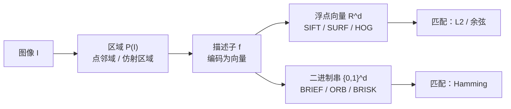

### 1.2 检测子、关键点与描述子的关系

一个完整的局部特征系统通常由三部分组成：

| 环节 | 作用 | 输出 | 典型方法 |
|---|---|---|---|
| 检测（detection） | 找出图像中"值得描述"的位置 | 关键点坐标 $(x,y)$、尺度 $\sigma$、方向 $\theta$ | Harris、FAST、DoG、MSER |
| 描述（description） | 把关键点邻域编码成向量 | $d$ 维向量 | SIFT、SURF、ORB、BRIEF |
| 匹配（matching） | 比较两个描述子的相似度 | 对应关系 | L2、Hamming、NNDR、RANSAC |

**检测子（detector）** 与 **描述子（descriptor）** 是两个可以独立替换的模块。
例如 ORB = oFAST（检测）+ rBRIEF（描述），两者来自不同源头。

**局部特征系统的完整流水线**：

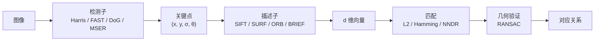

**各环节用到的处理及其作用**：

| 环节 | 处理 | 作用 |
|---|---|---|
| 检测 | 尺度空间 / 结构张量 / 圆周测试 | 找到稳定、可重复、可定位的位置 |
| 描述 | 梯度统计 / 强度比较 / 滤波响应 | 把邻域内容编码成可比较的向量 |
| 归一化 | 主方向旋转 / 尺度缩放 / L2 归一化 | 赋予旋转、尺度、光照不变性 |
| 匹配 | 距离度量 + 比率检验 | 找出候选对应点 |
| 验证 | RANSAC 拟合几何模型 | 剔除外点，保证几何一致 |

### 1.3 描述子的数学本质

从数学角度看，描述子的构造基本都遵循同一个模式：

$$
\text{descriptor} = \mathcal{N}\Big( \mathcal{Q}\big( \mathcal{F}(I, \Omega) \big) \Big)
$$

其中：

- $\Omega$：局部区域（点邻域、仿射归一化区域、区域检测结果）
- $\mathcal{F}$：特征提取算子（梯度、滤波响应、强度比较、矩、频谱）
- $\mathcal{Q}$：量化/编码（直方图分箱、二值化、投影、聚类分配）
- $\mathcal{N}$：归一化（L1/L2 归一化、均值-方差归一化、幂律归一化）

**含义**：任何描述子都可以拆成"选区域 → 提特征 → 量化编码 → 归一化"四步，不同描述子的差别只是这四步的具体选择不同。

不同的描述子，差别主要在于这四步的具体选择。

**四步处理的作用**：

| 步骤 | 典型处理 | 作用 |
|---|---|---|
| 选区域 $\Omega$ | 点邻域、仿射归一化、区域检测 | 确定"描述哪一块"，并消除位置/形状差异 |
| 提特征 $\mathcal{F}$ | 梯度、滤波、强度比较、矩、频谱 | 提取对内容敏感、对干扰不敏感的信号 |
| 量化 $\mathcal{Q}$ | 直方图分箱、二值化、投影、聚类 | 把连续信号压成固定维度、可比较的编码 |
| 归一化 $\mathcal{N}$ | L1/L2、均值-方差、幂律 | 消除光照/对比度/尺度差异，提升鲁棒性 |

**四步流水线示意**：

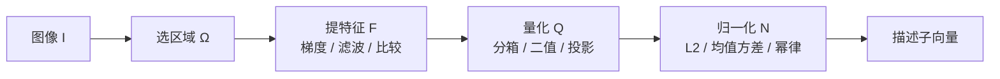

### 1.4 好描述子应具备的性质

| 性质 | 含义 | 数学体现 |
|---|---|---|
| 可重复性（repeatability） | 同一物理点在变换后仍被检测到 | 检测子在同一点上重复命中 |
| 可区分性（distinctiveness） | 不同区域产生不同描述子 | 描述子空间内类间距离大 |
| 紧致性（compactness） | 占用空间小、匹配快 | 维度 $d$ 小 |
| 不变性（invariance） | 对某种变换不敏感 | $f(T(I)) = f(I)$ |
| 等变性（equivariance） | 随变换而一致变化 | $f(T(I)) = T'(f(I))$ |
| 鲁棒性（robustness） | 对噪声、压缩、光照稳定 | 扰动下 $\lVert \Delta f \rVert$ 小 |
| 效率（efficiency） | 计算与匹配开销低 | 可用积分图、位运算、LSH |

其中不变性是最核心的设计目标，常见有：

- **平移不变**：通过对局部区域相对坐标编码
- **旋转不变**：通过主方向分配 + 旋转归一化
- **尺度不变**：通过尺度空间极值检测 + 尺度归一化窗口
- **仿射不变**：通过二阶矩矩阵做仿射归一化
- **光照不变**：通过梯度、强度差、归一化、截断
- **视角/3D 不变**：最难，通常只能做到有限视角内鲁棒

---

## 2. 描述子的分类体系（Taxonomy）

**描述子分类总览**：

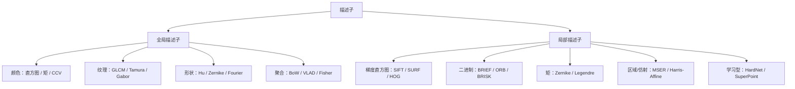

### 2.1 按空间范围分

**全局描述子（global descriptors）**

- 对整幅图像产生一个向量
- 典型：颜色直方图、GIST、GLCM、Hu 矩、BoW、Fisher Vector、CNN 全局池化
- 优点：紧凑、适合整图检索与分类
- 缺点：无空间定位能力，遮挡敏感

**局部描述子（local descriptors）**

- 对关键点邻域产生一个向量
- 典型：SIFT、SURF、ORB、BRIEF、BRISK、FREAK、LBP
- 优点：可匹配、可定位、对遮挡相对鲁棒
- 缺点：数量多，需要匹配与几何验证

### 2.2 按设计方式分

**手工设计（hand-crafted）**

- 由人根据图像结构先验设计
- 代表：SIFT、SURF、HOG、LBP、Gabor、Shape Context、MSER

**学习型（learned / learned embeddings）**

- 参数由数据训练得到
- 代表：PCA-SIFT、LDA 描述子、Random Ferns、L2-Net、HardNet、SuperPoint、DELF

### 2.3 按数学构造来源分（本文主线）

| 构造家族 | 数学工具 | 代表方法 |
|---|---|---|
| 梯度/方向直方图 | 一阶微分 + 加权投票 | SIFT、SURF、GLOH、HOG、DAISY |
| 强度比较/二进制 | 比较算子 + 位运算 | BRIEF、ORB、BRISK、FREAK、LATCH |
| 矩与正交基 | 矩展开、正交多项式 | Hu、Zernike、Legendre、Tchebichef |
| 纹理/滤波响应 | 卷积滤波组 | LBP、Gabor、MR8、GLCM、Tamura、小波 |
| 光谱/子空间 | FFT、DCT、PCA、LDA、ICA | Fourier 描述子、DCT、Eigenfaces、Fisherfaces |
| 形状/轮廓 | 边界参数化、极坐标分箱 | Shape Context、链码、CSS、Fourier 形状 |
| 区域/分割 | 连通域、稳定性 | MSER、EBR、IBR |
| 学习/嵌入 | 度量学习、深度网络 | Fisher Vector、VLAD、NetVLAD、SuperPoint |

### 2.4 按不变性能力分

| 能力等级 | 含义 | 代表 |
|---|---|---|
| 仅平移 | 只对位置不敏感 | 直方图类、LBP（原型） |
| 平移+旋转 | 加方向归一化 | SIFT、SURF、ORB（rBRIEF）、BRISK |
| 平移+旋转+尺度 | 加尺度空间 | SIFT、SURF、KAZE、AKAZE |
| 平移+旋转+尺度+仿射 | 加仿射归一化 | Harris-Affine、Hessian-Affine、MSER+ |
| 宽基线/视角 | 学习型或专用设计 | SuperPoint、D2-Net、视角不变特征 |

### 2.5 按数据类型与匹配方式分

**浮点型描述子**

- 存储在 $\mathbb{R}^d$
- 匹配用欧氏距离 $L_2$ 或余弦相似度
- 代表：SIFT(128)、SURF(64/128)、GLOH(128)、HOG

**二进制描述子**

- 存储在 $\{0,1\}^d$
- 匹配用汉明距离（XOR + popcount）
- 代表：BRIEF(128–512)、ORB(256)、BRISK(512)、FREAK(512)、LATCH(256)

二进制描述子的核心优势：匹配极快。

$$
D_{Hamming}(\mathbf{a},\mathbf{b}) = \sum_{i=1}^{d} [a_i \neq b_i] = \mathrm{popcount}(\mathbf{a} \oplus \mathbf{b})
$$

其中：

- $\mathbf{a}, \mathbf{b}$：两个 $d$ 位二进制描述子。
- $a_i, b_i$：第 $i$ 位的取值（0 或 1）。
- $[a_i \neq b_i]$：指示函数，两位不同时为 1，否则为 0。
- $\oplus$：按位异或（XOR）。
- $\mathrm{popcount}(\cdot)$：统计结果中 1 的个数。
- **含义**：汉明距离就是两个二进制串不同的位数，可用一次 XOR + 位计数完成，因此匹配极快。

**浮点 vs 二进制描述子的处理差异**：

| 方面 | 浮点描述子 | 二进制描述子 |
|---|---|---|
| 特征提取 | 梯度/滤波响应（连续值） | 强度比较（0/1） |
| 量化 | 直方图分箱、投影 | 阈值比较、位打包 |
| 归一化 | L2/L1、幂律 | 通常无需（比较已消除幅值） |
| 匹配 | L2 / 余弦（浮点运算） | Hamming（位运算） |
| 优势 | 区分性强、精度高 | 存储小、匹配快 |

### 2.6 按应用任务分

- 匹配/配准类：SIFT、SURF、ORB、SuperPoint
- 检测/分类类：HOG、LBP、Haar-like、DPM
- 检索类：BoW、VLAD、Fisher Vector、R-MAC、DELF
- 识别类：LBPH、Eigenfaces、Fisherfaces、深度嵌入
- 立体/稠密类：Census、NCC、DAISY

---

## 3. 数学原理基础

### 3.1 尺度空间理论（Scale Space）

尺度不变性的数学基础是**尺度空间**。图像在不同尺度下的表示由高斯卷积给出：

$$
L(x,y,\sigma) = G(x,y,\sigma) * I(x,y)
$$

其中：

- $L(x,y,\sigma)$：尺度 $\sigma$ 下的图像表示（尺度空间）。
- $I(x,y)$：原始图像。
- $G(x,y,\sigma)$：高斯核。
- $*$：卷积运算。
- **含义**：用不同宽度的高斯核模糊图像，得到一族由粗到细的表示，$\sigma$ 越大越模糊。

$$
G(x,y,\sigma) = \frac{1}{2\pi\sigma^2} e^{-\frac{x^2+y^2}{2\sigma^2}}
$$

其中：

- $\sigma$：高斯核标准差，即尺度参数。
- $x, y$：相对核中心的坐标。
- $\frac{1}{2\pi\sigma^2}$：归一化系数，保证核积分为 1。
- **含义**：$\sigma$ 控制模糊程度，是尺度空间的\"尺子\"。

尺度空间满足扩散方程（这一性质称为半群性质）：

$$
\frac{\partial L}{\partial \sigma} = \sigma \nabla^2 L
$$

其中：

- $\frac{\partial L}{\partial \sigma}$：表示随尺度变化的速率。
- $\nabla^2$：拉普拉斯算子。
- **含义**：高斯模糊等价于热扩散过程，保证尺度空间是\"因果\"且无新结构产生的。

**高斯拉普拉斯（LoG）** 用于斑点检测：

$$
\nabla^2 G = \frac{\partial^2 G}{\partial x^2} + \frac{\partial^2 G}{\partial y^2}
$$

其中：

- $\nabla^2 G$：高斯核的二阶导之和（拉普拉斯）。
- **含义**：LoG 对斑点（blob）响应最强，斑点尺寸与 $\sigma$ 匹配时响应最大。

尺度归一化 LoG 的极值给出特征尺度：

$$
\sigma^2 \nabla^2 L(x,y,\sigma)
$$

其中：

- $\sigma^2$：尺度归一化因子，抵消 LoG 随 $\sigma$ 增大而衰减的幅值。
- **含义**：在 $(x,y,\sigma)$ 三维空间中找该响应的极值，即得到特征点的位置与特征尺度。

**高斯差分（DoG）** 是对 LoG 的高效近似：

$$
D(x,y,\sigma) = \big( G(x,y,k\sigma) - G(x,y,\sigma) \big) * I(x,y)
$$

$$
\approx (k-1)\sigma^2 \nabla^2 L
$$

其中：

- $k$：相邻尺度的比例因子（如 $k=2^{1/s}$）。
- $G(x,y,k\sigma) - G(x,y,\sigma)$：两个相邻尺度高斯核之差。
- $(k-1)\sigma^2$：近似系数，说明 DoG 正比于尺度归一化 LoG。
- **含义**：DoG 只需两次高斯模糊相减，计算远快于 LoG，却近似其效果。

这就是 SIFT 能在多尺度上检测极值的关键。

**非线性尺度空间（KAZE/AKAZE）** 用非线性扩散替代高斯：

$$
\frac{\partial L}{\partial t} = \mathrm{div}\big( c(x,y,t)\,\nabla L \big)
$$

其中：

- $t$：演化时间（对应尺度）。
- $\mathrm{div}$：散度算子。
- $c(x,y,t)$：扩散系数，由局部梯度自适应控制。
- $\nabla L$：图像梯度。
- **含义**：在平坦区强扩散、在边缘处弱扩散，从而在保边的同时建立尺度。

其中 $c$ 由梯度自适应控制（Perona–Malik 型 diffusivity），从而在保边的同时建立尺度。

**尺度空间处理流程与作用**：

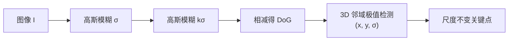

| 处理 | 作用 |
|---|---|
| 高斯卷积 | 建立多尺度表示，模拟\"远近观察\" |
| 尺度归一化 | 让不同尺度的响应可比 |
| DoG 相减 | 高效近似 LoG，定位斑点与特征尺度 |
| 3D 极值检测 | 同时确定位置与尺度，获得尺度不变性 |

### 3.2 梯度与局部结构

一阶梯度：

$$
I_x = \frac{\partial I}{\partial x},\quad I_y = \frac{\partial I}{\partial y}
$$

其中：

- $I_x, I_y$：图像在水平、垂直方向的一阶偏导（梯度分量）。
- **含义**：梯度描述灰度变化最快的方向与强度，是绝大多数描述子的基础信号。

梯度幅值与方向：

$$
m = \sqrt{I_x^2 + I_y^2},\quad \theta = \mathrm{atan2}(I_y, I_x)
$$

其中：

- $m$：梯度幅值，表示边缘强度。
- $\theta$：梯度方向，表示边缘朝向。
- $\mathrm{atan2}$：四象限反正切，给出 $(-\pi,\pi]$ 的方向。
- **含义**：幅值用于加权投票，方向用于直方图分箱，二者共同构成方向直方图。

**自相关矩阵（结构张量）**：

$$
M = \sum_{(x,y)\in W} w(x,y)
\begin{bmatrix}
I_x^2 & I_x I_y \\
I_x I_y & I_y^2
\end{bmatrix}
$$

其中：

- $W$：局部窗口。
- $w(x,y)$：窗口权重（常为高斯）。
- $I_x^2, I_xI_y, I_y^2$：梯度的二阶统计量。
- **含义**：$M$ 汇总窗口内梯度的分布方向，其特征值刻画局部结构类型。

特征值 $\lambda_1,\lambda_2$ 决定局部结构类型：

| 特征值关系 | 结构类型 |
|---|---|
| $\lambda_1,\lambda_2$ 都小 | 平坦区域 |
| 一大一小 | 边缘 |
| 都大 | 角点 |

**Harris 响应**：

$$
R = \det(M) - k\,(\mathrm{tr}\,M)^2
$$

其中：

- $\det(M) = \lambda_1\lambda_2$：行列式。
- $\mathrm{tr}\,M = \lambda_1 + \lambda_2$：迹。
- $k$：经验常数（常取 0.04–0.06）。
- **含义**：两个特征值都大时 $R$ 大，因此 $R$ 的局部极大即角点。

**Shi–Tomasi 响应**：

$$
R = \min(\lambda_1, \lambda_2)
$$

其中：

- $\min(\lambda_1,\lambda_2)$：取较小特征值。
- **含义**：直接要求两个方向都强，比 Harris 更稳定，常用于跟踪。

**Hessian 矩阵**（用于斑点/DoH）：

$$
H = \begin{bmatrix} I_{xx} & I_{xy} \\ I_{xy} & I_{yy} \end{bmatrix},\quad
\det(H) = I_{xx}I_{yy} - I_{xy}^2
$$

其中：

- $I_{xx}, I_{yy}$：二阶偏导。
- $I_{xy}$：混合偏导。
- $\det(H)$：Hessian 行列式，即 DoH 响应。
- **含义**：$\det(H)$ 在斑点处最大，用于斑点检测（SURF 的基础）。

**梯度类处理的作用**：

| 处理 | 作用 |
|---|---|
| 一阶梯度 | 提取边缘/纹理信号，对光照偏移不敏感 |
| 幅值+方向 | 为方向直方图提供权重与分箱 |
| 结构张量 | 区分平坦/边缘/角点 |
| Harris/Shi–Tomasi | 给出角点响应，用于检测 |
| Hessian | 给出斑点响应，用于 DoH 检测 |

### 3.3 直方图编码与量化

方向直方图是最常见的编码方式。给定方向集合 $\{\theta_i\}$ 与权重 $\{w_i\}$：

$$
h_b = \sum_i w_i \cdot \mathbb{1}\big[ \theta_i \in \text{bin}_b \big]
$$

其中：

- $h_b$：第 $b$ 个方向箱的直方图值。
- $\theta_i$：第 $i$ 个样本的梯度方向。
- $w_i$：第 $i$ 个样本的权重（通常为梯度幅值 × 高斯窗）。
- $\mathbb{1}[\cdot]$：指示函数，方向落入该箱时为 1。
- **含义**：把邻域内所有梯度按方向投票累加，得到对方向分布的统计描述。

SIFT 使用**三线性插值**把样本分配到相邻的子区域和相邻的方向箱，避免分箱边界效应：

$$
w = w_{sub} \cdot w_{ori}
$$

其中：

- $w_{sub}$：样本在相邻子区域上的线性权重。
- $w_{ori}$：样本在相邻方向箱上的线性权重。
- **含义**：一个样本按距离同时贡献给相邻格点，消除\"硬分箱\"造成的突变，提升稳定性。

归一化的作用：

- L2 归一化：抑制对比度变化
- 截断（clip 0.2）后再次归一化：抑制主导梯度
- L1 + 开方（RootSIFT）：改善分布稳定性

**RootSIFT** 的做法：

$$
\mathbf{v}_{root} = \sqrt{\frac{\mathbf{v}_{L1}}{\lVert \mathbf{v} \rVert_1}}
$$

其中：

- $\mathbf{v}$：原始 SIFT 描述子。
- $\lVert \mathbf{v} \rVert_1$：L1 范数（各元素绝对值之和）。
- $\mathbf{v}_{L1}$：L1 归一化后的向量。
- $\sqrt{\cdot}$：逐元素开方。
- **含义**：L1 归一化 + 开方使分布更接近高斯，配合 Hellinger 距离可显著提升匹配性能。

**直方图编码处理的作用**：

| 处理 | 作用 |
|---|---|
| 方向分箱 | 把连续方向离散成固定维度 |
| 幅值加权 | 让强边缘主导统计，弱噪声被抑制 |
| 高斯窗加权 | 降低离中心较远样本的影响 |
| 三线性插值 | 消除分箱边界效应，提升稳定性 |
| L2 归一化 | 抑制对比度/光照变化 |
| clip + 再归一化 | 抑制单个主导梯度的影响 |
| L1 + 开方 | 改善分布，提升匹配鲁棒性 |

### 3.4 二进制测试与汉明度量

二进制描述子由一组**强度比较**构成：

$$
\tau(I; \mathbf{p}, \mathbf{q}) =
\begin{cases}
1, & I(\mathbf{p}) < I(\mathbf{q}) \\
0, & \text{否则}
\end{cases}
$$

其中：

- $I(\mathbf{p}), I(\mathbf{q})$：两个采样点处的灰度值。
- $\mathbf{p}, \mathbf{q}$：采样点坐标。
- $\tau$：比较结果，1 位二进制。
- **含义**：只比较两点亮度大小，天然对光照的单调变化（如整体变亮）不敏感。

一个 $d$ 位描述子：

$$
f_d(I) = \sum_{i=1}^{d} 2^{i-1} \tau(I; \mathbf{p}_i, \mathbf{q}_i)
$$

其中：

- $d$：描述子位数。
- $2^{i-1}$：第 $i$ 位的权重（二进制位权）。
- $\tau(I;\mathbf{p}_i,\mathbf{q}_i)$：第 $i$ 个测试的结果。
- **含义**：把 $d$ 个比较结果打包成一个 $d$ 位整数，匹配时用汉明距离。

采样模式 $\{(\mathbf{p}_i,\mathbf{q}_i)\}$ 决定了描述子的性能：

- BRIEF：随机采样，无旋转不变性
- ORB：学习式选择去相关样本对，并把采样模式按主方向旋转
- BRISK：同心圆采样，长短对分开使用
- FREAK：视网膜式采样，带级联

**二进制描述子处理的作用**：

| 处理 | 作用 |
|---|---|
| 强度比较 | 生成 0/1 位，对光照单调变化不敏感 |
| 采样模式设计 | 决定区分性与抗噪性 |
| 主方向旋转 | 赋予旋转不变性（ORB/BRISK） |
| 位打包 | 压缩存储，支持快速 XOR 匹配 |
| 级联比较 | 提前筛除候选，加速匹配（FREAK） |

### 3.5 矩与正交基

**几何矩**：

$$
m_{pq} = \sum_{x}\sum_{y} x^p y^q I(x,y)
$$

其中：

- $m_{pq}$：阶数为 $(p,q)$ 的几何矩。
- $x, y$：像素坐标。
- $I(x,y)$：像素灰度（或质量）。
- $p, q$：$x, y$ 的幂次。
- **含义**：把图像当作二维分布，用坐标幂次的加权和描述其形状统计量。

**中心矩**：

$$
\mu_{pq} = \sum_{x}\sum_{y} (x-\bar{x})^p (y-\bar{y})^q I(x,y)
$$

其中：

- $\bar{x}, \bar{y}$：图像质心坐标。
- **含义**：以质心为原点计算矩，从而消除平移影响，获得平移不变性。

**归一化中心矩**：

$$
\eta_{pq} = \frac{\mu_{pq}}{\mu_{00}^{1+\frac{p+q}{2}}}
$$

其中：

- $\mu_{00}$：零阶矩（图像总质量）。
- $1+\frac{p+q}{2}$：归一化指数。
- **含义**：除以 $\mu_{00}$ 的幂，消除尺度影响，获得尺度不变性。

**Hu 七不变矩**由 $\eta_{pq}$ 组合而成，对平移、旋转、尺度不变：

$$
\begin{aligned}
\phi_1 &= \eta_{20} + \eta_{02} \\
\phi_2 &= (\eta_{20}-\eta_{02})^2 + 4\eta_{11}^2 \\
\phi_3 &= (\eta_{30}-3\eta_{12})^2 + (3\eta_{21}-\eta_{03})^2 \\
&\dots
\end{aligned}
$$

其中：

- $\phi_1$：总惯性（对旋转不敏感）。
- $\phi_2$：各向异性度量。
- $\phi_3$：三阶矩组合，描述不对称性。
- **含义**：七个由归一化中心矩组合而成的量，对平移、旋转、尺度均不变，是经典形状描述子。

**Zernike 矩**：在单位圆盘上以正交多项式为基：

$$
Z_{nm} = \frac{n+1}{\pi}\int_0^{2\pi}\!\!\int_0^1 \overline{V_{nm}(\rho,\theta)}\, f(\rho,\theta)\,\rho\, d\rho\, d\theta
$$

其中：

- $n$：阶数；$m$：重复度（$|m|\le n$）。
- $V_{nm}(\rho,\theta)$：Zernike 正交多项式基。
- $\overline{V_{nm}}$：共轭。
- $\rho, \theta$：极坐标；$\rho$ 为积分权重（面积元）。
- $\frac{n+1}{\pi}$：归一化系数。
- **含义**：在单位圆盘上用正交基展开图像，矩之间不冗余，取模 $|Z_{nm}|$ 即得旋转不变描述子。

正交性使得矩之间信息不冗余，且可以做到旋转不变（取模）。

**矩类处理的作用**：

| 处理 | 作用 |
|---|---|
| 几何矩 | 描述形状的全局统计量 |
| 中心化 | 消除平移影响 |
| 归一化 | 消除尺度影响 |
| 组合（Hu） | 构造旋转不变的不变量 |
| 正交基（Zernike） | 去除冗余，支持旋转不变与重建 |

### 3.6 滤波与纹理

**Gabor 滤波**：

$$
g(x,y;\lambda,\theta,\psi,\sigma,\gamma) =
\exp\!\left(-\frac{x'^2+\gamma^2 y'^2}{2\sigma^2}\right)
\exp\!\left(i\Big(2\pi\frac{x'}{\lambda}+\psi\Big)\right)
$$

其中

$$
x' = x\cos\theta + y\sin\theta,\quad y' = -x\sin\theta + y\cos\theta
$$

其中：

- $\lambda$：波长（频率的倒数）。
- $\theta$：滤波方向。
- $\psi$：相位偏移。
- $\sigma$：高斯包络标准差。
- $\gamma$：空间纵横比（椭圆度）。
- $x', y'$：旋转到滤波主方向后的坐标。
- 第一项：高斯包络（局部化）；第二项：复正弦（频率选择）。
- **含义**：Gabor 是"局部化 + 方向 + 频率"的联合滤波器，能提取特定方向与频率的纹理。

**LBP（局部二值模式）**：

$$
\mathrm{LBP}_{P,R} = \sum_{p=0}^{P-1} s(g_p - g_c)\, 2^p,\quad
s(x) = \begin{cases}1, & x \ge 0\\ 0, & x<0\end{cases}
$$

其中：

- $P$：邻域采样点数。
- $R$：邻域半径。
- $g_c$：中心像素灰度。
- $g_p$：第 $p$ 个邻域像素灰度。
- $s(\cdot)$：符号函数，邻域比中心亮为 1。
- $2^p$：位权。
- **含义**：把邻域与中心的亮度比较编码成一个 $P$ 位二进制数，描述局部纹理模式。

**均匀模式**：0/1 跳变不超过 2 次的模式，占自然图像绝大多数，因此
$\mathrm{LBP}^{u2}$ 用 $P(P-1)+3$ 个箱代替 $2^P$ 个箱，大幅降维。

**GLCM（灰度共生矩阵）**：给定偏移 $\delta$，统计灰度对 $(i,j)$ 的出现次数：

$$
P_\delta(i,j) = \#\{(x,y) : I(x,y)=i,\ I(x+\delta_x, y+\delta_y)=j\}
$$

其中：

- $\delta = (\delta_x, \delta_y)$：像素对偏移（距离与方向）。
- $i, j$：两个灰度级。
- $\#$：满足条件的像素对个数。
- **含义**：统计"灰度 $i$ 旁边出现灰度 $j$"的频率，刻画纹理的空间共生规律。

Haralick 特征从 $P_\delta$ 派生：

$$
\text{Contrast} = \sum_{i,j}(i-j)^2 P(i,j)
$$

$$
\text{Energy} = \sum_{i,j} P(i,j)^2,\quad
\text{Homogeneity} = \sum_{i,j}\frac{P(i,j)}{1+|i-j|}
$$

$$
\text{Correlation} = \sum_{i,j}\frac{(i-\mu_i)(j-\mu_j)P(i,j)}{\sigma_i\sigma_j}
$$

其中：

- $P(i,j)$：归一化后的共生矩阵元素。
- $\mu_i, \mu_j$：行/列均值；$\sigma_i, \sigma_j$：行/列标准差。
- Contrast：灰度差越大值越大，反映纹理对比度。
- Energy：矩阵越集中值越大，反映纹理均匀性。
- Homogeneity：相邻灰度越接近值越大，反映局部平滑度。
- Correlation：反映灰度沿方向的线性相关程度。
- **含义**：从共生矩阵派生出一组标量，把纹理压缩成可分类的特征向量。

**滤波/纹理处理的作用**：

| 处理 | 作用 |
|---|---|
| Gabor 滤波 | 提取特定方向/频率的纹理能量 |
| LBP 比较 | 编码局部微纹理，对光照单调变化鲁棒 |
| 均匀模式降维 | 大幅减少直方图维度 |
| GLCM 统计 | 刻画灰度空间共生规律 |
| Haralick 特征 | 把纹理压缩成可分类的标量 |

### 3.7 子空间与统计学习

**PCA（Eigenfaces）**：对中心化数据求协方差矩阵特征向量：

$$
C = \frac{1}{N}\sum_{i=1}^{N}(\mathbf{x}_i-\bar{\mathbf{x}})(\mathbf{x}_i-\bar{\mathbf{x}})^T
$$

其中：

- $N$：样本数。
- $\mathbf{x}_i$：第 $i$ 个样本向量。
- $\bar{\mathbf{x}}$：样本均值。
- $C$：协方差矩阵。
- **含义**：$C$ 的特征向量给出数据方差最大的方向，取前 $k$ 个作为投影基，实现降维。

保留前 $k$ 个最大特征值对应的特征向量作为投影基。

**LDA（Fisherfaces）**：最大化类间散度与类内散度之比：

$$
W = \arg\max_W \frac{|W^T S_B W|}{|W^T S_W W|}
$$

其中：

- $W$：投影矩阵。
- $S_B$：类间散度矩阵。
- $S_W$：类内散度矩阵。
- $|\cdot|$：行列式。
- **含义**：寻找使类间距离大、类内距离小的投影方向，比 PCA 更具判别性。

**GMM 与 Fisher Vector**：用高斯混合建模局部描述子分布，再对参数求梯度：

$$
\mathcal{G}_\mu = \frac{1}{N\sqrt{\pi_k}}\sum_{i}\gamma_i(k)\frac{\mathbf{x}_i-\boldsymbol{\mu}_k}{\boldsymbol{\sigma}_k}
$$

其中：

- $N$：描述子总数。
- $\pi_k$：第 $k$ 个高斯分量的权重。
- $\gamma_i(k)$：描述子 $\mathbf{x}_i$ 属于第 $k$ 个分量的后验概率。
- $\boldsymbol{\mu}_k, \boldsymbol{\sigma}_k$：第 $k$ 个分量的均值与标准差。
- **含义**：对 GMM 参数求梯度，把描述子集合编码成固定维度向量，保留二阶统计信息。

**VLAD（Vector of Locally Aggregated Descriptors）**：

$$
\mathbf{v}_k = \sum_{i:\,\mathrm{NN}(\mathbf{x}_i)=c_k} (\mathbf{x}_i - c_k)
$$

其中：

- $c_k$：第 $k$ 个聚类中心。
- $\mathrm{NN}(\mathbf{x}_i)$：$\mathbf{x}_i$ 的最近聚类中心。
- $\mathbf{x}_i - c_k$：描述子相对中心的残差。
- **含义**：把每个簇内所有描述子的残差求和，得到 $K\times d$ 维聚合向量。

再做幂律归一化与 L2 归一化。

**NetVLAD**：把硬分配替换为软分配：

$$
\bar{a}_k(\mathbf{x}_i) = \frac{e^{\mathbf{w}_k^T \mathbf{x}_i + b_k}}{\sum_{k'} e^{\mathbf{w}_{k'}^T \mathbf{x}_i + b_{k'}}}
$$

其中：

- $\mathbf{w}_k, b_k$：第 $k$ 个簇的可学习权重与偏置。
- $\bar{a}_k(\mathbf{x}_i)$：软分配权重（类似 softmax）。
- **含义**：用可微的软分配代替硬聚类，使 VLAD 可端到端训练。

**子空间/聚合处理的作用**：

| 处理 | 作用 |
|---|---|
| PCA | 降维、去相关、保留最大方差 |
| LDA | 提升类间判别性 |
| GMM + 梯度 | 保留分布的二阶统计信息 |
| VLAD 残差聚合 | 紧凑编码局部描述子集合 |
| 软分配（NetVLAD） | 使聚合可微、可学习 |

### 3.8 不变性的构造手段

| 不变性 | 构造手段 | 数学操作 |
|---|---|---|
| 平移 | 使用相对坐标/局部邻域 | 以关键点为中心建立坐标系 |
| 旋转 | 估计主方向并旋转采样 | 梯度方向直方图峰值 $\theta^*$ |
| 尺度 | 尺度空间极值 + 尺度归一化窗口 | $\sigma^2\nabla^2 L$ 极值 |
| 仿射 | 二阶矩矩阵归一化 | $\Sigma^{-1/2}$ 变换到单位圆 |
| 光照对比度 | 归一化 | L2/L1 归一化、clip |
| 光照偏移 | 差分 | 梯度、强度比较 |
| 视角 | 多视角数据或学习 | 度量学习、注意力匹配 |

**主方向估计**（SIFT）：

$$
\theta^* = \arg\max_\theta \sum_i w_i\, \mathbb{1}[\theta_i \in \text{bin}(\theta)]
$$

其中：

- $\theta^*$：估计出的主方向。
- $\theta_i$：第 $i$ 个样本的梯度方向。
- $w_i$：权重（梯度幅值 × 高斯窗）。
- $\text{bin}(\theta)$：方向 $\theta$ 对应的直方图箱。
- **含义**：取方向直方图的峰值作为主方向，后续按此方向旋转采样，获得旋转不变性。

其中权重为梯度幅值乘以高斯窗。

### 3.9 相似度度量与匹配

**欧氏距离**：

$$
d_2(\mathbf{a},\mathbf{b}) = \lVert \mathbf{a}-\mathbf{b} \rVert_2
$$

其中：

- $\mathbf{a}, \mathbf{b}$：两个描述子向量。
- $\lVert\cdot\rVert_2$：L2 范数。
- **含义**：向量空间中的直线距离，用于浮点描述子匹配。

**余弦相似度**：

$$
\mathrm{cos}(\mathbf{a},\mathbf{b}) = \frac{\mathbf{a}\cdot\mathbf{b}}{\lVert\mathbf{a}\rVert\lVert\mathbf{b}\rVert}
$$

其中：

- $\mathbf{a}\cdot\mathbf{b}$：点积。
- $\lVert\mathbf{a}\rVert, \lVert\mathbf{b}\rVert$：向量模长。
- **含义**：只关心方向夹角，对向量长度（幅值）不敏感，适合归一化后的描述子。

**最近邻距离比（NNDR / Lowe ratio test）**：

$$
\frac{d(\mathbf{a}, \mathbf{b}_{1})}{d(\mathbf{a}, \mathbf{b}_{2})} < \rho
$$

其中：

- $\mathbf{b}_1$：最近邻描述子。
- $\mathbf{b}_2$：次近邻描述子。
- $\rho$：比率阈值（常取 0.6–0.8）。
- **含义**：只有当最近邻明显优于次近邻时才接受匹配，有效剔除模糊/重复纹理的误匹配。

其中 $\mathbf{b}_1$ 是最近邻、$\mathbf{b}_2$ 是次近邻，$\rho$ 常取 0.6–0.8。

**几何验证**：用 RANSAC 拟合单应/基础矩阵，剔除外点：

$$
H^* = \arg\max_H \sum_i \mathbb{1}\big[ \lVert \mathbf{x}'_i - H\mathbf{x}_i \rVert < \epsilon \big]
$$

其中：

- $H$：待拟合的单应矩阵。
- $\mathbf{x}_i, \mathbf{x}'_i$：一对匹配点。
- $\epsilon$：内点距离阈值。
- $\mathbb{1}[\cdot]$：内点指示函数。
- **含义**：寻找使最多匹配点满足几何约束的 $H$，从而剔除外点、保留几何一致的匹配。

**匹配处理的作用**：

| 处理 | 作用 |
|---|---|
| 欧氏/余弦距离 | 度量描述子相似度 |
| NNDR 比率检验 | 剔除模糊匹配 |
| 交叉检验 | 保证互为最近邻 |
| RANSAC | 剔除外点，保证几何一致 |

---

## 4. 关键点检测子（Keypoint Detectors）

### 4.1 角点检测

| 检测子 | 原理 | 特点 |
|---|---|---|
| Moravec | 各方向灰度差最小值的局部极大 | 最早，无旋转不变性 |
| Harris–Stephens | 结构张量 + 响应函数 | 旋转不变，光照鲁棒 |
| Shi–Tomasi | $\min(\lambda_1,\lambda_2)$ | 更稳定的跟踪角点 |
| Förstner | 协方差矩阵 + 圆度 | 精度高，用于配准 |
| Kitchen–Rosenfeld | 梯度方向变化率 | 计算简单 |
| FAST | 圆周 Bresenham 测试 | 极快，无尺度不变 |
| AGAST | FAST 的自适应泛化 | 更快的 FAST 变体 |
| oFAST | FAST + 强度质心方向 | ORB 的检测子 |

**Harris 推导**：对邻域做一阶泰勒展开：

$$
I(x+\Delta x, y+\Delta y) \approx I(x,y) + I_x \Delta x + I_y \Delta y
$$

其中：

- $\Delta x, \Delta y$：窗口的小位移。
- $I_x, I_y$：图像梯度。
- **含义**：用一阶近似描述窗口移动后的灰度变化，是推导角点响应的起点。

平方误差和：

$$
E(\Delta x,\Delta y) = \sum_W \big( I_x \Delta x + I_y \Delta y \big)^2 = \mathbf{d}^T M \mathbf{d}
$$

其中：

- $E$：窗口移动后的灰度平方差。
- $\mathbf{d} = [\Delta x, \Delta y]^T$：位移向量。
- $M$：结构张量（自相关矩阵）。
- **含义**：$E$ 可写成二次型，$M$ 的特征值决定各方向移动时 $E$ 的增长快慢，从而区分角点。

对 $M$ 做特征值分析，则得到角点判据。

**FAST 判据**：圆形半径 3 的 16 像素圆周上，若有连续 $N$（通常 9 或 12）个像素
都比中心亮/暗超过阈值 $t$，则判为角点：

$$
\exists\, \text{连续 } N \text{ 个 } p:\ |I(p)-I(c)| > t
$$

其中：

- $p$：圆周上的像素。
- $c$：中心像素。
- $I(\cdot)$：灰度值。
- $t$：亮度差阈值。
- $N$：连续满足条件的像素数（常取 9 或 12）。
- **含义**：只需比较圆周像素与中心，无需梯度/卷积，因此极快。

**强度质心方向**（oFAST）：

$$
m_{pq} = \sum_{x,y} x^p y^q I(x,y),\quad
\theta = \mathrm{atan2}(m_{01}, m_{10})
$$

其中：

- $m_{pq}$：图像矩。
- $m_{10}, m_{01}$：一阶矩（质心坐标）。
- $\theta$：主方向。
- **含义**：用亮度质心相对几何中心的方向作为主方向，计算极快，为 ORB 提供旋转不变性。

### 4.2 斑点与区域检测

| 检测子 | 原理 | 特点 |
|---|---|---|
| LoG | 尺度归一化高斯拉普拉斯极值 | 尺度不变 |
| DoG | 相邻高斯差 | SIFT 的核心 |
| DoH | Hessian 行列式 | SURF 的基础 |
| SIFT 检测子 | DoG 极值 + 亚像素定位 + 边缘剔除 | 尺度/旋转不变 |
| SURF 检测子 | 积分图 + 盒滤波 Hessian | 速度快 |
| BRISK 检测子 | AGAST + 尺度空间 | 快速多尺度 |
| CenSurE / STAR | 多尺度中心环绕滤波 | 近似尺度不变 |
| MSER | 阈值扫描 + 连通域稳定性 | 仿射不变强 |
| EBR / IBR | 边缘/强度极值区域 | 早期区域检测 |
| KAZE / AKAZE | 非线性尺度空间 | 保边、重复性好 |
| SUSAN | 最小核同值区 | 角点+边缘统一框架 |
| Hessian-Laplace | Hessian 定位 + LoG 尺度 | 更稳定的尺度选择 |
| Harris-Laplace | Harris 定位 + LoG 尺度 | 经典仿射不变检测 |
| Harris-Affine | 迭代仿射归一化 | 仿射不变 |
| Hessian-Affine | Hessian 定位 + 仿射归一化 | 仿射不变 |

**MSER 稳定性判据**：随阈值 $\theta$ 扫描，连通域面积变化率取局部极小：

$$
q(i) = \frac{|A(i+\Delta) - A(i-\Delta)|}{A(i)}
$$

其中：

- $A(i)$：阈值 $i$ 下连通域的面积。
- $\Delta$：阈值步长。
- $q(i)$：面积变化率。
- **含义**：$q(i)$ 的局部极小对应面积随阈值变化最稳定的区域，即 MSER 区域，具有强仿射不变性。

### 4.3 边缘检测子

| 检测子 | 原理 |
|---|---|
| Roberts | 2×2 差分算子 |
| Sobel | 3×3 平滑+差分 |
| Prewitt | 均匀加权差分 |
| Scharr | 更精确的旋转对称差分 |
| Laplacian | 二阶微分零交叉 |
| LoG / Marr–Hildreth | 平滑后二阶微分 |
| Canny | 高斯平滑 + 非极大抑制 + 双阈值滞后 |
| 结构化边缘（SE） | 随机森林预测边缘 |

**Canny 的非极大抑制**：沿梯度方向比较，只保留局部极大：

$$
\text{keep if } m(x,y) \ge m(x \pm \delta\cos\theta,\ y \pm \delta\sin\theta)
$$

其中：

- $m(x,y)$：$(x,y)$ 处的梯度幅值。
- $\theta$：该点梯度方向。
- $\delta$：沿梯度方向的采样步长。
- **含义**：只有幅值不小于沿梯度方向两侧邻点的像素才保留，从而把粗边缘细化成单像素宽。

**边缘检测处理的作用**：

| 处理 | 作用 |
|---|---|
| 高斯平滑 | 抑制噪声，避免伪边缘 |
| 一阶/二阶微分 | 定位灰度突变（边缘） |
| 非极大抑制 | 细化边缘到单像素宽 |
| 双阈值滞后 | 连接强边缘、抑制弱噪声边缘 |

---

## 5. 局部描述子（Local Descriptors）逐类详解

**局部描述子家族总览**：

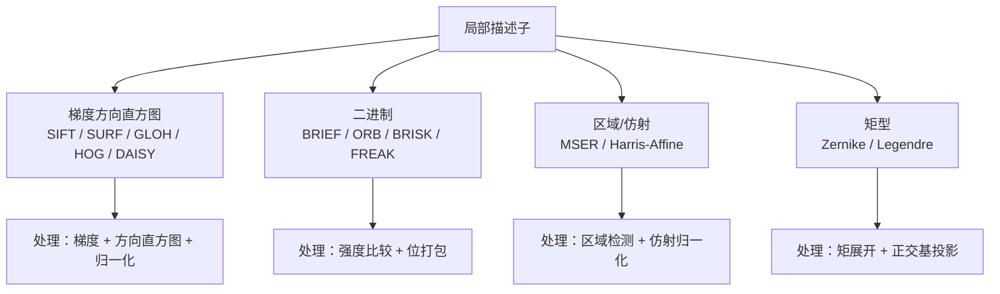

### 5.1 梯度方向直方图类

#### SIFT（Scale-Invariant Feature Transform, 128 维）

**流程**：

1. **尺度空间极值**：$D(x,y,\sigma)$ 在 3D 邻域（含相邻尺度）中比较
2. **亚像素定位**：泰勒展开求极值偏移

$$
\hat{\mathbf{x}} = -\left(\frac{\partial^2 D}{\partial \mathbf{x}^2}\right)^{-1} \frac{\partial D}{\partial \mathbf{x}}
$$

其中：

- $\hat{\mathbf{x}}$：极值点相对采样点的亚像素偏移。
- $\frac{\partial D}{\partial \mathbf{x}}$：DoG 的一阶导（梯度）。
- $\frac{\partial^2 D}{\partial \mathbf{x}^2}$：DoG 的 Hessian（二阶导）。
- **含义**：用泰勒展开把极值位置精确到亚像素，提升关键点定位精度。

3. **边缘剔除**：主曲率比判据

$$
\frac{(\mathrm{tr}\,H)^2}{\det H} < \frac{(r+1)^2}{r},\quad r \approx 10
$$

其中：

- $H$：关键点处的 Hessian。
- $\mathrm{tr}\,H$：迹（主曲率之和）。
- $\det H$：行列式（主曲率之积）。
- $r$：主曲率比阈值（约 10）。
- **含义**：边缘点的主曲率比很大，该判据剔除不稳定的边缘响应，只保留角点/斑点。

4. **方向分配**：36 箱梯度方向直方图，峰值为主方向，达到峰值 80% 的方向作辅方向
5. **描述子**：16×16 邻域内 4×4 子区域，每子区域 8 方向 → 128 维
6. **归一化**：L2 归一化 → clip 0.2 → 再 L2 归一化

**SIFT 的数学核心**是"梯度方向统计 + 局部空间分块 + 全局归一化"。

**SIFT 特征提取处理流程与作用**：

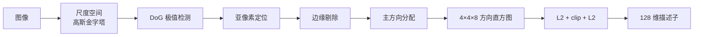

| 处理 | 作用 |
|---|---|
| 尺度空间 | 获得尺度不变性 |
| DoG 极值 | 高效定位斑点/角点 |
| 亚像素定位 | 提升定位精度 |
| 边缘剔除 | 去除不稳定边缘响应 |
| 主方向分配 | 获得旋转不变性 |
| 空间分块 + 方向直方图 | 编码局部结构，提升区分性 |
| L2 + clip + L2 | 抑制光照/对比度与主导梯度影响 |

#### SURF（Speeded-Up Robust Features, 64/128 维）

用盒滤波近似 Hessian：

$$
\det(H_{approx}) = D_{xx}D_{yy} - (0.9\,D_{xy})^2
$$

其中：

- $D_{xx}, D_{yy}$：盒滤波近似的二阶偏导。
- $D_{xy}$：混合偏导近似。
- $0.9$：经验修正系数，补偿盒滤波近似误差。
- **含义**：用积分图 + 盒滤波快速计算 Hessian 行列式，大幅加速斑点检测。

**方向分配**：在半径 $6\sigma$ 的圆域内计算 Haar 小波响应 $d_x, d_y$，
用 $60^\circ$ 滑动窗口求和，最大值方向为主方向。

**描述子**：4×4 子区域，每区域统计

$$
\big( \textstyle\sum d_x,\ \sum d_y,\ \sum |d_x|,\ \sum |d_y| \big) \rightarrow 64
$$

其中：

- $d_x, d_y$：Haar 小波在水平/垂直方向的响应。
- $\sum d_x, \sum d_y$：响应之和（带符号，反映方向）。
- $\sum |d_x|, \sum |d_y|$：响应绝对值之和（反映强度）。
- **含义**：每个子区域用 4 个统计量描述，4×4 子区域共 64 维，兼顾方向与强度。

扩展版本加入 $\sum d_y$ 的符号 → 128 维。

#### GLOH（Gradient Location and Orientation Histogram, 128 维）

- 采用**对数极坐标**分箱：3 个半径 × 8 个角度 = 17 个空间箱
- 每箱 16 个方向箱 → 272 维
- 用 PCA 降到 128 维
- 比 SIFT 更具区分性，但计算更贵

#### DAISY（200 维）

- 面向**稠密**匹配设计
- 在每个采样点周围用高斯加权方向直方图
- 用可分离卷积快速计算
- 适合宽基线立体匹配

#### HOG（Histogram of Oriented Gradients）

**流程**：

1. 计算梯度幅值与方向
2. 把图像划分为 cell（如 8×8），每 cell 统计 9 个方向箱（0–180°）
3. 若干 cell 组成 block（如 2×2），对 block 内特征做 **L2-Hys** 归一化
4. 拼接所有 block 特征

**L2-Hys 归一化**：

$$
\mathbf{v} \leftarrow \frac{\mathbf{v}}{\sqrt{\lVert\mathbf{v}\rVert_2^2 + \epsilon^2}},\quad
v_i \leftarrow \min(v_i, 0.2),\quad
\text{再归一化}
$$

其中：

- $\mathbf{v}$：block 内拼接的梯度直方图向量。
- $\lVert\mathbf{v}\rVert_2$：L2 范数。
- $\epsilon$：防止除零的小常数。
- $0.2$：截断阈值。
- **含义**：先 L2 归一化抑制对比度，再截断抑制主导梯度，最后再归一化，提升光照鲁棒性。

HOG 是行人检测（HOG + SVM）与 DPM 的核心。

**HOG 特征提取处理流程与作用**：

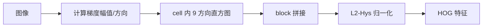

| 处理 | 作用 |
|---|---|
| 梯度计算 | 提取边缘/轮廓信号，对光照偏移不敏感 |
| cell 直方图 | 局部方向统计，保留空间结构 |
| block 拼接 | 引入邻域上下文，提升区分性 |
| L2-Hys 归一化 | 抑制对比度与主导梯度，提升光照鲁棒性 |

#### 相关变体

| 名称 | 特点 |
|---|---|
| PCA-SIFT | 对梯度块做 PCA 降维到 20 维 |
| RootSIFT | SIFT 描述子 L1 归一化后开方 |
| RIFT | 旋转不变特征变换，用环形分箱 |
| CSIFT | 颜色不变 SIFT |
| OpponentSIFT | 在对立色通道上计算 SIFT |
| DSP-SIFT | 尺度池化，提升匹配性能 |
| PHOG | 金字塔 HOG，用于形状/场景 |
| HOG3D | 时空梯度直方图 |
| PIFF | 像素级特征融合的类 HOG 全局特征 |

### 5.2 二进制描述子类

#### BRIEF（Binary Robust Independent Elementary Features, 128–512 bit）

$$
f(I) = \sum_{i} 2^{i-1}\,\tau(I;\mathbf{p}_i,\mathbf{q}_i)
$$

其中：

- $f(I)$：BRIEF 描述子（一个整数）。
- $\tau(I;\mathbf{p}_i,\mathbf{q}_i)$：第 $i$ 个强度比较结果（0/1）。
- $\mathbf{p}_i, \mathbf{q}_i$：第 $i$ 对采样点。
- $2^{i-1}$：位权。
- **含义**：把一组随机采样对的强度比较打包成二进制串，匹配用汉明距离，极快。

- 采样对从高斯分布抽取
- **无旋转不变性、无尺度不变性**，对模糊较敏感
- 匹配用汉明距离，极快

#### ORB（Oriented FAST and Rotated BRIEF, 256 bit）

1. **oFAST** 检测 + 强度质心方向
2. **Steered BRIEF**：把采样模式按方向 $\theta$ 旋转

$$
R_\theta = \begin{bmatrix}\cos\theta & -\sin\theta\\ \sin\theta & \cos\theta\end{bmatrix}
$$

其中：

- $R_\theta$：旋转矩阵。
- $\theta$：关键点主方向（由强度质心估计）。
- **含义**：把 BRIEF 的采样坐标按主方向旋转，使描述子随图像旋转而一致变化，获得旋转不变性。

3. **rBRIEF**：用贪心搜索在训练集上选出去相关、方差大的 256 个测试对
4. 加入金字塔实现尺度不变性

ORB 是 ORB-SLAM 的基石，兼顾速度与质量。

**二进制描述子特征提取处理流程与作用**：

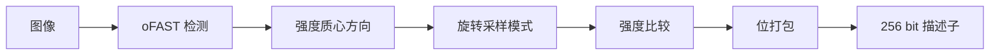

| 处理 | 作用 |
|---|---|
| oFAST 检测 | 快速定位角点 |
| 强度质心方向 | 估计主方向，提供旋转不变性 |
| 旋转采样模式 | 使描述子随旋转一致变化 |
| 强度比较 | 生成 0/1 位，对光照单调变化不敏感 |
| 位打包 | 压缩存储，支持快速 XOR 匹配 |

#### BRISK（Binary Robust Invariant Scalable Keypoints, 512 bit）

- **采样模式**：同心圆（半径按指数增长），共 60 个采样点
- **短对**（$<\delta_{max}$）：用于估计方向
- **长对**（$>\delta_{min}$）：用于构造描述子
- 512 bit，匹配快

#### FREAK（Fast Retina Keypoint, 512 bit）

- **视网膜式采样**：中心密集、外围稀疏，模拟人眼感受野
- 通过**级联比较**逐步筛选，前面若干位就能筛掉大量候选
- 用 45 个感受野之间的比较构成二进制串

#### 其他二进制描述子

| 名称 | 特点 |
|---|---|
| LATCH | 学习式三像素比较，抗噪更好 |
| LIOP | 局部强度序模式，利用像素排序 |
| BOLD | 自适应在线学习二值测试 |
| BinBoost | Boosting 学习二进制哈希 |
| AKAZE-MLDB | 非线性尺度空间 + 改进 LDB |
| KAZE 描述子 | 非线性尺度 + 类 SURF 浮点描述子 |
| D-BRIEF | 面向稠密的 BRIEF 变体 |

### 5.3 区域与仿射描述子

| 名称 | 特点 |
|---|---|
| MSER 区域 | 稳定性极强的仿射不变区域 |
| Harris-Affine 区域 | 迭代估计仿射形状 |
| Hessian-Affine 区域 | Hessian 版本 |
| EBR / IBR | 早期极值区域 |
| 局部强度序 | 序统计描述 |

这些区域经过仿射归一化后，再送入 SIFT/SURF 描述子，即可获得仿射不变特征。

### 5.4 矩型局部描述子

| 名称 | 特点 |
|---|---|
| 图像矩 | 可构造平移/旋转/尺度不变 |
| Zernike 矩 | 正交基，旋转不变，重建能力强 |
| 伪 Zernike 矩 | 放宽正交性，数值更稳 |
| Legendre 矩 | 正交多项式，在矩形区域定义 |
| Tchebichef / Krawtchouk 矩 | 离散正交矩，适合数字图像 |
| 小波矩 | 多分辨率 + 矩 |

---

## 6. 全局描述子（Global Descriptors）

### 6.1 GIST / 空间包络

对人类场景感知的近似建模：

1. 对图像做多尺度、多方向的 Gabor 滤波
2. 把每张响应图划成 4×4 网格
3. 对每个网格取平均能量

维度 = 尺度数 × 方向数 × 网格数（典型 512）。

GIST 用于场景分类与快速图像检索。

**GIST 特征提取处理流程与作用**：

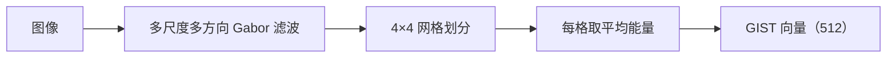

| 处理 | 作用 |
|---|---|
| Gabor 滤波组 | 提取多方向/多尺度纹理能量 |
| 网格划分 | 保留粗略空间布局（空间包络） |
| 平均能量 | 压缩成紧凑的全局向量 |

### 6.2 全局颜色统计

- 颜色直方图
- 颜色矩（均值、方差、偏度）
- 颜色聚合向量（CCV）
- 颜色相关图（correlogram）

### 6.3 全局纹理统计

- GLCM / Haralick
- Tamura 特征：粗糙度、对比度、方向性、线状性、规则性、粗略度
- 小波能量
- MR8 滤波组响应直方图

### 6.4 全局形状描述

- Hu 矩
- Zernike 矩
- Fourier 描述子
- 骨架图

### 6.5 全局聚合描述子

- **BoW（Bag of Words）**：局部描述子聚类成词袋，统计词频
- **Fisher Vector**：GMM 梯度聚合
- **VLAD**：残差聚合
- **CNN 全局池化**：VGG/ResNet 特征 + average/max/GeM/R-MAC 池化

---

## 7. 纹理描述子（Texture Descriptors）

**纹理描述子分类与处理**：

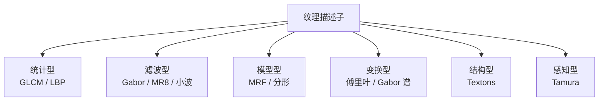

| 类别 | 方法 | 原理 |
|---|---|---|
| 统计型 | GLCM、GLRLM、LBP、灰度梯度 | 统计像素对/游程/局部模式 |
| 滤波型 | Gabor、MR8、小波、可操纵滤波 | 多方向多尺度响应能量 |
| 模型型 | 马尔可夫随机场、分形维数 | 用概率模型描述纹理生成 |
| 变换型 | 傅里叶能量、Gabor 谱、小波 | 频域能量分布 |
| 结构型 | 形态学、纹理单元、Textons | 重复基元的排列 |
| 感知型 | Tamura | 按人类视觉描述词汇 |

**LBP 的常用变体**：

| 变体 | 特点 |
|---|---|
| $\mathrm{LBP}^{u2}$ | 均匀模式，降维 |
| $\mathrm{LBP}^{ri}$ | 旋转不变 |
| $\mathrm{LBP}^{riu2}$ | 旋转不变均匀模式 |
| CLBP | 加入幅值与中心像素信息 |
| LBP-HF | 傅里叶域的旋转不变 LBP |
| CS-LBP | 中心对称比较，维度更低 |
| LBP-TOP | 时空三维 LBP，用于视频 |
| 多尺度 LBP | 多半径组合 |

**Textons**：先用滤波组响应聚类得到纹理基元，再用基元直方图表示纹理。

---

## 8. 颜色描述子（Color Descriptors）

### 8.1 颜色直方图族

- RGB / HSV / Lab 三通道直方图
- 联合直方图 vs 边缘分布
- 加空间信息的直方图（分块、环形）

### 8.2 颜色矩

一阶矩（均值）、二阶矩（标准差）、三阶矩（偏度）：

$$
\mu_k = \frac{1}{N}\sum_i p_{ik},\quad
\sigma_k = \left(\frac{1}{N}\sum_i (p_{ik}-\mu_k)^2\right)^{1/2},\quad
s_k = \left(\frac{1}{N}\sum_i (p_{ik}-\mu_k)^3\right)^{1/3}
$$

其中：

- $k$：颜色通道。
- $N$：像素数。
- $p_{ik}$：第 $i$ 个像素在第 $k$ 通道的取值。
- $\mu_k$：均值（一阶矩），反映平均亮度/颜色。
- $\sigma_k$：标准差（二阶矩），反映对比度/颜色变化。
- $s_k$：偏度（三阶矩），反映分布不对称性。
- **含义**：用三个统计量概括每个通道的颜色分布，维度极低，适合快速检索。

### 8.3 颜色结构描述

- **CCV（Color Coherence Vector）**：区分相干/非相干像素
- **Color Correlogram**：颜色对的空间相关性
- **Color Names**：把颜色映射到 11 个语言色名

### 8.4 颜色 SIFT 家族

在颜色空间中重复 SIFT 流程：

| 描述子 | 颜色空间 |
|---|---|
| RGB-SIFT | 各 RGB 通道分别做 SIFT |
| OpponentSIFT | 对立色空间 |
| HSV-SIFT / HueSIFT | HSV |
| rgSIFT | 归一化 rg 色度 |
| C-SIFT | 色度不变量 |
| Transformed Color SIFT | 颜色变换不变 |

### 8.5 颜色描述子的匹配

- 直方图交集
- $\chi^2$ 距离

$$
d_{\chi^2}(\mathbf{h},\mathbf{g}) = \frac{1}{2}\sum_i \frac{(h_i-g_i)^2}{h_i+g_i}
$$

其中：

- $\mathbf{h}, \mathbf{g}$：两个直方图。
- $h_i, g_i$：第 $i$ 个箱的值。
- **含义**：分母 $h_i+g_i$ 对每个箱做归一化，使大箱与小箱公平比较，适合直方图匹配。

- EMD（Earth Mover's Distance）

---

## 9. 形状与轮廓描述子（Shape / Contour Descriptors）

### 9.1 轮廓参数化

**链码（Freeman Chain Code）**：用 8 方向编码边界。

**轮廓点复数表示**：

$$
z(k) = x(k) + i\,y(k)
$$

其中：

- $z(k)$：第 $k$ 个轮廓点的复数表示。
- $x(k), y(k)$：轮廓点坐标。
- $i$：虚数单位。
- **含义**：把二维轮廓点写成复数序列，便于用傅里叶变换分析。

**Fourier 描述子**：对 $z(k)$ 做 DFT：

$$
Z(u) = \sum_{k=0}^{N-1} z(k) e^{-i 2\pi uk / N}
$$

其中：

- $Z(u)$：第 $u$ 个频率分量。
- $N$：轮廓点数。
- $e^{-i2\pi uk/N}$：傅里叶基。
- **含义**：把轮廓分解成不同频率的谐波，低频描述整体形状，高频描述细节。

性质：

- 平移只改变 $Z(0)$（去掉即可不变）
- 旋转只改变相位
- 尺度只改变幅值
- 取 $|Z(u)|$ 得到旋转不变描述子

### 9.2 曲率与尺度空间

**曲率尺度空间（CSS）**：

$$
\kappa(u,\sigma) = \frac{\dot{x}\ddot{y}-\ddot{x}\dot{y}}{(\dot{x}^2+\dot{y}^2)^{3/2}}
$$

其中：

- $\kappa$：曲率。
- $u$：弧长参数。
- $\sigma$：平滑尺度。
- $\dot{x}, \dot{y}$：一阶导；$\ddot{x}, \ddot{y}$：二阶导。
- **含义**：在不同平滑尺度下计算轮廓曲率，零交叉点对应形状的显著拐点，形成尺度树。

随 $\sigma$ 增大，曲率零交叉点从细节到整体逐层出现，形成"尺度树"。

**转向函数（Turning Function）**：把边界累积转角作为弧长的函数，
对旋转、平移不变，对尺度可归一化。

### 9.3 形状上下文（Shape Context）

对形状上一点 $p_i$，统计其余 $n-1$ 个点的相对位置分布：

- 对数极坐标分箱：12 个角度 × 5 个半径 = 60 箱
- 得到 60 维直方图

**匹配代价**：

$$
C_{ij} = \frac{1}{2}\sum_{k=1}^{K}\frac{(h_i(k)-h_j(k))^2}{h_i(k)+h_j(k)}
$$

其中：

- $C_{ij}$：点 $i$ 与点 $j$ 的匹配代价。
- $h_i(k), h_j(k)$：两点形状上下文直方图的第 $k$ 个箱。
- $K$：箱数（60）。
- **含义**：用 $\chi^2$ 距离度量两点形状上下文的差异，再用匈牙利算法求全局最优匹配。

用匈牙利算法求最优匹配。

### 9.4 其他形状描述子

| 名称 | 原理 |
|---|---|
| Hu 矩 | 七个不变矩组合 |
| Zernike 矩 | 正交基，旋转不变 |
| 距离变换 / 中轴 | 骨架描述 |
| Chamfer 距离 | 边缘点距离匹配 |
| 多边形近似 | Douglas–Peucker |
| B 样条 | 平滑轮廓参数化 |
| 骨架图 | 拓扑结构描述 |
| 形状上下文 | 点分布直方图 |
| 内距离（Inner Distance） | 基于内部测地距离 |

---

## 10. 光谱与子空间描述子（Spectral / Basis / Subspace）

### 10.1 变换域

| 变换 | 用途 |
|---|---|
| DFT | 频域能量、平移不变 |
| DCT | 压缩、能量集中 |
| 小波（Haar、Daubechies） | 多分辨率纹理/形状 |
| Gabor 族 | 方向-频率分解 |
| 可操纵滤波 | 任意方向的可调响应 |
| 梅林/傅里叶-梅林 | 尺度和旋转不变配准 |

### 10.2 子空间方法

| 方法 | 原理 | 应用 |
|---|---|---|
| PCA | 最大方差投影 | Eigenfaces、降维 |
| LDA | 最大类间/类内比 | Fisherfaces |
| ICA | 统计独立分量 | 盲源分离 |
| NMF | 非负分解 | 部件化表示 |
| 稀疏编码 | 稀疏线性组合 | 图像分类 |
| 字典学习 | 学习过完备基 | 去噪、分类 |
| 谱图（Spectral Graph） | 图拉普拉斯特征 | 形状匹配 |

---

## 11. 学习型与深度描述子（Learning-based）

### 11.1 经典学习型描述子

| 名称 | 学习方式 |
|---|---|
| PCA-SIFT | 对 SIFT 梯度块做 PCA |
| LDA 描述子 | 用判别分析投影 |
| Random Ferns | 随机蕨分类器 |
| Random Forests 描述 | 决策森林输出 |
| Boosting 描述子 | AdaBoost 选择特征 |
| 度量学习描述子 | 三元组损失学习距离 |
| DeepCompare / DeepDesc | 浅层孪生网络 + 相似度损失 |
| MatchNet | 孪生网络 + 全连接度量 |

### 11.2 深度局部描述子

| 名称 | 核心思想 |
|---|---|
| L2-Net | 逐块归一化，改善匹配分布 |
| HardNet | 在 batch 内挖掘最难的负样本 |
| SOSNet | 引入二阶相似度正则 |
| SuperPoint | 自监督：MagicPoint + 单应变换自适应，输出检测+256 维描述子 |
| SuperGlue | 注意力图神经网络 + 最优传输匹配 |
| D2-Net | 联合检测与描述，单次前向 |
| R2D2 | 可重复性与可靠性联合学习 |
| DELF | 语义特征 + 注意力池化 |
| DELG | 全局与局部联合，统一检索与匹配 |
| LF-Net | 全监督学习检测与描述 |
| SIFT + 学习式筛选 | 学习式后处理/筛选 |

**HardNet 的困难负样本挖掘**：

$$
\mathcal{L} = \frac{1}{N}\sum_i \max\big(0,\ 1 + d(\mathbf{a}_i,\mathbf{p}_i) - d(\mathbf{a}_i, \mathbf{n}^*_i)\big)
$$

其中：

- $N$：batch 内样本对数。
- $\mathbf{a}_i$：锚点描述子。
- $\mathbf{p}_i$：与锚点匹配的正样本。
- $\mathbf{n}^*_i$：batch 内最近的非匹配描述子（最难负样本）。
- $d(\cdot,\cdot)$：描述子距离。
- $1$：边界（margin）。
- **含义**：要求正样本距离比最难负样本至少小一个 margin，从而拉开正负样本分布。

其中 $\mathbf{n}^*$ 是批次内最近的非匹配描述子。

**SuperPoint 的伪标签自监督**：对图像施加随机单应变换，把关键点位置相应地变换，
用形状一致的方式生成热力图监督信号。

### 11.3 深度全局与检索描述子

| 名称 | 特点 |
|---|---|
| 全连接层特征（FC7 等） | 早期迁移学习特征 |
| 全局平均池化（GAP） | 紧凑全局表示 |
| GeM 池化 | 广义均值池化 |

$$
\text{GeM} = \left( \frac{1}{|\mathcal{X}|}\sum_{x\in\mathcal{X}} x^p \right)^{1/p}
$$

其中：

- $\mathcal{X}$：特征图上的激活值集合。
- $|\mathcal{X}|$：元素个数。
- $p$：可学习/可调的幂次。
- **含义**：$p=1$ 退化为平均池化，$p\to\infty$ 趋近最大池化，介于两者之间，可学习最优折中。

| R-MAC | 多区域最大激活聚合 |
| NetVLAD | 可微 VLAD 层 |
| Fisher Vector + CNN | CNN 特征 + FV 编码 |
| BEBLID | 提升式二进制描述子 |

### 11.4 学习型描述子的关键损失

- 对比损失（contrastive）
- 三元组损失（triplet）
- 铰链/边界挖掘（hard mining）
- 排序损失（ranking）
- 归一化相关 / 相似度匹配损失（NCC loss）

---

## 12. 立体匹配与光流描述子

### 12.1 稠密立体匹配代价

| 方法 | 原理 |
|---|---|
| SAD | 绝对差之和 |
| SSD | 平方差之和 |
| NCC | 归一化互相关 |
| Census | 强度比较位串 + 汉明距离 |
| BT（Birchfield–Tomasi） | 抗采样、对幅值不敏感 |
| 互信息（MI） | 统计依赖度，适跨模态 |
| AD-Census | 组合代价 |
| 半全局匹配（SGM） | 代价聚合 + 一致性检查 |

**Census 变换**：

$$
C(p) = \bigotimes_{\mathbf{q}\in \mathcal{N}(p)} \big[ I(\mathbf{q}) > I(p) \big]
$$

其中：

- $C(p)$：像素 $p$ 的 Census 位串。
- $\mathcal{N}(p)$：$p$ 的邻域。
- $\mathbf{q}$：邻域像素。
- $I(\cdot)$：灰度值。
- $\bigotimes$：位串拼接。
- $[\cdot]$：指示函数，邻域比中心亮为 1。
- **含义**：把邻域与中心的亮度比较编码成位串，对光照幅值变化不敏感，匹配用汉明距离。

匹配用汉明距离。

### 12.2 光流

**Lucas–Kanade**（局部，亮度恒定假设）：

$$
I(x+u, y+v) \approx I(x,y) + I_x u + I_y v
$$

其中：

- $u, v$：待求的光流（位移）。
- $I_x, I_y$：空间梯度。
- **含义**：用一阶泰勒展开近似位移后的灰度，是光流约束方程的线性化。

最小化：

$$
E(u,v) = \sum_W \big( I_x u + I_y v + I_t \big)^2
$$

其中：

- $E$：窗口内的亮度恒定误差。
- $I_t$：时间梯度。
- $W$：局部窗口。
- **含义**：在窗口内最小化亮度恒定误差，求解局部光流。

解：

$$
\begin{bmatrix}u\\v\end{bmatrix} =
\left(\sum_W \begin{bmatrix}I_x^2 & I_xI_y\\ I_xI_y & I_y^2\end{bmatrix}\right)^{-1}
\sum_W \begin{bmatrix}I_xI_t\\ I_yI_t\end{bmatrix}
$$

其中：

- 左侧：待求光流向量。
- 括号内：结构张量之和（可逆性要求纹理丰富）。
- 右侧：梯度与时间梯度的相关向量。
- **含义**：最小二乘解，要求窗口内纹理丰富（结构张量可逆），否则出现孔径问题。

**Horn–Schunck**（全局，加平滑正则）：

$$
E = \iint \big( I_x u + I_y v + I_t \big)^2 + \alpha^2 \big( \lVert \nabla u \rVert^2 + \lVert \nabla v \rVert^2 \big)\, dx\,dy
$$

其中：

- 第一项：亮度恒定误差（数据项）。
- 第二项：光流场的平滑正则项。
- $\alpha$：正则权重，控制平滑强度。
- $\nabla u, \nabla v$：光流场的空间梯度。
- **含义**：在整幅图上最小化\"亮度恒定 + 光流平滑\"，用全局平滑约束解决孔径问题。

**光流/立体匹配处理的作用**：

| 处理 | 作用 |
|---|---|
| 亮度恒定假设 | 建立可解的约束方程 |
| 局部窗口最小二乘 | 求解局部光流（LK） |
| 全局平滑正则 | 解决孔径问题（HS） |
| Census 比较 | 对光照幅值变化鲁棒 |
| 代价聚合 | 提升匹配稳定性（SGM） |

---

## 13. 视频与时序描述子

| 名称 | 原理 |
|---|---|
| HOG3D | 时空梯度方向直方图 |
| HOF | 光流方向直方图 |
| MBH | 运动边界直方图 |
| iDT | 改进稠密轨迹 + 四种描述子融合 |
| Dense Trajectories | 稠密采样点轨迹 + 轨迹形状描述 |
| LBP-TOP | 三正交平面 LBP |
| 3D SIFT | 时空 SIFT |
| C3D / I3D / Two-Stream | 深度时空特征（学习型） |
| TimeSformer / VideoMAE | 基于 Transformer 的视频表示 |

---

## 14. 匹配、索引与检索

### 14.1 匹配策略

- 暴力匹配（brute force）
- 最近邻 + 距离比（NNDR）
- 交叉检验（cross-check / mutual NN）
- 比率检验 + 几何验证（RANSAC）
- 互信息/相关（跨模态）

### 14.2 近似最近邻索引

| 方法 | 原理 |
|---|---|
| KD-Tree | 递归空间划分 |
| FLANN | 自动选算法与参数 |
| LSH | 哈希碰撞近似近邻 |
| Hamming 索引 | 二进制位串分块 |
| 层次 K-means | 词袋倒排 |
| 乘积量化（PQ） | 子空间分解 + 码本 |
| 倒排文件（IVF） | 聚类桶 + 倒排 |
| HNSW | 分层可导航小世界图 |

### 14.3 检索流程

1. 提取局部描述子
2. 量化到视觉词 / 聚合（BoW、VLAD、FV）
3. 归一化（幂律、L2、白化）
4. 倒排索引 + 候选排序
5. 几何重排序（RANSAC、空间验证）

---

## 15. 评价指标与基准数据集

### 15.1 指标

| 指标 | 含义 |
|---|---|
| Repeatability | 变换后同一物理点被重复检测的比例 |
| Recall / Precision | 匹配查全/查准 |
| 匹配得分（matching score） | 正确匹配比例 |
| mAP | 检索平均精度均值 |
| 定位误差 | 匹配点像素误差 |
| 描述子距离分布 | 正/负样本可分性 |
| 计算耗时 / 内存 | 效率代价 |

### 15.2 常用数据集与基准

| 名称 | 用途 |
|---|---|
| Oxford VGG Affine | 仿射不变性评测 |
| HPatches | 局部描述子现代基准 |
| Brown / UBC | 宽基线匹配 |
| EVD | 视角变化评测 |
| MVS / PhotoTourism | 3D 重建匹配 |
| Oxford RobotCar | 长时视觉定位 |
| ImageNet / Places | 全局表示与检索 |
| Oxford5k / Paris6k / ROxford / RParis | 图像检索 |
| KITTI / EuRoC | 视觉里程计、SLAM |

---

## 16. 应用方向

### 16.1 几何与三维

| 应用 | 常用描述子 |
|---|---|
| 图像拼接/全景 | SIFT、SURF、ORB |
| 运动恢复结构（SfM） | SIFT（COLMAP 等） |
| 立体视觉与深度 | Census、AD-Census、DAISY、SGM |
| 多视图立体 | DAISY、PatchMatch + 描述子 |
| 相机标定/配准 | Harris、SIFT、棋盘角点 |
| 图像配准（医学/遥感） | SIFT、MI、形状上下文 |

### 16.2 定位与机器人

| 应用 | 常用描述子 |
|---|---|
| SLAM | ORB（ORB-SLAM）、SuperPoint |
| 视觉里程计 | FAST + 光流、ORB |
| 回环检测 | BoW、NetVLAD、DELG |
| 重定位 | NetVLAD、全局描述子 |
| 视觉导航 | 全局描述子 + 局部匹配 |

### 16.3 检测与识别

| 应用 | 常用描述子 |
|---|---|
| 行人检测 | HOG + SVM、DPM |
| 人脸检测 | Haar-like + AdaBoost、深度 |
| 通用目标检测 | CNN 特征（发展自 HOG 思路） |
| 人脸识别 | LBPH、Eigenfaces、Fisherfaces、深度嵌入 |
| 表情/年龄 | LBP、Gabor、深度 |
| 字符/OCR | HOG、LBP、投影特征、深度 |
| 文档表格/版面 | 线段、布局特征、深度布局模型 |

### 16.4 检索与分类

| 应用 | 常用描述子 |
|---|---|
| 图像检索 | BoW、VLAD、Fisher Vector、DELF/DELG |
| 近重复检测 | 全局描述子 + 哈希 |
| 场景分类 | GIST、CNN 全局特征 |
| 纹理分类 | LBP、Gabor、GLCM、Textons |
| 商品/商标检索 | 局部描述子 + 聚合 |
| 视频检索 | iDT、深度时空特征 |

### 16.5 跟踪与视频

| 应用 | 常用描述子 |
|---|---|
| 目标跟踪 | LBP、HOG、相关滤波（KCF/MOSSE）、深度特征 |
| 动作识别 | HOG3D、HOF、MBH、iDT、I3D |
| 行人重识别 | 颜色直方图 + 深度嵌入 |
| 手势/姿态 | 形状上下文、骨架 + 深度 |

### 16.6 工业与其他

| 应用 | 常用描述子 |
|---|---|
| 表面缺陷检测 | LBP、GLCM、Gabor |
| 布料/材料纹理 | LBP、Tamura、小波 |
| 遥感变化检测 | SIFT、全局统计、深度 |
| 医学图像分析 | LBP、Gabor、形状、深度 |
| 生物特征（指纹/虹膜） | 方向场、Gabor、纹理编码 |
| 增强现实（AR） | ORB、SuperPoint、平面跟踪 |
| 文档扫描矫正 | 边缘 + 线段 + 单应 |

---

## 17. 选型与设计权衡

### 17.1 选择维度

| 需求 | 推荐 |
|---|---|
| 最高匹配精度、可离线 | SIFT、RootSIFT、GLOH、SuperPoint |
| 实时性需求高 | ORB、BRISK、FREAK、AKAZE |
| 极小内存 | BRIEF/ORB（二进制）、LBP |
| 强仿射变化 | MSER + SIFT、Harris-Affine |
| 非刚性形变 | Shape Context、内距离 |
| 纹理分类 | LBP、Gabor、GLCM、Textons |
| 目标检测（经典） | HOG、Haar-like |
| 大规模检索 | VLAD、Fisher Vector、NetVLAD、深度全局 |
| 宽基线/难场景 | SuperPoint + SuperGlue、D2-Net |
| 跨模态 | 互信息、学习型嵌入 |

### 17.2 主要权衡

| 权衡 | 说明 |
|---|---|
| 维度 vs 速度 | 128 维 SIFT 精度高但慢；256 bit ORB 快但精度略低 |
| 不变性 vs 区分性 | 越不变往往越不具区分性 |
| 手工 vs 学习 | 学习型精度高，但依赖数据与算力 |
| 稀疏 vs 稠密 | 稀疏可匹配，稠密可建图 |
| 检测 vs 描述强制解耦 | 耦合（如 D2-Net）可联合优化 |
| 归一化强度 | 过强丢失信息，过弱受光照影响 |

### 17.3 设计检查清单

- 需要哪些不变性？（旋转/尺度/仿射/光照/视角）
- 匹配距离用 L2 还是 Hamming？
- 需要多少关键点？稠密还是稀疏？
- 是否可容忍检测失败？
- 是否需要固定维度以便索引？
- 是否需要 GPU 加速？
- 是否有标注数据可做学习？

---

## 18. 速查表

### 18.1 主要描述子一览

| 描述子 | 维度 | 类型 | 不变性 | 主要应用 |
|---|---|---|---|---|
| SIFT | 128 | 浮点 | 尺度、旋转 | 匹配、SfM、拼接 |
| RootSIFT | 128 | 浮点 | 尺度、旋转 | 匹配（提升版） |
| PCA-SIFT | 20–36 | 浮点 | 尺度、旋转 | 快速匹配 |
| SURF | 64/128 | 浮点 | 尺度、旋转 | 实时匹配 |
| GLOH | 128 | 浮点 | 尺度、旋转 | 高精度匹配 |
| DAISY | 200 | 浮点 | 尺度、旋转（弱） | 稠密立体 |
| HOG | 可变 | 浮点 | 光照（弱） | 行人检测 |
| PHOG | 可变 | 浮点 | 光照（弱） | 形状/场景 |
| BRIEF | 128–512 | 二进制 | 无 | 快速匹配 |
| ORB | 256 | 二进制 | 尺度、旋转 | SLAM、实时 |
| BRISK | 512 | 二进制 | 尺度、旋转 | 实时匹配 |
| FREAK | 512 | 二进制 | 尺度、旋转 | 移动端 |
| AKAZE | 486 | 二进制 | 尺度、旋转 | 鲁棒匹配 |
| LATCH | 256 | 二进制 | 无（可加） | 稠密匹配 |
| LBP | 59/256 | 整数/直方图 | 旋转（变体） | 纹理、人脸 |
| Gabor | 可变 | 浮点 | 方向/频率 | 纹理 |
| GLCM/Haralick | 4–14 | 浮点 | 无 | 纹理分类 |
| Tamura | 6 | 浮点 | 无 | 纹理感知 |
| Shape Context | 60 | 浮点 | 平移、尺度 | 形状匹配 |
| Fourier 描述子 | 可变 | 浮点 | 平移、旋转、尺度 | 轮廓匹配 |
| Hu 矩 | 7 | 浮点 | 平移、旋转、尺度 | 形状识别 |
| Zernike 矩 | 可变 | 浮点 | 旋转 | 形状识别 |
| MSER | 区域 | 区域 | 仿射 | 区域匹配、文字 |
| GIST | 512 | 浮点 | 无 | 场景分类 |
| BoW | 词袋 | 稀疏 | 继承局部 | 检索 |
| VLAD | $K\times d$ | 浮点 | 继承局部 | 检索 |
| Fisher Vector | $2Kd$ | 浮点 | 继承局部 | 检索/分类 |
| NetVLAD | $K\times d$ | 浮点 | 学习 | 地点识别 |
| Census | 位串 | 二进制 | 幅值 | 立体匹配 |
| SuperPoint | 256 | 浮点 | 学习 | SLAM、匹配 |
| SuperGlue | 匹配网络 | 学习 | 学习 | 宽基线匹配 |
| DELF | 1024 | 浮点 | 学习 | 检索 |
| DELG | 全局+局部 | 学习 | 学习 | 统一检索 |
| GeM/R-MAC | 可变 | 浮点 | 学习 | 检索 |

### 18.2 分类脉络速记

```
描述子
├─ 全局
│   ├─ 颜色：直方图、矩、CCV、correlogram
│   ├─ 纹理：GLCM、Tamura、LBP 直方图、Gabor 能量
│   ├─ 形状：Hu、Zernike、Fourier
│   ├─ 场景：GIST
│   └─ 聚合：BoW、VLAD、Fisher、CNN 全局池化
└─ 局部
    ├─ 梯度直方图：SIFT、SURF、GLOH、HOG、DAISY
    ├─ 二进制：BRIEF、ORB、BRISK、FREAK、LATCH
    ├─ 区域/仿射：MSER、Harris-Affine、Hessian-Affine
    ├─ 矩：Zernike、Legendre、Tchebichef
    ├─ 形状：Shape Context、链码、CSS、转向函数
    ├─ 纹理：LBP、Gabor、MR8、Textons
    └─ 学习型：L2-Net、HardNet、SuperPoint、D2-Net、R2D2
```

### 18.3 特征提取处理速查

**通用特征提取流水线**：


**各描述子的处理步骤与作用**：

| 描述子 | 主要处理步骤 | 各步作用 |
|---|---|---|
| SIFT | 尺度空间 → DoG 极值 → 亚像素定位 → 边缘剔除 → 主方向 → 4×4×8 方向直方图 → L2+clip+L2 | 尺度/旋转不变；定位精确；编码局部结构；光照鲁棒 |
| SURF | 积分图 + 盒滤波 Hessian → Haar 响应 → 4×4 子区域统计 | 快速检测；方向分配；64/128 维编码 |
| HOG | 梯度 → cell 直方图 → block 拼接 → L2-Hys | 边缘信号；局部方向统计；上下文；光照鲁棒 |
| BRIEF | 随机采样对 → 强度比较 → 位打包 | 极快匹配；对光照单调变化不敏感 |
| ORB | oFAST → 强度质心方向 → 旋转采样 → rBRIEF 选对 | 快速检测；旋转不变；去相关提升区分性 |
| BRISK | AGAST + 尺度空间 → 同心圆采样 → 长短对 | 多尺度；方向估计；二进制编码 |
| FREAK | 视网膜采样 → 级联比较 | 模拟人眼；提前筛除候选加速匹配 |
| LBP | 邻域比较 → 位编码 → 直方图 | 微纹理编码；光照单调不变；均匀模式降维 |
| Gabor | 多方向多尺度滤波 → 能量统计 | 方向/频率纹理提取 |
| GLCM | 灰度对统计 → Haralick 特征 | 空间共生规律；可分类标量 |
| Hu 矩 | 几何矩 → 中心矩 → 归一化 → 组合 | 平移/旋转/尺度不变形状描述 |
| Zernike 矩 | 正交基投影 → 取模 | 无冗余；旋转不变；可重建 |
| Shape Context | 对数极坐标分箱 → χ² 匹配 | 点分布描述；非刚性形状匹配 |
| Fourier 描述子 | 轮廓复数化 → DFT → 取模 | 平移/旋转/尺度不变轮廓描述 |
| GIST | Gabor 滤波组 → 4×4 网格 → 平均能量 | 场景空间包络；紧凑全局表示 |
| VLAD | 聚类 → 残差聚合 → 幂律+L2 | 紧凑编码局部描述子集合 |
| Fisher Vector | GMM → 参数梯度 → 归一化 | 保留二阶统计；高区分性 |
| Census | 邻域比较 → 位串 → 汉明距离 | 对光照幅值变化鲁棒；立体匹配 |
| HardNet | 深度网络 → 困难负样本挖掘 | 拉开正负样本分布；提升匹配 |
| SuperPoint | 自监督热力图 → 检测+描述头 | 联合检测与描述；可学习 |

**处理步骤的通用作用总结**：

| 处理类别 | 代表操作 | 核心作用 |
|---|---|---|
| 预处理 | 灰度化、平滑、归一化 | 降噪、统一输入尺度 |
| 检测 | 角点/斑点/区域检测 | 找到稳定、可重复的位置 |
| 几何归一化 | 主方向、尺度、仿射归一化 | 赋予旋转/尺度/仿射不变性 |
| 特征提取 | 梯度、比较、滤波、矩 | 提取对内容敏感的信号 |
| 量化编码 | 直方图、二值、投影、聚类 | 压成固定维度、可比较的编码 |
| 数值归一化 | L2/L1、幂律、clip | 抑制光照/对比度，提升鲁棒性 |
| 匹配 | 距离度量、比率检验、RANSAC | 找对应点并剔除外点 |

---

## 19. 结论

描述子的核心思想可以浓缩为三步：

1. **选一个区域**——用检测子找出稳定、可重复的位置或区域
2. **编码一个向量**——用梯度、比较、矩、滤波、频谱等算子把内容量化
3. **做一次归一化**——用归一化、主方向、尺度、仿射等手段获得不变性

不同描述子的差别，本质上就是：

- 用什么算子 $\mathcal{F}$
- 用什么量化 $\mathcal{Q}$
- 用什么归一化 $\mathcal{N}$
- 想要哪种不变性
- 是手工设计还是从数据中学习

从历史脉络看，描述子经历了三个阶段：

- **手工几何阶段**：Harris、SIFT、SURF、HOG、LBP、Shape Context
- **二进制与实时阶段**：BRIEF、ORB、BRISK、FREAK、AKAZE
- **学习与深度阶段**：Fisher/VLAD → HardNet、SuperPoint、SuperGlue、D2-Net、DELF/DELG

但即使到了深度学习时代，经典描述子的设计思想（尺度空间、主方向归一化、
方向直方图、二值比较、聚合编码）依然是理解现代特征表示的重要基础，
也是许多工业场景中低延迟、低功耗方案的首选。