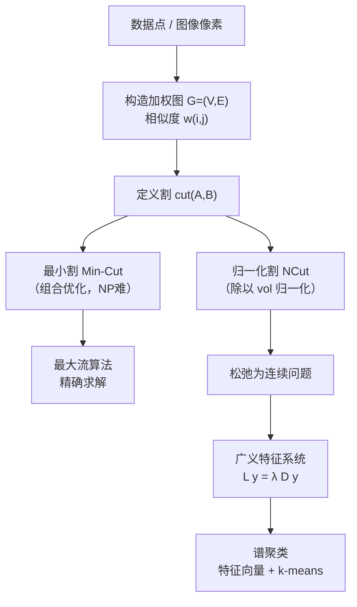
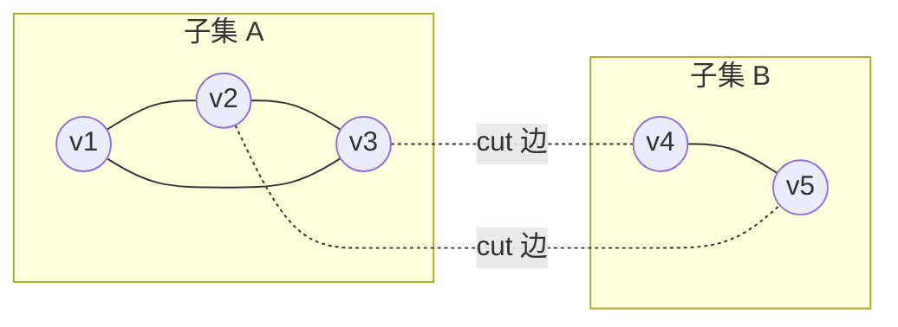
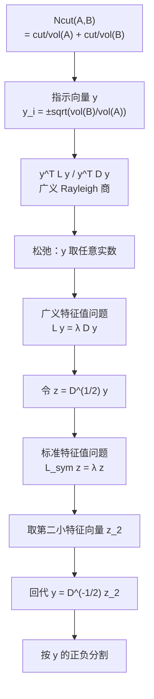
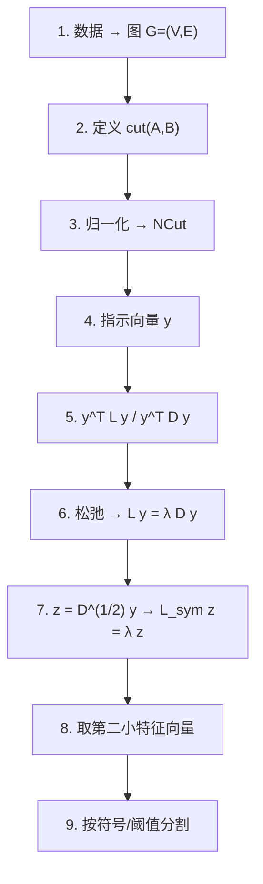

# 图割与谱聚类：从 NCut 推导到拉普拉斯矩阵

> **写给完全没接触过的人**
>
> 本文假设你只学过线性代数（矩阵乘法、特征值）和一点点概率，其余概念全部从零讲起。
> 目标是把「图割（Graph Cut）」与「谱聚类（Spectral Clustering）」这两件事，
> 从**最朴素的直觉**一路推到**能自己动手推导**的程度。
>
> 全文围绕两张图里的公式展开：
>
> $$
> Ncut(A,B) = \frac{cut(A,B)}{assoc(A,V)} + \frac{cut(A,B)}{assoc(B,V)}
> $$
>
> $$
> Ncut(A,B) = \frac{cut(A,B)}{cut(A,V)} + \frac{cut(A,B)}{cut(B,V)}
> = \frac{\sum_{x_i>0,\,x_j<0} -w(i,j)\,x_i x_j}{\sum_{x_i>0} d_i}
> + \frac{\sum_{x_i<0,\,x_j>0} -w(i,j)\,x_i x_j}{\sum_{x_i<0} d_i}
> $$
>
> 我们会用 $vol(A)$ 把每个符号的含义讲透，并**重点解释这两个公式为什么看起来不一样**。

---

## 目录

1. 引言：为什么需要图割与谱聚类
2. 图的基本概念（顶点、边、权重、度）
3. 图的划分与「割」（Cut）
4. 从最小割到归一化割：为什么不能直接最小化 cut
5. 拉普拉斯矩阵的来源
6. NCut 的详细推导
7. 广义特征系统的构造（每一步）
8. 求解出 $y$ 之后如何分割
9. 两个 NCut 公式为什么「不一样」
10. 谱聚类完整算法
11. 图割算法（Min-Cut / Max-Flow）
12. 知识点汇总
13. 速查表
14. 结论

---

## 1. 引言：为什么需要图割与谱聚类

### 1.1 一个最朴素的问题

假设你有一张图片，或者一堆数据点，你想把它们**分成两堆**（或者若干堆）。
比如：

- 把一张照片里的「前景」和「背景」分开；
- 把一堆用户按兴趣分成几个群体；
- 把一堆像素按颜色/位置聚成几块。

最直接的想法是：**把「相似」的东西分到同一堆，「不相似」的东西分到不同堆**。

### 1.2 把数据变成「图」

为了用数学描述「相似」，我们把每个数据点看成一个**顶点（node）**，
把两个点之间的「相似程度」看成一条**带权重的边（edge）**。
这样就得到了一个**加权无向图** $G=(V,E)$。

于是「聚类」就变成了「**把图的顶点切成几块，使得块内连接紧密、块间连接稀疏**」。
这就是**图割（Graph Cut）** 的思想。

### 1.3 两条技术路线

| 路线 | 核心思想 | 代表方法 |
|---|---|---|
| **图割（组合优化）** | 直接在图结构上求「最小割」，用最大流算法精确求解 | Min-Cut / Max-Flow、s-t Cut |
| **谱聚类（谱图论）** | 把「最小割」松弛成特征值问题，用矩阵的特征向量求解 | RatioCut、NCut、Laplacian Eigenmaps |

**谱聚类**的妙处在于：它把一个**离散的、NP 难的**组合优化问题，
**松弛**成一个**连续的、可解的**特征值问题，从而能用线性代数高效求解。

**整体脉络示意**：



---

## 2. 图的基本概念（顶点、边、权重、度）

### 2.1 加权无向图

一个**加权无向图**记作：

$$
G = (V, E)
$$

其中：

- $V = \{v_1, v_2, \dots, v_n\}$：**顶点集合**，共 $n = |V|$ 个顶点（每个数据点是一个顶点）。
- $E$：**边集合**，每条边连接两个顶点。
- **无向**：边没有方向，$v_i$ 连 $v_j$ 等价于 $v_j$ 连 $v_i$。

**含义**：图就是「一堆点 + 点与点之间的连接关系」。

### 2.2 边权重（相似度）

每条边 $(i,j)$ 上有一个**非负权重**：

$$
w(i,j) \geq 0
$$

其中：

- $w(i,j)$：顶点 $i$ 与顶点 $j$ 之间的**相似度**（也叫亲和度、affinity）。
- 权重越大，表示两个点越「像」，越应该分到同一堆。
- 无向图要求**对称**：$w(i,j) = w(j,i)$。
- 若两点之间没有边，则 $w(i,j) = 0$。

**含义**：权重是「相似度」的数学化。它把「像不像」变成了一个数字。

**常见的相似度构造方式**（后面第 10 节会细讲）：

$$
w(i,j) = \exp\!\left(-\frac{\lVert x_i - x_j \rVert^2}{2\sigma^2}\right)
$$

其中：

- $x_i, x_j$：两个数据点的特征向量。
- $\lVert x_i - x_j \rVert^2$：两点欧氏距离的平方。
- $\sigma$：尺度参数，控制「多远算远」。
- 距离越近，$w$ 越接近 1；距离越远，$w$ 越接近 0。

### 2.3 相似度矩阵 $W$

把所有 $w(i,j)$ 排成一个 $n \times n$ 的矩阵：

$$
W = \begin{bmatrix}
w(1,1) & w(1,2) & \cdots & w(1,n) \\
w(2,1) & w(2,2) & \cdots & w(2,n) \\
\vdots & \vdots & \ddots & \vdots \\
w(n,1) & w(n,2) & \cdots & w(n,n)
\end{bmatrix}
$$

其中：

- $W$：**相似度矩阵**（也叫邻接矩阵、权重矩阵）。
- 通常取 $w(i,i) = 0$（自己和自己不连边）。
- 因为无向，$W$ 是**对称矩阵**：$W = W^{\mathsf{T}}$。

**含义**：$W$ 把整张图的连接关系「打包」成一个矩阵，方便做线性代数运算。

### 2.4 度（Degree）

顶点 $i$ 的**度**定义为它所有边权重之和：

$$
d_i = \sum_{j=1}^{n} w(i,j)
$$

其中：

- $d_i$：顶点 $i$ 的**度**（degree）。
- $\sum_{j=1}^{n} w(i,j)$：把第 $i$ 行所有元素加起来。
- 直观理解：$d_i$ 越大，说明顶点 $i$ 与周围连接越「紧密」。

**含义**：度衡量一个顶点「有多重要 / 有多中心」。

### 2.5 度矩阵 $D$

把所有度放到对角线上，得到**度矩阵**：

$$
D = \operatorname{diag}(d_1, d_2, \dots, d_n)
= \begin{bmatrix}
d_1 & 0 & \cdots & 0 \\
0 & d_2 & \cdots & 0 \\
\vdots & \vdots & \ddots & \vdots \\
0 & 0 & \cdots & d_n
\end{bmatrix}
$$

其中：

- $D$：**度矩阵**，是一个**对角矩阵**。
- 对角线元素是各顶点的度 $d_i$，非对角线元素全为 0。
- 注意：$D$ 的第 $i$ 行之和 = $d_i$，而 $W$ 的第 $i$ 行之和也 = $d_i$。

**含义**：$D$ 记录了每个顶点的「总连接强度」，是后面拉普拉斯矩阵的关键零件。

**一个关键恒等式**（后面反复用到）：

$$
D \mathbf{1} = \begin{bmatrix} d_1 \\ d_2 \\ \vdots \\ d_n \end{bmatrix},
\qquad
W \mathbf{1} = \begin{bmatrix} d_1 \\ d_2 \\ \vdots \\ d_n \end{bmatrix}
$$

其中：

- $\mathbf{1} = (1,1,\dots,1)^{\mathsf{T}}$：全 1 向量。
- $D\mathbf{1}$：把 $D$ 每行求和，得到度向量。
- $W\mathbf{1}$：把 $W$ 每行求和，也得到度向量。
- 所以 $D\mathbf{1} = W\mathbf{1}$，即 $(D-W)\mathbf{1} = \mathbf{0}$。

**含义**：这个恒等式说明「度矩阵乘全 1 向量 = 相似度矩阵乘全 1 向量」，
它是拉普拉斯矩阵「最小特征值为 0」的根源。

### 2.6 图像尺寸与矩阵尺寸的关系

前面一直在说「$n$ 个顶点」，但**图像本身是二维的**，这里必须把两者的对应关系讲清楚，否则很容易被矩阵的规模吓到。

**第一步：把图像「拉直」成顶点集合。**

设一张图像（或一个待分割区域）的尺寸为：

$$
\text{高} = H \text{（行数）}, \qquad \text{宽} = W \text{（列数）}
$$

那么像素总数为：

$$
n = H \times W
$$

其中：

- $H$：图像的高度（有多少行像素）。
- $W$：图像的宽度（有多少列像素）。
- $n$：像素总数，也就是**图的顶点个数** $|V|$。

**关键约定**：**每一个像素 = 一个顶点**。图像是二维网格，但图论只认「编号 $1,2,\dots,n$」，所以我们按**行优先**（从左到右、从上到下）把二维像素拉成一维编号：

$$
(i, j) \;\longmapsto\; \text{编号} = (i-1)\cdot W + j
$$

其中：

- $(i,j)$：第 $i$ 行、第 $j$ 列的像素（$1 \le i \le H$，$1 \le j \le W$）。
- $(i-1)\cdot W + j$：该像素在顶点列表中的一维编号。
- 例如 $H=3, W=4$ 时，像素 $(2,3)$ 的编号是 $(2-1)\times 4 + 3 = 7$。

**第二步：矩阵尺寸随之确定。**

顶点数一旦是 $n$，第 2.3、2.5 节构造的矩阵尺寸就全部锁定了：

| 对象 | 尺寸 | 说明 |
|---|---|---|
| 顶点集合 $V$ | $n = H \times W$ 个 | 每个像素一个顶点 |
| 相似度矩阵 $W$ | $n \times n = (H W) \times (H W)$ | 每对像素之间一个权重 |
| 度矩阵 $D$ | $n \times n = (H W) \times (H W)$ | 对角矩阵，对角线上 $n$ 个度 |
| 拉普拉斯矩阵 $L = D - W$ | $n \times n = (H W) \times (H W)$ | 与 $W$、$D$ 同尺寸 |
| 指示向量 $y$ | $n \times 1$ | 每个顶点一个分量 |

**含义**：图像是 $H \times W$ 的二维网格，但**图割 / 谱聚类看到的永远是 $n \times n$ 的方阵**，其中 $n = H \times W$。矩阵的「边长」等于像素总数，而不是图像的宽或高。

**第三步：一个具体例子（感受一下规模）。**

假设有一张 $100 \times 100$ 的灰度图：

$$
n = 100 \times 100 = 10\,000
$$

于是：

- $W$ 是 $10\,000 \times 10\,000$ 的矩阵，共 $10^8$（一亿）个元素。
- $D$ 也是 $10\,000 \times 10\,000$，但只有 $10\,000$ 个非零（对角线）。
- $L = D - W$ 同样是 $10\,000 \times 10\,000$。

**含义**：这就是为什么谱聚类在图像上「贵」——像素数一涨，矩阵规模按**平方**爆炸。$200\times200$ 的图，$n=40\,000$，$W$ 就有 $1.6\times10^9$ 个元素。所以实际工程里常用**稀疏矩阵**（只存非零的边）或**超像素**（先把图像压成几百个区域，再对区域建图）来降规模。

**第四步：通道数怎么算？**

如果图像是彩色的（$C$ 个通道，如 RGB 的 $C=3$）：

- **顶点数不变**，仍然是 $n = H \times W$（一个像素还是一个顶点）。
- 变化的是**相似度 $w(i,j)$ 的计算**：此时 $x_i$ 是长度为 $C$ 的特征向量（如 RGB 三值），距离 $\lVert x_i - x_j \rVert^2$ 在 $C$ 维空间里算。
- 所以 $W$、$D$、$L$ 的尺寸**依然是 $n \times n$**，与通道数无关。

**含义**：通道数只影响「两个像素像不像」的度量方式，不影响矩阵的尺寸；矩阵尺寸只由**像素总数 $n = H \times W$** 决定。

**一句话总结**：

$$
\boxed{\;H \times W \text{ 的图像} \;\Longrightarrow\; n = H W \text{ 个顶点} \;\Longrightarrow\; W, D, L \text{ 都是 } n \times n = (HW)\times(HW) \text{ 的方阵}\; }
$$

---

## 3. 图的划分与「割」（Cut）

### 3.1 把图切成两半

假设我们要把顶点集合 $V$ 分成**两个互不相交**的子集 $A$ 和 $B$：

$$
A \cup B = V, \qquad A \cap B = \varnothing
$$

其中：

- $A$：第一堆顶点。
- $B$：第二堆顶点。
- 两者合起来是全部顶点，且没有重叠。

**含义**：这就是「二分类 / 二分图」的数学描述。

### 3.2 割（Cut）

**割**定义为「跨越 $A$ 和 $B$ 的所有边的权重之和」：

$$
cut(A,B) = \sum_{i \in A,\; j \in B} w(i,j)
$$

其中：

- $cut(A,B)$：把 $A$ 和 $B$ 分开的「代价」。
- $\sum_{i \in A,\; j \in B}$：对所有「一个端点在 $A$、另一个端点在 $B$」的边求和。
- 因为无向，$cut(A,B) = cut(B,A)$。

**含义**：$cut(A,B)$ 越小，说明 $A$ 和 $B$ 之间连接越少，切得越「干净」。

**割的示意**：



图中实线是「块内边」，虚线是「跨块边」。$cut(A,B)$ 就是所有虚线权重之和。

### 3.3 体积（Volume）—— 本文的核心符号 $vol(A)$

**体积**定义为「子集 $A$ 中所有顶点的度之和」：

$$
vol(A) = \sum_{i \in A} d_i = \sum_{i \in A} \sum_{j \in V} w(i,j)
$$

其中：

- $vol(A)$：子集 $A$ 的**体积**（volume）。
- $\sum_{i \in A} d_i$：把 $A$ 中每个顶点的度加起来。
- 展开后 $\sum_{i \in A}\sum_{j \in V} w(i,j)$：表示「$A$ 中顶点与**全图所有顶点**（包括 $A$ 内部和 $B$）之间的边权总和」。

**含义（非常重要）**：$vol(A)$ 衡量的是「$A$ 这一堆顶点**整体有多重**」。
它既包含 $A$ 内部的边，也包含 $A$ 连到 $B$ 的边。

**$vol(A)$ 与 $cut(A,B)$ 的关系**：

$$
vol(A) = \underbrace{\sum_{i \in A}\sum_{j \in A} w(i,j)}_{\text{A 内部边（算了两次）}} + \underbrace{\sum_{i \in A}\sum_{j \in B} w(i,j)}_{= cut(A,B)}
$$

其中：

- 第一项：$A$ 内部的边，因为无向，每条边被算了两次。
- 第二项：正好就是 $cut(A,B)$。
- 所以 $vol(A) \geq cut(A,B)$，且 $vol(A) = 2\cdot(\text{A 内部边权}) + cut(A,B)$。

**含义**：$vol(A)$ 一定不小于 $cut(A,B)$，因为体积还包含了内部连接。

### 3.4 关联度（Association）—— 就是 $vol(A)$ 的另一个名字

**关联度**定义为：

$$
assoc(A,V) = \sum_{i \in A,\; j \in V} w(i,j)
$$

其中：

- $assoc(A,V)$：子集 $A$ 与**整个顶点集 $V$** 的关联度。
- $\sum_{i \in A,\; j \in V}$：对「一个端点在 $A$、另一个端点在 $V$（任意顶点）」的边求和。

**关键恒等式**：

$$
assoc(A,V) = \sum_{i \in A}\sum_{j \in V} w(i,j) = \sum_{i \in A} d_i = vol(A)
$$

其中：

- 因为 $\sum_{j \in V} w(i,j) = d_i$，所以 $assoc(A,V)$ 就等于 $A$ 中所有度之和。
- 结论：**$assoc(A,V) = vol(A)$**，两者是同一个东西的两个名字。

**含义**：记住这个恒等式，第 9 节解释「两个公式为什么不一样」时全靠它。

---

## 4. 从最小割到归一化割：为什么不能直接最小化 cut

### 4.1 最小割（Min-Cut）的陷阱

最自然的想法是：**最小化 $cut(A,B)$**。

$$
\min_{A,B} \; cut(A,B)
$$

但这样做有一个**致命缺陷**：算法会倾向于把**孤立的、很小的点**单独切出来。

**举例**：假设图里有一个顶点 $v$ 只和外界有一条很细的边（权重 0.01），
其余顶点之间连接都很强。那么最小割会直接把 $v$ 单独切成一块，
因为 $cut = 0.01$ 非常小——但这显然不是我们想要的「有意义的聚类」。

**含义**：单纯最小化 $cut$ 会导致「**切出孤立小簇**」的退化解。

### 4.2 归一化：让割「相对大小」可比

解决办法是：**把割除以每一块的「大小」**，让不同大小的块可以公平比较。
这就得到两种经典的归一化割：

| 名称 | 公式 | 归一化方式 |
|---|---|---|
| **RatioCut** | $\dfrac{cut(A,B)}{|A|} + \dfrac{cut(A,B)}{|B|}$ | 除以**顶点个数** |
| **NCut** | $\dfrac{cut(A,B)}{vol(A)} + \dfrac{cut(A,B)}{vol(B)}$ | 除以**体积** |

其中：

- $|A|$：$A$ 中顶点的**个数**。
- $vol(A)$：$A$ 的**体积**（度之和）。
- RatioCut 用「个数」归一化，NCut 用「体积」归一化。

**含义**：归一化后，即使某块很小，只要它和外界连接也少，就不会被「廉价地」切出来，
因为分母 $vol(A)$ 或 $|A|$ 也很小，比值不会异常小。

### 4.3 本文的主角：NCut

**归一化割（Normalized Cut, NCut）** 定义为：

$$
Ncut(A,B) = \frac{cut(A,B)}{assoc(A,V)} + \frac{cut(A,B)}{assoc(B,V)}
$$

其中：

- $Ncut(A,B)$：归一化割，我们要**最小化**的目标。
- $cut(A,B)$：跨块边权之和（分子）。
- $assoc(A,V) = vol(A)$：$A$ 的体积（分母）。
- $assoc(B,V) = vol(B)$：$B$ 的体积（分母）。
- 两项分别表示「$A$ 这一侧被切掉的比例」和「$B$ 这一侧被切掉的比例」。

**含义**：$Ncut$ 把「割」表示成「每一侧被切掉的比例之和」。
比例越小，说明切得越「均衡、越干净」。

**为什么用 $vol$ 而不是 $|A|$？**
因为 $vol$ 考虑了边的权重，能反映「这一块有多重」；
而 $|A|$ 只看个数，忽略了连接强度。对图像、点云这类带权数据，$vol$ 更合理。

---

## 5. 拉普拉斯矩阵的来源

### 5.1 从「平滑程度」说起

我们想找一个向量 $f = (f_1, f_2, \dots, f_n)^{\mathsf{T}}$，
它给每个顶点赋一个值。如果两个顶点 $i,j$ 相似（$w(i,j)$ 大），
我们希望它们的值 $f_i, f_j$ 也接近。

衡量「$f$ 在图上有多不平滑」的自然量是：

$$
\frac{1}{2}\sum_{i=1}^{n}\sum_{j=1}^{n} w(i,j)\,\bigl(f_i - f_j\bigr)^2
$$

其中：

- $w(i,j)$：边权。
- $(f_i - f_j)^2$：两个顶点取值的差异平方。
- $\frac{1}{2}$：因为无向图每条边被 $(i,j)$ 和 $(j,i)$ 算了两次，除以 2 修正。
- 整个式子：**加权差异平方和**，越小说明 $f$ 越平滑。

**含义**：这个量是「$f$ 在图上变化有多剧烈」的度量。

### 5.2 把它写成矩阵形式

展开 $(f_i - f_j)^2 = f_i^2 - 2 f_i f_j + f_j^2$：

$$
\frac{1}{2}\sum_{i,j} w(i,j)(f_i - f_j)^2
= \frac{1}{2}\left[\sum_{i,j} w(i,j) f_i^2 - 2\sum_{i,j} w(i,j) f_i f_j + \sum_{i,j} w(i,j) f_j^2\right]
$$

其中：

- 第一项 $\sum_{i,j} w(i,j) f_i^2 = \sum_i f_i^2 \sum_j w(i,j) = \sum_i d_i f_i^2 = f^{\mathsf{T}} D f$。
- 第二项 $-2\sum_{i,j} w(i,j) f_i f_j = -2 f^{\mathsf{T}} W f$。
- 第三项与第一项对称，也等于 $f^{\mathsf{T}} D f$。

合并：

$$
\frac{1}{2}\sum_{i,j} w(i,j)(f_i - f_j)^2
= \frac{1}{2}\bigl(2 f^{\mathsf{T}} D f - 2 f^{\mathsf{T}} W f\bigr)
= f^{\mathsf{T}} (D - W) f
$$

其中：

- $D$：度矩阵。
- $W$：相似度矩阵。
- $D - W$：就是**拉普拉斯矩阵**。

### 5.3 拉普拉斯矩阵的定义

$$
L = D - W
$$

其中：

- $L$：**（组合）拉普拉斯矩阵**（Combinatorial Laplacian）。
- $D$：度矩阵（对角）。
- $W$：相似度矩阵。

**逐元素写法**：

$$
L_{ij} = \begin{cases}
d_i, & i = j \\[4pt]
-w(i,j), & i \neq j
\end{cases}
$$

其中：

- 对角线元素 $L_{ii} = d_i$（第 $i$ 个顶点的度）。
- 非对角线元素 $L_{ij} = -w(i,j)$（负的相似度）。

**含义**：拉普拉斯矩阵把「度」和「相似度」编码进一个矩阵，
它的二次型 $f^{\mathsf{T}} L f$ 正好等于「$f$ 的平滑程度」。

### 5.4 拉普拉斯矩阵的核心性质

**性质 1：对称半正定**

$$
L = L^{\mathsf{T}}, \qquad f^{\mathsf{T}} L f = \frac{1}{2}\sum_{i,j} w(i,j)(f_i - f_j)^2 \geq 0
$$

其中：

- 对称：因为 $D$ 和 $W$ 都对称。
- 半正定：因为二次型是平方和，恒非负。
- 半正定意味着**所有特征值 $\lambda \geq 0$**。

**性质 2：最小特征值为 0，对应特征向量为全 1 向量**

$$
L \mathbf{1} = (D - W)\mathbf{1} = D\mathbf{1} - W\mathbf{1} = \mathbf{0} = 0 \cdot \mathbf{1}
$$

其中：

- 由第 2.5 节的恒等式 $D\mathbf{1} = W\mathbf{1}$，得 $L\mathbf{1} = \mathbf{0}$。
- 所以 $\lambda_1 = 0$ 是最小特征值，对应特征向量 $\mathbf{1}$。

**含义**：全 1 向量代表「所有顶点取值相同」，此时 $f_i - f_j \equiv 0$，
当然最平滑，所以对应最小特征值 0。

**性质 3：特征值排序**

$$
0 = \lambda_1 \leq \lambda_2 \leq \cdots \leq \lambda_n
$$

其中：

- $\lambda_1 = 0$ 恒成立。
- $\lambda_2$：**第二小特征值**，也叫 **Fiedler 值**，是谱聚类的关键。
- $\lambda_2$ 越大，图越「连通」；$\lambda_2$ 越小，图越容易「切成两块」。

**含义**：$\lambda_2$ 的大小反映了图的「可分割性」。

**性质 4：连通分量个数 = 0 特征值的重数**

如果图恰好分成 $k$ 个互不相连的连通块，那么 $L$ 有 $k$ 个 0 特征值。

**含义**：这是谱聚类能工作的根本原因——**特征值 0 的个数告诉你图能分成几块**。

---

## 6. NCut 的详细推导

这一节是全文的核心。我们分两步走：先推 RatioCut（简单版），再推 NCut（正式版）。

### 6.1 预备：指示向量

为了把「$A$ 和 $B$」编码进向量，我们引入**指示向量** $f$：

$$
f_i = \begin{cases}
+\alpha, & i \in A \\
-\beta, & i \in B
\end{cases}
$$

其中：

- $f_i$：第 $i$ 个顶点的取值。
- $\alpha > 0$：$A$ 中顶点取的正值。
- $-\beta < 0$：$B$ 中顶点取的负值。
- 用「正负号」区分两个集合，用「大小」控制归一化。

**含义**：指示向量把「属于哪一堆」变成一个数值向量，方便用矩阵运算。

### 6.2 第一步：RatioCut 的推导

**RatioCut 定义**：

$$
RatioCut(A,B) = \frac{cut(A,B)}{|A|} + \frac{cut(A,B)}{|B|}
$$

**选取指示向量**：

$$
f_i = \begin{cases}
+\sqrt{\dfrac{|B|}{|A|}}, & i \in A \\[8pt]
-\sqrt{\dfrac{|A|}{|B|}}, & i \in B
\end{cases}
$$

其中：

- $|A|, |B|$：两块的顶点个数。
- 取这个特殊值是为了让后面的式子「刚好」等于 RatioCut。

**计算 $f^{\mathsf{T}} L f$**：

$$
f^{\mathsf{T}} L f = \frac{1}{2}\sum_{i,j} w(i,j)(f_i - f_j)^2
$$

只有**跨块边**（$i \in A, j \in B$ 或反之）才有 $f_i \neq f_j$，块内边贡献为 0。对跨块边：

$$
(f_i - f_j)^2 = \left(\sqrt{\frac{|B|}{|A|}} + \sqrt{\frac{|A|}{|B|}}\right)^2
= \frac{|B|}{|A|} + \frac{|A|}{|B|} + 2
$$

其中：

- 因为 $i \in A$ 取正、$j \in B$ 取负，相减变成相加。
- 展开平方得到三项。

于是：

$$
f^{\mathsf{T}} L f = cut(A,B)\left(\frac{|B|}{|A|} + \frac{|A|}{|B|} + 2\right)
= cut(A,B)\cdot\frac{(|A|+|B|)^2}{|A|\,|B|}
= cut(A,B)\cdot\frac{n^2}{|A|\,|B|}
$$

其中：

- $cut(A,B)$：跨块边权之和。
- $\frac{|B|}{|A|} + \frac{|A|}{|B|} + 2 = \frac{|A|^2 + |B|^2 + 2|A||B|}{|A||B|} = \frac{(|A|+|B|)^2}{|A||B|}$。
- $n = |A| + |B| = |V|$。

**计算 $f^{\mathsf{T}} f$**：

$$
f^{\mathsf{T}} f = \sum_i f_i^2 = |A|\cdot\frac{|B|}{|A|} + |B|\cdot\frac{|A|}{|B|} = |B| + |A| = n
$$

其中：

- $A$ 中每个顶点贡献 $f_i^2 = |B|/|A|$，共 $|A|$ 个，合计 $|B|$。
- $B$ 中每个顶点贡献 $f_i^2 = |A|/|B|$，共 $|B|$ 个，合计 $|A|$。
- 总和 $= n$。

**得到 RatioCut 的矩阵形式**：

$$
RatioCut(A,B) = \frac{cut(A,B)}{|A|} + \frac{cut(A,B)}{|B|}
= cut(A,B)\cdot\frac{n}{|A|\,|B|}
= \frac{f^{\mathsf{T}} L f}{n}
= \frac{f^{\mathsf{T}} L f}{f^{\mathsf{T}} f}
$$

其中：

- 因为 $f^{\mathsf{T}} L f = cut(A,B)\cdot n^2/(|A||B|)$，而 $f^{\mathsf{T}} f = n$。
- 所以 $f^{\mathsf{T}} L f / (f^{\mathsf{T}} f) = cut(A,B)\cdot n/(|A||B|) = RatioCut$。

**约束条件**：由 $f$ 的构造，$\sum_i f_i = |A|\sqrt{|B|/|A|} - |B|\sqrt{|A|/|B|} = \sqrt{|A||B|} - \sqrt{|A||B|} = 0$，即：

$$
f^{\mathsf{T}} \mathbf{1} = 0
$$

其中：

- $f$ 与全 1 向量正交。
- 这个约束排除了「所有点在同一块」的平凡解。

**结论**：

$$
\min_{A,B} RatioCut(A,B) = \min_{f \perp \mathbf{1}} \frac{f^{\mathsf{T}} L f}{f^{\mathsf{T}} f}
$$

其中：

- 左边是离散的组合优化（NP 难）。
- 右边是连续优化，可以松弛求解。

### 6.3 第二步：NCut 的推导（正式版）

**NCut 定义**（图 1 的公式）：

$$
Ncut(A,B) = \frac{cut(A,B)}{assoc(A,V)} + \frac{cut(A,B)}{assoc(B,V)}
$$

**选取指示向量**（注意这里用 $vol$ 而不是 $|A|$）：

$$
y_i = \begin{cases}
+\sqrt{\dfrac{vol(B)}{vol(A)}}, & i \in A \\[8pt]
-\sqrt{\dfrac{vol(A)}{vol(B)}}, & i \in B
\end{cases}
$$

其中：

- $vol(A) = assoc(A,V)$：$A$ 的体积。
- $vol(B) = assoc(B,V)$：$B$ 的体积。
- 与 RatioCut 的唯一区别：把 $|A|, |B|$ 换成了 $vol(A), vol(B)$。

**计算 $y^{\mathsf{T}} L y$**：

同样只有跨块边有贡献，对跨块边：

$$
(y_i - y_j)^2 = \left(\sqrt{\frac{vol(B)}{vol(A)}} + \sqrt{\frac{vol(A)}{vol(B)}}\right)^2
= \frac{vol(B)}{vol(A)} + \frac{vol(A)}{vol(B)} + 2
$$

于是：

$$
y^{\mathsf{T}} L y = cut(A,B)\left(\frac{vol(B)}{vol(A)} + \frac{vol(A)}{vol(B)} + 2\right)
= cut(A,B)\cdot\frac{(vol(A)+vol(B))^2}{vol(A)\,vol(B)}
$$

其中：

- $\frac{vol(B)}{vol(A)} + \frac{vol(A)}{vol(B)} + 2 = \frac{(vol(A)+vol(B))^2}{vol(A)vol(B)}$。
- 记 $vol(V) = vol(A) + vol(B) = \sum_i d_i$（全图体积）。

所以：

$$
y^{\mathsf{T}} L y = cut(A,B)\cdot\frac{vol(V)^2}{vol(A)\,vol(B)}
$$

**计算 $y^{\mathsf{T}} D y$**（注意这里不是 $y^{\mathsf{T}} y$）：

$$
y^{\mathsf{T}} D y = \sum_i d_i y_i^2
= vol(A)\cdot\frac{vol(B)}{vol(A)} + vol(B)\cdot\frac{vol(A)}{vol(B)}
= vol(B) + vol(A) = vol(V)
$$

其中：

- $A$ 中每个顶点贡献 $d_i y_i^2$，求和得 $vol(A)\cdot vol(B)/vol(A) = vol(B)$。
- $B$ 中每个顶点贡献 $vol(B)\cdot vol(A)/vol(B) = vol(A)$。
- 总和 $= vol(V)$。

**得到 NCut 的矩阵形式**：

$$
Ncut(A,B) = \frac{cut(A,B)}{vol(A)} + \frac{cut(A,B)}{vol(B)}
= cut(A,B)\cdot\frac{vol(V)}{vol(A)\,vol(B)}
= \frac{y^{\mathsf{T}} L y}{vol(V)}
= \frac{y^{\mathsf{T}} L y}{y^{\mathsf{T}} D y}
$$

其中：

- 因为 $y^{\mathsf{T}} L y = cut(A,B)\cdot vol(V)^2/(vol(A)vol(B))$，而 $y^{\mathsf{T}} D y = vol(V)$。
- 所以 $y^{\mathsf{T}} L y / (y^{\mathsf{T}} D y) = cut(A,B)\cdot vol(V)/(vol(A)vol(B)) = Ncut$。

**约束条件**：

$$
y^{\mathsf{T}} D \mathbf{1} = \sum_i d_i y_i = vol(A)\sqrt{\frac{vol(B)}{vol(A)}} - vol(B)\sqrt{\frac{vol(A)}{vol(B)}} = \sqrt{vol(A)vol(B)} - \sqrt{vol(A)vol(B)} = 0
$$

其中：

- $y$ 与全 1 向量在 $D$ 内积下正交。
- 这个约束排除了平凡解。

**结论**：

$$
\min_{A,B} Ncut(A,B) = \min_{y^{\mathsf{T}} D \mathbf{1} = 0} \frac{y^{\mathsf{T}} L y}{y^{\mathsf{T}} D y}
$$

其中：

- 左边是离散组合优化（NP 难）。
- 右边是**广义 Rayleigh 商**，可以松弛成广义特征值问题。

### 6.4 从 $vol$ 形式到「求和」形式（图 2 的公式）

现在我们把 $Ncut$ 写成图 2 里那种「带 $x_i x_j$ 的求和」形式。

**定义符号向量 $x$**（取值 $\pm 1$ 或任意正负）：

$$
x_i = \begin{cases}
> 0, & i \in A \\
< 0, & i \in B
\end{cases}
$$

其中：

- $x_i > 0$ 表示顶点 $i$ 属于 $A$。
- $x_i < 0$ 表示顶点 $i$ 属于 $B$。
- 用「正负号」编码归属。

**分子：$cut(A,B)$ 的求和形式**

$$
cut(A,B) = \sum_{i \in A,\; j \in B} w(i,j)
$$

因为 $i \in A \Rightarrow x_i > 0$，$j \in B \Rightarrow x_j < 0$，所以 $x_i x_j < 0$，于是：

$$
cut(A,B) = \sum_{x_i > 0,\; x_j < 0} -w(i,j)\,x_i x_j
$$

其中：

- $-w(i,j)x_i x_j$：因为 $x_i x_j < 0$，加负号后变成正数，正好等于 $w(i,j)$（在 $x_i = \pm 1$ 时）。
- 求和范围 $x_i > 0, x_j < 0$：正好是「从 $A$ 到 $B$」的边。

**分母：$vol(A)$ 的求和形式**

$$
vol(A) = assoc(A,V) = \sum_{i \in A} d_i = \sum_{x_i > 0} d_i
$$

其中：

- $vol(A)$ 就是「$A$ 中所有顶点的度之和」。
- 用指示条件 $x_i > 0$ 筛选出 $A$ 中的顶点。

**于是图 2 的公式**：

$$
Ncut(A,B) = \frac{cut(A,B)}{cut(A,V)} + \frac{cut(A,B)}{cut(B,V)}
= \frac{\sum_{x_i>0,\,x_j<0} -w(i,j)\,x_i x_j}{\sum_{x_i>0} d_i}
+ \frac{\sum_{x_i<0,\,x_j>0} -w(i,j)\,x_i x_j}{\sum_{x_i<0} d_i}
$$

其中：

- 第一项：$A$ 侧被切掉的比例 $= cut(A,B)/vol(A)$。
- 第二项：$B$ 侧被切掉的比例 $= cut(A,B)/vol(B)$。
- 分母 $\sum_{x_i>0} d_i = vol(A)$，$\sum_{x_i<0} d_i = vol(B)$。
- 分子 $\sum_{x_i>0,x_j<0} -w(i,j)x_i x_j = cut(A,B)$。

**含义**：图 2 的公式就是图 1 的公式，只不过把 $assoc$ 换成了 $cut(\cdot,V)$ 的写法，
并把每一项都展开成「对顶点求和」的形式，方便代入指示向量做矩阵推导。

---

## 7. 广义特征系统的构造（每一步）

### 7.1 松弛：从离散到连续

我们要求解：

$$
\min_{y} \frac{y^{\mathsf{T}} L y}{y^{\mathsf{T}} D y}
\quad \text{s.t.} \quad y^{\mathsf{T}} D \mathbf{1} = 0
$$

其中：

- 目标：最小化广义 Rayleigh 商。
- 约束：$y$ 与 $\mathbf{1}$ 在 $D$ 内积下正交。
- 但 $y$ 原本只能取两个离散值（$\pm\sqrt{vol(B)/vol(A)}$ 等），这是 NP 难的。

**松弛**：把 $y$ 的取值范围从「两个离散值」放宽到「任意实数向量」。
这样问题就变成连续的，可以用特征值方法求解。

### 7.2 广义 Rayleigh 商与广义特征值问题

**定理**：广义 Rayleigh 商

$$
R(y) = \frac{y^{\mathsf{T}} L y}{y^{\mathsf{T}} D y}
$$

的最小值，等于广义特征值问题

$$
L y = \lambda D y
$$

的**最小特征值**，且最小值在对应的**特征向量**处取得。

其中：

- $L y = \lambda D y$：**广义特征值问题**（generalized eigenvalue problem）。
- $\lambda$：广义特征值。
- $y$：广义特征向量。
- 之所以叫「广义」，是因为右边不是 $y$ 而是 $D y$。

**含义**：把「最小化比值」的问题，转化成了「求特征值」的问题。

### 7.3 为什么约束是 y 与全 1 向量在 D 内积下正交

由第 5.4 节，$L\mathbf{1} = \mathbf{0}$，即：

$$
L \mathbf{1} = 0 \cdot D \mathbf{1}
$$

其中：

- $\mathbf{1}$ 是 $L y = \lambda D y$ 对应 $\lambda = 0$ 的特征向量。
- 它对应「所有点在同一块」的平凡解，必须排除。

所以我们要找的是**第二小**的广义特征值 $\lambda_2$ 及其特征向量 $y_2$，
它自动满足 $y_2^{\mathsf{T}} D \mathbf{1} = 0$（不同特征值的特征向量在 $D$ 内积下正交）。

**含义**：$\lambda_1 = 0$ 对应平凡解 $\mathbf{1}$，$\lambda_2$ 对应真正的分割。

### 7.4 把广义问题化为标准问题（详细步骤）

广义特征值问题 $L y = \lambda D y$ 不好直接解，我们把它变成**标准对称特征值问题**。

**第 1 步：令 $z = D^{1/2} y$**

$$
y = D^{-1/2} z
$$

其中：

- $D^{1/2} = \operatorname{diag}(\sqrt{d_1}, \dots, \sqrt{d_n})$：度矩阵的平方根。
- $D^{-1/2} = \operatorname{diag}(1/\sqrt{d_1}, \dots, 1/\sqrt{d_n})$：度矩阵平方根的逆。
- 因为 $D$ 是对角正定矩阵，平方根和逆都好算。

**第 2 步：代入 $L y = \lambda D y$**

$$
L D^{-1/2} z = \lambda D D^{-1/2} z = \lambda D^{1/2} z
$$

其中：

- 左边：$L y = L D^{-1/2} z$。
- 右边：$\lambda D y = \lambda D D^{-1/2} z = \lambda D^{1/2} z$。

**第 3 步：两边左乘 $D^{-1/2}$**

$$
D^{-1/2} L D^{-1/2} z = \lambda D^{-1/2} D^{1/2} z = \lambda z
$$

其中：

- 左乘 $D^{-1/2}$ 后，右边 $D^{-1/2} D^{1/2} = I$，只剩 $\lambda z$。
- 左边得到 $D^{-1/2} L D^{-1/2} z$。

**第 4 步：定义归一化拉普拉斯矩阵**

$$
L_{sym} = D^{-1/2} L D^{-1/2} = I - D^{-1/2} W D^{-1/2}
$$

其中：

- $L_{sym}$：**对称归一化拉普拉斯矩阵**（symmetric normalized Laplacian）。
- 因为 $L = D - W$，所以 $D^{-1/2} L D^{-1/2} = D^{-1/2} D D^{-1/2} - D^{-1/2} W D^{-1/2} = I - D^{-1/2} W D^{-1/2}$。
- $L_{sym}$ 是**对称矩阵**，可以用标准特征值算法求解。

**第 5 步：得到标准特征值问题**

$$
L_{sym}\, z = \lambda z
$$

其中：

- 这就是一个**标准对称特征值问题**。
- 解出 $z$ 后，回代 $y = D^{-1/2} z$ 得到原问题的解。

**含义**：通过 $z = D^{1/2} y$ 这个变换，把「广义问题」变成了「标准问题」，
从而可以用现成的、稳定的对称特征值算法求解。

### 7.5 完整推导链（一图看懂）



---

## 8. 求解出 $y$ 之后如何分割

### 8.1 二分割：看符号

解出第二小广义特征向量 $y_2$ 后，最简单的分割方法是**看符号**：

$$
\begin{cases}
i \in A, & (y_2)_i \geq 0 \\
i \in B, & (y_2)_i < 0
\end{cases}
$$

其中：

- $(y_2)_i$：$y_2$ 的第 $i$ 个分量。
- 分量 $\geq 0$ 归入 $A$，$< 0$ 归入 $B$。

**含义**：特征向量的正负号天然地把顶点分成两堆。

### 8.2 更稳健的分割：取阈值

直接看 0 有时不够稳健，常用**中位数**或**均值**作为阈值：

$$
\begin{cases}
i \in A, & (y_2)_i \geq \theta \\
i \in B, & (y_2)_i < \theta
\end{cases}
$$

其中：

- $\theta$：阈值，可取 $y_2$ 的中位数、均值，或 0。
- 取中位数能保证两块大小相对均衡。

**含义**：阈值法比单纯看符号更抗噪声。

### 8.3 多分割（$k$ 类）：用前 $k$ 个特征向量 + k-means

如果要分成 $k$ 类，做法是：

**第 1 步**：取 $L_{sym}$ 的**前 $k$ 个最小特征值**对应的特征向量
$z_1, z_2, \dots, z_k$（跳过 $z_1$，或包含它，视实现而定）。

**第 2 步**：把每个顶点 $i$ 表示成一个 $k$ 维向量：

$$
u_i = \bigl(z_1(i), z_2(i), \dots, z_k(i)\bigr)^{\mathsf{T}} \in \mathbb{R}^k
$$

其中：

- $z_j(i)$：第 $j$ 个特征向量的第 $i$ 个分量。
- $u_i$：顶点 $i$ 在「谱空间」中的新坐标。

**第 3 步**：对 $\{u_1, \dots, u_n\}$ 做 **k-means** 聚类，得到 $k$ 个簇。

**第 4 步**：把聚类结果映射回原顶点，完成分割。

**含义**：谱聚类把「在原空间难分的数据」映射到「谱空间」，
在谱空间里数据变得容易用 k-means 分开。

**多分割示意**：


### 8.4 为什么这样分割是合理的

- 特征向量 $z_2$ 的**符号**天然对应「图的两侧」。
- 特征向量在图上「变化平缓」——相似顶点取值接近，所以同一簇的顶点在谱空间里聚在一起。
- 前 $k$ 个特征向量张成的子空间，正好捕捉了图的「$k$ 个主要连通结构」。

**含义**：谱聚类不是「猜」分割，而是用图的**全局结构**（特征向量）来指导分割。

---

## 9. 两个 NCut 公式为什么「不一样」

这是本文要**重点强调**的部分。先看两个公式：

**公式一（图 1）**：

$$
Ncut(A,B) = \frac{cut(A,B)}{assoc(A,V)} + \frac{cut(A,B)}{assoc(B,V)}
$$

**公式二（图 2）**：

$$
Ncut(A,B) = \frac{cut(A,B)}{cut(A,V)} + \frac{cut(A,B)}{cut(B,V)}
= \frac{\sum_{x_i>0,\,x_j<0} -w(i,j)\,x_i x_j}{\sum_{x_i>0} d_i}
+ \frac{\sum_{x_i<0,\,x_j>0} -w(i,j)\,x_i x_j}{\sum_{x_i<0} d_i}
$$

### 9.1 表面差异：分母的写法不同

| | 公式一 | 公式二 |
|---|---|---|
| 分母写法 | $assoc(A,V)$、$assoc(B,V)$ | $cut(A,V)$、$cut(B,V)$ |
| 分子写法 | $cut(A,B)$ | 展开成 $\sum -w(i,j)x_i x_j$ |
| 风格 | 集合/关联形式 | 指示向量/求和形式 |

**看起来**：一个用 $assoc$，一个用 $cut$，好像分母不一样。

### 9.2 本质：它们完全相等

关键在于第 3.4 节证明的恒等式：

$$
assoc(A,V) = \sum_{i \in A}\sum_{j \in V} w(i,j) = \sum_{i \in A} d_i = vol(A)
$$

而公式二的分母：

$$
cut(A,V) = \sum_{x_i > 0} d_i = \sum_{i \in A} d_i = vol(A)
$$

所以：

$$
\boxed{\;assoc(A,V) = cut(A,V) = vol(A)\;}
$$

其中：

- $assoc(A,V)$：$A$ 与全图 $V$ 的关联度。
- $cut(A,V)$：这里表示「$A$ 与 $V$ 之间所有边的权重和」，因为 $V$ 包含 $A$ 自己，所以它等于 $A$ 的度之和。
- $vol(A)$：$A$ 的体积。
- **三者是同一个数**，只是名字不同。

**结论**：两个公式**在数学上完全等价**，都等于：

$$
Ncut(A,B) = \frac{cut(A,B)}{vol(A)} + \frac{cut(A,B)}{vol(B)}
$$

### 9.3 那为什么作者要写成两种样子？

因为两个公式服务于**不同的目的**：

**公式一（$assoc$ 形式）—— 定义式**

- 这是 Shi & Malik 原始论文里的**定义**。
- 用 $assoc(A,V)$ 强调「$A$ 与整个图的关联」，语义清晰。
- 适合**理解**：$Ncut$ = 「$A$ 侧被切掉的比例」+「$B$ 侧被切掉的比例」。

**公式二（$cut$ + 求和形式）—— 推导式**

- 这是为了**代入指示向量 $x$ 做矩阵推导**而改写的。
- 分母写成 $\sum_{x_i>0} d_i$，是为了和分子 $\sum -w(i,j)x_i x_j$ 形式统一，
  方便合并成 $y^{\mathsf{T}} L y$ 和 $y^{\mathsf{T}} D y$。
- 适合**推导**：直接看出 $Ncut = y^{\mathsf{T}} L y / y^{\mathsf{T}} D y$。

**一句话总结**：

> 公式一是「**定义**」，公式二是「**为推导而改写的等价形式**」。
> 它们的分母 $assoc(A,V)$ 与 $cut(A,V)$ 是**同一个量 $vol(A)$ 的两种叫法**，
> 所以两个公式**数值上完全相等**，只是书写风格不同。

### 9.4 容易混淆的点：cut(A,V) 不是 cut(A,B)

初学者最容易把 $cut(A,V)$ 误读成 $cut(A,B)$。请注意：

$$
cut(A,V) = \sum_{i \in A,\; j \in V} w(i,j) = vol(A) \quad (\text{包含 } A \text{ 内部边})
$$

$$
cut(A,B) = \sum_{i \in A,\; j \in B} w(i,j) \quad (\text{只含跨块边})
$$

其中：

- $cut(A,V)$：$A$ 与**全部顶点**的边权和，包含 $A$ 内部边，等于 $vol(A)$。
- $cut(A,B)$：$A$ 与 $B$ 的边权和，只含跨块边。
- 两者**不相等**：$cut(A,V) = vol(A) \geq cut(A,B)$。

**含义**：公式二分母里的 $cut(A,V)$ 是「$A$ 的体积」，不是「割」。
这是最容易出错的地方，务必分清。

### 9.5 与 RatioCut 的对比（真正的「不一样」）

如果你确实想找「两个归一化割不一样」的例子，那应该是 **RatioCut vs NCut**：

$$
RatioCut(A,B) = \frac{cut(A,B)}{|A|} + \frac{cut(A,B)}{|B|}
\qquad\text{vs}\qquad
Ncut(A,B) = \frac{cut(A,B)}{vol(A)} + \frac{cut(A,B)}{vol(B)}
$$

其中：

- RatioCut 除以**顶点个数** $|A|$。
- NCut 除以**体积** $vol(A)$。
- 这是**真正不同**的两种归一化，会导致不同的分割结果。

**含义**：图 1 和图 2 是「同一个 NCut 的两种写法」；
而 RatioCut 和 NCut 才是「两种不同的归一化割」。

---

## 10. 谱聚类完整算法

### 10.1 算法总览

**输入**：数据点 $\{x_1, \dots, x_n\}$，簇数 $k$。
**输出**：每个点的簇标签。

**步骤**：

1. **构造相似度图**：计算 $w(i,j)$，得到 $W$。
2. **计算度矩阵** $D$。
3. **计算拉普拉斯矩阵** $L = D - W$（或 $L_{sym}$、$L_{rw}$）。
4. **求特征向量**：解 $L_{sym} z = \lambda z$，取前 $k$ 个最小特征值对应的特征向量。
5. **构造嵌入矩阵** $U \in \mathbb{R}^{n \times k}$，第 $i$ 行是 $u_i$。
6. **归一化**（可选）：把 $U$ 的每一行归一化为单位长度。
7. **k-means**：对 $U$ 的行做 k-means，得到 $k$ 个簇。
8. **输出**：把簇标签赋给原顶点。

### 10.2 相似度图的三种构造方式

**方式 1：$\varepsilon$-邻域图**

$$
w(i,j) = \begin{cases}
1, & \lVert x_i - x_j \rVert \leq \varepsilon \\
0, & \text{否则}
\end{cases}
$$

其中：

- $\varepsilon$：距离阈值。
- 距离小于阈值的连边，权重为 1。
- 缺点：$\varepsilon$ 难选，且可能产生不连通图。

**方式 2：$k$ 近邻图**

$$
w(i,j) = \begin{cases}
1, & x_j \in \text{kNN}(x_i) \text{ 或 } x_i \in \text{kNN}(x_j) \\
0, & \text{否则}
\end{cases}
$$

其中：

- $\text{kNN}(x_i)$：$x_i$ 的 $k$ 个最近邻。
- 只和最近的 $k$ 个点连边。
- 优点：自适应，能保证连通性。

**方式 3：全连接 + 高斯核（最常用）**

$$
w(i,j) = \exp\!\left(-\frac{\lVert x_i - x_j \rVert^2}{2\sigma^2}\right)
$$

其中：

- $\sigma$：尺度参数。
- 所有点两两相连，权重随距离指数衰减。
- 优点：简单、平滑；缺点：$\sigma$ 需调参。

### 10.3 三种拉普拉斯矩阵

| 名称 | 定义 | 特点 |
|---|---|---|
| 组合拉普拉斯 | $L = D - W$ | 最基础，特征向量不归一化 |
| 对称归一化 | $L_{sym} = D^{-1/2} L D^{-1/2}$ | 对称，用标准特征值算法 |
| 随机游走归一化 | $L_{rw} = D^{-1} L = I - D^{-1} W$ | 与随机游走相关 |

其中：

- $L$：组合拉普拉斯。
- $L_{sym}$：对称归一化拉普拉斯，本文推导用的就是它。
- $L_{rw}$：随机游走归一化拉普拉斯。
- 三者特征值相同，特征向量之间差一个 $D$ 变换。

### 10.4 完整算法伪代码

```text
输入：数据 X = {x_1, ..., x_n}，簇数 k
输出：簇标签 c_1, ..., c_n

1. 构造相似度矩阵 W：
     W[i][j] = exp(-||x_i - x_j||^2 / (2σ^2))
2. 计算度矩阵 D：
     D[i][i] = sum_j W[i][j]
3. 计算归一化拉普拉斯：
     L_sym = I - D^(-1/2) W D^(-1/2)
4. 求 L_sym 的前 k 个最小特征值对应的特征向量 z_1, ..., z_k
5. 构造矩阵 U = [z_1, z_2, ..., z_k]  (n × k)
6. 对 U 的每一行做归一化：u_i = u_i / ||u_i||
7. 对 U 的行做 k-means，得到簇标签
8. 返回簇标签
```

### 10.5 谱聚类 vs 传统 k-means

| 对比项 | k-means | 谱聚类 |
|---|---|---|
| 数据形状假设 | 凸的、球状簇 | 任意形状（非凸也行） |
| 原理 | 最小化簇内平方距离 | 图割 + 特征分解 |
| 复杂度 | $O(nkd)$ | $O(n^3)$（特征分解） |
| 对初始化 | 敏感 | 较稳健 |
| 适用 | 简单、大规模 | 复杂结构、中小规模 |

其中：

- $n$：样本数，$k$：簇数，$d$：维度。
- 谱聚类能处理「环形」「月牙形」等非凸簇，k-means 不行。
- 代价是特征分解较慢，大规模数据需用近似方法（如 Nyström、Lanczos）。

**含义**：谱聚类用「图的全局结构」换来了「处理任意形状簇」的能力。

---

## 11. 图割算法（Min-Cut / Max-Flow）

谱聚类是「松弛求解」的路线，而**图割算法**是「精确求解」的路线。

### 11.1 s-t 割

在图上指定两个特殊顶点：**源点 $s$** 和 **汇点 $t$**。
**s-t 割**是把图分成「含 $s$ 的一侧」和「含 $t$ 的一侧」的割。

$$
\min_{A,B} \; cut(A,B), \quad s \in A,\; t \in B
$$

其中：

- $s$：源点（source），代表「前景」。
- $t$：汇点（sink），代表「背景」。
- 目标：找到把 $s$ 和 $t$ 分开的最小割。

**含义**：s-t 割是图像分割的经典模型——把像素分成前景/背景。

### 11.2 最大流最小割定理

**定理（Max-Flow Min-Cut）**：

$$
\max_{\text{流}} \; \text{flow} = \min_{\text{割}} \; cut
$$

其中：

- 网络中的**最大流**等于**最小割**的容量。
- 这是图割能「精确求解」的理论基础。

**含义**：求最小割 = 求最大流，而最大流有高效算法。

### 11.3 求解算法

| 算法 | 复杂度 | 特点 |
|---|---|---|
| Ford-Fulkerson | $O(E \cdot f)$ | 经典，依赖流量 |
| Edmonds-Karp | $O(VE^2)$ | BFS 找增广路 |
| Dinic | $O(V^2 E)$ | 分层图，实用 |
| Boykov-Kolmogorov | 实际很快 | 专为视觉问题设计 |

其中：

- $V$：顶点数，$E$：边数，$f$：最大流值。
- Boykov-Kolmogorov 是图像分割的常用算法。

### 11.4 图割在图像分割中的应用

**Boykov & Jolly 的交互式分割**：

1. 用户用画笔标出「前景」和「背景」种子点。
2. 构造图：每个像素是顶点，相邻像素连边（权重反映颜色相似度）。
3. 加 $s$、$t$ 两个特殊点，种子点连到 $s$ 或 $t$。
4. 求最小割，得到前景/背景分割。

**能量函数**：

$$
E(A) = \sum_{i \in A} R_i + \lambda \sum_{(i,j) \in E} B_{i,j}
$$

其中：

- $R_i$：数据项（像素 $i$ 属于前景/背景的代价）。
- $B_{i,j}$：平滑项（相邻像素标签不同的惩罚）。
- $\lambda$：平衡系数。
- 最小化 $E$ 等价于求最小割。

**含义**：图割把「分割」变成「能量最小化」，再用最大流精确求解。

### 11.5 图割 vs 谱聚类

| 对比项 | 图割（Min-Cut） | 谱聚类（NCut） |
|---|---|---|
| 求解方式 | 精确（最大流） | 松弛（特征分解） |
| 目标 | 最小化 $cut$ | 最小化归一化 $cut$ |
| 复杂度 | 多项式 | $O(n^3)$ |
| 适用 | 二分割、交互式分割 | 多分割、任意形状 |
| 缺点 | 倾向小簇 | 慢、需调参 |

其中：

- 图割精确但只适合二分割（多分割需扩展）。
- 谱聚类能多分割但只是近似解。

**含义**：两者互补，实际中常结合使用。

---

## 12. 知识点汇总

### 12.1 核心概念一览

| 概念 | 符号 | 含义 |
|---|---|---|
| 图 | $G=(V,E)$ | 顶点 + 边 |
| 相似度 | $w(i,j)$ | 两点有多像 |
| 相似度矩阵 | $W$ | 所有相似度排成矩阵 |
| 度 | $d_i$ | 顶点 $i$ 的边权和 |
| 度矩阵 | $D$ | 度排成对角矩阵 |
| 割 | $cut(A,B)$ | 跨块边权和 |
| 体积 | $vol(A)$ | $A$ 中顶点度之和 |
| 关联度 | $assoc(A,V)$ | $= vol(A)$ |
| 拉普拉斯矩阵 | $L = D - W$ | 编码图结构 |
| 归一化拉普拉斯 | $L_{sym}$ | 对称、可解特征值 |
| NCut | $Ncut(A,B)$ | 归一化割目标 |
| 指示向量 | $y$ 或 $x$ | 编码归属 |
| 广义特征系统 | $Ly = \lambda Dy$ | 求解核心 |

### 12.2 关键恒等式

$$
assoc(A,V) = cut(A,V) = vol(A) = \sum_{i \in A} d_i
$$

$$
L \mathbf{1} = \mathbf{0}, \qquad D\mathbf{1} = W\mathbf{1}
$$

$$
f^{\mathsf{T}} L f = \frac{1}{2}\sum_{i,j} w(i,j)(f_i - f_j)^2
$$

$$
Ncut(A,B) = \frac{y^{\mathsf{T}} L y}{y^{\mathsf{T}} D y}
$$

其中：

- 第一式：三个名字同一个量。
- 第二式：拉普拉斯矩阵最小特征值为 0 的根源。
- 第三式：拉普拉斯二次型的含义。
- 第四式：NCut 的矩阵形式。

### 12.3 推导主线



---

## 13. 速查表

### 13.1 公式速查

| 名称 | 公式 |
|---|---|
| 度 | $d_i = \sum_j w(i,j)$ |
| 割 | $cut(A,B) = \sum_{i \in A, j \in B} w(i,j)$ |
| 体积 | $vol(A) = \sum_{i \in A} d_i$ |
| 关联度 | $assoc(A,V) = vol(A)$ |
| 拉普拉斯 | $L = D - W$ |
| 归一化拉普拉斯 | $L_{sym} = D^{-1/2} L D^{-1/2}$ |
| RatioCut | $\frac{cut(A,B)}{|A|} + \frac{cut(A,B)}{|B|}$ |
| NCut | $\frac{cut(A,B)}{vol(A)} + \frac{cut(A,B)}{vol(B)}$ |
| NCut 矩阵形式 | $\frac{y^{\mathsf{T}} L y}{y^{\mathsf{T}} D y}$ |
| 广义特征系统 | $L y = \lambda D y$ |
| 标准特征系统 | $L_{sym} z = \lambda z$ |

### 13.2 两个 NCut 公式对照

| | 公式一 | 公式二 |
|---|---|---|
| 分母 | $assoc(A,V)$ | $cut(A,V)$ |
| 等价于 | $vol(A)$ | $vol(A)$ |
| 用途 | 定义、理解 | 推导、矩阵化 |
| 是否相等 | **相等** | **相等** |

### 13.3 谱聚类步骤速查

```text
1. 构造 W（高斯核 / kNN / ε-邻域）
2. 算 D
3. 算 L_sym = I - D^(-1/2) W D^(-1/2)
4. 求前 k 个最小特征向量
5. 拼成矩阵 U (n×k)
6. 行归一化
7. k-means
8. 输出标签
```

---

## 14. 结论

### 14.1 一句话总结

**图割**把聚类变成「切图」问题，**谱聚类**把「切图」松弛成「特征值」问题，
而**拉普拉斯矩阵** $L = D - W$ 是连接两者的桥梁。

### 14.2 核心要点回顾

1. **图建模**：数据 → 顶点，相似度 → 边权。
2. **割**：$cut(A,B)$ 衡量切开的代价。
3. **归一化**：除以 $vol(A)$ 避免切出孤立小簇。
4. **拉普拉斯**：$L = D - W$，其二次型度量平滑度。
5. **NCut 推导**：$Ncut = y^{\mathsf{T}} L y / y^{\mathsf{T}} D y$。
6. **广义特征系统**：$Ly = \lambda Dy$，经 $z = D^{1/2}y$ 化为 $L_{sym}z = \lambda z$。
7. **分割**：取第二小特征向量，按符号/阈值分割；多类用前 $k$ 个 + k-means。
8. **两个公式**：$assoc(A,V) = cut(A,V) = vol(A)$，**完全等价**，只是写法不同。

### 14.3 学习路径建议


### 14.4 延伸阅读

- **Shi & Malik (2000)**：Normalized Cuts and Image Segmentation（NCut 原始论文）。
- **von Luxburg (2007)**：A Tutorial on Spectral Clustering（谱聚类经典教程）。
- **Fiedler (1973)**：图的代数连通度（$\lambda_2$ 的由来）。
- **Boykov & Kolmogorov (2004)**：Graph Cuts 在视觉中的应用。
- **Ng, Jordan & Weiss (2002)**：On Spectral Clustering（多类谱聚类）。

---

> **最后提醒**：本文所有公式均对应开头两张图。
> 图 1 是 NCut 的**定义式**（用 $assoc$），
> 图 2 是 NCut 的**推导式**（用 $cut$ 并展开为求和）。
> 二者分母 $assoc(A,V)$ 与 $cut(A,V)$ **都等于 $vol(A)$**，因此**完全等价**。
> 记住这一点，就不会被两种写法迷惑。
