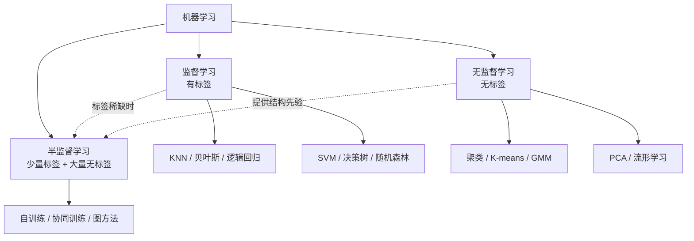
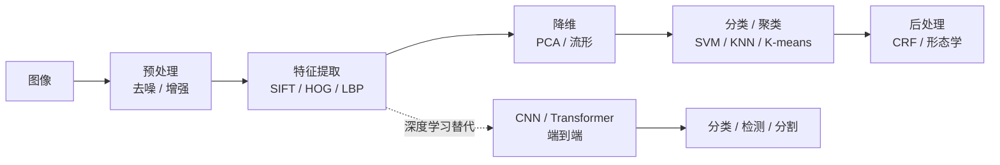
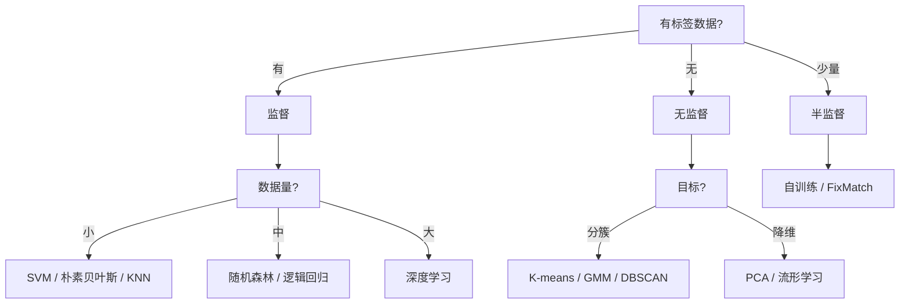

# 十大机器学习算法详解：原理、逐变量解析、变体谱系、多领域应用与深度学习联系

> 本文是一份纯理论整理，不涉及任何代码改动。
> 目标是围绕"十大机器学习算法"这一经典提法，做到四件事：
>
> 1. **把每个算法的原理讲透**——每个公式都给出**逐项符号解释**（每个变量是什么、量纲、取值范围、物理含义）；
> 2. **厘清"十大"的版本差异**——不同教材/榜单给出的名单并不一致，本文列出主流版本并补齐差异项；
> 3. **把每个算法的变体讲全**——每个算法都给出**算法族总览表**与**各类变体的公式**，
>    说明“同一个思想在不同约束下派生出哪些方法”（如 SVM → L2-SVC / ν-SVC / LS-SVM / SVR / One-Class；
>    K-means → K-means++ / K-medoids / Mini-batch；EM → GEM / ECM / ECME / 变分 EM / MCEM）；
> 4. **落到应用**——给出每个算法在图像处理/计算机视觉中的具体用法，并**扩展其应用方向**，
>    同时说明它与后续**深度学习**部分的联系。
>
> 与仓库中 `feature-descriptors-notes.md`、`cnn-transformer-notes.md` 一脉相承：
> 前者讲"手工描述子"，后者讲"深度表示学习"，本文正好补上中间那一层——
> **经典机器学习**，即"浅层学习"这一代。

---

## 目录

1. 总览：什么是"十大机器学习算法"
2. "十大"的版本差异与本文取舍
3. 监督学习（Supervised Learning）
   - 3.1 最近邻（KNN）
   - 3.2 贝叶斯分类（朴素贝叶斯）
   - 3.3 逻辑回归
   - 3.4 支持向量机（SVM）
   - 3.5 决策树与森林（随机森林）
4. 无监督学习（Unsupervised Learning）
   - 4.1 聚类
   - 4.2 K-means 与高斯混合模型
   - 4.3 主成分分析（PCA）
   - 4.4 流形学习
   - 4.5 半监督学习
5. 其他版本中的扩展算法（ICDM 2008 版差异项）
   - 5.1 C4.5
   - 5.2 CART
   - 5.3 PageRank
   - 5.4 神经网络 / 深度学习
   - 5.5 AdaBoost
   - 5.6 EM 算法
   - 5.7 Apriori
6. 应用总览
7. 与深度学习的联系（重点）
8. 速查表
9. 结论

---

## 1. 总览：什么是"十大机器学习算法"

### 1.1 提法的来源

"十大机器学习算法"（Top 10 Algorithms in Data Mining / Machine Learning）并不是一个
有严格定义的官方名单，而是源于若干**综述性文章与教材**的归纳。最常被引用的是：

- **Wu et al., 2008, *Top 10 algorithms in data mining***（发表于 *Knowledge and Information Systems*），
  由 IEEE ICDM 组织投票产生，名单为：C4.5、K-Means、SVM、Apriori、EM、
  PageRank、AdaBoost、kNN、Naive Bayes、CART。
- 各类**入门教材与在线课程**（如 Python 数据科学、机器学习入门）给出的"十大"，
  则更偏向**可上手、覆盖监督+无监督**的实用清单，即用户给出的这一版：
  KNN、朴素贝叶斯、逻辑回归、SVM、决策树/森林、聚类、K-means/GMM、PCA、流形学习、半监督学习。

两者**视角不同**：前者是"数据挖掘领域最具影响力的算法"，后者是"机器学习入门必学的算法"。

### 1.2 三大范式

所有算法都可以归入三大学习范式：

| 范式 | 数据 | 目标 | 代表 |
|---|---|---|---|
| 监督学习 | 有标签 $(x_i, y_i)$ | 学 $x \to y$ 的映射 | KNN、贝叶斯、逻辑回归、SVM、决策树 |
| 无监督学习 | 无标签 $x_i$ | 发现结构（簇、子空间、流形） | 聚类、K-means、GMM、PCA、流形学习 |
| 半监督学习 | 少量标签 + 大量无标签 | 用无标签数据辅助监督任务 | 自训练、协同训练、图半监督 |

**范式关系示意**：

### 1.3 统一视角：都是"目标函数 + 优化"

尽管形式各异，几乎所有算法都可以写成同一个模板：

$$
\hat{\theta} = \arg\min_{\theta} \; \underbrace{\frac{1}{N}\sum_{i=1}^{N} L\big(y_i, f_\theta(x_i)\big)}_{\text{经验风险（拟合数据）}} \;+\; \underbrace{\lambda\, \Omega(\theta)}_{\text{正则化（控制复杂度）}}
$$

其中：

- $\theta$：模型参数（要学的东西）。
- $N$：样本数量。
- $x_i$：第 $i$ 个样本的**特征向量**（图像里常是描述子、像素块、颜色直方图等）。
- $y_i$：第 $i$ 个样本的**标签**（分类标签或回归值）。
- $f_\theta$：由参数 $\theta$ 决定的**预测函数**。
- $L(\cdot,\cdot)$：**损失函数**，衡量预测与真值的差距（如平方损失、交叉熵、Hinge 损失）。
- $\Omega(\theta)$：**正则项**，惩罚模型复杂度（如 L2、L1、树深度）。
- $\lambda$：**正则化系数**，权衡"拟合数据"与"保持简单"。
- $\hat{\theta}$：使总目标最小的最优参数。

**含义**：不同算法的差别，本质上就是 $L$、$\Omega$、$f_\theta$ 三者的不同选择。
例如 SVM 用 Hinge 损失 + L2 正则，逻辑回归用交叉熵 + L2 正则，
决策树用不纯度下降作为"隐式损失"。

---

## 2. "十大"的版本差异与本文取舍

### 2.1 主流版本对照

| 算法 | 用户给出的版本 | ICDM 2008 版 | 常见入门教材版 | 本文是否详解 |
|---|---|---|---|---|
| KNN | ✅ | ✅ | ✅ | ✅ 3.1 |
| 朴素贝叶斯 | ✅ | ✅ | ✅ | ✅ 3.2 |
| 逻辑回归 | ✅ | ❌ | ✅ | ✅ 3.3 |
| SVM | ✅ | ✅ | ✅ | ✅ 3.4 |
| 决策树 / 森林 | ✅ | ✅（C4.5、CART） | ✅ | ✅ 3.5 |
| 聚类 | ✅ | ✅（K-Means） | ✅ | ✅ 4.1 |
| K-means / GMM | ✅ | ✅（K-Means） | ✅ | ✅ 4.2 |
| PCA | ✅ | ❌ | ✅ | ✅ 4.3 |
| 流形学习 | ✅ | ❌ | ⚠️ 部分 | ✅ 4.4 |
| 半监督学习 | ✅ | ❌ | ⚠️ 部分 | ✅ 4.5 |
| C4.5 | ❌ | ✅ | ✅ | ✅ 5.1 |
| CART | ❌ | ✅ | ✅ | ✅ 5.2 |
| PageRank | ❌ | ✅ | ❌ | ✅ 5.3 |
| 神经网络 / 深度学习 | ❌ | ❌ | ✅ | ✅ 5.4 |
| AdaBoost | ❌ | ✅ | ✅ | ✅ 5.5 |
| EM | ❌ | ✅ | ⚠️ 部分 | ✅ 5.6 |
| Apriori | ❌ | ✅ | ⚠️ 部分 | ✅ 5.7 |

> **说明**：用户给出的版本是"入门实用版"，ICDM 2008 是"数据挖掘影响力版"。
> 两者交集是 KNN、朴素贝叶斯、SVM、决策树、K-means；
> 差异项（逻辑回归、PCA、流形学习、半监督 vs AdaBoost、EM、Apriori、PageRank）
> 本文全部补齐，做到"两版通吃"。

### 2.2 为什么会有差异

- **ICDM 版**偏重"数据挖掘"：强调关联规则（Apriori）、图排序（PageRank）、
  概率推断（EM），这些在数据库/推荐系统里更重要。
- **入门版**偏重"机器学习基础"：强调降维（PCA）、流形（t-SNE/LLE）、
  半监督，这些在**图像与高维数据**里更常用。
- **图像领域**的特殊性：图像是高维、强相关、带空间结构的数据，
  因此 PCA、流形学习、K-means（用于视觉词袋）在图像里地位极高，
  而 Apriori、PageRank 在图像里较少直接使用。

---

## 3. 监督学习（Supervised Learning）

### 3.1 最近邻（Nearest Neighbors / KNN）

#### 3.1.1 核心思想

KNN 是最"懒惰"的算法：**不训练、不建模型，把全部训练样本存起来，
预测时找最近的 $k$ 个邻居投票**。它属于**非参数方法**（模型复杂度随数据增长）。

#### 3.1.2 距离度量

最常用的是**欧氏距离**：

$$
d(x, x') = \sqrt{\sum_{j=1}^{D} (x_j - x'_j)^2}
$$

其中：

- $x, x'$：两个样本的特征向量（各 $D$ 维）。
- $D$：特征维度（图像里可能是描述子维度，如 SIFT 的 128）。
- $x_j$：向量 $x$ 的第 $j$ 个分量。
- $x'_j$：向量 $x'$ 的第 $j$ 个分量。
- $(x_j - x'_j)$：第 $j$ 维上的差。
- 平方后求和再开方：即"直线距离"（L2 范数）。
- $d(x,x')$：两样本的**不相似度**，越小越相似。

其他常用度量：

| 度量 | 公式 | 适用 |
|---|---|---|
| 曼哈顿距离 | $\sum_j \lvert x_j - x'_j \rvert$ | 稀疏、鲁棒 |
| 余弦距离 | $1 - \frac{x \cdot x'}{\lVert x \rVert \lVert x' \rVert}$ | 方向敏感（文本、描述子） |
| 汉明距离 | $\sum_j [x_j \neq x'_j]$ | 二进制描述子（BRIEF/ORB） |
| 马氏距离 | $\sqrt{(x-x')^\top \Sigma^{-1} (x-x')}$ | 各维尺度/相关性不同 |

其中 $\Sigma$ 是特征的**协方差矩阵**，$\Sigma^{-1}$ 是它的逆，用于"白化"各维尺度。

#### 3.1.3 分类决策规则

**多数投票**：

$$
\hat{y} = \arg\max_{c \in \mathcal{C}} \sum_{i \in \mathcal{N}_k(x)} \mathbb{1}[y_i = c]
$$

其中：

- $x$：待预测样本。
- $\mathcal{N}_k(x)$：$x$ 的 $k$ 个最近邻的**下标集合**。
- $k$：邻居个数（超参数）。
- $\mathcal{C}$：类别集合。
- $y_i$：第 $i$ 个训练样本的真实标签。
- $\mathbb{1}[\cdot]$：**指示函数**，条件成立取 1，否则取 0。
- $\sum_{i \in \mathcal{N}_k(x)} \mathbb{1}[y_i = c]$：邻居中属于类别 $c$ 的**个数**。
- $\arg\max_c$：取票数最多的类别。
- $\hat{y}$：预测标签。

**距离加权投票**（更常用，近的邻居权重大）：

$$
\hat{y} = \arg\max_{c} \sum_{i \in \mathcal{N}_k(x)} w_i \,\mathbb{1}[y_i = c], \qquad w_i = \frac{1}{d(x, x_i) + \epsilon}
$$

其中：

- $w_i$：第 $i$ 个邻居的**权重**。
- $d(x, x_i)$：待测样本与第 $i$ 个邻居的距离。
- $\epsilon$：极小正数，防止除零。
- 含义：距离越小，$w_i$ 越大，投票越有分量。

**回归**时则取邻居标签的（加权）平均：

$$
\hat{y} = \frac{\sum_{i \in \mathcal{N}_k(x)} w_i\, y_i}{\sum_{i \in \mathcal{N}_k(x)} w_i}
$$

#### 3.1.4 算法步骤

#### 3.1.5 关键问题

- **$k$ 的选择**：$k$ 太小 → 对噪声敏感（过拟合）；$k$ 太大 → 决策边界过于平滑（欠拟合）。
  常用交叉验证选 $k$，经验值 $k \approx \sqrt{N}$。
- **维度灾难**：高维空间中所有点距离趋于相等，KNN 失效。
  解决：先降维（PCA）或特征选择。
- **计算复杂度**：预测时 $O(ND)$，大数据需 KD-Tree、Ball-Tree、LSH 加速。

#### 3.1.6 KNN 变体总览

以上是"欧氏距离 + k 近邻 + 多数投票"的标准形式。KNN 的改动点集中在三处：
**用什么距离、取哪些邻居、怎么投票**。下表先给出全局印象：

| 变体 | 改动点 | 解决的问题 |
|---|---|---|
| 距离加权 KNN（WKNN） | 票权正比于 $1/d$ | 近邻应更有分量 |
| 核加权 KNN | 票权为核函数 $K(d)$ | 平滑、可调尺度 |
| 半径近邻（R-NN） | 固定半径而非固定 $k$ | 密度不均的数据 |
| 模糊 KNN（FKNN） | 隶属度而非硬投票 | 边界样本、软标签 |
| 证据 KNN（EKNN） | DS 证据理论融合 | 不确定性与冲突建模 |
| 加权/优化 KNN | 学最优权重 | 特征重要性差异 |
| **LMNN** | 学马氏度量 $M$ | 欧氏距离不合适 |
| **NCA** | 学线性变换 $A$ | 直接优化留一精度 |
| 压缩近邻（CNN/RNN） | 约简训练集 | 存储与预测速度 |
| 近似近邻（ANN） | KD-Tree/LSH/HNSW | 海量数据检索 |
| 反 kNN | 反向邻居计数 | 异常 / 离群检测 |
| 局部加权回归 | 局部线性拟合 | 非参数回归 |
| Parzen 窗 | 核密度估计 | 概率密度 / 生成式分类 |

其中前五个只改**投票规则**，LMNN/NCA 改**距离本身**，
后四个改**邻居集合或任务形式**。

#### 3.1.7 投票与邻域变体

**（1）距离加权 KNN（WKNN）**

$$
\hat{y} = \arg\max_{c} \sum_{i \in \mathcal{N}_k(x)} w_i \,\mathbb{1}[y_i = c],
\qquad w_i = \frac{1}{d(x, x_i)^p}
$$

其中：

- $p \ge 1$：**权重衰减指数**，$p=1$ 为反比权重，$p=2$ 衰减更快（近邻占绝对主导）。
- $d \to 0$ 时 $w \to \infty$：实际中加 $\epsilon$ 或改用核形式避免病态。

**（2）核加权 KNN（即 Parzen 窗分类器）**

$$
\hat{y} = \arg\max_{c} \sum_{i: y_i = c} K\!\left(\frac{x - x_i}{h}\right),
\qquad \hat{p}(x) = \frac{1}{Nh^D}\sum_{i=1}^{N} K\!\left(\frac{x - x_i}{h}\right)
$$

其中：

- $K(\cdot)$：**核函数**（高斯、Epanechnikov、均匀核），满足 $K \ge 0$、$\int K = 1$。
- $h > 0$：**带宽**，控制平滑程度；$h$ 小→尖峰（过拟合），$h$ 大→过度平滑（欠拟合）。
- $D$：维度；$Nh^D$ 是归一化因子。
- 含义：KNN 的"硬窗口"换成"软核"后，就得到**非参数密度估计**（Parzen 窗），
  它与 KNN 是同一个对象：**固定 $k$ 是"自适应带宽"，固定 $h$ 是"固定带宽"**。

**（3）半径近邻（Radius NN / R-NN）**

邻居集合改为固定半径内的全部样本：

$$
\mathcal{N}_r(x) = \{\, i : d(x, x_i) \le r \,\}
$$

其中：

- $r$：**邻域半径**（超参数），与 $k$ 互斥使用。
- 优点：在**密度极不均匀**的数据里，高密度区不会取到远处的异类点。
- 缺点：稀疏区可能**邻居为空**（需设置最小邻居数或回退到 $k$NN）。

**（4）模糊 KNN（FKNN）**

给每个类别一个**隶属度**而非 0/1 投票：

$$
u_c(x) = \frac{\sum_{i} \mathbb{1}[y_i = c] \; d(x, x_i)^{-\frac{2}{m-1}}}{\sum_{i} d(x, x_i)^{-\frac{2}{m-1}}}
$$

其中：

- $m > 1$：**模糊化指数**，$m \to 1$ 退化为最近邻（硬），$m \to \infty$ 退化为等权平均。
- $u_c(x) \in [0,1]$：样本属于类 $c$ 的隶属度，$\sum_c u_c = 1$。
- 含义：输出软标签，适合**多标签 / 样本标注不确定**的场景。

**（5）证据 KNN（EKNN）**

用 Dempster-Shafer 证据理论组合各邻居的"类别证据"：

$$
m_c = \frac{1}{\sum_{\text{正常}} m} \sum_{i \in \mathcal{N}_k(x)} \alpha_i \, m_{i,c},
\qquad \alpha_i = \alpha_0 \exp\big(-\gamma\, d(x,x_i)^2\big)
$$

其中：

- $m_{i,c}$：第 $i$ 个邻居对类 $c$ 的**基本概率指派（BPA）**。
- $\alpha_i$：邻居的**可信度权重**，随距离指数衰减。
- $\alpha_0$：基础可信度；$\gamma$：衰减率。
- 含义：能显式表达"**不知道**"（把概率指派给全集），处理**冲突证据**比硬投票稳健。

#### 3.1.8 度量学习变体（LMNN 与 NCA）

**动机**：欧氏距离隐含"各维等权、互不相关"的假设。若特征尺度差异大或存在相关性，
应学一个**马氏距离**：

$$
d_M(x, x') = \sqrt{(x - x')^\top M\, (x - x')}, \qquad M \succeq 0
$$

其中：

- $M \in \mathbb{R}^{D\times D}$：**半正定矩阵**（$M \succeq 0$ 保证距离非负且满足三角不等式）。
- $M = I$：退化为欧氏距离；$M = A^\top A$：等价于先线性变换 $Ax$ 再算欧氏距离。
- 含义：**学距离 = 学一个能突出问题结构的坐标变换**。

**（1）LMNN（Large Margin Nearest Neighbor，Weinberger & Saul，2009）**

把"每个样本的 $k$ 个同类近邻"称为**目标邻居**，要求它们拉近；
不同类样本推远到间隔之外：

$$
\varepsilon_{\text{pull}}(M) = \sum_{i} \sum_{j \in \mathcal{N}_i^{\text{tgt}}} d_M(x_i, x_j)^2
$$

$$
\varepsilon_{\text{push}}(M) = \sum_{i} \sum_{j \in \mathcal{N}_i^{\text{tgt}}} \sum_{l} (1 - y_{il}) \Big[ 1 + d_M^2(x_i,x_j) - d_M^2(x_i,x_l) \Big]_+
$$

$$
\min_{M \succeq 0} \; (1 - \mu)\,\varepsilon_{\text{pull}}(M) + \mu\,\varepsilon_{\text{push}}(M)
$$

其中：

- $\mathcal{N}_i^{\text{tgt}}$：样本 $i$ 的 $k$ 个**同类**目标邻居。
- $y_{il} = 1$ 表示 $i$ 与 $l$ 同类，$y_{il}=0$ 表示异类。
- $[\cdot]_+ = \max(0,\cdot)$：**合页函数**，只有"异类比目标邻居更近（差不足 1）"时才产生惩罚。
- $\mu \in [0,1]$：拉近与推远的**权衡系数**，通常取 0.5。
- 含义：把 SVM 的**大间隔思想**搬到度量学习上——不是学分类面，而是学"让 kNN 好用的距离"。
- 求解：转化为**半正定规划（SDP）**，用子梯度 / 块坐标下降。

**（2）NCA（Neighborhood Components Analysis，Goldberger 等，2004）**

不显式设间隔，而是**直接最大化留一法分类正确率**。先用软化的邻居概率：

$$
p_{ij} = \frac{\exp\big(-\lVert A x_i - A x_j \rVert^2\big)}{\sum_{k \neq i} \exp\big(-\lVert A x_i - A x_k \rVert^2\big)}
$$

其中：

- $A \in \mathbb{R}^{d\times D}$：**线性变换矩阵**（要学的参数，$A^\top A = M$）。
- $p_{ij}$：在随机"最近邻"规则下，$j$ 被选为 $i$ 的邻居的**概率**。
- $p_{ii} = 0$：不把自己当邻居。

样本 $i$ 被正确分类的概率是其同类邻居概率之和：

$$
p_i = \sum_{j : y_j = y_i} p_{ij},
\qquad
\max_{A} \; f(A) = \sum_{i=1}^{N} p_i
$$

其中 $f(A)$ 就是**期望留一准确率**。它可按梯度上升优化：

$$
\frac{\partial f}{\partial A} = 2A \sum_{i} \Big( p_i \sum_{k} p_{ik}\tilde{x}_{ik}\tilde{x}_{ik}^\top - \sum_{j: y_j=y_i} p_{ij}\tilde{x}_{ij}\tilde{x}_{ij}^\top \Big),
\qquad \tilde{x}_{ij} = x_i - x_j
$$

其中：

- $\tilde{x}_{ij}$：样本对的**差分向量**。
- 含义：第一项"拉近所有邻居"，第二项"推远同类邻居"，两项之差即梯度方向。
- 与 LMNN 对比：NCA **无间隔、无约束**，更简单但容易过拟合；LMNN 有显式间隔、凸性更好。

#### 3.1.9 近似最近邻与加速结构

精确 kNN 的查询复杂度随维度指数上升，大规模场景必须用**近似最近邻（ANN）**：

| 结构 | 划分方式 | 查询复杂度 | 特点 |
|---|---|---|---|
| 穷举（Brute） | 无 | $O(ND)$ | 精确，小数据 |
| KD-Tree | 轴对齐、按中位数切分 | 平均 $O(\log N)$ | 低维（$D \lesssim 20$） |
| Ball-Tree | 超球划分 | 类似 KD-Tree | 高维略优，度量可换 |
| LSH | 随机哈希 | $O(1)$ 近似 | 理论保证，需调参 |
| HNSW | 分层可导航小世界图 | 近似 $O(\log N)$ | 当前**工业首选** |
| IVF-PQ | 倒排 + 乘积量化 | 压缩 + 快查 | 十亿级向量 |
| Annoy / ScaNN | 随机投影树 / 各向异性量化 | 近似 $O(\log N)$ | 工程落地成熟 |

**LSH 的核心保证**：对一族哈希函数 $h$，若

$$
P\big(h(x) = h(x')\big) = \text{sim}(x, x')
$$

即"**越相似的向量碰撞概率越高**"，则用 $L$ 个哈希表、每表 $m$ 位，
相似度高的点会以高概率落入同一桶，只需在同桶内做精确比较。

**IVF-PQ 的两步**：

1. **IVF（倒排）**：用 K-means 把向量空间分成若干**倒排列表**（粗聚类），查询只看最近的几个簇；
2. **PQ（乘积量化）**：把 $D$ 维向量切成 $m$ 段，每段各用一个小码书（K-means）量化，
   距离用**查表求和**近似：

$$
d(x, y)^2 \approx \sum_{s=1}^{m} \lVert q_s(x) - q_s(y) \rVert^2,
\qquad \lVert y - x \rVert \approx \text{查表}
$$

其中：

- $q_s(\cdot)$：第 $s$ 段的**量化器**（码书中心）。
- $m$：段数；每段码书大小通常 256（1 字节），故存储量降至原向量的 $m/D$。
- 含义：**用一点点精度换巨大的速度与内存收益**，是 RAG 向量库的底层机制。

#### 3.1.10 邻居约简与非标准用法

**（1）压缩近邻（CNN rule，Condensed Nearest Neighbor）**

迭代筛选：先用第一个样本初始化集合，再逐个测试；**凡是当前集合能正确分类的样本就丢弃**，
否则加入：

$$
S \leftarrow S \cup \{x_i\} \iff \text{NN}_S(x_i) \neq y_i
$$

其中 $S$ 是约简后的训练集。含义：只保留"**必要**"的样本，
典型可压到原来的 10%~30% 而不降低精度。

**（2）约简近邻（RNN rule，Reduced NN）**

先用 CNN 约简，再删除**不改变决策边界的内部点**，只留下靠近边界（互为近邻）的样本。
另外还有 IB2 / IB3（实例基于学习），在噪声数据上更稳健。

**（3）反 kNN（Reverse kNN）**

定义"**以 $x$ 为最近邻的样本集合**"：

$$
k\text{NN}^R(x) = \{\, x' : x \in \mathcal{N}_k(x') \,\}
$$

其中：

- $|k\text{NN}^R(x)|$ 越大，$x$ 影响的样本越多，越可能是"**中心/正常**"点；
- 反之，反 kNN 数量少（或为空）的点是**离群 / 异常**点。
- 常见异常分数：$\text{INFLO}(x) = \frac{1}{|k\text{NN}^R(x)|}\sum_{x' \in k\text{NN}^R(x)} \frac{1}{d(x,x')}$。

**（4）局部加权回归（LOESS / LOWESS）**

在待测点附近用**局部加权最小二乘**拟合一个低阶多项式：

$$
\min_{\beta} \sum_{i=1}^{N} w_i(x) \big( y_i - \beta_0 - \beta_1^\top (x_i - x) \big)^2,
\qquad w_i(x) = K\!\left(\frac{d(x,x_i)}{h}\right)
$$

其中：

- $\beta_0, \beta_1$：局部截距与斜率（只在该点邻域内有效）。
- $w_i(x)$：**随查询点变化**的权重（这是它区别于普通回归的关键）。
- 含义：KNN 的"投票/平均"升级为"**局部线性拟合**"，消除边界处的系统性偏差。

---

#### 3.1.11 应用方向

**（1）图像 / 视觉**

- **图像分类基线**：把图像表示为特征向量（颜色直方图、HOG、CNN 特征），用 KNN 分类。
- **图像检索**：以图搜图，找特征空间最近邻。
- **特征匹配**：SIFT 描述子的最近邻匹配（Lowe 的 ratio test 就是"最近邻 / 次近邻"比值）。
- **超像素 / 像素分类**：对每个像素的特征做 KNN 分类（如遥感图像分割）。
- **视频 / 点云**：视频帧检索、点云配准中的最近邻匹配。

**（2）文本与自然语言**

- **文本分类**：TF-IDF / 词向量 + 余弦距离的 KNN 分类（垃圾邮件、新闻主题）。
- **语义检索 / 问答**：句向量最近邻检索——大模型 RAG 中的向量库召回，本质就是近似 kNN（ANN）。
- **相似词 / 拼写纠错**：在词向量空间找近邻词。

**（3）推荐与检索系统**

- **协同过滤**：用户/物品向量最近邻做"相似用户 / 相似物品"推荐。
- **多模态召回**：电商"以图搜商品 / 以文搜商品"。
- **近重复检测**：文档、商品、网页去重。

**（4）生物、医学与化学**

- **基因表达分类**：样本在表达谱空间中的近邻分类（肿瘤分型）。
- **蛋白质功能预测**：序列 / 结构特征的近邻投票。
- **药物虚拟筛选**：分子指纹的最近邻检索。

**（5）金融、工业与地理**

- **异常检测**：到第 $k$ 近邻的距离作为异常分数（kNN 密度估计）。
- **信用 / 欺诈比对**：与历史案例的相似度比对。
- **地理信息**：POI 推荐、空间最近邻查询（KD-Tree / R-tree 加速）。
- **时序检索**：DTW 距离下的最近邻序列匹配。

**（6）作为通用工具**

- **缺失值填补**：用最近邻样本的值填补（KNN Imputer）。
- **近似加速**：用 kNN 近似复杂模型的输出（缓存、蒸馏）。

#### 3.1.12 与深度学习的联系

- **度量学习（Metric Learning）**：深度网络学一个嵌入空间，使同类近、异类远，
  再用 KNN 分类——即 **孪生网络 / Triplet Loss / 对比学习**。
- **原型网络（Prototypical Networks）**：few-shot 学习中，用类中心做"最近邻"。
- **KNN 是"无参数"的极端**，深度网络是"全参数"的极端，二者在表示学习上互补。
- **DDM / 对比学习的"软 kNN"**：SwAV、SupCon 的预训练目标本质上就是让 kNN 分类器好用。
- **LMNN / NCA 的深度版**：把线性变换 $A$ 换成神经网络，即深度度量学习。
- **ANN 检索是 RAG 的底层**：HNSW / IVF-PQ 把 kNN 变成大模型记忆的取数通道。

---

### 3.2 贝叶斯分类（Bayesian Classification）

#### 3.2.1 贝叶斯定理

$$
P(c \mid x) = \frac{P(x \mid c)\, P(c)}{P(x)}
$$

其中：

- $c$：类别（如"猫"）。
- $x$：样本特征向量。
- $P(c \mid x)$：**后验概率**——看到特征 $x$ 后，样本属于 $c$ 的概率（我们想要的）。
- $P(x \mid c)$：**似然**——类别 $c$ 产生特征 $x$ 的概率（从数据估计）。
- $P(c)$：**先验概率**——不看特征时，类别 $c$ 出现的概率（类别频率）。
- $P(x)$：**证据**——特征 $x$ 出现的概率，对所有类别相同，分类时可忽略。
- 含义：后验 ∝ 似然 × 先验。

**分类决策**（最大后验 MAP）：

$$
\hat{y} = \arg\max_{c} P(c \mid x) = \arg\max_{c} P(x \mid c)\, P(c)
$$

其中 $\hat{y}$ 是预测类别；因为 $P(x)$ 与 $c$ 无关，可省略。

#### 3.2.2 朴素贝叶斯：条件独立假设

直接估计 $P(x \mid c)$ 需要 $D$ 维联合分布，参数爆炸。
**朴素贝叶斯**假设各维**条件独立**：

$$
P(x \mid c) = \prod_{j=1}^{D} P(x_j \mid c)
$$

其中：

- $D$：特征维度。
- $x_j$：特征向量的第 $j$ 维。
- $P(x_j \mid c)$：在类别 $c$ 下，第 $j$ 维取值的概率（一维分布，易估计）。
- $\prod$：连乘，把 $D$ 维联合概率拆成 $D$ 个一维概率之积。
- 含义：假设"给定类别后，各特征互不影响"——这个假设通常不成立，但效果出奇地好。

**最终判别式**：

$$
\hat{y} = \arg\max_{c} \; P(c) \prod_{j=1}^{D} P(x_j \mid c)
$$

#### 3.2.3 三种常见变体

| 变体 | 假设 $P(x_j \mid c)$ | 适用特征 |
|---|---|---|
| 高斯朴素贝叶斯 | $\mathcal{N}(\mu_{jc}, \sigma_{jc}^2)$ | 连续特征（图像像素、描述子） |
| 多项式朴素贝叶斯 | 多项分布 | 计数特征（词频、直方图） |
| 伯努利朴素贝叶斯 | 伯努利分布 | 二值特征（二值描述子） |

**高斯形式**：

$$
P(x_j \mid c) = \frac{1}{\sqrt{2\pi\sigma_{jc}^2}} \exp\!\left(-\frac{(x_j - \mu_{jc})^2}{2\sigma_{jc}^2}\right)
$$

其中：

- $\mu_{jc}$：类别 $c$ 下第 $j$ 维的**均值**。
- $\sigma_{jc}^2$：类别 $c$ 下第 $j$ 维的**方差**。
- $\sigma_{jc}$：标准差。
- $x_j$：待测样本第 $j$ 维取值。
- 含义：假设该维在类内服从正态分布，用均值和方差刻画。

#### 3.2.4 数值稳定：对数化

连乘易下溢，取对数变连加：

$$
\hat{y} = \arg\max_{c} \left[ \log P(c) + \sum_{j=1}^{D} \log P(x_j \mid c) \right]
$$

其中 $\log$ 单调递增，不改变 $\arg\max$ 结果，但把乘积变求和，避免浮点下溢。

#### 3.2.5 贝叶斯分类器变体总览

朴素贝叶斯的"朴素"之处在于**条件独立假设**。所有变体都在做同一件事：
**在"独立假设太强"与"联合分布参数太多"之间做权衡**。

| 变体 | 对独立假设的处理 | 参数规模 | 解决的问题 |
|---|---|---|---|
| 朴素贝叶斯（NB） | 完全独立 | $O(DC)$ | 基线，速度快 |
| 半朴素贝叶斯 SPODE / AODE | 每个特征依赖 $1$ 个父特征 | $O(D^2C)$ | 缓解独立性假设 |
| 半朴素贝叶斯 TAN | 依赖结构是一棵树 | $O(D^2C)$ | 兼顾精度与复杂度 |
| 半朴素贝叶斯 KDB | 每个特征依赖 $k$ 个父特征 | $O(D^{k+1}C)$ | 可调依赖强度 |
| 贝叶斯网络（BN） | 学完整有向无环图 | 取决于图 | 通用联合建模 |
| 补集朴素贝叶斯（CNB） | 仍独立，改估计量 | $O(DC)$ | 类不平衡文本 |
| 加权朴素贝叶斯 | 仍独立，加特征权重 | $O(DC)$ | 特征重要性不同 |
| 隐马尔可夫模型（HMM） | 时序上的贝叶斯网络 | $O(N_c^2 + N_cD)$ | 序列建模 |
| 贝叶斯逻辑回归 | 改为判别式 + 权重先验 | $O(D)$ | 不确定性估计 |

#### 3.2.6 半朴素贝叶斯（Semi-naive Bayes）

核心想法：**不要求完全独立，也不学完整联合分布**，
只允许每个特征依赖**少量**其他特征，在 $\text{BIC}$ 与精度间取平衡。

**（1）SPODE（Super-Parent One-Dependence Estimator）**

选定一个特征 $x_j$ 作为**超父**，所有其他特征都条件依赖于它：

$$
P(c, x) = P(c, x_j) \prod_{i \neq j} P(x_i \mid c, x_j)
$$

其中：

- $x_j$：**超父属性**（super-parent）。
- $P(c, x_j)$：类与超父的**二维联合分布**（直接计数，无需独立假设）。
- $P(x_i \mid c, x_j)$：其余特征在给定"类 + 超父"下的条件概率。
- 含义：只把三元关系降为"三个变量"的规模，参数从 $O(DC)$ 升到 $O(D^2C)$，但比完整贝叶斯网络小得多。

**（2）AODE（Averaged One-Dependence Estimators，Webb 等，2005）**

不选单一超父，而是**把所有特征都当超父，再平均**：

$$
P(c \mid x) \propto \sum_{j=1}^{\tilde{D}} P(c, x_j) \prod_{i \neq j} P(x_i \mid c, x_j)
$$

其中：

- $\tilde{D}$：**满足最小样本数阈值**的超父个数（避免小样本估计不稳）。
- 求和后的结果需要**归一化**：$P(c|x) = \text{上式} / \sum_{c'} \text{上式}_{c'}$。
- 含义：AODE 几乎不需要调参，在大量数据集上**精度可与 TAN 匹敌甚至更好**，
  且因"平均"效果而**对超父选择不敏感**。

**（3）TAN（Tree-Augmented Naïve Bayes，Friedman 等，1997）**

允许特征之间的依赖构成一棵**树**（每个特征最多一个父节点），
由**条件互信息**确定树的连接：

$$
I(X_j ; X_k \mid C) = \sum_{x_j, x_k, c} P(x_j, x_k, c) \log \frac{P(x_j, x_k \mid c)}{P(x_j \mid c)\, P(x_k \mid c)}
$$

其中：

- $I(X_j;X_k \mid C)$：在**已知类别**条件下的**条件互信息**，度量两个特征的相关程度。
- 做法：以 $I$ 为边权，用**最大生成树**（Maximum Spanning Tree）算法求出主干树。
- 最终模型：

$$
P(c, x) = P(c) \prod_{j=1}^{D} P\big(x_j \mid c,\, \pi_j\big)
$$

  其中 $\pi_j$ 是 $x_j$ 在树上的**父节点**（唯一，可为空）。
- 含义：TAN 是**在 NB 与完整 BN 之间的最优折中**；
  当树退化为星形（都依赖类别节点）时，TAN 退化为 NB。

**（4）KDB（k-Dependence Bayesian Classifier，Sahami，1996）**

推广 TAN：允许每个特征依赖**最多 $k$ 个**父特征（TAN 是 $k=1$，NB 是 $k=0$）：

$$
P(c, x) = P(c) \prod_{j=1}^{D} P\big(x_j \mid c,\, \pi_j^{(k)}\big)
$$

其中 $\pi_j^{(k)}$ 是 $x_j$ 的 $k$ 个（按条件互信息排序的）最强父特征。
- $k$ 越大，模型越强但参数越多（$O(D^{k+1}C)$），且**高次条件概率的样本稀疏问题**更严重。

**（5）结构学习的一般贝叶斯网络（BN）**

不再限定"类为根"的结构：

$$
P(X_1, X_2, \dots, X_D) = \prod_{i=1}^{D} P\big(X_i \mid \text{Pa}(X_i)\big)
$$

其中：

- $\text{Pa}(X_i)$：$X_i$ 的**父节点集合**。
- 含义：有向无环图（DAG）把 $D$ 维联合分布**因式分解**为 $D$ 个局部条件分布，
  参数量由指数级降到**与图结构成正比**。
- 分类时用 $P(c \mid x) \propto P(c, x)$ 直接计算。
- 学习：结构学习（评分 + 搜索） + 参数学习（最大似然 / 贝叶斯估计）。

#### 3.2.7 其他变体：CNB、加权 NB、HMM 与贝叶斯逻辑回归

**（1）补集朴素贝叶斯（Complement NB，Rennie 等，2003）**

专为**类不平衡文本分类**设计。不是估计"类 $c$ 里词 $j$ 的频率"，
而是估计"**$c$ 的补集里**"的频率：

$$
\hat{\theta}_{cj} = \frac{N_{\bar{c}j} + \alpha_j}{\sum_{j'} N_{\bar{c}j'} + \alpha},
\qquad
\hat{c} = \arg\max_{c} \Big[ \log P(c) - \sum_{j} x_j \, \hat{\theta}_{cj} \Big]
$$

其中：

- $N_{\bar{c}j}$：**不属于类 $c$** 的样本中，特征 $j$ 的计数（互补计数）。
- $\alpha_j$：平滑参数；$\alpha = \sum_j \alpha_j$。
- $x_j$：待测样本的特征值（词频）。
- 含义：注意判决式是 **$-$** 号——补集里出现得越多的词，越支持"**不是**这个类"。
- 效果：在不平衡文本上往往比标准多项式 NB 好得多。

**（2）加权朴素贝叶斯（Weighted NB / Attribute-Weighted NB）**

给每个特征加一个**重要性指数**：

$$
\hat{y} = \arg\max_{c} \left[ \log P(c) + \sum_{j=1}^{D} w_j \log P(x_j \mid c) \right]
$$

其中：

- $w_j \in \mathbb{R}$：第 $j$ 个特征的**权重**（可以为负）。
- 三种典型选择：
  - **信息增益加权**：$w_j \propto I(X_j; C)$；
  - **卡方统计量加权**：$w_j \propto \chi^2(X_j, C)$；
  - **基于优化**：把 $w_j$ 当作参数，用梯度下降最小化分类损失（即 **WANBIA**）。
- 含义：NB 假设所有特征同等重要，加权后可**在保持 O(DC) 成本的同时大幅提精度**。
- 与逻辑回归的关系：$w_j$ 把乘法型 NB 推向**加法型判别式**——权重为 1 时就是标准 NB。

**（3）隐马尔可夫模型（HMM）**

把贝叶斯思想用到**序列**上，是动态贝叶斯网络最简单的形式：

$$
P(O, Q \mid \lambda) = \underbrace{\pi_{q_1} b_{q_1}(o_1)}_{\text{初始}} \prod_{t=2}^{T} \underbrace{a_{q_{t-1} q_t}}_{\text{转移}} \underbrace{b_{q_t}(o_t)}_{\text{发射}}
$$

其中：

- $O = (o_1,\dots,o_T)$：**观测序列**（语音帧、词、像素）。
- $Q = (q_1,\dots,q_T)$：**隐藏状态序列**（音素、词性、状态）。
- $\lambda = (\pi, A, B)$：模型参数，$\pi$ 初始分布、$A$ 转移矩阵、$B$ 发射分布。
- $a_{ij} = P(q_t = j \mid q_{t-1} = i)$；$b_j(o) = P(o \mid q_t = j)$。

**前向算法**（高效计算 $P(O|\lambda)$，避免枚举 $N_c^T$ 条路径）：

$$
\alpha_t(j) = \Big[ \sum_{i=1}^{N_c} \alpha_{t-1}(i)\, a_{ij} \Big] b_j(o_t),
\qquad P(O \mid \lambda) = \sum_{j} \alpha_T(j)
$$

其中 $\alpha_t(j)$ 是"到时刻 $t$ 观测为 $o_1..o_t$、且状态为 $j$"的**前向概率**；
$N_c$ 是隐状态个数。参数训练用 **Baum-Welch**（即 EM，见 5.6）。

**（4）贝叶斯逻辑回归**

把贝叶斯思想用到**判别式**模型上，对权重加先验：

$$
p(w \mid \mathcal{D}) \propto \underbrace{p(\mathcal{D} \mid w)}_{\text{似然}} \; \underbrace{\mathcal{N}(w \mid 0, \sigma^2 I)}_{\text{高斯先验}}
$$

预测时对权重积分（**贝叶斯模型平均**）：

$$
P(y=1 \mid x, \mathcal{D}) = \int \sigma(w^\top x)\, p(w \mid \mathcal{D})\, dw
$$

其中：

- 高斯先验等价于 **L2 正则**（$\sigma^2$ 越小正则越强）。
- 积分不可解析，需**拉普拉斯近似、变分推断或 MCMC**。
- 好处：除预测值外还能给出**预测不确定性**（$p(w|\mathcal{D})$ 的方差）。

#### 3.2.8 平滑与零概率问题

若某特征在某个类中从未出现，则 $P(x_j \mid c) = 0$，导致整个连乘积为 0——
这就是朴素贝叶斯的**零概率灾难**。解决方案是对计数做平滑：

| 方法 | 公式 | 说明 |
|---|---|---|
| 无平滑（MLE） | $\dfrac{N_{jc}}{N_c}$ | 零概率风险 |
| **拉普拉斯平滑** | $\dfrac{N_{jc} + 1}{N_c + K}$ | 加 1，最简单 |
| **Lidstone 平滑** | $\dfrac{N_{jc} + \lambda}{N_c + \lambda K}$ | $\lambda$ 可调 |
| **M 估计** | $\dfrac{N_{jc} + \alpha p_j}{N_c + \alpha}$ | 向先验 $p_j$ 收缩 |
| 贝叶斯估计 | $\dfrac{N_{jc} + \alpha_j}{N_c + \sum_j \alpha_j}$ | Dirichlet 先验后验均值 |

其中：

- $N_{jc}$：类 $c$ 下特征 $j$ 的**出现计数**。
- $N_c = \sum_j N_{jc}$：类 $c$ 的**总计数**。
- $K$：特征 $j$ 的**取值个数**。
- $\lambda, \alpha > 0$：平滑强度（先验等效样本数）。
- $p_j$：特征 $j$ 的**先验概率**（M 估计算法中向它收缩）。
- 含义：平滑本质是**加一个 Dirichlet 先验**，后验均值就是上表的形式；
  拉普拉斯平滑是 $\alpha_j = 1$ 的特例。

---

#### 3.2.9 应用方向

**（1）图像 / 视觉**

- **图像分类**：像素或描述子作为特征，高斯朴素贝叶斯做基线。
- **肤色检测**：在 YCbCr 空间对 Cb、Cr 建模高斯分布，判断像素是否肤色。
- **贝叶斯分割**：结合先验形状与似然做 MRF/CRF 分割（贝叶斯框架的推广）。
- **图像标注**：标签的条件概率建模。

**（2）文本与自然语言（最经典）**

- **垃圾邮件过滤**：词袋 + 多项式朴素贝叶斯，历史上最著名的应用。
- **新闻 / 主题分类**：词频特征的多类分类，训练快、小样本好。
- **情感分析**：评论、舆情的正负极性判别。
- **语言识别 / 拼写检查**：字符 n-gram 上的贝叶斯判别。

**（3）推荐与用户建模**

- **用户画像 / 兴趣预测**：对用户行为特征做贝叶斯判别。
- **冷启动分类**：新物品按类别特征归类。

**（4）医学与生物**

- **疾病诊断辅助**：症状 / 检验指标 → 疾病概率，是经典医疗专家系统的概率基础。
- **基因序列分类**：序列 k-mer 特征判别。
- **流行病风险评估**：风险因素的生成式概率建模。

**（5）工业与安全**

- **故障诊断**：传感器读数的工况判别。
- **入侵检测 / 日志分类**：网络流量与日志的快速分类。
- **舆情监控**：海量文本的快速极性判定。

**（6）模型定位**

- 朴素贝叶斯是**生成式模型**，与逻辑回归（判别式）形成对照：
  前者建模 $P(x\mid c)$，后者直接建模 $P(c\mid x)$。

#### 3.2.10 与深度学习的联系

- **贝叶斯深度学习**：对网络权重加先验，做后验推断（变分推断、MC Dropout），
  得到**不确定性估计**。
- **生成模型**：VAE 的 ELBO 就是贝叶斯推断的变分下界。
- **Softmax 分类器**可看作"判别式"版本，而朴素贝叶斯是"生成式"版本。
- **朴素贝叶斯的参数估计 = 一层线性变换**：取对数后 $\log P(c) + \sum_j \log P(x_j|c)$
  正是**线性分类器的形式**，权重由计数决定（无需梯度下降）。
- **半朴素贝叶斯与注意力**：TAN 学"特征依赖树"，与 Transformer 学"特征间注意力"
  目标一致，只是一个用互信息、一个用梯度。
- **HMM / BN 是现代序列模型的前身**：CRF 是 HMM 的判别式版本，
  RNN / Transformer 用神经网络替代了转移与发射概率。
- **贝叶斯深度学习**（BNN）与 MC Dropout 把"不确定性"带回深度网络，
  与贝叶斯逻辑回归一脉相承。

---

### 3.3 逻辑回归（Logistic Regression）

#### 3.3.1 从线性回归到概率

线性模型输出 $z = w^\top x + b$ 是实数，要变成概率需**Sigmoid**压缩：

$$
\sigma(z) = \frac{1}{1 + e^{-z}}
$$

其中：

- $z$：线性得分（logit）。
- $e$：自然常数。
- $\sigma(z) \in (0,1)$：把实数映射到概率区间。
- 性质：$\sigma(0)=0.5$，$z \to +\infty$ 时趋近 1，$z \to -\infty$ 时趋近 0。

**二分类概率**：

$$
P(y=1 \mid x) = \sigma(w^\top x + b) = \frac{1}{1 + e^{-(w^\top x + b)}}
$$

其中：

- $w \in \mathbb{R}^D$：**权重向量**，每个分量 $w_j$ 表示第 $j$ 维特征对"正类"的贡献。
- $b$：**偏置**，控制决策边界的位置。
- $w^\top x = \sum_j w_j x_j$：特征的加权和。
- $P(y=1\mid x)$：样本属于正类的概率。
- $P(y=0 \mid x) = 1 - P(y=1 \mid x)$。

#### 3.3.2 决策边界

令 $P(y=1\mid x) = 0.5$，即 $w^\top x + b = 0$：

$$
w^\top x + b = 0
$$

这是一个**超平面**，把特征空间一分为二。$w$ 是超平面的**法向量**（决定方向），
$b$ 决定**偏移**。逻辑回归是**线性分类器**。

#### 3.3.3 损失函数：交叉熵

从最大似然推导。单样本似然：

$$
P(y \mid x) = \hat{p}^{\,y} (1-\hat{p})^{\,1-y}, \qquad \hat{p} = \sigma(w^\top x + b)
$$

其中：

- $y \in \{0,1\}$：真实标签。
- $\hat{p}$：预测为正类的概率。
- 当 $y=1$ 时取 $\hat{p}$，当 $y=0$ 时取 $1-\hat{p}$。

取负对数得**交叉熵损失**：

$$
L(w, b) = -\frac{1}{N}\sum_{i=1}^{N} \Big[ y_i \log \hat{p}_i + (1-y_i)\log(1-\hat{p}_i) \Big]
$$

其中：

- $N$：样本数。
- $y_i$：第 $i$ 个样本标签。
- $\hat{p}_i = \sigma(w^\top x_i + b)$：第 $i$ 个样本的预测概率。
- 第一项 $y_i \log \hat{p}_i$：当 $y_i=1$ 时惩罚"预测概率低"。
- 第二项 $(1-y_i)\log(1-\hat{p}_i)$：当 $y_i=0$ 时惩罚"预测概率高"。
- 负号：把"最大化似然"变成"最小化损失"。

#### 3.3.4 梯度下降

对 $w$ 求梯度：

$$
\nabla_w L = \frac{1}{N}\sum_{i=1}^{N} (\hat{p}_i - y_i)\, x_i
$$

其中：

- $\hat{p}_i - y_i$：**预测误差**（残差）。
- $x_i$：第 $i$ 个样本特征。
- 含义：梯度 = 误差 × 特征的平均。误差越大，更新越猛。
- 更新：$w \leftarrow w - \eta \nabla_w L$，$\eta$ 是**学习率**。

**这个形式与线性回归的梯度完全一致**，区别只在 $\hat{p}$ 是 Sigmoid 输出。

#### 3.3.5 多分类：Softmax 回归

$$
P(y=c \mid x) = \frac{e^{w_c^\top x + b_c}}{\sum_{c'=1}^{C} e^{w_{c'}^\top x + b_{c'}}}
$$

其中：

- $C$：类别数。
- $w_c$：类别 $c$ 的权重向量。
- $b_c$：类别 $c$ 的偏置。
- 分母：所有类别的指数和，做**归一化**，使概率和为 1。
- 含义：把每个类别的得分转成概率分布。

#### 3.3.6 逻辑回归变体总览

逻辑回归的改动点集中在三处：**正则项、链接函数、输出结构**。

| 变体 | 改动点 | 解决的问题 |
|---|---|---|
| 标准 LR（MLE） | 无正则 | 基线（易过拟合 / 分离） |
| **Ridge LR（L2）** | $\lambda\lVert w\rVert^2$ | 共线性、过拟合 |
| **Lasso LR（L1）** | $\lambda\lVert w\rVert_1$ | 特征选择（稀疏） |
| **Elastic Net** | L1 + L2 | 相关特征组选择 |
| Firth LR | Fisher 信息惩罚 | 完全分离 |
| 加权 LR | 每样本代价 $c_i$ | 类不平衡 / 代价敏感 |
| **有序 LR** | 累积链接 | 有序类别（星级、分期） |
| 名义 LR（Softmax） | 多类链接 | 名义多分类 |
| 条件 LR | 层内选择 | 配对病例对照 |
| 核 LR | 核化 + 表示定理 | 非线性边界 |
| 贝叶斯 LR | 权重新验 | 不确定性估计 |
| 最大熵模型 | 特征函数形式 | 与 Softmax 等价 |
| **GLM 家族** | 换链接函数与分布 | 计数 / 频率数据 |
| 深度逻辑回归 | 多层 + 非线性 | 复杂边界 |

#### 3.3.7 正则化变体与完全分离

**（1）L2 正则（Ridge Logistic Regression）**

$$
\min_{w,b} \; -\frac{1}{N}\sum_{i=1}^{N}\Big[ y_i \log \hat{p}_i + (1-y_i)\log(1-\hat{p}_i) \Big] + \frac{\lambda}{2}\lVert w \rVert^2
$$

其中：

- $\lambda \ge 0$：**正则强度**，越大则权重越小（收缩越强）。
- 梯度多出一项：$\nabla_w = \frac{1}{N}\sum_i (\hat{p}_i - y_i)x_i + \lambda w$。
- 含义：等价于**高斯先验的 MAP 估计**（$w \sim \mathcal{N}(0, \lambda^{-1}I)$）。
- 作用：解决特征共线性导致的权重爆炸，是最常用的默认设置。

**（2）L1 正则（Lasso Logistic Regression）**

$$
\min_{w,b} \; -\frac{1}{N}\sum_{i=1}^{N}\Big[ y_i \log \hat{p}_i + (1-y_i)\log(1-\hat{p}_i) \Big] + \lambda\lVert w \rVert_1
$$

其中：

- $\lVert w \rVert_1 = \sum_j \lvert w_j \rvert$：L1 范数。
- 几何直觉：L1 的等高线是**菱形**（带尖角），目标函数极小值**大概率落在坐标轴上**，
  因此 $w_j$ 会被直接压到 **0**——得到**稀疏解**。
- 含义：等价于**拉普拉斯先验**的 MAP，天然做**特征选择**。
- 求解：因不可导点，需用**近端梯度法（ISTA/FISTA）**或坐标下降：

$$
w_j \leftarrow \text{soft}\Big( w_j - \eta\, g_j,\; \eta\lambda \Big),
\qquad \text{soft}(z, \gamma) = \text{sign}(z)\max(\lvert z \rvert - \gamma, 0)
$$

  其中 $g_j$ 是无关正则的梯度分量，$\text{soft}(\cdot)$ 是**软阈值算子**。

**（3）Elastic Net**

$$
\min_{w,b} \; -\frac{1}{N}\sum_{i=1}^{N}\Big[ y_i \log \hat{p}_i + (1-y_i)\log(1-\hat{p}_i) \Big] + \lambda_1\lVert w \rVert_1 + \frac{\lambda_2}{2}\lVert w \rVert^2
$$

其中：

- $\lambda_1$：稀疏强度；$\lambda_2$：收缩强度。
- 含义：L1 单独使用时，**一组高度相关的特征**会随机只留一个；
  Elastic Net 用 L2 项把它们**成组保留或删除**，稳定性更好。

**（4）Firth 惩罚逻辑回归（完全分离问题）**

当数据可被完全分开时，MLE 的 $\lVert w \rVert \to \infty$。Firth 用 Fisher 信息做惩罚：

$$
L_{\text{Firth}}(w) = L(w) - \frac{1}{2}\log \det\big( I(w) \big),
\qquad I(w) = X^\top W X,\;\; W = \text{diag}\big(\hat{p}_i(1-\hat{p}_i)\big)
$$

其中：

- $I(w)$：**Fisher 信息矩阵**（Logistic 中等于 Hessian）。
- $-\frac{1}{2}\log\det I(w)$：**Jeffreys 先验**，在 $\lvert w \rvert$ 大时急剧增长，阻止发散。
- 附带好处：**小样本的偏差校正**（比 MLE 更接近无偏）。
- 常用于**临床研究**中样本量小而事件率低的情形。

#### 3.3.8 输出结构变体：有序、多项与条件 LR

**（1）有序逻辑回归（Ordinal / Proportional Odds）**

当类别**有顺序**（1–5 星、疾病分期）时，不应用 Softmax，而用**累积链接**：

$$
P(y \le k \mid x) = \sigma\big( \theta_k - w^\top x \big), \qquad k = 1, \dots, K-1
$$

各类别概率由相邻累积概率之差得到：

$$
P(y = k \mid x) = P(y \le k \mid x) - P(y \le k-1 \mid x)
$$

其中：

- $\theta_1 < \theta_2 < \dots < \theta_{K-1}$：**切点（阈值）**，满足单调约束。
- $w$：**所有类别共享**的权重向量（比例优势假设）。
- 含义：模型只有一个 $w$，参数量从 $O(KD)$ 降到 $O(D + K)$，且**保证序关系**。
- 比例优势假设：自变量对"跨过任何切点"的影响相同；否则用**偏比例优势模型**或
  **有序 Probit**（把 $\sigma$ 换成正态 CDF $\Phi$）。

**（2）名义逻辑回归 / 多项逻辑回归（已见 3.3.5 的 Softmax）**

若用**其中一个类作为基准类**，可以写成更紧凑的**对数几率**形式：

$$
\log \frac{P(y = c \mid x)}{P(y = K \mid x)} = w_c^\top x + b_c, \qquad c = 1,\dots,K-1
$$

其中 $K$ 是**基准类**（其权重恒为 0，否则参数不唯一）；
这个形式直接说明：**Softmax 就是 $K-1$ 个对数几率回归的组合**。

**（3）条件逻辑回归（Conditional LR，配对病例对照）**

数据来自**分层 / 配对**设计时，每个层内只有"选中的样本"被观测：

$$
P\big(y_i = 1 \mid x_i, \{x_{ik}\}_{k}\big) = \frac{\exp(w^\top x_{i1})}{\sum_{k} \exp(w^\top x_{ik})}
$$

其中：

- $\{x_{ik}\}_k$：第 $i$ 个**层（匹配组）**内的全部候选样本。
- 分母：层内所有样本的得分之和（类似 Softmax，但**归一化在层内**）。
- 含义：**截距被层本身吸收**（不同层的基准风险差异不进入模型），
  只估计**层内相对效应**——这正是配对设计想要的。

#### 3.3.9 加权、非线性与贝叶斯变体

**（1）加权逻辑回归（类不平衡 / 代价敏感）**

$$
\min_{w,b} \; -\frac{1}{N}\sum_{i=1}^{N} c_i \Big[ y_i \log \hat{p}_i + (1-y_i)\log(1-\hat{p}_i) \Big]
$$

其中：

- $c_i > 0$：第 $i$ 个样本的**代价权重**。
- 常用设置：$c_i = w_{y_i}$，而 $w_c = N / (K\, N_c)$（**按类频率的反比**），
  使两类在损失中"等权"。
- 含义：**不改模型形式，只改损失权重**——这是处理不平衡最轻量的做法；
  也可以直接调整判决策略（阈值补偿：$\hat{y} = 1$ 当 $\hat{p} > \tau$，$\tau \neq 0.5$）。

**（2）核逻辑回归（Kernel LR）**

把线性得分换成核展开（由**表示定理**，解必可写成训练样本的组合）：

$$
f(x) = \sum_{i=1}^{N} \alpha_i K(x_i, x),
\qquad
\min_{\alpha} \; \sum_{i=1}^{N} \log\Big(1 + \exp\big(-\tilde{y}_i f(x_i)\big)\Big) + \frac{\lambda}{2}\alpha^\top K \alpha
$$

其中：

- $\tilde{y}_i \in \{-1,+1\}$：编码后的标签。
- $K$：**Gram 矩阵**（$K_{ij} = K(x_i,x_j)$）。
- $\frac{\lambda}{2}\alpha^\top K\alpha$：核空间的 **L2 正则**（等价于原始空间的 $\lVert w\rVert^2$ 在 $w = \sum\alpha_i\varphi(x_i)$ 下的展开）。
- 含义：逻辑回归从**线性分类器**升级为**非线性分类器**，
  且输出仍是**校准过的概率**（比 SVM 更直接适用于风险决策）。
- 与 SVM 对比：只差一个损失函数（**逻辑损失 vs Hinge 损失**）。

**（3）贝叶斯逻辑回归**

$$
p(w \mid \mathcal{D}) \propto \Big[\prod_{i=1}^{N}\hat{p}_i^{y_i}(1-\hat{p}_i)^{1-y_i}\Big] \, \mathcal{N}(w \mid \mu_0, \Sigma_0)
$$

预测时**对权重积分**（而非取点估计）：

$$
P(y=1 \mid x, \mathcal{D}) = \int \sigma(w^\top x)\, p(w \mid \mathcal{D})\, dw
$$

其中：

- $\mathcal{N}(\mu_0, \Sigma_0)$：权重的**高斯先验**（$\Sigma_0 = \sigma^2 I$ 时等价于 L2）。
- 积分可用 **拉普拉斯近似**（在 MAP 处高斯近似后验）、**变分推断**或 **MCMC**。
- 好处：给出**预测不确定性**——这对医疗、风控等高风险场景至关重要。

#### 3.3.10 广义线性模型（GLM）视角

逻辑回归只是 GLM 家族的一个成员。GLM 由三要素定义：

$$
\underbrace{\mathbb{E}[y \mid x] = \mu}_{\text{响应均值}},\qquad
\underbrace{g(\mu) = w^\top x}_{\text{链接函数}},\qquad
y \sim \text{指数族分布}
$$

其中：

- $g(\cdot)$：**链接函数**，把均值的取值域拉到实数域。
- $\mu$：响应变量的期望。
- 常见组合：

| 模型 | 分布 | 链接 $g(\mu)$ | 逆链接（预测） | 适用 |
|---|---|---|---|---|
| 线性回归 | 高斯 | 恒等 $\mu$ | $\mu = w^\top x$ | 连续对称 |
| **逻辑回归** | 伯努利 | logit $\log\frac{\mu}{1-\mu}$ | $\sigma(w^\top x)$ | 二分类 |
| Probit 回归 | 伯努利 | $\Phi^{-1}(\mu)$ | $\Phi(w^\top x)$ | 二分类（正态潜变量） |
| 泊松回归 | 泊松 | $\log\mu$ | $\exp(w^\top x)$ | **计数**（事故数、点击量） |
| 负二项回归 | 负二项 | $\log\mu$ | $\exp(w^\top x)$ | 过离散计数 |
| Gamma 回归 | Gamma | $1/\mu$ | $1/(w^\top x)$ | 正值连续（时长、金额） |

**统一的对数似然与梯度**：

$$
\nabla_w \ell = \frac{1}{N}\sum_{i=1}^{N} \frac{y_i - \mu_i}{\text{Var}(y_i)}\, \frac{\partial \mu_i}{\partial \eta_i}\, x_i,
\qquad \eta_i = w^\top x_i
$$

其中：

- $\eta_i$：**线性预测子**（linear predictor）。
- $\text{Var}(y_i)$：响应方差函数（高斯为 1、伯努利为 $\mu(1-\mu)$、泊松为 $\mu$）。
- $\frac{\partial\mu_i}{\partial\eta_i}$：逆链接的导数。
- 含义：**所有 GLM 的梯度形式同构**，差别只在方差函数与链接函数，
  故可用同一套 IRLS 算法求解。

#### 3.3.11 求解算法

**（1）牛顿-拉夫逊法与 IRLS**

对 $L(w)$ 做二阶展开，得更新：

$$
w^{(t+1)} = w^{(t)} - H^{-1}\nabla L = \big( X^\top W X \big)^{-1} X^\top W z
$$

其中：

- $H = X^\top W X$：**Hessian 矩阵**。
- $W = \text{diag}\big( \hat{p}_i(1-\hat{p}_i) \big)$：**权重矩阵**。
- $z = \eta + W^{-1}(y - \hat{p})$：**工作响应**（working response），其中 $\eta = Xw$。
- 含义：每一次迭代就是一个**加权最小二乘（WLS）**问题，
  故该算法叫 **IRLS（迭代重加权最小二乘）**。
- 特点：**二阶收敛**（迭代次数很少），但每次需 $O(ND^2)$ 构 Hessian、$O(D^3)$ 求逆。
- 正则化版（Ridge）只需把 $H$ 换成 $X^\top WX + \lambda I$。

**（2）其他求解路线**

| 方法 | 阶 | 优缺点 |
|---|---|---|
| 梯度下降（GD） | 一阶 | 简单但收敛慢，$\eta$ 难调 |
| 牛顿 / IRLS | 二阶 | 迭代少，$D$ 大时内存贵 |
| L-BFGS | 拟二阶 | **无约束场景的工业首选** |
| 坐标下降 | 一阶 | L1 正则下的高效算法 |
| 近端梯度（ISTA/FISTA） | 一阶 | L1/Elastic Net 通用 |
| SGD / Adam | 一阶 | 大数据流式、可在线 |
| 信赖域（trust-region） | 二阶 | 数值稳健，L1 可用 |

**（3）收敛与病态问题**

- **完全分离**：若两类可被超平面完全分开，MLE 不存在（权重发散）→ 用正则化 / Firth。
- **准完全分离**：仅有部分样本导致分离，也会使权重偏离，需平滑处理。
- **共线性**：$H$ 接近奇异 → 加 L2 或用 QR 分解代替直接求逆。
- **样本量经验**：每个自变量至少需要 **10~20 个"少数类"样本**（EPV 准则）。

---

#### 3.3.12 应用方向

**（1）图像 / 视觉**

- **二分类任务**：人脸/非人脸、有缺陷/无缺陷。
- **多标签分类**：一张图多个标签（每个标签一个逻辑回归）。
- **作为网络最后一层**：CNN 分类头就是 Softmax 回归。
- **概率输出**：需要置信度时优于 SVM。
- **图像质量与美学评分**：回归式打分。

**（2）金融与风控（最经典）**

- **信用评分卡**：违约概率建模，是银行业事实标准（WOE + 逻辑回归）。
- **欺诈检测**：交易风险概率输出，便于设定阈值。
- **营销响应预测**：用户是否会点击 / 购买。
- **可解释性要求高的场景**：系数即特征贡献，监管友好。

**（3）医疗与生物统计**

- **临床风险模型**：疾病发生概率（如 Framingham 风险评分）。
- **流行病学**：暴露因素与结局的关联（优势比 = $e^{w_j}$）。
- **基因关联分析**：病例-对照研究。

**（4）文本、推荐与广告**

- **点击率（CTR）预估**：广告 / 推荐系统的基石模型。
- **内容分类 / 情感极性**：词袋特征的线性分类。
- **搜索排序**：特征融合的点击概率估计。

**（5）工业、传感与时序**

- **设备故障预警**：从传感器特征预测故障概率。
- **A/B 实验分析**：转化率差异的建模。
- **用户流失预测**：留存概率估计。

**（6）作为通用积木**

- **Logit 变换**：把概率映射到实数域（后续做线性建模）。
- **概率校准**：作为复杂模型的校准层。

#### 3.3.13 与深度学习的联系

- **逻辑回归 = 单层神经网络**（无隐藏层）。
- **Softmax 回归 = CNN 分类头**，是深度分类器的最后一步。
- **交叉熵损失**是深度分类的标准损失。
- 逻辑回归的局限（线性边界）正是深度网络要突破的：**加隐藏层 + 非线性激活**。
- **正则化一脉相承**：L2 → 权重衰减，L1 → 稀疏网络 / 剪枝，Elastic Net → 结构化稀疏。
- **IRLS / L-BFGS / SGD** 全部是当前深度优化器的前身；对数几率与 Sigmoid 仍是门控/注意力的基础单元。
- **有序回归与概率校准**：分类头加上温度缩放（Temperature Scaling）就是一种 Platt 式后处理。
- **GLM 与深度分布头**：泊松回归对应"计数预测头"，推荐 / 保险领域很常见。

---

### 3.4 支持向量机（Support Vector Machines, SVM）

#### 3.4.1 核心思想：最大间隔

SVM 要找一条**离两类样本都最远**的分界线（超平面），
使**间隔（margin）最大**。只有少数"支撑"边界的样本（**支持向量**）决定分界线。

**超平面**：

$$
w^\top x + b = 0
$$

其中：

- $w$：超平面的**法向量**，决定方向。
- $b$：偏置，决定与原点的距离。
- $x$：特征向量。

**点到超平面的距离**：

$$
d(x) = \frac{|w^\top x + b|}{\lVert w \rVert}
$$

其中 $\lVert w \rVert = \sqrt{\sum_j w_j^2}$ 是法向量的模长。

#### 3.4.2 硬间隔优化问题

要求所有样本正确分类且间隔最大：

$$
\min_{w,b} \frac{1}{2}\lVert w \rVert^2 \quad \text{s.t.} \quad y_i (w^\top x_i + b) \ge 1, \; \forall i
$$

其中：

- $\frac{1}{2}\lVert w \rVert^2$：目标函数，最小化它等价于**最大化间隔** $2/\lVert w \rVert$。
- $y_i \in \{-1, +1\}$：标签（SVM 用 ±1 而非 0/1）。
- $y_i(w^\top x_i + b)$：**函数间隔**，要求 ≥ 1 表示"分类正确且离边界足够远"。
- 约束对所有 $i$ 成立。

#### 3.4.3 软间隔与松弛变量

现实数据有噪声，允许少量越界，引入**松弛变量** $\xi_i$（**L1 软间隔**，即 C-SVC）：

$$
\min_{w,b,\xi} \frac{1}{2}\lVert w \rVert^2 + C\sum_{i=1}^{N}\xi_i \quad \text{s.t.} \quad y_i(w^\top x_i + b) \ge 1 - \xi_i, \; \xi_i \ge 0
$$

其中：

- $\xi_i \ge 0$：第 $i$ 个样本的**违反程度**（越界多少）。
- $C > 0$：**惩罚系数**，权衡"间隔大"与"少犯错"。
  - $C$ 大 → 不容忍错误 → 过拟合风险。
  - $C$ 小 → 容忍错误 → 欠拟合风险。

**等价的无约束形式（Hinge 损失）**：消去 $\xi_i$ 得

$$
\min_{w,b} \; \frac{1}{2}\lVert w \rVert^2 + C\sum_{i=1}^{N} \max\big(0,\; 1 - y_i(w^\top x_i + b)\big)
$$

其中：

- $\max\big(0, 1 - y_i f(x_i)\big)$：**合页（Hinge）损失** $L_{\text{hinge}}$。
- $y_i f(x_i) \ge 1$（分类正确且超出间隔）时损失为 $0$，否则随越界程度**线性增长**。
- 含义：SVM 本质上就是"**L2 正则 + Hinge 损失**"的经验风险最小化，
  与逻辑回归（L2 正则 + 交叉熵）在 1.3 节的统一模板下形成对照。

**L2 软间隔（L2-SVC）**：把线性惩罚换成平方惩罚

$$
\min_{w,b,\xi} \frac{1}{2}\lVert w \rVert^2 + \frac{C}{2}\sum_{i=1}^{N}\xi_i^2 \quad \text{s.t.} \quad y_i(w^\top x_i + b) \ge 1 - \xi_i
$$

其中：

- $\frac{C}{2}\sum_i \xi_i^2$：**平方松弛**，对大越界样本惩罚更重，且处处可微（不产生折点）。
- 因为平方项的最优解已保证 $\xi_i \ge 0$，故**不再需要**显式约束 $\xi_i \ge 0$。
- 对偶中 $\alpha_i$ **没有上界**（只有 $0 \le \alpha_i$，无 $\alpha_i \le C$）。
- 效果等价于把核矩阵对角线上加一个常数：

$$
K_{ij} \to K_{ij} + \frac{1}{C}\delta_{ij}, \qquad \delta_{ij} = \begin{cases}1, & i = j \\ 0, & i \neq j\end{cases}
$$

  其中 $\delta_{ij}$ 是克罗内克符号。加入该项后对偶问题**强凸**、解唯一，
  数值上更稳定；代价是对噪声更敏感（不再有稀疏的边界支持向量截断）。

#### 3.4.4 对偶问题与核技巧

用拉格朗日乘子转成对偶问题：

$$
\max_{\alpha} \sum_{i=1}^{N}\alpha_i - \frac{1}{2}\sum_{i=1}^{N}\sum_{j=1}^{N} \alpha_i \alpha_j y_i y_j \, K(x_i, x_j)
$$

$$
\text{s.t.} \quad 0 \le \alpha_i \le C, \quad \sum_{i=1}^{N}\alpha_i y_i = 0
$$

其中：

- $\alpha_i$：第 $i$ 个样本的**拉格朗日乘子**。
  - $\alpha_i = 0$：该样本不影响边界（非支持向量）。
  - $\alpha_i > 0$：该样本是**支持向量**。
- $K(x_i, x_j)$：**核函数**，计算两样本在高维空间的内积，无需显式升维。
- 含义：决策只依赖支持向量之间的核函数值。

**常用核函数**：

| 核 | 公式 | 参数 |
|---|---|---|
| 线性核 | $x_i^\top x_j$ | 无 |
| 多项式核 | $(\gamma\, x_i^\top x_j + r)^d$ | $\gamma, r, d$ |
| RBF / 高斯核 | $\exp(-\gamma \lVert x_i - x_j \rVert^2)$ | $\gamma$ |
| Sigmoid 核 | $\tanh(\gamma\, x_i^\top x_j + r)$ | $\gamma, r$ |

其中：

- $\gamma$：核宽度参数，控制"影响半径"。
- $d$：多项式次数。
- $r$：常数项。
- RBF 核把数据映射到**无穷维**空间，是最常用的非线性核。

**预测函数**：

$$
f(x) = \text{sign}\!\left( \sum_{i \in SV} \alpha_i y_i K(x_i, x) + b \right)
$$

其中：

- $SV$：支持向量集合。
- $\text{sign}(\cdot)$：符号函数，输出 ±1。
- 含义：新样本的类别由它与支持向量的核函数加权和决定。

**KKT 条件**（原始-对偶最优性的完整刻画）：

$$
\begin{aligned}
&\text{平稳性：} && w = \sum_{i=1}^{N}\alpha_i y_i x_i, \qquad C - \alpha_i - \mu_i = 0 \\
&\text{原始可行：} && y_i(w^\top x_i + b) \ge 1 - \xi_i, \qquad \xi_i \ge 0 \\
&\text{对偶可行：} && \alpha_i \ge 0, \qquad \mu_i \ge 0 \\
&\text{互补松弛：} && \alpha_i\big[ y_i(w^\top x_i + b) - 1 + \xi_i \big] = 0, \qquad \mu_i \xi_i = 0
\end{aligned}
$$

其中：

- $\mu_i$：松弛变量 $\xi_i \ge 0$ 对应的**拉格朗日乘子**。
- $w = \sum_i \alpha_i y_i x_i$：**表示定理（Representer Theorem）**的具体形式——
  法向量是支持向量的线性组合。
- 由 $\alpha_i + \mu_i = C$ 与 $\mu_i \xi_i = 0$，可得 $\alpha_i$ 的**三种取值情形**：

| $\alpha_i$ | 样本类型 | 几何位置 | 是否影响决策 |
|---|---|---|---|
| $\alpha_i = 0$ | 非支持向量 | 间隔外侧，分类正确 | 否 |
| $0 < \alpha_i < C$ | **自由支持向量** | 恰好在间隔边界上（$\xi_i = 0$） | 是（用于解 $b$） |
| $\alpha_i = C$ | **边界支持向量** | 间隔内侧或分错（$\xi_i > 0$） | 是 |

- 偏置 $b$ 由**自由支持向量**求出（对任一 $0 < \alpha_i < C$ 的样本均成立，实践中取平均）：

$$
b = y_i - \sum_{j=1}^{N} \alpha_j y_j K(x_j, x_i)
$$

---

#### 3.4.5 SVM 变体总览

以上给出的是 **C-SVC + 核技巧** 这一核心形式。SVM 实际是一个庞大的**家族**，
不同变体的改动点各不相同。下表先给出全局印象，后面逐类展开：

| 变体 | 关键改动点 | 解决的问题 | 应用场景 |
|---|---|---|---|
| 硬间隔 SVM | 无松弛变量 | 数据严格线性可分 | 理论基线 |
| C-SVC（L1 软间隔） | 线性松弛 $\xi_i$ | 噪声 / 不可分 | 通用分类（默认） |
| **L2-SVC** | 平方松弛 $\xi_i^2$ | 对偶强凸、解唯一 | 小样本、数值敏感 |
| **ν-SVC** | 用 $\nu$ 取代 $C$ | 自动控制错误率与 SV 比例 | 调参困难时 |
| **LS-SVM** | 等式约束 + 平方损失 | 转为线性方程组 | 快速求解、在线学习 |
| **ε-SVR** | 引入 $\varepsilon$ 不敏感带 | 回归（连续输出） | 函数拟合、预测 |
| **ν-SVR** | 用 $\nu$ 自动定 $\varepsilon$ | 免去选 $\varepsilon$ | 回归调参 |
| **One-Class SVM** | 无标签，原点一侧最大间隔 | 只有正类样本 | 异常 / 新颖性检测 |
| **SVDD** | 最小包围超球 | 只有正类样本 | 异常检测、数据描述 |
| **加权 SVM** | 每样本 $C_i$ | 类不平衡 / 代价敏感 | 医疗、风控 |
| **OvR / OvO** | 分解为多个二分类 | 多分类 | 通用多分类 |
| **Crammer-Singer** | 单一多类优化 | 多分类全局最优 | 多分类 |
| **ECOC** | 多类 → 二分类码位 | 纠错、类别多 | 多分类鲁棒性 |
| **SVM-struct** | 结构化输出 + 结构化 Hinge | 输出间有依赖 | 序列 / 树 / 图标注 |
| **Platt 概率** | Sigmoid 拟合 $f(x)$ | 需要后验概率 | 风险决策、级联 |

**一个重要的统一视角**：以上分类、回归、单类三大任务可以写成**同一个模板**：

$$
\min_{w} \; \frac{1}{2}\lVert w \rVert^2 + C\sum_{i=1}^{N} L\big(y_i, f_w(x_i)\big), \qquad f_w(x) = w^\top\varphi(x)
$$

其中：

- $L$ 取 **Hinge 损失** → 分类（C-SVC）；
- $L$ 取 **ε-不敏感损失** $L_\varepsilon(r) = \max(0, \lvert r \rvert - \varepsilon)$ → 回归（ε-SVR）；
- $L$ 取**单类损失**（把原点当唯一负类）→ 单类（One-Class SVM）。
- 含义：**三大任务的差别只是损失函数 $L$ 的不同**，优化与对偶推导完全平行。

---

#### 3.4.6 分类变体：L2-SVC、ν-SVC、LS-SVM

**（1）L2-SVC（平方软间隔）**

原始问题见 3.4.3，其对偶问题为：

$$
\max_{\alpha} \; \sum_{i=1}^{N}\alpha_i - \frac{1}{2}\sum_{i=1}^{N}\sum_{j=1}^{N} \alpha_i \alpha_j y_i y_j \Big( K(x_i, x_j) + \frac{1}{C}\delta_{ij} \Big) \quad \text{s.t.} \quad \alpha_i \ge 0, \; \sum_{i=1}^{N}\alpha_i y_i = 0
$$

其中：

- $\frac{1}{C}\delta_{ij}$：**对角加载项**，使二次型正定。
- $\alpha_i \ge 0$：与 C-SVC 相比**丢掉了上界** $\alpha_i \le C$。
- 含义：L1 与 L2 软间隔的区别仅在"惩罚形状"（线性 vs 平方），其余完全平行。

**（2）ν-SVC（Schölkopf 等，2000）**

引入位置参数 $\rho$ 与比例参数 $\nu$：

$$
\min_{w,b,\rho,\xi} \; \frac{1}{2}\lVert w \rVert^2 - \nu\rho + \frac{1}{N}\sum_{i=1}^{N}\xi_i \quad \text{s.t.} \quad y_i(w^\top x_i + b) \ge \rho - \xi_i, \; \xi_i \ge 0, \; \rho \ge 0
$$

其中：

- $\nu \in (0, 1]$：**可调参数**，同时控制两件事——
  - **训练错误率不超过** $\nu$；
  - **支持向量比例不低于** $\nu$。
- $\rho$：间隔的位置/宽度参数，代替了原式的常数 $1$。
- $-\nu\rho$：最小化它的相反数即**最大化间隔**。
- 对偶形式：$0 \le \alpha_i \le 1/N$，$\sum_i \alpha_i y_i = 0$，且 $\sum_i \alpha_i \ge \nu$。
- 含义：$\nu$ 与 $C$ 在单调意义下**一一对应**，但 $\nu$ 有直观的概率含义，调参更容易。

**（3）LS-SVM（最小二乘 SVM，Suykens 等，1999）**

把不等式约束换成**等式约束**，并用平方损失：

$$
\min_{w,b,e} \; \frac{1}{2}\lVert w \rVert^2 + \frac{\gamma}{2}\sum_{i=1}^{N} e_i^2 \quad \text{s.t.} \quad y_i\big(w^\top \varphi(x_i) + b\big) = 1 - e_i
$$

其中：

- $e_i$：等式残差（可正可负，不再是 $\ge 0$ 的松弛变量）。
- $\gamma$：正则化系数，作用类似 $C$，含义是"平方惩罚的强度"。
- $\varphi(\cdot)$：隐式特征映射（由核函数定义）。

用拉格朗日乘子得**线性方程组**（KKT 系统）：

$$
\begin{bmatrix} 0 & y^\top \\ y & \Omega + \gamma^{-1} I \end{bmatrix}
\begin{bmatrix} b \\ \alpha \end{bmatrix}
= \begin{bmatrix} 0 \\ \mathbf{1} \end{bmatrix},
\qquad \Omega_{ij} = y_i y_j K(x_i, x_j)
$$

其中：

- $\Omega \in \mathbb{R}^{N\times N}$：**核矩阵**（经标签加权）。
- $I$：单位矩阵；$\gamma^{-1}I$：对角正则项，保证矩阵可逆。
- $\alpha = [\alpha_1,\dots,\alpha_N]^\top$：待解乘子向量。
- $\mathbf{1}$：全 1 向量。
- 含义：只需解一个 $O(N^3)$ 的线性方程组（可用共轭梯度加速），无需二次规划。
- **缺点**：解**不稀疏**（几乎所有 $\alpha_i \neq 0$），丢失了 SVM 的稀疏性优势；
  因此更适合样本量中等、要求快速与**在线增量更新**的场景。

---

#### 3.4.7 回归变体：ε-SVR 与 ν-SVR

**（1）ε-SVR（ε-不敏感损失回归，Smola & Schölkopf）**

允许预测值落在真值两侧 $\pm\varepsilon$ 的"**不敏感带**"内，带内不计损失：

$$
\min_{w,b,\xi,\xi^*} \; \frac{1}{2}\lVert w \rVert^2 + C\sum_{i=1}^{N}\big(\xi_i + \xi_i^*\big)
$$

$$
\text{s.t.} \quad
\begin{cases}
y_i - w^\top\varphi(x_i) - b \le \varepsilon + \xi_i \\
w^\top\varphi(x_i) + b - y_i \le \varepsilon + \xi_i^* \\
\xi_i \ge 0, \; \xi_i^* \ge 0
\end{cases}
$$

其中：

- $\xi_i$：**上方越界**量（预测偏低，$f(x_i) < y_i - \varepsilon$）。
- $\xi_i^*$：**下方越界**量（预测偏高，$f(x_i) > y_i + \varepsilon$）。
- $\varepsilon \ge 0$：**不敏感带半宽**，带内误差被视为 0；$\varepsilon$ 越大，支持向量越少。
- $C$：权衡"平坦度"与"越界惩罚"，含义同分类。

对应的**不敏感损失**：

$$
L_\varepsilon(r) = \max\big(0, \; \lvert r \rvert - \varepsilon\big), \qquad r = y - f(x)
$$

其中 $r$ 是残差；$\lvert r\rvert \le \varepsilon$ 时损失为 0，超出部分线性惩罚。

对偶问题：

$$
\max_{\alpha,\alpha^*} \; -\frac{1}{2}\sum_{i,j}(\alpha_i - \alpha_i^*)(\alpha_j - \alpha_j^*)K(x_i,x_j) - \varepsilon\sum_{i}(\alpha_i + \alpha_i^*) + \sum_{i} y_i(\alpha_i - \alpha_i^*)
$$

$$
\text{s.t.} \quad \sum_{i=1}^{N}(\alpha_i - \alpha_i^*) = 0, \qquad 0 \le \alpha_i, \alpha_i^* \le C
$$

其中：

- $\alpha_i, \alpha_i^*$：上下两侧的拉格朗日乘子（同一个样本**最多只有一个非零**）。
- $\beta_i = \alpha_i - \alpha_i^* \in [-C, C]$：**净权重**，即该样本对预测的贡献。
- $K(x_i,x_j)$：核函数。

**预测函数**（不再有 sign）：

$$
f(x) = \sum_{i=1}^{N}\big(\alpha_i - \alpha_i^*\big)K(x_i, x) + b
$$

其中只有 $\beta_i \neq 0$ 的样本是**支持向量**（即落在不敏感带外或恰在带边界）。

**（2）ν-SVR**

用 $\nu$ 自动确定 $\varepsilon$：

$$
\min_{w,b,\varepsilon,\xi,\xi^*} \; \frac{1}{2}\lVert w \rVert^2 + C\Big(\nu\varepsilon + \frac{1}{N}\sum_{i=1}^{N}(\xi_i + \xi_i^*)\Big)
$$

其中：

- $\nu \in (0,1]$：控制**支持向量比例**（下界为 $\nu$）与**越界比例**（上界为 $\nu$）。
- $\varepsilon$：从参数变为**待优化变量**，无需手动设定。
- 含义：$\varepsilon$ 自动适配数据的噪声尺度，省去一个难调的超参数。

---

#### 3.4.8 单类变体：One-Class SVM 与 SVDD

**（1）One-Class SVM（Schölkopf 等，1999）**

只有正类样本时，求一个"把数据与**原点**分开且间隔最大"的超平面：

$$
\min_{w,\rho,\xi} \; \frac{1}{2}\lVert w \rVert^2 - \rho + \frac{1}{\nu N}\sum_{i=1}^{N}\xi_i
\quad \text{s.t.} \quad w^\top\varphi(x_i) \ge \rho - \xi_i, \; \xi_i \ge 0
$$

其中：

- $\rho$：阈值（决策面的截距）。
- $\nu \in (0,1]$：**异常比例的上界**，同时是支持向量比例的下界。
- $\frac{1}{\nu N}$：等价于惩罚系数 $C$ 的倒数式写法（$\nu$ 越小，惩罚越重）。
- 决策函数：

$$
f(x) = \text{sign}\big( w^\top\varphi(x) - \rho \big) = \text{sign}\Big( \sum_{i}\alpha_i K(x_i, x) - \rho \Big)
$$

  输出 $+1$ 表示"正常"，$-1$ 表示"异常"。

**（2）SVDD（Support Vector Data Description，Tax & Duin，1999）**

换个几何视角：找一个**最小半径的超球**把数据包住，球外的点算异常：

$$
\min_{R,a,\xi} \; R^2 + C\sum_{i=1}^{N}\xi_i
\quad \text{s.t.} \quad \lVert \varphi(x_i) - a \rVert^2 \le R^2 + \xi_i, \; \xi_i \ge 0
$$

其中：

- $R$：超球**半径**（要最小化）。
- $a$：超球**球心**（隐空间中的向量）。
- $\xi_i$：允许样本落在球外的松弛量。
- 对偶形式只依赖核函数：

$$
\max_{\alpha} \; \sum_{i}\alpha_i K(x_i,x_i) - \sum_{i,j}\alpha_i\alpha_j K(x_i,x_j)
\quad \text{s.t.} \quad 0 \le \alpha_i \le C, \; \sum_i \alpha_i = 1
$$

- 判据：新样本离球心的距离 $\lVert\varphi(x)-a\rVert^2$ 超过 $R^2$ 则为异常。

**（3）两者的关系**：使用 RBF 核（且数据已中心化）时，
**One-Class SVM 与 SVDD 给出等价的解**；差别主要在于参数化方式与几何解释。
两者共同构成了**无监督异常检测**的经典基线（在深度自编码器出现之前是主力）。

---

#### 3.4.9 多分类与结构化输出变体

**（1）OvR（One-vs-Rest，一对多）**

训练 $K$ 个二分类器，第 $k$ 个把"类 $k$"与"其余所有类"分开：

$$
\hat{y} = \arg\max_{k \in \{1,\dots,K\}} \; f_k(x)
$$

其中：

- $K$：类别数；共需 $K$ 个分类器。
- $f_k$：第 $k$ 个二分类器的判别值。
- 含义：简单、可并行；缺点是**类别不平衡**（每类样本少）且各类得分尺度不可比。

**（2）OvO（One-vs-One）**

对每一对类别训练一个分类器，共 $\frac{K(K-1)}{2}$ 个，投票定类：

$$
\hat{y} = \arg\max_{k} \; \#\{ \text{把 } x \text{ 判为类 } k \text{ 的分类器} \}
$$

其中：

- 分类器总数 $\frac{K(K-1)}{2}$，每个只需两类样本（**训练更快、更均衡**）。
- 缺点：**预测代价高**（需调用所有分类器），且可能出现票数平局。
- 实践中（libsvm 默认）**OvO 通常优于 OvR**。

**（3）Crammer-Singer（单一多类优化）**

把所有类别放进**一个**优化问题（真正的多类 SVM）：

$$
\min_{w} \; \frac{1}{2}\sum_{k=1}^{K}\lVert w_k \rVert^2 + C\sum_{i=1}^{N}\max_{k \neq y_i}\Big( 1 + w_k^\top\varphi(x_i) - w_{y_i}^\top\varphi(x_i) \Big)
$$

其中：

- $w_k$：类 $k$ 的权重向量；共 $K$ 组参数，**联合优化**。
- $1 + w_k^\top\varphi(x_i) - w_{y_i}^\top\varphi(x_i)$：**多类 Hinge 损失**，要求真类得分比其他类至少高 1。
- $\max_{k\neq y_i}$：只惩罚"最竞争的那个错误类"，即**最大间隔**思想的多类推广。
- 含义：避免了 OvR/OvO 的分解误差，但优化更复杂（常用对偶坐标下降）。

**（4）ECOC（纠错输出码）**

把 $K$ 类映射到 $L$ 位**码字**（$L$ 个二分类器），预测时找**最小汉明距离**的码字：

$$
\hat{y} = \arg\min_{k} \; \sum_{l=1}^{L} \mathbb{1}\big[ h_l(x) \neq M_{kl} \big]
$$

其中：

- $M \in \{-1,+1\}^{K \times L}$：**编码矩阵**，第 $k$ 行是类 $k$ 的码字。
- $h_l$：第 $l$ 位对应的二分类器。
- $\mathbb{1}[\cdot]$：指示函数（异或计 1）。
- 含义：借**纠错码**思想，个别分类器出错不影响整体判决，类别多时鲁棒性强。

**（5）SVM-struct（结构化 SVM，Tsochantaridis 等，2005）**

当输出 $y$ 是**结构化对象**（序列、树、图、集合）时，用联合特征 $\Phi(x,y)$ 与判别式：

$$
f(x) = \arg\max_{y \in \mathcal{Y}} \; w^\top \Phi(x, y)
$$

优化目标为**结构化 Hinge 损失**：

$$
\min_{w} \; \frac{1}{2}\lVert w \rVert^2 + C\sum_{i=1}^{N} \max_{y \in \mathcal{Y}} \Big( \Delta(y_i, y) + w^\top\Phi(x_i, y) - w^\top\Phi(x_i, y_i) \Big)
$$

其中：

- $\mathcal{Y}$：结构化输出空间（所有可能的标注）。
- $\Phi(x,y)$：**联合特征**，刻画"输入 + 完整输出"的组合。
- $\Delta(y_i, y)$：**任务损失**，衡量预测 $y$ 与真值 $y_i$ 的差距（如错误标签数、编辑距离）。
- $\max_y(\cdot)$：**损失增强推理**（loss-augmented inference），把损失加进 argmax，惩罚"错得离谱"的解。
- 含义：把"预测结构"与"评估质量"统一到一个凸优化中；
  典型应用包括序列标注、句法分析、图像结构预测。
- 求解：割平面法（cutting-plane）或对偶坐标下降，依赖于能高效求解
  $\arg\max_{y} w^\top\Phi(x,y)$ 的**推理算法**（如 Viterbi）。

---

#### 3.4.10 加权、概率输出与核的扩展

**（1）加权 SVM / 代价敏感 SVM**

给每个样本（或每个类）单独的惩罚系数 $C_i$：

$$
\min_{w,b,\xi} \; \frac{1}{2}\lVert w \rVert^2 + \sum_{i=1}^{N} C_i \xi_i
\quad \text{s.t.} \quad y_i(w^\top x_i + b) \ge 1 - \xi_i, \; \xi_i \ge 0
$$

其中：

- $C_i > 0$：第 $i$ 个样本的**个体惩罚**。
- 常见设置：$C_i = C \cdot w_{y_i}$，其中 $w_{y_i}$ 与类频率成反比（即 $w_{c} \propto 1/n_c$）。
- 对偶中 $0 \le \alpha_i \le C_i$（上界逐样本不同）。
- 含义：把"少犯哪类的错"编码进模型，直接对应**代价敏感学习**
  （医疗漏诊的代价远高于误诊，欺诈漏检的代价远高于误拦）。

**（2）概率输出（Platt Scaling）**

SVM 的输出 $f(x)$ 只是到超平面的**带符号距离**，不是概率。Platt 用一个 Sigmoid 拟合：

$$
P(y=1 \mid x) = \frac{1}{1 + \exp\big(A\, f(x) + B\big)}
$$

其中：

- $f(x)$：SVM 的判别值（未归一化距离）。
- $A, B$：**由独立验证集通过最大似然拟合**的两个参数。
  - $A < 0$：$f$ 越大，正类概率越高（正常情况）。
  - $B$：偏置，用于校正类别先验偏移。
- 拟合目标（验证集上）：

$$
\min_{A,B} \; -\sum_{i=1}^{M} \Big[ t_i \log p_i + (1-t_i)\log(1-p_i) \Big],
\qquad t_i = \frac{y_i + 1}{2}, \; p_i = \frac{1}{1+e^{Af(x_i)+B}}
$$

  其中 $M$ 是验证集大小，$t_i \in \{0,1\}$ 是目标标签，$p_i$ 是预测概率。
- 常配合**成对耦合法**（pairwise coupling）把 OvO 的多个二分类概率合成为多类概率。
- 含义：概率输出让 SVM 可以进入**风险决策、级联过滤、模型融合（stacking）**等流程。

**（3）更多核函数**

| 核 | 公式 | 特点 / 适用 |
|---|---|---|
| 线性核 | $x_i^\top x_j$ | 高维稀疏（文本）、可解释 |
| 多项式核 | $(\gamma\, x_i^\top x_j + r)^d$ | 特征交叉，$d$ 控制阶数 |
| RBF / 高斯核 | $\exp(-\gamma \lVert x_i - x_j \rVert^2)$ | 无穷维、通用首选 |
| 拉普拉斯核 | $\exp(-\gamma \lVert x_i - x_j \rVert_1)$ | 比 RBF 更重尾，鲁棒 |
| 幂指数核 | $\exp(-\gamma \lVert x_i - x_j \rVert^d),\ 0<d\le 2$ | $d=2$ 退化为 RBF |
| Sigmoid 核 | $\tanh(\gamma\, x_i^\top x_j + r)$ | 与神经网络同源，**非 PSD** |
| 余弦核 | $\frac{x_i^\top x_j}{\lVert x_i\rVert \lVert x_j\rVert}$ | 方向敏感（文本、描述子） |
| $\chi^2$ 核 | $\exp\!\big(-\gamma\sum_d \frac{(x_{id}-x_{jd})^2}{x_{id}+x_{jd}}\big)$ | 直方图 / 词袋（图像、文本） |
| 直方图交叉核（HIK） | $\sum_d \min(x_{id}, x_{jd})$ | 直方图特征，快速 |
| 预计算核（Gram） | 直接给 $K$ 矩阵 | 字符串核、图核、自定义相似度 |

其中：

- $\lVert\cdot\rVert_1$：L1 范数；$\lVert\cdot\rVert$：L2 范数。
- $\gamma > 0$：核宽度，$\gamma$ 越大核越"尖"，模型越复杂。
- $r$：常数项；$d$：次数 / 幂指数。
- **Mercer 条件**：合法的核函数必须使 Gram 矩阵 $K$ 对任意样本集**对称半正定（PSD）**，
  即 $\forall c,\; c^\top K c \ge 0$。这保证存在内积空间使 $K(x,x') = \langle\varphi(x),\varphi(x')\rangle$。
  Sigmoid 核只在部分参数下满足，因此是"条件合法"的。
- **表示定理**：最优解必可写成 $w^* = \sum_i \alpha_i \varphi(x_i)$，
  这正是"核技巧可用"的根本原因（对偶只依赖内积）。

**（4）近似与加速核**

样本量 $N$ 大时 Gram 矩阵 $O(N^2)$ 存储与 $O(N^3)$ 求解不可行，用**低秩近似**：

$$
K \approx \tilde{K} = \Phi\Phi^\top, \qquad \Phi \in \mathbb{R}^{N \times m}, \; m \ll N
$$

- **Nyström 方法**：从 $N$ 个样本中抽样 $m$ 个"地标点"（landmarks），
  用 $\tilde{K} = K_{Nm}K_{mm}^{-1}K_{mN}$ 近似整个核矩阵。
- **随机傅里叶特征（RFF，Rahimi & Recht）**：对平移不变核，用 $D$ 个随机频率显式构造特征：

$$
z_{\omega}(x) = \sqrt{\tfrac{2}{D}}\big[\cos(\omega^\top x), \sin(\omega^\top x)\big], \qquad
\hat{K}(x,x') = z(x)^\top z(x') \approx K(x,x')
$$

  其中 $\omega \sim p(\omega)$ 为核的**谱分布**（RBF 核对应高斯分布），
  $D$ 越大近似越准。这样可以把核 SVM 变成**线性 SVM**，用 SGD 大规模训练。
- 含义：把"核方法"与"深度 / 大规模学习"在工程上打通。

---

#### 3.4.11 求解算法：SMO、分解法与次梯度

对偶问题是一个**带盒约束与等式约束的二次规划（QP）**，直接用通用 QP 求解器
需要 $O(N^2)$ 内存与 $O(N^3)$ 时间。实用算法都基于**分解（decomposition）**思想：
每次只优化一小部分变量，其余固定。

**（1）SMO（Sequential Minimal Optimization，Platt，1998）**

每次只取**两个**乘子 $\alpha_i, \alpha_j$（因为等式约束 $\sum_i \alpha_i y_i = 0$
意味着一次至少动两个才能保持可行）：

$$
\alpha_j^{\text{new}} = \alpha_j + \frac{y_j\,(E_i - E_j)}{\eta},
\qquad \eta = 2K_{ij} - K_{ii} - K_{jj}
$$

其中：

- $E_i = f(x_i) - y_i$：第 $i$ 个样本的**预测误差**（SMO 的启发式选择就基于 $\lvert E_i - E_j\rvert$ 最大）。
- $\eta$：目标函数沿该方向的**二阶导（曲率）**；$\eta > 0$ 保证是极小值方向。
- $\alpha_j^{\text{new}}$：更新后的乘子，需**裁剪**到 $[L, H]$ 区间以保持盒约束：

$$
L = \max(0, \alpha_j - \alpha_i),\quad H = \min(C, C + \alpha_j - \alpha_i) \quad (y_i \neq y_j)
$$

$$
L = \max(0, \alpha_i + \alpha_j - C),\quad H = \min(C, \alpha_i + \alpha_j) \quad (y_i = y_j)
$$

- 再由 $\alpha_i^{\text{new}} = \alpha_i + y_i y_j (\alpha_j - \alpha_j^{\text{new}})$ 回代 $\alpha_i$，
  并按下式更新偏置（两候选取平均）：

$$
b_1 = b - E_i - y_i(\alpha_i^{\text{new}}-\alpha_i)K_{ii} - y_j(\alpha_j^{\text{new}}-\alpha_j)K_{ij}
$$

- 含义：每步只做 $O(N)$ 的核计算，外层迭代若干轮即收敛；
  这是 libsvm 的核心，让小规模到中等规模 SVM 训练变得轻而易举。

**（2）其他求解路线**

| 方法 | 思想 | 复杂度 / 适用 |
|---|---|---|
| 通用 QP（内点法） | 直接解 QP | $O(N^3)$，仅小样本 |
| SMO | 每次两个变量，解析更新 | 中等规模事实标准 |
| 分解法 / SVM$^{\text{light}}$ | 每次工作集大小 $q > 2$ | 大规模、可用缓存 |
| 割平面法 | 用于 SVM-struct，逐步加约束 | 结构化输出 |
| Pegasos（次梯度） | 直接在原始问题上 SGD | $O(1)$ 每步、在线/流式 |
| LS-SVM 解方程 | 共轭梯度解线性系统 | 无稀疏性但极快 |

**Pegasos 的更新式**（原始问题 + 次梯度）：

$$
w_{t+1} = (1 - \eta_t \lambda)\, w_t + \eta_t \mathbb{1}\big[ y_i w_t^\top x_i < 1 \big]\, y_i x_i
$$

其中：

- $\lambda$：正则化系数（对应 $1/(CN)$ 的量级）。
- $\eta_t = 1/(\lambda t)$：第 $t$ 步学习率。
- $\mathbb{1}[\cdot]$：指示函数——只有**违反间隔**的样本才产生梯度（Hinge 损失的次梯度）。
- 含义：单样本更新、内存 $O(d)$，是**在线 / 流式 / 大数据**场景的核 SVM 替代方案。

---

#### 3.4.12 应用方向

**（1）图像 / 视觉**

- **HOG + SVM**：行人检测的经典组合（Dalal & Triggs, 2005）。
- **图像分类**：在 CNN 之前，SVM 是图像分类的主力（如 Caltech-101）。
- **目标检测**：滑动窗口 + SVM 分类。
- **多类 SVM**：一对多（OvR）或一对一（OvO）扩展。
- **多模态 / 遥感**：高光谱像素分类（高维小样本时优势明显）。

**（2）文本与自然语言**

- **文本分类**：TF-IDF + 线性 SVM 是强基线。
- **情感分析 / 垃圾评论**：高维稀疏特征下的线性可分。
- **命名实体识别（NER）**：结构化 SVM（SVM$^{\text{struct}}$）序列标注。

**（3）生物、医学与化学**

- **基因 / 蛋白分类**：样本数远小于特征维数时的首选（$p \gg n$ 问题）。
- **药物活性预测**：分子描述子 + SVM 的 QSAR 建模。
- **脑电 / fMRI 解码**：高维神经信号分类。

**（4）工业、金融与安全**

- **故障诊断**：振动 / 声学信号的工况分类。
- **信用评分**：线性 SVM 的可解释性强。
- **入侵检测**：高维流量特征的异常判别。
- **手写数字识别**：MNIST 上的经典核方法基线。

**（5）作为通用工具**

- **异常检测**：One-Class SVM 只需正类样本。
- **支持向量回归（SVR）**：连续目标的高维回归。
- **特征选择**：用 $\lVert w \rVert$ 做稀疏化（L1-SVM）。

#### 3.4.13 与深度学习的联系

- **Hinge 损失**被深度度量学习沿用（如 Deep SVM、大间隔 softmax）。
- **核方法 vs 深度**：核方法固定特征映射，深度网络**学习**特征映射。
- **神经正切核（NTK）**：无限宽网络的极限等价于核方法，架起两者桥梁。
- **SVM 的间隔思想**影响深度学习的 margin-based 损失（如 ArcFace、CosFace）。

---

### 3.5 决策树与森林（Decision Trees and Forests）

#### 3.5.1 决策树：递归划分

决策树通过一系列"if-else"问题把特征空间**递归划分**成若干区域，
每个叶子给出预测。核心是**如何选划分特征和阈值**。

#### 3.5.2 不纯度度量

**信息熵**：

$$
H(S) = -\sum_{c=1}^{C} p_c \log_2 p_c
$$

其中：

- $S$：当前节点上的样本集合。
- $C$：类别数。
- $p_c$：$S$ 中属于类别 $c$ 的**比例**。
- $\log_2$：以 2 为底，单位是比特。
- $H(S)$：**不确定性**，越纯越小（纯节点 $H=0$）。

**基尼不纯度**：

$$
\text{Gini}(S) = 1 - \sum_{c=1}^{C} p_c^2
$$

其中 $p_c$ 同上；基尼不纯度衡量"随机抽两个样本类别不同的概率"，计算比熵快。

**信息增益**（ID3 / C4.5）：

$$
\text{Gain}(S, A) = H(S) - \sum_{v \in \text{values}(A)} \frac{|S_v|}{|S|} H(S_v)
$$

其中：

- $A$：候选划分特征。
- $\text{values}(A)$：特征 $A$ 的取值集合。
- $S_v$：$S$ 中特征 $A$ 取值为 $v$ 的子集。
- $|S_v| / |S|$：子集权重。
- 含义：用 $A$ 划分后，不确定性下降多少；选增益最大的特征。

**C4.5 的改进——信息增益率**：

$$
\text{GainRatio}(S,A) = \frac{\text{Gain}(S,A)}{\text{SplitInfo}(S,A)}, \qquad \text{SplitInfo}(S,A) = -\sum_{v} \frac{|S_v|}{|S|}\log_2\frac{|S_v|}{|S|}
$$

其中 $\text{SplitInfo}$ 惩罚"取值过多的特征"，避免偏向 ID 类特征。

**CART 用基尼不纯度**，且只做**二叉划分**，可同时处理分类与回归。

#### 3.5.3 剪枝

- **预剪枝**：提前停止（限制深度、最小样本数）。
- **后剪枝**：先长满再剪掉不提升泛化的子树（代价复杂度剪枝）。

#### 3.5.4 随机森林：集成学习

随机森林 = **Bagging + 特征随机**：

1. **Bootstrap 采样**：从 $N$ 个样本有放回抽 $N$ 个，训练一棵树。
2. **特征随机**：每次分裂只从随机 $m$ 个特征中选最优（$m \approx \sqrt{D}$）。
3. **投票/平均**：多棵树结果聚合。

**预测**：

$$
\hat{y} = \text{majority}\{ h_t(x) \}_{t=1}^{T} \quad \text{或} \quad \hat{y} = \frac{1}{T}\sum_{t=1}^{T} h_t(x)
$$

其中：

- $T$：树的数量。
- $h_t$：第 $t$ 棵树。
- 分类用多数投票，回归用平均。
- 含义：多棵"弱相关"的树平均，方差下降，泛化提升。

**为什么有效**：单棵树方差大（易过拟合），
Bagging 通过**平均**降低方差；特征随机进一步**去相关**，使平均更有效。

#### 3.5.5 特征重要性

$$
\text{Importance}(j) = \sum_{\text{节点 } t \text{ 用 } j \text{ 分裂}} \frac{|S_t|}{N} \cdot \Delta \text{Impurity}(t)
$$

其中：

- $j$：特征下标。
- $S_t$：节点 $t$ 的样本数。
- $\Delta \text{Impurity}(t)$：该次分裂带来的不纯度下降。
- 含义：某特征在所有树中带来的不纯度下降的加权和，越大越重要。

#### 3.5.6 决策树算法族总览

决策树是一个**算法族**：单树的差异在"**怎么分裂、怎么剪枝**"，
多树集成的差异在"**怎么生成、怎么聚合**"。

| 算法 | 类型 | 分裂准则 | 输出 | 特点 |
|---|---|---|---|---|
| ID3 | 单树 | 信息增益 | 分类 | 仅离散特征 |
| **C4.5** | 单树 | 信息增益率 | 分类 | 连续值 + 缺失值（见 5.1） |
| **CART** | 单树 | 基尼 / SSE | 分类 + 回归 | 二叉（见 5.2） |
| CHAID | 单树 | 卡方检验 | 分类 | 多叉、统计显著性 |
| 条件推断树 | 单树 | 条件分布置换检验 | 分类 + 回归 | 无选择偏差 |
| M5 / 模型树 | 单树 | 标准差缩减 | 回归 | **叶子是线性模型** |
| Bagging | 集成 | 基学习器不变 | 任意 | 并行降方差 |
| **随机森林** | 集成 | 基尼 + 特征随机 | 任意 | 降方差 + 去相关 |
| **Extra Trees** | 集成 | **随机阈值** | 任意 | 更快、方差更小 |
| **GBDT / XGBoost** | 集成 | 负梯度拟合 | 任意 | 串行降偏差 |
| **LightGBM** | 集成 | 直方图 + leaf-wise | 任意 | 大数据首选 |
| **CatBoost** | 集成 | 有序提升 | 任意 | 类别特征原生支持 |
| **Isolation Forest** | 集成 | 随机划分 | 异常分 | **无监督**异常检测 |
| 随机蕨 | 集成 | 随机特征组合 | 分类 | 极快，实时匹配 |
| 深度森林 | 集成 | 多粒度 + 级联 | 任意 | 模拟深度结构 |

#### 3.5.7 单树变体：分裂准则与叶子形式

**（1）分裂准则变体**

| 准则 | 公式 | 算法 | 倾向 |
|---|---|---|---|
| 信息增益 | $H(S)-\sum_v\frac{\lvert S_v\rvert}{\lvert S\rvert}H(S_v)$ | ID3 | 偏好多取值特征 |
| 信息增益率 | $\text{Gain}/\text{SplitInfo}$ | C4.5 | 修正上述偏好 |
| **基尼不纯** | $1-\sum_c p_c^2$ | CART | 无对数，更快 |
| 误分类率 | $1-\max_c p_c$ | 理论 | 对不纯不敏感 |
| 卡方统计量 | $\chi^2$ 检验 | CHAID | 统计显著性 |
| 方差缩减 | $\text{Var}(S)-\sum_v\frac{\lvert S_v\rvert}{\lvert S\rvert}\text{Var}(S_v)$ | CART 回归 | 连续目标 |

**关键结论**：基尼与熵**曲线形状非常接近**，但基尼**无需对数运算**，
且对"类概率接近 0.5"的节点惩罚更平滑，因此工业实现（CART / LightGBM）普遍用基尼。

**（2）条件推断树（Conditional Inference Tree）**

针对"**特征选择偏差**"（取值多的特征/连续特征总被优先选中）问题，
用**置换检验**代替不纯度：

$$
T_j = \sum_{k=1}^{K} \frac{(\text{观测}_{jk} - \text{期望}_{jk})^2}{\text{期望}_{jk}},
\qquad
P\text{ 值由置换分布计算}
$$

其中：

- $T_j$：特征 $j$ 与响应变量独立性检验的**卡方统计量**（对应 $K$ 个响应类别）。
- 期望值由"强制独立"（行和 × 列和 / 总数）计算。
- 含义：只有 $P$ 值小于阈值的特征才被考虑分裂；
  由于检验统计量已做了"自由度校正"，**不再偏好高基数特征**，统计严谨性更好。

**（3）模型树（Model Tree，M5 家族的叶子）**

普通回归树的叶子是**常数**，模型树的叶子是**线性模型**：

$$
\hat{y} = \begin{cases}
w_1^\top x + b_1, & x \in R_1 \\
w_2^\top x + b_2, & x \in R_2 \\
\vdots
\end{cases}
$$

其中：

- $R_k$：第 $k$ 个叶子对应的**特征空间区域**。
- $w_k, b_k$：该区域上拟合的**局部线性模型**（用落入该区域的样本最小二乘拟合）。
- 分裂准则用"**标准差缩减**"（而不是方差），因为叶子内部本身就能拟合斜率。
- 含义：把"分片常数逼近"换成"**分片线性逼近**"，同样深度下精度高得多（M5P、模型树）。

#### 3.5.8 Bagging 与随机森林族

**（1）Bagging 的方差缩减原理**

若 $T$ 个基学习器的预测**两两平均相关**为 $\rho$、方差均为 $\sigma^2$，
则平均预测的方差为：

$$
\text{Var}\Big( \frac{1}{T}\sum_{t=1}^{T} h_t(x) \Big) = \rho\,\sigma^2 + \frac{1-\rho}{T}\,\sigma^2
$$

其中：

- $\rho$：基学习器之间的**平均相关系数**。
- 第一项 $\rho\sigma^2$：**无法通过增加 $T$ 消除**（这就是为何要"去相关"）。
- 第二项：随 $T$ 增大而趋于 0。
- 含义：**Bagging 只能消除第二项**；要降第一项，必须让树"长得不一样"
  ——这正是随机森林加"特征随机"的原因。
- Bagging 的泛化误差上界（Breiman）：$\text{PE}^* \le \frac{\bar{\rho}(1-s^2)}{s^2}$，
  其中 $s$ 是"单棵树强于随机猜测"的程度，$\bar{\rho}$ 是平均相关度。

**（2）随机森林的三层随机化**

| 随机源 | 具体做法 | 超参数 |
|---|---|---|
| 样本 | Bootstrap 有放回抽样 | 采样数（默认 $N$） |
| 特征 | 每次分裂随机选 $m$ 个候选 | $m \approx \sqrt{D}$（分类）/ $D/3$（回归） |
| 阈值 | （仅 Extra Trees）随机抽切分点 | 切分数 |

**袋外（OOB）估计**：每棵树有约 $1-e^{-1} \approx 36.8\%$ 的样本未被抽中，
它们构成该棵树的**袋外样本**，可用来无额外代价地估计泛化误差：

$$
\text{Err}_{\text{OOB}} = \frac{1}{N}\sum_{i=1}^{N} \mathbb{1}\Big[ \bar{h}_{\text{OOB}(i)}(x_i) \neq y_i \Big]
$$

其中 $\bar{h}_{\text{OOB}(i)}$ 是**只用未含样本 $i$ 的树**做出的聚合预测。
含义：**OOB 误差近似等于留一交叉验证**，省去了昂贵的重训练。

**（3）Extra Trees（Extremely Randomized Trees）**

与随机森林的两点不同：**不做 Bootstrap**（用全部样本）+ **阈值完全随机**：

$$
t \sim \mathcal{U}\big( \min_j x_j,\; \max_j x_j \big)
$$

其中 $t$ 是从特征取值范围内**均匀随机**抽取的切分点（而非搜索最优阈值）。
含义：速度更快、方差更低（但偏差略高），特征数很多时尤为有效。

**（4）Isolation Forest（孤立森林，无监督异常检测）**

思路反转：**异常点更容易被"孤立"**（随机切几次就单独成叶）。用路径长度判断：

$$
h(x) = \text{从根到 $x$ 所在叶子的边数},
\qquad
s(x, n) = 2^{-\frac{\mathbb{E}[h(x)]}{c(n)}}
$$

其中：

- $\mathbb{E}[h(x)]$：样本 $x$ 在森林中的**平均路径长度**。
- $c(n) = 2H(n-1) - \frac{2(n-1)}{n}$：**归一化常数**（二叉搜索树的平均路径长度），
  其中 $H(k) \approx \ln k + 0.577$ 是调和数。
- $s(x,n) \in (0,1]$：**异常分数**——接近 1 为异常，接近 0.5 为正常，明显小于 0.5 为密集点。
- 含义：**无需标签、无需距离度量**，$O(N)$ 级别的训练与推理，
  是高维表格数据异常检测的工业标准。

**（5）其他集成形式**

- **Random Subspace**：只在随机特征子集上训练（不抽样本），适合高维。
- **Totally Random Trees Embedding**：用树把数据映射到**叶索引的 one-hot 空间**，做非线性降维 / 特征构造。
- **随机蕨（Random Ferns）**：不做树，而是把特征分组为"蕨"，每蕨内不关心顺序，
  存储量远低于决策树，用于实时特征匹配与姿态估计。

#### 3.5.9 Boosting 变体：从 GBDT 到 XGBoost / LightGBM / CatBoost

**（1）梯度提升的统一形式**

把模型写成**加法模型**，每轮拟合当前损失的**负梯度**（伪残差）：

$$
F_m(x) = F_{m-1}(x) + \nu\, h_m(x),
\qquad
r_{im} = -\left[\frac{\partial L\big(y_i, F(x_i)\big)}{\partial F(x_i)}\right]_{F = F_{m-1}}
$$

其中：

- $F_m$：第 $m$ 轮后的强学习器。
- $h_m$：拟合伪残差 $r_{im}$ 的**回归树**。
- $\nu \in (0,1]$：**学习率（收缩系数）**，通常 0.01~0.1；越小需要越多轮。
- $r_{im}$：**伪残差**——平方损失下恰好等于 $y_i - F_{m-1}(x_i)$，
  但对其他损失（如对数损失）它是负梯度而非残差。
- 含义：Boosting 是**在函数空间做梯度下降**（前向分步算法）。

**（2）XGBoost：二阶泰勒 + 显式正则**

$$
\text{Obj} = \sum_{i=1}^{N} L(y_i, \hat{y}_i) + \sum_{k=1}^{M} \Omega(f_k),
\qquad \Omega(f) = \gamma T + \frac{\lambda}{2}\sum_{j=1}^{T} w_j^2
$$

其中：

- $T$：叶子数（**模型复杂度**）；$w_j$：叶子权重。
- $\gamma$：每片叶子的**固定代价**（相当于预剪枝阈值）；$\lambda$：叶子权重的 L2 惩罚。
- 含义：相比 GBDT，XGBoost 把"正则项"**写法入了目标函数**，而不是开列超参数。

对损失做**二阶泰勒展开**，把常数项去掉：

$$
\text{Obj}^{(t)} \approx \sum_{i=1}^{N} \Big[ g_i f_t(x_i) + \frac{1}{2}h_i f_t^2(x_i) \Big] + \gamma T + \frac{\lambda}{2}\sum_{j=1}^{T}w_j^2
$$

其中：

- $g_i = \partial_{\hat{y}^{(t-1)}} L(y_i, \hat{y}^{(t-1)})$：一阶导（梯度）。
- $h_i = \partial^2_{\hat{y}^{(t-1)}} L(y_i, \hat{y}^{(t-1)})$：二阶导（曲率 / Hessian）。
- 含义：**只用 $g_i,h_i$ 就能适配任意二阶可导损失**——这是 XGBoost 通用性的根源。

把同叶子样本的 $g,h$ 汇总（$G_j = \sum_{i \in I_j} g_i$，$H_j = \sum_{i\in I_j} h_i$），
可得**叶子最优权重**与**最优目标值**的闭式解：

$$
w_j^* = -\frac{G_j}{H_j + \lambda},
\qquad
\text{Obj}^* = -\frac{1}{2}\sum_{j=1}^{T} \frac{G_j^2}{H_j + \lambda} + \gamma T
$$

相应的**分裂增益**（用于贪婪找切分点）：

$$
\text{Gain} = \frac{1}{2}\left[ \frac{G_L^2}{H_L+\lambda} + \frac{G_R^2}{H_R+\lambda} - \frac{(G_L+G_R)^2}{H_L+H_R+\lambda} \right] - \gamma
$$

其中：

- 下标 $L, R$：左 / 右子节点。
- 前三项："分裂后比不分裂好多少"；$-\gamma$：分裂的代价。
- 只有 $\text{Gain} > 0$ 才真正分裂——这就是**内置的预剪枝**。
- 含义：**XGBoost 的整个树生长过程都基于这两个统计量**，因此训练快、可并行（预排序 + 直方图）。

**（3）LightGBM 的两个核心加速**

- **GOSS（Gradient-based One-Side Sampling）**：保留**梯度大**的样本（硬例），
  从梯度小的样本中随机抽样并**放大权重**：

$$
\tilde{g}_i = \begin{cases}
 g_i, & \lvert g_i\rvert \ge \theta \\
 \frac{1-a}{b}\, g_i, & \text{否则（采样后放大 } \frac{1-a}{b}\text{倍）}
 \end{cases}
$$

  其中 $a$ 是保留大梯度的比例，$b$ 是小梯度样本的采样比例；
  放大系数 $\frac{1-a}{b}$ 保证**梯度和的期望不变**（无偏）。

- **EFB（Exclusive Feature Bundling）**：把"很少同时非零"的稀疏特征**捆绑**成一维，
  把特征数从 $D$ 降到 $\approx D'$，大幅减少直方图构建的成本。
- **Leaf-wise（按叶生长）** vs **Level-wise（按层生长）**：每次只分裂**增益最大**的叶子，
  同样叶子数下损失更低，但需限制最大深度以防过拟合。

**（4）CatBoost 的两个核心改进**

- **有序提升（Ordered Boosting）**：用"只看排在当前样本之前的样本"的模型来算梯度，
  **消除预测偏移（prediction shift）**，缓解过拟合。
- **有序目标统计（Ordered Target Statistics）**：对类别特征做目标编码时，
  用前缀样本的均值代替全局均值，避免**目标泄漏**：

$$
\hat{x}_{ik} = \frac{\sum_{j \in \text{前缀}, x_{jk}=x_{ik}} y_j + \alpha\, p}{\big\lvert\{j \in \text{前缀}, x_{jk}=x_{ik}\}\big\rvert + \alpha}
$$

  其中 $p$ 是先验均值（如全局均值），$\alpha$ 是平滑强度。
- 另有**对称树（oblivious trees）**结构，使预测可在 $O(\log T)$ 内完成且抗过拟合。

#### 3.5.10 其他树变体：软决策树、深度森林与可微树

**（1）软决策树（Soft Decision Tree）**

把硬"if-else"换成**可微的 sigmoid 门控**，使树能端到端梯度训练：

$$
\mu_{l}(x) = \prod_{\text{路径上的内部节点 } i} \sigma\!\left( \alpha_i\, \big( x_{j(i)} - \beta_i \big) \right)^{\,s_i},
\qquad s_i \in \{+1, -1\}
$$

其中：

- $\alpha_i$：节点 $i$ 的**分裂锐度**（越大越接近硬分裂）。
- $\beta_i$：**阈值**；$j(i)$：节点 $i$ 使用的特征。
- $s_i$：方向符号（左子树取 $\sigma$，右子树取 $1-\sigma$）。
- $\mu_l(x)$：样本到达叶子 $l$ 的**软概率**。
- 预测：$\hat{y} = \sum_l \mu_l(x)\, \pi_l$，其中 $\pi_l$ 是叶子参数（可直接求导）。
- 含义：**每一片叶子都是一个可学习参数**，整棵树可用反向传播训练；
  代价是失去了硬决策树"可解释规则"的优势。

**（2）深度森林（gcForest，周志华，2017）**

用"**森林级联**"模拟深度，不依赖反向传播：

- **多粒度扫描**：用多个滑动窗口尺寸提取子序列，分布式表征（对序列/图像有效）。
- **级联层**：每层由多个随机森林 / 完全随机森林组成；
  第 $l$ 层的输入是"原始特征 + 前 $l-1$ 层的类概率向量"：

$$
\mathbf{v}^{(l)} = \big[ \mathbf{x} \;;\; \mathbf{p}^{(1)} \;;\; \dots \;;\; \mathbf{p}^{(l-1)} \big]
$$

  其中 $\mathbf{p}^{(k)}$ 是第 $k$ 层的**类分布向量**。
- **自适应深度**：若验证集精度不再提升则**自动停止**增加层数，无需手设深度。
- 含义：保留了森林"少调参、抗过拟合"的优点，同时获得**层次表征能力**。

**（3）NODE（Neural Oblivious Decision Ensembles）**

用**可微的各类别特征门控**代替 sigmoid 树（基于 entmax）：

$$
h_l = \sum_{j} w_j \cdot \Big( \prod_{\text{可选特征}} \tilde{\sigma}(x) \Big)
$$

其中用 **entmax / sparsemax** 代替 sigmoid，可产生**稀疏选择**（真正忽略某些特征），
使模型同时具备"树的特征选择"与"网络的可微性"。

---

#### 3.5.11 应用方向

**（1）图像 / 视觉**

- **像素级分类**：随机森林做语义分割（早期方法，如 TextonForest）。
- **关键点分类**：随机森林做**随机蕨（Random Ferns）**，用于特征匹配、姿态估计。
- **目标检测**：Viola-Jones 人脸检测用 AdaBoost + 决策树桩。
- **特征选择**：用特征重要性筛选描述子维度。
- **深度 / 视差 / 光流回归**：随机森林做连续值的逐像素回归。

**（2）表格数据（随机森林最强场景）**

- **金融风控**：信用评分、反欺诈、反洗钱。
- **医疗**：疾病风险预测、住院时长预测、电子病历挖掘。
- **营销**：客户流失、响应预测、客户分群特征。
- **工业**：设备故障预测、质量检测、能耗预测。

**（3）生物信息与科学**

- **基因表达 / 分型**：高维小样本的稳健分类。
- **生态与环境**：物种分布建模、遥感地物分类、气候变量重要性分析。
- **材料 / 化学**：性质预测与特征筛选。

**（4）时序、信号与地理**

- **传感器分类**：加速度计、EEG/ECG 信号的活动识别。
- **语音特征分类**：MFCC 特征的声学事件识别。
- **地理空间**：土地利用分类、滑坡易发性评价。

**（5）作为通用工具**

- **缺失值填补**：Iterative Imputer / MissForest。
- **异常检测**：孤立森林（Isolation Forest）。
- **特征重要性排序**：特征工程的首选工具。

#### 3.5.12 与深度学习的联系

- **随机森林 = 深度网络的"浅层集成"对照**：前者靠集成降方差，后者靠层次降偏差。
- **梯度提升树（GBDT/XGBoost/LightGBM）** 是表格数据王者，与深度网络互补。
- **深度森林（Deep Forest / gcForest）** 尝试用树堆叠模拟深度。
- **随机蕨**的思想被用于深度特征匹配的加速。
- **XGBoost 的"二阶泰勒 + 显式正则"**思想被诸多深度模型借鉴（如 DART、可微树）。
- **Isolation Forest 的"孤立难易"思想** 与深度异常检测（Deep SVDD、自编码重构误差）互补；
  深模型能处理图像，森林则主导高维表格。
- **可微树的梯度**与 Transformer 的"稀疏路由 / 混合专家（MoE）"是一回事：
  都是"**软地选择子网络**"。

---

## 4. 无监督学习（Unsupervised Learning）

### 4.1 聚类（Clustering）

#### 4.1.1 问题定义

给定无标签数据 $\{x_i\}_{i=1}^N$，把它们分成若干**簇**，
使**簇内相似、簇间相异**。

#### 4.1.2 聚类目标（一般形式）

$$
\min_{\{C_1,\dots,C_K\}} \sum_{k=1}^{K} \sum_{x_i \in C_k} d(x_i, \mu_k)
$$

其中：

- $K$：簇数。
- $C_k$：第 $k$ 个簇（样本集合）。
- $\mu_k$：第 $k$ 个簇的**中心**（如均值）。
- $d(\cdot,\cdot)$：距离度量。
- 含义：让每个样本离自己簇中心尽量近。

#### 4.1.3 聚类方法分类

| 类型 | 代表 | 思想 |
|---|---|---|
| 划分式 | K-means、K-medoids | 直接划分成 $K$ 簇 |
| 层次式 | 凝聚/分裂层次聚类 | 建树状结构（树状图） |
| 密度式 | DBSCAN、Mean Shift | 按密度连通区域成簇 |
| 模型式 | GMM | 假设数据由概率模型生成 |
| 图论式 | 谱聚类 | 用图的割划分 |

**DBSCAN** 的两个参数：

- $\epsilon$：邻域半径。
- $\text{MinPts}$：成为核心点所需的最少邻居数。
- 核心点：$\epsilon$ 邻域内点数 ≥ MinPts；可发现任意形状簇并识别噪声。

**谱聚类**：用相似度矩阵 $W$ 的拉普拉斯矩阵 $L = D - W$ 的前 $K$ 个特征向量嵌入，
再 K-means。其中 $D$ 是度矩阵（对角元 $D_{ii} = \sum_j W_{ij}$）。

#### 4.1.4 聚类算法族总览

聚类没有唯一正确的答案——不同算法对应**不同的簇定义**：

| 簇的"定义" | 家族 | 代表算法 | 超参数 |
|---|---|---|---|
| 离中心最近 | 划分式 | K-means、K-medoids、FCM | $K$ |
| 层次嵌套 | 层次式 | AGNES、DIANA、BIRCH、CURE | 切树位置 |
| 密度连通 | 密度式 | DBSCAN、OPTICS、Mean Shift、HDBSCAN | $\epsilon, \text{MinPts}$ |
| 同分布生成 | 模型式 | GMM、SOM、潜在 Dirichlet | $K$ / 拓扑 |
| 图割代价小 | 图论式 | 谱聚类、Ncut、MinCut | $K$ / 相似度 |
| 相似度互传 | 消息传递 | Affinity Propagation | 偏好值 |
| 隶属度连续 | 模糊 | 模糊 C 均值 | $K, m$ |
| 低维子空间 | 子空间 | CLIQUE、PROCLUS | 网格 / 子空间维 |
| 神经网络表征 | 深度 | DEC、DeepCluster、SwAV | 网络 + $K$ |

#### 4.1.5 划分式变体：K-medoids、CLARA 与 CLARANS

**（1）K-medoids / PAM**

K-means 用**均值**作中心，对离群点敏感；K-medoids 改用**真实样本点（medoid）**：

$$
\min_{\{C_k\}} \sum_{k=1}^{K} \sum_{x_i \in C_k} d\big( x_i,\; o_k \big),
\qquad o_k \in C_k
$$

其中：

- $o_k$：第 $k$ 个簇的**中心点（medoid）**，必须是真实样本之一。
- $d(\cdot,\cdot)$：**任意距离**（不要求欧氏，可为曼哈顿、编辑距离、任意自定义距离）。
- 含义：中心一定是真实点，因此对**离群点更鲁棒**，且可处理**非欧氏距离**。
- 代价：寻找最优 medoid 是 NP-hard，PAM 用贪婪交换（swap）迭代，复杂度 $O(K(N-K)^2)$。

**（2）CLARA（Clustering LARge Applications）**

从全数据中**反复抽样**（大小 $40+2K$），在每个样本上跑 PAM，取最优结果：

$$
\text{近似度} \approx 1 - \sum_i d\big(x_i, o^{(\text{nearest})}_i\big) \Big/ \sum_i d\big(x_i, \bar{x}\big)
$$

其中 $\bar{x}$ 是**全局均值**（作归一化参考）。
含义：用小样本代替全数据，**把 $O(N^2)$ 降到可用的量级**，代价是结果依赖抽样。

**（3）CLARANS（Clustering Large Applications based on RANdomized Search）**

把 medoid 搜索看成**在图上搜索**：节点是"$K$ 个 medoid 的组合"，邻域是"换一个 medoid"。
基本流程：从随机节点出发，检查最多 `maxneighbor` 个邻居，
**只在发现更优时移动**；重复 `numlocal` 次取全局最优。
含义：不要求每次都检查全部邻居，**显著快于 CLARA**，且没有抽样偏差。

#### 4.1.6 层次式变体：AGNES、DIANA、BIRCH、CURE、ROCK 与 Chameleon

**（1）凝聚式 AGNES / 分裂式 DIANA**

- **AGNES**：自下而上，初始每点一簇，反复合并**距离最近**的两簇。
- **DIANA**：自上而下，初始全部一簇，反复分裂"最不内聚"的簇。
- 簇间距离的四种定义：

| 连结方式 | 簇间距离 $d(C_a, C_b)$ | 倾向 |
|---|---|---|
| 单链（Single Link） | $\min_{x\in C_a, y\in C_b} d(x,y)$ | 长链状簇（易粘连） |
| 全链（Complete Link） | $\max_{x\in C_a, y\in C_b} d(x,y)$ | 紧凑簇 |
| 平均链（Average Link） | $\frac{1}{\lvert C_a\rvert \lvert C_b\rvert}\sum_{x,y} d(x,y)$ | 折中（UPGMA） |
| Ward 法 | 合并后 SSE 增量最小 | 类欧氏 K-means |

其中 **Lance-Williams 公式**使四种方法可用同一套递推更新：

$$
d(C_i, C_j \cup C_k) = \alpha_x d(C_i,C_j) + \alpha_y d(C_i,C_k) + \beta d(C_j,C_k) + \gamma\big\lvert d(C_i,C_j) - d(C_i,C_k) \big\rvert
$$

其中 $\alpha_x,\alpha_y,\beta,\gamma$ 随连结方式不同而变（单链 $\alpha_x=\alpha_y=\frac12,\beta=0,\gamma=-\frac12$）。

**（2）BIRCH（聚类特征树）**

用**聚类特征 CF** 三元组概括一个子簇：

$$
\text{CF} = (N,\; \mathbf{LS},\; SS),
\qquad \mathbf{LS} = \sum_{i=1}^{N} x_i,
\qquad SS = \sum_{i=1}^{N} \lVert x_i \rVert^2
$$

其中：

- $N$：子簇内**点数**。
- $\mathbf{LS}$：**线性和**（linear sum），$D$ 维向量。
- $SS$：**平方和**（scalar）。
- 由此可常量时间算出中心与半径：

$$
\bar{x} = \frac{\mathbf{LS}}{N},
\qquad
R = \sqrt{ \frac{SS - \lVert \mathbf{LS} \rVert^2 / N}{N} }
$$

- 合并两个 CF 只需相加：$\text{CF}_1 + \text{CF}_2 = (N_1+N_2,\; \mathbf{LS}_1+\mathbf{LS}_2,\; SS_1+SS_2)$。
- 含义：CF 树把数据压缩成**摘要**，**一次扫描**即可完成预聚类，适合大数据流式场景。

**（3）CURE（代表点收缩）**

用**多个代表点**（而非中心）描述一个簇，并把它们向中心**收缩**：

$$
x' = \bar{x} + \alpha\, (x - \bar{x}), \qquad \alpha \in [0,1]
$$

其中：

- $\bar{x}$：簇的**质心**；$x$：选出的**代表点**（离中心最远的那些）。
- $\alpha$：**收缩因子**（如 0.2），把代表点往中心拉，降低离群点影响。
- 簇间距离取**所有代表点对的最小距离**（单链变体）。
- 含义：单中心无法表示**非球形长条簇**，多代表点可；
  该方法发现**任意形状簇**且对离群点鲁棒。

**（4）ROCK（面向分类属性的链接聚类）**

对布尔 / 类别属性，“距离”无意义，改用**共同邻居数（链接数）**：

$$
\text{link}(x_i, x_j) = \big\lvert \mathcal{N}(x_i) \cap \mathcal{N}(x_j) \big\rvert,
\qquad
\text{Goodness}(C_i, C_j) = \frac{\sum_{x \in C_i, y \in C_j} \text{link}(x,y)}{\big( \lvert C_i\rvert + \lvert C_j\rvert \big)^{\,f(\theta)}}
$$

其中：

- $\mathcal{N}(x)$：$x$ 的**邻居集合**（相似度超过阈值 $\theta$ 的点）。
- $f(\theta)$：与阈值相关的缩放指数（常取 $1+2f(\theta)$ 形式）。
- 分母：**防止大簇天然得分高**（归一化）。
- 含义：ROCK 不看“离得多近”，而看“**共享多少邻居**”——
  这是在**类别型 / 购物篮数据**上做层次聚类的关键发明。

**（5）Chameleon（动态建模）**

先用 $k$-最近邻图把数据切成小簇，再用两个**动态指标**合并：

$$
\text{RI}(C_i, C_j) = \frac{2\, \lvert \text{EC}(C_i, C_j) \rvert}{\lvert \text{EC}(C_i) \rvert + \lvert \text{EC}(C_j) \rvert},
\qquad
\text{RC}(C_i, C_j) = \frac{\bar{S}_{\text{EC}}(C_i, C_j)}{\frac{\lvert C_i\rvert \bar{S}_{\text{EC}}(C_i) + \lvert C_j\rvert \bar{S}_{\text{EC}}(C_j)}{\lvert C_i\rvert + \lvert C_j\rvert}}
$$

其中：

- $\text{EC}(\cdot)$：**割边集合**（连接两个簇的边）。
- $\bar{S}_{\text{EC}}$：割边的**平均边长**（越小越紧密）。
- $\text{RI}$：**相对互连性**（两个簇之间相对自己内部的连接密度）。
- $\text{RC}$：**相对紧密度**（跨簇边的平均长度相对于各自内部）。
- 合并准则：$\text{RI} \cdot \text{RC}^\alpha$ 最大（$\alpha$ 调节两者权重）。
- 含义：能同时发现**不同密度、不同形状**的簇，优于 CURE 与 ROCK。

#### 4.1.7 密度式变体：DBSCAN、OPTICS、DENCLUE、Mean Shift 与 HDBSCAN

**（1）DBSCAN 的形式化定义**

$$
\mathcal{N}_\epsilon(p) = \{ q \mid d(p,q) \le \epsilon \},
\qquad
p \text{ 是核心点} \iff \big\lvert \mathcal{N}_\epsilon(p) \big\rvert \ge \text{MinPts}
$$

其中：

- $\mathcal{N}_\epsilon(p)$：$p$ 的 **$\epsilon$-邻域**。
- 三种点的角色：
  - **核心点**：邻域点数 $\ge$ MinPts；
  - **边界点**：自身非核心，但在某核心点的邻域内；
  - **噪声点**：既不是核心也不是边界。
- 两个关键关系：
  - **密度直达**：$q \in \mathcal{N}_\epsilon(p)$ 且 $p$ 为核心点；
  - **密度可达**：存在链 $p_1 \to \dots \to p_n$ 每步密度直达；
  - **密度相连**：存在 $o$ 使 $p,q$ 都从 $o$ 密度可达（**簇 = 密度相连点的最大集合**）。
- 优点：**无需预设 $K$、能发现任意形状簇、能识别噪声**；
  缺点：密度不均时参数难调，且对 $\epsilon$ 极敏感。

**（2）OPTICS（用可达距离代替单一 $\epsilon$）**

不输出单一聚类，而是输出**所有 $\epsilon$ 下的聚类顺序**：

$$
\text{core-dist}_\epsilon(p) = \text{到第 MinPts 近邻的距离},
\qquad
\text{reach-dist}(p, o) = \max\big( \text{core-dist}(o),\; d(o,p) \big)
$$

其中：

- $\text{core-dist}(p)$：$p$ 成为**核心点**所需的最小半径（即到第 MinPts 个近邻的距离）。
- $\text{reach-dist}(p,o)$：从 $o$ 看 $p$ 的**可达距离**。
- 输出：**可达性图**（横轴为处理顺序，纵轴为可达距离），
  **谷底就是簇**——且一个图同时包含所有密度层级。

**（3）DENCLUE（密度吸引子）**

用**核密度估计**定义簇：簇 = 密度函数的**局部极大点（吸引子）的吸引盆**。

$$
f(x) = \frac{1}{N h^D}\sum_{i=1}^{N} K\!\left( \frac{x - x_i}{h} \right),
\qquad
K_{\text{Gauss}}(u) = e^{-\lVert u\rVert^2/2}
$$

爬山（梯度上升）迭代：

$$
x \leftarrow x + \delta\, \frac{\nabla f(x)}{\lVert \nabla f(x) \rVert}
$$

其中：

- $h$：带宽（核宽度）；$D$：特征维数（归一化因子使 $f$ 积分为 1）。
- $\nabla f(x)$：密度梯度，指向密度上升最快的方向。
- $\delta$：步长。
- 含义：每个点沿梯度爬到最近的密度极大点，**爬到同一点的就是同簇**。

**（4）Mean Shift（均值漂移）**

与 DENCLUE 同源，但用**核函数的均值偏移向量**直接迭代：

$$
m(x) = \frac{\sum_{i=1}^{N} x_i\, g\!\left( \big\lVert \frac{x-x_i}{h} \big\rVert^2 \right)}{\sum_{i=1}^{N} g\!\left( \big\lVert \frac{x-x_i}{h} \big\rVert^2 \right)} - x
$$

其中：

- $g(\cdot)$：核的**影子核**（高斯核的 $g$ 仍是高斯）。
- 迭代：$x \leftarrow x + m(x)$，直到 $\lVert m(x)\rVert < \tau$。
- 含义：**不需要预设簇数 $K$**，带宽 $h$ 直接决定簇尺度；
  这是**图像分割与目标跟踪**中最经典的均值漂移应用。

**（5）HDBSCAN（层次密度聚类）**

解决 DBSCAN “单一密度阈值”的局限：

1. 用**互达距离** $d_{\text{mreach}}(a,b) = \max\big( \text{core}_k(a), \text{core}_k(b), d(a,b) \big)$ 建图；
2. 构建**最小生成树**，再做**层次聚类**，得到簇的层次结构；
3. 用 **簇稳定性**选最优层：

$$
\text{Stability}(C) = \sum_{x \in C} \Big( \frac{1}{\lambda_x^{\min}} - \frac{1}{\lambda^{\text{birth}}_C} \Big),
\qquad \lambda = 1/d
$$

其中：

- $\lambda$：**逆距离**（密度度量），$\lambda$ 越大越密。
- $\lambda^{\text{birth}}_C$：簇 $C$ 诞生的密度（从什么密度开始追踪到该簇）。
- $\lambda_x^{\min}$：点 $x$ 离开该簇时的密度。
- 含义：自动选出**生命周期最长**的簇（最稳定的层次），
  因此 **HDBSCAN 几乎不需要调参**，且能处理**多密度簇**。
- **OPTICS 与 HDBSCAN 的关系**：后者相当于“自动切好”的 OPTICS。

---

#### 4.1.8 模型式、图论式与其他变体

**（1）自组织映射（SOM，Self-Organizing Map）**

把神经元排在**低维网格**上，用**竞争学习 + 邻域合作**保持拓扑：

$$
w_i(t+1) = w_i(t) + \eta(t)\, h_{c,i}(t)\big( x - w_i(t) \big),
\qquad
h_{c,i}(t) = \exp\!\left( -\frac{\lVert r_i - r_c \rVert^2}{2\sigma(t)^2} \right)
$$

其中：

- $c$：**获胜神经元**（权重与 $x$ 最近），$c = \arg\min_i \lVert x - w_i\rVert$。
- $h_{c,i}$：**邻域函数**，获胜元附近的神经元也一起更新（**拓扑保持**的关键）。
- $r_i, r_c$：神经元在网格上的**坐标**。
- $\eta(t), \sigma(t)$：学习率与邻域半径，**随时间递减**以收敛。
- 含义：SOM 同时做**聚类与降维**（降维到网格），适合高维可视化。

**（2）谱聚类的两种割准则与求解**

把数据看成**图** $G=(V,E)$，顶点是样本，边权是相似度 $W_{ij}$。
划分的目标是让“**跨簇边的权重之和尽量小**”：

$$
\text{cut}(A,B) = \sum_{i \in A, j \in B} W_{ij}
$$

| 准则 | 定义 | 特点 |
|---|---|---|
| MinCut | $\text{cut}(A,B)$ | 易切出孤立点 |
| RatioCut | $\frac{\text{cut}(A,B)}{\lvert A\rvert} + \frac{\text{cut}(A,B)}{\lvert B\rvert}$ | 按**顶点数**归一 |
| Ncut | $\frac{\text{cut}(A,B)}{\text{vol}(A)} + \frac{\text{cut}(A,B)}{\text{vol}(B)}$ | 按**度**归一（最常用） |

其中 $\text{vol}(A) = \sum_{i \in A} D_{ii}$ 是集合 $A$ 的**度之和**。

Ncut / RatioCut 的**松弛形式**分别对应两个拉普拉斯矩阵的 Rayleigh 商：

$$
L = D - W \;\Rightarrow\; \text{RatioCut},
\qquad
L_{\text{sym}} = I - D^{-1/2} W D^{-1/2} \;\Rightarrow\; \text{Ncut}
$$

其中：

- $D = \text{diag}(d_i)$，$d_i = \sum_j W_{ij}$：**度矩阵**。
- $L$：**未归一化拉普拉斯**；$L_{\text{sym}}$：**对称归一化拉普拉斯**。
- 两者最小特征值均为 0，对应的特征向量是常量向量（无用）；
  取**第二小的 $K$ 个特征向量**（Ncut 用 $L_{\text{sym}}$ 的，RatioCut 用 $L$ 的）拼成 $N \times K$ 矩阵，
  把它当新特征跑 K-means 即得结果。
- 含义：**拉普拉斯特征向量 = 最优松弛割**，这就是谱聚类能发现非线性形状簇的数学根源。
- 常用相似度：$W_{ij} = \exp\!\big( -\lVert x_i - x_j\rVert^2 / (2\sigma^2) \big)$，$\sigma$ 是“尺度”，
  常用 **local scaling**：$W_{ij} = \exp\!\big( -\lVert x_i-x_j\rVert^2 / (\sigma_i\sigma_j) \big)$。

**（3）Affinity Propagation（AP，近邻传播）**

把每个点都视为候选代表点，通过**双向消息传递**选出代表点（exemplar）：

$$
r(i,k) \leftarrow s(i,k) - \max_{k' \neq k} \big[ a(i,k') + s(i,k') \big]
$$

$$
a(i,k) \leftarrow \min\!\left\{ 0,\; r(k,k) + \!\sum_{i' \notin \{i,k\}} \max\big( 0, r(i',k) \big) \right\},
\qquad
a(k,k) \leftarrow \sum_{i' \neq k} \max\big( 0, r(i',k) \big)
$$

其中：

- $s(i,k)$：点 $i$ 选 $k$ 为示例的**相似度**（常取负平方距离）；
  对角元 $s(k,k)$ 叫**偏好值**，越大越倾向自成一类。
- $r(i,k)$：**责任度（responsibility）**——$k$ 有多适合当 $i$ 的代表。
- $a(i,k)$：**可用度（availability）**——$i$ 有多支持选 $k$ 作代表。
- 判决：$k$ 为示例 $\iff r(k,k) + a(k,k) > 0$。
- 含义：**不需要预设簇数**（由偏好值自动决定），代价是 $O(N^2)$ 内存。

**（4）模糊 C 均值（FCM）**

隶属度不再是 0/1，而是 $[0,1]$ 连续值：

$$
\min_{\{u_{ik}\},\{c_k\}} \; J_m = \sum_{i=1}^{N} \sum_{k=1}^{K} u_{ik}^{\,m}\, \lVert x_i - c_k \rVert^2,
\qquad \sum_{k=1}^{K} u_{ik} = 1
$$

交替更新（坐标下降）：

$$
u_{ik} = \frac{1}{\sum_{j=1}^{K} \left( \frac{\lVert x_i - c_k \rVert}{\lVert x_i - c_j \rVert} \right)^{\frac{2}{m-1}}},
\qquad
c_k = \frac{\sum_{i=1}^{N} u_{ik}^{\,m}\, x_i}{\sum_{i=1}^{N} u_{ik}^{\,m}}
$$

其中：

- $m > 1$：**模糊指数**（模糊程度），$m \to 1$ 退化为硬 K-means，常用 $m=2$。
- $u_{ik}$：点 $i$ 对簇 $k$ 的**隶属度**。
- $c_k$：簇中心，是**加权均值**（权重 $u_{ik}^m$）。
- 含义：$J_m$ 关于 $u$ 和 $c$ 分别求导可得闭式解，是**交替优化的经典案例**。

**（5）子空间聚类（CLIQUE、PROCLUS）**

高维下不同簇可能只存在于**不同的特征子集**上：

- **CLIQUE（网格法）**：把每维划成网格，**密度超过阈值**的网格单元视为稠密；
  用 Apriori 式的“**向下封闭**”性质提升维：
  $$\text{若单元在 $k$ 维上稠密，则它在所有 $k-1$ 维子空间上的投影也稠密}$$
  - 优点：自动确定子空间与簇数；适合**高维、带噪声**数据。
- **PROCLUS**：先随机选 medoid、用**贪婪法**给每个簇选维度、再迭代改进。
- 两者与**矩阵分解类方法**（子空间聚类 SSC、LRR）思路互相补充。

#### 4.1.9 聚类评价指标

无标签时无法用精度度量，“好坏”需用**内部 / 外部 / 稳定性**三类指标。

**（1）内部指标（只看数据与划分，不看标签）**

$$
s(i) = \frac{b(i) - a(i)}{\max\big( a(i), b(i) \big)},
\qquad
\text{SC} = \frac{1}{N}\sum_{i=1}^{N} s(i)
$$

其中：

- $a(i)$：点 $i$ 到**同簇**其他点的**平均距离**（凝聚度）。
- $b(i)$：点 $i$ 到**最近其他簇**内点的平均距离（分离度）。
- $s(i) \in [-1,1]$：**轮廓系数**，越接近 1 越好（负数表示可能分错簇）。

| 指标 | 公式 | 越小 / 越大好 |
|---|---|---|
| 轮廓系数 SC | $\frac{1}{N}\sum_i s(i)$ | 越大越好 |
| CH 指数 | $\dfrac{\text{tr}(B)/(K-1)}{\text{tr}(W)/(N-K)}$ | 越大越好 |
| DB 指数 | $\frac{1}{K}\sum_k \max_{j\neq k}\frac{\sigma_k+\sigma_j}{d(c_k,c_j)}$ | 越小越好 |
| Dunn 指数 | $\frac{\min_{i\neq j} d(C_i,C_j)}{\max_k \text{diam}(C_k)}$ | 越大越好 |
| SSE / 肘部 | $\sum_k\sum_{x\in C_k} \lVert x-\mu_k\rVert^2$ | 越小越好 |

其中 $B$ 是**簇间散度矩阵**、$W$ 是**簇内散度矩阵**；$\sigma_k$ 是簇 $k$ 的**平均内部距离**；
$\text{diam}$ 是簇的**直径**。注意 SSE 会随时 $K$ 单调下降，故只看**拐点（肘部）**。

**（2）外部指标（有真标签时）**

$$
\text{ARI} = \frac{\text{RI} - \mathbb{E}[\text{RI}]}{\max(\text{RI}) - \mathbb{E}[\text{RI}]},
\qquad
\text{RI} = \frac{a+b}{\binom{N}{2}}
$$

$$
\text{NMI} = \frac{I(U; V)}{\sqrt{H(U)\, H(V)}}
$$

其中：

- $a$：在划分与真标签中**都是同簇**的点对数；$b$：**都不是同簇**的点对数。
- $\mathbb{E}[\text{RI}]$：**随机划分**下 RI 的期望（由组合数算得），
  故 **ARI 在随机猜测时为 0，完全一致时为 1**——这是比 RI 好得多的性质。
- $I(U;V)$：划分 $U$ 与真标签 $V$ 的**互信息**。
- $H(\cdot)$：**信息熵**；归一化使 NMI $\in [0,1]$。
- 另有 **Purity、F-measure、V-measure、调整互信息（AMI）**。
- 含义：ARI 与 AMI 都做了“**随机基线校正**”，是聚类评测中最常用的两个。

**（3）稳定性指标**

对数据做扰动（抽样 / 加噪）后重新聚类，比较两次划分的一致性（如 ARI），
一致性高则 Cluster 更可靠。**Consensus Clustering** 就是在此基础上的集成聚类。

---

#### 4.1.10 应用方向

**（1）图像 / 视觉**

- **图像分割**：像素聚类成区域（颜色/位置特征）。
- **视觉词袋（BoW）**：对局部描述子聚类得到"视觉单词"。
- **图像检索与组织**：按内容聚类相册。
- **超像素**：SLIC 用 K-means 在颜色+空间上聚类。

**（2）文本与自然语言**

- **主题发现**：文档聚类成新闻专题 / 话题。
- **语料探索与去重**：相似文档归为同簇。
- **搜索日志分析**：查询意图自动分组。

**（3）用户、推荐与营销**

- **客户分群**：RFM 特征聚类做市场细分。
- **推荐系统**：物品 / 用户向量聚类做召回与多样性。
- **用户行为分群**：会话、点击流聚类。

**（4）生物、医学与基因**

- **基因表达聚类**：共表达基因模块发现。
- **单细胞测序**：细胞类型自动划分（Leiden/Louvain）。
- **病历 / 患者分型**：疾病亚型发现。

**（5）金融、工业与网络**

- **异常与欺诈检测**：小簇、离群簇作为可疑对象。
- **工业质控**：产品缺陷模式分组。
- **社交 / 网络分析**：社区发现、网络安全事件分组。
- **天文与物理**：星系、粒子轨迹分类。

#### 4.1.11 与深度学习的联系

- **深度聚类**：用网络学嵌入再聚类（DEC、IDEC、DeepCluster）。
- **自监督学习**：聚类伪标签作为预训练目标（DeepCluster、SwAV）。
- **对比学习**：正负样本对构造与聚类思想相通。
- **谱聚类 ↔ 图神经网络**：拉普拉斯矩阵的特征分解与 GNN 的消息传递共享同一数学基础。
- **AP / FCM 的可微化**：把隶属度矩阵当成可学习参数（软分配）即可嵌入神经网络。

---

### 4.2 K-means 与高斯混合模型（K-means and Gaussian Mixture Models）

#### 4.2.1 K-means 目标函数

$$
J = \sum_{k=1}^{K}\sum_{i:\, z_i = k} \lVert x_i - \mu_k \rVert^2
$$

其中：

- $K$：簇数（超参数）。
- $x_i$：第 $i$ 个样本。
- $z_i \in \{1,\dots,K\}$：样本 $i$ 的**簇分配**（隐变量）。
- $\mu_k$：第 $k$ 个簇的**质心**。
- $\lVert x_i - \mu_k \rVert^2$：样本到质心的**平方距离**。
- $J$：**簇内平方和（WCSS）**，越小越紧凑。

#### 4.2.2 交替优化（EM 的特例）

**分配步**：

$$
z_i = \arg\min_{k} \lVert x_i - \mu_k \rVert^2
$$

**更新步**：

$$
\mu_k = \frac{1}{|C_k|}\sum_{i \in C_k} x_i
$$

其中：

- $C_k = \{i : z_i = k\}$：分配给簇 $k$ 的样本集合。
- $|C_k|$：该簇样本数。
- 含义：先固定质心分配样本，再固定分配更新质心，交替直到收敛。

**收敛性**：每步都使 $J$ 不增，故必收敛到**局部最优**（非全局）。

#### 4.2.3 K-means 的局限与改进

- **需预设 $K$**：用肘部法、轮廓系数、Gap Statistic 选 $K$。
- **对初值敏感**：用 K-means++ 初始化。
- **只适合球形簇**：各向异性/非凸簇需 GMM 或谱聚类。
- **对异常值敏感**：改用 K-medoids（用真实样本做中心）。

**K-means++ 初始化**：第一个中心随机选，之后每个中心以正比于
"到已有中心最近距离的平方"的概率选取，使初始中心分散。

#### 4.2.4 高斯混合模型（GMM）

GMM 假设数据由 $K$ 个高斯分布**混合**生成：

$$
p(x) = \sum_{k=1}^{K} \pi_k \, \mathcal{N}(x \mid \mu_k, \Sigma_k)
$$

其中：

- $\pi_k$：第 $k$ 个分量的**混合系数**（权重），满足 $\sum_k \pi_k = 1$，$\pi_k \ge 0$。
- $\mu_k$：第 $k$ 个高斯的**均值向量**。
- $\Sigma_k$：第 $k$ 个高斯的**协方差矩阵**（刻画形状与方向）。
- $\mathcal{N}(x \mid \mu_k, \Sigma_k)$：多元高斯密度：

$$
\mathcal{N}(x \mid \mu, \Sigma) = \frac{1}{(2\pi)^{D/2}|\Sigma|^{1/2}} \exp\!\left(-\frac{1}{2}(x-\mu)^\top \Sigma^{-1}(x-\mu)\right)
$$

其中：

- $D$：维度。
- $|\Sigma|$：协方差矩阵的行列式（体积）。
- $\Sigma^{-1}$：精度矩阵。
- $(x-\mu)^\top \Sigma^{-1}(x-\mu)$：**马氏距离平方**。

#### 4.2.5 GMM 的 EM 求解

**E 步（责任度）**：

$$
\gamma_{ik} = \frac{\pi_k \mathcal{N}(x_i \mid \mu_k, \Sigma_k)}{\sum_{j=1}^{K} \pi_j \mathcal{N}(x_i \mid \mu_j, \Sigma_j)}
$$

其中：

- $\gamma_{ik}$：样本 $i$ 属于分量 $k$ 的**后验概率**（软分配）。
- 分母：所有分量的加权密度和（归一化）。
- 与 K-means 的硬分配 $z_i$ 对比：GMM 是**软分配**。

**M 步（参数更新）**：

$$
\mu_k = \frac{\sum_i \gamma_{ik} x_i}{\sum_i \gamma_{ik}}, \quad
\Sigma_k = \frac{\sum_i \gamma_{ik}(x_i-\mu_k)(x_i-\mu_k)^\top}{\sum_i \gamma_{ik}}, \quad
\pi_k = \frac{\sum_i \gamma_{ik}}{N}
$$

其中：

- $N_k^{\text{eff}} = \sum_i \gamma_{ik}$：分量 $k$ 的**有效样本数**。
- 含义：用责任度加权计算均值、协方差、权重。

**K-means 是 GMM 的特例**：当所有 $\Sigma_k = \sigma^2 I$ 且 $\sigma \to 0$ 时，
软分配退化为硬分配，GMM 退化为 K-means。

#### 4.2.6 K-means 与 GMM 变体总览

| 变体 | 改动点 | 解决的问题 |
|---|---|---|
| **K-means++** | 概率化初始化 | 初值敏感 |
| K-medians | $L_1$ + 中位数 | 高维稀疏 / 高鲁棒 |
| K-medoids / PAM | 真实点作中心 | 任意距离、离群点 |
| Mini-batch K-means | 小批量更新 | 大数据流式训练 |
| 二分 K-means | 逐步二分 | 避免局部最优 |
| 球形 K-means | 单位化 + 余弦 | 方向型数据（文本） |
| 核 K-means | 核空间 | 非线性可分簇 |
| 稀疏 K-means | 加 $L_1$ 约束 | 可解释中心 / 特征选择 |
| X-means | 分裂 + BIC | **自动定 $K$** |
| 模糊 C 均值 | 软隶属度 | 边界模糊的簇 |
| **GMM** | 概率生成模型 | 椭球形簇 |
| 变分贝叶斯 GMM | 参数先验 | **自动定 $K$** |
| DPMM | 非参贝叶斯 | 簇数不确定 |
| $t$ 分布混合 | 重尾成分 | 强离群点 |
| 半监督 GMM | 部分标签 | 少标签下的聚类 |

#### 4.2.7 初始化与加速变体

**（1）K-means++ 初始化（形式化）**

1. 第一个中心 $c_1$ 从数据中**均匀随机**选取；
2. 计算每个点 $x$ 到已有最近中心的距离平方 $D(x)^2$；
3. 以如下的**概率**选取下一个中心：

$$
p(x) = \frac{D(x)^2}{\sum_{x' \in \mathcal{D}} D(x')^2}
$$

其中：

- $D(x) = \min_{c \in \mathcal{C}} \lVert x - c \rVert$：到已有中心集 $\mathcal{C}$ 的**最近距离**。
- 含义：距离远的点被选中的概率大，从而实现“**远者优先、不堆在一起**”。
- 理论保证：K-means++ 的期望目标值满足
  $\mathbb{E}[J] \le 8(\ln K + 2)\, J_{\text{opt}}$（$O(\log K)$ 近似比）。

**（2）Mini-batch K-means**

每步只取一个小批量 $\mathcal{B}$，用**增量均值**更新被命中簇的中心：

$$
c_k \leftarrow c_k + \frac{1}{n_k}\big( \bar{x}_{\mathcal{B} \cap C_k} - c_k \big)
$$

其中：

- $n_k$：簇 $k$ 累计命中的样本数。
- $\bar{x}_{\mathcal{B} \cap C_k}$：小批量中属于簇 $k$ 的样本均值。
- 含义：等价于用**随机近似**估计簇均值，每步代价由 $O(NK)$ 降到 $O(\lvert \mathcal{B}\rvert K)$，
  可在**十亿级样本**上训练。

**（3）二分 K-means（Bisecting K-means）与 X-means**

- **二分 K-means**：从一个大簇开始，反复选择"**SSE 最大**"的簇用 $K=2$ 再分，直到得到 $K$ 个。
  因为每次只做 $K=2$，**局部最优风险小**，且可用树结构输出层次。
- **X-means**：在每次二分后，用 **BIC 判断子簇是否真的存在**
  （若两子簇的 BIC 优于单簇则不分裂），从而**自动确定 $K$**。

**（4）加速技巧：Elkan 三角形不等式**

利用三角不等式 $d(x,c_k) \ge d(x,c_{k'}) - d(c_{k'},c_k) \ge \frac{1}{2}d(c_{k'},c_k)$
提前排除不可能获胜的中心，再加上**上下界缓存**，可把每次迭代的
$O(NKD)$ 降到接近 $O(ND)$，加速 10~100 倍。

#### 4.2.8 距离与形状变体

**（1）K-medians（中位数中心）**

$$
\min_{\{C_k\}} \sum_{k=1}^{K} \sum_{x_i \in C_k} \lVert x_i - c_k \rVert_1,
\qquad c_k = \text{med}(C_k)
$$

其中：

- $\lVert \cdot \rVert_1$：$L_1$ 范数（**曼哈顿距离**）。
- $c_k$：逐维**中位数**（使 $L_1$ 之和最小，而均值是最小 $L_2$ 和的解）。
- 含义：对**离群点与稀疏数据**更鲁棒；在高维稀疏文本上表现常优于 K-means。

**（2）核 K-means（Kernel K-means）**

在核空间做 K-means，目标转为**只依赖核函数**的形式：

$$
J = \sum_{k=1}^{K} \sum_{x_i \in C_k} \big\lVert \varphi(x_i) - m_k \big\rVert^2
= \sum_{i=1}^{N} K(x_i, x_i) - \sum_{k=1}^{K} \frac{1}{\lvert C_k \rvert} \sum_{x_i, x_j \in C_k} K(x_i, x_j)
$$

其中：

- $\varphi(\cdot)$：**隐式特征映射**；$m_k = \frac{1}{\lvert C_k\rvert}\sum_{i \in C_k} \varphi(x_i)$：核空间中心。
- $K(x_i,x_j) = \langle \varphi(x_i), \varphi(x_j)\rangle$：**核函数**（无需显式算 $\varphi$）。
- 分配规则：把每个点分到**核空间中最近**的中心：
  $k^* = \arg\min_k \big[ K(x_i,x_i) - \frac{2}{\lvert C_k\rvert}\sum_{j \in C_k} K(x_i,x_j) \big]$。
- 含义：**无需知道中心坐标**，只要有 Gram 矩阵就能算；
  可发现非线性形状簇，与谱聚类有深刻联系。

**（3）球形 K-means（Spherical K-means）**

先把样本 $\tilde{x} = x/\lVert x\rVert$ 归一化到单位球，目标改为**最大化余弦相似度**：

$$
\max_{\{C_k\}} \; \sum_{k=1}^{K} \sum_{x_i \in C_k} \tilde{x}_i^\top \tilde{c}_k,
\qquad
\tilde{c}_k = \frac{\sum_{i \in C_k} \tilde{x}_i}{\big\lVert \sum_{i \in C_k} \tilde{x}_i \big\rVert}
$$

其中：

- $\tilde{x}_i$：**单位化**后的样本（只保留方向）。
- $\tilde{c}_k$：归一化后的中心（也落在单位球上）。
- 等价变换：$\lVert \tilde{x}_i - \tilde{c}_k \rVert^2 = 2 - 2\tilde{x}_i^\top \tilde{c}_k$，
  故"最大化余弦"与"最小化欧氏距离"等价。
- 含义：适合**方向而非模长**重要的数据（TF-IDF 文本向量、词向量），是文本聚类标配。

**（4）稀疏 K-means（Sparse K-means）**

加入 $L_1$ 约束以获得可解释的中心：

$$
\min_{\{C_k\},\{c_k\}} \sum_{k}\sum_{i \in C_k} \lVert x_i - c_k \rVert^2 \quad \text{s.t.} \quad \lVert c_k \rVert_1 \le s,\; \lVert c_k \rVert_2 \le 1
$$

其中 $s$ 控制**中心的稀疏程度**；中心只有少数维度非零，
可用来做**簇层面的特征选择**（哪些基因 / 词定义了该簇）。

#### 4.2.9 GMM 的协方差结构变体

GMM 的表达力与**每个分量能取什么形状**直接相关：

| 类型 | 约束 | 参数数 | 簇形状 |
|---|---|---|---|
| **全协方差（full）** | 每个分量各自一个 $\Sigma_k$ | $K\frac{D(D+1)}{2}$ | 任意椭球 |
| 绑定（tied） | 所有分量共享 $\Sigma$ | $\frac{D(D+1)}{2}$ | 同形状椭球 |
| 对角（diag） | $\Sigma_k$ 为对角 | $KD$ | 轴对齐椭球 |
| 球面（spherical） | $\Sigma_k = \sigma_k^2 I$ | $K$ | 球 |

其中：

- **全协方差**：表达力最强，但 $D$ 大时参数爆炸且易过拟合（需大量样本）。
- **绑定**：样本少但簇形状相同时非常有效（**ASR 中的 GMM-HMM 常用**）。
- **对角 / 球面**：参数少、计算快，适合高维（先做 PCA 降维后常用对角）。
- 与 K-means 的关系：**球面 + 所有 $\sigma_k$ 相等 + $\sigma \to 0$ 就是 K-means**。
- 参数估计要点：需保证 $\Sigma_k$ **正定**，否则似然无界；实践中加
  $\Sigma_k \leftarrow \Sigma_k + \varepsilon I$（**对角加载**）或设下界 $\sigma_{\min}^2$。

#### 4.2.10 GMM 的扩展：变分贝叶斯、DPMM、$t$ 分布与半监督

**（1）变分贝叶斯 GMM（VB-GMM，自动定 $K$）**

给参数加**共辄先验**（Dirichlet 先验于 $\pi$，Normal-Wishart 于 $(\mu_k,\Sigma_k)$），
然后对后验做**因子分解近似**：

$$
q(\pi, \{\mu_k, \Sigma_k\}, \{z_i\}) = q(\pi) \prod_{k=1}^{K} q(\mu_k,\Sigma_k) \prod_{i=1}^{N} q(z_i),
\qquad
\ln q^*(\theta) \propto \mathbb{E}_{q(\text{其他})}\big[ \ln p(\mathcal{D}, \theta) \big]
$$

其中：

- $K$：设一个**上界**（如 20），允许比真实簇数更大。
- Dirichlet 先验的作用：某个分量**长期没有样本**时，其后验权重的期望会**自动趋近 0**，
  该分量被"**剪掉**"。
- 含意：不需要交叉验证选 $K$——让模型**自动决定有多少个簇**。
- 另一条路：**DPMM（Dirichlet Process Mixture Model）**，用

$$
G \sim \text{DP}(\alpha, G_0), \qquad x_i \sim G
$$

  其中 $\alpha$ 是**集中度参数**（越大分量越多），$G_0$ 是**基分布**；
  其对应的预测分布是中餐馆过程（CRP）：

$$
P(\text{新分量}) = \frac{\alpha}{\alpha + N - 1},
\qquad
P(\text{已有分量 } k) = \frac{N_k}{\alpha + N - 1}
$$

  含义：**非参数贝叶斯**——分量数随数据自动增长（抽样时用 Gibbs 或截断变分近似）。

**（2）$t$ 分布混合（Robust GMM）**

高斯是**轻尾**分布，一个极端离群点会把一个分量整个拉走。换成重尾的 **Student-$t$**：

$$
p(x) = \sum_{k=1}^{K} \pi_k\, \mathcal{T}_\nu(x \mid \mu_k, \Sigma_k),
\qquad
\mathcal{T}_\nu \propto \left[ 1 + \frac{(x-\mu)^\top \Sigma^{-1}(x-\mu)}{\nu} \right]^{-\frac{\nu + D}{2}}
$$

其中：

- $\nu$：**自由度**，$\nu \to \infty$ 退化为高斯；$\nu$ 小则尾巴越重。
- 等价写法：$t$ 分布可看作"高斯 + Gamma 先验的**尺度混合**"，
  引入隐变量 $u_i \sim \text{Gamma}(\nu/2, \nu/2)$ 后仍是 EM 可解的。
- 含义：**自动降低离群点的责任度**（其 $u_i$ 小），大幅提升鲁棒性。

**（3）半监督 GMM（Semi-Supervised GMM）**

若部分样本有标签，只需在 E 步**固定已知样本的责任度**：

$$
\gamma_{ik} = \begin{cases}
 1, & y_i = k \;\text{（已知标签）} \\
 \dfrac{\pi_k \mathcal{N}(x_i \mid \mu_k, \Sigma_k)}{\sum_j \pi_j \mathcal{N}(x_i \mid \mu_j, \Sigma_j)}, & \text{未知}
\end{cases}
$$

其中 $y_i$ 是样本 $i$ 的**已知类别**；M 步公式完全不变。
含义：这就是 **EM 处理缺失数据**的自然推广，见 4.5 半监督学习。

**（4）其他扩展**

- **约束 GMM**：给 $\mu_k$ 加先验 / 约束（如要求某些分量均值已知）。
- **共享 / 异方差 GMM**：声学模型中把说话人差异建模为多个协方差。
- **GMM + 因子分析（FA）**：先降维再混合，用于高维数据（MFA）。

#### 4.2.11 求解算法与模型选择

**（1）求解路线**

| 方法 | 思路 | 优点 |
|---|---|---|
| 标准 EM | 交替 E/M 步 | 单调增似然，简单 |
| **变分 EM** | 交替最优变分分布 | 有先验、免过拟合 |
| 随机 EM / 在线 EM | 每次用部分数据 | 大数据流式 |
| ECM / ECME | 只优化部分参数 | 高维时加速 |
| 梯度 / 牛顿法 | 直接最大化似然 | 可与约束混用 |
| 岭回归式正则 EM | 参数加惩罚 | 奇异性 / 退化解 |

**（2）模型选择：BIC / AIC / ICL**

$$
\text{BIC} = -2 \ln \hat{L} + p \ln N,
\qquad
\text{AIC} = -2 \ln \hat{L} + 2p,
\qquad
\text{ICL} = \text{BIC} - 2\sum_i \sum_k \gamma_{ik} \ln \gamma_{ik}
$$

其中：

- $\hat{L}$：最大化的似然值；$p$：模型**自由参数个数**。
- $\text{BIC}$ 的惩罚 $p\ln N$ 比 AIC 的 $2p$ 更重，**倾向更简单的模型**（一致估计）。
- $-2\sum_i\sum_k \gamma_{ik}\ln\gamma_{ik}$：**分类熵项**（entropy of the partition），
  当责任度模糊（$\gamma \approx 1/K$）时该值大，惩罚“不确定的归类”。
- **ICL 比 BIC 更适合聚类**，因为它直接衡量“**分类是否确定**”。

**（3）LBG 算法（矢量量化的分裂法）**

在颜色量化 / 码本设计中，$K$ 常用 $2$ 的幂且需**层次构造**：

1. 先求全局均值作唯一的码字：$c_1 = \frac{1}{N}\sum_i x_i$；
2. **分裂**：$c_{2k} = c_k(1+\varepsilon)$，$c_{2k+1} = c_k(1-\varepsilon)$（$\varepsilon$ 是小扰动）；
3. 以新码字为初值跑 K-means（广义 Lloyd 迭代）至收敛；
4. 重复 2–3 直到码本大小 $K$。

含义：因为每步只从 $K$ 增到 $2K$，且初始中心**离得近**，
所以收敛稳定、质量优于直接 K-means；这就是 GIF 调色板、语音编码的经典做法。

---

#### 4.2.12 应用方向

**（1）图像 / 视觉**

- **颜色量化**：K-means 把图像颜色压缩到 $K$ 种（GIF 调色板）。
- **图像分割**：GMM 对颜色/纹理建模，做像素聚类。
- **背景建模**：GMM 对每个像素的颜色随时间建模，检测运动目标（MOG）。
- **视觉词袋**：K-means 生成视觉词典。
- **矢量量化 / 码本**：特征编码与压缩。

**（2）客户分群与市场细分**

- **客户价值分层**：RFM、消费行为分群。
- **零售选址与品类分析**：门店 / 商品按销售模式聚类。

**（3）语音与音频**

- **GMM-HMM 声学模型**：语音识别经典框架（深度之前的标配）。
- **说话人识别**：高斯混合做声纹建模。
- **音频事件分类**：对音频特征建模。

**（4）生物、医学与基因**

- **基因表达聚类**：共表达模块挖掘。
- **医学影像分型**：组织 / 病灶的混合建模。
- **流式细胞与单细胞**：细胞群自动划分。

**（5）金融、工业与网络**

- **异常检测**：低概率密度区域作为异常（GMM 密度估计）。
- **金融状态识别**：市场行情分状态（牛市 / 震荡 / 熊市）。
- **工业过程监测**：多工况识别与故障诊断。
- **网络流量分析**：流量模式分群。

#### 4.2.13 与深度学习的联系

- **VQ-VAE**：用离散码本（等价于 K-means 的质心）做深度量化。
- **MoE（混合专家）**：GMM 的"软分配"思想用于门控网络。
- **EM 是深度生成模型（VAE）变分推断的雏形**。
- **VB-GMM ↔ 层次化 VAE / DPVAE**：变分贝叶斯自动定簇数的思想被用于无监督表征学习。
- **在线 / Mini-batch 聚类 ↔ 动量更新**：动编码器（momentum encoder）与 Mini-batch K-means 共用"慢速均值"思路。
- **LBG 的分裂法 ↔ 渐进式增长（Progressive Growing）**与层次化码本设计。

---

### 4.3 主成分分析（Principal Component Analysis, PCA）

#### 4.3.1 核心思想

PCA 找一组**正交方向**，使数据投影后方差最大，
用少数方向表示高维数据，实现**降维**。

#### 4.3.2 数学推导

**数据中心化**：

$$
\tilde{x}_i = x_i - \bar{x}, \qquad \bar{x} = \frac{1}{N}\sum_{i=1}^{N} x_i
$$

其中：

- $x_i$：第 $i$ 个样本（$D$ 维）。
- $\bar{x}$：样本均值向量。
- $\tilde{x}_i$：中心化后的样本。

**协方差矩阵**：

$$
\Sigma = \frac{1}{N}\sum_{i=1}^{N} \tilde{x}_i \tilde{x}_i^\top = \frac{1}{N}\tilde{X}^\top \tilde{X}
$$

其中：

- $\Sigma \in \mathbb{R}^{D\times D}$：**协方差矩阵**，对角元是各维方差，非对角元是维间协方差。
- $\tilde{X} \in \mathbb{R}^{N\times D}$：中心化数据矩阵（每行一个样本）。
- 含义：刻画各维的波动与相关性。

**特征分解**：

$$
\Sigma u_j = \lambda_j u_j, \qquad \lambda_1 \ge \lambda_2 \ge \dots \ge \lambda_D \ge 0
$$

其中：

- $u_j$：第 $j$ 个**特征向量**（主成分方向），单位向量且互相正交。
- $\lambda_j$：第 $j$ 个**特征值**，等于数据在该方向上的**方差**。
- 含义：特征值越大，该方向越"重要"。

**投影降维**：取前 $K$ 个特征向量组成 $U_K = [u_1,\dots,u_K]$：

$$
y_i = U_K^\top \tilde{x}_i \in \mathbb{R}^{K}
$$

其中：

- $U_K \in \mathbb{R}^{D\times K}$：投影矩阵。
- $y_i$：降维后的**主成分得分**（$K$ 维）。
- 含义：把 $D$ 维数据压到 $K$ 维，保留最大方差。

**重构**：

$$
\hat{x}_i = U_K y_i + \bar{x}
$$

其中 $\hat{x}_i$ 是重构样本；重构误差 = 被丢弃方向上的方差之和。

#### 4.3.3 方差解释率

$$
\text{EVR}(K) = \frac{\sum_{j=1}^{K}\lambda_j}{\sum_{j=1}^{D}\lambda_j}
$$

其中：

- $\text{EVR}(K)$：前 $K$ 个主成分解释的**方差比例**。
- 常取 $\text{EVR} \ge 0.95$ 确定 $K$。

#### 4.3.4 与 SVD 的关系

对中心化矩阵做 SVD：$\tilde{X} = U S V^\top$，则：

- 主成分方向 = $V$ 的列（右奇异向量）。
- 特征值 $\lambda_j = s_j^2 / N$（$s_j$ 是奇异值）。
- 得分 = $U S$。

**SVD 更数值稳定**，实践中常用 SVD 实现 PCA。

#### 4.3.5 降维方法族总览

降维要回答两个问题：**保留什么性质**（方差 / 距离 / 邻近关系 / 判别性）与**是否允许非线性**。

| 方法 | 保留目标 | 线性？ | 有监督？ | 输出 |
|---|---|---|---|---|
| **PCA** | 方差最大 | 线性 | 无 | 正交基 |
| Kernel PCA | 核空间方差 | 非线性 | 无 | 核系数 |
| Sparse PCA | 方差 + 稀疏 | 线性 | 无 | 稀疏载荷 |
| Robust PCA | 低秩 + 稀疏分离 | 线性 | 无 | $L, S$ |
| **PPCA** | 生成概率模型 | 线性 | 无 | $W,\sigma^2$ |
| ICA | 统计独立 | 线性 | 无 | 独立分量 |
| 因子分析 | 共享潜因子 | 线性 | 无 | $\Lambda,\Psi$ |
| **LDA（Fisher）** | 类间 / 类内比 | 线性 | **有** | 判别方向 |
| **CCA** | 两组变量相关 | 线性 | 无 | 成对方向 |
| **NMF** | 平方误差 + 非负 | 线性 | 无 | 非负基 |
| MDS | 距离保留 | 线性 / 非线性 | 无 | 嵌入坐标 |
| Isomap / LLE | 邻域几何 | 非线性 | 无 | 嵌入坐标 |
| t-SNE / UMAP | 邻域概率 | 非线性 | 无 | 可视化嵌入 |
| 自编码器 / VAE | 重构误差 | 非线性 | 无 | 网络参数 |

#### 4.3.6 PCA 的变体

**（1）核 PCA（Kernel PCA）**

在核空间做 PCA。先中心化核矩阵：

$$
\tilde{K} = K - \mathbf{1}_N K - K \mathbf{1}_N + \mathbf{1}_N K \mathbf{1}_N,
\qquad \mathbf{1}_N = \frac{1}{N}\mathbf{1}\mathbf{1}^\top
$$

其中：

- $K_{ij} = K(x_i,x_j)$：**Gram 矩阵**（核函数值）。
- $\mathbf{1}_N$：**中心化矩阵**（每行每列减均值的效果）。
- 含义：核空间的"均值"无法显式计算，故用上式把核矩阵**等价地中心化**。

再对 $\tilde{K}$ 做特征分解 $\tilde{K}\alpha_k = \lambda_k \alpha_k$，得到**投影**：

$$
t_k(x) = \sum_{i=1}^{N} \alpha_i^{(k)}\, K(x_i, x)
$$

其中 $\alpha^{(k)}$ 是第 $k$ 个特征向量（需归一化为 $\lVert \alpha^{(k)}\rVert = 1/\sqrt{\lambda_k}$）；
$t_k(x)$ 是新样本在核主成分 $k$ 上的坐标。
- 含义：**不需要显式特征映射**，只靠核函数就能得到**非线性主成分**。
- 与核 K-means / 谱聚类的关系：三者都是核方法在无监督场景的分支。

**（2）稀疏 PCA（Sparse PCA）**

主成分通常是**所有原始特征的密度组合**，不可解释。稀疏 PCA 加约束：

$$
\max_{v} \; \lVert X v \rVert^2 \quad \text{s.t.} \quad \lVert v \rVert_2 \le 1,\; \lVert v \rVert_0 \le k
$$

等价惩罚形式（弹性网）：

$$
\max_{v} \; v^\top \Sigma v - \lambda_1 \lVert v \rVert_1 - \frac{\lambda_2}{2}\lVert v \rVert^2
$$

其中：

- $k$：主成分允许使用的**特征个数**（$L_0$ 约束，非凸）。
- $\lVert v\rVert_1$：$L_1$ 松弛（凸），使载荷**稀疏化**。
- $\Sigma = \frac{1}{N}X^\top X$：样本协方差矩阵。
- 含义：每个主成分只依赖**少数原始变量**，可用于**特征选择与因子命名**。

**（3）鲁棒 PCA（Robust PCA / RPCA）**

把观测矩阵分解为**低秩部分 + 稀疏部分**：

$$
\min_{L, S} \; \lVert L \rVert_* + \lambda \lVert S \rVert_1
\quad \text{s.t.} \quad M = L + S
$$

其中：

- $\lVert L\rVert_* = \sum_i \sigma_i(L)$：**核范数**（奇异值之和），是**秩的凸松弛**。
- $\lVert S\rVert_1 = \sum_{ij}\lvert S_{ij}\rvert$：**$L_1$ 范数**，是**稀疏度的凸松弛**。
- $\lambda = 1/\sqrt{\max(m,n)}$：常用理论最优值。
- 含义：$L$ = **背景 / 低维结构**，$S$ = **离群点 / 前景 / 遮挡**——
  **背景建模与去遮挡**的经典工具。
- 求解：**IALM / ADMM**（交替方向乘子法）。

**（4）概率 PCA（PPCA）**

PCA 的**生成模型**版本：

$$
x = W z + \mu + \epsilon,
\qquad z \sim \mathcal{N}(0, I),\;\; \epsilon \sim \mathcal{N}(0, \sigma^2 I)
$$

其中：

- $z \in \mathbb{R}^k$：**低维隐变量**（$k < D$）。
- $W \in \mathbb{R}^{D\times k}$：**载荷矩阵**；$\mu$：均值。
- $\epsilon$：**各向同性噪声**。

由此得观测的边缘分布与协方差：

$$
p(x) = \mathcal{N}\big(x \mid \mu,\; C\big),\qquad C = W W^\top + \sigma^2 I
$$

其中：

- 最大似然解与 PCA 直接相关：$W_{\text{ML}} = U_k (\Lambda_k - \sigma^2 I)^{1/2} R$。
- $U_k$：前 $k$ 个**特征向量**；$\Lambda_k$：对应**特征值对角阵**；$R$：任意**正交旋转**。
- $\sigma_{\text{ML}}^2 = \frac{1}{D-k}\sum_{j=k+1}^{D} \lambda_j$：**丢掉的方差均值**。
- 含义：PPCA 给出了 PCA 的**概率解释**，因此能：
  - 处理**缺失值**（EM 填补）；
  - 用 **BIC / 边际似然**自动选 $k$；
  - 推广到 **混合 PPCA**与非线性（就是后来的**变分自编码器**）。

**（5）增量与随机化 PCA**

- **增量 PCA（IPCA）**：把已有 SVD 与新数据块的 SVD **拼接后再奇异值分解**，
  避免重跑全数据：
  $$\tilde{X} = \begin{bmatrix} U_k \Sigma_k & X_{\text{new}} \end{bmatrix} \Rightarrow \text{对 $\tilde{X}$ 再求 SVD}$$
  适合**流式 / 大数据**（scikit-learn 的 `IncrementalPCA`）。
- **随机化 SVD**：用随机投影把大矩阵降到低维再算：
  $$Y = X \Omega \;\to\; Q = \text{qr}(Y) \;\to\; B = Q^\top X \;\to\; [U,\Sigma,V] = \text{svd}(B)$$
  其中 $\Omega \in \mathbb{R}^{D \times (k+p)}$ 是**随机高斯矩阵**；
  准确度概率意义下极高，速度比全 SVD 快一个数量级。
- **NIPALS**：交替求得分向量与载荷向量的迭代法，**可处理缺失值**。
- **Irnlz / 幂法**：只求**第一个主成分**，目标函数用迭代法上升：
  $$v \leftarrow \frac{X^\top (X v)}{\lVert X^\top (X v)\rVert}$$

**（6）2D-PCA**

对**图像矩阵**不做向量化，而直接对行方向投影：

$$
\max_{u} \; \text{tr}\Big( u^\top \Big[ \frac{1}{N}\sum_{i=1}^{N}(A_i - \bar{A})(A_i-\bar{A})^\top \Big] u \Big),
\qquad u^\top u = I
$$

其中：

- $A_i \in \mathbb{R}^{h\times w}$：第 $i$ 张**图像矩阵**；$\bar{A}$：均值图像。
- $u \in \mathbb{R}^{h \times d}$：**投影方向矩阵**（对行采样）。
- 含义：**不把图像拉成 $hw$ 维向量**，避免高维协方差矩阵奇异与巨大内存；
  降维后特征仍是矩阵（保留二维结构）。

#### 4.3.7 相关但不同的线性降维方法

**（1）独立成分分析（ICA）**

PCA 只要求成分**不相关**，ICA 要求**统计独立**——能分开混合信号：

$$
x = A s,
\qquad
\hat{s} = W x,\quad W \approx A^{-1}
$$

其中：

- $s$：**互独立**的源信号（如多个人说话的声音）。
- $A$：未知**混合矩阵**；$W$：待求**解混矩阵**。
- 估计准则：**非高斯性最大化**。常用**负熵**近似：

$$
J(y) \approx \Big[ \mathbb{E}\big(G(y)\big) - \mathbb{E}\big(G(\nu)\big) \Big]^2
$$

  其中 $\nu$ 是标准高斯变量，$G$ 是非常数非线性函数（如 $G(u) = \frac{1}{a}\log\cosh(au)$）。
- **FastICA** 不动点迭代（需先中心化与白化）：

$$
w \leftarrow \mathbb{E}\big\{ x\, g(w^\top x) \big\} - \mathbb{E}\big\{ g'(w^\top x) \big\} w,
\qquad w \leftarrow w / \lVert w \rVert
$$

- 含义：**盲源分离**：鸡尾酒会问题、脑电 / 脑磁去伪迹、金融因子分离。
- 与 PCA 的对比：PCA 去相关、ICA 去独立；ICA 常以 PCA 白化作为**预处理**。

**（2）因子分析（Factor Analysis, FA）**

与 PPCA 几乎同形，但噪声协方差是**对角而非各向同性**：

$$
x = \Lambda f + \epsilon,
\qquad f \sim \mathcal{N}(0,I),\;\; \epsilon \sim \mathcal{N}(0, \Psi)
$$

$$
\Sigma = \Lambda \Lambda^\top + \Psi,
\qquad \Psi = \text{diag}(\psi_1, \dots, \psi_D)
$$

其中：

- $\Lambda$：**因子载荷**（每个变量对公因子的依赖）。
- $\Psi$：**独特方差**（对角），$\psi_j$ 是变量 $j$ 独有的噪声。
- 与 PPCA 的关键区别：FA 允许**每个变量噪声不同**，因此参数不可识别性更严重（需旋转约束）。
- 含义：社会科学、心理测量、金融因子模型的理论基础。

**（3）线性判别分析（LDA / Fisher LDA）**

PCA 无监督（最大方差），LDA **有监督**（最大类别可分性）：

$$
\max_{w} \; \frac{w^\top S_B w}{w^\top S_W w},
\qquad
S_B = \sum_{c=1}^{C} n_c (\mu_c - \mu)(\mu_c - \mu)^\top,
\qquad
S_W = \sum_{c=1}^{C}\sum_{i \in c}(x_i - \mu_c)(x_i - \mu_c)^\top
$$

其中：

- $S_B$：**类间散度矩阵**（希望大）；$S_W$：**类内散度矩阵**（希望小）。
- 最优解是广义特征值问题 $S_B w = \lambda S_W w$，即 $w \propto S_W^{-1}(\mu_1 - \mu_2)$（二类）。
- 最多降到 $C-1$ 维（类数减一）。
- 含义：**降维是为了分类**，而 PCA 降维不关心标签；
  样本数少时 $S_W$ 奇异，需先 PCA 降维或加正则（**正则化 LDA**）。

**（4）典型相关分析（CCA）**

找两组变量 $X, Y$ 的**成对线性组合使相关最大**：

$$
\max_{u, v} \; u^\top \Sigma_{xy} v
\quad \text{s.t.} \quad u^\top \Sigma_{xx} u = 1,\; v^\top \Sigma_{yy} v = 1
$$

其中：

- $\Sigma_{xy}$：$X$ 与 $Y$ 的**交叉协方差**。
- $u, v$：**典型权重**；$u^\top x$ 与 $v^\top y$ 称为一对**典型变量**。
- 解：广义特征值问题，相关系数的平方为相关的**特征值**。
- 含义：跨模态对齐（图-文、声音-图像）、多变量关联分析；
  **核 CCA / Deep CCA** 是自监督表征学习的重要工具。

**（5）非负矩阵分解（NMF）**

$$
\min_{W, H \ge 0} \; \lVert X - W H \rVert_F^2
$$

乘法更新规则（Lee & Seung）：

$$
H \leftarrow H \odot \frac{W^\top X}{W^\top W H},
\qquad
W \leftarrow W \odot \frac{X H^\top}{W H H^\top}
$$

其中：

- $W \in \mathbb{R}^{D \times k}$：**基矩阵**；$H \in \mathbb{R}^{k \times N}$：**系数矩阵**。
- $\odot$：**逐元素乘法**；除法也是逐元素。
- 非负约束：使分解结果**只有加法组合、不互相抵消**，因此天然可解释（**部件式表征**）。
- 含义：主题模型（PLSA 与 NMF 等价）、化学光谱分峰、图像部件分解。

#### 4.3.8 PCA 求解算法对比

| 方法 | 原理 | 适用 |
|---|---|---|
| 协方差特征分解 | $\Sigma = \frac{1}{N}X^\top X$ 后 eig | 小 $D$ |
| **SVD 直接分解** | $X = U\Sigma V^\top$ | **数值最稳定** |
| 幂迭代 | 反复 $X^\top X v$ | 只要前几个主成分 |
| NIPALS | 交替回归 | 含缺失值 |
| 随机化 SVD | 随机投影 + QR | **大矩阵** |
| 增量 SVD | 分块拼接 | 流式数据 |
| PPCA 的 EM | 迭代求期望 | 缺失值 + 自动选 $k$ |
| ADMM / IALM | 稀疏 + 低秩优化 | RPCA |

**关键数值事实**：直接对 $X$ 做 SVD **优于**先算 $\Sigma$ 再特征分解，
因为后者会**把条件数平方**（$\kappa(\Sigma) = \kappa(X)^2$），放大精度损失。

---

#### 4.3.9 应用方向

**（1）图像 / 视觉**

- **特征脸（Eigenfaces）**：人脸图像 PCA 降维，前几个主成分是"脸的基本模式"。
- **图像压缩**：保留前 $K$ 个主成分重构图像。
- **去噪**：丢弃小方差方向（多为噪声）。
- **描述子降维**：SIFT 128 维 → PCA 降到 20~64 维，加速匹配。
- **白化**：PCA 后各维除以 $\sqrt{\lambda_j}$，使各维等方差。

**（2）数据预处理与特征工程**

- **降维与去相关**：高维表格数据的基础预处理。
- **降噪与压缩**：小方差方向中常含噪声。
- **特征去共线性**：回归 / 线性模型前处理。
- **白化**：使各维等方差，便于后续建模。

**（3）金融与量化**

- **收益率因子提取**：债券 / 股票曲线的水平-斜度-曲度因子（Level-Slope-Curvature）。
- **风险因子正交化**：去相关后的风险暴露。
- **统计套利**：主成分残差信号。

**（4）生物、医学与化学**

- **基因表达降维**：上万基因压到几十维再聚类。
- **光谱 / 质谱分析**：近红外、拉曼、质谱的降维与病变识别。
- **化学计量学**：多元校准与异常样本检测。

**（5）传感、信号与语音**

- **振动信号监测**：设备状态特征提取。
- **脑电 / 心电降维**：伪迹去除与特征压缩。
- **语音特征压缩**：声学特征降维。

**（6）作为通用工具**

- **探索性分析**：主成分散点图看数据结构。
- **低秩近似**：矩阵补全、推荐系统（矩阵分解的线性版本）。
- **异常检测**：重构误差大的样本为异常。

#### 4.3.10 与深度学习的联系

- **PCA = 线性自编码器**：单层线性 AE 的最优解就是 PCA 子空间。
- **白化**是深度网络输入预处理的常用手段。
- **注意力/低秩分解**：PCA 的低秩思想用于网络压缩（SVD 分解权重）。
- **对比：PCA 是线性无监督降维，自编码器是非线性版本**。
- **VAE**：把 PPCA 的隐变量推向非线性（用网络参数化 $p(x|z)$），
  其 ELBO 在**线性高斯下退化为 PPCA**。
- **自监督中的 CCA / Deep CCA**：BYOL、SimSiam 的"避免坍塌"与 CCA 的改进目标同源。
- **LoRA / 低秩适配**：把大模型的权重增量约束为低秩，本质上是 **RPCA / 低秩近似**的应用。
- **鲁棒性与离群点**：RPCA 的"低秩 + 稀疏"分解思想被用于深度异常检测与去雨 / 去反射。

---

### 4.4 流形学习（Manifold Learning）

#### 4.4.1 核心假设

**流形假设**：高维数据实际上分布在一个**低维流形**上（局部像欧氏空间）。
流形学习的目标是**恢复这个低维结构**，做**非线性降维**。

形式化：存在映射

$$
\phi: \mathcal{M} \subset \mathbb{R}^{d} \to \mathbb{R}^{D}, \quad D \gg d
$$

其中：

- $\mathcal{M}$：低维流形（内在维度 $d$）。
- $D$：观测空间维度。
- $\phi$：嵌入映射（把低维坐标映到高维观测）。
- 目标：找逆映射 $\phi^{-1}$，即从高维数据恢复低维坐标。

#### 4.4.2 代表方法

**（1）LLE（局部线性嵌入）**

假设每个点可由其近邻**线性重构**，且重构权重在低维保持：

$$
\min_{W} \sum_{i} \left\lVert x_i - \sum_{j \in \mathcal{N}(i)} W_{ij} x_j \right\rVert^2, \quad \sum_j W_{ij} = 1
$$

其中：

- $W_{ij}$：样本 $j$ 对重构 $i$ 的**权重**。
- $\mathcal{N}(i)$：$i$ 的近邻集合。
- 约束 $\sum_j W_{ij}=1$：权重归一化（平移不变）。

再固定 $W$，求低维坐标 $y_i$：

$$
\min_{Y} \sum_{i} \left\lVert y_i - \sum_{j} W_{ij} y_j \right\rVert^2, \quad Y^\top Y = I
$$

其中：

- $Y \in \mathbb{R}^{N\times d}$：低维嵌入坐标。
- $Y^\top Y = I$：约束防止退化解（尺度/旋转不定）。
- 解为矩阵 $(I-W)^\top(I-W)$ 的最小 $d$ 个特征向量。

**（2）Isomap**

用**测地距离**（图上最短路径）替代欧氏距离，再做 MDS：

$$
d_{\text{geo}}(i,j) = \min_{\text{path}} \sum \lVert x_a - x_b \rVert
$$

其中 $d_{\text{geo}}$ 是流形上的**测地距离**，通过近邻图的最短路径近似。

**（3）t-SNE**

把高维相似度转成概率，低维也转成概率，最小化两者 KL 散度：

$$
\text{KL}(P \Vert Q) = \sum_{i \neq j} p_{ij} \log \frac{p_{ij}}{q_{ij}}
$$

其中：

- $p_{ij}$：高维空间中 $i,j$ 的**相似度概率**（高斯核）。
- $q_{ij}$：低维空间中的相似度概率（**t 分布**核，重尾，缓解拥挤）。
- $\text{KL}$：KL 散度，衡量两个分布的差异。
- 含义：让低维的邻接关系尽量匹配高维。

**（4）UMAP**：基于拓扑数据分析，比 t-SNE 更快且更好保留全局结构。

#### 4.4.3 流形学习方法族总览

流形学习的差异在于：**保留什么局部量**（距离 / 夹角 / 重构权重 / 概率）与**如何拼接全局**。

| 方法 | 保留的局部量 | 全局拼接方式 | 是否凸 |
|---|---|---|---|
| MDS | 成对距离 | 直接全局优化 | 近似凸 |
| **Isomap** | 测地距离 | 再用 MDS | 非凸 |
| **LLE** | 线性重构权重 | 固定 $W$ 求特征向量 | 特征值问题 |
| Hessian LLE | 二阶（Hessian）几何 | 特征值问题 | 特征值问题 |
| LTSA | 局部切空间坐标 | 对齐切空间 | 特征值问题 |
| **拉普拉斯特征映射** | 图上的局部距离 | 广义特征值 | 特征值问题 |
| 扩散映射 | 马尔可夫扩散距离 | 谱分解 | 特征值问题 |
| MVU | 邻域距离不变 + 最大方差 | 半定规划 | 凸（SDP） |
| Kernel PCA | 核空间方差 | 特征值问题 | 特征值问题 |
| **t-SNE** | 邻域概率 | KL 最小化 | 非凸 |
| **UMAP** | 模糊邻域隶属 | 交叉熵最小化 | 非凸 |

#### 4.4.4 谱方法变体：MDS、拉普拉斯特征映射、扩散映射与 MVU

**（1）经典 MDS（Torgerson 尺度化）**

给定距离矩阵 $D$（$D_{ij} = \lVert x_i - x_j\rVert$），构造双中心化矩阵：

$$
B = -\frac{1}{2}\, J D^{(2)} J,
\qquad J = I - \frac{1}{N}\mathbf{1}\mathbf{1}^\top
$$

其中：

- $D^{(2)}$：**逐元素平方**的距离矩阵。
- $J$：**中心化矩阵**（每行每列减去均值）。
- 含义：若 $D$ 来自欧氏距离，则 $B$ 恰好是**中心化后的内积矩阵** $B = \tilde{X}\tilde{X}^\top$。
- 嵌入：对 $B$ 做特征分解，取前 $d$ 个正特征值：$Y = U_d \Lambda_d^{1/2}$。
- **度量 MDS（SMACOF）**：若 $D$ 不是欧氏距离（如主观相似度），
  直接最小化 **Stress**：

$$
\text{Stress} = \sqrt{ \frac{\sum_{i<j} \big( d_{ij} - \lVert y_i - y_j \rVert \big)^2}{\sum_{i<j} d_{ij}^2} }
$$

  SMACOF 用**主化-最小化（MM）**迭代，**单调递减** Stress。
- **非度量 MDS（nMDS）**：只要求距离的**序关系**一致（秩相关最大），
  适合人类感知实验（音色、味道相似度）。

**（2）拉普拉斯特征映射（Laplacian Eigenmaps，Belkin & Niyogi）**

在近邻图上让相连的点在低维坐标中**尽量靠近**：

$$
\min_{Y} \; \sum_{i,j} W_{ij} \, \lVert y_i - y_j \rVert^2 = 2\,\text{tr}\big( Y^\top L \, Y \big)
\quad \text{s.t.} \quad Y^\top D\, Y = I
$$

其中：

- $W_{ij}$：**边权**（高斯核或 0/1）。
- $D = \text{diag}(d_i)$，$d_i = \sum_j W_{ij}$：**度矩阵**。
- $L = D - W$：**拉普拉斯矩阵**。
- 等式变换：$\sum_{ij}W_{ij}\lVert y_i-y_j\rVert^2 = 2\sum_i d_i\lVert y_i\rVert^2 - 2\sum_{ij}W_{ij}y_i^\top y_j = 2\,\text{tr}(Y^\top L Y)$。
- 约束 $Y^\top D Y = I$：消除尺度与退化解（归一等权）。
- 解：**广义特征值问题** $L y = \lambda D y$，取**除 0 外最小的 $d$ 个特征向量**。
- 归一化变体：用 $L_{\text{sym}} = I - D^{-1/2}WD^{-1/2}$ 或 $L_{\text{rw}} = I - D^{-1}W$。
- 含义：与**谱聚类**共用数学基础——只是谱聚类对特征向量跑了 K-means，
  拉普拉斯特征映射**直接把它当坐标**。

**（3）扩散映射（Diffusion Maps）**

把图上的**随机游走**当扩散过程，定义多尺度距离：

$$
P = D^{-1} W,
\qquad
D_t(i,j)^2 = \sum_{k=1}^{N} \lambda_k^{2t}\big( \psi_k(i) - \psi_k(j) \big)^2
$$

其中：

- $P$：**转移矩阵**，$P_{ij}$ 是从 $i$ 一步走到 $j$ 的概率。
- $\lambda_k, \psi_k$：$P$ 的**特征值 / 左特征向量**（排序后 $1 = \lambda_1 > \lambda_2 \ge \cdots$）。
- $t$：**扩散时间**（步数），控制观察的**尺度**——$t$ 小看局部，$t$ 大看全局。
- 嵌入坐标：$\Psi_t(x) = \big( \lambda_1^t\psi_1(x), \lambda_2^t\psi_2(x), \dots \big)$。
- 含义：提供**多尺度**的流形描述，对噪声鲁棒（$t$ 大时噪声被衰减），
  还能用来估计**内在维度**。

**（4）最大方差展开（MVU / SDE，Maximum Variance Unfolding）**

思路：**拉开**不相邻的点，同时**保持相邻点之间的距离**：

$$
\max_{Y} \; \sum_{i,j} \lVert y_i - y_j \rVert^2
\quad \text{s.t.} \quad \lVert y_i - y_j \rVert^2 = \lVert x_i - x_j \rVert^2 \;\; \forall (i,j) \in \mathcal{E}
$$

其中：

- $\mathcal{E}$：近邻图的**边集**（只约束相邻点）。
- 第二个约束保证**局部几何不变**；第一个目标拉大距离，把切空间"展开"。
- 约束可重写为**半正定约束** $K \succeq 0$，故是一个 **SDP（半定规划）**问题：

$$
\max_{K} \text{tr}(K) \quad \text{s.t.} \quad K \succeq 0,\; \textstyle\sum_{ij}K_{ij} = 0,\; K_{ii} + K_{jj} - 2K_{ij} = d_{ij}^2\;\forall(i,j)\in\mathcal{E}
$$

  其中 $K$ 是嵌入的内积（Gram）矩阵。
- 含义：**唯一的凸流形学习目标**，因此**无局部最优问题**——
  代价是 SDP 求解复杂度高，不适合大 $N$。

#### 4.4.5 局部几何变体：Hessian LLE、LTSA 与参数化可视化

**（1）Hessian LLE（HLLE）**

LLE 用局部线性（一阶）重构，当邻域有**曲率**时误差大。HLLE 用**二阶（Hessian）**估计：

$$
\min_{Y} \; \sum_{i} \sum_{l=1}^{k(k+1)/2} \big( H_i^{(l)} \, Y \big)^2,
\qquad Y^\top Y = I,\;\; Y^\top \mathbf{1} = 0
$$

其中：

- $H_i^{(l)}$：在第 $i$ 个邻域上用**二次多项式拟合**得到的环境 Hessian 方向上的**行向量**。
- $k(k+1)/2$：$k$ 维二次型的**独立二阶项个数**（含交叉项）。
- 零均值约束 $Y^\top\mathbf{1}=0$：把解限制在非平凡子空间。
- 含义：对**有曲率的流形**比 LLE 更准确，但对噪声敏感且要求**较大邻域**（$k > d$）。

**（2）LTSA（Local Tangent Space Alignment）**

**不学重构权重，而是对齐切空间坐标**：

1. 对每个邻域做 PCA，得到**局部切空间坐标** $\Theta_i \in \mathbb{R}^{k \times d}$；
2. 寻找全局坐标 $Y$，使局部坐标能通过**仿射变换**从全局坐标得到：

$$
\min_{Y, L_i} \; \sum_{i} \Big\lVert \Theta_i - \big( \mathbf{1}\, t_i^\top + Y_i\, L_i \big) \Big\rVert^2
$$

其中：

- $\Theta_i$：第 $i$ 个邻域的**切空间投影坐标**（PCA 得分）。
- $L_i$：待求**局部仿射变换**；$t_i$：平移。
- $Y_i$：邻域在全局坐标中的子矩阵。
- 化简后同样变为**特征值问题**（$B\mathbf{1}$ 对应的零空间）。
- 含义：与 LLE 同宗但更**数值稳定**，且能直接给出**切空间对齐误差**作为诊断量。

**（3）Kernel PCA 作为流形学习**

当核为**高斯径向基**时，核 PCA 就等价于拉普拉斯特征映射的近似：

$$
W_{ij} \approx \exp\!\left( -\frac{\lVert x_i - x_j\rVert^2}{2\sigma^2} \right)
$$

含义：两者共享"**局部高斯相似度 + 谱分解**"的框架；
区别是 Kernel PCA 基于**全局核矩阵**（也适用于新样本），
拉普拉斯特征映射基于**稀疏 KNN 图**（更局部、更快）。

**（4）可视化导向的变体（t-SNE / UMAP 家族）**

t-SNE 的概率与评估定义：

$$
p_{j|i} = \frac{\exp(-\lVert x_i - x_j\rVert^2 / 2\sigma_i^2)}{\sum_{k \neq i} \exp(-\lVert x_i - x_k\rVert^2 / 2\sigma_i^2)},
\qquad
p_{ij} = \frac{p_{j|i} + p_{i|j}}{2N}
$$

$$
q_{ij} = \frac{\big( 1 + \lVert y_i - y_j \rVert^2 \big)^{-1}}{\sum_{k \neq l} \big( 1 + \lVert y_k - y_l \rVert^2 \big)^{-1}}
$$

其中：

- $\sigma_i$：点 $i$ 的高斯带宽，由**困惑度（perplexity）**确定：
  $$\text{Perp}(P_i) = 2^{H(P_i)} = 2^{-\sum_j p_{j|i}\log_2 p_{j|i}}$$
  典型值 5~50；相当于“有效邻居数”。
- $q_{ij}$ 用 **$t$ 分布（自由度 1）**：重尾使**不同簇之间能有较大间隙**，
  直接解决了低维高斯核的**拥挤问题（crowding problem）**。
- 梯度：$\frac{\partial \text{KL}}{\partial y_i} = 4\sum_j (p_{ij} - q_{ij})(y_i - y_j)(1+\lVert y_i-y_j\rVert^2)^{-1}$，
  引力（$p$）与斥力（$q$）的差——**引力只在近邻起作用，斥力作用到全局**。

**UMAP 的两个关键公式**：

$$
v_{j|i} = \exp\!\left( -\frac{d(x_i, x_j) - \rho_i}{\sigma_i} \right),
\qquad
\mu_{ij} = v_{j|i} + v_{i|j} - v_{j|i}\,v_{i|j}
$$

$$
w_{ij} = \big( 1 + a\, \lVert y_i - y_j \rVert^{2b} \big)^{-1}
$$

其中：

- $\rho_i$：到第 $i$ 个点**最近邻的距离**（保证局部连通性）。
- $\sigma_i$：使 $\sum_j v_{j|i} = \log_2 k$ 的带宽（与 t-SNE 的困惑度思路一致）。
- $a, b$：由非线性最小二乘**拟合**出来的参数，使低维核在"曲线"上匹配高维隶属度。
- 损失：**模糊交叉熵（fuzzy cross-entropy）**，比 KL 更类对称，
  且**不需要全局归一化**（所以能**分批处理、支持新样本**）。

| 变体 | 关键改动 | 解决的问题 |
|---|---|---|
| **Barnes-Hut t-SNE** | 用四叉树近似斥力 | $O(N\log N)$ 加速 |
| FIt-SNE（FFT） | 插值 + 卷积算斥力 | 进一步加速 |
| **参数化 t-SNE** | 学 $x \mapsto y$ 的网络 | **能嵌入新样本** |
| **监督 UMAP** | 相似度加上标签项 | 保留类别结构 |
| LargeVis | 负采样近似 | 大数据 |
| **TriMap** | 三体约束 | 更好保留**全局结构** |
| **PaCMAP** | 近邻 / 中点 三类对 | 同时保留局部与全局 |
| Localmap | 只保留局部 | 局部结构极敏感场景 |

#### 4.4.6 嵌入质量如何评估

流形学习的目标不唯一，因此评测需要**行为指标**，而非损失值。

**（1）邻域保持度（Trustworthiness）与连续性（Continuity）**

$$
T(k) = 1 - \frac{2}{Nk(2N-3k-1)} \sum_{i=1}^{N} \sum_{j \in \mathcal{U}_k(i)} \big( r(i,j) - k \big)
$$

其中：

- $\mathcal{U}_k(i)$：在**低维中是 $i$ 的 $k$ 近邻、但在高维中不是**的点集（**假邻居**）。
- $r(i,j)$：点 $j$ 在高维空间中按距离排序的**名次**。
- $T(k) \in [0,1]$：越接近 1 越好，度量“**是否无中生有地拉来了陌生点**”。
- **连续性 $C(k)$** 是对称定义（高维邻居是否在低维被丢失），度量“**是否丢掉了真邻居**”。

**（2）全局指标**

| 指标 | 衡量 | 说明 |
|---|---|---|
| 距离相关度 | 全局距离保真 | 高维与低维距离的相关系数 |
| 类内/类间分离度 | 分类可用性 | 有标签时直接用 kNN 准确率 |
| 可视化稳定性 | 可重复性 | 不同随机种子结果的一致性 |

**（3）内在维度估计**

- **MLE 法**（Levina-Bickel）：用 KNN 距离的平均对数比估计 $d$：
  $$\hat{d}_k(x) = \Big[ \frac{1}{k-1}\sum_{j=1}^{k-1} \log\frac{T_k(x)}{T_j(x)} \Big]^{-1}$$
  其中 $T_j(x)$ 是 $x$ 到第 $j$ 个近邻的距离。
- **两近邻法（TwoNN）**：用“第一 / 第二近邻距离比”的分布拟合 $d$。
- 内在维度是**选邻域大小 $k$ 的关键依据**（一般要求 $k > d$）。

---

#### 4.4.7 应用方向

**（1）图像 / 视觉**

- **可视化**：把 CNN 特征降到 2D 看类别可分性（t-SNE 最常用）。
- **人脸/姿态流形**：人脸图像随姿态、光照变化形成低维流形。
- **检索**：流形上的近邻检索。
- **降维预处理**：Isomap/LLE 用于手写数字、人脸识别。

**（2）数据探索与可视化（最广泛）**

- **高维数据可视化**：单细胞、文本、表格数据的 2D 散点。
- **聚类结果展示**：配合可视化解释分群。
- **深度特征分析**：理解嵌入空间结构。

**（3）生物与医学**

- **单细胞测序**：细胞轨迹与分化路径（UMAP/t-SNE 标配）。
- **发育 / 疾病进展轨迹**：沿流形恢复连续变化。
- **分子构象空间**：高维构象的低维流形。

**（4）语音、文本与推荐**

- **声学特征可视化**：音素 / 说话人分布。
- **文档主题可视化**：语料结构探索。
- **用户 / 物品嵌入可视化**：推荐结果解释。

**（5）物理与科学**

- **动力系统降维**：相空间的低维吸引子恢复。
- **材料 / 气候数据**：高维观测的流形结构分析。

#### 4.4.8 与深度学习的联系

- **流形假设是深度学习的理论基石之一**：深度网络学的是"把流形展平"的映射。
- **自编码器 / VAE** 是**参数化、可泛化**的流形学习（能处理新样本）。
- **t-SNE/UMAP 用于分析深度特征空间**，是理解网络的常用工具。
- **对比学习**的目标就是让同类在嵌入流形上聚集。
- **几何深度学习（Geometric DL）**：把流形假设推到图、网格、流形网络上（GCN、PointNet、等变网络）。
- **参数化嵌入**：深度自编码器把"每跑一次都不同的 t-SNE 坐标"变成"可微、可泛化的编码器"。
- **扩散模型（Diffusion）**：名字与扩散映射同源——都建立在"随机游走 / 热核"之上。

---

### 4.5 半监督学习（Semi-supervised Learning）

#### 4.5.1 问题设定

有**少量有标签**数据 $\{(x_i, y_i)\}_{i=1}^{L}$ 和**大量无标签**数据 $\{x_j\}_{j=L+1}^{L+U}$，
利用无标签数据提升性能。核心假设：

- **平滑假设**：相近样本有相近标签。
- **聚类假设**：同一簇内样本同类。
- **流形假设**：数据在低维流形上，沿流形标签平滑。

#### 4.5.2 主要方法

**（1）自训练（Self-training）**

1. 用有标签数据训练模型。
2. 预测无标签数据，取**高置信度**样本加入训练集。
3. 重复。

置信度阈值 $\tau$：只把 $\max_c P(c\mid x) \ge \tau$ 的样本加入。

**（2）协同训练（Co-training）**

用两个**不同视图**（特征子集）各训一个分类器，互相给对方标注高置信样本。

**（3）图半监督（Label Propagation）**

在相似度图上传播标签。目标函数：

$$
E(f) = \sum_{i,j} W_{ij} \lVert f_i - f_j \rVert^2
$$

其中：

- $W_{ij}$：样本 $i,j$ 的**相似度**（如高斯核）。
- $f_i$：样本 $i$ 的**预测分数**（软标签）。
- 含义：相似样本的预测应接近；有标签样本固定为真值。
- 解：$f = (I - \alpha S)^{-1} y$，其中 $S = D^{-1/2}WD^{-1/2}$ 是归一化相似度矩阵，$\alpha$ 是传播强度。

**（4）半监督 SVM（S3VM）**：让超平面穿过低密度区域。

**（5）一致性正则（深度半监督）**：对同一输入加不同扰动，要求输出一致
（Π-model、Mean Teacher、FixMatch）。

#### 4.5.3 半监督方法族总览

所有半监督方法都在做同一件事：**把无标签数据携带的分布信息翻译成约束**。

| 家族 | 无标签信息的用法 | 代表 | 是否凸 |
|---|---|---|---|
| 自训练 / 伪标签 | 自己标自己 | Self-training、Pseudo-label | 迭代非凸 |
| 协同训练 | 多视图互相标 | Co-training、Tri-training | 迭代非凸 |
| **生成式** | 对 $p(x\mid y)$ 建模 | EM + GMM、半监督 NB | EM 非凸 |
| **判别式大间隔** | 低密度分割 | S3VM / TSVM | **非凸** |
| **图方法** | 标签在相似度图上传播 | Label Propagation、GRF | **凸（闭式解）** |
| 熵最小化 | 让决策边界远离数据 | Entropy Minimization | 非凸 |
| **一致性正则** | 扰动下输出不变 | Π-model、Mean Teacher、FixMatch | 非凸 |
| 生成对抗 | 用 GAN 生成 / 判别 | Semi-supervised GAN | 非凸（博弈） |
| 半监督聚类 | 用约束引导聚类 | COP-KMeans、Seeded K-means | 非凸 |
| 对比 / 自监督 | 预训练表征 | SimCLR、MAE + 微调 | 非凸 |

#### 4.5.4 生成式与判别式变体

**（1）生成式：EM + 混合模型（最古典的半监督）**

对每个簇（类）建一个分布，**已知标签样本只在自己的分量里算责任度**：

$$
\theta^{(t+1)} = \arg\max_{\theta} \; \Big\{ \underbrace{\sum_{i=1}^{L} \log p_\theta(x_i, y_i)}_{\text{监督部分}} + \underbrace{\sum_{j=L+1}^{L+U} \mathbb{E}_{q(z_j)}\big[ \log p_\theta(x_j, z_j) \big]}_{\text{EM 的无标签部分}} \Big\}
$$

其中：

- $p_\theta(x,y) = P(y)\,p_\theta(x\mid y)$：生成模型（GMM 中 $p(x|y=k) = \mathcal{N}(x\mid\mu_k,\Sigma_k)$）。
- 无标签样本的隐变量 $z_j$ 用**后验**（E 步）处理，与标准 EM 完全一致。
- 含义：只需把"有标签样本的责任度固定"，两条流水线（监督 / 无监督）就能合并。
- 前提：**生成假设必须正确**（如真是高斯），否则无标签数据反而**降低**性能
  （Cozman & Cohen 的著名反例）。

**（2）判别式大间隔：S3VM / TSVM**

在半监督 SVM 中，无标签样本的标签也变成**可优化变量**：

$$
\min_{w, b, \{\hat{y}_j\}, \xi} \; \frac{1}{2}\lVert w \rVert^2 + C_l\sum_{i=1}^{L}\xi_i + C_u\sum_{j=L+1}^{L+U}\xi_j
$$

$$
\text{s.t.} \quad y_i\big(w^\top x_i + b\big) \ge 1 - \xi_i,
\qquad
\hat{y}_j\big(w^\top x_j + b\big) \ge 1 - \xi_j,
\qquad \hat{y}_j \in \{-1,+1\}
$$

其中：

- $\hat{y}_j$：**无标签样本的待定标签**（离散变量 → 问题**非凸**）。
- $C_l, C_u$：有标签 / 无标签样本的惩罚系数。
- 含义：目标相当于寻找一个**穿过低密度区域**的分界面（**聚类假设**的体现）。
- 求解路线：
  - **TSVM（Joachims）**：用 $\hat{y}_j$ 的**连续松弛**，交替优化 $w,b$ 与标签分配，
    并在迭代中**逐渐增大** $C_u$（从 0 到目标值），避免陷入差的局部极值。
  - **CCCP（凹凸过程）**：把非凸损失写为凸减凸，再迭代求解凸子问题。
  - **S4VM / 安全半监督**：同时优化多个 S3VM 解，保证**不会比普通 SVM 差**。
  - **对偶观点**：无标签样本可能在优化过程中被赋予**很小或极大的 $\alpha$**，
    这与 SVM 的边界样本行为相呼应。
- 局限：当两个类**不均衡**或**不分离**时，S3VM 会把小类整个投入大类。

#### 4.5.5 图半监督变体：从标签传播到随机场

所有图方法共享同一个“**图拉普拉斯正则**”框架：

$$
\min_{f} \; \underbrace{\sum_{i,j} W_{ij}\lVert f_i - f_j \rVert^2}_{\text{平滑项：图拉普拉斯二次型}}
\; + \; \underbrace{\sum_{i=1}^{L} \lVert f_i - y_i \rVert^2}_{\text{拟合项：匹配已知标签}}
$$

上式的解具有**闭式形式**（设 $S = D^{-1/2}WD^{-1/2}$，$F$ 为软标签矩阵）：

$$
F^{\star} = \big( I - \alpha S \big)^{-1} Y,
\qquad
F^{(t+1)} = \alpha\, S\, F^{(t)} + (1-\alpha)\, Y
$$

其中：

- $W_{ij}$：**相似度**（高斯核 / KNN 图）。
- $D$：**度矩阵**；$S$：**归一化相似度**。
- $Y$：标签矩阵（有标签行是 one-hot，无标签行全 0）。
- $\alpha \in (0,1)$：**传播强度**（$\alpha$ 大则标签传得远）。
- 含义：$\left(I-\alpha S\right)^{-1} = I + \alpha S + \alpha^2 S^2 + \cdots$
  ——即**沿图的所有路径无限次传播**的无限级数；
  这解释了为什么迭代 $F \leftarrow \alpha S F + (1-\alpha)Y$ **一定收敛**。

| 变体 | 关键区别 |
|---|---|
| **Label Propagation（LP）** | 用**未归一化** $W$，硬固定已知标签 |
| **Label Spreading（LS）** | 用**归一化** $D^{-1/2}WD^{-1/2}$，允许已知标签也被小幅调整 |
| **高斯随机场（GRF）** | 把平滑项看作能量，无标签解是**调和函数**：$f_u = (D_{uu}-W_{uu})^{-1}W_{ul}f_l$ |
| Mincut | 用图割代价代替二次型，输出硬标签 |
| 谱图 transducer | 先谱嵌入再在嵌入空间做 $k$NN 传播 |
| 局部与全局一致性 | 同时用**有标签邻居**与**全图结构**传播 |
| 流形正则化（Manifold Regularization） | 把图平滑项加到任意监督损失上（如 SVM / 回归） |

**图方法的通用问题**：

- 必须**处理全部无标签样本**（$N \times N$ 矩阵求逆，$O(N^3)$）→ 大 $N$ 需稀疏近似。
- 对**图结构极度敏感**：$k$ 与 $\sigma$ 选择不当会大幅劣化。
- 只能处理**已见样本**（transductive），不能直接预测新样本。
- 类别非常不均衡时，图会被大类主导（需归一化 / 类别平衡约束）。

#### 4.5.6 深度半监督：一致性正则与伪标签家族

**（1）一致性正则的基本形式（Π-model）**

同一输入加**两次不同扰动**，要求输出一致：

$$
\mathcal{L} = \sum_{i=1}^{L} \mathcal{L}_{\text{sup}}\big(y_i, f_\theta(x_i)\big)
\; + \; \lambda(t) \sum_{j=L+1}^{L+U} \big\lVert f_\theta(x_j + \varepsilon) - f_\theta(x_j + \varepsilon') \big\rVert^2
$$

其中：

- $\varepsilon, \varepsilon'$：**两次独立的随机扰动**（Dropout、数据增强、噪声）。
- $\lambda(t)$：**随时间上升的权重**（常见阈值 $\lambda(t) = 0.1 \cdot e^{-5(1-t)^2}$），
  训练早期以监督为主，后期逐渐重视一致性。
- 含义：不做一致性时，网络会对同一输入在不同 Dropout 下给出很不稳定的预测；
  一致性损失直接**抹平这种不稳定**。

**（2）教师-学生架构：Mean Teacher**

教师权重是学生权重的**指数移动平均（EMA）**：

$$
\theta'_t = \alpha\, \theta'_{t-1} + (1-\alpha)\, \theta_t,
\qquad
\mathcal{L}_{\text{cons}} = \big\lVert f_{\theta'}(x') - f_{\theta}(x) \big\rVert^2
$$

其中：

- $\theta$：**学生**（用梯度更新）；$\theta'$：**教师**（只用 EMA）。
- $\alpha$：EMA 衰减（常见 0.999）——**越慢越准**，因为教师是多时刻的集成。
- $x, x'$：学生对同一样本的不同增强版本。
- 含义：教师="**参数的滑窗平均**"（相当于权重空间的 Polyak 平均），
  比学生更稳，故用它作目标更可靠。
- 衍生：**Noisy Student**（教师标伪标签、学生加噪声训练）、
  **Dual Student**（两个学生互为教师）。

**（3）对抗扰动：VAT 与 UDA**

- **VAT（Virtual Adversarial Training）**：不随机扰动，而是找**模型最敏感的方向**：

$$
r_{\text{adv}} = \arg\max_{\lVert r \rVert \le \epsilon} \text{KL}\Big( p(y\mid x) \,\big\|\, p(y \mid x + r) \Big),
\qquad
\mathcal{L}_{\text{VAT}} = \text{KL}\Big( p(y\mid x)\,\big\|\,p(y \mid x + r_{\text{adv}}) \Big)
$$

  其中 $r_{\text{adv}}$：在 $\epsilon$ 球内**最改变输出分布**的扰动；
  可用**幂迭代**近似（$r \leftarrow \nabla_r \text{KL}$ 再归一化）。
- **UDA（Unsupervised Data Augmentation）**：把随机扰动换成**强数据增强**
  （图像 RandAugment、文本回译），并用**训练信号退火**（TSA）调节 $\lambda$；
  核心公式与 Π-model 相同，但“扰动”变为了有语义的增强。

**（4）伪标签家族：FixMatch、MixMatch 与 ReMixMatch**

**FixMatch** 是现代半监督的基线，两条分支：

$$
\mathcal{L}_u = \frac{1}{\mu B}\sum_{j=1}^{\mu B} \mathbb{1}\Big[ \max_c p_w(y=c \mid x_j) \ge \tau \Big] \cdot \text{CE}\Big( \hat{p}_w(y\mid x_j),\; p_s(y \mid \mathcal{A}(x_j)) \Big)
$$

其中：

- $p_w$：**弱增强**（翻转 / 平移）下的预测 → 用来生成**伪标签** $\hat{p}_w = \arg\max_c p_w$。
- $\mathcal{A}(x_j)$：**强增强**（RandAugment + Cutout）后的输入。
- $\tau$：**置信度阈值**（如 0.95）；低于阈值的样本**不产生损失**。
- $\mu$：无标签批量相对于有标签批量的倍数。
- 含义：**弱增强定阈值 + 硬伪标签 + 强增强训练**——三个部件都不可少。

| 方法 | 伪标签怎么来 | 关键骰子 |
|---|---|---|
| Π-model | 自身两次扰动 | 一致损失 |
| Temporal Ensembling | 历史预测的 EMA | 多？？次集成 |
| Mean Teacher | 教师网络 | EMA 权重 |
| MixMatch | **多个增强的平均 + 锐化** | Sharpening + MixUp |
| ReMixMatch | 分布对齐 + 旋转 | 弱增强的伪标签更可靠 |
| **FixMatch** | 弱增强硬标签 + 阈值 | 简单、强、易复现 |
| FlexMatch | **类别自适应阈值** | 解决类不平衡 |
| FreeMatch | 阈值自适应训练 | 免调阈值 |
| Noisy Student | 教师标伪标签 + 学生加噪 | 迭代自我训练 |

**（5）其他深度半监督路线**

- **熵最小化（Entropy Minimization）**：直接惩罚预测的不确定度：
  $$\mathcal{L}_{\text{ent}} = -\sum_{c} p_\theta(y=c\mid x)\log p_\theta(y=c\mid x)$$
  它是一致性正则的“极限形式”（无限小扰动下的一致性）。
- **半监督 GAN（SGAN）**：判别器输出 $K$ 类（$K-1$ 真实类 + 1 生成类），
  无标签真实样本只需判别“是真实类之一”，从而**同时利用无标签数据与生成数据**。
- **对比半监督**：先 SimCLR / MoCo 预训练，再线性探测或微调（见 4.5.8）。

#### 4.5.7 半监督聚类与约束聚类

若不（或很少）有标签，可以用“**约束**”而非标签来引导聚类：

- **Must-link / Cannot-link 约束**：认为 $i,j$ 必同簇 / 必不同簇。
- **COP-KMeans**：在标准 K-means 分配时**强制遵守约束**：

$$
\text{分配 $x_i$ 到 $k$} \iff \forall x_j \in C_k:\; \text{不违反 cannot-link},\quad \forall (i,j)\in \text{must-link}:\; j\in C_k
$$

  若某点无合法簇可选，算法宣告**失败**（需回退或松弛）。
- **Seeded / Constrained K-means**：用带标签样本初始化中心并固定它们的簇归属，
  其余样本正常迭代。
- **PCK-means（惩罚式）**：不强制约束，而是加入惩罚项：

$$
J = \sum_{k}\sum_{x_i \in C_k}\lVert x_i - \mu_k\rVert^2 + \sum_{(i,j)\in \mathcal{M}} w_{ij}\,\mathbb{1}[z_i \neq z_j] + \sum_{(i,j)\in \mathcal{C}} \bar{w}_{ij}\,\mathbb{1}[z_i = z_j]
$$

  其中 $\mathcal{M}$ / $\mathcal{C}$ 分别是 must-link / cannot-link 约束集，
  $w_{ij}$ 是违反约束的**惩罚权重**。

#### 4.5.8 与自监督、主动学习的关系

| 范式 | 标签 | 核心思想 |
|---|---|---|
| 监督 | 全部有 | 直接拟合标签 |
| **半监督** | 少量 + 大量无 | 用无标签数据的**分布结构** |
| **自监督** | **零** + 大量无 | 用数据自身构造**代理任务** |
| **主动学习** | 少量 + 可选择 | 主动**挑选最有价值的样本**去标 |
| 弱监督 | 粗糙标签 | 用噪声 / 部分 / 不精确标签 |

**三种性能提升来源的分解**：

1. **代表性**：无标签数据帮助学更好的特征（自监督、生成模型）。
2. **边界位置**：无标签数据揭示决策边界应该在哪（S3VM、一致性正则）。
3. **数据增强正则**：一致性 / 扰动本身就是一种强正则。

**主动学习与半监督互补**：前者决定“**标什么**”，后者决定“**挖什么**”——
工业上常先用主动学习选出 1% 样本标注，再用半监督把 99% 用上。

---

#### 4.5.9 应用方向

**（1）图像 / 视觉**

- **医学图像分割**：标注昂贵，用少量标注 + 大量未标注。
- **遥感分类**：标注成本高。
- **网页图像分类**：少量标注 + 海量未标注。
- **伪标签（Pseudo-labeling）**：竞赛与工业界常用。

**（2）文本与语音**

- **文本分类**：少量标注评论 + 海量无标注语料。
- **半监督词性标注 / 句法分析**：协同训练的历史起点。
- **语音识别**：少量转写 + 大量未转写语音。
- **说话人识别**：少量带标签声纹。

**（3）推荐、搜索与广告**

- **冷启动推荐**：少量交互 + 大量无反馈行为。
- **CTR 预估**：无点击样本作为无标签数据。
- **搜索相关性**：少量人工标注 + 海量点击日志。

**（4）生物、医学与化学**

- **药物活性预测**：少量实验验证 + 大量未验证化合物。
- **基因组 / 蛋白功能注释**：少量注释 + 海量序列。
- **疾病筛查**：标签难得，未标注病例很多。

**（5）工业与网络**

- **故障诊断**：故障样本稀少，正常样本充足。
- **入侵检测 / 日志分类**：少量标注告警。
- **金融风控**：带标签的违约样本极少。

#### 4.5.10 与深度学习的联系

- **半监督是深度学习的核心训练范式之一**：FixMatch、Mean Teacher、Noisy Student。
- **自监督学习**（SimCLR、MAE、MoCo）可看作"无标签预训练 + 少量标签微调"，
  是半监督的极端形式。
- **伪标签**是知识蒸馏与半监督的桥梁。
- **EMA 教师**的思想已泛化到分割（Mean Teacher）、检测、语音，以及
  BYOL / DINO 中作为"**防坍塌”的核心机制**。
- **一致性正则 ↔ 数据增强对齐**：RandAugment / CutMix 等增强技术最初就是为了服务半监督。
- **半监督的极限就是自监督**：MoCo v3 / DINO 证明无标签数据可以完全取代人工标签。

---

## 5. 其他版本中的扩展算法（ICDM 2008 版差异项）

> 本节补齐 ICDM 2008 版名单中用户版本未列出的算法：**C4.5、CART、PageRank、
> AdaBoost、EM、Apriori**，以及入门教材版常列的**神经网络 / 深度学习**。
> 这些算法在图像领域未必是主力，但在数据挖掘、推荐系统、集成学习、
> 概率推断等领域地位极高，因此本节同时给出完整的**应用方向**。

### 5.1 C4.5

#### 5.1.1 定位

C4.5 是 **ID3 的改进版**（Quinlan, 1993），是决策树算法史上最著名的版本之一，
也是 ICDM 2008 榜单的**第一名**。它解决了 ID3 的两个致命缺陷：

- ID3 只能处理**离散特征**，C4.5 可处理**连续特征**（二分阈值）。
- ID3 用信息增益会**偏向取值多的特征**，C4.5 改用**信息增益率**。

#### 5.1.2 信息增益率

$$
\text{GainRatio}(S, A) = \frac{\text{Gain}(S, A)}{\text{SplitInfo}(S, A)}
$$

其中：

- $S$：当前节点的样本集合。
- $A$：候选划分特征。
- $\text{Gain}(S,A) = H(S) - \sum_{v} \frac{|S_v|}{|S|}H(S_v)$：**信息增益**，即用 $A$ 划分后熵的下降量。
- $H(S) = -\sum_c p_c \log_2 p_c$：$S$ 的**信息熵**，$p_c$ 是类别 $c$ 的占比。
- $S_v$：$S$ 中特征 $A$ 取值为 $v$ 的子集；$|S_v|/|S|$ 是子集权重。
- $\text{SplitInfo}(S,A) = -\sum_{v} \frac{|S_v|}{|S|}\log_2\frac{|S_v|}{|S|}$：**分裂信息**，衡量 $A$ 把数据切得多碎。
- 含义：分母惩罚"取值过多"的特征（如身份证号），使增益率不被这类特征主导。

#### 5.1.3 连续特征处理

对连续特征 $A$，把取值排序后取相邻中点作为候选阈值 $t$：

$$
t = \frac{a_i + a_{i+1}}{2}
$$

其中：

- $a_i, a_{i+1}$：排序后相邻的两个取值。
- $t$：候选**二分阈值**，把 $A \le t$ 与 $A > t$ 分成两支。
- 对所有候选 $t$ 计算增益率，取最优者。

#### 5.1.4 缺失值处理

- **划分时**：把缺失样本按权重比例分到各分支。
- **预测时**：把缺失样本同时送入所有分支，按权重加权投票。

#### 5.1.5 剪枝：悲观剪枝

C4.5 用**悲观错误剪枝（PEP）**：把训练集上的错误率加上一个惩罚项
（基于二项分布的标准差），若剪枝后惩罚错误率不升则剪掉子树。

$$
e_{\text{pes}} = e + z\sqrt{\frac{e(1-e)}{N}}
$$

其中：

- $e$：节点上的**训练错误率**。
- $N$：该节点覆盖的样本数。
- $z$：置信度对应的正态分位数（如 95% 对应 1.645）。
- $e_{\text{pes}}$：**悲观错误率**，样本越少惩罚越大，避免小样本子树过拟合。

#### 5.1.6 C4.5 家族的演进与对比

| 版本 | 年份 | 关键改动 | 解决的问题 |
|---|---|---|---|
| **ID3** | 1986 | 信息增益 | 仅离散、多叉、无剪枝 |
| **C4.5** | 1993 | 增益率、连续值、缺失值、PEP | 通用化 |
| **C4.5rules** | 1993 | 从树提取规则集 + OCC 剪枝 | **规则可读、可手工编辑** |
| **C5.0** | 1997 | 提升（Boosting）、更小树、样本权重 | 精度与速度 |
| **See5** | 商业 | C5.0 的 Windows 版 | 工业应用 |
| **J48** | Weka | C4.5 的 Java 重写 | 开源、可扩展 |
| **J48graft** | Weka | 允许**向上移植**分支 | 修正不可回溯的分裂 |

**C5.0 相对于 C4.5 的核心改进**：

- **支持样本权重**（与 AdaBoost 配合时应为基学习器）。
- **误分类代价矩阵**（漏判一个癌症比误判严重）。
- **Boosting 模式**：在内部自建多棵树提升（很多实现同时提供 boosting 与 bagging）。
- **更小的树**：默认使用更激进的剪枝，精度往往更高。
- **不支持增量学习**（C4.5 的早期版本曾支持，但效果一般）。

#### 5.1.7 规则后处理与分裂准则变体

**（1）C4.5rules：从树到规则**

1. 对每个叶节点，把从根到叶的路径**反向**改写为一条规则：

$$
\text{IF } (a_1 = v_1) \wedge (a_2 \le v_2) \wedge \cdots \wedge (a_m \in S_m) \;\; \text{THEN } \; c_k
$$

2. 对每条规则**逐条件删除**（OCC：One Condition Cut），若删除后规则在验证集上的评估不下降则保留删除：

$$
\text{删除条件 } a_i \quad \Longleftrightarrow \quad \text{Acc}(\text{rule} \setminus a_i) \ge \text{Acc}(\text{rule})
$$

3. 按规则质量**排序**（常用 Laplace 校正精度），分类时从上到下命中即停：

$$
\text{LapAcc}(r) = \frac{n_c + 1}{n_{\text{cov}} + k}
$$

其中：

- $n_c$：该规则覆盖的样本中**类别正确**的个数。
- $n_{\text{cov}}$：该规则覆盖的样本总数。
- $k$：类别数（拉普拉斯校正，避免小覆盖规则得到 100% 的假像）。
- 含义：把“**树**”变成“**规则集**”后，各条规则可以**独立增删**（树做不到）；
  这是专家系统与合规判定场景喜欢 C4.5rules 的原因。

**（2）分裂准则之间的对比**

| 准则 | 公式 | 缺点 / 特点 |
|---|---|---|
| 信息增益（ID3） | $H(S)-\sum_v\frac{\lvert S_v\rvert}{\lvert S\rvert}H(S_v)$ | 偏好**多取值**特征 |
| **信息增益率（C4.5）** | $\text{Gain}(S,a)/\text{SplitInfo}(a)$ | 修正偏好；可能反向偏好少取值 |
| 基尼（CART） | $1-\sum_c p_c^2$ | 无对数、更快 |
| 卡方（CHAID） | $\sum\frac{(O-E)^2}{E}$ | 统计显著性、多叉 |
| $G$ 统计量（似然比） | $2\sum O\ln(O/E)$ | 与卡方同族，适合对数线性模型 |
| 距离度量 | $-\sum_v\frac{\lvert S_v\rvert}{\lvert S\rvert}\log\frac{\lvert S_v\rvert}{\lvert S\rvert}$ | 纯结构项 |

**为什么 C4.5 要用增益率？**

$$
\text{SplitInfo}(S,a) = -\sum_{v \in \text{values}(a)} \frac{\lvert S_v \rvert}{\lvert S \rvert} \log_2 \frac{\lvert S_v \rvert}{\lvert S \rvert}
$$

其中 $\text{SplitInfo}$ 是“**按特征 $a$ 划分本身带来的熵**”——
取值越多这个值越大，作为分母恰好**抵消了信息增益的偏好**。
C4.5 实际实现中还会先选出增益**高于平均水平**的特征，再在其中选增益率最大的，
以避免增益率偏向“取值很少”的特征。

**（3）连续值离散化的两种策略**

- **二分法（C4.5）**：把连续值排序，只在**类别发生变化**的两个相邻值之间试切点：
  $$
  \text{候选切点} = \Big\{ \frac{a_i + a_{i+1}}{2} \;\Big|\; y_{(i)} \neq y_{(i+1)} \Big\}
  $$
  这把 $O(N)$ 个候选降到“**类别边界数**”，大幅提速。
- **预离散化**：先分箱（等频 / 等宽 / 卡方分箱）再当离散特征用；
  在**风控评分卡**里，等频分箱 + WOE 是最常见做法。

---

#### 5.1.8 应用方向

**（1）表格数据与风控医疗（核心场景）**

- **信用评分**：银行用 C4.5 建可解释的违约预测树。
- **医疗诊断**：规则可读，医生能理解判断路径。
- **客户流失预测**：电信、银行经典应用。
- **遥感/生物分类**：特征混合（连续+离散）时优势明显。

**（2）规则抽取与知识发现**

- **专家系统 / 知识库**：把决策树转换成 if-then 规则。
- **法规 / 合规判定**：可审计的判定路径。
- **保险定价**：费率因子规则提炼。

**（3）工业与能源**

- **设备故障根因分析**：可读规则定位故障条件。
- **电力负荷 / 能耗分类**：多变量工况判别。
- **工艺参数优化**：特征阈值挖掘。

**（4）作为可解释代理模型**

- **XAI 代理模型**：用 C4.5 近似黑盒模型的行为。
- **特征重要性排序**：按信息增益率筛选变量。

#### 5.1.9 与深度学习的联系

- **可解释性对照**：C4.5 输出的是人能读的规则，深度网络是黑箱；
  可解释 AI（XAI）常拿决策树做"代理模型"解释网络。
- **软决策树**：把硬分裂换成可微的软分裂，即可端到端训练（Deep Neural Decision Trees）。
- **规则提取（Rule Extraction）**：从训练好的深度网络中抽取决策树 / 规则集，
  是 XAI 的重要分支（如 TREPAN、决策树蒸馏）；C4.5rules 的 OCC 剪枝就是蒸馏里"**精简化**"的前身。
- **信息增益率 → 特征选择**：在深度模型中，互信息 / 增益类指标仍用于特征筛选与剪枝。

---

### 5.2 CART

#### 5.2.1 定位

CART（Classification and Regression Trees, Breiman et al., 1984）是**随机森林与
GBDT 的基学习器**，也是 ICDM 2008 榜单成员。与 C4.5 的关键区别：

| 维度 | C4.5 | CART |
|---|---|---|
| 划分方式 | 多叉（按取值） | **二叉**（是/否） |
| 不纯度 | 信息增益率 | **基尼不纯度** |
| 任务 | 仅分类 | **分类 + 回归** |
| 剪枝 | 悲观剪枝 | **代价复杂度剪枝** |
| 输出 | 规则集 | 二叉树 |

#### 5.2.2 基尼不纯度

$$
\text{Gini}(S) = 1 - \sum_{c=1}^{C} p_c^2 = \sum_{c \neq c'} p_c p_{c'}
$$

其中：

- $S$：节点样本集合。
- $C$：类别数。
- $p_c$：$S$ 中类别 $c$ 的**占比**。
- $\sum_c p_c^2$：随机抽两个样本**同类**的概率。
- $1 - \sum_c p_c^2$：随机抽两个样本**异类**的概率，即不纯度。
- 与熵对比：基尼**无对数运算**，计算更快，且曲线形状接近，实践中效果相当。

#### 5.2.3 回归树的划分准则

回归任务用**平方误差**代替不纯度：

$$
\text{SSE}(S) = \sum_{i \in S} (y_i - \bar{y}_S)^2, \qquad \bar{y}_S = \frac{1}{|S|}\sum_{i \in S} y_i
$$

其中：

- $y_i$：样本 $i$ 的**连续目标值**。
- $\bar{y}_S$：节点 $S$ 内目标值的**均值**（叶子的预测值）。
- $\text{SSE}$：**平方误差和**，越小越纯。
- 划分时选使左右子节点 SSE 之和最小的特征与阈值。

#### 5.2.4 代价复杂度剪枝（CCP）

$$
R_\alpha(T) = R(T) + \alpha |T|
$$

其中：

- $T$：一棵子树。
- $R(T)$：子树 $T$ 在训练集上的**误差**（如误分类率或 SSE）。
- $|T|$：子树 $T$ 的**叶子数**（复杂度）。
- $\alpha \ge 0$：**复杂度惩罚系数**，越大越倾向剪枝。
- $R_\alpha(T)$：**代价复杂度**，权衡"误差"与"复杂度"。
- 做法：从小到大取一系列 $\alpha$，得到嵌套的子树序列，再用交叉验证选最优。

#### 5.2.5 CART 的工程变体：缺失值、多变量与代价敏感

**（1）缺失值处理：替代分裂（Surrogate Splits）**

设主分裂用特征 $a$ 与阈值 $t$。对每个候选替代特征 $s$，定义它的**与主分裂一致性**：

$$
\text{一致性}(s) = \frac{\big\lvert \{ i : s(x_i) \text{ 与 } a(x_i) \text{ 指向同一子节点} \} \big\rvert}{N_{\text{non-missing}}}
$$

选择一致性最高的若干个特征作为 $s_1, s_2, \dots$（**替代分裂序列**）。含义：

- 预测时若 $a$ 缺失，就用 $s_1$ 判断；$s_1$ 也缺失则用 $s_2$，以此类推；
- 训练时缺失样本被**按比例分派到两个子节点**（不是随便丢）；
- 两个附带诊断量：
  - **替代分裂质量（Adjusted Agreement）**：一个分裂在所有替代上的平均一致性；
    质量差说明该分裂不可靠，可用来**筛掉可疑分裂**。
  - **变量重要性**：主分裂的 $\Delta i(S)$ 加上所有替代分裂的贡献，
    这就是 `rpart` 的变量重要性排名依据。
- 含义：**单树能原生处理缺失值**，而大部分神经网络必须插补缺失值才能训练，
  这是树模型在工业表格数据上的一大优势。

**（2）多变量分裂（Oblique / Linear Combination Splits）**

不再要求阈值沿单一坐标轴，而是允许**线性组合**：

$$
\sum_{j=1}^{D} w_j x_j \le t,
\qquad
\Delta i(S) \text{ 最大化}
$$

其中：

- $w_j$：待学的**线性组合权重**（OC1 算法用随机的"扰动 + 局部搜索"求解）；
- $t$：阈值。
- 含义：当真实决策边界是**斜的**（如 $x_1 + x_2 = c$）时，轴对齐树需要**很多次分裂**才能逼近，
  而斜树一次就够了——**同样精度下树深更小**。
- 代价：分裂搜索从 $O(D)$ 变成"$O(D)$ 到 $O(D^2)$ + 局部优化"，训练慢很多。

**（3）代价敏感分裂（Cost-Sensitive Splitting）**

若不同类错误代价不同（漏判癌症 vs 误判健康），有两条路线：

- **只改叶子预测**（最简单）：叶子取**最小期望代价**的类：

$$
\hat{c} = \arg\min_{c} \sum_{c'} p_{c'}\, C(c', c)
$$

  其中：
  - $p_{c'}$：叶子内类 $c'$ 的**占比**；
  - $C(c',c)$：把真实类 $c'$ 判为 $c$ 的**代价**（$C(c,c)=0$）。
  - 含义：分裂阶段不变，只在叶子做阈值偏移——这就是"**调整决策阈值**"的树版本。

- **改分裂准则**：把不纯度换为**代价加权不纯度**：

$$
\Delta i_C(S) = i_C(S) - \frac{n_L}{n}\, i_C(S_L) - \frac{n_R}{n}\, i_C(S_R)
$$

  其中 $i_C(S)$ 是把 $\sum_c p_c^2$ 换成 $\sum_{c,c'} p_c\, p_{c'}\, C(c',c)$ 得到的加权不纯度。

- **样本加权**：给少数类样本更大权重（`class_weight="balanced"`），
  等价于把 $C(c',c)$ 折进权重里，实现最简单、最常用。

**（4）树的大小与偏差-方差权衡**

若叶子内有 $n_\ell$ 个样本、目标方差为 $\sigma^2$，则叶子预测（均值）的方差为：

$$
\text{Var}(\hat{y}_\ell) = \frac{\sigma^2}{n_\ell}
$$

其中：

- 树**越深** → 叶子 $n_\ell$ 越小 → **偏差降、方差升**（容易过拟合）；
- 树**越浅** → 叶子大 → **偏差升、方差降**（容易欠拟合）。
- 两个最常见的"硬阈值"超参数：
  - `min_samples_split`：节点至少多少样本才能分裂；
  - `min_samples_leaf`：叶子至少多少样本；
  - `max_depth` / `min_impurity_decrease`：深度与增益阈值。
- 含义：单棵 CART 必须在两者之间取平衡；**Bagging 单独降方差、Boosting 单独降偏差**——
  这就是为什么它们都要先有一棵"强一些"的单树。

#### 5.2.6 CART 在集成学习中的地位

CART 回归树是**现代梯度提升家族的唯一基学习器**，原因有三：

1. **能拟合任意（分段常量）函数**——包括伪残差（可为正可为负）；
2. **分裂只依赖样本相对顺序**——**对特征单调变换不变**（无需归一化）；
3. **自带特征选择与缺失值处理**——工程上省心。

**四大提升框架对 CART 的改造点对比**（具体公式见 3.5.9）：

| 框架 | 对 CART 的改造 | 标志性贡献 |
|---|---|---|
| GBDT | 拟合负梯度（伪残差） + 学习率 $\nu$ | 函数空间梯度下降 |
| **XGBoost** | 二阶泰勒展开 + 叶子权重 L2 + 每叶子代价 $\gamma$ | **可自定义损失、并行化** |
| LightGBM | 直方图分箱 + leaf-wise 生长 + GOSS / EFB | **大数据、高维稀疏** |
| CatBoost | 对称（oblivious）树 + 有序提升 | **类别特征、低过拟合** |

**CART 与随机森林的两个关键点**（见 3.5.8）：

- 每棵树的基学习器就是 CART（但**不做剪枝**，让单树长到纯，由平均去降方差）；
- 分裂时只随机考察 $m$ 个特征，正是为了**降低树间相关度 $\rho$**。

**CART 与可微树的桥梁**：

- 把"硬选择特征"换成"软选择（sigmoid / entmax）"；
- 把"叶权重"当成可学习参数；
- 则 XGBoost 的叶子最优权重公式 $w_j^* = -G_j/(H_j+\lambda)$
  就是可微树在二阶近似下的**自然梯度解**。

---

#### 5.2.7 应用方向

**（1）表格数据与集成学习（核心场景）**

- **随机森林 / GBDT / XGBoost / LightGBM 的基学习器**——表格数据的事实标准。
- **金融风控**：信用评分卡、反欺诈。
- **医疗**：疾病风险预测、疗效分析。
- **工业**：设备故障预测、销量预测（回归树）。
- **特征工程**：用 CART 的特征重要性做特征筛选。

**（2）回归任务（CART 独有的优势）**

- **房价 / 销量 / 需求量预测**：非线性回归建模。
- **视差 / 深度 / 光流估计**：逐像素连续值回归。
- **能耗与负载预测**：时序回归特征。

**（3）图像 / 视觉**

- **语义分割**：像素分类与回归。
- **关键点 / 姿态**：树集成做坐标回归（早期方法）。
- **随机蕨与分类器森林**：特征匹配与快速分类。

**（4）生物、环境与科学**

- **基因 / 蛋白功能预测**：高维特征的非线性判别。
- **生态与环境建模**：物种分布、地物分类。
- **材料性能预测**：小样本高维材料数据。

**（5）在线服务与排序**

- **CTR / 转化预估**：GBDT + 逻辑回归的经典组合。
- **搜索排序（LTR）**：LambdaMART 的核心。
- **推荐系统**：GBDT 做特征交叉与排序。

#### 5.2.8 与深度学习的联系

- **表格数据上 GBDT 常胜过深度网络**，是深度学习的强劲对手。
- **深度森林（gcForest）**：用 CART 森林堆叠成多层，模拟深度结构。
- **NODE / 可微树**：把 CART 的软分裂嵌入网络，实现端到端训练。
- **特征交叉建模**：CART 的分裂天然构造特征组合，与 DNN 的 "Embedding + MLP" 互补；
  搜广告排序中"把 GBDT 的叶索引当 one-hot 送给 LR/MLP"是经典做法。
- **模型压缩 / 蒸馏**：把深度网络蒸馏到浅树，可在端侧低功耗部署。

---

### 5.3 PageRank

#### 5.3.1 定位

PageRank（Page & Brin, 1998）是 **Google 搜索的奠基算法**，也是 ICDM 2008 榜单成员。
它把网页看成图的节点，超链接看成有向边，用**迭代**方式计算每个节点的重要性。

#### 5.3.2 核心公式

$$
\text{PR}(u) = \frac{1-d}{N} + d \sum_{v \in B_u} \frac{\text{PR}(v)}{L(v)}
$$

其中：

- $\text{PR}(u)$：节点 $u$ 的**重要性得分**（PageRank 值）。
- $N$：图中节点总数。
- $d \in (0,1)$：**阻尼系数**（damping factor），通常取 0.85，表示用户继续点击链接的概率。
- $1-d$：**随机跳转概率**，用户随机打开任意网页的概率。
- $B_u$：**指向 $u$ 的所有节点**集合（入链来源）。
- $L(v)$：节点 $v$ 的**出链数量**。
- $\text{PR}(v)/L(v)$：$v$ 把自己的重要性**均分**给它的每个出链。
- 含义：一个网页的重要性 = 随机跳转的基线 + 所有入链网页分来的重要性之和。

#### 5.3.3 矩阵形式

$$
\mathbf{r} = \frac{1-d}{N}\mathbf{1} + d\, M^\top \mathbf{r}
$$

其中：

- $\mathbf{r} \in \mathbb{R}^N$：所有节点的 PageRank 向量。
- $\mathbf{1}$：全 1 向量。
- $M$：**列随机转移矩阵**，$M_{uv} = 1/L(v)$ 表示从 $v$ 跳到 $u$ 的概率（$v$ 有链到 $u$ 时）。
- $M^\top$：转置，使 $\mathbf{r}$ 按列更新。
- 含义：这是一个**不动点方程**，用幂迭代 $\mathbf{r}^{(t+1)} = \frac{1-d}{N}\mathbf{1} + dM^\top\mathbf{r}^{(t)}$ 求解。

#### 5.3.4 收敛性

- 阻尼系数 $d<1$ 保证转移矩阵**本原**，幂迭代必收敛到唯一平稳分布。
- 收敛速度由 $d$ 决定，$d$ 越大收敛越慢（通常迭代几十次即可）。
- 等价于求矩阵 $\frac{1-d}{N}\mathbf{1}\mathbf{1}^\top + dM^\top$ 的**主特征向量**。

#### 5.3.5 PageRank 变体总览

| 变体 | 改动点 | 解决的问题 |
|---|---|---|
| **个性化 PR（PPR）** | 跳转向量换成 $e_q$ | 与查询 / 用户相关 |
| 主题敏感 PR | 多个主题跳转向量 | 多主题排序 |
| 加权 PR | 边权不相等 | 链接强度不同 |
| 反向 PR | 在转置图上迭代 | 度量"外向重要性" |
| **TrustRank** | 可信种子作跳转向量 | 抗垃圾链接 |
| Anti-TrustRank | 用垃圾页面种子 | 反向发现作弊页 |
| **RWR** | 从固定点重启动 | 图上的相似度度量 |
| Manifold Ranking | 与 RWR 同构 | 半监督排序 |
| **TextRank / LexRank** | 词 / 句为节点 | 文本摘要与关键词 |
| HITS | 同时求 hub / authority | 查询相关的重要性 |
| SimRank | 拓扑相似度递归定义 | 结构相似的节点 |
| Katz / 热核 | 幂级数 / 指数核 | 平滑的多跳影响力 |
| Monte Carlo PR | 随机游走采样 | 极大图近似计算 |
| BlockRank / 增量 PR | 分块 / 局部更新 | 工程加速 |

#### 5.3.6 个性化与主题变体

**（1）个性化 PageRank（PPR）**

把均匀跳转向量换成**集中在某个（组）节点上的向量**：

$$
\text{PR}_q(u) = (1-d)\, p_q(u) + d \sum_{v \in B_u} \frac{\text{PR}_q(v)}{L(v)},
\qquad
p_q(u) = \begin{cases} 1, & u = q \\ 0, & u \neq q \end{cases}
$$

其中：

- $p_q$：**个性化（偏好）向量**，也称**重启动分布**。
- $q$：**源节点**（用户当前兴趣点、查询实体）。
- 含义：把"全网重要性"换成"**从 $q$ 看出去的重要性**"，直接当**图上的相似度**用。
- 工程上一般不显式求逆，而用**截断随机游走**：

$$
\text{PPR}_q \approx (1-d)\sum_{t=0}^{T} d^{t}\, M^{t} e_q
$$

  ——止于 $T$ 步或残差小于阈值，这叫 **Forward Push / Bookmark-Coloring**；
  把每步的残差存下来（**残差向量**），就能得到 $O(1/\epsilon)$ 的近似算法。

**（2）主题敏感 PageRank（Topic-Sensitive PageRank）**

为每个主题 $t$ 准备一个跳转向量 $p_t$（该主题目录下的代表性页面），
离线算好 $K$ 个向量 $\{\text{PR}_{t}\}$；在线时根据查询 / 用户画像**线性混合**：

$$
\text{PR}_{\text{user}}(u) = \sum_{t=1}^{K} \lambda_t\, \text{PR}_t(u),
\qquad \sum_t \lambda_t = 1,\;\; \lambda_t \ge 0
$$

其中 $\lambda_t$：用户属于主题 $t$ 的**兴趣权重**。
含义：**离线算好、在线只需一次加权求和**——比在线跑 PPR 便宜得多。

**（3）加权 PageRank**

边权不同时，转移概率为**归一化边权**：

$$
\text{PR}(u) = \frac{1-d}{N} + d \sum_{v \in B_u} w_{v \to u}\, \text{PR}(v),
\qquad
\sum_{u} w_{v \to u} = 1
$$

其中 $w_{v\to u}$：从 $v$ 到 $u$ 的**归一化"投票份额"**；
适用于"同一页面上链接多则每个链接权重小"的情形。

**（4）TrustRank / Anti-TrustRank（抗垃圾链接）**

$$
\text{TrustRank}(u) = (1-d)\, p_{\text{trust}}(u) + d \sum_{v\in B_u}\frac{\text{TrustRank}(v)}{L(v)}
$$

其中 $p_{\text{trust}}$：**可信种子集**（如 .gov / .edu 或人工审核页）上的分布。
含义：
- **信任从种子向外传播且逐层衰减**，垃圾页很难进入信任传播链；
- **Anti-TrustRank** 把跳转向量换成**已知垃圾页**，得到"垃圾度"，
  与 TrustRank 组合即可做**半监督的作弊页面发现**；
- 这是 Google **BadRank / TrustRank** 类反作弊算法的基础。

#### 5.3.7 图上的其他随机游走与中心性方法

**（1）带重启的随机游走（RWR）与图相似度**

$$
r_q^{(t+1)} = \alpha\, W\, r_q^{(t)} + (1-\alpha)\, e_q,
\qquad
r_q^{\star} = (1-\alpha)\big( I - \alpha W \big)^{-1} e_q
$$

其中：

- $W$：**行归一化**的邻接矩阵（$W = D^{-1}A$，不同文献略有差异）。
- $\alpha \in (0,1)$：**重启概率**（越大则越局限于 $q$ 的局部邻域）。
- $e_q$：源节点上的**单位向量**（重启目标）。
- 含义：$r_q^{\star}$ 就是**节点 $q$ 与其他节点的图相似度**，
  它是**个性化 PageRank 的等价形式**（只是记号不同：$\alpha \leftrightarrow d$）。
- 应用：图上的近邻检索、推荐、链路预测、**Manifold Ranking**（半监督排序）。
- 与 4.5.5 的标签传播完全同构：
  $$F^{\star} = (I - \alpha S)^{-1} Y \quad\Longleftrightarrow\quad r_q^{\star} = (1-\alpha)(I-\alpha W)^{-1}e_q$$

**（2）HITS（Hubs and Authorities）**

每个节点有两个分数，**互相增强**：

$$
a = A^\top h,
\qquad
h = A\, a,
\qquad
\text{迭代后归一化}
$$

其中：

- $a$：**Authority 分数**（被好 hub 指向的页面更重要）；
- $h$：**Hub 分数**（指向多好 authority 的页面是好 hub）；
- 收敛到 $A^\top A$（authority）与 $A A^\top$（hub）的**主特征向量**。

**PageRank 与 HITS 的三大区别**：

| 维度 | PageRank | HITS |
|---|---|---|
| 查询相关性 | **查询无关**（全局单一向量） | **查询相关**（子图上重算） |
| 输出 | 单一分数 | 两组分数（hub / authority） |
| 稳定性 | 抗垃圾链接（受随机跳转约束） | 易被"互指链接"作弊 |
| 计算 | 离线全局一次 | 在线对候选集迭代 |

**（3）SimRank（结构相似度）**

递归定义：“**两个点的邻居相似，则这两个点也相似**”：

$$
s(a,b) = \frac{C}{\lvert I(a)\rvert\, \lvert I(b)\rvert} \sum_{i \in I(a)} \sum_{j \in I(b)} s(i,j),
\qquad s(a,a) = 1
$$

其中：

- $I(a)$：指向 $a$ 的**入邻居集合**；
- $C \in (0,1)$：**衰减因子**；
- 含义：**不看链接指向谁、只看链接结构**，因此能发现"两个品类的商品有相似买家"这类**结构等价性**；
- 与 PageRank 的关系：SimRank 本质上是"**两个随机游走相遇的概率**"。

**（4）Katz 中心性与热核中心性**

$$
\text{Katz}: \; x = \sum_{k=1}^{\infty} \beta^{k} A^{k}\mathbf{1} = \big( (I - \beta A)^{-1} - I \big)\mathbf{1},
\qquad
\text{Heat}: \; x = e^{-\beta L}\mathbf{1}
$$

其中：

- $\beta$：衰减系数（需 $\beta < 1/\lambda_{\max}(A)$ 保证收敛）；
- $A^k$：$k$ 跳路径数，故 Katz 是"**所有长度路径的加权计数**"；
- $L = D - A$：拉普拉斯矩阵；热核把"扩散"换成**连续时间**。
- 含义：PageRank 是**固定归一化 + 随机跳转**的版本，
  Katz 是**不归一化 + 无跳转**的版本，两者都度量"**多跳可达性**"。

#### 5.3.8 文本与其他图上的变体

**（1）TextRank（关键词与摘要）**

把文本建为**词共现图**或**句子相似图**，直接跑 PageRank 式迭代：

$$
\text{WS}(V_i) = (1-d) + d \sum_{V_j \in \text{In}(V_i)} \frac{w_{ji}}{\sum_{V_k \in \text{Out}(V_j)} w_{jk}}\, \text{WS}(V_j)
$$

其中：

- $V_i$：词或句子节点；$w_{ji}$：共现次数或句子相似度。
- 输出：词的重要性（关键词抽取）或句子的重要性（**抽取式摘要**）。
- **LexRank**：句子图上的变体，用 TF-IDF 余弦相似度作边权；
  另有 **Positional Power Iteration**（句子重要性加上位置先验）。

**（2）推荐、知识图谱与二部图**

- **二部图上的 PR**：用户-物品、查询-文档、作者-论文。
- **异质图上的 PR**：不同节点类型用不同阻尼（如"跨类型跳转"与"同类型跳转"分开），
  或者说 **"Drunkard 随机游走"**。
- **知识图谱的实体排序**：PPR 作为**链路预测与实体重要性**的强基线。

#### 5.3.9 大规模与动态图上的计算

**（1）Monte Carlo PageRank（近似算法）**

$$
\hat{\text{PR}}(u) = \frac{1}{R}\sum_{r=1}^{R} \mathbb{1}\big[ \text{第 $r$ 次随机游走落在 } u \big],
\qquad
\text{误差} = O\!\left( \frac{1}{\sqrt{R}} \right)
$$

其中：

- $R$：从源头出发的**随机游走次数**。
- 每走一步以 $d$ 的概率继续、以 $1-d$ 的概率停止。
- 含义：**只需存每个游走当前的位置**，内存 $O(R)$ 而非 $O(N)$；
  适合只算**少数源节点**的 PPR。

**（2）BlockRank 与增量更新**

- **BlockRank**：按域名分块，先在块内算局部 PR，再用块间重要性加权作为初值，
  可使全局迭代**从更好的起点开始**，加速数倍。
- **增量 PageRank**：若有 $\delta$ 的图变化，则只需解**修正方程**：

$$
\Delta \text{PR} = \big( I - d M^\top \big)^{-1} b,
\qquad b = \text{局部变化引起的跳转分布差}
$$

  其中 $b$ 只在受影响节点上非零，用**局部迭代 / 近似求解**即可，
  避免全图重算。

**（3）工程实现要点**

| 技巧 | 作用 |
|---|---|
| 稀疏矩阵 CSR / CSC + 向量乘 | 每轮 $O(E)$ 而非 $O(N^2)$ |
| 邻接表 + 阻尼因子提前解法 | 减内存 |
| 分块 + 多线程 / GPU | 亿级边上的加速 |
| 悬挂节点（出度为 0）统一处理 | 保证随机矩阵 |
| 误差阈值或固定轮数停止 | 控制精度与耗时 |

其中**悬挂节点**的两种常见处理：

- 把它的质量**均匀分给所有节点**：$\text{PR}_{\text{dangling}}/N$；
- 或**分给个性化向量** $p_q$（PPR 更常用）。

---

#### 5.3.10 应用方向

**（1）图像 / 视觉**

- **显著性检测**：把图像块建图，用 PageRank 找"最受关注"的区域。
- **图像检索重排序**：在相似度图上做流形排序（Manifold Ranking），
  本质是 PageRank 的变体。
- **超像素图**：超像素为节点、相似度为边，做图上的重要性传播。
- **点云/网格分析**：网格顶点的重要性排序。

**（2）搜索、推荐与文本**

- **网页搜索排序**：Google 的原始排序信号。
- **关键词 / 实体重要性（TextRank）**：自动摘要与关键词抽取。
- **推荐系统**：用户-物品二部图上的重要性传播。
- **问答与知识图谱**：实体重要性、链接预测排序。

**（3）社交与传播分析**

- **意见领袖识别**：社交网络影响力排序（KOL）。
- **谣言 / 舆情传播**：关键传播节点定位。
- **影响力最大化**：种子用户选取。

**（4）科学与工程网络**

- **学术引用分析**：论文 / 期刊重要性（Eigenfactor）。
- **生物网络**：蛋白质互作网络中的关键蛋白识别。
- **交通网络**：路网节点重要性、拥堵传播分析。
- **电力 / 通信网络**：关键节点与脆弱性评估。

#### 5.3.11 与深度学习的联系

- **图神经网络（GNN）**：GCN 的传播规则 $H^{(l+1)} = \sigma(\hat{A}H^{(l)}W^{(l)})$
  与 PageRank 的迭代传播同源，都是"邻居信息聚合"。
- **注意力即传播**：自注意力可看作**带权、可学习**的 PageRank 式传播。
- **随机游走**：Node2Vec、DeepWalk 用随机游走学图嵌入，直接继承 PageRank 思想。
- **PPR 与现代 GNN**：**APPNP**、**PPRGo** 直接把 PPR 传播写进网络层——用跳转连接受限的多层聚合。
- **图卷积的极限**：当层数 $\to \infty$ 时 GCN 会退化为"同一个向量"，
  即**过平滑**；而 PageRank 用一个阻尼因子 $d$ 恰好避开了这个问题——
  这就是为什么 PPR 能作为"**无限层 GNN**"的合理替代。
- **Transformer 的随机游走解释**：多头注意力的单头可看作一个"学出来的随机游走矩阵"。

---

### 5.4 神经网络 / 深度学习（Neural Networks / Deep Learning）

#### 5.4.1 单神经元

$$
a = \phi\!\left(\sum_{j=1}^{D} w_j x_j + b\right) = \phi(w^\top x + b)
$$

其中：

- $x_j$：输入第 $j$ 维。
- $w_j$：权重。
- $b$：偏置。
- $\phi$：**激活函数**（Sigmoid、ReLU、tanh）。
- $a$：神经元输出。

#### 5.4.2 多层感知机（MLP）

$$
h^{(l)} = \phi\!\left(W^{(l)} h^{(l-1)} + b^{(l)}\right)
$$

其中：

- $h^{(l)}$：第 $l$ 层激活。
- $W^{(l)}$：第 $l$ 层权重矩阵。
- $b^{(l)}$：第 $l$ 层偏置。
- $h^{(0)} = x$：输入。

**万能逼近定理**：足够宽的单隐层网络可逼近任意连续函数。

#### 5.4.3 反向传播

链式法则：

$$
\frac{\partial L}{\partial W^{(l)}} = \delta^{(l)} (h^{(l-1)})^\top, \qquad \delta^{(l)} = \left( (W^{(l+1)})^\top \delta^{(l+1)} \right) \odot \phi'\!\left(z^{(l)}\right)
$$

其中：

- $L$：损失。
- $\delta^{(l)}$：第 $l$ 层的**误差项**（损失对该层预激活的梯度）。
- $z^{(l)} = W^{(l)}h^{(l-1)} + b^{(l)}$：预激活。
- $\odot$：逐元素乘。
- $\phi'$：激活函数导数。

#### 5.4.4 网络架构家族总览

神经网络不是一个算法，而是一个**可自由拼装的函数逼近器**。
差异全在四个零件上：**层形状、激活函数、损失函数、优化器**。

| 家族 | 核心结构 | 标志性能力 |
|---|---|---|
| 前馈（MLP） | 全连接层堆叠 | 通用函数逼近 |
| **CNN** | 卷积 + 池化 | 局部性、平移等变 |
| **RNN / LSTM / GRU** | 隐状态递归 | 序列、变长 |
| **Transformer** | 自注意力 + FFN | 长距离依赖、可并行 |
| GNN | 图上的消息传递 | 不规整结构 |
| 自编码器（AE / VAE） | 编码器 + 解码器 | 表征学习、生成 |
| **GAN** | 生成器 + 判别器对抗 | 高质量生成 |
| **扩散模型** | 逐步去噪 | 当前生成 SOTA |
| 神经算子（FNO / DeepONet） | 函数空间的映射 | 求解 PDE |
| 状态空间模型（SSM / Mamba） | 线性递归 + 选择机制 | 长序列高效 |

#### 5.4.5 激活函数族

激活函数决定了网络的**表达力、梯度行为与训练稳定性**。

| 激活 | 公式 $\phi(z)$ | 导数 | 特点 |
|---|---|---|---|
| Sigmoid | $\frac{1}{1+e^{-z}}$ | $\phi(1-\phi)$ | 饱和、梯度消失 |
| Tanh | $\frac{e^z-e^{-z}}{e^z+e^{-z}}$ | $1-\phi^2$ | 零中心，仍饱和 |
| **ReLU** | $\max(0,z)$ | $\mathbb{1}[z>0]$ | **稀疏、不饱和**；负区“死亡” |
| LeakyReLU | $\max(\alpha z, z)$ | $\mathbb{1}[z>0]+\alpha\mathbb{1}[z\le 0]$ | 修复死亡神经元 |
| PReLU | $\max(\alpha z, z)$，$\alpha$ 可学 | 同左 | 自适应负斜率 |
| ELU | $z$ 或 $\alpha(e^z-1)$ | $1$ 或 $\phi+\alpha$ | 负区平滑、均值近零 |
| **GELU** | $z\,\Phi(z)$ | 平滑近似 ReLU | Transformer 标配 |
| **Swish / SiLU** | $z\,\sigma(\beta z)$ | 平滑、非单调 | 深度模型常用 |
| Mish | $z\tanh(\text{softplus}(z))$ | 平滑、非单调 | 检测 / 分割 |
| Softmax | $\frac{e^{z_c}}{\sum_k e^{z_k}}$ | $\text{diag}(\phi)-\phi\phi^\top$ | 输出：多项分布 |

几个关键的理论事实：

- **非线性的必要性**：若不用非线性激活，多层网络**严格等于**单层线性变换：
  $$W_2(W_1 x) = (W_2W_1)x$$
- **GELU 的常用近似**（工程实现）：
  $$\text{GELU}(z) \approx 0.5z\Big(1 + \tanh\big[\sqrt{2/\pi}\,(z + 0.044715z^3)\big]\Big)$$
- **死亡 ReLU 问题**：若某神经元的输入长期为负，梯度为 0，权重永不更新——
  这是 LeakyReLU / PReLU / ELU 存在的理由。
- **饱和与梯度消失的联系**：$\lvert \phi' \rvert \le 0.25$（Sigmoid）→
  多层链式相乘指数衰减，这就是 ResNet / BN / ReLU 需要的原因。
- **输出层的选择**：二分类→Sigmoid；多分类→Softmax；多标签→逐类 Sigmoid；
  回归→线性；计数→Softplus / 泊松损失；比例→Sigmoid + 归一化。

#### 5.4.6 损失函数变体

| 任务 | 损失 | 公式 |
|---|---|---|
| 回归 | MSE | $\frac{1}{N}\sum_i(y_i-\hat{y}_i)^2$ |
| 稳健回归 | Huber | 小误差用 MSE、大误差用 MAE：$\begin{cases}\frac12 r^2,&\lvert r\rvert\le\delta\\ \delta(\lvert r\rvert-\frac12\delta),&\text{否则}\end{cases}$ |
| 分类 | 交叉熵 | $-\sum_c y_c \log \hat{p}_c$ |
| 多标签 | 二元交叉熵 | $-\sum_c [y_c\log\hat{p}_c + (1-y_c)\log(1-\hat{p}_c)]$ |
| **类别不平衡** | Focal Loss | $-\alpha\,(1-p_t)^\gamma \log p_t$ |
| 度量学习 | Triplet | $\big[\lVert f(a)-f(p)\rVert^2 - \lVert f(a)-f(n)\rVert^2 + m\big]_+$ |
| **对比学习** | InfoNCE | $-\log\dfrac{\exp(\text{sim}(z_i,z_j)/\tau)}{\sum_k \exp(\text{sim}(z_i,z_k)/\tau)}$ |
| 生成 | KL / ELBO | $\mathbb{E}\log p_\theta(x\mid z) - \text{KL}\big(q(z\mid x)\|p(z)\big)$ |
| 生成对抗 | 对抗损失 | $\min_G\max_D \mathbb{E}\log D(x) + \mathbb{E}\log(1-D(G(z)))$ |
| 去噪扩散 | 噪声预测 | $\mathbb{E}_{x_0,\epsilon,t}\big\lVert \epsilon - \epsilon_\theta(x_t, t)\big\rVert^2$ |

其中：

- $p_t$：**正确类的预测概率**；$\gamma \ge 0$：**聚焦参数**（$\gamma=0$ 退化为交叉熵，
  $\gamma$ 越大则易分样本被压得越低）；$\alpha$：类权重。
- $a, p, n$：锚点 / 正样本 / 负样本；$m$：**间隔**。
- $z$：归一化后的嵌入；$\tau$：**温度**（越小则负样本越被惩罚）。
- $x_t = \sqrt{\bar{\alpha}_t}x_0 + \sqrt{1-\bar{\alpha}_t}\,\epsilon$：**前向加噪**的中间样本。
- 含义：**换个损失函数就等于换个任务**——网络结构可以完全不变。

#### 5.4.7 优化器族

令 $g_t = \nabla_\theta L_t(\theta_{t-1})$ 为当前梯度，$\eta$ 为学习率：

| 优化器 | 更新规则 | 关键思想 |
|---|---|---|
| SGD | $\theta \leftarrow \theta - \eta g$ | 基线，泛化常最好 |
| Momentum | $v \leftarrow \beta v + g,\; \theta \leftarrow \theta - \eta v$ | 动量、加速穿越平坦区 |
| Nesterov | 在 $\theta - \eta\beta v$ 处算梯度 | 前瞻修正 |
| AdaGrad | $\theta \leftarrow \theta - \frac{\eta}{\sqrt{G+\epsilon}}g$ | 每参数自适应（$G$ 累加已见平方梯度和） |
| RMSProp | $E[g^2] \leftarrow \beta E[g^2] + (1-\beta)g^2$ | 滑窗代替累加，修复 AdaGrad 过早衰减 |
| **Adam** | $m_t = \beta_1 m_{t-1} + (1-\beta_1)g_t$, $v_t = \beta_2 v_{t-1} + (1-\beta_2)g_t^2$ | 一阶 + 二阶矩估计 |
| AdamW | 解耦权重衰减（L2 不进入 Adam 的矩） | 现代默认选择 |

**Adam 的完整更新**（含偏差校正）：

$$
\hat{m}_t = \frac{m_t}{1-\beta_1^t},
\qquad
\hat{v}_t = \frac{v_t}{1-\beta_2^t},
\qquad
\theta_t = \theta_{t-1} - \eta\, \frac{\hat{m}_t}{\sqrt{\hat{v}_t} + \epsilon}
$$

其中：

- $m_t$：**一阶矩**（梯度的指数滑动均值，即动量）；
- $v_t$：**二阶矩**（梯度平方的滑动均值，即自适应学习率）；
- $\beta_1 \approx 0.9$、$\beta_2 \approx 0.999$：两个衰减率；
- $1-\beta^t$：**偏差校正**——因为 $m_0 = v_0 = 0$，训练早期矩估计偏小，
  除以 $1-\beta^t$ 才能无偏；
- $\epsilon$：数值稳定项。
- 含义：Adam = **"带偏差校正的动量 + 自适应学习率"**，对初始学习率不敏感，
  但泛化有时不如调好动量的 SGD——所以现代实践中常用 **Adam 训练 + 早停 / 余弦退火**。

**学习率调度**：

| 调度 | 公式 |
|---|---|
| Step / MultiStep | 到设为步数时乘 $\gamma$ |
| 余弦退火 | $\eta_t = \eta_{\min} + \frac12(\eta_0-\eta_{\min})(1+\cos\frac{t\pi}{T})$ |
| 预热（Warmup） | $\eta_t = \eta_0 \cdot t/T_w$（$t < T_w$） |
| OneCycle | 先升后降 |
| ReduceLROnPlateau | 验证指标停滞时衰减 |

含义：**学习率是最重要的超参数**；“预热 + 余弦退火 + 权重衰减”
是 Transformer 类模型几乎固定的配方（为什么需要预热？因为 Adam 的二阶矩初期估计不可靠）。

---

#### 5.4.8 正则化与归一化变体

**（1）正则化手段**

| 方法 | 公式 / 做法 | 解决的问题 |
|---|---|---|
| L2（权重衰减） | $L + \frac{\lambda}{2}\lVert W\rVert^2$ | 过拟合、权重爆炸 |
| L1 | $L + \lambda\lVert W\rVert_1$ | 稀疏、剪枝友好 |
| **Dropout** | 训练时 $h \leftarrow h \odot m/(1-p)$，推理不变 | 破坏共适应、集成效应 |
| DropPath / Stochastic Depth | 整层随机丢弃 | 深层网络（如 ViT） |
| **标签平滑** | $y \leftarrow (1-\epsilon)y + \epsilon/K$ | 防止过度自信 |
| MixUp / CutMix | 样本与标签插值 | 数据增强正则 |
| 早停 | 验证损失不再下降时停 | 最简单有效 |
| 数据增强 | 翻转 / 剪裁 / RandAugment | 不变性先验 |

其中 **Dropout 的推理期望一致性**：

$$
\mathbb{E}_{m}\big[ h \odot m/(1-p) \big] = h,
\qquad \text{方差} = h^2 \cdot \frac{p}{1-p}
$$

含义：除以 $(1-p)$ 是为了让训练与推理的**期望输出一致**（inverted dropout）。

**（2）归一化层族**

$$
\text{BN}(x) = \gamma\, \frac{x - \mu_{\mathcal{B}}}{\sqrt{\sigma_{\mathcal{B}}^2 + \epsilon}} + \beta
$$

其中：

- $\mu_{\mathcal{B}}, \sigma_{\mathcal{B}}^2$：**当前批量**在通道维上的均值 / 方差。
- $\gamma, \beta$：可学习的**缩放与平移**（保证归一化不损害表达力）。
- 训练时用批量统计，推理时用**滑动平均**（running mean / var）。
- BN 的**内部协变量变移假单**现已被质疑，但事实证明其真正作用是
  **使损失面更平滑、允许更大学习率**。

| 归一化 | 统计维度 | 适用场景 |
|---|---|---|
| **BatchNorm** |（N, H, W）→ 每通道 | CNN、大 batch |
| **LayerNorm** |（C, H, W）→ 每样本 | RNN、Transformer |
| InstanceNorm |（H, W）→ 每样本每通道 | 风格迁移 |
| **GroupNorm** | 把通道分组后（组, H, W） | **小 batch 下的 CNN** |
| RMSNorm | 只除以均方根，不减均值 | LLaMA 类模型（更快） |
| WeightNorm | 对权重向量归一 | 与 BN 等价的替代 |

含义：**归一化位置的选择**（Pre-Norm vs Post-Norm）直接影响深层网络的稳定性，
现代 Transformer 几乎都用 **Pre-Norm + RMSNorm**。

**（3）初始化与残差连接**

| 初始化 | 方差 | 适用激活 |
|---|---|---|
| Xavier / Glorot | $\frac{2}{n_{\text{in}} + n_{\text{out}}}$ | Sigmoid / Tanh |
| **He / Kaiming** | $\frac{2}{n_{\text{in}}}$ | ReLU 家族 |
| 正交初始化 | $W^\top W = I$ | RNN |
| LSUV / 数据驱动 | 逐层实测方差 | 无归一化层时 |

**残差连接与恒等映射**：

$$
y = F(x) + x \quad\Longrightarrow\quad \frac{\partial y}{\partial x} = \frac{\partial F}{\partial x} + I
$$

含义：那个 **$+I$** 保证了梯度在反向传播时**至少以恒等速率传递**，
即使 $\partial F/\partial x$ 很小也不会消失。这就是能训到 100+ 层的根本原因。

**（4）其他正则/稳定手段**

- **谱归一化（Spectral Norm）**：$W \leftarrow W/\sigma_{\max}(W)$，保证 Lipschitz 常数，
  GAN 判别器的标配。
- **梯度裁剪（Gradient Clipping）**：$g \leftarrow g \cdot \min(1, c/\lVert g\rVert)$。
- **随机深度 / 层间 Dropout**、**梯度累积**、**混合精度（AMP）**。
- **Bayesian 手段**：MC Dropout、深度集成（Deep Ensemble）、SWA / EMA 权重平均。

#### 5.4.9 架构变体

**（1）卷积网络的变体**

标准二维卷积：

$$
(f * g)[i,j] = \sum_{m}\sum_{n} f[m,n]\, g[i-m,\, j-n]
$$

| 变体 | 做法 | 带来什么 |
|---|---|---|
| **空洞卷积（Dilated）** | 卷积核间插 $r-1$ 个空洞 | 感受野指数增长，不增参数 |
| **转置卷积** | 反向卷积 | 上采样 / 分割 |
| **深度可分离卷积** | 逐通道卷积 + $1\times1$ 卷积 | 参数量降为 $\frac{1}{C_{\text{out}}} + \frac{1}{k^2}$ |
| **分组卷积** | 通道分组后各自卷积 | 减少计算（ResNeXt） |
| 可变形卷积 | 采样位置可学习偏移 | 几何形变适应 |
| 池化 | max / avg / 自适应 | 降分辨率、平移不变 |
| 空间金字塔池化（SPP） | 多尺度池化后拼接 | 任意尺寸输入 |

**（2）循环网络及其门控变体**

$$
h_t = \phi\big( W_{hh}\, h_{t-1} + W_{xh}\, x_t + b \big)
$$

**LSTM 的四门公式**：

$$
f_t = \sigma\big(W_f[h_{t-1},x_t]+b_f\big),\quad
i_t = \sigma\big(W_i[h_{t-1},x_t]+b_i\big),
$$

$$
o_t = \sigma\big(W_o[h_{t-1},x_t]+b_o\big),\quad
c_t = f_t \odot c_{t-1} + i_t \odot \tanh\big(W_c[h_{t-1},x_t]+b_c\big),
$$

$$
h_t = o_t \odot \tanh(c_t)
$$

其中：

- $f_t$：**遗忘门**（丢弃多少旧记忆）；
- $i_t$：**输入门**（写入多少新信息）；
- $o_t$：**输出门**（向外暴露多少记忆）；
- $c_t$：**细胞状态**（信息高速公路）；$h_t$：隐状态。
- 含义：**门控 = 可学的遗忘曲线**，使梯度能沿 $c_t$ 无衰减地传播。

**GRU 的两个门（LSTM 的简化）**：

$$
z_t = \sigma\big(W_z[h_{t-1},x_t]\big),\quad
r_t = \sigma\big(W_r[h_{t-1},x_t]\big),
$$

$$
h_t = (1-z_t)\odot h_{t-1} + z_t \odot \tanh\big(W[r_t \odot h_{t-1},\, x_t]\big)
$$

其中 $z_t$：**更新门**；$r_t$：**重置门**。参数比 LSTM 少约 1/3，效果相当。

**（3）注意力变体**

$$
\text{Attention}(Q, K, V) = \text{softmax}\!\left( \frac{QK^{\top}}{\sqrt{d_k}} \right) V
$$

其中：

- $Q, K, V$：**查询 / 键 / 值**矩阵（由输入线性变换得到）。
- $d_k$：键的维度；除以 $\sqrt{d_k}$ 是防止点积随维度增大而**方差爆炸**，
  使 softmax 不进入饱和区。
- 含义：**输出是值的加权平均，权重由查询与键的相似度决定**。

**多头注意力（MHA）**：

$$
\text{MHA} = \text{Concat}(\text{head}_1, \dots, \text{head}_h)\, W^{O},
\qquad \text{head}_i = \text{Attention}(QW_i^{Q}, KW_i^{K}, VW_i^{V})
$$

| 变体 | 关键改动 | 解决的问题 |
|---|---|---|
| 自注意力（Self-Attn） | $Q,K,V$ 同源 | 序列内部建模 |
| 交叉注意力（Cross-Attn） | $Q$ 来自解码器，$K,V$ 来自编码器 | 多模态 / 翻译 |
| 因果掩码（Causal Mask） | 上三角置 $-\infty$ | 自回归生成 |
| **MQA / GQA** | 多个头共享 $K,V$ | 减少 KV Cache 显存 |
| **FlashAttention** | 分块 + 在线 softmax | 内存 $O(N)$、大幅加速 |
| 稀疏 / 局部注意力 | 只算局部窗口 | 长序列 |
| 线性注意力 | 去掉 softmax 核化 | $O(N)$ 复杂度 |

**（4）图神经网络**

$$
H^{(l+1)} = \sigma\!\left( \tilde{D}^{-1/2} \tilde{A} \tilde{D}^{-1/2} H^{(l)} W^{(l)} \right)
$$

其中：

- $\tilde{A} = A + I$：加了自环的邻接矩阵（保证自己也参与聚合）；
- $\tilde{D}$：$\tilde{A}$ 的度矩阵；
- 含义：**先归一化平均邻居表征，再线性变换**，与 PageRank 的传播同构。
- 变体：GraphSAGE（采样邻居）、GAT（注意力权重）、MPNN（通用消息传递）、
  Graph Transformer。

**（5）生成模型三大路线**

| 路线 | 目标 | 采样方式 |
|---|---|---|
| **VAE** | 最大化 ELBO | 编码器 + 重参数化 + 解码器 |
| **GAN** | 对抗博弈 | 生成器一次前向 |
| **扩散（DDPM）** | 拟合噪声 | 多步去噪 |

三者的关键公式（已在 5.4.6 列出）各自的**采样速度与质量**是不同的：

- **VAE**：快，但模糊（拟合均方误差的代价）。
- **GAN**：快、锐利，但训练难、模式坍塌。
- **扩散**：质量最高，但采样需几十到几千步（用 DDIM / 蒸馏可压缩到 1~4 步）。
- **融合路线**：Latent Diffusion（VAE 编码到隐空间再扩散）、
  Consistency Models（一步生成）。

**（6）长序列与高效现代架构**

| 架构 | 关键思想 |
|---|---|
| **SSM / S4 / Mamba** | 线性递归 + 选择性参数，$O(N)$ 且带长记忆 |
| Linear Attention / RWKV | 去掉二次注意力 |
| 状态空间 + 块卷积 | FFT 加速训练 |
| MoE（混合专家） | 稀疏激活，参数大但计算少 |

---

#### 5.4.10 应用方向

**（1）图像 / 视觉**

- **图像分类 / 检测 / 分割**：CNN 是当前主流。
- **超分辨率、去噪、去模糊**：图像到图像的回归。
- **风格迁移与图像生成**：GAN、扩散模型。
- **人脸 / 生物特征识别**：度量学习。
- **医学影像分析**：病灶检测与分割。

**（2）文本与语音**

- **机器翻译与文本生成**：Seq2Seq、Transformer、LLM。
- **文本分类与情感分析**：嵌入 + 分类头。
- **语音识别与合成**：CTC、TTS。
- **信息抽取 / 问答**：预训练 + 微调。

**（3）推荐、搜索与广告**

- **CTR / CVR 预估**：深度推荐模型（DeepFM、DIN）。
- **向量召回**：双塔模型生成嵌入。
- **搜索相关性**：语义匹配模型。

**（4）生物、医学与化学**

- **蛋白质结构预测**：AlphaFold。
- **分子性质与药物设计**：图神经网络、生成模型。
- **基因 / 单细胞分析**：序列与表达建模。
- **医疗诊断辅助**：多模态（影像 + 文本 + 检验）。

**（5）工业、金融与科学计算**

- **预测性维护**：传感器时序异常检测。
- **金融风控**：时序与图神经网络反欺诈。
- **气象 / 物理仿真**：神经算子、代理模型。
- **自动驾驶**：感知-预测-规划端到端。

**（6）通用基础模型**

- **大语言模型**：预训练 + 提示 + 微调。
- **多模态大模型**：图文对齐与理解。
- **科学基础模型**：跨领域通用表征。

#### 5.4.11 与前面算法的关系

- **逻辑回归 = 无隐层网络**。
- **SVM = 单层 + Hinge 损失**。
- **PCA = 线性自编码器**。
- **K-means = 硬分配的自编码器**。
- **Softmax 回归 = 单层网络 + 交叉熵**。
- **LR / SVM / NB 的梯度、IRLS、SMO 都是现代优化器的前身**（见 3.3.11 / 3.4.11）。
- **树的集成（Bagging / Boosting）与深度网络的集成（Dropout、Deep Ensemble）目标一致**：降方差。
- 深度学习是这些经典算法的**非线性、端到端、可扩展**版本。

> 详细内容见仓库 `cnn-transformer-notes.md`。

---

### 5.5 AdaBoost

#### 5.5.1 核心思想

**自适应提升**：串行训练多个**弱分类器**，每个关注前一个分错的样本，
最后加权投票成强分类器。

#### 5.5.2 算法

**样本权重** $D_t(i)$：第 $t$ 轮中样本 $i$ 的权重，初始均匀 $1/N$。

**弱分类器误差**：

$$
\epsilon_t = \sum_{i=1}^{N} D_t(i)\, \mathbb{1}[h_t(x_i) \neq y_i]
$$

其中：

- $h_t$：第 $t$ 个弱分类器。
- $\epsilon_t$：**加权错误率**。
- $D_t(i)$：样本 $i$ 在第 $t$ 轮的权重。

**分类器权重**：

$$
\alpha_t = \frac{1}{2}\ln\!\left(\frac{1 - \epsilon_t}{\epsilon_t}\right)
$$

其中：

- $\alpha_t$：第 $t$ 个弱分类器的**话语权**。
- $\epsilon_t$ 越小 → $\alpha_t$ 越大（越准的越有发言权）。
- $\epsilon_t = 0.5$ 时 $\alpha_t = 0$（等于瞎猜，无贡献）。

**权重更新**：

$$
D_{t+1}(i) = \frac{D_t(i) \exp\!\left(-\alpha_t y_i h_t(x_i)\right)}{Z_t}
$$

其中：

- $y_i \in \{-1,+1\}$：真实标签。
- $h_t(x_i) \in \{-1,+1\}$：预测。
- $y_i h_t(x_i) = +1$ 表示分对，$-1$ 表示分错。
- 分错时指数项 $>1$，权重**增大**；分对时权重**减小**。
- $Z_t$：归一化因子，使 $\sum_i D_{t+1}(i) = 1$。

**最终分类器**：

$$
H(x) = \text{sign}\!\left(\sum_{t=1}^{T} \alpha_t h_t(x)\right)
$$

其中 $T$ 是弱分类器个数。

#### 5.5.3 AdaBoost 变体总览

AdaBoost 家族的所有变体都在回答同一个问题：
**"弱学习器应该输出什么？输出的权重怎么算？"**

| 变体 | 弱学习器输出 | 权重 $\alpha_t$ | 特点 |
|---|---|---|---|
| **Discrete AdaBoost** | $\{-1,+1\}$ | $\frac12\ln\frac{1-\epsilon}{\epsilon}$ | 经典版 |
| **Real AdaBoost** | 实数（对数几率） | 固定为 1 | 用置信度，收敛快 |
| **Gentle AdaBoost** | 实数（加权回归） | 固定为 1 | **最稳健**，不易过拟合 |
| **LogitBoost** | 实数（对数几率） | 牛顿步长 | 等价于可加的 logistic 回归 |
| BrownBoost | 实数 | 随时间衰减 | 抗噪声样本 |
| **SAMME** | 类别标签 | $\ln\frac{1-\epsilon}{\epsilon} + \ln(K-1)$ | **多类（离散）** |
| **SAMME.R** | 类概率 | 固定为 1 | **多类（实数，更好）** |
| AdaBoost.M1 | 类别标签 | 同二类 | 多类（需 $\epsilon<1/2$） |
| AdaBoost.M2 | 类别 + 置信度 | 伪损失 | 处理不均衡多类 |
| AdaBoost.R2 | 实数值 | 按中位数误差 | **回归** |
| Cost-sensitive | 类别标签 | 同二类 | 代价敏感（改初始权重） |
| 级联（Cascade） | 类别标签 | 同二类 | **实时检测（Viola-Jones）** |

#### 5.5.4 统一视角：前向分步加法模型与指数损失

AdaBoost 不是"启发式加权投票"，而是**在函数空间最小化一个特定损失**的。

**（1）加法模型与前向分步**

$$
F_m(x) = F_{m-1}(x) + \alpha_m\, h_m(x),
\qquad
H(x) = \text{sign}\big( F_T(x) \big)
$$

每轮只优化**新加的那一项**（而不是同时优化全部）：

$$
(\alpha_m, h_m) = \arg\min_{\alpha, h} \; \sum_{i=1}^{N} L\big( y_i,\; F_{m-1}(x_i) + \alpha\, h(x_i) \big)
$$

**（2）指数损失与权重的自然导出**

取 **指数损失**：

$$
L\big( y, F(x) \big) = \exp\big( -y\, F(x) \big)
$$

则最优权重与样本权重都可以推出来：

$$
\alpha_m^{\star} = \frac{1}{2}\ln\frac{1-\epsilon_m}{\epsilon_m},
\qquad
w_{m+1}(i) \propto \exp\big( -y_i\, F_m(x_i) \big) = w_m(i)\exp\big( -\alpha_m y_i h_m(x_i) \big)
$$

其中：

- $\epsilon_m = \sum_i w_m(i)\,\mathbb{1}[h_m(x_i)\neq y_i]$：当前弱学习器的**加权错误率**。
- 含义：**样本权重并不是人为规定的**，它就是**指数损失的当前损失值**——
  分错了的样本指数损失大，因而下一轮权重自动变大。
- **总体损失上界**：
  $$\frac{1}{N}\sum_{i=1}^{N} \mathbb{1}\big[ H(x_i) \neq y_i \big] \le \prod_{m=1}^{T} Z_m = \prod_{m=1}^{T} 2\sqrt{\epsilon_m(1-\epsilon_m)}$$
  其中 $Z_m$ 是第 $m$ 轮的归一化因子。含义：**每轮只要 $\epsilon_m < 0.5$，错误率就指数下降**。
- **结论**：AdaBoost = **指数损失下的前向分步加法模型**；
  GBDT = **任意可微损失下的前向分步加法模型**（见 3.5.9）。

#### 5.5.5 实数输出变体：Real / Gentle / LogitBoost

**（1）Real AdaBoost（输出置信度，而非仅标签）**

弱学习器输出一个**实数**分数（正比于对数几率）：

$$
f_t(x) = \frac{1}{2}\ln\frac{P_w(y=1 \mid x)}{P_w(y=-1 \mid x)},
\qquad
F_t = F_{t-1} + f_t
$$

其中：

- $P_w$：用**加权样本**训练出的概率估计。
- 含义：比 Discrete AdaBoost **多用了概率信息**，收敛更快；
  但输出可能是极端值（$\pm \infty$）——这正是 Gentle 版要修的。
- 样本权重更新：$w_{t+1}(i) \propto w_t(i)\exp\big( -y_i f_t(x_i) \big)$。

**（2）Gentle AdaBoost（最稳健）**

**不做分类、直接做加权最小二乘回归**，权重步长固定为 1：

$$
f_t = \arg\min_{f} \sum_{i=1}^{N} w_t(i)\Big( \tilde{y}_i - f(x_i) \Big)^2,
\qquad \tilde{y}_i = y_i \in \{-1,+1\}
$$

其中：

- $\tilde{y}_i$：把类别 $\{0,1\}$ 编码为 $\{-1,+1\}$ 的**回归目标**。
- $F_t = F_{t-1} + f_t$，**无权重系数 $\alpha$**。
- 含义：Real AdaBoost 的更新可能把权重推到极端（某些样本权重 $	o 0$）。
  Gentle 通过"**缓步走**"（固定步长 1）避开了这个问题，
  因此在**噪声标签与小样本**上表现最好。

**（3）LogitBoost（与 logistic 回归等价）**

换用**对数损失**，用牛顿法在加法模型中逐步拟合：

$$
L\big(y, F\big) = \log\Big( 1 + \exp\big( -2yF(x) \big) \Big),
\qquad
p(x) = \frac{1}{1+\exp\big( -2F(x) \big)}
$$

每轮用**加权最小二乘**拟合工作响应：

$$
z_i = \frac{y_i^* - p(x_i)}{p(x_i)\big(1-p(x_i)\big)},
\qquad
w_i = p(x_i)\big(1-p(x_i)\big),
\qquad
y_i^* = \frac{y_i + 1}{2} \in \{0,1\}
$$

其中：

- $z_i$：**工作响应**（与 3.3.11 的 IRLS 完全同形）；
- $w_i$：**伪权重**，恰好是伯努利方差。
- 含义：LogitBoost 就是**用加法模型逐步实现的逻辑回归**——
  它把 "线性 LR" 换成 "基函数叠起来的 LR"，因此能处理非线性边界；
  当基函数是线性时，它退化为普通 LR。

**（4）BrownBoost**

引入一个**时间变量** $t$（随时间推迟样本的权重增加幅度），
允许部分样本被"**放弃**"：
含义：对**噪声标签**鲁棒——噪声样本不会无限地吸引后续弱学习器，
代价是需要提前知道噪声水平。

#### 5.5.6 多类与回归变体

**（1）SAMME（Stagewise Additive Modeling with a Multiclass Exponential loss）**

直接用**离散的类别标签**作弱学习器输出：

$$
\alpha_m = \ln\frac{1-\epsilon_m}{\epsilon_m} + \ln(K-1),
\qquad
H(x) = \arg\max_{k} \sum_{m=1}^{M} \alpha_m\, \mathbb{1}\big[ h_m(x) = k \big]
$$

其中：

- $K$：**类别数**；多出的 $\ln(K-1)$ 正是"**随机猜测的错误率 $1-1/K$**"的修正项；
- 要求：$\epsilon_m < 1 - 1/K$（弱学习器必须优于随机猜），否则 $\alpha_m \le 0$；
- 含义：二类时 $\ln(K-1)=0$，退化为经典 AdaBoost；
  选举投票的用法是"**每轮给一类投一票**"。

**（2）SAMME.R（用类别概率的实数版）**

$$
h_m^k(x) = (K-1)\Big( \log p_m^k(x) - \frac{1}{K}\sum_{j=1}^{K}\log p_m^j(x) \Big),
\qquad
H(x) = \arg\max_{k} \sum_{m=1}^{M} h_m^k(x)
$$

其中：

- $p_m^k(x)$：第 $m$ 个弱学习器给出的类 $k$ 的**概率估计**；
- 第二项是**中心化**（避免各类共同漂移）；
- 系数 $(K-1)$：使多个弱学习器可**直接相加而不需权重**（类似 Gentle 的思路）；
- 含义：**SAMME.R 通常比 SAMME 收敛更快、精度更高**，
  是 scikit-learn `AdaBoostClassifier` 的**默认算法**（`algorithm='SAMME.R'`）。

**（3）回归变体：AdaBoost.R2**

每个样本的"错误"由**相对误差**定义：

$$
\ell_i = \frac{\lvert y_i - h_m(x_i)\rvert}{D},
\qquad
D = \max_i \lvert y_i - h_m(x_i)\rvert
$$

则加权平均误差与权重：

$$
\bar{\ell}_m = \sum_i w_m(i)\, \ell_i,
\qquad
\beta_m = \frac{\bar{\ell}_m}{1-\bar{\ell}_m},
\qquad
w_{m+1}(i) \propto w_m(i)\, \beta_m^{\,1-\ell_i}
$$

最终预测用**所有弱学习器的加权中位数**：

$$
H(x) = \text{weighted median}\Big\{ h_m(x),\; \text{weight } \log\frac{1}{\beta_m} \Big\}
$$

含义：

- 为什么用**中位数**而不是均值？因为平方损失的均值易受离群点影响，
  中位数更鲁棒（与 Gentle 选固定步长同理）。
- 错误率越高（$\bar{\ell}_m$ 大），$\beta_m$ 越大、$\log(1/\beta_m)$ 越小——
  不准确的回归器被自动降权。

**（4）多类回归与不均衡变体**

- **AdaBoost.M1**：直接多类，但要求 $\epsilon_m < 1/2$，约束太强，已被 SAMME 取代。
- **AdaBoost.M2**：用**伪损失**（pseudo-loss）代替错误计数，
  允许输出**类间置信度**，适合不均衡与硬分类器。
- **代价敏感 AdaBoost**：修改初始权重 $D_1(i) \propto C(y_i)$，
  与 5.2.5 的树代价敏感同一个思路。

#### 5.5.7 级联结构与与其他集成的对比

**（1）级联 AdaBoost（Viola-Jones 人脸检测）**

把多个 AdaBoost 分类器**串起来**，每级用较少的弱分类器，只保留高召回：

$$
\text{第 } \ell \text{ 级输出：} \; H_\ell(x) = \text{sign}\Big( \sum_{t=1}^{T_\ell} \alpha_t h_t(x) - \theta_\ell \Big)
$$

其中：

- $T_\ell$：第 $\ell$ 级的**弱分类器个数**（逐级增大）；
- $\theta_\ell$：**阈值偏移**，用来调节该级的**召回 / 误报**。
- 训练目标：固定第 $\ell$ 级的**目标误报率 $f$** 与**最小可接受召回率 $d$**，
  逐个加弱分类器直到满足（**AdaBoost 的预训练目标与普通集成不同**）。
- 含义：**大部分背景窗口在第 1~2 级就被拒绝**（每级只需 $O(1)$ 个特征），
  整体评估代价降到常数级——这是**实时人脸检测能跑 15 FPS 的关键**。
- 同样的级联思想被 **Cascade R-CNN**（提高检测 IoU 阈值）、
  **Early-Exit Networks**、**级联排序模型**继承。

**（2）AdaBoost 与 GBDT / Bagging 的关系**

| 维度 | Bagging / RF | AdaBoost | GBDT / XGBoost |
|---|---|---|---|
| 训练方式 | **并行** | 串行 | 串行 |
| 主要作用 | 降**方差** | 降**偏差** | 降**偏差** |
| 损失 | 任意 | **指数损失** | **任意可微损失** |
| 样本权重 | 均等 | **重加权关键** | 不需要（用梯度代替） |
| 权重系数 | 均等 | $\alpha_t$（根据错误率） | 学习率 $\nu$（固定） |
| 对噪声 | 鲁棒 | **敏感** | 比 AdaBoost 鲁棒 |

**从 AdaBoost 到 GBDT 的关键一步**：
把"**重加权样本**"换成"**拟合负梯度**"——机制不同，但都是前向分步加法。

---

#### 5.5.8 应用方向

**（1）图像 / 视觉**

- **Viola-Jones 人脸检测**：AdaBoost + Haar 特征 + 级联，实时人脸检测的里程碑。
- **目标检测**：级联分类器逐级过滤背景。
- **特征选择**：AdaBoost 天然做特征选择（只选有用的弱分类器）。

**（2）表格数据与风控**

- **信用评分与风控**：多弱分类器集成提升违约预测精度。
- **竞赛基线**：Kaggle 早期表格数据常用。
- **客户流失 / 营销响应**：与决策树桩组合。

**（3）生物、医学与文本**

- **生物信息学**：基因表达数据分类、蛋白质功能预测。
- **医学诊断**：多指标融合的辅助诊断。
- **文本分类与情感分析**：弱学习器叠加提升。
- **实体识别 / 意图分类**：早期 NLP 流水线。

**（4）信号、传感与工业**

- **人体活动识别**：传感器特征的弱分类器集成。
- **工业故障诊断**：多指标融合报警。
- **目标跟踪**：在线 Boosting 跟踪器。

#### 5.5.9 与深度学习的联系

- **Boosting 思想**：梯度提升（GBDT）是 AdaBoost 的推广。
- **级联思想**：被深度检测器（Cascade R-CNN）继承。
- **与 Bagging 对比**：Bagging 并行降方差，Boosting 串行降偏差。
- **自蒸馏与渐进学习**：FixMatch 的阈值筛选、知识蒸馏的"难例优先"与 AdaBoost 的"重加权难例"异曲同工。
- **MoE 的门控**：稀疏专家选择与 AdaBoost 的"选弱学习器"都是**在每步只激活一小部分容量**。
- **损失函数视角**：AdaBoost 的指数损失对应**不能直接用于深度网络**（因为它对错误标签指数惩罚），
  故现代深度模型更常用交叉熵 / 焦点损失；但**样本重加权（IRM、Group DRO、难例挖掘）**的思路完全一致。

---

### 5.6 EM 算法（Expectation-Maximization）

#### 5.6.1 问题

含**隐变量** $Z$ 时，最大似然难解：

$$
\log p(X \mid \theta) = \log \sum_{Z} p(X, Z \mid \theta)
$$

其中：

- $X$：观测数据。
- $Z$：**隐变量**（如 GMM 的簇归属）。
- $\theta$：参数。
- 难点：对数内有求和，无法直接求导。

#### 5.6.2 EM 两步

**E 步**：计算隐变量后验（责任度）：

$$
Q(\theta \mid \theta^{(t)}) = \mathbb{E}_{Z \mid X, \theta^{(t)}}[\log p(X, Z \mid \theta)]
$$

**M 步**：最大化：

$$
\theta^{(t+1)} = \arg\max_{\theta} Q(\theta \mid \theta^{(t)})
$$

其中：

- $\theta^{(t)}$：第 $t$ 轮参数。
- $Q$：**期望对数似然**（对隐变量求期望）。
- 含义：E 步"猜"隐变量，M 步"更新"参数，交替上升。

#### 5.6.3 收敛性

EM 保证 $\log p(X\mid\theta^{(t+1)}) \ge \log p(X\mid\theta^{(t)})$，
即**单调不减**，收敛到局部最优。

#### 5.6.4 EM 为什么有效：ELBO 下界

**（1）下界分解**

对任意分布 $q(Z)$，将边缘似然拆为两项：

$$
\log p(X\mid\theta) = \underbrace{\mathcal{L}(q,\theta)}_{\text{ELBO，下界}} + \underbrace{\text{KL}\big( q(Z) \,\|\, p(Z\mid X,\theta) \big)}_{\ge 0}
$$

其中 **ELBO** 为：

$$
\mathcal{L}(q,\theta) = \sum_{Z} q(Z)\log\frac{p(X,Z\mid\theta)}{q(Z)}
= \underbrace{\mathbb{E}_{q}\big[\log p(X,Z\mid\theta)\big]}_{\text{就是 E 步的 } Q} - \underbrace{\mathbb{H}[q]}_{\text{熵}}
$$

其中：

- $q(Z)$：对隐变量后验的**任意近似分布**。
- KL 项 $\ge 0$（非负），所以 $\mathcal{L}(q,\theta) \le \log p(X\mid\theta)$，
  即 ELBO 确实是**下界**（**Jensen 不等式**的直接结果）。
- 含义：**这就是为什么 E 步与 M 步能交替上升**：
  - **E 步**：固定 $\theta$，令 $q(Z) = p(Z\mid X,\theta^{(t)})$ → **KL 项 = 0**，
    ELBO 恰好等于似然（下界最紧）；
  - **M 步**：固定 $q$，最大化 $\mathcal{L}(q,\theta)$ 关于 $\theta$ → ELBO 上升，
    而 KL 项非负，所以似然必然上升得更多。
- 两项的“追求”是矛盾的：
  - $\mathbb{E}_q[\log p(X,Z\mid\theta)]$ 希望 $q$ 集中在**高后验**的地方（EM 的倾向）；
  - $-\mathbb{H}[q]$ 希望 $q$ 尽量**分散**（变分推断的倾向）。
  两者的平衡正是 **变分推断** 的核心。

**（2）为什么不能一步到位？**

- 若 $p(Z\mid X,\theta)$ 能用解析式求出（GMM、HMM），这就是**精确 EM**；
- 若不能（如带长依赖的隐变量模型），就必须用**近似后验** → 变分 EM。

#### 5.6.5 EM 变体总览

| 变体 | 改动点 | 解决的问题 |
|---|---|---|
| **标准 EM** | E 步精确后验 + M 步精确最大化 | 基线 |
| **GEM（广义 EM）** | M 步只需使 $Q$ **不下降** | 解不出闭式解时 |
| **ECM** | M 步拆成多次**条件最大化** | 高维参数耦合 |
| **ECME** | 部分参数用 EM、部分直接优化 | 兼顾两者 |
| **PEM（惩罚 EM）** | 目标加正则 | 奇异性、稀疏 |
| **变分 EM（VBEM）** | E 步用变分分布 | 无闭式后验 |
| **MCEM** | E 步用 MCMC 采样 | 期望不可解 |
| **随机 EM / 在线 EM** | 每次只用部分数据 | 大数据流式 |
| 增量 EM | 参数随新数据更新 | 在线学习 |
| DAEM（确定性退火） | 逐步将 $Q$ 变为似然 | 逃出差局部解 |
| 分类 EM（CEM） | E 步直接取最大（不软） | 聚类的 MAP 估计 |

#### 5.6.6 广义 EM、条件最大化与惩罚变体

**（1）GEM：M 步不必求极小**

只需新参数使 $Q$ **不下降**即可：

$$
Q\big( \theta^{(t+1)} \mid \theta^{(t)} \big) \ge Q\big( \theta^{(t)} \mid \theta^{(t)} \big)
$$

其中：

- $Q(\theta \mid \theta^{(t)}) = \mathbb{E}_{Z\mid X,\theta^{(t)}}\big[\log p(X,Z\mid \theta)\big]$。
- 含义：单步不再"最优"，但**单调性证明不变**（而实际实现变简单）。
- 应用：当 M 步无闭式解时，只需跑**一步（或几步）梯度上升**即可。

**（2）ECM（Expectation Conditional Maximization）**

把参数分组 $\theta = (\theta_1, \dots, \theta_S)$，M 步拆为 $S$ 次**条件最大化**：

$$
\theta_s^{(t+1)} = \arg\max_{\theta_s} \; Q\Big( \theta_s \,\Big|\, \theta_1^{(t+1)},\dots,\theta_{s-1}^{(t+1)},\theta_{s+1}^{(t)},\dots,\theta_S^{(t)} \Big)
$$

其中：

- $\theta_s$：第 $s$ 组参数——**固定其他组，只优化一组**。
- 含义：当参数耦合（如高斯混合中的 $(\mu_k, \Sigma_k)$）时，
  一次同时最大化很难，但**逐个条件最大化有闭式解**且仍保持单调增。
- 对偶：$S=1$ 时退化为普通 EM。

**（3）ECME（把不必用 EM 的部分直接优化）**

- 对导数难解的参数（如混合系数）用 EM 的**闭式更新**；
- 对导数好算的参数（如噪声方差）用**直接最大似然**（梯度 / 牛顿）；
- 含义：ECM 的参数拆分组，**ECME 则把"拆"与"直接优化"混用**——
  通常比 ECM 收敛更快。

**（4）PEM（惩罚 EM）**

目标函数加正则项（与 4.2.11 的 GMM 正则思路一致）：

$$
\theta^{(t+1)} = \arg\max_{\theta} \Big\{ Q(\theta \mid \theta^{(t)}) - \lambda\, \mathcal{R}(\theta) \Big\}
$$

其中 $\mathcal{R}(\theta)$：正则项（如 $\lambda\lVert \theta\rVert_1$ 促稀疏，
或惩罚 $\Sigma_k$ 趋于奇异）。含义：**单调性依然保持**，但能得到更稳定 / 稀疏的解。

#### 5.6.7 变分、采样与随机变体

**（1）变分 EM（VBEM / Mean-Field EM）**

E 步不求精确后验，而是求一个**最优近似分布**：

$$
q^{\star} = \arg\max_{q} \; \mathcal{L}(q, \theta^{(t)}) = \arg\min_{q} \; \text{KL}\Big( q(Z) \,\Big\|\, p(Z\mid X,\theta^{(t)}) \Big)
$$

若假设**均场分解**：

$$
q(Z) = \prod_{i=1}^{N} q_i(z_i)
$$

则最优单因子有闭式解：

$$
\log q_i^{\star}(z_i) = \mathbb{E}_{j \neq i}\big[ \log p(X, Z \mid \theta) \big] + \text{const}
$$

其中：

- $\mathbb{E}_{j\neq i}$：对**除 $i$ 外所有隐变量**在 $q$ 下求期望。
- 含义：**交替更新每个 $q_i$（CAVI 算法）**，复杂度与 MCMC 相当但无采样噪声；
  代价是均场假设**低估后验方差**。
- 同时，M 步还要对参数后验求矩（这就是 **VBEM** 的“VB”部分）。

**（2）Monte Carlo EM（MCEM）**

E 步的期望用**采样**近似：

$$
\hat{Q}(\theta) = \frac{1}{M}\sum_{m=1}^{M} \log p\big( X, Z^{(m)} \mid \theta \big),
\qquad
Z^{(m)} \sim p\big( Z \mid X, \theta^{(t)} \big)
$$

其中：

- $M$：**采样次数**（通常从大到小递减）。
- 采样用 **Gibbs / MH / HMC**。
- 含义：理论上**不会陷入参数的局部极值**（隐变量被采样而非固定），
  但每次迭代昂贵，且需要监控 $M$ 是否足够。

**（3）随机 EM 与在线 EM**

$$
Z_t \sim p\big( Z \mid x_t, \theta^{(t)} \big),
\qquad
\theta^{(t+1)} = \arg\max_{\theta} \; \log p\big( x_t, Z_t \mid \theta \big)
$$

其中：

- 每个时刻**只用一个样本**（或一个小批）。
- 含义：把"期望"换成"一次采样"，代价是**不再单调增**，但换来 $O(1)$ 的每步代价；
  这是**在线学习 / 大数据流式**场景的标准做法，也是 SGD 的 EM 版。

**（4）确定性退火 EM（DAEM）**

把 E 步中的后验**降温**（温度 $\beta$ 从小升到 1）：

$$
q_\beta(z_i) \propto p\big( z_i \mid X, \theta \big)^{\beta}
$$

其中：

- $\beta \to 0$：后验趋于均匀（**软**）；$\beta = 1$：真实后验。
- 含义：早期用退火平滑似然面，**避免早期陷入差的局部极值**；
  晚期回到标准 EM。

#### 5.6.8 收敛速度与 MM 算法视角

**（1）EM 的收敛速率**

在不动点 $\theta^{\star}$ 附近，EM 是**线性收敛**，速率由**缺失信息比**决定：

$$
\rho = 1 - \frac{\mathcal{I}_{\text{obs}}(\theta^{\star})}{\mathcal{I}_{\text{com}}(\theta^{\star})},
\qquad
\lVert \theta^{(t+1)} - \theta^{\star} \rVert \approx \rho\, \lVert \theta^{(t)} - \theta^{\star} \rVert
$$

其中：

- $\mathcal{I}_{\text{com}}$：**完全数据**的 Fisher 信息（若隐变量已知）；
- $\mathcal{I}_{\text{obs}}$：**观测数据**的 Fisher 信息。
- $\rho \in [0,1)$：称为**信息比 / 缺失信息占比**，
  $\rho \to 1$ 表示隐变量携带大量信息 → **收敛极慢**。
- 含义：这也解释了为什么 GMM 中**分量严重重叠**时 EM 慢得令人发指。
- 加速手段：**Aitken 加速、SOR（超松弛）、参数扩充、Quasi-Newton EM**。

**（2）EM 是 MM 算法的特例**

**MM（Minorize-Maximization）**：若存在**代理函数** $g(\theta \mid \theta^{(t)})$ 满足

$$
g\big( \theta \mid \theta^{(t)} \big) \le f(\theta) \;\; \forall \theta,
\qquad
g\big( \theta^{(t)} \mid \theta^{(t)} \big) = f\big( \theta^{(t)} \big),
\qquad
\theta^{(t+1)} = \arg\max_{\theta} g\big( \theta \mid \theta^{(t)} \big)
$$

其中：

- $f(\theta)$：真实目标（如观测对数似然）。
- $g$：**下界（minorizer）**，在 $\theta^{(t)}$ 处与 $f$ 相切、其余处不超过 $f$。
- 含义：**$f(\theta^{(t+1)}) \ge g(\theta^{(t+1)}) \ge g(\theta^{(t)}) = f(\theta^{(t)})$**——单调性立刻得证。
- **EM 就是取 $g(\theta \mid \theta^{(t)}) = Q(\theta \mid \theta^{(t)}) - \mathbb{H}[q]$ 的 MM 算法**。
- 这一视角的好处：只要**能构造下界**就能设计新算法——
  **MM 已经被广泛用于 PCA、谱聚类、稳健回归、非负矩阵分解**。

**（3）与梯度 / 牛顿法的对比**

| 方法 | 每步代价 | 收敛阶 | 需要 |
|---|---|---|---|
| 梯度上升 | 低 | 线性 | 一阶导 |
| 牛顿法 | 高 | 二次 | 二阶导 |
| **EM** | 中（通常有闭式） | **线性** | 后验期望 |
| MM | 低到中 | 线性 | minorizer |
| 拟牛顿（L-BFGS） | 中 | 超线性 | 数值二阶近似 |

EM 的优势在于**总能保持可行性与单调性**（例如协方差矩阵不会变成非正定），
而梯度 / 牛顿法在带约束的似然面上容易跑飞。

---

#### 5.6.9 应用方向

**（1）图像 / 视觉**

- **GMM-EM 图像分割**：对颜色/纹理建模，做像素聚类。
- **背景建模**：GMM 对像素颜色随时间建模，检测运动目标。
- **缺失像素/遮挡填补**：把缺失值当隐变量做 EM 推断。
- **图像配准 / 点集配准**：混合模型拟合点分布。

**（2）语音、文本与序列**

- **隐马尔可夫模型（HMM）的 Baum-Welch**：语音识别的经典训练算法。
- **话题模型（PLSA）**：文档-主题的隐变量刻画。
- **文本对齐 / 机器翻译（IBM 模型）**：词对齐的隐变量推断。

**（3）统计与数据缺失**

- **缺失数据填补**：统计调查、临床试验中的缺失值。
- **混合模型聚类**：客户分群、市场细分。
- **隐变量回归**：带潜在因子的建模。

**（4）生物、医学与金融**

- **基因序列分析**：HMM 做序列建模。
- **疾病亚型发现**：混合建模的患者分型。
- **金融状态切换**：马尔可夫转换模型（Markov Switching）。
- **生存分析**：带删失数据的最大似然。

**（5）工程与传感器**

- **雷达 / 信号参数估计**：多分量信号拟合。
- **可靠性分析**：寿命分布的混合建模。
- **混合专家（MoE）**：门控网络的参数估计。

#### 5.6.10 与深度学习的联系

- **VAE 的变分推断**是 EM 的推广（用神经网络参数化 $q$）。
- **EM 是"硬/软分配"的统一框架**，K-means 与 GMM 都是特例。
- **ELBO 就是 VAE 的损失函数**：VAE 的 $\mathcal{L} = \mathbb{E}_{q}[\log p(x|z)] - \text{KL}(q(z|x)\|p(z))$
  正是上面那个 ELBO（只是把 GMM 换成了神经网络）。
- **均场近似 → 摊销推断**：EM 的均场变分对每个样本单独优化，VAE 用一个编码器**一次性预测后验参数**，
  这就是"**摊销（Amortized）变分推断**"。
- **EM 视角的对比学习**：SwAV / DINO 的聚类分配步就是 E 步，簇中心更新就是 M 步（已见 3.1.12）。
- **扩散模型的训练目标**可视为"**带已知隐变量的 EM**"（隐变量就是每一步的噪声），因此不需要真正的 E 步。
- **MoE 与路由**：稀疏门控的分配与 EM 的软分配是同一件事的两种写法。

---

### 5.7 Apriori

#### 5.7.1 问题：关联规则挖掘

从交易数据中发现"买了 A 也会买 B"的规则 $A \Rightarrow B$。

#### 5.7.2 关键指标

**支持度**：

$$
\text{supp}(A \Rightarrow B) = \frac{|\{T : A \cup B \subseteq T\}|}{|T_{\text{all}}|}
$$

其中：

- $T$：一笔交易（项集）。
- $A \cup B \subseteq T$：同时包含 $A$ 和 $B$ 的交易。
- $|T_{\text{all}}|$：总交易数。
- 含义：规则覆盖的交易比例。

**置信度**：

$$
\text{conf}(A \Rightarrow B) = \frac{\text{supp}(A \cup B)}{\text{supp}(A)}
$$

其中 $\text{supp}(A)$ 是只含 $A$ 的交易比例；含义：买了 $A$ 的人中买 $B$ 的比例。

**提升度**：

$$
\text{lift}(A \Rightarrow B) = \frac{\text{conf}(A \Rightarrow B)}{\text{supp}(B)}
$$

其中 $\text{supp}(B)$ 是 $B$ 的基础频率；lift > 1 表示正相关。

#### 5.7.3 Apriori 原理

**先验性质**：频繁项集的所有子集也频繁（反之，非频繁项集的超集非频繁）。
据此逐层生成候选并剪枝。

#### 5.7.4 频繁模式挖掘算法族总览

关联规则挖掘是一个**算法族**，差异在于：**用什么数据结构、要不要生成候选、模式长什么样**。

| 算法 / 家族 | 数据结构 | 是否生成候选项集 | 特点 |
|---|---|---|---|
| **Apriori** | 水平（事务列表） | **是** | 经典，扫描次数多 |
| AprioriTid | 水平 + TID-set | 是 | 后期扫描不用原始库 |
| AprioriHybrid | 两者混合 | 是 | 自适应切换 |
| **FP-Growth** | **FP 树** | **否** | 只扫两遍库 |
| **Eclat** | **垂直（TID-list）** | 否（用交运算） | 求交集快 |
| H-Mine / dEclat | 内存版 / 差分集 | 否 | 节省内存 |
| Partition / Sampling | 分区抽样 | 是 | 减少扫描 / I/O |
| DIC | 动态计数 | 是 | 减少扫描次数 |
| **闭项集 / 最大项集** | 压缩表示 | 衍生 | **大幅减数量** |
| **GSP / PrefixSpan / SPADE** | 序列扩展 | 是 / 否 / 否 | **序列模式** |
| **HUI-Miner / FHM** | 效用列表 | 否 | **高效用项集** |
| gSpan / FSG | 图同构 | 是 | **子图模式** |

#### 5.7.5 Apriori 的工程改进

**（1）AprioriTid / AprioriHybrid**

AprioriTid 把每个候选项集对应的**交易 ID 集合（TID-set）**存下来：

$$
\text{tid}(X) = \big\{ T_i \;\big|\; X \subseteq T_i \big\},
\qquad
\text{supp}(X) = \frac{\lvert \text{tid}(X) \rvert}{N}
$$

其中：

- $\text{tid}(X)$：包含项集 $X$ 的**交易编号列表**。
- $N$：总交易数。
- 含义：完全**不需要原始数据库**就能算支持度（只需维护这些 TID 列表）。
  - 早期候选项集多时，TID 列表比原库还大 → 慢；
  - 后期候选项集少时，TID 列表小 → 快。
- **AprioriHybrid**：前几轮用 Apriori，等 TID-set 变小后自动切换到 AprioriTid。

**（2）Partition（分区）与 Sampling（抽样）**

- **Partition**：把库分成 $n$ 个分区，每个分区用**降低后的阈值**找局部频繁项集：

$$
\text{局部阈值} = \text{min\_supp} \times \frac{\lvert \text{分区} \rvert}{N}
$$

  合并后就是全局频繁项集的**超集**，再用一遍全库扫描去假阳。
  好处：**只需两次全库扫描**（与数据量无关）。
- **Sampling**：在随机样本上按**降低的阈值**找频繁项集，再全库验证：

$$
\text{抽样阈值} = \text{min\_supp} \times (1 - \varepsilon)
$$

  其中 $\varepsilon$ 是允许的**抽样误差界**；参数选择需保证"真正的频繁项集以高概率落入样本频繁集"。
- **DIC（Dynamic Itemset Counting）**：把项集按“已扫过的部分”**分级**，
  每隔 $M$ 个交易就检查一次，发现某候选已达阀值则**提前开始它的超集计数**——
  把“全库扫描次数”从 $\text{max\_len}$ 降到约 $\log$ 量级。

**（3）性能对比直觉**

| 场景 | 首选 |
|---|---|
| 事务长、密集（如购物篮） | FP-Growth |
| 事务短、密集度中等 | Apriori / Eclat |
| 稀疏、长事务 | Eclat / dEclat |
| 超大库（I/O 受限） | Partition / Sampling |
| 只需模式集合（不需提取规则） | 闭项集 / 最大项集 |

#### 5.7.6 FP-Growth 与 Eclat：不用生成候选

**（1）FP-Growth（频繁模式树）**

**两步流程**：

1. **建树**：先扫一遍库计数（1-项集频率），把每个事务中的项**按频率降序**重排；
2. 把事务按前缀共享路径插入 **FP 树**，并维护**头表**与**节点链**（每个项指向它在树中的所有出现）。

**设项 $a$ 的条件模式基**（conditional pattern base）：所有包含 $a$ 的前缀路径，
带节点计数；据此构造**条件 FP 树**，递归挖掘。

**复杂度与含义**：

- 建树：$O\big( \sum_T \lvert T \rvert \log \lvert T \rvert \big)$（排序 + 插入）。
- 挖掘：与**输出模式总数**成正比，**与数据库大小无关**。
- 含意：**只需扫库两次**（一次计数、一次建树），把 Apriori 的 $O(\text{max\_len})$ 次 1/O 全消掉；
  代价是**内存要装得下 FP 树**。
- 挖掘目标通常为**最小支持度**上的**频繁项集**，再从中提取关联规则。

**（2）Eclat（垂直数据格式）**

把水平事务库转成 **TID-list 垂直格式**，并用**集合交**算支持度：

$$
t(X \cup Y) = t(X) \cap t(Y),
\qquad
\text{supp}(X \cup Y) = \frac{\lvert t(X) \cap t(Y) \rvert}{N}
$$

其中：

- $t(X)$：包含 $X$ 的**交易 ID 集合**。
- 含义：**支持度计数变成集合交的大小**，可用位向量 / bitmap 高度加速；
  **与 FP-Growth 一样不需生成候选项集**，但没有树构建开销。
- **dEclat**：只存“**差分集**”（两个相交前一者比后者多出的部分），
  大幅降低内存（对长事务尤为有效）。

#### 5.7.7 项集的压缩表示与扩展模式

**（1）闭项集（Closed Itemset）与最大项集（Maximal Itemset）**

**定义**：

$$
X \text{ 是闭的} \iff \neg\exists Y \supset X : \text{supp}(Y) = \text{supp}(X)
$$

$$
X \text{ 是最大的} \iff \neg\exists Y \supset X : \text{supp}(Y) \ge \text{min\_supp}
$$

其中：

- **闭项集**：**没有同样频繁的真超集**；它保留了**全部支持度信息**，
  因为任何项集的支持度等于包含它的最小闭项集的支持度。
- **最大项集**：**没有更长的频繁超集**；数量最少，但会丢失支持度信息
  （只能从最大项集推回支持度）。
- **两者的关系**：最大频繁项集 $\subset$ 闭频繁项集 $\subset$ 频繁项集。
- 典型算法：**Close、A-Close、CHARM、CLOSET、FP-Close**（闭项集）；
  **MaxMiner、DepthProject**（最大项集）。
- 含义：在**密集数据集**（如基因表达数据，频繁项集可能 $10^{10}$ 个）上，
  压缩到闭 / 最大项集是从"不可算"到"可算"的关键。

$$
\text{闭合度} \; \text{closure}(X) = \bigcap \big\{ T \in \mathcal{T} : X \subseteq T \big\}
$$

其中 $\text{closure}(X)$ 是包含 $X$ 的**所有交易的交集**——这就是从 $X$ 能恢复信息的最小闭集。

**（2）负关联规则（Negative Association Rules）**

不仅发现 $A \Rightarrow B$，也发现 $A \Rightarrow \neg B$：

$$
\text{supp}(A \cup \neg B) = \text{supp}(A) - \text{supp}(A \cup B),
\qquad
\text{conf}(A \Rightarrow \neg B) = \frac{\text{supp}(A) - \text{supp}(A\cup B)}{\text{supp}(A)}
$$

其中：

- $\neg B$：**不含 $B$**。
- 含义：可用于发现"**替代品**"关系（买了 iPhone 就不买华为手机）与**排除式营销**；
  代价是候选规则数量翻倍，需额外剪枝。

**（3）多层与多维关联规则**

- **多层关联**：项有概念层次（牛奶→乳制品→食品），可在不同抽象层挖掘。
  跨层规则如“**面包 → 乳制品**”（而不是面包 → 牛奶）。
- **多维关联**：除商品维度外，还有时间、地点、年龄等维度：
  $$
  \text{年龄}(30\text{--}40) \wedge \text{收入}(\text{高}) \Rightarrow \text{买笔记本电脑}
  $$
  与 **量化关联规则**（numeric association rules）一起，常用于**客户行为分析**。

#### 5.7.8 兴趣度量（Interest Measures）

置信度的自信问题（置信度高但实际负相关）需用其他度量修正：

| 度量 | 公式 | 含义 |
|---|---|---|
| **Lift（提升度）** | $\dfrac{\text{supp}(AB)}{\text{supp}(A)\text{supp}(B)}$ | $>1$ 正相关、$=1$ 独立、$<1$ 负 |
| **Conviction** | $\dfrac{1-\text{supp}(B)}{1-\text{conf}(A\to B)}$ | 规则**被违背的程度**（$=1$ 独立，$\infty$ 蕴含） |
| All-confidence | $\dfrac{\text{supp}(AB)}{\max(\text{supp}(A),\text{supp}(B))}$ | 满足**向下封闭**，可用于剪枝 |
| Cosine | $\dfrac{\text{supp}(AB)}{\sqrt{\text{supp}(A)\text{supp}(B)}}$ | 向量夹角 |
| Jaccard | $\dfrac{\text{supp}(AB)}{\text{supp}(A)+\text{supp}(B)-\text{supp}(AB)}$ | 集合相似度 |
| Kulczynski | $\dfrac{1}{2}\big(\text{conf}(A\to B)+\text{conf}(B\to A)\big)$ | 平均置信度 |
| Odds Ratio / $\phi$ 系数 | $\phi = \dfrac{\text{supp}(AB)-\text{supp}(A)\text{supp}(B)}{\sqrt{\text{supp}(A)\text{supp}(B)(1-\text{supp}(A))(1-\text{supp}(B))}}$ | 统计相关强度 |
| 互信息 (MI) | $\sum_{a,b}p(a,b)\log\frac{p(a,b)}{p(a)p(b)}$ | 信息论相关 |

**关键提醒**：**Lift 与 Reliance 等度量不满足向下封闭**（一个项集的 Lift 高，
其超集的 Lift 不一定高），因此不能像支持度那样剪枝，
这就是**"非频繁项集挖掘"**与 **"H-confidence / all-confidence 剪枝"** 的由来。

#### 5.7.9 序列模式与结构模式

**（1）序列模式挖掘（Sequential Pattern Mining）**

数据换成**序列数据库**（每个顾客的**事件时间序列**）：

$$
\text{supp}_{\text{seq}}(S) = \frac{\big\lvert\{ \text{顾客 } : S \text{ 是其子序列} \}\big\rvert}{N},
\qquad
S = \langle s_1, s_2, \dots, s_k \rangle
$$

其中：

- $S$：待挖的**序列模式**（有序的事件集合）。
- 子序列：需保持**先后顺序**（不同于项集的无序）。
- 三大算法：

| 算法 | 思路 | 优势 |
|---|---|---|
| **GSP** | Apriori 式逐层生成候选序列 | 简单、可剪枝 |
| **PrefixSpan** | 前缀投影数据库 | **不生成候选**、快 |
| **SPADE** | 垂直格式 + 格分解 | 适合磁盘 I/O |
| FreeSpan | 投影数据库 | 早期方案 |

- 含义：购物篮→**浏览/购买路径**；运维→**告警序列**；生物→**基因/蛋白序列特征**。
- 扩展：**带间隔约束（time gap）、带分类约束（只关心某类事件）、
  序列规则（sequential rules）**。

**（2）高效用项集挖掘（HUI Mining）**

支持度只数“出现次数”，**不区分商品价值**（一瓶牛奶与一台电脑等权）。
效用（utility）把价值引入：

$$
u(X) = \sum_{i \in X} u(i),\qquad u(i) = \text{内部效用} \times \text{外部效用（价格）}
$$

$$
\text{TWU}(X) = \sum_{T \supseteq X} \text{TU}(T),\qquad \text{TU}(T) = \sum_{i \in T} u(i)
$$

其中：

- $u(i)$：项 $i$ 在某交易中的**总效用**（数量 × 单价）；
- $\text{TU}(T)$：**一笔交易的总效用**；
- $\text{TWU}(X)$：包含 $X$ 的所有交易的 TU 之和。
- **关键上界性质**：$u(X) \le \text{TWU}(X)$，且 TWU **不满足向下封闭**（需用
  **弱向下封闭**：TWU 低于阀值的项集的所有超集 TWU 也低）。
- 常用算法：**Two-Phase、UP-Growth、HUI-Miner（效用列表）、FHM、EFIM**。
- 含义：零售利润分析、推广推荐（“**买了这个高毛利商品的人**”）的关键工具。

**（3）子图与结构模式**

$$
\text{supp}_{\text{graph}}(g) = \frac{\#\{\text{包含 } g \text{ 为子图的图}\}}{N}
$$

- **Apriori 式**：FSG（频繁子图生成 + 候选裁剪）；
- **模式增长式**：gSpan、FFSM、GASTON；
- 核心难点：**子图同构是 NP-hard**（用规范编码 canonical labeling 去重）。
- 含义：化学分子（官能团）、蛋白质互作网络、社交网络模式。

#### 5.7.10 规则的提取与后处理

从频繁项集 $L$ 中提取**强关联规则**：对每个 $X \in L$ 与每个真子集 $A \subset X$：

$$
A \Rightarrow X \setminus A \quad \text{若} \quad \text{conf}(A \Rightarrow X\setminus A) \ge \text{min\_conf}
$$

$$
\text{conf}(A \Rightarrow X\setminus A) = \frac{\text{supp}(X)}{\text{supp}(A)}
$$

其中：

- $A$：**前件**；$X \setminus A$：**后件**。
- 含义：**先算频繁项集、再生成规则**（两步分离）是 Apriori 架构的核心思想，
  把“规则搜索”从 $3^{\lvert I \rvert}$ 降到“候选数 × 子集数”。
- 闭项集上的规则提取：可用**造格（Galois Lattice）**结构，用最小生成集表示全部规则。
- 可进一步排序：按**支持度 / 置信度 / Lift / 卡方 / 信息增益**筛选与排序。

---

#### 5.7.11 应用方向

**（1）图像 / 视觉**

- **图像共现模式**：发现常一起出现的视觉元素（如"天空+草地"）。
- **场景理解**：物体共现关系建模。
- **图像标注**：标签关联规则。

**（2）零售、电商与推荐（最经典）**

- **购物篮分析**：超市发现"啤酒 + 尿布"式关联规则。
- **推荐系统**："看了 A 也看 B"的关联推荐。
- **交叉销售**：电商捆绑销售策略。
- **货架与品类布局**：商品关联度指导陈列。

**（3）医学与生物信息**

- **医疗处方分析**：药物共现与不良反应挖掘。
- **食疗 / 并发症关联**：临床事件的频繁共现。
- **生物信息**：基因/蛋白共表达模式。
- **流行病学**：症状-疾病关联规则。

**（4）网络、安全与运维**

- **网络安全**：入侵检测中的事件关联。
- **日志 / 告警分析**：频繁共现的故障模式。
- **点击流分析**：网页访问路径模式挖掘。
- **根因分析**：故障事件链路挖掘。

**（5）制造与质量**

- **缺陷模式挖掘**：多缺陷共现规律。
- **工艺参数关联**：参数组合与质量结果的规则。

#### 5.7.12 与深度学习的联系

- **共现统计**被用于**图神经网络**的边构建。
- **注意力中的共现**：自注意力可看作学习特征间的"关联强度"。
- **推荐系统的两条路线**：这条路线（基于共现/规则的**可解释推荐**）与
  深度序列模型（**GRU4Rec、SASRec、BERT4Rec**）形成对比。
- **稀疏输入 + 共现先验**：在 Embedding 层嵌入"共现得分"可以缓解**冷启动**。
- **大语言模型与知识图谱**：用频繁模式 / 关联规则从语料中**抽取事实**再注入模型，是
  "**符号 + 神经**" 混合的一条路线（AMIE 等规则学习系统）。
- **气候 / 交易级的模式挖掘**：把"频繁模式"当作**先验与可解释约束**加在深度模型上，
  已用于**可解释推荐（Explainable RecSys）**与**异常链路分析**。

---

## 6. 应用总览

| 算法 | 图像 / 视觉中的典型任务 | 其他领域中的典型任务 | 输入特征 | 备注 |
|---|---|---|---|---|
| KNN | 检索、匹配、分类基线 | 语义检索 / RAG 召回、协同过滤、异常检测 | 描述子、CNN 特征、向量嵌入 | 需加速结构 |
| 朴素贝叶斯 | 肤色检测、分割 | 垃圾邮件、文本分类、疾病诊断 | 颜色、像素、词频 | 生成式 |
| 逻辑回归 | 二分类、多标签 | 信用评分卡、CTR 预估、临床风险模型 | 任意特征 | 网络分类头 |
| SVM | 行人检测、分类 | 文本分类、基因 / 蛋白分类、高维小样本判别 | HOG、SIFT、TF-IDF | 核方法 |
| ε-SVR / ν-SVR | 深度 / 视差回归、超分辨 | 销量 / 能耗 / 股价回归、光谱定量 | 描述子、时序特征 | 回归 |
| One-Class SVM / SVDD | 缺陷检测、异常图像 | 异常检测、故障预警、新颖性检测 | 任意特征 | 单类 |
| LS-SVM | — | 在线 / 增量建模、快速拟合 | 任意特征 | 线性方程组 |
| 决策树/森林 | 分割、关键点、检测 | 风控、医疗、工业质控、地理分类 | 像素、Texton、表格特征 | 随机蕨 |
| C4.5 | 像素分类、遥感 | 信用评分、医疗诊断、规则抽取 | 混合特征 | 可解释规则 |
| CART | 分割、回归（深度/视差） | 表格数据、CTR/LTR、销量回归 | 像素、描述子、表格特征 | 随机森林基学习器 |
| 聚类 | 分割、词袋、超像素 | 客户分群、基因 / 单细胞、社区发现 | 颜色+位置、任意向量 | 无监督 |
| K-means/GMM | 颜色量化、背景建模 | 客户分群、GMM-HMM 语音、异常检测 | 颜色、声学 / 表格特征 | GMM 背景建模 |
| PCA | 特征脸、压缩、降维 | 因子模型、光谱降维、白化预处理 | 图像、描述子、表格特征 | 线性 |
| 流形学习 | 可视化、检索 | 单细胞轨迹、高维数据可视化、动力系统降维 | CNN 特征、任意向量 | 非线性 |
| 半监督 | 医学分割、遥感 | 文本 / 语音标注、冷启动、故障诊断 | 图像、文本、语音 | 标注稀缺 |
| AdaBoost | 人脸检测 | 信用评分、生物信息、目标跟踪 | Haar、表格特征 | 级联 |
| EM | GMM 分割 | HMM 语音、话题模型、缺失值填补 | 颜色、序列特征 | 隐变量 |
| Apriori | 场景共现 | 购物篮分析、推荐、处方与告警关联 | 标签、交易项集 | 关联规则 |
| FP-Growth / Eclat | 视觉元素共现 | 高频模式挖掘、路径分析 | 共现项集 | 无候选生成 |
| PrefixSpan / GSP | 视频事件序列 | 点击流 / 告警 / 基因序列 | 事件序列 | 序列模式 |
| HUI-Miner | — | 零售利润、推荐组合优选 | 项 + 价值 | 高效用 |
| PageRank | 显著性、检索重排序 | 搜索排序、社交影响力、学术引用、交通网络 | 图像块图、图结构 | 流形排序 |
| PPR / RWR | 检索重排序 | 图上相似度、反作弊、推荐 | 图结构 | 灵活起点 |
| HITS / SimRank | — | 社区发现、结构相似度 | 图结构 | 结构等价 |
| DBSCAN / HDBSCAN | 遥感分割、点云聚类 | 异常检测、地理 POI、客户分群 | 任意特征 | 任意形状 |
| 谱聚类 | 图像分割 | 社区发现、字符辨识 | 相似度图 | 图分割 |
| Kernel / Sparse PCA | 非线性降维 | 因子分析、光谱去混叠 | 核矩阵 / 高维特征 | 非线性 / 稀疏 |
| t-SNE / UMAP | 嵌入可视化 | 单细胞、文本嵌入可视化 | 高维嵌入 | 仅可视化 |
| Mean Teacher / FixMatch | 医学图像分割 | 文本 / 语音标注、工业质检 | 图像、文本 | 一致性正则 |
| XGBoost / LightGBM | 目标检测重排 | 竞赛 / 风控 / CTR 主力 | 表格特征 | 提升树 |
| Isolation Forest | 异常图像检测 | 工业故障、网络入侵 | 任意特征 | 无监督异常 |
| CHARM / CLOSET | — | 密集数据频繁模式 | 交易项集 | 闭项集压缩 |
| 变分 EM / MM | 图像生成 | 主题模型、缺失数据 | 隐变量 | 下界优化 |

**图像处理流水线中的位置**：

---

## 7. 与深度学习的联系（重点）

### 7.1 经典算法是深度网络的"积木"

| 经典算法 | 深度对应 | 关系 |
|---|---|---|
| 逻辑回归 | 单层网络 / Softmax 头 | 完全相同 |
| SVM | Hinge 损失 / 大间隔 softmax | 损失函数沿用 |
| PCA | 线性自编码器 | 最优解等价 |
| K-means | VQ-VAE 码本 / 硬分配 AE | 量化思想 |
| GMM | MoE 门控 / VAE 先验 | 软分配 |
| EM | VAE 变分推断 | 推广 |
| 决策树 | 深度森林 / 注意力路由 | 结构类比 |
| C4.5 / CART | 软决策树 / NODE / gcForest | 可微化 |
| AdaBoost | 梯度提升 / 级联检测 | 思想继承 |
| KNN | 度量学习 / 原型网络 | 嵌入空间近邻 |
| 流形学习 | 自编码器 / 对比学习 | 参数化版本 |
| 半监督 | FixMatch / 自监督 | 训练范式 |
| PageRank | GNN 消息传递 / 随机游走嵌入 | 邻居聚合 |

### 7.2 三代特征表示（与仓库其他文档呼应）

| 阶段 | 代表 | 人的参与 | 对应文档 |
|---|---|---|---|
| 手工设计 | SIFT、HOG、LBP | 高 | `feature-descriptors-notes.md` |
| 浅层学习 | PCA、K-means、SVM、GMM | 中 | **本文** |
| 深度表示学习 | CNN、Transformer | 低 | `cnn-transformer-notes.md` |

### 7.3 为什么深度学习"取代"了经典方法

- **特征学习**：经典方法依赖手工特征，深度网络**端到端学特征**。
- **非线性**：核方法靠固定核，深度靠**多层非线性**。
- **可扩展**：深度网络能吃海量数据，经典方法在高维大数据上受限。
- **统一**：分类、检测、分割统一到一个网络。

### 7.4 经典方法为何仍然重要

- **小数据**：样本少时，SVM、随机森林常优于深度网络。
- **可解释**：决策树、逻辑回归系数可解释。
- **轻量**：嵌入式/实时场景，KNN、PCA、AdaBoost 仍高效。
- **理论**：理解深度网络需要经典理论（偏差-方差、流形、核）。
- **基线**：任何深度模型都该与经典基线对比。

### 7.5 偏差-方差视角

$$
\mathbb{E}[\text{误差}] = \underbrace{\text{偏差}^2}_{\text{欠拟合}} + \underbrace{\text{方差}}_{\text{过拟合}} + \underbrace{\text{噪声}}_{\text{不可约}}
$$

其中：

- 偏差：模型假设与真实规律的差距（模型太简单）。
- 方差：模型对训练集扰动的敏感度（模型太复杂）。
- 噪声：数据本身的随机性，无法消除。
- 含义：Bagging/随机森林**降方差**，Boosting**降偏差**，深度网络靠**层次**同时降两者。

---

## 8. 速查表

### 8.1 算法速查

| 算法 | 类型 | 关键公式 | 超参数 | 优点 | 缺点 |
|---|---|---|---|---|---|
| KNN | 监督/非参数 | $d(x,x')$ | $k$、距离 | 简单、无训练 | 慢、维度灾难 |
| 朴素贝叶斯 | 监督/生成 | $P(c)\prod_j P(x_j\|c)$ | 分布类型 | 快、小数据好 | 独立假设强 |
| 逻辑回归 | 监督/判别 | $\sigma(w^\top x+b)$ | $\lambda$、$\eta$ | 概率输出、可解释 | 线性 |
| SVM | 监督/判别 | $\max$ 间隔 + 核 | $C$、$\gamma$ | 高维有效、核灵活 | 大数据慢、调参 |
| L2-SVC | 监督/判别 | 平方松弛 + 对角加载 | $C$、$\gamma$ | 强凸、解唯一 | 无稀疏截断 |
| ν-SVC | 监督/判别 | 用 $\nu$ 替代 $C$ | $\nu$、$\gamma$ | 参数有概率含义 | 需 $\nu \in (0,1]$ |
| LS-SVM | 监督 | 等式约束 → 线性方程组 | $\gamma$、核 | 求解快、可增量 | 解不稀疏 |
| ε-SVR | 回归 | ε-不敏感损失 | $C$、$\varepsilon$、$\gamma$ | 鲁棒回归 | 需调 $\varepsilon$ |
| ν-SVR | 回归 | $\nu$ 自动定 $\varepsilon$ | $\nu$、$C$、$\gamma$ | 免调 $\varepsilon$ | 需 $\nu \in (0,1]$ |
| One-Class SVM | 单类/异常 | 原点侧最大间隔 | $\nu$、$\gamma$ | 只需正类样本 | 对 $\nu$ 敏感 |
| SVDD | 单类/异常 | 最小包围超球 | $C$、核宽 | 几何直观 | 与 OC-SVM 近等价 |
| 决策树 | 监督 | 不纯度下降 | 深度、叶子数 | 可解释、混合特征 | 易过拟合 |
| C4.5 | 监督 | 信息增益率 | 置信度 | 连续+缺失值 | 多叉树、慢 |
| CART | 监督 | 基尼 / SSE | $\alpha$ | 分类+回归、二叉树 | 贪心、不稳定 |
| 随机森林 | 监督/集成 | Bagging + 特征随机 | $T$、$m$ | 稳健、特征重要性 | 模型大 |
| 聚类 | 无监督 | 簇内距离和 | $K$、$\epsilon$ | 发现结构 | 需选参 |
| K-means | 无监督 | $\sum\lVert x_i-\mu_k\rVert^2$ | $K$ | 快、简单 | 球形假设 |
| GMM | 无监督/生成 | $\sum\pi_k\mathcal{N}$ | $K$、协方差型 | 软分配、灵活 | 局部最优 |
| PCA | 无监督/线性 | $\Sigma u=\lambda u$ | $K$ | 降维、去噪 | 仅线性 |
| 流形学习 | 无监督/非线性 | 保持邻域 | 近邻数、$d$ | 非线性结构 | 慢、难泛化 |
| 半监督 | 半监督 | 一致性/传播 | 阈值 | 省标注 | 假设依赖 |
| AdaBoost | 集成 | $\alpha_t$ 加权投票 | $T$、弱学习器 | 高精度 | 对噪声敏感 |
| EM | 通用 | E 步 + M 步 | 初值 | 隐变量框架 | 局部最优 |
| Apriori | 关联规则 | 支持度/置信度 | 支持度阈值 | 可解释 | 组合爆炸 |
| PageRank | 图/排序 | $\frac{1-d}{N}+d\sum\frac{PR(v)}{L(v)}$ | $d$ | 无监督、全局 | 需建图、静态 |
| PPR / RWR | 图/相似度 | $(1-\alpha)(I-\alpha W)^{-1}e_q$ | $\alpha$ | 图上相似度 | 每次需重算 |
| TrustRank | 图/反作弊 | 可信种子作跳转向量 | 种子集 | 抗垃圾链接 | 种子难获取 |
| TextRank | 文本 | 词/句图上的 PR | $d$、窗口 | 无需语料训练 | 图构建敏感 |
| HITS | 图/排序 | $a=A^\top h$，$h=Aa$ | 迭代数 | 查询相关 | 易被互指作弊 |
| SimRank | 图/相似度 | 邻居递归相似 | $C$ | 结构等价性 | $O(N^2)$ |
| **BIRCH** | 聚类/层次 | 聚类特征 CF 树 | 阈值、分支 | 单遍扫描、流式 | 仅球形 |
| **CURE** | 聚类/层次 | 多代表点收缩 | 代表点数、$\alpha$ | 任意形状 | 需抽样 |
| **DBSCAN** | 聚类/密度 | 密度相连 | $\epsilon$、MinPts | 任意形状+噪声 | 密度不均难调 |
| **OPTICS / HDBSCAN** | 聚类/密度 | 可达距离 / 簇稳定性 | MinPts | **多密度、免调 $\epsilon$** | 稍慢 |
| **谱聚类** | 聚类/图论 | $L$ 的前 $K$ 特征向量 | $K$、$\sigma$ | 任意形状 | $O(N^3)$ |
| **模糊 C 均值** | 聚类/模糊 | $\sum u_{ik}^m\lVert x_i-c_k\rVert^2$ | $K$、$m$ | 软隶属度 | 需预设 $K$ |
| **Affinity Propagation** | 聚类/消息传递 | 责任度 + 可用度 | 偏好值 | **自动定 $K$** | $O(N^2)$ 内存 |
| K-means++ | 聚类/初始化 | $p(x)\propto D(x)^2$ | — | 解决初值敏感 | — |
| Kernel K-means | 聚类/核 | 仅用 Gram 矩阵 | 核、$K$ | 非线性簇 | $O(N^2)$ 内存 |
| 球形 K-means | 聚类/方向 | 最大化余弦 | $K$ | 文本聚类 | 仅方向有意义 |
| **VB-GMM / DPMM** | 聚类/非参贝叶斯 | 参数先验 + 因子分解 | 上界 $K$ | **自动定 $K$** | 计算贵 |
| **$t$ 分布混合** | 聚类/鲁棒 | 重尾成分 | $\nu$ | 抗离群点 | 非凸且需调 $\nu$ |
| Kernel PCA | 降维/核 | $\tilde{K}\alpha=\lambda\alpha$ | 核、$k$ | 非线性主成分 | $O(N^2)$ |
| Sparse PCA | 降维/稀疏 | 方差 + $L_1$ | $k$、$\lambda$ | 可解释 | 非凸 |
| **鲁棒 PCA（RPCA）** | 降维/分解 | $\lVert L\rVert_*+\lambda\lVert S\rVert_1$ | $\lambda$ | 背景+前景分离 | 迭代慢 |
| **PPCA** | 降维/生成 | $x=Wz+\mu+\epsilon$ | $k$ | 处理缺失 + 定 $k$ | 高斯假设 |
| **LDA（Fisher）** | 降维/有监督 | $S_B w=\lambda S_W w$ | 维度 | 判别性强 | ≤ $C-1$ 维 |
| **NMF** | 降维/非负 | $\min\lVert X-WH\rVert_F^2$ | $k$ | 部件式可解释 | 非凸 |
| **Isomap / LLE** | 流形 | 测地距离 / 重构权重 | $k$、$d$ | 非线性结构 | 新样本难 |
| **拉普拉斯特征映射** | 流形/谱 | $Ly=\lambda Dy$ | $k$、$\sigma$ | 与谱聚类同源 | 仅训练样本 |
| **扩散映射** | 流形/多尺度 | 扩散距离 | $t$ | 多尺度 + 抗噪 | 需选 $t$ |
| **t-SNE / UMAP** | 流形/可视化 | KL / 模糊交叉熵 | 困惑度、$n\_neighbors$ | 二维可视化 | 仅可视化 |
| **S3VM / TSVM** | 半监督/大间隔 | 无标签标签也是变量 | $C_l$、$C_u$ | 低密度分割 | 非凸、类不均衡 |
| **Label Propagation** | 半监督/图 | $(I-\alpha S)^{-1}Y$ | $\alpha$、$k$ | 凸、闭式解 | $O(N^3)$、不泛化 |
| **一致性正则** | 半监督/深度 | 扰动下输出一致 | $\lambda(t)$ | 不依赖生成假设 | 需强增强 |
| **Mean Teacher** | 半监督/深度 | EMA 权重 | $\alpha$、$\lambda$ | 教师更稳 | 训练慢 |
| **FixMatch** | 半监督/深度 | 弱标签 + 强增强 | $\tau$、$\mu$ | 简单强效 | 阈值需调 |
| **Real / Gentle AdaBoost** | 集成/提升 | 实数输出、固定步长 | $T$ | Gentle 最稳健 | 仍需好基学习器 |
| **SAMME / SAMME.R** | 集成/多类 | $\ln\frac{1-\epsilon}{\epsilon}+\ln(K-1)$ | $T$ | 多类提升 | 需 $\epsilon<1-1/K$ |
| 级联 AdaBoost | 集成/检测 | 逐级减误报 | 每级 $f,d$ | **实时检测** | 训练流程复杂 |
| **GBDT / XGBoost** | 集成/提升 | 二阶泰勒 + 显式正则 | $\nu$、深度、$\lambda$ | 表格数据 SOTA | 调参多、串行 |
| **LightGBM / CatBoost** | 集成/提升 | 直方图+leaf-wise / 有序提升 | 叶子数 等 | 快、类别特征好 | 实现复杂 |
| **Extra Trees** | 集成/并行 | 随机阈值 | $T$、$m$ | 更快、方差低 | 偏差略高 |
| **Isolation Forest** | 集成/异常 | 路径长度 $s(x,n)$ | $T$、子采样 | 无监督异常检测 | 高维效果差 |
| **FP-Growth / Eclat** | 关联/频繁模式 | FP 树 / TID 交 | 支持度阈值 | 无候选生成 | 内存 / I/O |
| **PrefixSpan** | 序列模式 | 前缀投影 | 支持度阈值 | 不生成候选 | 长序列内存 |
| **HUI-Miner** | 高效用模式 | 效用列表 + TWU | 效用阈值 | 引入价值 | 剪枝更复杂 |
| **ECM / 变分 EM** | 通用/隐变量 | 条件最大化 / 变分后验 | 分组、先验 | 解高维耦合 | 实现复杂 |
| **MM 算法** | 通用/下界 | $g(\theta\mid\theta^{(t)})$ | — | 只要下界就能新算法 | 需设计下界 |

### 8.2 变体族速查（一页看懂）

记忆三条主线：**换损失、换正则、换假设**。

| 主线 | 典型改动 | 代表 |
|---|---|---|
| **换损失** | Hinge → 平方松弛 / 等式约束 / ε-不敏感 / 单类 | L2-SVC、LS-SVM、ε-SVR、One-Class SVM |
| **换正则** | 无 → L1 → L2 → Elastic Net → 惩罚 EM | Lasso LR、Sparse PCA、PEM |
| **换假设** | 独立 → 单依赖 → 树 → 完整图 | NB → TAN → AODE → BN |
| **换输出结构** | 标量 → 概率 → 序 → 结构化 | LR → Platt / 有序 LR → SVM-struct |
| **换距离 / 核** | 欧氏 → 核 → 度量学习 → 图 | Kernel K-means → LMNN/NCA → 谱聚类 |
| **换参考模型** | 均值 → medoid → 多个代表点 → 密度吸引子 | K-means → PAM → CURE → Mean Shift |
| **换求解器** | 闭式 → IRLS/牛顿 → SMO → 次梯度/ADMM | LR、SVM、SVD、RPCA |
| **换数据表示** | 水平 → 垂直 → 树 → 闭 / 最大项集 | Apriori → Eclat → FP-Growth → CHARM |
| **换正则化位置** | 损失 → 权重 → 数据增强 → 一致性 | L2 → Dropout → MixUp → FixMatch |

**三个统一视角**：

1. **一切都在最小化“损失 + 正则”**：
   $$\min_{\theta} \; \underbrace{\sum_i L\big(y_i, f_\theta(x_i)\big)}_{\text{拟合}} + \underbrace{\lambda\, \Omega(\theta)}_{\text{约束}}$$
   其中：
   - $L$：损失函数（Hinge / 交叉熵 / MSE / Focal / 对比 …）。
   - $\Omega(\theta)$：正则项（$L_2$ / $L_1$ / 树复杂度 / 核范数 / 图平滑 …）。
   - $\lambda$：权衡系数。
   SVM、逻辑回归、PCA、RPCA、XGBoost、神经网络全都是这个形式。

2. **一切都在做“下界 + 上升”**：
   EM、MM、变分推断、ELBO、Boosting 的前向分步——
   共同结构都是“**找一个下界（或弱模型），再向上升**”。

3. **一切都在做“邻域 / 传播”**：
   PageRank、标签传播、GNN、谱聚类、流形学习、KNN、DBSCAN——
   共同结构是“**定义邻域，再在邻域上聚合 / 传播**”。

### 8.3 选择指南

---

## 9. 结论

1. **"十大"没有唯一版本**：ICDM 2008 版偏数据挖掘
   （C4.5、K-Means、SVM、Apriori、EM、PageRank、AdaBoost、kNN、Naive Bayes、CART），
   入门教材版偏机器学习基础（含逻辑回归、PCA、流形、半监督）。本文两版通吃。
2. **所有算法都是"损失 + 正则 + 优化"的特例**，差别在 $L$、$\Omega$、$f_\theta$ 的选择。
3. **图像领域**：KNN/SVM/随机森林用于分类检测，K-means/GMM 用于分割与词袋，
   PCA/流形用于降维与可视化，半监督用于标注稀缺场景。
4. **非图像领域同样重要**：C4.5/CART 是表格数据与风控医疗的主力，
   PageRank 是搜索与图排序的基石，Apriori 是推荐与购物篮分析的核心，
   EM 是含隐变量问题的通用框架。
5. **与深度学习一脉相承**：逻辑回归→网络分类头，PCA→自编码器，K-means→VQ-VAE，
   EM→变分推断，AdaBoost→梯度提升，KNN→度量学习，
   C4.5/CART→软决策树与深度森林，PageRank→GNN 消息传递。
6. **经典方法不会消失**：小数据、可解释、轻量、理论、基线——五个理由让它们长期有用。
7. **每个算法都有一个“变体族”**：本文为每个算法补齐了变体与公式。
   掌握了变体族，就掌握了“**在什么条件下用哪一档精度 / 成本**”的决策能力——
   这是从“会用一个算法”到“会用一族算法”的分界线。
8. **变体不是孤立的**：同一个数学结构在不同算法里反复出现——
   逻辑损失 ↔ 最大熵 ↔ Softmax；
   拉普拉斯特征向量 ↔ 谱聚类 ↔ 谱嵌入 ↔ GNN 传播；
   $(I-\alpha S)^{-1}$ ↔ 标签传播 ↔ 个性化 PageRank ↔ RWR；
   ELBO ↔ EM ↔ VAE；
   前向分步加法 ↔ AdaBoost ↔ GBDT ↔ XGBoost。**看到这些桥，整本书就连成了一张网**。

> **与仓库其他文档的关系**：
> `feature-descriptors-notes.md`（手工描述子）→ **本文（浅层机器学习）** →
> `cnn-transformer-notes.md`（深度表示学习），三者构成"特征表示三代演进"的完整链条。
