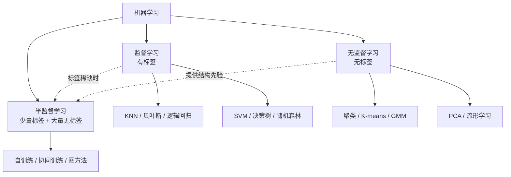
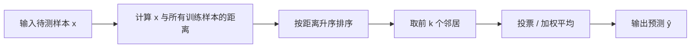
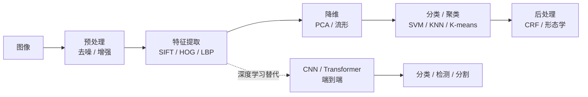
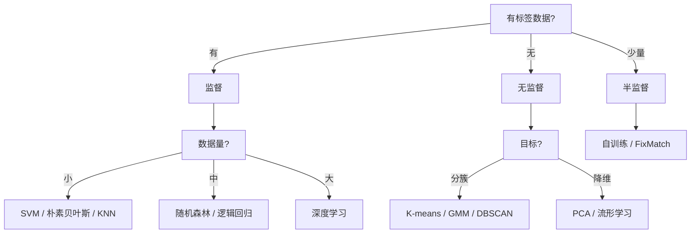

# 十大机器学习算法详解：原理、逐变量解析、图像应用与深度学习联系

> 本文是一份纯理论整理，不涉及任何代码改动。
> 目标是围绕"十大机器学习算法"这一经典提法，做到三件事：
>
> 1. **把每个算法的原理讲透**——每个公式都给出**逐项符号解释**（每个变量是什么、量纲、取值范围、物理含义）；
> 2. **厘清"十大"的版本差异**——不同教材/榜单给出的名单并不一致，本文列出主流版本并补齐差异项；
> 3. **落到图像领域**——每个算法在图像处理/计算机视觉中的具体用法，并说明它与后续**深度学习**部分的联系。
>
> 与仓库中 `feature-descriptors-notes.md`、`cnn-transformer-notes.md` 一脉相承：
> 前者讲"手工描述子"，后者讲"深度表示学习"，本文正好补上中间那一层——
> **经典机器学习**，即"浅层学习"这一代。

---

## 目录

1. 总览：什么是"十大机器学习算法"
2. "十大"的版本差异与本文取舍
3. 监督学习（Supervised Learning）
   - 3.1 最近邻（KNN）
   - 3.2 贝叶斯分类（朴素贝叶斯）
   - 3.3 逻辑回归
   - 3.4 支持向量机（SVM）
   - 3.5 决策树与森林（随机森林）
4. 无监督学习（Unsupervised Learning）
   - 4.1 聚类
   - 4.2 K-means 与高斯混合模型
   - 4.3 主成分分析（PCA）
   - 4.4 流形学习
   - 4.5 半监督学习
5. 其他版本中的扩展算法（ICDM 2008 版差异项）
   - 5.1 C4.5
   - 5.2 CART
   - 5.3 PageRank
   - 5.4 神经网络 / 深度学习
   - 5.5 AdaBoost
   - 5.6 EM 算法
   - 5.7 Apriori
6. 图像领域应用总览
7. 与深度学习的联系（重点）
8. 速查表
9. 结论

---

## 1. 总览：什么是"十大机器学习算法"

### 1.1 提法的来源

"十大机器学习算法"（Top 10 Algorithms in Data Mining / Machine Learning）并不是一个
有严格定义的官方名单，而是源于若干**综述性文章与教材**的归纳。最常被引用的是：

- **Wu et al., 2008, *Top 10 algorithms in data mining***（发表于 *Knowledge and Information Systems*），
  由 IEEE ICDM 组织投票产生，名单为：C4.5、K-Means、SVM、Apriori、EM、
  PageRank、AdaBoost、kNN、Naive Bayes、CART。
- 各类**入门教材与在线课程**（如 Python 数据科学、机器学习入门）给出的"十大"，
  则更偏向**可上手、覆盖监督+无监督**的实用清单，即用户给出的这一版：
  KNN、朴素贝叶斯、逻辑回归、SVM、决策树/森林、聚类、K-means/GMM、PCA、流形学习、半监督学习。

两者**视角不同**：前者是"数据挖掘领域最具影响力的算法"，后者是"机器学习入门必学的算法"。

### 1.2 三大范式

所有算法都可以归入三大学习范式：

| 范式 | 数据 | 目标 | 代表 |
|---|---|---|---|
| 监督学习 | 有标签 $(x_i, y_i)$ | 学 $x \to y$ 的映射 | KNN、贝叶斯、逻辑回归、SVM、决策树 |
| 无监督学习 | 无标签 $x_i$ | 发现结构（簇、子空间、流形） | 聚类、K-means、GMM、PCA、流形学习 |
| 半监督学习 | 少量标签 + 大量无标签 | 用无标签数据辅助监督任务 | 自训练、协同训练、图半监督 |

**范式关系示意**：

### 1.3 统一视角：都是"目标函数 + 优化"

尽管形式各异，几乎所有算法都可以写成同一个模板：

$$
\hat{\theta} = \arg\min_{\theta} \; \underbrace{\frac{1}{N}\sum_{i=1}^{N} L\big(y_i, f_\theta(x_i)\big)}_{\text{经验风险（拟合数据）}} \;+\; \underbrace{\lambda\, \Omega(\theta)}_{\text{正则化（控制复杂度）}}
$$

其中：

- $\theta$：模型参数（要学的东西）。
- $N$：样本数量。
- $x_i$：第 $i$ 个样本的**特征向量**（图像里常是描述子、像素块、颜色直方图等）。
- $y_i$：第 $i$ 个样本的**标签**（分类标签或回归值）。
- $f_\theta$：由参数 $\theta$ 决定的**预测函数**。
- $L(\cdot,\cdot)$：**损失函数**，衡量预测与真值的差距（如平方损失、交叉熵、Hinge 损失）。
- $\Omega(\theta)$：**正则项**，惩罚模型复杂度（如 L2、L1、树深度）。
- $\lambda$：**正则化系数**，权衡"拟合数据"与"保持简单"。
- $\hat{\theta}$：使总目标最小的最优参数。

**含义**：不同算法的差别，本质上就是 $L$、$\Omega$、$f_\theta$ 三者的不同选择。
例如 SVM 用 Hinge 损失 + L2 正则，逻辑回归用交叉熵 + L2 正则，
决策树用不纯度下降作为"隐式损失"。

---

## 2. "十大"的版本差异与本文取舍

### 2.1 主流版本对照

| 算法 | 用户给出的版本 | ICDM 2008 版 | 常见入门教材版 | 本文是否详解 |
|---|---|---|---|---|
| KNN | ✅ | ✅ | ✅ | ✅ 3.1 |
| 朴素贝叶斯 | ✅ | ✅ | ✅ | ✅ 3.2 |
| 逻辑回归 | ✅ | ❌ | ✅ | ✅ 3.3 |
| SVM | ✅ | ✅ | ✅ | ✅ 3.4 |
| 决策树 / 森林 | ✅ | ✅（C4.5、CART） | ✅ | ✅ 3.5 |
| 聚类 | ✅ | ✅（K-Means） | ✅ | ✅ 4.1 |
| K-means / GMM | ✅ | ✅（K-Means） | ✅ | ✅ 4.2 |
| PCA | ✅ | ❌ | ✅ | ✅ 4.3 |
| 流形学习 | ✅ | ❌ | ⚠️ 部分 | ✅ 4.4 |
| 半监督学习 | ✅ | ❌ | ⚠️ 部分 | ✅ 4.5 |
| C4.5 | ❌ | ✅ | ✅ | ✅ 5.1 |
| CART | ❌ | ✅ | ✅ | ✅ 5.2 |
| PageRank | ❌ | ✅ | ❌ | ✅ 5.3 |
| 神经网络 / 深度学习 | ❌ | ❌ | ✅ | ✅ 5.4 |
| AdaBoost | ❌ | ✅ | ✅ | ✅ 5.5 |
| EM | ❌ | ✅ | ⚠️ 部分 | ✅ 5.6 |
| Apriori | ❌ | ✅ | ⚠️ 部分 | ✅ 5.7 |

> **说明**：用户给出的版本是"入门实用版"，ICDM 2008 是"数据挖掘影响力版"。
> 两者交集是 KNN、朴素贝叶斯、SVM、决策树、K-means；
> 差异项（逻辑回归、PCA、流形学习、半监督 vs AdaBoost、EM、Apriori、PageRank）
> 本文全部补齐，做到"两版通吃"。

### 2.2 为什么会有差异

- **ICDM 版**偏重"数据挖掘"：强调关联规则（Apriori）、图排序（PageRank）、
  概率推断（EM），这些在数据库/推荐系统里更重要。
- **入门版**偏重"机器学习基础"：强调降维（PCA）、流形（t-SNE/LLE）、
  半监督，这些在**图像与高维数据**里更常用。
- **图像领域**的特殊性：图像是高维、强相关、带空间结构的数据，
  因此 PCA、流形学习、K-means（用于视觉词袋）在图像里地位极高，
  而 Apriori、PageRank 在图像里较少直接使用。

---

## 3. 监督学习（Supervised Learning）

### 3.1 最近邻（Nearest Neighbors / KNN）

#### 3.1.1 核心思想

KNN 是最"懒惰"的算法：**不训练、不建模型，把全部训练样本存起来，
预测时找最近的 $k$ 个邻居投票**。它属于**非参数方法**（模型复杂度随数据增长）。

#### 3.1.2 距离度量

最常用的是**欧氏距离**：

$$
d(x, x') = \sqrt{\sum_{j=1}^{D} (x_j - x'_j)^2}
$$

其中：

- $x, x'$：两个样本的特征向量（各 $D$ 维）。
- $D$：特征维度（图像里可能是描述子维度，如 SIFT 的 128）。
- $x_j$：向量 $x$ 的第 $j$ 个分量。
- $x'_j$：向量 $x'$ 的第 $j$ 个分量。
- $(x_j - x'_j)$：第 $j$ 维上的差。
- 平方后求和再开方：即"直线距离"（L2 范数）。
- $d(x,x')$：两样本的**不相似度**，越小越相似。

其他常用度量：

| 度量 | 公式 | 适用 |
|---|---|---|
| 曼哈顿距离 | $\sum_j \lvert x_j - x'_j \rvert$ | 稀疏、鲁棒 |
| 余弦距离 | $1 - \frac{x \cdot x'}{\lVert x \rVert \lVert x' \rVert}$ | 方向敏感（文本、描述子） |
| 汉明距离 | $\sum_j [x_j \neq x'_j]$ | 二进制描述子（BRIEF/ORB） |
| 马氏距离 | $\sqrt{(x-x')^\top \Sigma^{-1} (x-x')}$ | 各维尺度/相关性不同 |

其中 $\Sigma$ 是特征的**协方差矩阵**，$\Sigma^{-1}$ 是它的逆，用于"白化"各维尺度。

#### 3.1.3 分类决策规则

**多数投票**：

$$
\hat{y} = \arg\max_{c \in \mathcal{C}} \sum_{i \in \mathcal{N}_k(x)} \mathbb{1}[y_i = c]
$$

其中：

- $x$：待预测样本。
- $\mathcal{N}_k(x)$：$x$ 的 $k$ 个最近邻的**下标集合**。
- $k$：邻居个数（超参数）。
- $\mathcal{C}$：类别集合。
- $y_i$：第 $i$ 个训练样本的真实标签。
- $\mathbb{1}[\cdot]$：**指示函数**，条件成立取 1，否则取 0。
- $\sum_{i \in \mathcal{N}_k(x)} \mathbb{1}[y_i = c]$：邻居中属于类别 $c$ 的**个数**。
- $\arg\max_c$：取票数最多的类别。
- $\hat{y}$：预测标签。

**距离加权投票**（更常用，近的邻居权重大）：

$$
\hat{y} = \arg\max_{c} \sum_{i \in \mathcal{N}_k(x)} w_i \,\mathbb{1}[y_i = c], \qquad w_i = \frac{1}{d(x, x_i) + \epsilon}
$$

其中：

- $w_i$：第 $i$ 个邻居的**权重**。
- $d(x, x_i)$：待测样本与第 $i$ 个邻居的距离。
- $\epsilon$：极小正数，防止除零。
- 含义：距离越小，$w_i$ 越大，投票越有分量。

**回归**时则取邻居标签的（加权）平均：

$$
\hat{y} = \frac{\sum_{i \in \mathcal{N}_k(x)} w_i\, y_i}{\sum_{i \in \mathcal{N}_k(x)} w_i}
$$

#### 3.1.4 算法步骤

#### 3.1.5 关键问题

- **$k$ 的选择**：$k$ 太小 → 对噪声敏感（过拟合）；$k$ 太大 → 决策边界过于平滑（欠拟合）。
  常用交叉验证选 $k$，经验值 $k \approx \sqrt{N}$。
- **维度灾难**：高维空间中所有点距离趋于相等，KNN 失效。
  解决：先降维（PCA）或特征选择。
- **计算复杂度**：预测时 $O(ND)$，大数据需 KD-Tree、Ball-Tree、LSH 加速。

#### 3.1.6 图像领域用法

- **图像分类基线**：把图像表示为特征向量（颜色直方图、HOG、CNN 特征），用 KNN 分类。
- **图像检索**：以图搜图，找特征空间最近邻。
- **特征匹配**：SIFT 描述子的最近邻匹配（Lowe 的 ratio test 就是"最近邻 / 次近邻"比值）。
- **超像素 / 像素分类**：对每个像素的特征做 KNN 分类（如遥感图像分割）。

#### 3.1.7 与深度学习的联系

- **度量学习（Metric Learning）**：深度网络学一个嵌入空间，使同类近、异类远，
  再用 KNN 分类——即 **孪生网络 / Triplet Loss / 对比学习**。
- **原型网络（Prototypical Networks）**：few-shot 学习中，用类中心做"最近邻"。
- **KNN 是"无参数"的极端**，深度网络是"全参数"的极端，二者在表示学习上互补。

---

### 3.2 贝叶斯分类（Bayesian Classification）

#### 3.2.1 贝叶斯定理

$$
P(c \mid x) = \frac{P(x \mid c)\, P(c)}{P(x)}
$$

其中：

- $c$：类别（如"猫"）。
- $x$：样本特征向量。
- $P(c \mid x)$：**后验概率**——看到特征 $x$ 后，样本属于 $c$ 的概率（我们想要的）。
- $P(x \mid c)$：**似然**——类别 $c$ 产生特征 $x$ 的概率（从数据估计）。
- $P(c)$：**先验概率**——不看特征时，类别 $c$ 出现的概率（类别频率）。
- $P(x)$：**证据**——特征 $x$ 出现的概率，对所有类别相同，分类时可忽略。
- 含义：后验 ∝ 似然 × 先验。

**分类决策**（最大后验 MAP）：

$$
\hat{y} = \arg\max_{c} P(c \mid x) = \arg\max_{c} P(x \mid c)\, P(c)
$$

其中 $\hat{y}$ 是预测类别；因为 $P(x)$ 与 $c$ 无关，可省略。

#### 3.2.2 朴素贝叶斯：条件独立假设

直接估计 $P(x \mid c)$ 需要 $D$ 维联合分布，参数爆炸。
**朴素贝叶斯**假设各维**条件独立**：

$$
P(x \mid c) = \prod_{j=1}^{D} P(x_j \mid c)
$$

其中：

- $D$：特征维度。
- $x_j$：特征向量的第 $j$ 维。
- $P(x_j \mid c)$：在类别 $c$ 下，第 $j$ 维取值的概率（一维分布，易估计）。
- $\prod$：连乘，把 $D$ 维联合概率拆成 $D$ 个一维概率之积。
- 含义：假设"给定类别后，各特征互不影响"——这个假设通常不成立，但效果出奇地好。

**最终判别式**：

$$
\hat{y} = \arg\max_{c} \; P(c) \prod_{j=1}^{D} P(x_j \mid c)
$$

#### 3.2.3 三种常见变体

| 变体 | 假设 $P(x_j \mid c)$ | 适用特征 |
|---|---|---|
| 高斯朴素贝叶斯 | $\mathcal{N}(\mu_{jc}, \sigma_{jc}^2)$ | 连续特征（图像像素、描述子） |
| 多项式朴素贝叶斯 | 多项分布 | 计数特征（词频、直方图） |
| 伯努利朴素贝叶斯 | 伯努利分布 | 二值特征（二值描述子） |

**高斯形式**：

$$
P(x_j \mid c) = \frac{1}{\sqrt{2\pi\sigma_{jc}^2}} \exp\!\left(-\frac{(x_j - \mu_{jc})^2}{2\sigma_{jc}^2}\right)
$$

其中：

- $\mu_{jc}$：类别 $c$ 下第 $j$ 维的**均值**。
- $\sigma_{jc}^2$：类别 $c$ 下第 $j$ 维的**方差**。
- $\sigma_{jc}$：标准差。
- $x_j$：待测样本第 $j$ 维取值。
- 含义：假设该维在类内服从正态分布，用均值和方差刻画。

#### 3.2.4 数值稳定：对数化

连乘易下溢，取对数变连加：

$$
\hat{y} = \arg\max_{c} \left[ \log P(c) + \sum_{j=1}^{D} \log P(x_j \mid c) \right]
$$

其中 $\log$ 单调递增，不改变 $\arg\max$ 结果，但把乘积变求和，避免浮点下溢。

#### 3.2.5 图像领域用法

- **垃圾邮件 / 文本分类**（经典应用，非图像）。
- **图像分类**：像素或描述子作为特征，高斯朴素贝叶斯做基线。
- **肤色检测**：在 YCbCr 空间对 Cb、Cr 建模高斯分布，判断像素是否肤色。
- **贝叶斯分割**：结合先验形状与似然做 MRF/CRF 分割（贝叶斯框架的推广）。
- **朴素贝叶斯是"生成式模型"**，与逻辑回归（判别式）形成对照。

#### 3.2.6 与深度学习的联系

- **贝叶斯深度学习**：对网络权重加先验，做后验推断（变分推断、MC Dropout），
  得到**不确定性估计**。
- **生成模型**：VAE 的 ELBO 就是贝叶斯推断的变分下界。
- **Softmax 分类器**可看作"判别式"版本，而朴素贝叶斯是"生成式"版本。

---

### 3.3 逻辑回归（Logistic Regression）

#### 3.3.1 从线性回归到概率

线性模型输出 $z = w^\top x + b$ 是实数，要变成概率需**Sigmoid**压缩：

$$
\sigma(z) = \frac{1}{1 + e^{-z}}
$$

其中：

- $z$：线性得分（logit）。
- $e$：自然常数。
- $\sigma(z) \in (0,1)$：把实数映射到概率区间。
- 性质：$\sigma(0)=0.5$，$z \to +\infty$ 时趋近 1，$z \to -\infty$ 时趋近 0。

**二分类概率**：

$$
P(y=1 \mid x) = \sigma(w^\top x + b) = \frac{1}{1 + e^{-(w^\top x + b)}}
$$

其中：

- $w \in \mathbb{R}^D$：**权重向量**，每个分量 $w_j$ 表示第 $j$ 维特征对"正类"的贡献。
- $b$：**偏置**，控制决策边界的位置。
- $w^\top x = \sum_j w_j x_j$：特征的加权和。
- $P(y=1\mid x)$：样本属于正类的概率。
- $P(y=0 \mid x) = 1 - P(y=1 \mid x)$。

#### 3.3.2 决策边界

令 $P(y=1\mid x) = 0.5$，即 $w^\top x + b = 0$：

$$
w^\top x + b = 0
$$

这是一个**超平面**，把特征空间一分为二。$w$ 是超平面的**法向量**（决定方向），
$b$ 决定**偏移**。逻辑回归是**线性分类器**。

#### 3.3.3 损失函数：交叉熵

从最大似然推导。单样本似然：

$$
P(y \mid x) = \hat{p}^{\,y} (1-\hat{p})^{\,1-y}, \qquad \hat{p} = \sigma(w^\top x + b)
$$

其中：

- $y \in \{0,1\}$：真实标签。
- $\hat{p}$：预测为正类的概率。
- 当 $y=1$ 时取 $\hat{p}$，当 $y=0$ 时取 $1-\hat{p}$。

取负对数得**交叉熵损失**：

$$
L(w, b) = -\frac{1}{N}\sum_{i=1}^{N} \Big[ y_i \log \hat{p}_i + (1-y_i)\log(1-\hat{p}_i) \Big]
$$

其中：

- $N$：样本数。
- $y_i$：第 $i$ 个样本标签。
- $\hat{p}_i = \sigma(w^\top x_i + b)$：第 $i$ 个样本的预测概率。
- 第一项 $y_i \log \hat{p}_i$：当 $y_i=1$ 时惩罚"预测概率低"。
- 第二项 $(1-y_i)\log(1-\hat{p}_i)$：当 $y_i=0$ 时惩罚"预测概率高"。
- 负号：把"最大化似然"变成"最小化损失"。

#### 3.3.4 梯度下降

对 $w$ 求梯度：

$$
\nabla_w L = \frac{1}{N}\sum_{i=1}^{N} (\hat{p}_i - y_i)\, x_i
$$

其中：

- $\hat{p}_i - y_i$：**预测误差**（残差）。
- $x_i$：第 $i$ 个样本特征。
- 含义：梯度 = 误差 × 特征的平均。误差越大，更新越猛。
- 更新：$w \leftarrow w - \eta \nabla_w L$，$\eta$ 是**学习率**。

**这个形式与线性回归的梯度完全一致**，区别只在 $\hat{p}$ 是 Sigmoid 输出。

#### 3.3.5 多分类：Softmax 回归

$$
P(y=c \mid x) = \frac{e^{w_c^\top x + b_c}}{\sum_{c'=1}^{C} e^{w_{c'}^\top x + b_{c'}}}
$$

其中：

- $C$：类别数。
- $w_c$：类别 $c$ 的权重向量。
- $b_c$：类别 $c$ 的偏置。
- 分母：所有类别的指数和，做**归一化**，使概率和为 1。
- 含义：把每个类别的得分转成概率分布。

#### 3.3.6 图像领域用法

- **二分类任务**：人脸/非人脸、有缺陷/无缺陷。
- **多标签分类**：一张图多个标签（每个标签一个逻辑回归）。
- **作为网络最后一层**：CNN 分类头就是 Softmax 回归。
- **概率输出**：需要置信度时优于 SVM。

#### 3.3.7 与深度学习的联系

- **逻辑回归 = 单层神经网络**（无隐藏层）。
- **Softmax 回归 = CNN 分类头**，是深度分类器的最后一步。
- **交叉熵损失**是深度分类的标准损失。
- 逻辑回归的局限（线性边界）正是深度网络要突破的：**加隐藏层 + 非线性激活**。

---

### 3.4 支持向量机（Support Vector Machines, SVM）

#### 3.4.1 核心思想：最大间隔

SVM 要找一条**离两类样本都最远**的分界线（超平面），
使**间隔（margin）最大**。只有少数"支撑"边界的样本（**支持向量**）决定分界线。

**超平面**：

$$
w^\top x + b = 0
$$

其中：

- $w$：超平面的**法向量**，决定方向。
- $b$：偏置，决定与原点的距离。
- $x$：特征向量。

**点到超平面的距离**：

$$
d(x) = \frac{|w^\top x + b|}{\lVert w \rVert}
$$

其中 $\lVert w \rVert = \sqrt{\sum_j w_j^2}$ 是法向量的模长。

#### 3.4.2 硬间隔优化问题

要求所有样本正确分类且间隔最大：

$$
\min_{w,b} \frac{1}{2}\lVert w \rVert^2 \quad \text{s.t.} \quad y_i (w^\top x_i + b) \ge 1, \; \forall i
$$

其中：

- $\frac{1}{2}\lVert w \rVert^2$：目标函数，最小化它等价于**最大化间隔** $2/\lVert w \rVert$。
- $y_i \in \{-1, +1\}$：标签（SVM 用 ±1 而非 0/1）。
- $y_i(w^\top x_i + b)$：**函数间隔**，要求 ≥ 1 表示"分类正确且离边界足够远"。
- 约束对所有 $i$ 成立。

#### 3.4.3 软间隔与松弛变量

现实数据有噪声，允许少量越界，引入**松弛变量** $\xi_i$：

$$
\min_{w,b,\xi} \frac{1}{2}\lVert w \rVert^2 + C\sum_{i=1}^{N}\xi_i \quad \text{s.t.} \quad y_i(w^\top x_i + b) \ge 1 - \xi_i, \; \xi_i \ge 0
$$

其中：

- $\xi_i \ge 0$：第 $i$ 个样本的**违反程度**（越界多少）。
- $C > 0$：**惩罚系数**，权衡"间隔大"与"少犯错"。
  - $C$ 大 → 不容忍错误 → 过拟合风险。
  - $C$ 小 → 容忍错误 → 欠拟合风险。

#### 3.4.4 对偶问题与核技巧

用拉格朗日乘子转成对偶问题：

$$
\max_{\alpha} \sum_{i=1}^{N}\alpha_i - \frac{1}{2}\sum_{i=1}^{N}\sum_{j=1}^{N} \alpha_i \alpha_j y_i y_j \, K(x_i, x_j)
$$

$$
\text{s.t.} \quad 0 \le \alpha_i \le C, \quad \sum_{i=1}^{N}\alpha_i y_i = 0
$$

其中：

- $\alpha_i$：第 $i$ 个样本的**拉格朗日乘子**。
  - $\alpha_i = 0$：该样本不影响边界（非支持向量）。
  - $\alpha_i > 0$：该样本是**支持向量**。
- $K(x_i, x_j)$：**核函数**，计算两样本在高维空间的内积，无需显式升维。
- 含义：决策只依赖支持向量之间的核函数值。

**常用核函数**：

| 核 | 公式 | 参数 |
|---|---|---|
| 线性核 | $x_i^\top x_j$ | 无 |
| 多项式核 | $(\gamma\, x_i^\top x_j + r)^d$ | $\gamma, r, d$ |
| RBF / 高斯核 | $\exp(-\gamma \lVert x_i - x_j \rVert^2)$ | $\gamma$ |
| Sigmoid 核 | $\tanh(\gamma\, x_i^\top x_j + r)$ | $\gamma, r$ |

其中：

- $\gamma$：核宽度参数，控制"影响半径"。
- $d$：多项式次数。
- $r$：常数项。
- RBF 核把数据映射到**无穷维**空间，是最常用的非线性核。

**预测函数**：

$$
f(x) = \text{sign}\!\left( \sum_{i \in SV} \alpha_i y_i K(x_i, x) + b \right)
$$

其中：

- $SV$：支持向量集合。
- $\text{sign}(\cdot)$：符号函数，输出 ±1。
- 含义：新样本的类别由它与支持向量的核函数加权和决定。

#### 3.4.5 图像领域用法

- **HOG + SVM**：行人检测的经典组合（Dalal & Triggs, 2005）。
- **图像分类**：在 CNN 之前，SVM 是图像分类的主力（如 Caltech-101）。
- **目标检测**：滑动窗口 + SVM 分类。
- **多类 SVM**：一对多（OvR）或一对一（OvO）扩展。

#### 3.4.6 与深度学习的联系

- **Hinge 损失**被深度度量学习沿用（如 Deep SVM、大间隔 softmax）。
- **核方法 vs 深度**：核方法固定特征映射，深度网络**学习**特征映射。
- **神经正切核（NTK）**：无限宽网络的极限等价于核方法，架起两者桥梁。
- **SVM 的间隔思想**影响深度学习的 margin-based 损失（如 ArcFace、CosFace）。

---

### 3.5 决策树与森林（Decision Trees and Forests）

#### 3.5.1 决策树：递归划分

决策树通过一系列"if-else"问题把特征空间**递归划分**成若干区域，
每个叶子给出预测。核心是**如何选划分特征和阈值**。

#### 3.5.2 不纯度度量

**信息熵**：

$$
H(S) = -\sum_{c=1}^{C} p_c \log_2 p_c
$$

其中：

- $S$：当前节点上的样本集合。
- $C$：类别数。
- $p_c$：$S$ 中属于类别 $c$ 的**比例**。
- $\log_2$：以 2 为底，单位是比特。
- $H(S)$：**不确定性**，越纯越小（纯节点 $H=0$）。

**基尼不纯度**：

$$
\text{Gini}(S) = 1 - \sum_{c=1}^{C} p_c^2
$$

其中 $p_c$ 同上；基尼不纯度衡量"随机抽两个样本类别不同的概率"，计算比熵快。

**信息增益**（ID3 / C4.5）：

$$
\text{Gain}(S, A) = H(S) - \sum_{v \in \text{values}(A)} \frac{|S_v|}{|S|} H(S_v)
$$

其中：

- $A$：候选划分特征。
- $\text{values}(A)$：特征 $A$ 的取值集合。
- $S_v$：$S$ 中特征 $A$ 取值为 $v$ 的子集。
- $|S_v| / |S|$：子集权重。
- 含义：用 $A$ 划分后，不确定性下降多少；选增益最大的特征。

**C4.5 的改进——信息增益率**：

$$
\text{GainRatio}(S,A) = \frac{\text{Gain}(S,A)}{\text{SplitInfo}(S,A)}, \qquad \text{SplitInfo}(S,A) = -\sum_{v} \frac{|S_v|}{|S|}\log_2\frac{|S_v|}{|S|}
$$

其中 $\text{SplitInfo}$ 惩罚"取值过多的特征"，避免偏向 ID 类特征。

**CART 用基尼不纯度**，且只做**二叉划分**，可同时处理分类与回归。

#### 3.5.3 剪枝

- **预剪枝**：提前停止（限制深度、最小样本数）。
- **后剪枝**：先长满再剪掉不提升泛化的子树（代价复杂度剪枝）。

#### 3.5.4 随机森林：集成学习

随机森林 = **Bagging + 特征随机**：

1. **Bootstrap 采样**：从 $N$ 个样本有放回抽 $N$ 个，训练一棵树。
2. **特征随机**：每次分裂只从随机 $m$ 个特征中选最优（$m \approx \sqrt{D}$）。
3. **投票/平均**：多棵树结果聚合。

**预测**：

$$
\hat{y} = \text{majority}\{ h_t(x) \}_{t=1}^{T} \quad \text{或} \quad \hat{y} = \frac{1}{T}\sum_{t=1}^{T} h_t(x)
$$

其中：

- $T$：树的数量。
- $h_t$：第 $t$ 棵树。
- 分类用多数投票，回归用平均。
- 含义：多棵"弱相关"的树平均，方差下降，泛化提升。

**为什么有效**：单棵树方差大（易过拟合），
Bagging 通过**平均**降低方差；特征随机进一步**去相关**，使平均更有效。

#### 3.5.5 特征重要性

$$
\text{Importance}(j) = \sum_{\text{节点 } t \text{ 用 } j \text{ 分裂}} \frac{|S_t|}{N} \cdot \Delta \text{Impurity}(t)
$$

其中：

- $j$：特征下标。
- $S_t$：节点 $t$ 的样本数。
- $\Delta \text{Impurity}(t)$：该次分裂带来的不纯度下降。
- 含义：某特征在所有树中带来的不纯度下降的加权和，越大越重要。

#### 3.5.6 图像领域用法

- **像素级分类**：随机森林做语义分割（早期方法，如 TextonForest）。
- **关键点分类**：随机森林做**随机蕨（Random Ferns）**，用于特征匹配、姿态估计。
- **目标检测**：Viola-Jones 人脸检测用 AdaBoost + 决策树桩。
- **特征选择**：用特征重要性筛选描述子维度。

#### 3.5.7 与深度学习的联系

- **随机森林 = 深度网络的"浅层集成"对照**：前者靠集成降方差，后者靠层次降偏差。
- **梯度提升树（GBDT/XGBoost/LightGBM）** 是表格数据王者，与深度网络互补。
- **深度森林（Deep Forest / gcForest）** 尝试用树堆叠模拟深度。
- **随机蕨**的思想被用于深度特征匹配的加速。

---

## 4. 无监督学习（Unsupervised Learning）

### 4.1 聚类（Clustering）

#### 4.1.1 问题定义

给定无标签数据 $\{x_i\}_{i=1}^N$，把它们分成若干**簇**，
使**簇内相似、簇间相异**。

#### 4.1.2 聚类目标（一般形式）

$$
\min_{\{C_1,\dots,C_K\}} \sum_{k=1}^{K} \sum_{x_i \in C_k} d(x_i, \mu_k)
$$

其中：

- $K$：簇数。
- $C_k$：第 $k$ 个簇（样本集合）。
- $\mu_k$：第 $k$ 个簇的**中心**（如均值）。
- $d(\cdot,\cdot)$：距离度量。
- 含义：让每个样本离自己簇中心尽量近。

#### 4.1.3 聚类方法分类

| 类型 | 代表 | 思想 |
|---|---|---|
| 划分式 | K-means、K-medoids | 直接划分成 $K$ 簇 |
| 层次式 | 凝聚/分裂层次聚类 | 建树状结构（树状图） |
| 密度式 | DBSCAN、Mean Shift | 按密度连通区域成簇 |
| 模型式 | GMM | 假设数据由概率模型生成 |
| 图论式 | 谱聚类 | 用图的割划分 |

**DBSCAN** 的两个参数：

- $\epsilon$：邻域半径。
- $\text{MinPts}$：成为核心点所需的最少邻居数。
- 核心点：$\epsilon$ 邻域内点数 ≥ MinPts；可发现任意形状簇并识别噪声。

**谱聚类**：用相似度矩阵 $W$ 的拉普拉斯矩阵 $L = D - W$ 的前 $K$ 个特征向量嵌入，
再 K-means。其中 $D$ 是度矩阵（对角元 $D_{ii} = \sum_j W_{ij}$）。

#### 4.1.4 图像领域用法

- **图像分割**：像素聚类成区域（颜色/位置特征）。
- **视觉词袋（BoW）**：对局部描述子聚类得到"视觉单词"。
- **图像检索与组织**：按内容聚类相册。
- **超像素**：SLIC 用 K-means 在颜色+空间上聚类。

#### 4.1.5 与深度学习的联系

- **深度聚类**：用网络学嵌入再聚类（DEC、DeepCluster）。
- **自监督学习**：聚类伪标签作为预训练目标（DeepCluster、SwAV）。
- **对比学习**：正负样本对构造与聚类思想相通。

---

### 4.2 K-means 与高斯混合模型（K-means and Gaussian Mixture Models）

#### 4.2.1 K-means 目标函数

$$
J = \sum_{k=1}^{K}\sum_{i:\, z_i = k} \lVert x_i - \mu_k \rVert^2
$$

其中：

- $K$：簇数（超参数）。
- $x_i$：第 $i$ 个样本。
- $z_i \in \{1,\dots,K\}$：样本 $i$ 的**簇分配**（隐变量）。
- $\mu_k$：第 $k$ 个簇的**质心**。
- $\lVert x_i - \mu_k \rVert^2$：样本到质心的**平方距离**。
- $J$：**簇内平方和（WCSS）**，越小越紧凑。

#### 4.2.2 交替优化（EM 的特例）

**分配步**：

$$
z_i = \arg\min_{k} \lVert x_i - \mu_k \rVert^2
$$

**更新步**：

$$
\mu_k = \frac{1}{|C_k|}\sum_{i \in C_k} x_i
$$

其中：

- $C_k = \{i : z_i = k\}$：分配给簇 $k$ 的样本集合。
- $|C_k|$：该簇样本数。
- 含义：先固定质心分配样本，再固定分配更新质心，交替直到收敛。

**收敛性**：每步都使 $J$ 不增，故必收敛到**局部最优**（非全局）。

#### 4.2.3 K-means 的局限与改进

- **需预设 $K$**：用肘部法、轮廓系数、Gap Statistic 选 $K$。
- **对初值敏感**：用 K-means++ 初始化。
- **只适合球形簇**：各向异性/非凸簇需 GMM 或谱聚类。
- **对异常值敏感**：改用 K-medoids（用真实样本做中心）。

**K-means++ 初始化**：第一个中心随机选，之后每个中心以正比于
"到已有中心最近距离的平方"的概率选取，使初始中心分散。

#### 4.2.4 高斯混合模型（GMM）

GMM 假设数据由 $K$ 个高斯分布**混合**生成：

$$
p(x) = \sum_{k=1}^{K} \pi_k \, \mathcal{N}(x \mid \mu_k, \Sigma_k)
$$

其中：

- $\pi_k$：第 $k$ 个分量的**混合系数**（权重），满足 $\sum_k \pi_k = 1$，$\pi_k \ge 0$。
- $\mu_k$：第 $k$ 个高斯的**均值向量**。
- $\Sigma_k$：第 $k$ 个高斯的**协方差矩阵**（刻画形状与方向）。
- $\mathcal{N}(x \mid \mu_k, \Sigma_k)$：多元高斯密度：

$$
\mathcal{N}(x \mid \mu, \Sigma) = \frac{1}{(2\pi)^{D/2}|\Sigma|^{1/2}} \exp\!\left(-\frac{1}{2}(x-\mu)^\top \Sigma^{-1}(x-\mu)\right)
$$

其中：

- $D$：维度。
- $|\Sigma|$：协方差矩阵的行列式（体积）。
- $\Sigma^{-1}$：精度矩阵。
- $(x-\mu)^\top \Sigma^{-1}(x-\mu)$：**马氏距离平方**。

#### 4.2.5 GMM 的 EM 求解

**E 步（责任度）**：

$$
\gamma_{ik} = \frac{\pi_k \mathcal{N}(x_i \mid \mu_k, \Sigma_k)}{\sum_{j=1}^{K} \pi_j \mathcal{N}(x_i \mid \mu_j, \Sigma_j)}
$$

其中：

- $\gamma_{ik}$：样本 $i$ 属于分量 $k$ 的**后验概率**（软分配）。
- 分母：所有分量的加权密度和（归一化）。
- 与 K-means 的硬分配 $z_i$ 对比：GMM 是**软分配**。

**M 步（参数更新）**：

$$
\mu_k = \frac{\sum_i \gamma_{ik} x_i}{\sum_i \gamma_{ik}}, \quad
\Sigma_k = \frac{\sum_i \gamma_{ik}(x_i-\mu_k)(x_i-\mu_k)^\top}{\sum_i \gamma_{ik}}, \quad
\pi_k = \frac{\sum_i \gamma_{ik}}{N}
$$

其中：

- $N_k^{\text{eff}} = \sum_i \gamma_{ik}$：分量 $k$ 的**有效样本数**。
- 含义：用责任度加权计算均值、协方差、权重。

**K-means 是 GMM 的特例**：当所有 $\Sigma_k = \sigma^2 I$ 且 $\sigma \to 0$ 时，
软分配退化为硬分配，GMM 退化为 K-means。

#### 4.2.6 图像领域用法

- **颜色量化**：K-means 把图像颜色压缩到 $K$ 种（GIF 调色板）。
- **图像分割**：GMM 对颜色/纹理建模，做像素聚类。
- **背景建模**：GMM 对每个像素的颜色随时间建模，检测运动目标（MOG）。
- **视觉词袋**：K-means 生成视觉词典。

#### 4.2.7 与深度学习的联系

- **VQ-VAE**：用离散码本（等价于 K-means 的质心）做深度量化。
- **MoE（混合专家）**：GMM 的"软分配"思想用于门控网络。
- **EM 是深度生成模型（VAE）变分推断的雏形**。

---

### 4.3 主成分分析（Principal Component Analysis, PCA）

#### 4.3.1 核心思想

PCA 找一组**正交方向**，使数据投影后方差最大，
用少数方向表示高维数据，实现**降维**。

#### 4.3.2 数学推导

**数据中心化**：

$$
\tilde{x}_i = x_i - \bar{x}, \qquad \bar{x} = \frac{1}{N}\sum_{i=1}^{N} x_i
$$

其中：

- $x_i$：第 $i$ 个样本（$D$ 维）。
- $\bar{x}$：样本均值向量。
- $\tilde{x}_i$：中心化后的样本。

**协方差矩阵**：

$$
\Sigma = \frac{1}{N}\sum_{i=1}^{N} \tilde{x}_i \tilde{x}_i^\top = \frac{1}{N}\tilde{X}^\top \tilde{X}
$$

其中：

- $\Sigma \in \mathbb{R}^{D\times D}$：**协方差矩阵**，对角元是各维方差，非对角元是维间协方差。
- $\tilde{X} \in \mathbb{R}^{N\times D}$：中心化数据矩阵（每行一个样本）。
- 含义：刻画各维的波动与相关性。

**特征分解**：

$$
\Sigma u_j = \lambda_j u_j, \qquad \lambda_1 \ge \lambda_2 \ge \dots \ge \lambda_D \ge 0
$$

其中：

- $u_j$：第 $j$ 个**特征向量**（主成分方向），单位向量且互相正交。
- $\lambda_j$：第 $j$ 个**特征值**，等于数据在该方向上的**方差**。
- 含义：特征值越大，该方向越"重要"。

**投影降维**：取前 $K$ 个特征向量组成 $U_K = [u_1,\dots,u_K]$：

$$
y_i = U_K^\top \tilde{x}_i \in \mathbb{R}^{K}
$$

其中：

- $U_K \in \mathbb{R}^{D\times K}$：投影矩阵。
- $y_i$：降维后的**主成分得分**（$K$ 维）。
- 含义：把 $D$ 维数据压到 $K$ 维，保留最大方差。

**重构**：

$$
\hat{x}_i = U_K y_i + \bar{x}
$$

其中 $\hat{x}_i$ 是重构样本；重构误差 = 被丢弃方向上的方差之和。

#### 4.3.3 方差解释率

$$
\text{EVR}(K) = \frac{\sum_{j=1}^{K}\lambda_j}{\sum_{j=1}^{D}\lambda_j}
$$

其中：

- $\text{EVR}(K)$：前 $K$ 个主成分解释的**方差比例**。
- 常取 $\text{EVR} \ge 0.95$ 确定 $K$。

#### 4.3.4 与 SVD 的关系

对中心化矩阵做 SVD：$\tilde{X} = U S V^\top$，则：

- 主成分方向 = $V$ 的列（右奇异向量）。
- 特征值 $\lambda_j = s_j^2 / N$（$s_j$ 是奇异值）。
- 得分 = $U S$。

**SVD 更数值稳定**，实践中常用 SVD 实现 PCA。

#### 4.3.5 图像领域用法

- **特征脸（Eigenfaces）**：人脸图像 PCA 降维，前几个主成分是"脸的基本模式"。
- **图像压缩**：保留前 $K$ 个主成分重构图像。
- **去噪**：丢弃小方差方向（多为噪声）。
- **描述子降维**：SIFT 128 维 → PCA 降到 20~64 维，加速匹配。
- **白化**：PCA 后各维除以 $\sqrt{\lambda_j}$，使各维等方差。

#### 4.3.6 与深度学习的联系

- **PCA = 线性自编码器**：单层线性 AE 的最优解就是 PCA 子空间。
- **白化**是深度网络输入预处理的常用手段。
- **注意力/低秩分解**：PCA 的低秩思想用于网络压缩（SVD 分解权重）。
- **对比：PCA 是线性无监督降维，自编码器是非线性版本**。

---

### 4.4 流形学习（Manifold Learning）

#### 4.4.1 核心假设

**流形假设**：高维数据实际上分布在一个**低维流形**上（局部像欧氏空间）。
流形学习的目标是**恢复这个低维结构**，做**非线性降维**。

形式化：存在映射

$$
\phi: \mathcal{M} \subset \mathbb{R}^{d} \to \mathbb{R}^{D}, \quad D \gg d
$$

其中：

- $\mathcal{M}$：低维流形（内在维度 $d$）。
- $D$：观测空间维度。
- $\phi$：嵌入映射（把低维坐标映到高维观测）。
- 目标：找逆映射 $\phi^{-1}$，即从高维数据恢复低维坐标。

#### 4.4.2 代表方法

**（1）LLE（局部线性嵌入）**

假设每个点可由其近邻**线性重构**，且重构权重在低维保持：

$$
\min_{W} \sum_{i} \left\lVert x_i - \sum_{j \in \mathcal{N}(i)} W_{ij} x_j \right\rVert^2, \quad \sum_j W_{ij} = 1
$$

其中：

- $W_{ij}$：样本 $j$ 对重构 $i$ 的**权重**。
- $\mathcal{N}(i)$：$i$ 的近邻集合。
- 约束 $\sum_j W_{ij}=1$：权重归一化（平移不变）。

再固定 $W$，求低维坐标 $y_i$：

$$
\min_{Y} \sum_{i} \left\lVert y_i - \sum_{j} W_{ij} y_j \right\rVert^2, \quad Y^\top Y = I
$$

其中：

- $Y \in \mathbb{R}^{N\times d}$：低维嵌入坐标。
- $Y^\top Y = I$：约束防止退化解（尺度/旋转不定）。
- 解为矩阵 $(I-W)^\top(I-W)$ 的最小 $d$ 个特征向量。

**（2）Isomap**

用**测地距离**（图上最短路径）替代欧氏距离，再做 MDS：

$$
d_{\text{geo}}(i,j) = \min_{\text{path}} \sum \lVert x_a - x_b \rVert
$$

其中 $d_{\text{geo}}$ 是流形上的**测地距离**，通过近邻图的最短路径近似。

**（3）t-SNE**

把高维相似度转成概率，低维也转成概率，最小化两者 KL 散度：

$$
\text{KL}(P \Vert Q) = \sum_{i \neq j} p_{ij} \log \frac{p_{ij}}{q_{ij}}
$$

其中：

- $p_{ij}$：高维空间中 $i,j$ 的**相似度概率**（高斯核）。
- $q_{ij}$：低维空间中的相似度概率（**t 分布**核，重尾，缓解拥挤）。
- $\text{KL}$：KL 散度，衡量两个分布的差异。
- 含义：让低维的邻接关系尽量匹配高维。

**（4）UMAP**：基于拓扑数据分析，比 t-SNE 更快且更好保留全局结构。

#### 4.4.3 图像领域用法

- **可视化**：把 CNN 特征降到 2D 看类别可分性（t-SNE 最常用）。
- **人脸/姿态流形**：人脸图像随姿态、光照变化形成低维流形。
- **检索**：流形上的近邻检索。
- **降维预处理**：Isomap/LLE 用于手写数字、人脸识别。

#### 4.4.4 与深度学习的联系

- **流形假设是深度学习的理论基石之一**：深度网络学的是"把流形展平"的映射。
- **自编码器 / VAE** 是**参数化、可泛化**的流形学习（能处理新样本）。
- **t-SNE/UMAP 用于分析深度特征空间**，是理解网络的常用工具。
- **对比学习**的目标就是让同类在嵌入流形上聚集。

---

### 4.5 半监督学习（Semi-supervised Learning）

#### 4.5.1 问题设定

有**少量有标签**数据 $\{(x_i, y_i)\}_{i=1}^{L}$ 和**大量无标签**数据 $\{x_j\}_{j=L+1}^{L+U}$，
利用无标签数据提升性能。核心假设：

- **平滑假设**：相近样本有相近标签。
- **聚类假设**：同一簇内样本同类。
- **流形假设**：数据在低维流形上，沿流形标签平滑。

#### 4.5.2 主要方法

**（1）自训练（Self-training）**

1. 用有标签数据训练模型。
2. 预测无标签数据，取**高置信度**样本加入训练集。
3. 重复。

置信度阈值 $\tau$：只把 $\max_c P(c\mid x) \ge \tau$ 的样本加入。

**（2）协同训练（Co-training）**

用两个**不同视图**（特征子集）各训一个分类器，互相给对方标注高置信样本。

**（3）图半监督（Label Propagation）**

在相似度图上传播标签。目标函数：

$$
E(f) = \sum_{i,j} W_{ij} \lVert f_i - f_j \rVert^2
$$

其中：

- $W_{ij}$：样本 $i,j$ 的**相似度**（如高斯核）。
- $f_i$：样本 $i$ 的**预测分数**（软标签）。
- 含义：相似样本的预测应接近；有标签样本固定为真值。
- 解：$f = (I - \alpha S)^{-1} y$，其中 $S = D^{-1/2}WD^{-1/2}$ 是归一化相似度矩阵，$\alpha$ 是传播强度。

**（4）半监督 SVM（S3VM）**：让超平面穿过低密度区域。

**（5）一致性正则（深度半监督）**：对同一输入加不同扰动，要求输出一致
（Π-model、Mean Teacher、FixMatch）。

#### 4.5.3 图像领域用法

- **医学图像分割**：标注昂贵，用少量标注 + 大量未标注。
- **遥感分类**：标注成本高。
- **网页图像分类**：少量标注 + 海量未标注。
- **伪标签（Pseudo-labeling）**：竞赛与工业界常用。

#### 4.5.4 与深度学习的联系

- **半监督是深度学习的核心训练范式之一**：FixMatch、Mean Teacher、Noisy Student。
- **自监督学习**（SimCLR、MAE、MoCo）可看作"无标签预训练 + 少量标签微调"，
  是半监督的极端形式。
- **伪标签**是知识蒸馏与半监督的桥梁。

---

## 5. 其他版本中的扩展算法（ICDM 2008 版差异项）

> 本节补齐 ICDM 2008 版名单中用户版本未列出的算法：**C4.5、CART、PageRank、
> AdaBoost、EM、Apriori**，以及入门教材版常列的**神经网络 / 深度学习**。
> 这些算法在图像领域未必是主力，但在数据挖掘、推荐系统、集成学习、
> 概率推断等领域地位极高，因此本节同时给出**非图像用途**。

### 5.1 C4.5

#### 5.1.1 定位

C4.5 是 **ID3 的改进版**（Quinlan, 1993），是决策树算法史上最著名的版本之一，
也是 ICDM 2008 榜单的**第一名**。它解决了 ID3 的两个致命缺陷：

- ID3 只能处理**离散特征**，C4.5 可处理**连续特征**（二分阈值）。
- ID3 用信息增益会**偏向取值多的特征**，C4.5 改用**信息增益率**。

#### 5.1.2 信息增益率

$$
\text{GainRatio}(S, A) = \frac{\text{Gain}(S, A)}{\text{SplitInfo}(S, A)}
$$

其中：

- $S$：当前节点的样本集合。
- $A$：候选划分特征。
- $\text{Gain}(S,A) = H(S) - \sum_{v} \frac{|S_v|}{|S|}H(S_v)$：**信息增益**，即用 $A$ 划分后熵的下降量。
- $H(S) = -\sum_c p_c \log_2 p_c$：$S$ 的**信息熵**，$p_c$ 是类别 $c$ 的占比。
- $S_v$：$S$ 中特征 $A$ 取值为 $v$ 的子集；$|S_v|/|S|$ 是子集权重。
- $\text{SplitInfo}(S,A) = -\sum_{v} \frac{|S_v|}{|S|}\log_2\frac{|S_v|}{|S|}$：**分裂信息**，衡量 $A$ 把数据切得多碎。
- 含义：分母惩罚"取值过多"的特征（如身份证号），使增益率不被这类特征主导。

#### 5.1.3 连续特征处理

对连续特征 $A$，把取值排序后取相邻中点作为候选阈值 $t$：

$$
t = \frac{a_i + a_{i+1}}{2}
$$

其中：

- $a_i, a_{i+1}$：排序后相邻的两个取值。
- $t$：候选**二分阈值**，把 $A \le t$ 与 $A > t$ 分成两支。
- 对所有候选 $t$ 计算增益率，取最优者。

#### 5.1.4 缺失值处理

- **划分时**：把缺失样本按权重比例分到各分支。
- **预测时**：把缺失样本同时送入所有分支，按权重加权投票。

#### 5.1.5 剪枝：悲观剪枝

C4.5 用**悲观错误剪枝（PEP）**：把训练集上的错误率加上一个惩罚项
（基于二项分布的标准差），若剪枝后惩罚错误率不升则剪掉子树。

$$
e_{\text{pes}} = e + z\sqrt{\frac{e(1-e)}{N}}
$$

其中：

- $e$：节点上的**训练错误率**。
- $N$：该节点覆盖的样本数。
- $z$：置信度对应的正态分位数（如 95% 对应 1.645）。
- $e_{\text{pes}}$：**悲观错误率**，样本越少惩罚越大，避免小样本子树过拟合。

#### 5.1.6 非图像用途

- **信用评分**：银行用 C4.5 建可解释的违约预测树。
- **医疗诊断**：规则可读，医生能理解判断路径。
- **客户流失预测**：电信、银行经典应用。
- **遥感/生物分类**：特征混合（连续+离散）时优势明显。

#### 5.1.7 与深度学习的联系

- **可解释性对照**：C4.5 输出的是人能读的规则，深度网络是黑箱；
  可解释 AI（XAI）常拿决策树做"代理模型"解释网络。
- **软决策树**：把硬分裂换成可微的软分裂，即可端到端训练（Deep Neural Decision Trees）。

---

### 5.2 CART

#### 5.2.1 定位

CART（Classification and Regression Trees, Breiman et al., 1984）是**随机森林与
GBDT 的基学习器**，也是 ICDM 2008 榜单成员。与 C4.5 的关键区别：

| 维度 | C4.5 | CART |
|---|---|---|
| 划分方式 | 多叉（按取值） | **二叉**（是/否） |
| 不纯度 | 信息增益率 | **基尼不纯度** |
| 任务 | 仅分类 | **分类 + 回归** |
| 剪枝 | 悲观剪枝 | **代价复杂度剪枝** |
| 输出 | 规则集 | 二叉树 |

#### 5.2.2 基尼不纯度

$$
\text{Gini}(S) = 1 - \sum_{c=1}^{C} p_c^2 = \sum_{c \neq c'} p_c p_{c'}
$$

其中：

- $S$：节点样本集合。
- $C$：类别数。
- $p_c$：$S$ 中类别 $c$ 的**占比**。
- $\sum_c p_c^2$：随机抽两个样本**同类**的概率。
- $1 - \sum_c p_c^2$：随机抽两个样本**异类**的概率，即不纯度。
- 与熵对比：基尼**无对数运算**，计算更快，且曲线形状接近，实践中效果相当。

#### 5.2.3 回归树的划分准则

回归任务用**平方误差**代替不纯度：

$$
\text{SSE}(S) = \sum_{i \in S} (y_i - \bar{y}_S)^2, \qquad \bar{y}_S = \frac{1}{|S|}\sum_{i \in S} y_i
$$

其中：

- $y_i$：样本 $i$ 的**连续目标值**。
- $\bar{y}_S$：节点 $S$ 内目标值的**均值**（叶子的预测值）。
- $\text{SSE}$：**平方误差和**，越小越纯。
- 划分时选使左右子节点 SSE 之和最小的特征与阈值。

#### 5.2.4 代价复杂度剪枝（CCP）

$$
R_\alpha(T) = R(T) + \alpha |T|
$$

其中：

- $T$：一棵子树。
- $R(T)$：子树 $T$ 在训练集上的**误差**（如误分类率或 SSE）。
- $|T|$：子树 $T$ 的**叶子数**（复杂度）。
- $\alpha \ge 0$：**复杂度惩罚系数**，越大越倾向剪枝。
- $R_\alpha(T)$：**代价复杂度**，权衡"误差"与"复杂度"。
- 做法：从小到大取一系列 $\alpha$，得到嵌套的子树序列，再用交叉验证选最优。

#### 5.2.5 非图像用途

- **随机森林 / GBDT / XGBoost / LightGBM 的基学习器**——表格数据的事实标准。
- **金融风控**：信用评分卡、反欺诈。
- **医疗**：疾病风险预测、疗效分析。
- **工业**：设备故障预测、销量预测（回归树）。
- **特征工程**：用 CART 的特征重要性做特征筛选。

#### 5.2.6 与深度学习的联系

- **表格数据上 GBDT 常胜过深度网络**，是深度学习的强劲对手。
- **深度森林（gcForest）**：用 CART 森林堆叠成多层，模拟深度结构。
- **NODE / 可微树**：把 CART 的软分裂嵌入网络，实现端到端训练。

---

### 5.3 PageRank

#### 5.3.1 定位

PageRank（Page & Brin, 1998）是 **Google 搜索的奠基算法**，也是 ICDM 2008 榜单成员。
它把网页看成图的节点，超链接看成有向边，用**迭代**方式计算每个节点的重要性。

#### 5.3.2 核心公式

$$
\text{PR}(u) = \frac{1-d}{N} + d \sum_{v \in B_u} \frac{\text{PR}(v)}{L(v)}
$$

其中：

- $\text{PR}(u)$：节点 $u$ 的**重要性得分**（PageRank 值）。
- $N$：图中节点总数。
- $d \in (0,1)$：**阻尼系数**（damping factor），通常取 0.85，表示用户继续点击链接的概率。
- $1-d$：**随机跳转概率**，用户随机打开任意网页的概率。
- $B_u$：**指向 $u$ 的所有节点**集合（入链来源）。
- $L(v)$：节点 $v$ 的**出链数量**。
- $\text{PR}(v)/L(v)$：$v$ 把自己的重要性**均分**给它的每个出链。
- 含义：一个网页的重要性 = 随机跳转的基线 + 所有入链网页分来的重要性之和。

#### 5.3.3 矩阵形式

$$
\mathbf{r} = \frac{1-d}{N}\mathbf{1} + d\, M^\top \mathbf{r}
$$

其中：

- $\mathbf{r} \in \mathbb{R}^N$：所有节点的 PageRank 向量。
- $\mathbf{1}$：全 1 向量。
- $M$：**列随机转移矩阵**，$M_{uv} = 1/L(v)$ 表示从 $v$ 跳到 $u$ 的概率（$v$ 有链到 $u$ 时）。
- $M^\top$：转置，使 $\mathbf{r}$ 按列更新。
- 含义：这是一个**不动点方程**，用幂迭代 $\mathbf{r}^{(t+1)} = \frac{1-d}{N}\mathbf{1} + dM^\top\mathbf{r}^{(t)}$ 求解。

#### 5.3.4 收敛性

- 阻尼系数 $d<1$ 保证转移矩阵**本原**，幂迭代必收敛到唯一平稳分布。
- 收敛速度由 $d$ 决定，$d$ 越大收敛越慢（通常迭代几十次即可）。
- 等价于求矩阵 $\frac{1-d}{N}\mathbf{1}\mathbf{1}^\top + dM^\top$ 的**主特征向量**。

#### 5.3.5 非图像用途

- **网页搜索排序**：Google 的原始排序信号。
- **社交网络影响力**：找关键意见领袖（KOL）。
- **学术引用分析**：论文重要性（类似 Eigenfactor）。
- **推荐系统**：用户-物品二部图上的重要性传播。
- **生物网络**：蛋白质互作网络中的关键蛋白识别。
- **交通网络**：路网节点重要性、拥堵传播分析。

#### 5.3.6 图像领域用法

- **显著性检测**：把图像块建图，用 PageRank 找"最受关注"的区域。
- **图像检索重排序**：在相似度图上做流形排序（Manifold Ranking），
  本质是 PageRank 的变体。
- **超像素图**：超像素为节点、相似度为边，做图上的重要性传播。
- **点云/网格分析**：网格顶点的重要性排序。

#### 5.3.7 与深度学习的联系

- **图神经网络（GNN）**：GCN 的传播规则 $H^{(l+1)} = \sigma(\hat{A}H^{(l)}W^{(l)})$
  与 PageRank 的迭代传播同源，都是"邻居信息聚合"。
- **注意力即传播**：自注意力可看作**带权、可学习**的 PageRank 式传播。
- **随机游走**：Node2Vec、DeepWalk 用随机游走学图嵌入，直接继承 PageRank 思想。

---

### 5.4 神经网络 / 深度学习（Neural Networks / Deep Learning）

#### 5.4.1 单神经元

$$
a = \phi\!\left(\sum_{j=1}^{D} w_j x_j + b\right) = \phi(w^\top x + b)
$$

其中：

- $x_j$：输入第 $j$ 维。
- $w_j$：权重。
- $b$：偏置。
- $\phi$：**激活函数**（Sigmoid、ReLU、tanh）。
- $a$：神经元输出。

#### 5.4.2 多层感知机（MLP）

$$
h^{(l)} = \phi\!\left(W^{(l)} h^{(l-1)} + b^{(l)}\right)
$$

其中：

- $h^{(l)}$：第 $l$ 层激活。
- $W^{(l)}$：第 $l$ 层权重矩阵。
- $b^{(l)}$：第 $l$ 层偏置。
- $h^{(0)} = x$：输入。

**万能逼近定理**：足够宽的单隐层网络可逼近任意连续函数。

#### 5.4.3 反向传播

链式法则：

$$
\frac{\partial L}{\partial W^{(l)}} = \delta^{(l)} (h^{(l-1)})^\top, \qquad \delta^{(l)} = \left( (W^{(l+1)})^\top \delta^{(l+1)} \right) \odot \phi'\!\left(z^{(l)}\right)
$$

其中：

- $L$：损失。
- $\delta^{(l)}$：第 $l$ 层的**误差项**（损失对该层预激活的梯度）。
- $z^{(l)} = W^{(l)}h^{(l-1)} + b^{(l)}$：预激活。
- $\odot$：逐元素乘。
- $\phi'$：激活函数导数。

#### 5.4.4 与前面算法的关系

- **逻辑回归 = 无隐层网络**。
- **SVM = 单层 + Hinge 损失**。
- **PCA = 线性自编码器**。
- **K-means = 硬分配的自编码器**。
- 深度学习是这些经典算法的**非线性、端到端、可扩展**版本。

> 详细内容见仓库 `cnn-transformer-notes.md`。

---

### 5.5 AdaBoost

#### 5.5.1 核心思想

**自适应提升**：串行训练多个**弱分类器**，每个关注前一个分错的样本，
最后加权投票成强分类器。

#### 5.5.2 算法

**样本权重** $D_t(i)$：第 $t$ 轮中样本 $i$ 的权重，初始均匀 $1/N$。

**弱分类器误差**：

$$
\epsilon_t = \sum_{i=1}^{N} D_t(i)\, \mathbb{1}[h_t(x_i) \neq y_i]
$$

其中：

- $h_t$：第 $t$ 个弱分类器。
- $\epsilon_t$：**加权错误率**。
- $D_t(i)$：样本 $i$ 在第 $t$ 轮的权重。

**分类器权重**：

$$
\alpha_t = \frac{1}{2}\ln\!\left(\frac{1 - \epsilon_t}{\epsilon_t}\right)
$$

其中：

- $\alpha_t$：第 $t$ 个弱分类器的**话语权**。
- $\epsilon_t$ 越小 → $\alpha_t$ 越大（越准的越有发言权）。
- $\epsilon_t = 0.5$ 时 $\alpha_t = 0$（等于瞎猜，无贡献）。

**权重更新**：

$$
D_{t+1}(i) = \frac{D_t(i) \exp\!\left(-\alpha_t y_i h_t(x_i)\right)}{Z_t}
$$

其中：

- $y_i \in \{-1,+1\}$：真实标签。
- $h_t(x_i) \in \{-1,+1\}$：预测。
- $y_i h_t(x_i) = +1$ 表示分对，$-1$ 表示分错。
- 分错时指数项 $>1$，权重**增大**；分对时权重**减小**。
- $Z_t$：归一化因子，使 $\sum_i D_{t+1}(i) = 1$。

**最终分类器**：

$$
H(x) = \text{sign}\!\left(\sum_{t=1}^{T} \alpha_t h_t(x)\right)
$$

其中 $T$ 是弱分类器个数。

#### 5.5.3 图像领域用法

- **Viola-Jones 人脸检测**：AdaBoost + Haar 特征 + 级联，实时人脸检测的里程碑。
- **目标检测**：级联分类器逐级过滤背景。
- **特征选择**：AdaBoost 天然做特征选择（只选有用的弱分类器）。

#### 5.5.4 非图像用途

- **信用评分与风控**：多弱分类器集成提升违约预测精度。
- **生物信息学**：基因表达数据分类、蛋白质功能预测。
- **文本分类与情感分析**：与决策树桩组合。
- **医学诊断**：多指标融合的辅助诊断。
- **竞赛基线**：Kaggle 早期表格数据常用。

#### 5.5.5 与深度学习的联系

- **Boosting 思想**：梯度提升（GBDT）是 AdaBoost 的推广。
- **级联思想**：被深度检测器（Cascade R-CNN）继承。
- **与 Bagging 对比**：Bagging 并行降方差，Boosting 串行降偏差。

---

### 5.6 EM 算法（Expectation-Maximization）

#### 5.6.1 问题

含**隐变量** $Z$ 时，最大似然难解：

$$
\log p(X \mid \theta) = \log \sum_{Z} p(X, Z \mid \theta)
$$

其中：

- $X$：观测数据。
- $Z$：**隐变量**（如 GMM 的簇归属）。
- $\theta$：参数。
- 难点：对数内有求和，无法直接求导。

#### 5.6.2 EM 两步

**E 步**：计算隐变量后验（责任度）：

$$
Q(\theta \mid \theta^{(t)}) = \mathbb{E}_{Z \mid X, \theta^{(t)}}[\log p(X, Z \mid \theta)]
$$

**M 步**：最大化：

$$
\theta^{(t+1)} = \arg\max_{\theta} Q(\theta \mid \theta^{(t)})
$$

其中：

- $\theta^{(t)}$：第 $t$ 轮参数。
- $Q$：**期望对数似然**（对隐变量求期望）。
- 含义：E 步"猜"隐变量，M 步"更新"参数，交替上升。

#### 5.6.3 收敛性

EM 保证 $\log p(X\mid\theta^{(t+1)}) \ge \log p(X\mid\theta^{(t)})$，
即**单调不减**，收敛到局部最优。

#### 5.6.4 图像领域用法

- **GMM-EM 图像分割**：对颜色/纹理建模，做像素聚类。
- **背景建模**：GMM 对像素颜色随时间建模，检测运动目标。
- **缺失像素/遮挡填补**：把缺失值当隐变量做 EM 推断。

#### 5.6.5 非图像用途

- **GMM 训练**（见 4.2.5）。
- **隐马尔可夫模型（HMM）** 的 Baum-Welch：语音识别、基因序列分析。
- **缺失数据填补**：统计调查、临床试验中的缺失值。
- **混合模型聚类**：客户分群、市场细分。
- **混合专家（MoE）**：门控网络的参数估计。

#### 5.6.6 与深度学习的联系

- **VAE 的变分推断**是 EM 的推广（用神经网络参数化 $q$）。
- **EM 是"硬/软分配"的统一框架**，K-means 与 GMM 都是特例。

---

### 5.7 Apriori

#### 5.7.1 问题：关联规则挖掘

从交易数据中发现"买了 A 也会买 B"的规则 $A \Rightarrow B$。

#### 5.7.2 关键指标

**支持度**：

$$
\text{supp}(A \Rightarrow B) = \frac{|\{T : A \cup B \subseteq T\}|}{|T_{\text{all}}|}
$$

其中：

- $T$：一笔交易（项集）。
- $A \cup B \subseteq T$：同时包含 $A$ 和 $B$ 的交易。
- $|T_{\text{all}}|$：总交易数。
- 含义：规则覆盖的交易比例。

**置信度**：

$$
\text{conf}(A \Rightarrow B) = \frac{\text{supp}(A \cup B)}{\text{supp}(A)}
$$

其中 $\text{supp}(A)$ 是只含 $A$ 的交易比例；含义：买了 $A$ 的人中买 $B$ 的比例。

**提升度**：

$$
\text{lift}(A \Rightarrow B) = \frac{\text{conf}(A \Rightarrow B)}{\text{supp}(B)}
$$

其中 $\text{supp}(B)$ 是 $B$ 的基础频率；lift > 1 表示正相关。

#### 5.7.3 Apriori 原理

**先验性质**：频繁项集的所有子集也频繁（反之，非频繁项集的超集非频繁）。
据此逐层生成候选并剪枝。

#### 5.7.4 图像领域用法

- **图像共现模式**：发现常一起出现的视觉元素（如"天空+草地"）。
- **场景理解**：物体共现关系建模。
- **图像标注**：标签关联规则。
- 图像中直接使用较少，更多用于**推荐/购物篮分析**。

#### 5.7.5 非图像用途

- **购物篮分析**：超市发现"啤酒 + 尿布"式关联规则。
- **推荐系统**："看了 A 也看 B"的关联推荐。
- **交叉销售**：电商捆绑销售策略。
- **医疗处方分析**：药物共现与不良反应挖掘。
- **网络安全**：入侵检测中的事件关联。
- **生物信息**：基因/蛋白共表达模式。

#### 5.7.6 与深度学习的联系

- **共现统计**被用于**图神经网络**的边构建。
- **注意力中的共现**：自注意力可看作学习特征间的"关联强度"。

---

## 6. 图像领域应用总览

| 算法 | 图像中的典型任务 | 输入特征 | 备注 |
|---|---|---|---|
| KNN | 检索、匹配、分类基线 | 描述子、CNN 特征 | 需加速结构 |
| 朴素贝叶斯 | 肤色检测、分割 | 颜色、像素 | 生成式 |
| 逻辑回归 | 二分类、多标签 | 任意特征 | 网络分类头 |
| SVM | 行人检测、分类 | HOG、SIFT | 核方法 |
| 决策树/森林 | 分割、关键点、检测 | 像素、Texton | 随机蕨 |
| C4.5 | 像素分类、遥感 | 混合特征 | 可解释规则 |
| CART | 分割、回归（深度/视差） | 像素、描述子 | 随机森林基学习器 |
| 聚类 | 分割、词袋、超像素 | 颜色+位置 | 无监督 |
| K-means/GMM | 颜色量化、背景建模 | 颜色 | GMM 背景建模 |
| PCA | 特征脸、压缩、降维 | 图像、描述子 | 线性 |
| 流形学习 | 可视化、检索 | CNN 特征 | 非线性 |
| 半监督 | 医学分割、遥感 | 图像 | 标注稀缺 |
| AdaBoost | 人脸检测 | Haar | 级联 |
| EM | GMM 分割 | 颜色 | 隐变量 |
| Apriori | 场景共现 | 标签 | 较少 |
| PageRank | 显著性、检索重排序 | 图像块图 | 流形排序 |

**图像处理流水线中的位置**：

---

## 7. 与深度学习的联系（重点）

### 7.1 经典算法是深度网络的"积木"

| 经典算法 | 深度对应 | 关系 |
|---|---|---|
| 逻辑回归 | 单层网络 / Softmax 头 | 完全相同 |
| SVM | Hinge 损失 / 大间隔 softmax | 损失函数沿用 |
| PCA | 线性自编码器 | 最优解等价 |
| K-means | VQ-VAE 码本 / 硬分配 AE | 量化思想 |
| GMM | MoE 门控 / VAE 先验 | 软分配 |
| EM | VAE 变分推断 | 推广 |
| 决策树 | 深度森林 / 注意力路由 | 结构类比 |
| C4.5 / CART | 软决策树 / NODE / gcForest | 可微化 |
| AdaBoost | 梯度提升 / 级联检测 | 思想继承 |
| KNN | 度量学习 / 原型网络 | 嵌入空间近邻 |
| 流形学习 | 自编码器 / 对比学习 | 参数化版本 |
| 半监督 | FixMatch / 自监督 | 训练范式 |
| PageRank | GNN 消息传递 / 随机游走嵌入 | 邻居聚合 |

### 7.2 三代特征表示（与仓库其他文档呼应）

| 阶段 | 代表 | 人的参与 | 对应文档 |
|---|---|---|---|
| 手工设计 | SIFT、HOG、LBP | 高 | `feature-descriptors-notes.md` |
| 浅层学习 | PCA、K-means、SVM、GMM | 中 | **本文** |
| 深度表示学习 | CNN、Transformer | 低 | `cnn-transformer-notes.md` |

### 7.3 为什么深度学习"取代"了经典方法

- **特征学习**：经典方法依赖手工特征，深度网络**端到端学特征**。
- **非线性**：核方法靠固定核，深度靠**多层非线性**。
- **可扩展**：深度网络能吃海量数据，经典方法在高维大数据上受限。
- **统一**：分类、检测、分割统一到一个网络。

### 7.4 经典方法为何仍然重要

- **小数据**：样本少时，SVM、随机森林常优于深度网络。
- **可解释**：决策树、逻辑回归系数可解释。
- **轻量**：嵌入式/实时场景，KNN、PCA、AdaBoost 仍高效。
- **理论**：理解深度网络需要经典理论（偏差-方差、流形、核）。
- **基线**：任何深度模型都该与经典基线对比。

### 7.5 偏差-方差视角

$$
\mathbb{E}[\text{误差}] = \underbrace{\text{偏差}^2}_{\text{欠拟合}} + \underbrace{\text{方差}}_{\text{过拟合}} + \underbrace{\text{噪声}}_{\text{不可约}}
$$

其中：

- 偏差：模型假设与真实规律的差距（模型太简单）。
- 方差：模型对训练集扰动的敏感度（模型太复杂）。
- 噪声：数据本身的随机性，无法消除。
- 含义：Bagging/随机森林**降方差**，Boosting**降偏差**，深度网络靠**层次**同时降两者。

---

## 8. 速查表

### 8.1 算法速查

| 算法 | 类型 | 关键公式 | 超参数 | 优点 | 缺点 |
|---|---|---|---|---|---|
| KNN | 监督/非参数 | $d(x,x')$ | $k$、距离 | 简单、无训练 | 慢、维度灾难 |
| 朴素贝叶斯 | 监督/生成 | $P(c)\prod_j P(x_j\|c)$ | 分布类型 | 快、小数据好 | 独立假设强 |
| 逻辑回归 | 监督/判别 | $\sigma(w^\top x+b)$ | $\lambda$、$\eta$ | 概率输出、可解释 | 线性 |
| SVM | 监督/判别 | $\max$ 间隔 + 核 | $C$、$\gamma$ | 高维有效、核灵活 | 大数据慢、调参 |
| 决策树 | 监督 | 不纯度下降 | 深度、叶子数 | 可解释、混合特征 | 易过拟合 |
| C4.5 | 监督 | 信息增益率 | 置信度 | 连续+缺失值 | 多叉树、慢 |
| CART | 监督 | 基尼 / SSE | $\alpha$ | 分类+回归、二叉树 | 贪心、不稳定 |
| 随机森林 | 监督/集成 | Bagging + 特征随机 | $T$、$m$ | 稳健、特征重要性 | 模型大 |
| 聚类 | 无监督 | 簇内距离和 | $K$、$\epsilon$ | 发现结构 | 需选参 |
| K-means | 无监督 | $\sum\lVert x_i-\mu_k\rVert^2$ | $K$ | 快、简单 | 球形假设 |
| GMM | 无监督/生成 | $\sum\pi_k\mathcal{N}$ | $K$、协方差型 | 软分配、灵活 | 局部最优 |
| PCA | 无监督/线性 | $\Sigma u=\lambda u$ | $K$ | 降维、去噪 | 仅线性 |
| 流形学习 | 无监督/非线性 | 保持邻域 | 近邻数、$d$ | 非线性结构 | 慢、难泛化 |
| 半监督 | 半监督 | 一致性/传播 | 阈值 | 省标注 | 假设依赖 |
| AdaBoost | 集成 | $\alpha_t$ 加权投票 | $T$、弱学习器 | 高精度 | 对噪声敏感 |
| EM | 通用 | E 步 + M 步 | 初值 | 隐变量框架 | 局部最优 |
| Apriori | 关联规则 | 支持度/置信度 | 支持度阈值 | 可解释 | 组合爆炸 |
| PageRank | 图/排序 | $\frac{1-d}{N}+d\sum\frac{PR(v)}{L(v)}$ | $d$ | 无监督、全局 | 需建图、静态 |

### 8.2 选择指南

---

## 9. 结论

1. **"十大"没有唯一版本**：ICDM 2008 版偏数据挖掘
   （C4.5、K-Means、SVM、Apriori、EM、PageRank、AdaBoost、kNN、Naive Bayes、CART），
   入门教材版偏机器学习基础（含逻辑回归、PCA、流形、半监督）。本文两版通吃。
2. **所有算法都是"损失 + 正则 + 优化"的特例**，差别在 $L$、$\Omega$、$f_\theta$ 的选择。
3. **图像领域**：KNN/SVM/随机森林用于分类检测，K-means/GMM 用于分割与词袋，
   PCA/流形用于降维与可视化，半监督用于标注稀缺场景。
4. **非图像领域同样重要**：C4.5/CART 是表格数据与风控医疗的主力，
   PageRank 是搜索与图排序的基石，Apriori 是推荐与购物篮分析的核心，
   EM 是含隐变量问题的通用框架。
5. **与深度学习一脉相承**：逻辑回归→网络分类头，PCA→自编码器，K-means→VQ-VAE，
   EM→变分推断，AdaBoost→梯度提升，KNN→度量学习，
   C4.5/CART→软决策树与深度森林，PageRank→GNN 消息传递。
6. **经典方法不会消失**：小数据、可解释、轻量、理论、基线——五个理由让它们长期有用。

> **与仓库其他文档的关系**：
> `feature-descriptors-notes.md`（手工描述子）→ **本文（浅层机器学习）** →
> `cnn-transformer-notes.md`（深度表示学习），三者构成"特征表示三代演进"的完整链条。
