# 形态学图像处理：原理、运算体系与 OpenCV 实践

> **独立知识速查文件**：系统梳理二值形态学与灰度形态学的全部运算，
> 涵盖原理推导、用途变化、结构元素设计、组合运算，并给出每个运算的
> OpenCV 关键代码。所有公式附逐项符号解释。

---

## 目录

**第一部分 基础**
- [1. 形态学图像处理概述](#1-形态学图像处理概述)
- [2. 数学基础：集合论与二值图像](#2-数学基础集合论与二值图像)
- [3. 结构元素（Structuring Element）](#3-结构元素structuring-element)

**第二部分 二值形态学基本运算**
- [4. 腐蚀（Erosion）](#4-腐蚀erosion)
- [5. 膨胀（Dilation）](#5-膨胀dilation)
- [6. 对偶性](#6-对偶性)
- [7. 开运算（Opening）](#7-开运算opening)
- [8. 闭运算（Closing）](#8-闭运算closing)
- [9. 开闭运算的性质与对比](#9-开闭运算的性质与对比)

**第三部分 二值形态学复合运算**
- [10. 击中击不中变换（Hit-or-Miss）](#10-击中击不中变换hit-or-miss)
- [11. 边界提取（Boundary Extraction）](#11-边界提取boundary-extraction)
- [12. 区域填充（Region Filling）](#12-区域填充region-filling)
- [13. 连通分量提取（Connected Components）](#13-连通分量提取connected-components)
- [14. 凸壳（Convex Hull）](#14-凸壳convex-hull)
- [15. 细化（Thinning）](#15-细化thinning)
- [16. 粗化（Thickening）](#16-粗化thickening)
- [17. 骨架化（Skeletonization / Medial Axis）](#17-骨架化skeletonization--medial-axis)
- [18. 修剪（Pruning）](#18-修剪pruning)
- [19. 形态学重建（Morphological Reconstruction）](#19-形态学重建morphological-reconstruction)

**第四部分 灰度形态学**
- [20. 灰度形态学基础](#20-灰度形态学基础)
- [21. 灰度腐蚀（Grayscale Erosion）](#21-灰度腐蚀grayscale-erosion)
- [22. 灰度膨胀（Grayscale Dilation）](#22-灰度膨胀grayscale-dilation)
- [23. 灰度开运算与闭运算](#23-灰度开运算与闭运算)
- [24. 灰度顶帽变换（Top-Hat）](#24-灰度顶帽变换top-hat)
- [25. 灰度底帽变换（Bottom-Hat / Black Top-Hat）](#25-灰度底帽变换bottom-hat--black-top-hat)
- [26. 形态学梯度（Morphological Gradient）](#26-形态学梯度morphological-gradient)
- [27. 形态学平滑（Morphological Smoothing）](#27-形态学平滑morphological-smoothing)
- [28. 粒度测定（Granulometry）](#28-粒度测定granulometry)
- [29. 灰度形态学重建](#29-灰度形态学重建)
- [30. 测地距离与测地腐蚀/膨胀](#30-测地距离与测地腐蚀膨胀)

**第五部分 OpenCV 实践**
- [31. OpenCV 形态学 API 总览](#31-opencv-形态学-api-总览)
- [32. 结构元素的创建](#32-结构元素的创建)
- [33. 基本运算代码](#33-基本运算代码)
- [34. 高级运算代码](#34-高级运算代码)
- [35. 灰度形态学代码](#35-灰度形态学代码)
- [36. 完整实战示例](#36-完整实战示例)

**第六部分 总结**
- [37. 运算关系总图](#37-运算关系总图)
- [38. 速查表](#38-速查表)
- [39. 术语中英对照](#39-术语中英对照)
- [40. 结论](#40-结论)

---

# 第一部分 基础

## 1. 形态学图像处理概述

**数学形态学（Mathematical Morphology）** 是一门以集合论、积分几何和格论为
数学基础的非线性图像分析方法。它由 Georges Matheron 和 Jean Serra 于 1960 年代
在法国巴黎矿业学院创立，最初用于多孔介质的几何结构分析，随后被引入图像处理领域。

形态学的核心思想是：**用一个"探针"（结构元素）去探测图像中目标的几何结构，
通过探针与目标的相互作用（填入、匹配、滑动）来提取或改变目标的形状特征。**

形态学处理的基本范式：

$$
\text{输出} = \Psi_B(I)
$$

其中：

- $I$：输入图像（二值或灰度），被视为像素集合或函数。
- $B$：**结构元素（Structuring Element, SE）**，一个小形状集合，是形态学运算的"探针"。
- $\Psi$：形态学算子（腐蚀、膨胀、开、闭等），由 $B$ 的几何形状决定其行为。
- 整体含义：用结构元素 $B$ 对图像 $I$ 进行几何探测，输出一幅新的图像。

**形态学处理的层次体系**：

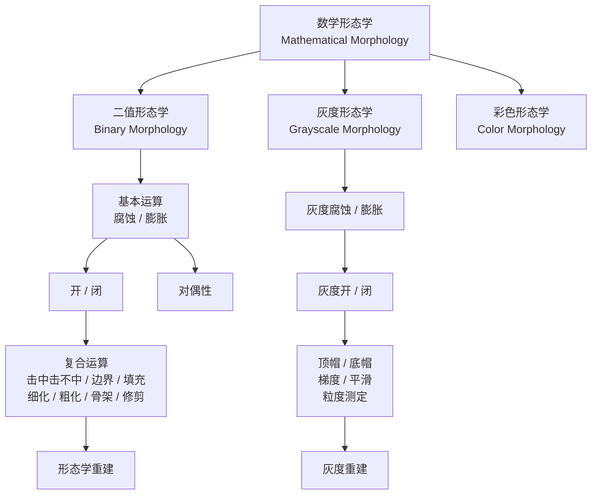

**形态学与其他图像处理方法的关系**：

| 特征 | 线性滤波（卷积） | 形态学运算 |
|---|---|---|
| 数学基础 | 卷积 / 相关 | 集合运算 / 极值运算 |
| 运算性质 | 线性、可加 | 非线性、不可加 |
| 核的作用 | 加权求和 | 形状匹配 / 极值比较 |
| 对边缘的态度 | 模糊边缘 | 保持或增强边缘 |
| 对噪声的态度 | 平滑噪声 | 可选择性去除或保留 |
| 典型用途 | 去噪、模糊、特征提取 | 形状分析、去噪、分割、边缘检测 |

---

## 2. 数学基础：集合论与二值图像

### 2.1 二值图像的集合表示

在二值形态学中，一幅二值图像被表示为像素坐标的集合。设图像域为
$E \subseteq \mathbb{Z}^2$，则：

$$
A = \{ \mathbf{z} \in E \mid I(\mathbf{z}) = 1 \}
$$

其中：

- $A$：前景像素集合（值为 1 的像素坐标集合）。
- $\mathbf{z} = (x, y)$：像素坐标。
- $I(\mathbf{z})$：二值图像在 $\mathbf{z}$ 处的值（0 或 1）。
- $E$：图像的整个定义域（所有像素坐标）。
- 整体含义：二值图像 = 前景像素坐标的集合，背景为 $E \setminus A$（补集）。

### 2.2 集合的基本运算

形态学建立在以下集合运算之上：

| 运算 | 符号 | 定义 | 含义 |
|---|---|---|---|
| 并集 | $A \cup B$ | $\{z \mid z \in A \text{ 或 } z \in B\}$ | 属于 A 或 B 的所有元素 |
| 交集 | $A \cap B$ | $\{z \mid z \in A \text{ 且 } z \in B\}$ | 同时属于 A 和 B 的元素 |
| 补集 | $A^c$ | $\{z \in E \mid z \notin A\}$ | 不属于 A 的元素（背景） |
| 差集 | $A - B$ | $\{z \mid z \in A, z \notin B\} = A \cap B^c$ | 属于 A 但不属于 B |
| 反射 | $\check{B}$ | $\{z \mid -z \in B\}$ | B 关于原点的镜像 |
| 平移 | $(A)_\mathbf{z}$ | $\{a + \mathbf{z} \mid a \in A\}$ | A 整体移动 $\mathbf{z}$ |

**反射与平移的示意**：

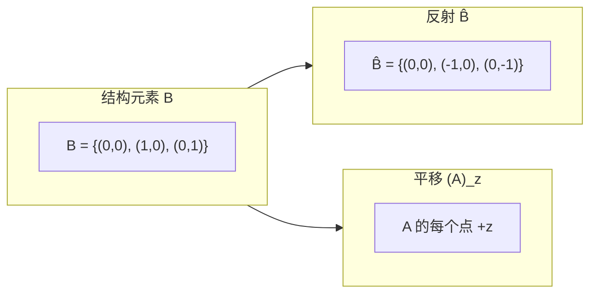

### 2.3 德摩根定律（形态学对偶性的基础）

$$
(A \cup B)^c = A^c \cap B^c
$$

$$
(A \cap B)^c = A^c \cup B^c
$$

这两个定律是形态学中**对偶性（duality）** 的数学根源：腐蚀与膨胀、开与闭之间
都存在互补的对偶关系。

---

## 3. 结构元素（Structuring Element）

### 3.1 定义与作用

**结构元素（Structuring Element, SE）** 是形态学运算的"探针"。它是一个小的
二值形状集合，决定了形态学运算的几何行为。

$$
B \subseteq \mathbb{Z}^2
$$

其中：

- $B$：结构元素，一个小的像素坐标集合。
- 结构元素必须指定一个**原点（origin）**，通常取其几何中心。
- 结构元素的形状、大小、原点位置共同决定了运算的效果。

**结构元素的作用**：

| 属性 | 影响 |
|---|---|
| 形状（矩形/十字/椭圆/自定义） | 决定提取或抑制的几何方向 |
| 大小 | 决定作用范围：越大影响范围越广 |
| 原点位置 | 决定平移方向和对称性 |
| 是否对称 | 影响腐蚀与膨胀是否互为精确对偶 |

### 3.2 常见结构元素形状

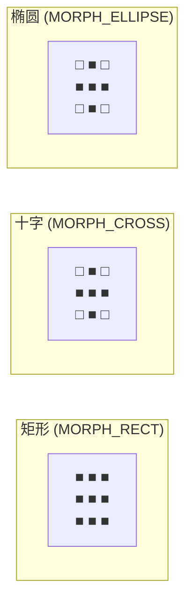

> **注意**：3×3 时十字与椭圆形状相同，差异在更大尺寸时才显现。
> 椭圆在 5×5 时为菱形，在更大时趋近圆。

### 3.3 结构元素的选择原则

| 选择因素 | 建议 |
|---|---|
| 去除小噪声 | 略大于噪声的结构元素 |
| 连接断裂区域 | 略大于断裂间距的结构元素 |
| 保持方向特征 | 沿特征方向选择线段形 SE |
| 各向同性处理 | 圆形/椭圆形 SE |
| 计算效率 | 矩形 SE 最快（可分解），椭圆最慢 |

---

# 第二部分 二值形态学基本运算

## 4. 腐蚀（Erosion）

### 4.1 定义

腐蚀是形态学最基础的运算之一。其几何含义是：**结构元素 $B$ 能完全放入 $A$ 中时，
原点所在的位置集合。**

$$
A \ominus B = \{ z \mid (B)_z \subseteq A \}
$$

其中：

- $A$：输入二值图像的前景集合。
- $B$：结构元素（含原点）。
- $(B)_z$：将 $B$ 平移到点 $z$。
- $\subseteq$：子集关系，即平移后的 $B$ 完全落在 $A$ 内。
- 整体含义：腐蚀结果 = 所有使 $B$ 平移后仍完全包含在 $A$ 中的原点位置 $z$ 的集合。

等价的逐像素定义：

$$
(A \ominus B)(z) = \bigwedge_{b \in B} A(z + b)
$$

其中 $\bigwedge$ 表示逻辑与（取最小值），即 $B$ 覆盖的所有像素必须全为前景。

### 4.2 几何直觉

腐蚀的效果是**缩小**前景区域：

- 边界向内收缩，收缩程度由 $B$ 的大小和形状决定。
- 小于 $B$ 的前景区域会被完全消除。
- 细窄连接处会被断开。

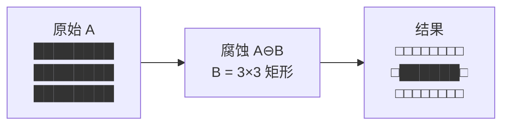

### 4.3 用途

| 用途 | 说明 |
|---|---|
| 去除小噪声 | 小于 SE 的孤立前景点被消除 |
| 断开连接 | 细窄桥接处被断开，分离粘连物体 |
| 收缩边界 | 提取内部区域、计算骨架前置 |
| 消除毛刺 | 去除目标边缘的细小突起 |
| 配合膨胀 | 构成开运算、闭运算 |

### 4.4 OpenCV 代码

```python
import cv2
import numpy as np

# 读取图像并二值化
img = cv2.imread('image.png', cv2.IMREAD_GRAYSCALE)
_, binary = cv2.threshold(img, 127, 255, cv2.THRESH_BINARY)

# 创建 3×3 矩形结构元素
kernel = cv2.getStructuringElement(cv2.MORPH_RECT, (3, 3))
# kernel = np.array([[1,1,1],
#                    [1,1,1],
#                    [1,1,1]], dtype=np.uint8)

# 腐蚀
eroded = cv2.erode(binary, kernel, iterations=1)

# iterations 控制重复次数：iterations=3 等价于连续腐蚀 3 次
# 等价于用 7×7 结构元素腐蚀 1 次（仅对矩形 SE 成立）
eroded_3x = cv2.erode(binary, kernel, iterations=3)
```

---

## 5. 膨胀（Dilation）

### 5.1 定义

膨胀是腐蚀的对偶运算。其几何含义是：**结构元素 $B$ 的反射 $\check{B}$ 与 $A$ 有交集时，
原点所在的位置集合。**

$$
A \oplus B = \{ z \mid (\check{B})_z \cap A \neq \emptyset \}
$$

其中：

- $A$：输入二值图像的前景集合。
- $B$：结构元素。
- $\check{B}$：$B$ 关于原点的反射（镜像）。
- $(\check{B})_z$：将 $\check{B}$ 平移到点 $z$。
- $\cap$：交集。
- $\neq \emptyset$：非空，即至少有一个像素重叠。
- 整体含义：膨胀结果 = 所有使 $\check{B}$ 平移后与 $A$ 至少有一个像素重叠的位置 $z$ 的集合。

等价的逐像素定义：

$$
(A \oplus B)(z) = \bigvee_{b \in B} A(z - b)
$$

其中 $\bigvee$ 表示逻辑或（取最大值），即 $B$ 覆盖范围内只要有任一前景像素，结果即为前景。

> **当 $B$ 关于原点对称时**（即 $\check{B} = B$），反射可省略，膨胀简化为：
> $A \oplus B = \{ z \mid (B)_z \cap A \neq \emptyset \}$

### 5.2 几何直觉

膨胀的效果是**扩大**前景区域：

- 边界向外扩张，扩张程度由 $B$ 的大小和形状决定。
- 填充前景内部的小孔洞。
- 连接邻近但分离的前景区域。

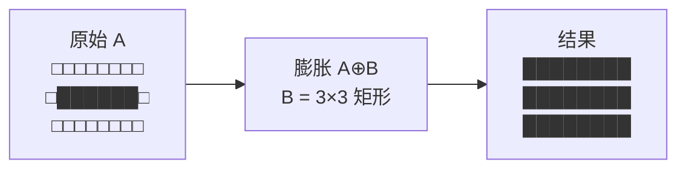

### 5.3 用途

| 用途 | 说明 |
|---|---|
| 填充孔洞 | 填补目标内部的小空洞 |
| 连接断裂 | 连接邻近的断裂区域 |
| 扩大边界 | 扩展目标区域，用于区域生长 |
| 桥接文字 | 修复断裂的文字笔画 |
| 配合腐蚀 | 构成开运算、闭运算 |

### 5.4 OpenCV 代码

```python
import cv2
import numpy as np

img = cv2.imread('image.png', cv2.IMREAD_GRAYSCALE)
_, binary = cv2.threshold(img, 127, 255, cv2.THRESH_BINARY)

# 创建 5×5 椭圆结构元素
kernel = cv2.getStructuringElement(cv2.MORPH_ELLIPSE, (5, 5))
# kernel = np.array([[0,0,1,0,0],
#                    [1,1,1,1,1],
#                    [1,1,1,1,1],
#                    [1,1,1,1,1],
#                    [0,0,1,0,0]], dtype=np.uint8)

# 膨胀
dilated = cv2.dilate(binary, kernel, iterations=1)

# 十字结构元素
cross_kernel = cv2.getStructuringElement(cv2.MORPH_CROSS, (5, 5))
dilated_cross = cv2.dilate(binary, cross_kernel, iterations=1)
```

---

## 6. 对偶性

### 6.1 腐蚀与膨胀的对偶关系

腐蚀和膨胀关于集合补集互为对偶：

$$
(A \ominus B)^c = A^c \oplus \check{B}
$$

$$
(A \oplus B)^c = A^c \ominus \check{B}
$$

其中：

- $A^c$：$A$ 的补集（即背景）。
- $\check{B}$：$B$ 的反射。
- 整体含义：对前景的腐蚀 = 对背景的膨胀（用反射后的 SE），反之亦然。

### 6.2 对偶性的实际意义

| 性质 | 含义 |
|---|---|
| 腐蚀前景 = 膨胀背景 | 缩小白色区域等价于扩大黑色区域 |
| 膨胀前景 = 腐蚀背景 | 扩大白色区域等价于缩小黑色区域 |
| 对称 SE 时简化 | $\check{B} = B$，反射可省略 |

> **注意**：对偶性要求 SE 关于原点对称。若 SE 不对称，腐蚀与膨胀不再严格对偶，
> 需要显式使用反射 $\check{B}$。

### 6.3 腐蚀与膨胀的性质

| 性质 | 腐蚀 $\ominus$ | 膨胀 $\oplus$ |
|---|---|---|
| 单调性 | $A \subseteq C \Rightarrow A \ominus B \subseteq C \ominus B$ | $A \subseteq C \Rightarrow A \oplus B \subseteq C \oplus B$ |
| 扩展性 | $A \ominus B \subseteq A$（当原点 $\in B$） | $A \subseteq A \oplus B$（当原点 $\in B$） |
| 分配律（对并） | $(A \cup C) \ominus B \supseteq (A \ominus B) \cup (C \ominus B)$ | $(A \cup C) \oplus B = (A \oplus B) \cup (C \oplus B)$ |
| 分配律（对交） | $(A \cap C) \ominus B = (A \ominus B) \cap (C \ominus B)$ | $(A \cap C) \oplus B \subseteq (A \oplus B) \cap (C \oplus B)$ |
| 对 SE 的单调性 | $B \subseteq C \Rightarrow A \ominus B \supseteq A \ominus C$ | $B \subseteq C \Rightarrow A \oplus B \subseteq A \oplus C$ |
| 平移不变性 | $(A)_z \ominus B = (A \ominus B)_z$ | $(A)_z \oplus B = (A \oplus B)_z$ |

---

## 7. 开运算（Opening）

### 7.1 定义

开运算是**先腐蚀后膨胀**的复合运算：

$$
A \circ B = (A \ominus B) \oplus B
$$

其中：

- $A$：输入二值图像的前景集合。
- $B$：结构元素。
- $A \ominus B$：先用 $B$ 腐蚀 $A$。
- $(\cdot) \oplus B$：再用 $B$ 膨胀腐蚀结果。
- 整体含义：开运算 = 腐蚀（去除小物体）+ 膨胀（恢复大物体尺寸）。

### 7.2 等价定义

开运算有一个重要的等价表述——**所有能放入 $A$ 中的 $B$ 的平移的并集**：

$$
A \circ B = \bigcup \{ (B)_z \mid (B)_z \subseteq A \}
$$

其中：

- $(B)_z$：将 $B$ 平移到 $z$。
- $(B)_z \subseteq A$：平移后的 $B$ 完全包含在 $A$ 中。
- $\bigcup$：取所有满足条件的平移的并集。
- 整体含义：开运算保留了所有"能被 $B$ 完全填入"的区域，丢弃了"填不进去"的部分。

这个等价定义揭示了开运算的本质：**它是一种形状滤波器，只保留能容纳 SE 的结构。**

### 7.3 几何直觉

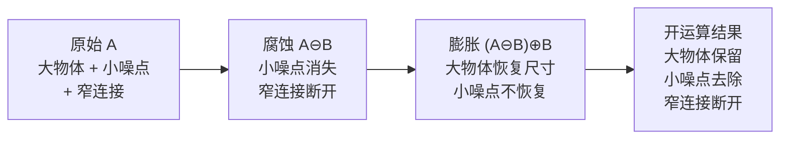

### 7.4 性质

| 性质 | 公式 | 含义 |
|---|---|---|
| 等幂性 | $(A \circ B) \circ B = A \circ B$ | 多次开运算 = 一次开运算 |
| 反扩展性 | $A \circ B \subseteq A$ | 开运算不会使前景变大 |
| 单调性 | $A \subseteq C \Rightarrow A \circ B \subseteq C \circ B$ | 开运算是单调的 |
| 平移不变性 | $(A)_z \circ B = (A \circ B)_z$ | 平移后再开 = 开后再平移 |

### 7.5 用途

| 用途 | 说明 |
|---|---|
| 去除小噪声 | 消除比 SE 小的前景点 |
| 断开窄连接 | 分离由细线连接的物体 |
| 平滑边界 | 去除边界上的小突起 |
| 形状滤波 | 只保留能容纳 SE 的物体 |

### 7.6 OpenCV 代码

```python
import cv2
import numpy as np

img = cv2.imread('image.png', cv2.IMREAD_GRAYSCALE)
_, binary = cv2.threshold(img, 127, 255, cv2.THRESH_BINARY)

kernel = cv2.getStructuringElement(cv2.MORPH_RECT, (5, 5))

# 方式一：使用 morphologyEx
opened = cv2.morphologyEx(binary, cv2.MORPH_OPEN, kernel)

# 方式二：手动组合
eroded = cv2.erode(binary, kernel)
opened_manual = cv2.dilate(eroded, kernel)

# 两次开运算（等幂性验证）
opened_twice = cv2.morphologyEx(opened, cv2.MORPH_OPEN, kernel)
# opened_twice 应与 opened 相同
```

---

## 8. 闭运算（Closing）

### 8.1 定义

闭运算是**先膨胀后腐蚀**的复合运算，是开运算的对偶：

$$
A \bullet B = (A \oplus B) \ominus B
$$

其中：

- $A$：输入二值图像的前景集合。
- $B$：结构元素。
- $A \oplus B$：先用 $B$ 膨胀 $A$。
- $(\cdot) \ominus B$：再用 $B$ 腐蚀膨胀结果。
- 整体含义：闭运算 = 膨胀（填充小孔洞、连接断裂）+ 腐蚀（恢复大物体尺寸）。

### 8.2 对偶关系

开运算与闭运算关于补集互为对偶：

$$
(A \circ B)^c = A^c \bullet \check{B}
$$

$$
(A \bullet B)^c = A^c \circ \check{B}
$$

其中：

- $A^c$：$A$ 的补集（背景）。
- $\check{B}$：$B$ 的反射。
- 整体含义：对前景的开运算 = 对背景的闭运算（用反射 SE），反之亦然。

### 8.3 几何直觉

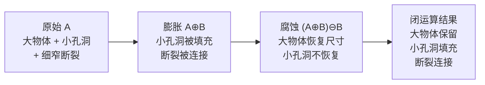

### 8.4 性质

| 性质 | 公式 | 含义 |
|---|---|---|
| 等幂性 | $(A \bullet B) \bullet B = A \bullet B$ | 多次闭运算 = 一次闭运算 |
| 扩展性 | $A \subseteq A \bullet B$ | 闭运算不会使前景变小 |
| 单调性 | $A \subseteq C \Rightarrow A \bullet B \subseteq C \bullet B$ | 闭运算是单调的 |
| 平移不变性 | $(A)_z \bullet B = (A \bullet B)_z$ | 平移后再闭 = 闭后再平移 |

### 8.5 用途

| 用途 | 说明 |
|---|---|
| 填充小孔洞 | 填补目标内部比 SE 小的空洞 |
| 连接断裂 | 连接邻近的断裂区域 |
| 平滑边界 | 填充边界上的小凹陷 |
| 去除暗噪声 | 在灰度图像中去除暗的小目标 |

### 8.6 OpenCV 代码

```python
import cv2
import numpy as np

img = cv2.imread('image.png', cv2.IMREAD_GRAYSCALE)
_, binary = cv2.threshold(img, 127, 255, cv2.THRESH_BINARY)

kernel = cv2.getStructuringElement(cv2.MORPH_ELLIPSE, (7, 7))

# 闭运算
closed = cv2.morphologyEx(binary, cv2.MORPH_CLOSE, kernel)

# 多次迭代（注意：iterations 参数对开闭运算不等价于多次独立开闭）
# 如需多次闭运算，需手动循环
closed_2x = cv2.morphologyEx(
    cv2.morphologyEx(binary, cv2.MORPH_CLOSE, kernel),
    cv2.MORPH_CLOSE, kernel
)
```

---

## 9. 开闭运算的性质与对比

### 9.1 对比表

| 特征 | 开运算 $A \circ B$ | 闭运算 $A \bullet B$ |
|---|---|---|
| 操作顺序 | 先腐蚀后膨胀 | 先膨胀后腐蚀 |
| 大小变化 | 缩小或不变（反扩展） | 扩大或不变（扩展） |
| 作用对象 | 去除前景中的小结构 | 填充背景中的小结构 |
| 等幂性 | ✓ | ✓ |
| 对偶关系 | $(A \circ B)^c = A^c \bullet \check{B}$ | $(A \bullet B)^c = A^c \circ \check{B}$ |
| 典型用途 | 去噪、断开连接、形状滤波 | 填孔、连接断裂、平滑凹陷 |

### 9.2 开闭运算的组合

开运算和闭运算常组合使用，以达到更全面的平滑效果：

| 组合 | 公式 | 效果 |
|---|---|---|
| 先开后闭 | $(A \circ B) \bullet B$ | 去除亮噪声 + 填充暗孔洞 |
| 先闭后开 | $(A \bullet B) \circ B$ | 填充暗孔洞 + 去除亮噪声 |
| 交替顺序滤波 | $(((A \circ B_1) \bullet B_1) \circ B_2) \bullet B_2$ | 多尺度平滑 |

```python
# 先开后闭
opened = cv2.morphologyEx(binary, cv2.MORPH_OPEN, kernel)
open_close = cv2.morphologyEx(opened, cv2.MORPH_CLOSE, kernel)

# 先闭后开
closed = cv2.morphologyEx(binary, cv2.MORPH_CLOSE, kernel)
close_open = cv2.morphologyEx(closed, cv2.MORPH_OPEN, kernel)
```

---

# 第三部分 二值形态学复合运算

## 10. 击中击不中变换（Hit-or-Miss）

### 10.1 定义

击中击不中变换是一种**模板匹配**运算，它同时检测前景和背景的特定模式。
它使用一对结构元素 $B_1$（前景模板）和 $B_2$（背景模板）：

$$
A \otimes B = (A \ominus B_1) \cap (A^c \ominus B_2)
$$

其中：

- $A$：输入二值图像的前景集合。
- $A^c$：$A$ 的补集（背景）。
- $B_1$：前景结构元素，定义"必须命中"的前景模式。
- $B_2$：背景结构元素，定义"必须命中"的背景模式。
- $B = (B_1, B_2)$：复合结构元素对。
- $A \ominus B_1$：$B_1$ 能完全放入 $A$ 中的位置（前景匹配）。
- $A^c \ominus B_2$：$B_2$ 能完全放入背景中的位置（背景匹配）。
- $\cap$：取交集，即同时满足前景和背景匹配的位置。
- 整体含义：击中击不中 = 前景匹配 AND 背景匹配，找到同时满足特定前景和背景模式的精确位置。

### 10.2 几何直觉

击中击不中变换的本质是**精确形状匹配**：

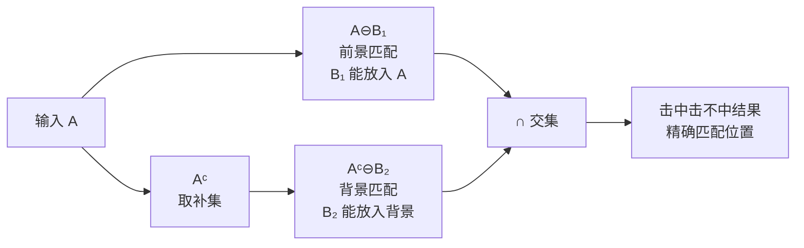

### 10.3 用途

| 用途 | 说明 |
|---|---|
| 角点检测 | 用角点形状的 SE 对检测角点 |
| 模板匹配 | 检测特定形状的精确位置 |
| 目标定位 | 在图像中定位特定模式 |
| 细化/粗化的基础 | 细化和粗化运算通过击中击不中定义 |

### 10.4 OpenCV 代码

```python
import cv2
import numpy as np

img = cv2.imread('image.png', cv2.IMREAD_GRAYSCALE)
_, binary = cv2.threshold(img, 127, 255, cv2.THRESH_BINARY)

# OpenCV 中击中击不中变换使用 MORPH_HITMISS
# 结构元素中：1=前景必须存在，-1=背景必须存在，0=不关心

# 示例：检测孤立的前景像素（上、下、左、右均为背景）
kernel = np.array([
    [ 0, -1,  0],
    [-1,  1, -1],
    [ 0, -1,  0]
], dtype=np.int32)

hitmiss = cv2.morphologyEx(binary, cv2.MORPH_HITMISS, kernel)

# 示例：检测右下角点
# 前景在左上方，背景在右下方
corner_kernel = np.array([
    [ 1,  1,  0],
    [ 1, -1, -1],
    [ 0, -1,  0]
], dtype=np.int32)

corners = cv2.morphologyEx(binary, cv2.MORPH_HITMISS, corner_kernel)
```

---

## 11. 边界提取（Boundary Extraction）

### 11.1 定义

边界提取利用腐蚀缩小前景，然后用原图减去腐蚀结果，得到边界：

$$
\beta(A) = A - (A \ominus B)
$$

其中：

- $A$：输入二值图像的前景集合。
- $A \ominus B$：用 $B$ 腐蚀 $A$，得到内部区域。
- $-$：集合差，$A - (A \ominus B) = A \cap (A \ominus B)^c$。
- 整体含义：边界 = 原图减去腐蚀后的内部，即被腐蚀掉的外层像素。

### 11.2 几何直觉

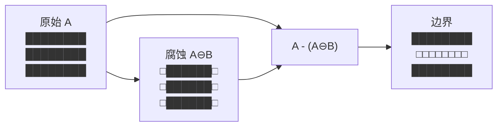

### 11.3 边界宽度

边界宽度由结构元素 $B$ 的大小决定：

- $B$ 为 $3 \times 3$ 矩形 → 边界宽度为 1 像素
- $B$ 为 $5 \times 5$ 矩形 → 边界宽度为 2 像素
- $B$ 为 $(2k+1) \times (2k+1)$ 矩形 → 边界宽度为 $k$ 像素

### 11.4 OpenCV 代码

```python
import cv2
import numpy as np

img = cv2.imread('image.png', cv2.IMREAD_GRAYSCALE)
_, binary = cv2.threshold(img, 127, 255, cv2.THRESH_BINARY)

kernel = cv2.getStructuringElement(cv2.MORPH_RECT, (3, 3))

# 边界提取 = 原图 - 腐蚀
eroded = cv2.erode(binary, kernel)
boundary = binary - eroded
# 或使用 cv2.subtract
boundary = cv2.subtract(binary, eroded)

# 也可以用膨胀版本：膨胀 - 原图（外边界）
dilated = cv2.dilate(binary, kernel)
outer_boundary = cv2.subtract(dilated, binary)

# 形态学梯度（内+外边界）
gradient = cv2.morphologyEx(binary, cv2.MORPH_GRADIENT, kernel)
```

---

## 12. 区域填充（Region Filling）

### 12.1 定义

区域填充用于填充二值图像中目标内部的孔洞。它基于膨胀与交集的迭代过程：

$$
X_k = (X_{k-1} \oplus B) \cap A^c, \quad k = 1, 2, 3, \ldots
$$

迭代直到 $X_k = X_{k-1}$，则填充结果为：

$$
F = A \cup X_k
$$

其中：

- $A$：输入二值图像的前景集合（含边界，内部有孔洞）。
- $A^c$：$A$ 的补集（背景，包含孔洞区域）。
- $X_0$：初始集合，从孔洞内部的一个点开始。
- $B$：结构元素（通常为 $3 \times 3$ 十字形）。
- $X_{k-1} \oplus B$：膨胀上一步的结果。
- $\cap A^c$：与背景取交集，限制膨胀不越过边界。
- 整体含义：从孔洞内部一个种子点出发，反复膨胀并限制在背景内，直到填满整个孔洞。

### 12.2 算法步骤

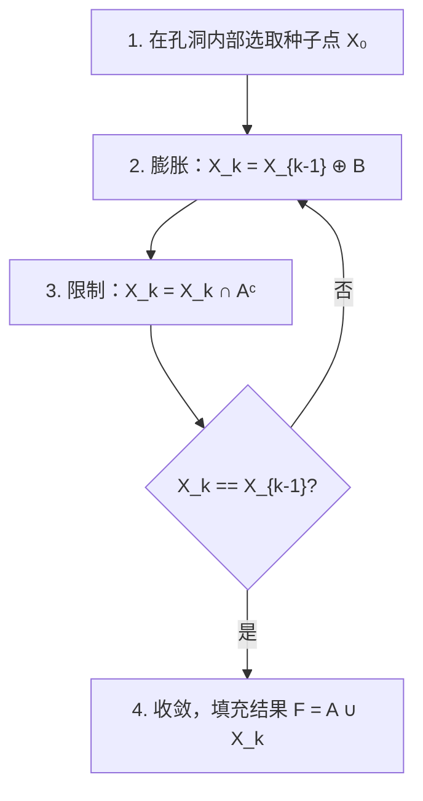

### 12.3 OpenCV 代码

```python
import cv2
import numpy as np

img = cv2.imread('image.png', cv2.IMREAD_GRAYSCALE)
_, binary = cv2.threshold(img, 127, 255, cv2.THRESH_BINARY)

# 方法一：闭运算填充（简单但粗糙，仅适用于小孔洞）
# 注意：闭运算可能连接邻近物体，不适用于复杂场景
filled = cv2.morphologyEx(binary, cv2.MORPH_CLOSE,
    cv2.getStructuringElement(cv2.MORPH_RECT, (15, 15)))

# 方法二：基于 floodFill 的孔洞填充（推荐，精确）
def fill_holes(binary_img):
    # 复制图像
    floodfilled = binary_img.copy()
    h, w = binary_img.shape[:2]
    mask = np.zeros((h + 2, w + 2), dtype=np.uint8)
    # 从边缘开始 floodFill，填充背景
    cv2.floodFill(floodfilled, mask, (0, 0), 255)
    # 取反得到孔洞
    holes = cv2.bitwise_not(floodfilled)
    # 合并
    return cv2.bitwise_or(binary_img, holes)

filled = fill_holes(binary)
```

---

## 13. 连通分量提取（Connected Components）

### 13.1 定义

连通分量提取用于标记和分离二值图像中各个独立的连通区域。形态学方法基于
膨胀与交集的迭代：

$$
X_k = (X_{k-1} \oplus B) \cap A, \quad k = 1, 2, 3, \ldots
$$

迭代直到 $X_k = X_{k-1}$，则 $X_k$ 即为包含种子点 $X_0$ 的连通分量。

其中：

- $A$：输入二值图像的前景集合。
- $X_0$：初始种子点，位于目标连通分量内。
- $B$：结构元素（通常为 $3 \times 3$ 十字形，定义连通性）。
- $X_{k-1} \oplus B$：膨胀上一步的结果。
- $\cap A$：与原图取交集，限制膨胀在前景内。
- 整体含义：从种子点出发，反复膨胀并限制在前景内，直到填满整个连通区域。

### 13.2 与区域填充的对比

| 特征 | 区域填充 | 连通分量提取 |
|---|---|---|
| 种子点位置 | 孔洞内部（背景中） | 目标内部（前景中） |
| 交集限制 | $\cap A^c$（限制在背景） | $\cap A$（限制在前景） |
| 目的 | 填充孔洞 | 提取连通区域 |

### 13.3 OpenCV 代码

```python
import cv2
import numpy as np

img = cv2.imread('image.png', cv2.IMREAD_GRAYSCALE)
_, binary = cv2.threshold(img, 127, 255, cv2.THRESH_BINARY)

# 方法一：connectedComponents（标记连通区域）
num_labels, labels = cv2.connectedComponents(binary, connectivity=8)
# num_labels: 连通分量数（含背景）
# labels: 与原图同大小的标记图，每个连通区域有唯一标签

# 方法二：connectedComponentsWithStats（含统计信息）
num_labels, labels, stats, centroids = cv2.connectedComponentsWithStats(
    binary, connectivity=8
)
# stats[i] = [x, y, width, height, area] 第 i 个连通分量的外接矩形和面积
# centroids[i] = [cx, cy] 第 i 个连通分量的质心

# 过滤小区域
min_area = 100
for i in range(1, num_labels):  # 跳过背景（标签 0）
    if stats[i, cv2.CC_STAT_AREA] < min_area:
        labels[labels == i] = 0

# 转回二值图
filtered = (labels > 0).astype(np.uint8) * 255
```

---

## 14. 凸壳（Convex Hull）

### 14.1 定义

集合 $A$ 的**凸壳** $C(A)$ 是包含 $A$ 的最小凸集。形态学方法通过迭代膨胀和交集
来逼近凸壳：

$$
X_k^i = (X_{k-1}^i \oplus B^i) \cap A, \quad i = 1, 2, 3, 4
$$

其中 $B^i$ 是四个方向的结构元素，最终凸壳为：

$$
C(A) = \bigcup_{i=1}^{4} D^i(A), \quad D^i(A) = \bigcup_k X_k^i
$$

### 14.2 OpenCV 代码

```python
import cv2
import numpy as np

img = cv2.imread('image.png', cv2.IMREAD_GRAYSCALE)
_, binary = cv2.threshold(img, 127, 255, cv2.THRESH_BINARY)

# 查找轮廓
contours, _ = cv2.findContours(binary, cv2.RETR_EXTERNAL, cv2.CHAIN_APPROX_SIMPLE)

# 对每个轮廓计算凸壳
result = np.zeros_like(binary)
for cnt in contours:
    hull = cv2.convexHull(cnt)
    cv2.drawContours(result, [hull], -1, 255, -1)  # -1 表示填充
```

---

## 15. 细化（Thinning）

### 15.1 定义

细化是一种逐步删除前景边界像素、同时保持目标拓扑结构（不断裂、不消失）的运算。
它基于击中击不中变换：

$$
\text{Thin}(A, B) = A - (A \otimes B) = A \cap (A \otimes B)^c
$$

其中：

- $A$：输入二值图像的前景集合。
- $A \otimes B$：击中击不中变换，找到匹配 $B$ 的边界像素。
- $A - (A \otimes B)$：从 $A$ 中删除匹配的像素。
- 整体含义：细化 = 删除击中击不中匹配到的边界像素。

实际使用中，细化通常使用一组（8 个）结构元素轮流迭代：

$$
\text{Thin}(A, \{B\}) = \bigcirc_{i=1}^{8} \text{Thin}(A, B_i)
$$

其中 $\bigcirc$ 表示轮流应用，直到收敛。

### 15.2 用途

| 用途 | 说明 |
|---|---|
| 骨架提取 | 将物体细化为单像素宽的骨架 |
| 字符识别 | 细化文字笔画，提取结构特征 |
| 指纹识别 | 细化指纹纹路 |
| 形状分析 | 简化形状为拓扑等价的细线 |

### 15.3 OpenCV 代码

```python
import cv2
import numpy as np

img = cv2.imread('image.png', cv2.IMREAD_GRAYSCALE)
_, binary = cv2.threshold(img, 127, 255, cv2.THRESH_BINARY)

# OpenCV 的 thinning 需要借助 ximgproc 扩展模块
# 或手动实现 Zhang-Suen 细化算法

def zhang_suen_thinning(image):
    """Zhang-Suen 细化算法"""
    img = image.copy() // 255
    changing = True
    while changing:
        changing = False
        # 两个子迭代
        for step in [1, 2]:
            to_remove = []
            rows, cols = img.shape
            for i in range(1, rows - 1):
                for j in range(1, cols - 1):
                    if img[i, j] != 1:
                        continue
                    # P2, P3, ..., P9 (顺时针)
                    p2 = img[i-1, j]
                    p3 = img[i-1, j+1]
                    p4 = img[i, j+1]
                    p5 = img[i+1, j+1]
                    p6 = img[i+1, j]
                    p7 = img[i+1, j-1]
                    p8 = img[i, j-1]
                    p9 = img[i-1, j-1]
                    neighbors = [p2, p3, p4, p5, p6, p7, p8, p9]

                    # 条件 A: 2 <= B(P1) <= 6
                    bp = sum(neighbors)
                    if bp < 2 or bp > 6:
                        continue

                    # 条件 B: A(P1) = 1 (顺时针 0→1 转换次数)
                    ap = 0
                    for k in range(len(neighbors)):
                        if neighbors[k] == 0 and neighbors[(k+1) % len(neighbors)] == 1:
                            ap += 1
                    if ap != 1:
                        continue

                    # 条件 C 和 D 随子迭代变化
                    if step == 1:
                        if p2 * p4 * p6 != 0:
                            continue
                        if p4 * p6 * p8 != 0:
                            continue
                    else:
                        if p2 * p4 * p8 != 0:
                            continue
                        if p2 * p6 * p8 != 0:
                            continue

                    to_remove.append((i, j))

            for (i, j) in to_remove:
                img[i, j] = 0
                changing = True

    return (img * 255).astype(np.uint8)

thinned = zhang_suen_thinning(binary)

# 如果安装了 opencv-contrib-python
# from cv2.ximgproc import thinning
# thinned = thinning(binary, thinningType=cv2.ximgproc.THINNING_ZHANGSUEN)
```

---

## 16. 粗化（Thickening）

### 16.1 定义

粗化是细化的对偶运算，它通过击中击不中变换向前景添加像素：

$$
\text{Thick}(A, B) = A \cup (A \otimes B)
$$

其中：

- $A$：输入二值图像的前景集合。
- $A \otimes B$：击中击不中变换，找到匹配的背景模式。
- $\cup$：取并集，将匹配位置加入前景。
- 整体含义：粗化 = 在击中击不中匹配到的位置添加前景像素。

### 16.2 与细化的关系

粗化与细化互为对偶：

$$
(\text{Thick}(A, B))^c = \text{Thin}(A^c, \check{B})
$$

即：对前景的粗化 = 对背景的细化（用反射 SE）。

### 16.3 实际替代

在实际应用中，粗化通常通过**对补集做细化再取补**来实现，因为细化算法更成熟：

$$
\text{Thick}(A, B) = \big( \text{Thin}(A^c, B) \big)^c
$$

### 16.4 OpenCV 代码

```python
import cv2
import numpy as np

img = cv2.imread('image.png', cv2.IMREAD_GRAYSCALE)
_, binary = cv2.threshold(img, 127, 255, cv2.THRESH_BINARY)

# 粗化 = 对补集细化后取补
complement = cv2.bitwise_not(binary)
# 使用细化函数（见 15.3 节）
# thinned_complement = zhang_suen_thinning(complement)
# thickened = cv2.bitwise_not(thinned_complement)

# 简单替代：使用膨胀
kernel = cv2.getStructuringElement(cv2.MORPH_CROSS, (3, 3))
thickened = cv2.dilate(binary, kernel, iterations=1)
```

---

## 17. 骨架化（Skeletonization / Medial Axis）

### 17.1 定义

骨架（skeleton）是物体的一种细化的、拓扑等价的表示。形态学骨架通过迭代
腐蚀和开运算来定义：

$$
S(A) = \bigcup_{k=0}^{K} \left[ (A \ominus kB) - (A \ominus kB) \circ B \right]
$$

其中：

- $A$：输入二值图像的前景集合。
- $kB$：结构元素 $B$ 膨胀 $k$ 次（即 $B \oplus B \oplus \cdots \oplus B$，$k$ 次）。
- $A \ominus kB$：用 $kB$ 腐蚀 $A$，得到第 $k$ 层内部。
- $(A \ominus kB) \circ B$：对腐蚀结果做开运算，去除小突起。
- $K$：最大腐蚀次数，即 $A \ominus KB = \emptyset$ 时的 $K$。
- $\bigcup$：取所有层的并集。
- 整体含义：骨架 = 各层腐蚀结果减去其开运算（去除非骨架部分）的并集。

### 17.2 骨架的重建

骨架可以通过各层信息的并集重建原图：

$$
A = \bigcup_{k=0}^{K} (S_k(A) \oplus kB)
$$

其中 $S_k(A)$ 是第 $k$ 层骨架子集。

### 17.3 中轴变换（Medial Axis Transform, MAT）

中轴变换是另一种骨架定义：物体内部所有最大内切圆的圆心集合。

$$
\text{MAT}(A) = \{ z \mid \text{存在以 } z \text{ 为圆心的最大内切圆} \}
$$

骨架与中轴在概念上等价，但计算方法不同。

### 17.4 用途

| 用途 | 说明 |
|---|---|
| 形状表示 | 用细线表示物体拓扑结构 |
| 字符识别 | OCR 中提取笔画骨架 |
| 路径规划 | 从障碍物地图提取可通行路径 |
| 血管分析 | 提取血管树结构 |
| 指纹识别 | 细化指纹纹路用于特征点检测 |

### 17.5 OpenCV 代码

```python
import cv2
import numpy as np

img = cv2.imread('image.png', cv2.IMREAD_GRAYSCALE)
_, binary = cv2.threshold(img, 127, 255, cv2.THRESH_BINARY)

# 方法一：使用 Zhang-Suen 细化（见 15.3 节）
# skeleton = zhang_suen_thinning(binary)

# 方法二：形态学骨架算法
def morphological_skeleton(image, max_iter=100):
    img = image.copy()
    skeleton = np.zeros_like(image)
    kernel = cv2.getStructuringElement(cv2.MORPH_CROSS, (3, 3))

    for _ in range(max_iter):
        eroded = cv2.erode(img, kernel)
        opened = cv2.morphologyEx(eroded, cv2.MORPH_OPEN, kernel)
        skeleton = cv2.bitwise_or(skeleton, cv2.subtract(eroded, opened))
        img = eroded
        if cv2.countNonZero(img) == 0:
            break

    return skeleton

skeleton = morphological_skeleton(binary)

# 方法三：scikit-image 的 medial_axis
# from skimage.morphology import medial_axis
# skeleton, distance = medial_axis(binary, return_distance=True)
```

---

## 18. 修剪（Pruning）

### 18.1 定义

修剪用于去除骨架或细化结果中的短分支（毛刺）。它通过多次腐蚀去除端点，
然后恢复主干：

$$
\text{Prune}^{(k)}(A) = A \circ^{(k)} B
$$

具体步骤：

1. 对骨架 $A$ 腐蚀 $k$ 次（去除长度 $\leq k$ 的分支）
2. 用击中击不中变换检测端点 $X$
3. 对腐蚀结果膨胀并与端点取并集，恢复主干连接

$$
X_1 = A \circ^{(k)} B, \quad X_2 = \bigcup (X_1 \otimes B_{\text{end}}), \quad \text{result} = X_1 \cup X_2
$$

其中 $B_{\text{end}}$ 是端点检测的结构元素集合。

### 18.2 用途

| 用途 | 说明 |
|---|---|
| 骨架后处理 | 去除骨架化产生的短分支 |
| 去除毛刺 | 清除物体边缘的细小突起 |
| 路径优化 | 去除路径中的冗余短分支 |

### 18.3 OpenCV 代码

```python
import cv2
import numpy as np

# 假设 skeleton 是上一步得到的骨架图像
skeleton = cv2.imread('skeleton.png', cv2.IMREAD_GRAYSCALE)

# 修剪：多次腐蚀去除短分支，然后恢复
kernel = cv2.getStructuringElement(cv2.MORPH_CROSS, (3, 3))

# 腐蚀去除短分支
pruned = cv2.erode(skeleton, kernel, iterations=3)

# 检测端点（使用击中击不中）
# 端点结构元素：8 个方向
end_kernels = [
    np.array([[0,0,0],[0,1,0],[0,0,0]], dtype=np.int32),  # 占位
    # 实际需要 8 个方向的端点模板
]

# 简化版：直接用开运算修剪
pruned = cv2.morphologyEx(skeleton, cv2.MORPH_OPEN, kernel, iterations=2)
```

---

## 19. 形态学重建（Morphological Reconstruction）

### 19.1 定义

形态学重建是一种强大的迭代运算，它用一个**标记图像（marker）** $F$ 来
重建**掩膜图像（mask）** $G$ 中的连通区域。

**测地膨胀（Geodesic Dilation）**：

$$
D_G^{(1)}(F) = (F \oplus B) \cap G
$$

迭代测地膨胀：

$$
D_G^{(k)}(F) = D_G^{(1)}(D_G^{(k-1)}(F))
$$

**重建（Reconstruction by Dilation）**：

$$
R_G^D(F) = \lim_{k \to \infty} D_G^{(k)}(F)
$$

其中：

- $F$：标记图像（marker），指定重建的起始位置。
- $G$：掩膜图像（mask），限制重建范围。
- $F \subseteq G$：标记图像必须是掩膜图像的子集。
- $F \oplus B$：膨胀标记图像。
- $\cap G$：与掩膜取交集，限制膨胀不超出掩膜范围。
- 整体含义：从标记出发，反复膨胀并限制在掩膜内，直到收敛，提取掩膜中与标记连通的区域。

### 19.2 重建开运算（Opening by Reconstruction）

重建开运算比普通开运算更强大——它能**恢复被普通开运算破坏的形状**：

$$
O_R^{(k)}(F, G) = R_G^D\big( (F \ominus kB) \big)
$$

其中先用 $kB$ 腐蚀标记（去除小物体），再通过重建恢复幸存物体的完整形状。

### 19.3 用途

| 用途 | 说明 |
|---|---|
| 去除小物体 | 比开运算更好地保持物体形状 |
| 填充孔洞 | 从边界标记重建，填充内部孔洞 |
| 去除边界接触物体 | 从边界标记出发，提取接触边界的物体 |
| 分离粘连物体 | 结合距离变换和重建，分离粘连目标 |
| 文本提取 | 从字符标记重建完整文字行 |

### 19.4 OpenCV 代码

```python
import cv2
import numpy as np

img = cv2.imread('image.png', cv2.IMREAD_GRAYSCALE)
_, binary = cv2.threshold(img, 127, 255, cv2.THRESH_BINARY)

# OpenCV 没有直接的形态学重建函数，但可以用以下方式实现

# 1. 重建开运算（去除小物体但保持形状）
def opening_by_reconstruction(binary_img, kernel_size=(3, 3), erosion_iter=3):
    kernel = cv2.getStructuringElement(cv2.MORPH_RECT, kernel_size)
    # 腐蚀作为标记
    marker = cv2.erode(binary_img, kernel, iterations=erosion_iter)
    mask = binary_img.copy()

    # 迭代测地膨胀
    prev = np.zeros_like(binary_img)
    while True:
        marker = cv2.dilate(marker, kernel)
        marker = cv2.min(marker, mask)  # 与掩膜取交集
        if np.array_equal(marker, prev):
            break
        prev = marker.copy()

    return marker

reconstructed = opening_by_reconstruction(binary)

# 2. 填充孔洞（基于重建）
def fill_holes_reconstruction(binary_img):
    # 从边界开始作为标记
    h, w = binary_img.shape[:2]
    marker = np.zeros_like(binary_img)
    marker[0, :] = 255
    marker[-1, :] = 255
    marker[:, 0] = 255
    marker[:, -1] = 255

    mask = cv2.bitwise_not(binary_img)  # 掩膜 = 原图的补集
    kernel = cv2.getStructuringElement(cv2.MORPH_CROSS, (3, 3))

    prev = np.zeros_like(binary_img)
    while True:
        marker = cv2.dilate(marker, kernel)
        marker = cv2.min(marker, mask)
        if np.array_equal(marker, prev):
            break
        prev = marker.copy()

    # 填充结果 = 原图 ∪ (标记的补集)
    return cv2.bitwise_or(binary_img, cv2.bitwise_not(marker))

filled = fill_holes_reconstruction(binary)

# 3. 去除边界接触物体
def remove_border_objects(binary_img):
    h, w = binary_img.shape[:2]
    marker = np.zeros_like(binary_img)
    marker[0, :] = binary_img[0, :]
    marker[-1, :] = binary_img[-1, :]
    marker[:, 0] = binary_img[:, 0]
    marker[:, -1] = binary_img[:, -1]

    mask = binary_img.copy()
    kernel = cv2.getStructuringElement(cv2.MORPH_CROSS, (3, 3))

    prev = np.zeros_like(binary_img)
    while True:
        marker = cv2.dilate(marker, kernel)
        marker = cv2.min(marker, mask)
        if np.array_equal(marker, prev):
            break
        prev = marker.copy()

    # 去除边界接触物体 = 原图 - 重建结果
    return cv2.subtract(binary_img, marker)

cleaned = remove_border_objects(binary)
```

---

# 第四部分 灰度形态学

## 20. 灰度形态学基础

### 20.1 从二值到灰度

灰度形态学将二值形态学从集合运算推广到函数运算。在灰度形态学中：

- 图像被视为**二维函数** $f(x, y)$，而非集合。
- 结构元素也是一个**小函数** $b(x, y)$（称为"扁平结构元素"时为常数 0）。
- 集合的并/交被替换为**上确界/下确界**（sup/inf，即最大值/最小值）。

### 20.2 二值与灰度的对应关系

| 二值形态学 | 灰度形态学 | 数学对应 |
|---|---|---|
| 集合 $A$ | 函数 $f(x,y)$ | $A \leftrightarrow \{(x,y,f(x,y))\}$ |
| 并集 $\cup$ | 上确界 $\sup$ / $\max$ | $A \cup B \leftrightarrow \max(f, g)$ |
| 交集 $\cap$ | 下确界 $\inf$ / $\min$ | $A \cap B \leftrightarrow \min(f, g)$ |
| 补集 $A^c$ | 反转 $-f$ 或 $f_{\max} - f$ | $A^c \leftrightarrow f_{\max} - f$ |
| 腐蚀 $\ominus$ | 局部最小值 | $\inf$ over SE window |
| 膨胀 $\oplus$ | 局部最大值 | $\sup$ over SE window |

### 20.3 扁平与非扁平结构元素

| 类型 | 定义 | 特点 |
|---|---|---|
| 扁平（flat）SE | $b(x,y) = 0$ 在定义域内 | 仅做极值比较，计算快，最常用 |
| 非扁平（non-flat）SE | $b(x,y)$ 有高度变化 | 可做加权极值，类似加权滤波 |

> **本文后续公式均以扁平结构元素为例**，因为 OpenCV 的标准形态学函数
> 仅支持扁平结构元素。非扁平 SE 在 `scipy.ndimage` 中有支持。

### 20.4 灰度形态学的 Umbra（阴影）概念

灰度形态学的严格数学基础是**Umbra（阴影/下方区域）** 概念：

将灰度函数 $f(x,y)$ 视为三维空间中的曲面，其 Umbra 定义为曲面下方的所有点：

$$
U(f) = \{ (x, y, z) \mid z \leq f(x, y) \}
$$

其中：

- $f(x, y)$：灰度图像函数。
- $U(f)$：$f$ 的 Umbra，即曲面 $z = f(x, y)$ 下方的三维点集。
- 整体含义：灰度函数被转化为三维集合，从而可以直接应用二值形态学的集合运算。

灰度形态学运算 = 对 Umbra 做二值形态学运算 → 取上表面（top surface）：

$$
f \circledast b = \text{Top}\big( U(f) \circledast U(b) \big)
$$

其中 $\text{Top}(U) = \max \{ z \mid (x, y, z) \in U \}$。

---

## 21. 灰度腐蚀（Grayscale Erosion）

### 21.1 定义

灰度腐蚀是结构元素窗口内的**最小值**操作：

$$
(f \ominus b)(x, y) = \min_{(s, t) \in b} \big\{ f(x + s, y + t) \big\}
$$

其中：

- $f(x, y)$：输入灰度图像。
- $b$：扁平结构元素（定义了邻域窗口）。
- $(s, t)$：结构元素内的坐标偏移。
- $f(x + s, y + t)$：窗口内的像素值。
- $\min$：取窗口内所有像素的最小值。
- 整体含义：灰度腐蚀 = 在 SE 窗口内取最小值，效果是使亮区域收缩、暗区域扩张。

### 21.2 效果

| 效果 | 说明 |
|---|---|
| 亮区域收缩 | 高灰度区域被周围低灰度值"侵蚀" |
| 暗区域扩张 | 低灰度区域向高灰度区域蔓延 |
| 去除亮噪声 | 小的亮斑点（比 SE 小）被消除 |
| 边界内缩 | 前景（亮）边界向内收缩 |

### 21.3 OpenCV 代码

```python
import cv2
import numpy as np

img = cv2.imread('image.png', cv2.IMREAD_GRAYSCALE)

kernel = cv2.getStructuringElement(cv2.MORPH_RECT, (5, 5))

# 灰度腐蚀（与二值腐蚀使用相同的 API）
eroded = cv2.erode(img, kernel, iterations=1)

# 椭圆结构元素
ellip_kernel = cv2.getStructuringElement(cv2.MORPH_ELLIPSE, (7, 7))
eroded_ellip = cv2.erode(img, ellip_kernel)
```

---

## 22. 灰度膨胀（Grayscale Dilation）

### 22.1 定义

灰度膨胀是结构元素窗口内的**最大值**操作：

$$
(f \oplus b)(x, y) = \max_{(s, t) \in \check{b}} \big\{ f(x - s, y - t) \big\}
$$

其中：

- $f(x, y)$：输入灰度图像。
- $b$：扁平结构元素。
- $\check{b}$：$b$ 的反射（对称 SE 时 $\check{b} = b$）。
- $(s, t)$：结构元素内的坐标偏移。
- $f(x - s, y - t)$：窗口内的像素值（注意方向反转）。
- $\max$：取窗口内所有像素的最大值。
- 整体含义：灰度膨胀 = 在 SE 窗口内取最大值，效果是使亮区域扩张、暗区域收缩。

### 22.2 效果

| 效果 | 说明 |
|---|---|
| 亮区域扩张 | 高灰度区域向周围低灰度区域蔓延 |
| 暗区域收缩 | 低灰度区域被周围高灰度值"填充" |
| 去除暗噪声 | 小的暗斑点（比 SE 小）被消除 |
| 边界外扩 | 前景（亮）边界向外扩张 |

### 22.3 对偶性

灰度腐蚀与膨胀的对偶关系：

$$
(f \ominus b)^c = f^c \oplus \check{b}
$$

其中 $f^c = f_{\max} - f$（图像反转）。

### 22.4 OpenCV 代码

```python
import cv2
import numpy as np

img = cv2.imread('image.png', cv2.IMREAD_GRAYSCALE)

kernel = cv2.getStructuringElement(cv2.MORPH_RECT, (5, 5))

# 灰度膨胀
dilated = cv2.dilate(img, kernel, iterations=1)
```

---

## 23. 灰度开运算与闭运算

### 23.1 灰度开运算

$$
f \circ b = (f \ominus b) \oplus b
$$

**效果**：

- 去除小的亮噪声（比 SE 小的亮斑点）
- 保持暗区域不变
- 保持大尺度亮区域的形状

### 23.2 灰度闭运算

$$
f \bullet b = (f \oplus b) \ominus b
$$

**效果**：

- 去除小的暗噪声（比 SE 小的暗斑点）
- 保持亮区域不变
- 填充小的暗凹陷

### 23.3 灰度开闭的对比

| 特征 | 开运算 $f \circ b$ | 闭运算 $f \bullet b$ |
|---|---|---|
| 操作顺序 | 先腐蚀后膨胀 | 先膨胀后腐蚀 |
| 去除噪声类型 | 亮噪声（盐噪声） | 暗噪声（椒噪声） |
| 对亮区域 | 缩小或不变 | 扩大或不变 |
| 对暗区域 | 不变 | 填充或不变 |
| 等幂性 | ✓ | ✓ |
| 对偶关系 | $(f \circ b)^c = f^c \bullet \check{b}$ | $(f \bullet b)^c = f^c \circ \check{b}$ |

### 23.4 OpenCV 代码

```python
import cv2
import numpy as np

img = cv2.imread('image.png', cv2.IMREAD_GRAYSCALE)

kernel = cv2.getStructuringElement(cv2.MORPH_ELLIPSE, (5, 5))

# 灰度开运算（去除亮噪声）
opened = cv2.morphologyEx(img, cv2.MORPH_OPEN, kernel)

# 灰度闭运算（去除暗噪声）
closed = cv2.morphologyEx(img, cv2.MORPH_CLOSE, kernel)

# 先开后闭（同时去除亮暗噪声）
opened = cv2.morphologyEx(img, cv2.MORPH_OPEN, kernel)
open_closed = cv2.morphologyEx(opened, cv2.MORPH_CLOSE, kernel)

# 先闭后开
closed = cv2.morphologyEx(img, cv2.MORPH_CLOSE, kernel)
close_opened = cv2.morphologyEx(closed, cv2.MORPH_OPEN, kernel)
```

---

## 24. 灰度顶帽变换（Top-Hat）

### 24.1 定义

顶帽变换是**原图减去开运算**的结果：

$$
\text{TopHat}(f) = f - (f \circ b)
$$

其中：

- $f$：输入灰度图像。
- $f \circ b$：灰度开运算结果。
- $-$：逐像素相减。
- 整体含义：顶帽 = 原图 - 开运算，提取被开运算去除的亮结构。

### 24.2 效果

顶帽变换提取**比周围环境亮且比 SE 小**的结构：

| 效果 | 说明 |
|---|---|
| 提取亮小目标 | 在暗背景中提取亮的微小物体 |
| 校正光照不均 | 去除缓慢变化的背景光照 |
| 增强暗背景中的亮特征 | 突出局部亮细节 |

### 24.3 用途

| 用途 | 说明 |
|---|---|
| 光照校正 | 大 SE 开运算估计背景光照，原图减去得到均匀光照 |
| 目标检测 | 在非均匀背景中检测亮目标 |
| 文本提取 | 从复杂背景中提取亮文字 |
| 粒子检测 | 检测显微镜图像中的亮颗粒 |

### 24.4 OpenCV 代码

```python
import cv2
import numpy as np

img = cv2.imread('image.png', cv2.IMREAD_GRAYSCALE)

# 大尺寸结构元素用于光照校正
kernel = cv2.getStructuringElement(cv2.MORPH_ELLIPSE, (21, 21))

# 顶帽变换
tophat = cv2.morphologyEx(img, cv2.MORPH_TOPHAT, kernel)

# 光照校正：原图减去顶帽的背景估计
# tophat 已经是 f - (f ∘ b)，即校正后的结果
# 如需进一步增强
corrected = cv2.equalizeHist(tophat)
```

---

## 25. 灰度底帽变换（Bottom-Hat / Black Top-Hat）

### 25.1 定义

底帽变换是**闭运算减去原图**的结果：

$$
\text{BotHat}(f) = (f \bullet b) - f
$$

其中：

- $f$：输入灰度图像。
- $f \bullet b$：灰度闭运算结果。
- $-$：逐像素相减。
- 整体含义：底帽 = 闭运算 - 原图，提取被闭运算填充的暗结构。

### 25.2 效果

底帽变换提取**比周围环境暗且比 SE 小**的结构：

| 效果 | 说明 |
|---|---|
| 提取暗小目标 | 在亮背景中提取暗的微小物体 |
| 提取暗凹陷 | 检测图像中的暗沟、暗缝 |
| 增强亮背景中的暗特征 | 突出局部暗细节 |

### 25.3 顶帽与底帽的对比

| 特征 | 顶帽（Top-Hat） | 底帽（Bottom-Hat） |
|---|---|---|
| 公式 | $f - (f \circ b)$ | $(f \bullet b) - f$ |
| 提取目标 | 亮的小结构 | 暗的小结构 |
| 背景类型 | 暗背景中的亮目标 | 亮背景中的暗目标 |
| 对偶关系 | $\text{BotHat}(f) = \text{TopHat}(f^c)$ | $\text{TopHat}(f) = \text{BotHat}(f^c)$ |

### 25.4 顶帽+底帽组合增强

$$
f_{\text{enhanced}} = f + \text{TopHat}(f) - \text{BotHat}(f)
$$

同时增强亮细节和暗细节：

```python
import cv2
import numpy as np

img = cv2.imread('image.png', cv2.IMREAD_GRAYSCALE)

kernel = cv2.getStructuringElement(cv2.MORPH_ELLIPSE, (15, 15))

tophat = cv2.morphologyEx(img, cv2.MORPH_TOPHAT, kernel)
bothat = cv2.morphologyEx(img, cv2.MORPH_BLACKHAT, kernel)

# 组合增强
enhanced = cv2.add(img, tophat)
enhanced = cv2.subtract(enhanced, bothat)
```

### 25.5 OpenCV 代码

```python
import cv2
import numpy as np

img = cv2.imread('image.png', cv2.IMREAD_GRAYSCALE)

kernel = cv2.getStructuringElement(cv2.MORPH_ELLIPSE, (21, 21))

# 底帽变换（OpenCV 中称为 BLACKHAT）
bothat = cv2.morphologyEx(img, cv2.MORPH_BLACKHAT, kernel)
```

---

## 26. 形态学梯度（Morphological Gradient）

### 26.1 定义

形态学梯度是**膨胀减去腐蚀**的结果：

$$
\text{Grad}(f) = (f \oplus b) - (f \ominus b)
$$

其中：

- $f \oplus b$：灰度膨胀（局部最大值）。
- $f \ominus b$：灰度腐蚀（局部最小值）。
- $-$：逐像素相减。
- 整体含义：梯度 = 膨胀 - 腐蚀，提取图像中的灰度跃变区域（边缘）。

### 26.2 变体

| 变体 | 公式 | 特点 |
|---|---|---|
| 标准梯度 | $(f \oplus b) - (f \ominus b)$ | 内外边界之和 |
| 外梯度 | $(f \oplus b) - f$ | 仅外边界 |
| 内梯度 | $f - (f \ominus b)$ | 仅内边界 |
| Beucher 梯度 | 同标准梯度 | 标准梯度的别名 |

### 26.3 与其他边缘检测算子的对比

| 特征 | 形态学梯度 | Sobel / Prewitt | Canny |
|---|---|---|---|
| 类型 | 非线性 | 线性（卷积） | 多步骤 |
| 原理 | 极值差分 | 加权差分 | 梯度+非极大值抑制+滞后阈值 |
| 边缘宽度 | 较宽（SE 大小决定） | 1-2 像素 | 1 像素 |
| 对噪声敏感度 | 较低（极值运算） | 较高 | 低（有平滑步骤） |
| 方向性 | 各向同性（圆形 SE） | 有方向性 | 有方向性 |
| 计算复杂度 | 低 | 低 | 中 |

### 26.4 OpenCV 代码

```python
import cv2
import numpy as np

img = cv2.imread('image.png', cv2.IMREAD_GRAYSCALE)

kernel = cv2.getStructuringElement(cv2.MORPH_RECT, (3, 3))

# 标准形态学梯度
gradient = cv2.morphologyEx(img, cv2.MORPH_GRADIENT, kernel)

# 外梯度
dilated = cv2.dilate(img, kernel)
external_gradient = cv2.subtract(dilated, img)

# 内梯度
eroded = cv2.erode(img, kernel)
internal_gradient = cv2.subtract(img, eroded)
```

---

## 27. 形态学平滑（Morphological Smoothing）

### 27.1 定义

形态学平滑通过开闭运算的组合来平滑图像，同时保持边缘：

$$
f_{\text{smooth}} = (f \circ b) \bullet b
$$

或交替使用：

$$
f_{\text{smooth}} = \frac{(f \circ b) \bullet b + (f \bullet b) \circ b}{2}
$$

### 27.2 与线性滤波的对比

| 特征 | 形态学平滑 | 高斯滤波 | 均值滤波 |
|---|---|---|---|
| 边缘保持 | 好（边缘不被模糊） | 差（边缘被模糊） | 差（边缘被模糊） |
| 噪声类型 | 可选择性去除亮/暗噪声 | 去除高斯噪声 | 去除均匀噪声 |
| 非线性 | 是 | 否 | 否 |
| 计算复杂度 | 低 | 中 | 低 |

### 27.3 OpenCV 代码

```python
import cv2
import numpy as np

img = cv2.imread('image.png', cv2.IMREAD_GRAYSCALE)

kernel = cv2.getStructuringElement(cv2.MORPH_ELLIPSE, (5, 5))

# 形态学平滑：先开后闭
opened = cv2.morphologyEx(img, cv2.MORPH_OPEN, kernel)
smoothed = cv2.morphologyEx(opened, cv2.MORPH_CLOSE, kernel)

# 交替顺序滤波（平均）
opened = cv2.morphologyEx(img, cv2.MORPH_OPEN, kernel)
oc = cv2.morphologyEx(opened, cv2.MORPH_CLOSE, kernel)

closed = cv2.morphologyEx(img, cv2.MORPH_CLOSE, kernel)
co = cv2.morphologyEx(closed, cv2.MORPH_OPEN, kernel)

smoothed_avg = cv2.addWeighted(oc, 0.5, co, 0.5, 0)
```

---

## 28. 粒度测定（Granulometry）

### 28.1 定义

粒度测定是一种通过**递增结构元素尺寸**来分析图像中颗粒大小分布的技术。

对每个尺寸 $n$ 的结构元素 $b_n$，计算开运算后的体积（像素值之和）：

$$
\Omega(n) = \sum_{x, y} (f \circ b_n)(x, y)
$$

然后计算粒度分布密度（pattern spectrum）：

$$
P(n) = \frac{\Omega(n-1) - \Omega(n)}{\Omega(0)}
$$

其中：

- $f$：输入灰度图像。
- $b_n$：尺寸为 $n$ 的结构元素。
- $\Omega(n)$：用 $b_n$ 开运算后的图像体积（总亮度）。
- $P(n)$：尺寸为 $n$ 的颗粒所占的比例。
- 整体含义：通过逐步增大 SE 做开运算，观察图像体积的下降，推断颗粒大小分布。

### 28.2 用途

| 用途 | 说明 |
|---|---|
| 颗粒大小分析 | 分析粉末、细胞、气泡等的大小分布 |
| 纹理分析 | 通过粒度分布特征描述纹理 |
| 材料科学 | 分析多孔材料的孔径分布 |
| 生物医学 | 细胞大小分布统计 |

### 28.3 OpenCV 代码

```python
import cv2
import numpy as np

img = cv2.imread('particles.png', cv2.IMREAD_GRAYSCALE)

# 粒度测定：逐步增大结构元素
sizes = range(1, 30, 2)  # SE 尺寸从 1 到 29，步长 2
volumes = []

for size in sizes:
    kernel = cv2.getStructuringElement(cv2.MORPH_ELLIPSE, (size, size))
    opened = cv2.morphologyEx(img, cv2.MORPH_OPEN, kernel)
    volume = np.sum(opened)
    volumes.append(volume)

volumes = np.array(volumes)
# 归一化
volumes_norm = volumes / volumes[0]

# 粒度分布密度
pattern_spectrum = np.zeros_like(volumes_norm, dtype=float)
pattern_spectrum[1:] = (volumes_norm[:-1] - volumes_norm[1:]) / volumes_norm[0]

# pattern_spectrum 的峰值对应图像中主要颗粒的尺寸
```

---

## 29. 灰度形态学重建

### 29.1 定义

灰度形态学重建是二值形态学重建的推广，用于灰度图像的标记-掩膜重建。

**测地膨胀（Geodesic Dilation）**：

$$
D_g^{(1)}(f) = \min(f \oplus b, g)
$$

**重建（Reconstruction by Dilation）**：

$$
R_g^D(f) = \lim_{k \to \infty} D_g^{(k)}(f)
$$

其中：

- $f$：标记图像（marker），$f \leq g$。
- $g$：掩膜图像（mask），限制重建上界。
- $f \oplus b$：膨胀标记图像。
- $\min(\cdot, g)$：与掩膜取最小值，限制不超过掩膜。
- 整体含义：从标记出发，反复膨胀并限制在掩膜以下，直到收敛。

### 29.2 用途

| 用途 | 说明 |
|---|---|
| 去除小亮区域 | 用腐蚀后的标记重建，保留大亮区域 |
| 填充暗孔洞 | 从边界标记重建，填充暗凹陷 |
| 背景校正 | 估计并去除非均匀背景 |
| 分水岭标记 | 为分水岭分割生成标记 |

### 29.3 OpenCV 代码

```python
import cv2
import numpy as np

img = cv2.imread('image.png', cv2.IMREAD_GRAYSCALE)

# 灰度重建开运算（去除小亮区域但保持形状）
def grayscale_reconstruction_open(img, erode_size=5, erode_iter=3):
    kernel = cv2.getStructuringElement(cv2.MORPH_ELLIPSE, (erode_size, erode_size))
    # 标记 = 腐蚀后的图像
    marker = cv2.erode(img, kernel, iterations=erode_iter)
    mask = img.copy()

    prev = np.zeros_like(img)
    while True:
        marker = cv2.dilate(marker, kernel)
        marker = cv2.min(marker, mask)  # 测地膨胀 = min(dilate, mask)
        if np.array_equal(marker, prev):
            break
        prev = marker.copy()

    return marker

reconstructed = grayscale_reconstruction_open(img)

# 灰度重建闭运算（填充暗孔洞）
def grayscale_reconstruction_close(img, dilate_size=5, dilate_iter=3):
    kernel = cv2.getStructuringElement(cv2.MORPH_ELLIPSE, (dilate_size, dilate_size))
    # 标记 = 膨胀后的图像
    marker = cv2.dilate(img, kernel, iterations=dilate_iter)
    mask = img.copy()

    prev = np.zeros_like(img)
    while True:
        marker = cv2.erode(marker, kernel)
        marker = cv2.max(marker, mask)  # 测地腐蚀 = max(erode, mask)
        if np.array_equal(marker, prev):
            break
        prev = marker.copy()

    return marker

reconstructed_close = grayscale_reconstruction_close(img)
```

---

## 30. 测地距离与测地腐蚀/膨胀

### 30.1 测地距离

**测地距离（Geodesic Distance）** 是两点之间在限定区域内行进的最短路径长度：

$$
d_G(p, q) = \inf \{ \text{length}(\gamma) \mid \gamma \text{ 是 } G \text{ 内连接 } p \text{ 和 } q \text{ 的路径} \}
$$

其中：

- $G$：限定区域（掩膜）。
- $p, q$：$G$ 内的两点。
- $\gamma$：$G$ 内连接 $p$ 和 $q$ 的路径。
- $\inf$：取下确界（最短路径）。
- 整体含义：测地距离 = 在限定区域内两点间的最短路径长度，不同于欧氏距离。

### 30.2 测地腐蚀与膨胀

测地腐蚀和膨胀是形态学重建的基本构建块：

**测地膨胀**：

$$
\delta_G^{(1)}(f) = (f \oplus B) \wedge G
$$

**测地腐蚀**：

$$
\varepsilon_G^{(1)}(f) = (f \ominus B) \vee G
$$

其中 $\wedge$ 为逐像素最小值，$\vee$ 为逐像素最大值。

### 30.3 与形态学重建的关系

形态学重建就是测地膨胀/腐蚀的极限：

$$
R_G^D(f) = \bigvee_{n \geq 1} \delta_G^{(n)}(f), \quad R_G^E(f) = \bigwedge_{n \geq 1} \varepsilon_G^{(n)}(f)
$$

---

# 第五部分 OpenCV 实践

## 31. OpenCV 形态学 API 总览

### 31.1 核心 API 一览

| API | 功能 | 对应运算 |
|---|---|---|
| `cv2.erode()` | 腐蚀 | $A \ominus B$ |
| `cv2.dilate()` | 膨胀 | $A \oplus B$ |
| `cv2.morphologyEx()` | 高级形态学运算 | 开/闭/梯度/顶帽/底帽/击中击不中 |
| `cv2.getStructuringElement()` | 创建结构元素 | 矩形/十字/椭圆 |

### 31.2 morphologyEx 操作类型

| 操作类型 | 常量 | 公式 |
|---|---|---|
| 腐蚀 | `cv2.MORPH_ERODE` | $A \ominus B$ |
| 膨胀 | `cv2.MORPH_DILATE` | $A \oplus B$ |
| 开运算 | `cv2.MORPH_OPEN` | $(A \ominus B) \oplus B$ |
| 闭运算 | `cv2.MORPH_CLOSE` | $(A \oplus B) \ominus B$ |
| 形态学梯度 | `cv2.MORPH_GRADIENT` | $(A \oplus B) - (A \ominus B)$ |
| 顶帽 | `cv2.MORPH_TOPHAT` | $A - (A \circ B)$ |
| 底帽 | `cv2.MORPH_BLACKHAT` | $(A \bullet B) - A$ |
| 击中击不中 | `cv2.MORPH_HITMISS` | $(A \ominus B_1) \cap (A^c \ominus B_2)$ |

### 31.3 API 参数详解

```python
result = cv2.morphologyEx(
    src,           # 输入图像（二值或灰度，单通道）
    op,            # 操作类型（MORPH_OPEN, MORPH_CLOSE 等）
    kernel,        # 结构元素（由 getStructuringElement 创建）
    dst=None,      # 输出图像（可选）
    anchor=(-1,-1),# 锚点（-1,-1 表示中心）
    iterations=1,  # 迭代次数
    borderType=cv2.BORDER_CONSTANT,  # 边界填充类型
    borderValue=cv2.morphologyDefaultBorderValue()  # 边界填充值
)
```

> **重要提示**：`iterations` 参数对腐蚀和膨胀表示重复次数，
> 但对开运算和闭运算**不等价于多次独立开闭**（因为开闭是等幂的）。
> 实际上 `iterations=n` 的开运算执行的是 n 次腐蚀后接 n 次膨胀，
> 仅对矩形（可分解）SE 才等价于用更大 SE 做一次开运算；
> 对椭圆 SE 不成立此等价关系。

---

## 32. 结构元素的创建

### 32.1 getStructuringElement

```python
import cv2
import numpy as np

# 矩形结构元素
rect_kernel = cv2.getStructuringElement(cv2.MORPH_RECT, (5, 5))
# array([[1, 1, 1, 1, 1],
#        [1, 1, 1, 1, 1],
#        [1, 1, 1, 1, 1],
#        [1, 1, 1, 1, 1],
#        [1, 1, 1, 1, 1]], dtype=uint8)

# 十字结构元素
cross_kernel = cv2.getStructuringElement(cv2.MORPH_CROSS, (5, 5))
# array([[0, 0, 1, 0, 0],
#        [0, 0, 1, 0, 0],
#        [1, 1, 1, 1, 1],
#        [0, 0, 1, 0, 0],
#        [0, 0, 1, 0, 0]], dtype=uint8)

# 椭圆结构元素
ellipse_kernel = cv2.getStructuringElement(cv2.MORPH_ELLIPSE, (5, 5))
# array([[0, 0, 1, 0, 0],
#        [1, 1, 1, 1, 1],
#        [1, 1, 1, 1, 1],
#        [1, 1, 1, 1, 1],
#        [0, 0, 1, 0, 0]], dtype=uint8)
```

### 32.2 自定义结构元素

```python
import numpy as np
import cv2

# 自定义线段结构元素（水平方向）
horizontal_kernel = np.array([
    [0, 0, 0, 0, 0],
    [0, 0, 0, 0, 0],
    [1, 1, 1, 1, 1],
    [0, 0, 0, 0, 0],
    [0, 0, 0, 0, 0]
], dtype=np.uint8)

# 自定义线段结构元素（45度方向）
diagonal_kernel = np.array([
    [0, 0, 0, 0, 1],
    [0, 0, 0, 1, 0],
    [0, 0, 1, 0, 0],
    [0, 1, 0, 0, 0],
    [1, 0, 0, 0, 0]
], dtype=np.uint8)

# 自定义 L 形结构元素
l_kernel = np.array([
    [1, 0, 0],
    [1, 0, 0],
    [1, 1, 1]
], dtype=np.uint8)

# 使用自定义结构元素
result = cv2.erode(img, l_kernel)
```

### 32.3 结构元素形状对比

| 形状 | 常量 | 特点 | 适用场景 |
|---|---|---|---|
| 矩形 | `MORPH_RECT` | 各向同性，计算最快 | 通用去噪、简单处理 |
| 十字 | `MORPH_CROSS` | 仅水平和垂直方向 | 保持对角线特征 |
| 椭圆 | `MORPH_ELLIPSE` | 各向同性，最自然 | 圆形物体处理、通用 |
| 自定义 | 手动创建 | 可任意形状 | 特定方向/形状处理 |

---

## 33. 基本运算代码

### 33.1 完整的基本运算示例

```python
import cv2
import numpy as np

# 读取图像
img = cv2.imread('image.png', cv2.IMREAD_GRAYSCALE)

# 二值化
_, binary = cv2.threshold(img, 127, 255, cv2.THRESH_BINARY)

# 创建结构元素
kernel = cv2.getStructuringElement(cv2.MORPH_RECT, (5, 5))

# === 基本运算 ===

# 1. 腐蚀
eroded = cv2.erode(binary, kernel, iterations=1)

# 2. 膨胀
dilated = cv2.dilate(binary, kernel, iterations=1)

# 3. 开运算（先腐蚀后膨胀）
opened = cv2.morphologyEx(binary, cv2.MORPH_OPEN, kernel)

# 4. 闭运算（先膨胀后腐蚀）
closed = cv2.morphologyEx(binary, cv2.MORPH_CLOSE, kernel)

# 5. 形态学梯度（膨胀 - 腐蚀）
gradient = cv2.morphologyEx(binary, cv2.MORPH_GRADIENT, kernel)

# 6. 顶帽（原图 - 开运算）
tophat = cv2.morphologyEx(binary, cv2.MORPH_TOPHAT, kernel)

# 7. 底帽（闭运算 - 原图）
blackhat = cv2.morphologyEx(binary, cv2.MORPH_BLACKHAT, kernel)

# 8. 击中击不中
hitmiss_kernel = np.array([
    [ 0, -1,  0],
    [-1,  1, -1],
    [ 0, -1,  0]
], dtype=np.int32)
hitmiss = cv2.morphologyEx(binary, cv2.MORPH_HITMISS, hitmiss_kernel)

# 显示结果
results = {
    'Original': binary,
    'Erosion': eroded,
    'Dilation': dilated,
    'Opening': opened,
    'Closing': closed,
    'Gradient': gradient,
    'TopHat': tophat,
    'BlackHat': blackhat,
    'HitMiss': hitmiss
}

for name, result in results.items():
    cv2.imshow(name, result)
cv2.waitKey(0)
cv2.destroyAllWindows()
```

---

## 34. 高级运算代码

### 34.1 边界提取与区域填充

```python
import cv2
import numpy as np

img = cv2.imread('image.png', cv2.IMREAD_GRAYSCALE)
_, binary = cv2.threshold(img, 127, 255, cv2.THRESH_BINARY)

kernel = cv2.getStructuringElement(cv2.MORPH_RECT, (3, 3))

# 边界提取
eroded = cv2.erode(binary, kernel)
boundary = cv2.subtract(binary, eroded)

# 区域填充（基于 floodFill）
def fill_holes(img):
    floodfilled = img.copy()
    h, w = img.shape[:2]
    mask = np.zeros((h + 2, w + 2), dtype=np.uint8)
    cv2.floodFill(floodfilled, mask, (0, 0), 255)
    holes = cv2.bitwise_not(floodfilled)
    return cv2.bitwise_or(img, holes)

filled = fill_holes(binary)

# 连通分量提取
num_labels, labels, stats, centroids = cv2.connectedComponentsWithStats(binary, connectivity=8)
print(f"找到 {num_labels - 1} 个连通分量")
for i in range(1, num_labels):
    area = stats[i, cv2.CC_STAT_AREA]
    cx, cy = centroids[i]
    print(f"  分量 {i}: 面积={area}, 质心=({cx:.1f}, {cy:.1f})")
```

### 34.2 骨架化与细化

```python
import cv2
import numpy as np

img = cv2.imread('image.png', cv2.IMREAD_GRAYSCALE)
_, binary = cv2.threshold(img, 127, 255, cv2.THRESH_BINARY)

# 形态学骨架
def morphological_skeleton(image, max_iter=100):
    img = image.copy()
    skeleton = np.zeros_like(image)
    kernel = cv2.getStructuringElement(cv2.MORPH_CROSS, (3, 3))

    for _ in range(max_iter):
        eroded = cv2.erode(img, kernel)
        opened = cv2.morphologyEx(eroded, cv2.MORPH_OPEN, kernel)
        skeleton = cv2.bitwise_or(skeleton, cv2.subtract(eroded, opened))
        img = eroded
        if cv2.countNonZero(img) == 0:
            break

    return skeleton

skeleton = morphological_skeleton(binary)

# 修剪骨架
kernel = cv2.getStructuringElement(cv2.MORPH_CROSS, (3, 3))
pruned = cv2.morphologyEx(skeleton, cv2.MORPH_OPEN, kernel, iterations=2)
```

### 34.3 形态学重建

```python
import cv2
import numpy as np

img = cv2.imread('image.png', cv2.IMREAD_GRAYSCALE)
_, binary = cv2.threshold(img, 127, 255, cv2.THRESH_BINARY)

# 重建开运算（去除小物体但保持形状）
def opening_by_reconstruction(binary_img, erosion_iter=3):
    kernel = cv2.getStructuringElement(cv2.MORPH_RECT, (3, 3))
    marker = cv2.erode(binary_img, kernel, iterations=erosion_iter)
    mask = binary_img.copy()

    prev = np.zeros_like(binary_img)
    while True:
        marker = cv2.dilate(marker, kernel)
        marker = cv2.min(marker, mask)
        if np.array_equal(marker, prev):
            break
        prev = marker.copy()
    return marker

# 去除边界接触物体
def remove_border_objects(binary_img):
    h, w = binary_img.shape[:2]
    marker = np.zeros_like(binary_img)
    marker[0, :] = binary_img[0, :]
    marker[-1, :] = binary_img[-1, :]
    marker[:, 0] = binary_img[:, 0]
    marker[:, -1] = binary_img[:, -1]

    mask = binary_img.copy()
    kernel = cv2.getStructuringElement(cv2.MORPH_CROSS, (3, 3))

    prev = np.zeros_like(binary_img)
    while True:
        marker = cv2.dilate(marker, kernel)
        marker = cv2.min(marker, mask)
        if np.array_equal(marker, prev):
            break
        prev = marker.copy()
    return cv2.subtract(binary_img, marker)

reconstructed = opening_by_reconstruction(binary)
cleaned = remove_border_objects(binary)
```

---

## 35. 灰度形态学代码

### 35.1 灰度形态学全套运算

```python
import cv2
import numpy as np

img = cv2.imread('image.png', cv2.IMREAD_GRAYSCALE)

# 使用椭圆结构元素（灰度形态学推荐）
kernel = cv2.getStructuringElement(cv2.MORPH_ELLIPSE, (7, 7))

# 灰度腐蚀（局部最小值）
gray_eroded = cv2.erode(img, kernel)

# 灰度膨胀（局部最大值）
gray_dilated = cv2.dilate(img, kernel)

# 灰度开运算（去除亮噪声）
gray_opened = cv2.morphologyEx(img, cv2.MORPH_OPEN, kernel)

# 灰度闭运算（去除暗噪声）
gray_closed = cv2.morphologyEx(img, cv2.MORPH_CLOSE, kernel)

# 形态学梯度（边缘检测）
gray_gradient = cv2.morphologyEx(img, cv2.MORPH_GRADIENT, kernel)

# 顶帽变换（提取亮小目标 / 光照校正）
large_kernel = cv2.getStructuringElement(cv2.MORPH_ELLIPSE, (21, 21))
tophat = cv2.morphologyEx(img, cv2.MORPH_TOPHAT, large_kernel)

# 底帽变换（提取暗小目标）
blackhat = cv2.morphologyEx(img, cv2.MORPH_BLACKHAT, large_kernel)

# 形态学平滑
opened = cv2.morphologyEx(img, cv2.MORPH_OPEN, kernel)
smoothed = cv2.morphologyEx(opened, cv2.MORPH_CLOSE, kernel)

# 顶帽+底帽增强
enhanced = cv2.add(img, tophat)
enhanced = cv2.subtract(enhanced, blackhat)
```

### 35.2 光照校正实战

```python
import cv2
import numpy as np

# 读取非均匀光照下的图像
img = cv2.imread('uneven_lighting.png', cv2.IMREAD_GRAYSCALE)

# 使用大尺寸结构元素估计背景光照
# SE 尺寸应大于前景目标的最大尺寸
bg_kernel = cv2.getStructuringElement(cv2.MORPH_ELLIPSE, (51, 51))

# 顶帽变换 = 原图 - 开运算（开运算估计了背景）
# 结果即为去除背景光照后的均匀图像
corrected = cv2.morphologyEx(img, cv2.MORPH_TOPHAT, bg_kernel)

# 可选：直方图均衡化进一步增强
corrected_eq = cv2.equalizeHist(corrected)

# 对比：使用底帽处理亮背景暗目标的情况
dark_corrected = cv2.morphologyEx(img, cv2.MORPH_BLACKHAT, bg_kernel)
```

### 35.3 粒度测定实战

```python
import cv2
import numpy as np
import matplotlib.pyplot as plt

img = cv2.imread('particles.png', cv2.IMREAD_GRAYSCALE)

# 粒度测定
sizes = range(1, 50, 2)
volumes = []

for size in sizes:
    kernel = cv2.getStructuringElement(cv2.MORPH_ELLIPSE, (size, size))
    opened = cv2.morphologyEx(img, cv2.MORPH_OPEN, kernel)
    volumes.append(np.sum(opened))

volumes = np.array(volumes, dtype=float)
volumes_norm = volumes / volumes[0]

# 粒度分布密度
pattern_spectrum = np.zeros_like(volumes_norm)
pattern_spectrum[1:] = (volumes_norm[:-1] - volumes_norm[1:]) / volumes_norm[0]

# 绘制粒度分布
fig, (ax1, ax2) = plt.subplots(1, 2, figsize=(12, 5))

ax1.plot(sizes, volumes_norm, 'b-o')
ax1.set_xlabel('SE Size')
ax1.set_ylabel('Normalized Volume')
ax1.set_title('Granulometry Curve')

ax2.bar(list(sizes)[:-1], pattern_spectrum[1:], width=1.5)
ax2.set_xlabel('Particle Size')
ax2.set_ylabel('Pattern Spectrum')
ax2.set_title('Size Distribution')

plt.tight_layout()
plt.savefig('granulometry.png', dpi=150)
plt.show()
```

---

## 36. 完整实战示例

### 36.1 细胞计数：去噪 → 分割 → 标记

```python
import cv2
import numpy as np

# === 步骤 1：读取图像 ===
img = cv2.imread('cells.png', cv2.IMREAD_GRAYSCALE)

# === 步骤 2：预处理（形态学去噪） ===
# 先开后闭去除亮暗噪声
kernel = cv2.getStructuringElement(cv2.MORPH_ELLIPSE, (5, 5))
opened = cv2.morphologyEx(img, cv2.MORPH_OPEN, kernel)
denoised = cv2.morphologyEx(opened, cv2.MORPH_CLOSE, kernel)

# === 步骤 3：二值化 ===
_, binary = cv2.threshold(denoised, 0, 255,
                          cv2.THRESH_BINARY + cv2.THRESH_OTSU)

# === 步骤 4：形态学后处理 ===
# 闭运算填充孔洞
closed = cv2.morphologyEx(binary, cv2.MORPH_CLOSE,
    cv2.getStructuringElement(cv2.MORPH_ELLIPSE, (9, 9)))

# 去除边界接触物体
h, w = binary.shape[:2]
marker = np.zeros_like(binary)
marker[0, :] = closed[0, :]
marker[-1, :] = closed[-1, :]
marker[:, 0] = closed[:, 0]
marker[:, -1] = closed[:, -1]
mask = closed.copy()
bk = cv2.getStructuringElement(cv2.MORPH_CROSS, (3, 3))
prev = np.zeros_like(binary)
while True:
    marker = cv2.dilate(marker, bk)
    marker = cv2.min(marker, mask)
    if np.array_equal(marker, prev):
        break
    prev = marker.copy()
cleaned = cv2.subtract(closed, marker)

# === 步骤 5：距离变换 + 分水岭分离粘连 ===
dist = cv2.distanceTransform(cleaned, cv2.DIST_L2, 5)
_, markers = cv2.threshold(dist, 0.5 * dist.max(), 255, 0)
markers = cv2.connectedComponents(markers.astype(np.uint8))[1]

# 分水岭需要彩色图像
color = cv2.cvtColor(cleaned, cv2.COLOR_GRAY2BGR)
markers = cv2.watershed(color, markers)

# === 步骤 6：统计连通分量 ===
num_cells = markers.max()
print(f"检测到 {num_cells} 个细胞")
```

### 36.2 文本提取：顶帽 → 二值化 → 连通分析

```python
import cv2
import numpy as np

# 读取复杂背景上的文本图像
img = cv2.imread('text_on_background.png', cv2.IMREAD_GRAYSCALE)

# 顶帽变换去除非均匀背景
# SE 尺寸应大于文字高度
kernel = cv2.getStructuringElement(cv2.MORPH_RECT, (51, 11))
tophat = cv2.morphologyEx(img, cv2.MORPH_TOPHAT, kernel)

# 二值化
_, binary = cv2.threshold(tophat, 0, 255,
                          cv2.THRESH_BINARY + cv2.THRESH_OTSU)

# 形态学闭运算连接断裂笔画
closed = cv2.morphologyEx(binary, cv2.MORPH_CLOSE,
    cv2.getStructuringElement(cv2.MORPH_RECT, (3, 3)))

# 开运算去除小噪声
opened = cv2.morphologyEx(closed, cv2.MORPH_OPEN,
    cv2.getStructuringElement(cv2.MORPH_RECT, (2, 2)))

# 查找文字行（水平膨胀连接同一行的文字）
dilated = cv2.dilate(opened,
    cv2.getStructuringElement(cv2.MORPH_RECT, (15, 1)))

# 连通分量即为文字行
num_labels, labels, stats, centroids = \
    cv2.connectedComponentsWithStats(dilated, connectivity=8)

for i in range(1, num_labels):
    x, y, w, h, area = stats[i]
    if area > 50:  # 过滤小区域
        cv2.rectangle(img, (x, y), (x + w, y + h), 128, 1)
```

### 36.3 形态学边缘检测对比

```python
import cv2
import numpy as np

img = cv2.imread('image.png', cv2.IMREAD_GRAYSCALE)

kernel = cv2.getStructuringElement(cv2.MORPH_RECT, (3, 3))

# 形态学梯度
morph_gradient = cv2.morphologyEx(img, cv2.MORPH_GRADIENT, kernel)

# 外梯度
external = cv2.subtract(cv2.dilate(img, kernel), img)

# 内梯度
internal = cv2.subtract(img, cv2.erode(img, kernel))

# 对比：Sobel
sobel_x = cv2.Sobel(img, cv2.CV_64F, 1, 0, ksize=3)
sobel_y = cv2.Sobel(img, cv2.CV_64F, 0, 1, ksize=3)
sobel = np.sqrt(sobel_x**2 + sobel_y**2).astype(np.uint8)

# 对比：Canny
canny = cv2.Canny(img, 50, 150)

# 显示对比
comparison = np.hstack([
    img, morph_gradient, external, internal, sobel, canny
])
cv2.imshow('Original | Morph Grad | External | Internal | Sobel | Canny',
           comparison)
cv2.waitKey(0)
cv2.destroyAllWindows()
```

---

# 第六部分 总结

## 37. 运算关系总图

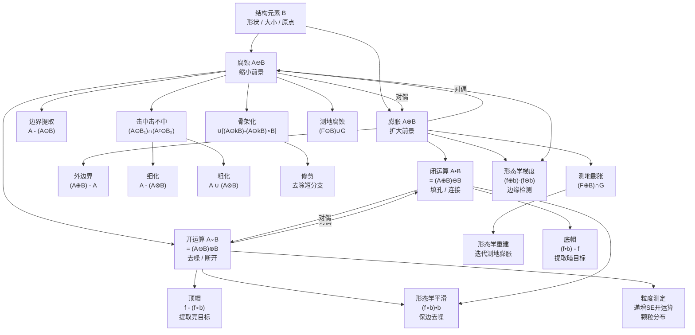

---

## 38. 速查表

### 38.1 二值形态学运算速查

| 运算 | 公式 | 效果 | OpenCV |
|---|---|---|---|
| 腐蚀 | $A \ominus B$ | 缩小前景 | `cv2.erode()` |
| 膨胀 | $A \oplus B$ | 扩大前景 | `cv2.dilate()` |
| 开运算 | $(A \ominus B) \oplus B$ | 去噪、断开 | `MORPH_OPEN` |
| 闭运算 | $(A \oplus B) \ominus B$ | 填孔、连接 | `MORPH_CLOSE` |
| 击中击不中 | $(A \ominus B_1) \cap (A^c \ominus B_2)$ | 模板匹配 | `MORPH_HITMISS` |
| 边界提取 | $A - (A \ominus B)$ | 提取边界 | `subtract(erode)` |
| 细化 | $A - (A \otimes B)$ | 细化为骨架 | 手动实现 |
| 粗化 | $A \cup (A \otimes B)$ | 加粗前景 | 手动实现 |
| 骨架化 | $\bigcup_k [(A \ominus kB) - (A \ominus kB) \circ B]$ | 提取骨架 | 手动实现 |
| 修剪 | 骨架后腐蚀+恢复 | 去除短分支 | 手动实现 |

### 38.2 灰度形态学运算速查

| 运算 | 公式 | 效果 | OpenCV |
|---|---|---|---|
| 灰度腐蚀 | $\min_{(s,t) \in b} f(x+s, y+t)$ | 亮区收缩 | `cv2.erode()` |
| 灰度膨胀 | $\max_{(s,t) \in \check{b}} f(x-s, y-t)$ | 亮区扩张 | `cv2.dilate()` |
| 灰度开 | $(f \ominus b) \oplus b$ | 去亮噪声 | `MORPH_OPEN` |
| 灰度闭 | $(f \oplus b) \ominus b$ | 去暗噪声 | `MORPH_CLOSE` |
| 顶帽 | $f - (f \circ b)$ | 提取亮目标 | `MORPH_TOPHAT` |
| 底帽 | $(f \bullet b) - f$ | 提取暗目标 | `MORPH_BLACKHAT` |
| 形态学梯度 | $(f \oplus b) - (f \ominus b)$ | 边缘检测 | `MORPH_GRADIENT` |
| 形态学平滑 | $(f \circ b) \bullet b$ | 保边去噪 | 组合调用 |
| 外梯度 | $(f \oplus b) - f$ | 外边界 | `subtract(dilate)` |
| 内梯度 | $f - (f \ominus b)$ | 内边界 | `subtract(erode)` |

### 38.3 结构元素速查

| 形状 | 常量 | 3×3 示例 | 适用 |
|---|---|---|---|
| 矩形 | `MORPH_RECT` | 全 1 | 通用 |
| 十字 | `MORPH_CROSS` | 十字形 | 保持对角 |
| 椭圆 | `MORPH_ELLIPSE` | 菱形/圆 | 各向同性 |
| 自定义 | 手动 | 任意 | 特定方向 |

### 38.4 典型应用速查

| 应用 | 推荐运算 | SE 选择 |
|---|---|---|
| 去除小噪声 | 开运算 | 略大于噪声 |
| 填充小孔洞 | 闭运算 | 略大于孔洞 |
| 边缘检测 | 形态学梯度 | 3×3 矩形 |
| 光照校正 | 顶帽变换 | 大于目标尺寸 |
| 提取亮目标 | 顶帽变换 | 大于目标尺寸 |
| 提取暗目标 | 底帽变换 | 大于目标尺寸 |
| 骨架提取 | 骨架化/细化 | 3×3 十字 |
| 分离粘连 | 距离变换+分水岭 | 视情况 |
| 去除边界物体 | 形态学重建 | 3×3 十字 |
| 颗粒分析 | 粒度测定 | 递增椭圆 |

---

## 39. 术语中英对照

| 英文 | 中文 | 符号 |
|---|---|---|
| Mathematical Morphology | 数学形态学 | — |
| Structuring Element (SE) | 结构元素 | $B$ |
| Erosion | 腐蚀 | $\ominus$ |
| Dilation | 膨胀 | $\oplus$ |
| Opening | 开运算 | $\circ$ |
| Closing | 闭运算 | $\bullet$ |
| Hit-or-Miss Transform | 击中击不中变换 | $\otimes$ |
| Boundary Extraction | 边界提取 | $\beta$ |
| Region Filling | 区域填充 | — |
| Connected Components | 连通分量 | — |
| Convex Hull | 凸壳 | $C$ |
| Thinning | 细化 | $\text{Thin}$ |
| Thickening | 粗化 | $\text{Thick}$ |
| Skeletonization | 骨架化 | $S$ |
| Pruning | 修剪 | — |
| Morphological Reconstruction | 形态学重建 | $R$ |
| Geodesic Dilation | 测地膨胀 | $\delta_G$ |
| Geodesic Erosion | 测地腐蚀 | $\varepsilon_G$ |
| Geodesic Distance | 测地距离 | $d_G$ |
| Top-Hat Transform | 顶帽变换 | — |
| Bottom-Hat / Black Top-Hat | 底帽变换 | — |
| Morphological Gradient | 形态学梯度 | — |
| Morphological Smoothing | 形态学平滑 | — |
| Granulometry | 粒度测定 | — |
| Pattern Spectrum | 粒度分布密度 | $P$ |
| Umbra | 阴影/下方区域 | $U$ |
| Top Surface | 上表面 | $\text{Top}$ |
| Duality | 对偶性 | — |
| Idempotent | 等幂性 | — |
| Extensive | 扩展性 | — |
| Anti-extensive | 反扩展性 | — |
| Increasing | 单调性 | — |
| Translation Invariance | 平移不变性 | — |
| Marker Image | 标记图像 | $F$ / $f$ |
| Mask Image | 掩膜图像 | $G$ / $g$ |
| Flat Structuring Element | 扁平结构元素 | — |
| Medial Axis Transform (MAT) | 中轴变换 | — |
| Opening by Reconstruction | 重建开运算 | $O_R$ |

---

## 40. 结论

数学形态学是一套以集合论为基础的非线性图像处理理论，其核心特点如下：

**1. 统一的数学框架**

所有形态学运算都建立在腐蚀和膨胀两个基本运算之上，通过不同的组合方式
（先腐蚀后膨胀、先膨胀后腐蚀、差集、交集等）衍生出丰富的运算体系。
二值形态学与灰度形态学通过 Umbra 概念统一在同一框架下。

**2. 非线性与边缘保持**

与线性滤波（卷积）不同，形态学运算基于极值操作（最大值/最小值），
不会模糊边缘。这使得形态学方法在边缘检测、形状分析等需要保持边缘的
场景中具有独特优势。

**3. 形状导向的滤波**

形态学运算的效果由结构元素的形状和大小决定，这使得形态学成为一种
"形状滤波器"——可以选择性地保留或去除特定形状和大小的结构，
这是线性滤波无法实现的。

**4. 从简单到复杂的层次体系**

形态学运算从基本的腐蚀/膨胀，到开/闭运算，再到击中击不中、细化、
骨架化、形态学重建，形成了一个从简单到复杂的层次体系。高级运算
（如重建）在保持物体形状完整性方面远优于基本运算。

**5. 广泛的应用领域**

形态学方法在图像去噪、边缘检测、形状分析、纹理分析、目标检测、
图像分割、医学影像、文档处理、材料科学等领域都有广泛应用，
是图像处理工具箱中不可或缺的组成部分。

**6. OpenCV 实践要点**

- OpenCV 的 `cv2.erode()`、`cv2.dilate()`、`cv2.morphologyEx()` 覆盖了
  大部分常用形态学运算。
- 结构元素通过 `cv2.getStructuringElement()` 创建，支持矩形、十字、椭圆
  三种形状，也支持自定义。
- 高级运算（细化、骨架化、形态学重建）需要手动实现或借助扩展模块
  `cv2.ximgproc`。
- `iterations` 参数对腐蚀/膨胀表示重复次数，但对开/闭运算不等价于多次独立运算。
- 灰度形态学与二值形态学使用相同的 API，区别仅在于输入图像类型。
