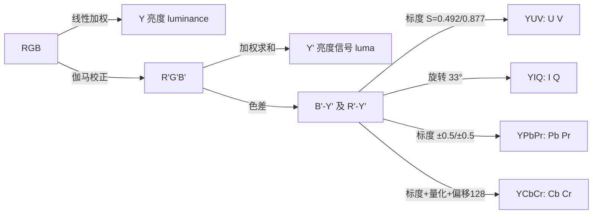
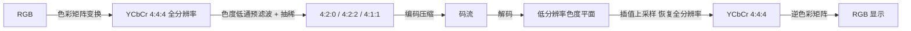

# YUV / YPbPr / YIQ / YCbCr 色彩家族与色度子采样（Chroma Subsampling）

> 本文回答三件事：
> 1. YUV、YPbPr、YIQ、YCbCr 这四个"亮度-色差"色彩空间是什么关系、各自用在哪儿；
> 2. 4:4:4 / 4:2:2 / 4:2:0 / 4:1:1 四种采样是如何实现的（含绘制图）；
> 3. 带撇的 **Y'**（luma，伽马校正后的亮度信号）与不带撇的 **Y**（luminance，线性光亮度）有什么区别。

---

## 0. 总览：一张表分清四个成员

| 名称 | 领域 | 类型 | 色差信号定义 | 典型场景 |
|---|---|---|---|---|
| **YUV** | 模拟（PAL 电视） | 复合/分量视频 | U = 0.492111·(B'−Y')，V = 0.877283·(R'−Y') | PAL 模拟电视广播、VHS 录像带 |
| **YIQ** | 模拟（NTSC 电视） | 复合视频 | I、Q 是 UV 旋转 33° 得到 | NTSC 模拟电视（北美/日本/台湾） |
| **YPbPr** | 模拟分量 | 分量视频 | Pb = 0.564·(B'−Y')，Pr = 0.713·(R'−Y')，±350 mV | DVD/碟机分量输出、SDI 的模拟端 |
| **YCbCr** | 数字 | 数字分量 | Cb = 128 + 0.564·(B'−Y')，Cr = 128 + 0.713·(R'−Y')（8-bit） | HDMI/DisplayPort、JPEG、H.26x、蓝光、流媒体 |
| （YDbDr） | 模拟（SECAM 电视） | 复合视频 | 与 UV 标度不同 | SECAM 模拟电视（法国/俄罗斯等） |

它们的共同思想都一样：**把颜色拆成"明暗 Y + 两个色差"，再针对人眼对色差不敏感的特性，对色差信号降分辨率/降带宽**。区别只在于"降"的方式：

- 数字成员（YCbCr）：**抽样丢弃色度样本**，即 4:x:x 记法；
- 模拟成员（YUV / YIQ / YPbPr）：**限制色度带宽**（低通滤波），不做网格抽样。

---

## 1. 四个成员是谁，关系如何

### 1.1 血统关系



- **YUV**：PAL 体系，U、V 是 (B'−Y')、(R'−Y') 按系数缩放，保证色差信号幅度落在 ±0.5 内，便于调制到色度副载波上。
- **YIQ**：NTSC 体系，把 UV 平面**旋转 33°** 得到 I、Q 轴。I 轴近似"橙→青"，Q 轴近似"紫→黄绿"。人眼对 I 轴颜色细节更敏感，所以 I 带宽给得宽（约 1.3 MHz）、Q 带宽给得窄（约 0.4 MHz）。
- **YPbPr**：模拟分量输出的标准标度：Pb/Pr 在 ±0.5（对应 ±350 mV），Y 在 0～1（700 mV）。**它本身不抽样**，分量线路上三路都全带宽。
- **YCbCr**：YPbPr 的数字化版本——先把 Pb/Pr 缩放到 ±0.5 再量化到 8/10/12 bit 并加 128 偏移（8-bit 时），Cb/Cr 的数值范围高电平映射像 16～240。**4:x:x 子采样就是发生在这一步**。

### 1.2 权重系数（Y 的各标准系数）

| 标准 | Kr (R) | Kg (G) | Kb (B) | 用途 |
|---|---|---|---|---|
| Rec.601 | 0.299 | 0.587 | 0.114 | SD 标清（720×576 / 720×480） |
| Rec.709 | 0.2126 | 0.7152 | 0.0722 | HD 高清（1080p 等） |
| Rec.2020 | 0.2627 | 0.6780 | 0.0593 | UHD 超高清（4K/8K） |

> 同一份 YCbCr 码流，如果解码矩阵（601 vs 709）选错，颜色会明显偏色——这是播放器常见的"颜色发灰/发绿"问题根源。

---

## 2. Y' 与 Y：亮度信号 vs 亮度

### 2.1 定义

| 记号 | 中文 | 公式（以 Rec.709 为例） | 输入 |
|---|---|---|---|
| **Y** | 亮度 luminance | Y = 0.2126R + 0.7152G + 0.0722B | 线性光 RGB |
| **Y'** | 亮度信号 luma | Y' = 0.2126R' + 0.7152G' + 0.0722B' | 伽马校正后 R'G'B' |

带撇号 `'` 表示"**已经过伽马（非线性）校正**"。这是 sRGB/Rec.709 里拍摄端做的第一步——感光元件的响应是线性的，显示端却是非线性的，所以要先做光电转换（OETF）再混合。

### 2.2 为什么实际存储/传输的是 Y' 而不是 Y

1. **简单**：解码端拿到 R'G'B' 直接按 601/709 系数加权重手可得 Y'，不需要先逆伽马；
2. **感知相关**：人眼对亮度的感知接近对数/幂曲线，在伽马域混合得到的 Y' 与"人眼看到多亮"相关性更好，量化误差被人眼放大的程度更小；
3. 真正意义的 Y（线性光亮度）只有在 HDR 色调映射、色彩管理（LUT）、亮度测量等环节才需要。

### 2.3 它们相等吗？——严格说不相等

- Y' 只是**感知近似**，不是光度学意义上的亮度；
- 想从 Y' 恢复出真实亮度 Y，需要先做逆伽马再算线性组合（还要注意三原色矩阵），不能直接 `Y = Y'^2.4` 一把梭（虽然近似可用来做粗略估计）；
- 换句话说：**Y 是物理量，Y' 是信号量**。摄像机的"亮度柱状图"、码流里存的"亮度分量"都是 Y'。

> 漏写撇号是行业常态：绝大多数资料里的 "YUV"、"Y 分量" 实际指的是 Y'。严格书写应写 `Y'CbCr`、`Y'PbPr`。

---

## 3. 采样记号 J:a:b 的含义

以 **4:2:2** 为例，三个数字的含义：

| 数字 | 含义 |
|---|---|
| **J = 4** | 水平参考宽度：每 4 个亮度（Y'）像素为一组 |
| **a = 2** | 在这 4 个像素的**第一行**中取几个色度样本（Cb、Cr 各取 a 个） |
| **b = 2** | **第二行**中取几个色度样本；`0` 表示第二行不采样（垂直减半） |

> 4:2:0 即 `(4,2,0)`：第一行每 4 个 Y' 有 2 个色度样本，第二行 0 个 → 色度在垂直方向隔行采样，相当于 2×2 像素块共享 1 组色度。

---

## 4. 四种采样的绘制图

约定：`●` = 有采样样本，`·` = 无样本。以 4×4 亮度像素块为例，分别画 Y' / Cb / Cr 三个平面：

````
● = 该位置有采样样本    · = 该位置无样本

┌────────────────────────────────────────────────────────────┐
│                 Y' 平面           Cb 平面           Cr 平面│
│                                                            │
│  4:4:4        ● ● ● ●          ● ● ● ●          ● ● ● ● │
│               ● ● ● ●          ● ● ● ●          ● ● ● ● │
│               ● ● ● ●          ● ● ● ●          ● ● ● ● │
│               ● ● ● ●          ● ● ● ●          ● ● ● ● │
│                                                            │
│  4:2:2        ● ● ● ●          ● · ● ·          ● · ● · │
│               ● ● ● ●          ● · ● ·          ● · ● · │
│               ● ● ● ●          ● · ● ·          ● · ● · │
│               ● ● ● ●          ● · ● ·          ● · ● · │
│                                                            │
│  4:1:1        ● ● ● ●          ● · · ·          ● · · · │
│               ● ● ● ●          ● · · ·          ● · · · │
│               ● ● ● ●          ● · · ·          ● · · · │
│               ● ● ● ●          ● · · ·          ● · · · │
│                                                            │
│  4:2:0        ● ● ● ●          ● · ● ·          ● · ● · │
│               ● ● ● ●          · · · ·          · · · · │
│               ● ● ● ●          ● · ● ·          ● · ● · │
│               ● ● ● ●          · · · ·          · · · · │
└────────────────────────────────────────────────────────────┘
````

> 注：4:2:0 上图展示的是 **左上角对齐（co-sited）** 形式（H.264/HEVC 常见）；JPEG/MPEG-1 用 **居中** 形式（色度点在 2×2 块中心），两者差半个像素相位。

### 4.1 从"每像素共享"角度再看一遍

````
●Y' = 保留亮度样本    Cb/Cr = 该组像素共享的色度样本

4:4:4  每一行:  ●Y' Cb Cr  ●Y' Cb Cr  ●Y' Cb Cr  ●Y' Cb Cr   ← 每像素 1 组色度
               ●Y' Cb Cr  ●Y' Cb Cr  ●Y' Cb Cr  ●Y' Cb Cr

4:2:2  每一行:  ●Y' Cb Cr  ●Y'        ●Y' Cb Cr  ●Y'          ← 每 2 像素共享 1 组
               ●Y' Cb Cr  ●Y'        ●Y' Cb Cr  ●Y'

4:1:1  每一行:  ●Y' Cb Cr  ●Y'        ●Y'        ●Y'          ← 每 4 像素共享 1 组
               ●Y' Cb Cr  ●Y'        ●Y'        ●Y'

4:2:0  奇数行:  ●Y' Cb Cr  ●Y'        ●Y' Cb Cr  ●Y'          ← 每 2×2 块共享 1 组
       偶数行:  ●Y'        ●Y'        ●Y'        ●Y'          ← 偶数行无色度样本
````

### 4.2 数据量对比（8-bit 深度）

| 格式 | 色度分辨率（相对亮度） | 每像素位深 | 相对 4:4:4 | 采样方式 |
|---|---|---|---|---|
| **4:4:4** | 1 × 1（完整） | 24 bit | 0%（基准） | 三平面全采样 |
| **4:2:2** | 1/2 × 1 | 16 bit | 节省 33% | 水平减半，垂直不变 |
| **4:1:1** | 1/4 × 1 | 12 bit | 节省 50% | 水平取 1/4，垂直不变 |
| **4:2:0** | 1/2 × 1/2 | 12 bit | 节省 50% | 水平、垂直各减半 |

> 有趣点：**4:1:1 与 4:2:0 数据量完全相同**（都 12 bit/px），区别只在"省在哪儿"：4:1:1 牺牲水平分辨率保留垂直细节；4:2:0 横竖各砍一半，更均衡，所以最终胜出。

### 4.3 10-bit 时的位深

| 格式 | 8-bit | 10-bit |
|---|---|---|
| 4:4:4 | 24 | 30 |
| 4:2:2 | 16 | 20 |
| 4:1:1 | 12 | 15 |
| 4:2:0 | 12 | 15 |

---

## 5. 采样的实际流程



1. **转换**：RGB → Y'CbCr 4:4:4（三平面全分辨率）；
2. **预滤波**：对 Cb/Cr 先低通滤波，防止抽稀后出现混叠（莫尔条纹/彩色锯齿）；
3. **抽稀**：按目标比例丢弃色度样本（对相邻 2 或 4 个像素取平均）——这一步才是"子采样"；
4. **存储/传输**：Y' 平面全保留，色度平面按低分辨率存；
5. **恢复**：解码端把低分辨率色度插值（常见双线性）回全分辨率，再逆矩阵回 RGB；
6. 因色差细节缺失全靠人眼"脑补"，观感几乎无损。

---

## 6. 是不是所有成员都有这四种比例？（用户常问）

**结论：这套 4:x:x 记法是"数字网格抽样"概念，严格讲只适用于数字 YCbCr；模拟成员不做网格抽样。**

| 成员 | 有没有 4:4:4/4:2:2/4:2:0/4:1:1？ | 说明 |
|---|---|---|
| **YCbCr（数字）** | ✅ 有，规范严格定义了 | HDMI、H.26x、JPEG、SDI 均按此记法标注 |
| **YPbPr（模拟分量）** | ⚠️ 传输本身无采样；其数字化承载（SDI）可标注 | 模拟端三路全带宽；若走 SDI/HDMI 数字通道，则可任选 4:4:4 / 4:2:2 / 4:2:0 |
| **YUV（模拟 PAL）** | ❌ 无此记法，但**有等价物**：带宽限制 | PAL 色度带宽约 1.3 MHz（亮度约 5 MHz），横向约砍到 1/4，性质近似"模拟 4:1:1"；某些 PAL 变体 U/V 带宽不等（近似模拟 4:2:2 不对称版） |
| **YIQ（模拟 NTSC）** | ❌ 无此记法，用**不等带宽**实现 | I 约 1.3 MHz、Q 约 0.4 MHz（亮度约 4.2 MHz）——I ≈ 亮度 1/3、Q ≈ 1/10，等效于"模拟 4:1:1 更狠的垂直分量" |

要点：

- **4:x:x 描述的是"样本网格"**，只有数字化（逐像素采样）才有意义；
- 模拟系统通过**低通滤波限制色度带宽**达到类似效果（说人话：数字是"抽样掉点"，模拟是"模糊掉高频"）；
- 所以"三种比例"（实际是四种：4:4:4 / 4:2:2 / 4:2:0 / 4:1:1）在 YCbCr 数字世界里是标准配置，模拟世界里只有"等效概念"。

---

## 7. 典型应用场景

| 格式 | 典型用途 |
|---|---|
| **4:4:4** | ProRes 4444、无损/近无损母版、专业调色、屏幕录制、医学影像、字幕/图形叠加 |
| **4:2:2** | 广播级制作（HD-SDI）、ProRes 422、专业摄像机（XAVC-I）、剪辑中间格式 |
| **4:1:1** | DV25（MiniDV 摄像机）、NTSC 数字电视——已基本淘汰 |
| **4:2:0** | 绝大多数消费级：H.264/H.265/VP9/AV1、JPEG、蓝光、流媒体、短视频平台 |

---

## 8. 易混点清单

- **YUV vs YCbCr**：YUV 严格指模拟（PAL），YCbCr 指数字；日常混用无妨，写文档时建议区分；
- **4:2:0 有两种相位**：居中（JPEG/MPEG-1/H.263）与左上对齐 co-sited（H.264 部分实现/硬件编码器）；互相转换要补偿半像素偏移，否则边缘偏色；
- **有限范围 vs 全范围**：8-bit YCbCr 电视标准用 16～235（Y）与 16～240（Cb/Cr），PC 用 0～255；换算错误会是"发灰/缺少纯黑纯白"；
- **Y 与 Y'**：前者线性光亮度（物理量），后者伽马域亮度信号（信号量）；码流里存的永远是 Y'；
- **矩阵选错**：601 视频当 709 解会整体偏色；
- **带 Alpha 的变体**：ProRes 4444 实际是 **4:4:4:4**（Y、Cb、Cr、A 四平面全采样）；还有 4:2:2:4、4:4:0 等冷门记法。

---

## 9. 一句话总结

- **家族**：YUV（PAL 模拟）→ YIQ（NTSC 模拟）→ YPbPr（模拟分量）→ YCbCr（数字分量），一路从"调制色差"演化到"采样色差"；
- **采样**：4:4:4 全保留，4:2:2 水平砍半，4:1:1 水平砍到 1/4，4:2:0 横竖各砍半（2×2 共享 1 组），后三者数据量分别为 4:4:4 的 2/3、1/2、1/2；
- **消费级主流**：4:2:0，10-bit ≈ 15 bit/px，是画质与体积的最优平衡点；
- **Y vs Y'**：一个物理量、一个信号量，码流里存的是 Y'。